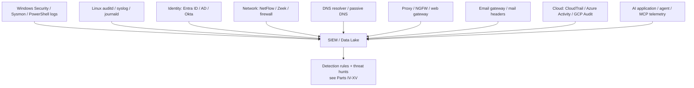

# Appendix A1 — Telemetry Field References

This appendix is a lookup, not a tutorial. Each table below gives you the identifier, the field
names an analyst or a detection rule actually keys on, and a pointer to the chapter that covers the
behavioural detection logic, false-positive patterns, and hunt variants built on top of that
telemetry. If you came here from a rule that references a field you don't recognize, start here;
if you want to know *why* a field matters or *what breaks* when you rely on it, go to the
cross-referenced chapter.

**Engineering Reality:** every table here describes the field as it appears in its *native* log
source (Windows Security channel, Zeek log, provider API). Once that event passes through a SIEM's
normalization/CIM/ECS mapping layer, the field name almost always changes, and normalization
pipelines routinely drop, rename, or silently null out fields that don't fit the target schema
cleanly (see the 4776-source-IP gap and the JA3/JA4 collision notes in the cross-referenced
chapters for two concrete examples of this). Treat every field name below as "what to look for at
the source," and verify the actual field name in your own pipeline before building a rule against
it — this is the single most common reason a rule that worked in testing produces zero hits in
production.

---

## A1.1 Windows Event ID Reference (see Part IV — Windows Detection Engineering)

| ID | Name | Log / Channel | Key fields |
|---|---|---|---|
| 4624 | Successful logon | Security | `TargetUserName`, `LogonType`, `AuthenticationPackageName`, `IpAddress`, `WorkstationName`, `TargetLogonId` |
| 4625 | Failed logon | Security | Same family as 4624 plus `Status`, `SubStatus` |
| 4648 | Logon with explicit credentials | Security | `SubjectUserName`, `TargetUserName`, `TargetServerName`, `ProcessName` |
| 4672 | Special privileges assigned to new logon | Security | `SubjectUserName`, `PrivilegeList`, `TargetLogonId` (shared with 4624) |
| 4688 | New process created | Security | `NewProcessName`, `CommandLine` (requires GPO), `ParentProcessName`, `SubjectLogonId`, `TokenElevationType` |
| 4103 | PowerShell module logging | Microsoft-Windows-PowerShell/Operational | `Payload`, `ContextInfo`, host/pipeline detail |
| 4104 | PowerShell script block logging | Microsoft-Windows-PowerShell/Operational | `ScriptBlockText`, `ScriptBlockId`, `Path` |
| 4768 | Kerberos TGT requested | Security (DC) | `TargetUserName`, `IpAddress`, `TicketEncryptionType`, `PreAuthType`, `Result Code` |
| 4769 | Kerberos service ticket requested | Security (DC) | `TargetUserName`, `ServiceName`/`ServiceSid`, `TicketEncryptionType`, `Result Code` |
| 4771 | Kerberos pre-authentication failed | Security (DC) | `TargetUserName`, `Failure Code`, `IpAddress` |
| 4776 | DC validated credentials (NTLM) | Security (DC) | `TargetUserName`, `Workstation`, `Error Code` — **no source IP field** |
| 4697 | Service installed | Security | Service name, `ImagePath`, account context |
| 4698 | Scheduled task created | Security | Task name, actions/triggers, creating account |
| 4702 | Scheduled task updated | Security | Same as 4698, prior vs. new action |
| 4719 | Audit policy changed | Security | `SubjectUserName`, changed subcategory/setting |
| 7045 | New service installed | System (SCM) | Service name, `ImagePath`, start type, account |
| 4720 | User account created | Security | `TargetUserName`, `SubjectUserName` |
| 4724 | Password reset attempt | Security | `TargetUserName`, `SubjectUserName` |
| 4728 | Member added to global group | Security | `MemberName`, `TargetDomainName` (group), `SubjectUserName` |
| 4732 | Member added to local group | Security | Same fields as 4728, local-group scope |
| 4740 | Account locked out | Security | `TargetUserName`, `Caller Computer Name` |
| 4798 | Local group membership enumerated | Security | `SubjectUserName`, `TargetUserName` |
| 4799 | Security-enabled local group enumerated | Security | `SubjectUserName`, group name |
| 1102 | Audit log cleared | Security | `SubjectUserName`, `SubjectLogonId` |

## A1.2 Windows Logon Types (see Part IV §1)

| Type | Name | One-line meaning |
|---|---|---|
| 2 | Interactive | Local console logon |
| 3 | Network | SMB/IPC$/remote WMI/PsExec-style auth — highest volume, least scrutinized |
| 4 | Batch | Scheduled task logon |
| 5 | Service | Service Control Manager logon |
| 7 | Unlock | Workstation unlock (not a new session) |
| 8 | NetworkCleartext | Network logon with credentials visible in cleartext to LSA |
| 9 | NewCredentials | `RunAs /netonly` |
| 10 | RemoteInteractive | RDP / Terminal Services |
| 11 | CachedInteractive | Cached domain credential logon, DC unreachable |

## A1.3 PowerShell Logging Reference (see Part IV §2, Part XIV §1)

| Mechanism | Event ID / Location | What it captures | Prerequisite |
|---|---|---|---|
| Module logging | 4103, PowerShell/Operational | Pipeline execution detail, cmdlet invocation | GPO: "Turn on Module Logging" |
| Script block logging | 4104, PowerShell/Operational | Actual code executed, including runtime-deobfuscated content | GPO: "Turn on PowerShell Script Block Logging" |
| Transcription | Text file at configured path (not Event Log) | Full session input/output transcript | GPO: "Turn on PowerShell Transcription", requires a writable, ideally centrally-collected output path |
| Command-line auditing (4688) | Security log | Invocation command line only, no de-obfuscated content | GPO: "Include command line in process creation events" |

**Engineering Reality:** without Script Block Logging explicitly enabled, 4688's command line is
the *only* PowerShell visibility you have, and it's the obfuscated/encoded version — see Part IV §2
for the full argument on why this one GPO setting is disproportionately high-value.

---

## A1.4 Sysmon Event ID Reference (see Part V — Sysmon as Detection Telemetry)

| ID | Name | Key fields | Typical volume |
|---|---|---|---|
| 1 | Process Creation | `Image`, `CommandLine`, `ParentImage`, `OriginalFileName`, `Hashes`, `IntegrityLevel`, `User` | Very high |
| 3 | Network Connection | `SourceIp`, `DestinationIp`, `DestinationPort`, `Protocol`, `Image`, `Initiated` | Very high |
| 6 | Driver Loaded | `ImageLoaded`, `Hashes`, `Signed`, `Signature` | Low |
| 7 | Image/DLL Loaded | `ImageLoaded`, `Image`, `Hashes`, `Signed` | Extreme |
| 8 | CreateRemoteThread | `SourceImage`, `TargetImage`, `StartAddress` | Low-moderate |
| 10 | Process Access | `SourceImage`, `TargetImage`, `GrantedAccess`, `CallTrace` (optional) | High if unscoped |
| 11 | File Create | `TargetFilename`, `Image`, `CreationUtcTime` | High |
| 12/13 | Registry Create/Delete (12), Value Set (13) | `TargetObject`, `Details` (13), `Image` | High if unscoped |
| 15 | FileCreateStreamHash (ADS / Zone.Identifier) | `TargetFilename`, `Hash`, `Contents` | Low-moderate |
| 17/18 | Named Pipe Created (17) / Connected (18) | `PipeName`, `Image`, `PID` | Moderate |
| 22 | DNS Query | `QueryName`, `QueryResults`, `Image` | Very high |
| 23 | File Delete | `TargetFilename`, `Image`, `IsExecutable`, `Archived` (if enabled) | High if unscoped |

---

## A1.5 Linux Telemetry Reference (auditd, syslog/journald, SSH, sudo)

Linux endpoint behavioural detection logic (LOLBin-equivalent abuse, persistence, credential
access) follows the same underlying principles worked through for Windows in Part XIV — Endpoint
Detection Engineering; this table is the Linux-specific field map those principles run against.

### auditd record types and fields

| Record type | Purpose | Key fields |
|---|---|---|
| `SYSCALL` | Every audited system call | `syscall`, `exe`, `pid`, `ppid`, `uid`, `gid`, `success`, `exit`, `key` (rule tag) |
| `EXECVE` | Full argv of an exec'd command | `argc`, `a0`, `a1`, ... `an` |
| `PATH` | File path touched by the syscall | `name`, `inode`, `mode` |
| `CWD` | Working directory at time of syscall | `cwd` |
| `USER_AUTH` / `USER_LOGIN` | Authentication attempt/result | `acct`, `exe`, `hostname`, `addr`, `res` (success/fail) |
| `USER_START` / `USER_END` | Session start/end (login sessions) | `acct`, `ses` (session ID) |
| `CRED_ACQ` / `CRED_DISP` | Credential acquisition/disposal (PAM) | `acct`, `exe` |
| `USER_CMD` | Command run via `sudo` (with auditd+PAM integration) | `cwd`, `cmd`, `terminal` |
| `ADD_USER` / `DEL_USER` | Account creation/deletion | `acct`, `id`, `exe` |
| `AVC` | SELinux denial | `scontext`, `tcontext`, `comm`, `permissive` |

**Join key:** `ses` (session ID) and `auid` (the *login* UID, distinct from `uid` which can change
under `su`/`sudo`) are the fields that let you correlate a chain of SYSCALL/EXECVE/PATH records
back to one human login session — the Linux equivalent of Windows' `Logon ID`. A detection that
filters on `uid` alone loses the original identity the moment an attacker uses `su` or `sudo` to
change effective UID.

### syslog / journald fields

| Field | Meaning |
|---|---|
| `PRIORITY` | Syslog severity (0=emerg … 7=debug) |
| `SYSLOG_FACILITY` | Subsystem code (`auth`, `authpriv`, `daemon`, `cron`, `kern`, etc.) |
| `SYSLOG_IDENTIFIER` | Program name that logged the message |
| `_PID`, `_UID`, `_GID` | Process/user/group of the logging process |
| `_COMM`, `_EXE` | Command name / full executable path |
| `_SYSTEMD_UNIT` | systemd unit responsible (service-level attribution) |
| `_HOSTNAME` | Emitting host |
| `MESSAGE` | Free-text log body — most SSH/sudo signal below lives here and needs pattern extraction |

### SSH (sshd) log lines — fields embedded in `MESSAGE`

| Pattern | Meaning |
|---|---|
| `Accepted publickey for <user> from <ip> port <port>` | Successful key-based auth |
| `Accepted password for <user> from <ip> port <port>` | Successful password auth (should be rare/disabled on hardened hosts) |
| `Failed password for <user> from <ip> port <port> ssh2` | Failed password attempt — the auditd/syslog equivalent of Windows 4625 for SSH |
| `Invalid user <user> from <ip>` | Attempt against a non-existent account — enumeration signal |
| `Disconnected from user <user> <ip> port <port>` | Session end |
| `pam_unix(sshd:auth): authentication failure` | PAM-level failure detail, often carries `rhost=` |

> **[SCREENSHOT PLACEHOLDER — CONTROLLED LAB]** — a captured `auth.log`/journald excerpt via SSH
> from a real Linux host (e.g., a Proxmox LXC container in a home-lab environment), showing a
> `Failed password` / `Accepted publickey` sequence with `sshd` PID and source IP fields, to
> illustrate the exact line format this table abstracts. Not captured in this drafting pass —
> reference for the controlled-lab evidence phase.

### sudo fields

| Field (from `sudo` log line / audit `USER_CMD`) | Meaning |
|---|---|
| `TTY` | Terminal the command ran from |
| `PWD` | Working directory at invocation |
| `USER` | Target user the command ran as (often `root`) |
| `COMMAND` | Full command and arguments |
| Invoking account (leading portion of the log line) | Who ran `sudo` |
| `ses` (if auditd/PAM integrated) | Session ID for correlation back to the login session |

**Hunter's Note:** on Linux, the single most-skipped join is `auid` (login UID) across `su`/`sudo`
boundary-crossing events. Analysts who filter auditd by current `uid` lose the attacker's original
identity the moment they escalate — build every Linux privilege-escalation hunt around `auid`
first, `uid` second.

---

## A1.6 Identity Telemetry Reference — Entra ID / AD (see Part VIII — Identity Detection Engineering)

AD-native event IDs (4624/4625/4768/4769/4728/4732/4662, etc.) are covered in A1.1 above and in
Part IV/VIII in depth. This table covers the cloud-IdP fields that don't have a Windows Event ID
equivalent.

| Field | Source | Purpose |
|---|---|---|
| `UserPrincipalName` | Entra sign-in logs | Account identity |
| `IPAddress`, `LocationDetails` (city/country/geoCoordinates) | Entra sign-in logs | Geolocation for impossible-travel/new-country logic |
| `DeviceDetail` (deviceId, OS, browser, trustType) | Entra sign-in logs | Device fingerprint/first-seen baseline |
| `AuthenticationDetails` (per-step method + result: push sent/declined/success) | Entra sign-in logs | MFA fatigue / push-bombing detection |
| `ConditionalAccessStatus`, `RiskLevelDuringSignIn`, `RiskState` | Entra sign-in logs | Native risk scoring to layer under custom detections |
| `ResultType` / `ResultDescription` | Entra sign-in logs | Numeric failure/success code (e.g., 50126 = invalid credentials) |
| `AppDisplayName`, `AppId`, `ResourceDisplayName` | Entra sign-in logs | What the sign-in was for — distinguishes interactive user sign-in from app/service-principal sign-in |
| `OperationName`, `Category`, `InitiatedBy`, `TargetResources` | Entra `AuditLogs` | Directory changes — consent grants, role assignment, app registration |
| Extended-rights GUIDs (`1131f6aa-…`, `1131f6ad-…`) | AD 4662 `Properties` field | DCSync detection — see Part VIII §11 |

---

## A1.7 Network Fields Reference — NetFlow / Zeek (see Part IX — Network Detection Engineering)

| Field | Zeek `conn.log` | NetFlow/IPFIX equivalent |
|---|---|---|
| Flow/session ID | `uid` | Flow record ID (vendor-specific) |
| Source/destination IP | `id.orig_h` / `id.resp_h` | `srcaddr` / `dstaddr` |
| Source/destination port | `id.orig_p` / `id.resp_p` | `srcport` / `dstport` |
| Protocol | `proto` | `protocol` |
| Bytes sent/received | `orig_bytes` / `resp_bytes` | `bytes` (often direction-specific in exported templates) |
| Packets | `orig_pkts` / `resp_pkts` | `packets` |
| Duration | `duration` | Derived from first/last-switched timestamps |
| Connection state / TCP flags | `conn_state`, `history` | `tcp_flags` |
| Service (protocol-detected, not just port) | `service` | Not native — requires DPI/enrichment |

Protocol-specific Zeek logs referenced throughout Part IX: `dns.log`, `ssl.log`, `x509.log`
(certificate detail, self-signed flag via SAN inspection), `ssh.log` (`auth_success`, `direction`,
`client`/`server` version strings), `smb_files.log`.

| TLS-specific field | Log | Purpose |
|---|---|---|
| `server_name` (SNI) | `ssl.log` | Plaintext destination hostname even over TLS (unless ECH) |
| `ja3` / `ja3s` | `ssl.log` (via plugin) | Client/server TLS fingerprint — collision-prone, treat as pivot not verdict |
| `cert_chain_fuids` | `ssl.log` → join to `x509.log` | Certificate detail: subject, issuer, validity window, self-signed |

---

## A1.8 DNS Fields Reference (see Part X — DNS Detection)

| Field | Meaning | Note |
|---|---|---|
| `query_name` (QNAME) | Domain queried | Case varies (DNS-0x20 randomization) — don't rely on stable case |
| `query_type` | Record type requested (A, AAAA, TXT, NULL, CNAME, …) | Unusual types (TXT/NULL at volume) are a tunnelling tell |
| `rcode` | Response code (NOERROR, NXDOMAIN, SERVFAIL, …) | NXDOMAIN bursts are a DGA/enumeration signal |
| `answers` | Resolved values returned | Needed for fast-flux rotation tracking |
| `TTL` | Time-to-live on the answer | Abnormally low/rotating TTLs support fast-flux detection |
| `client_ip` | Requesting host, if resolver logs it | Vantage-point dependent — see Part X's resolver-tier discussion |
| `EDNS`/`DNSSEC` flags | Resolver/software fingerprinting | Rarely useful for behavioural detection |

---

## A1.9 Proxy Fields Reference (see Part IX §7, Part XI — Web Detection Engineering)

| Field | Purpose |
|---|---|
| Method (`CONNECT`, `GET`, `POST`, etc.) | Distinguishes tunnel establishment from normal request |
| Requested URL / URI path | Content/behavior analysis, admin-panel scanning detection |
| Destination host / SNI | What the client is actually reaching, even over TLS |
| Category (vendor URL-categorization verdict) | Policy enforcement + coarse reputation |
| User identity (if proxy is identity-aware) | Attribution — critical for tying proxy hits back to a user, not just a NAT'd IP |
| User-Agent | Client fingerprinting; mismatches vs. claimed application are a tell |
| Status code | Success/failure/blocked |
| Bytes sent/received | Byte-ratio exfiltration logic (Part IX §12) |
| `X-Forwarded-For` | Real client IP behind the proxy — verify it's trusted/populated correctly, or source IP is wrong for every downstream detection |

---

## A1.10 Email Fields Reference — Headers and Authentication Results (see Part XII — Email Detection Engineering)

| Field | Location | Purpose |
|---|---|---|
| `5321.MailFrom` (envelope-from / Return-Path) | SMTP envelope | What SPF actually checks — not what the user sees |
| `From:` | Visible header | What the user sees; SPF does not validate this directly |
| `Reply-To:` | Header | Mismatch vs. `From:` domain is a classic BEC tell |
| `Message-ID` | Header | Uniqueness/consistency check across a campaign |
| `Received:` chain | Headers (multiple, oldest at bottom) | Hop-by-hop path reconstruction; each hop can be forged by anything upstream of the receiving MTA |
| `Authentication-Results:` | Header, added by receiving MTA | Carries `spf=`, `dkim=`, `dmarc=` verdicts (and `compauth=` on Microsoft 365) |
| `ARC-Authentication-Results:` | Header | Preserves original auth results through forwarding/mailing-list relay |
| `X-Originating-IP` | Header (non-standard, vendor-added) | Sometimes present, not guaranteed, easily spoofed if trusted blindly |
| DMARC policy (`p=none/quarantine/reject`) | DNS TXT record on sender domain | Enforcement level — `p=none` means report-only, spoofable with zero consequence |

**Cross-reference note:** SPF/DKIM passing individually proves very little — see Part XII's "Alert
on any SPF fail" Detection Autopsy for why DMARC *alignment* is the field that actually matters.

---

## A1.11 Cloud Logs Reference — CloudTrail / Azure Activity / GCP Audit Log (see Part XIII — Cloud Detection Engineering)

| Concept | AWS CloudTrail | Azure Activity Log | GCP Cloud Audit Log |
|---|---|---|---|
| Event/operation name | `eventName` | `operationName` | `protoPayload.methodName` |
| Event source/service | `eventSource` | `category` (Administrative, Security, …) | `protoPayload.serviceName` |
| Actor identity | `userIdentity` (type, arn, accountId, principalId) | `identity.claims` | `protoPayload.authenticationInfo.principalEmail` |
| Source IP | `sourceIPAddress` | `callerIpAddress` | `protoPayload.requestMetadata.callerIp` |
| Region/scope | `awsRegion` | resource ID (subscription/resource group embedded) | `resource.labels` |
| Result | `errorCode`/`errorMessage` (absent = success) | `resultType` | `protoPayload.status` |
| Request detail | `requestParameters` | `properties` | `protoPayload.request` |
| Response detail | `responseElements` | `properties` | `protoPayload.response` |
| Read vs. write / management vs. data event | `readOnly`, `eventType`, `managementEvent` | `category` | Log type: `activity`, `data_access`, `system_event`, `policy` |
| Timestamp | `eventTime` | `time` | `timestamp` |
| Correlation ID | `eventID` | `correlationId` | `insertId` / `protoPayload.requestId` |

**Engineering Reality (see Part XIII §13.1):** the four telemetry planes (management/control-plane
events, data-plane/resource access logs, network-flow logs, and configuration/posture snapshots)
are separately enabled, separately retained, and separately priced in every major cloud provider.
A CloudTrail trail existing does not mean S3 data-event logging is on; confirm each plane
independently before trusting "we have cloud logging" as a coverage statement.

---

## A1.12 AI Security Telemetry Reference (see Part XV — AI Security Detection Engineering)

| Field | Purpose |
|---|---|
| `user_id` / `session_id` / `conversation_id` | Attribution and session reconstruction |
| `auth_context` (interactive user / service account / delegated) | Distinguishes a human at a keyboard from an unattended agent |
| `prompt_metadata` (length, language, classification tags, injection-scanner verdict) | Anomalous prompt shape without storing raw content |
| `prompt_hash` | Correlate identical prompts across users/sessions without storing text |
| `data_classification` | Drives DLP-style rules on retrieved content and output |
| `uploaded_file_metadata` (filename, size, MIME/magic-byte type, SHA-256) | Malicious document upload detection without duplicating the AV/DLP store |
| `model_id` / `model_version` / `provider` / `endpoint` | Shadow-model use, behaviour-change tracking |
| `token_count`, `token_cost` | Quota abuse, agent-loop detection |
| `tool_call` (name, schema-validated arguments, invocation ID) | Core of agent/MCP-abuse detection |
| `tool_result` (status, size, classification) | Unusual result volume/sensitivity |
| `rag_documents_retrieved` (doc IDs, source, classification, retrieval score) | RAG poisoning and sensitive-retrieval detection |
| `external_connection` (destination, connector type, direction) | Unexpected egress from an AI app/agent |
| `agent_action_taken` (action type, target system/identifier) | Reconstructs what the agent actually *did*, not just what it said |
| `human_approval_status` | Governance trail for human-in-the-loop controls |
| `output_destination` | Exfiltration-path detection |
| `refusal/safety_filter_verdict` | Track blocked vs. allowed borderline requests |

**Cross-reference note:** almost none of this is emitted by off-the-shelf AI platforms today — see
Part XV's "What an AI-Enabled Application Should Log" section for the argument that getting this
schema into the platform team's backlog is the actual prerequisite work, not an optional nice-to-have.

---

## Summary: Where to Go Next

| If you're looking at... | Go to |
|---|---|
| A specific Windows Event ID's detection logic, false positives, evasion | Part IV |
| Sysmon config tradeoffs, noise levels, exclusion strategy | Part V |
| Password spray / MFA fatigue / Kerberoasting / DCSync detection logic | Part VIII |
| Beaconing math, port scanning, exfiltration byte-ratio analytics | Part IX |
| DGA/tunnelling/fast-flux scoring detail | Part X |
| SQLi/XSS/web shell/credential stuffing detection logic | Part XI |
| SPF/DKIM/DMARC, BEC, QR phishing detection logic | Part XII |
| Cloud IAM abuse, logging-disabled detection, storage exposure | Part XIII |
| LOLBin, ransomware precursor, EDR-tamper detection logic | Part XIV |
| Prompt injection, RAG poisoning, MCP abuse detection logic | Part XV |
