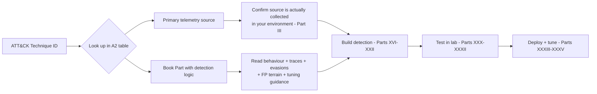

# Appendix A2 — MITRE ATT&CK Detection Mapping

This appendix is a navigation tool, not a detection library. It answers two questions fast: "if
I'm asked to cover technique T1XXX, what telemetry do I actually need, and which Part of this book
works through the detection logic in depth?" Nothing here is a rule you can paste into production.
Every row is a pointer into a chapter that does the actual work — behaviour, traces, evasions,
false-positive terrain, tuning.

[CONCEPT] ATT&CK gives you a technique ID and a one-line description of adversary behaviour. It
does not tell you what that behaviour looks like in your logs, whether your current pipeline
retains the field you'd need, or how many legitimate admin tools produce the same footprint. That
gap is the whole subject of this book. Treat the table below as an index, not an answer key.

[MANAGEMENT] If you're building or reviewing a coverage matrix for leadership, do not report
coverage at the technique-ID level and stop there. "We detect T1003" can mean anything from "we
alert on every LSASS handle open with `PROCESS_VM_READ`" to "we have a saved search nobody runs."
Coverage claims need a maturity qualifier — see Part XXXVI (Detection Coverage Matrix) and Appendix
A5 for the matrix template this table feeds into.

## How to read this table

- **Tactic** — the ATT&CK tactic the technique is filed under (a technique can appear under more
  than one tactic in the actual framework; we list the most common context used in this book).
- **Primary telemetry source(s)** — the log/event source that carries the *strongest* signal for
  detecting the technique. Secondary/corroborating sources are discussed in the linked Part, not
  listed here.
- **Part (in-depth coverage)** — where the behaviour, detection logic, evasions, and tuning
  guidance live.

Technique IDs and names below are drawn from MITRE ATT&CK (Enterprise matrix) and are limited to
techniques and sub-techniques the author is confident are correctly named and numbered as of the
last framework revisions reflected in this book's research. Where a specific sub-technique number
isn't given, treat the parent technique row as covering the family generally — the linked Part
will name the specific sub-techniques it drills into.

| Technique ID | Technique Name | Tactic | Primary Telemetry Source(s) | Part (in-depth coverage) |
|---|---|---|---|---|
| T1566 | Phishing | Initial Access | Email gateway / mail flow logs, EDR process creation | Part XII — Email Detection Engineering |
| T1566.001 | Spearphishing Attachment | Initial Access | Email attachment/sandbox verdicts, Sysmon process creation (Office → child process) | Part XII — Email Detection Engineering |
| T1190 | Exploit Public-Facing Application | Initial Access | Web server access/error logs, WAF logs, application logs | Part XI — Web Detection Engineering |
| T1078 | Valid Accounts | Initial Access / Persistence / Privilege Escalation / Defense Evasion | Authentication logs (Windows Security 4624/4625), IdP sign-in logs | Part VIII — Identity Detection Engineering |
| T1059 | Command and Scripting Interpreter | Execution | Process creation logs (Sysmon Event ID 1 / Security 4688), command-line auditing | Part VII — Command Line Detection |
| T1059.001 | PowerShell | Execution | PowerShell Script Block Logging (4104), Module Logging (4103), Sysmon 1 | Part VII — Command Line Detection |
| T1204 | User Execution | Execution | EDR process creation, email attachment telemetry, browser download logs | Part II — How Attacks Become Data |
| T1053 | Scheduled Task/Job | Execution / Persistence | Windows Security 4698/4702, Sysmon Event ID 1 (schtasks.exe) | Part VI — Process Tree Detection |
| T1047 | Windows Management Instrumentation | Execution | Sysmon Event ID 19–21 (WMI), process creation for `wmic.exe`/`WmiPrvSE.exe` | Part VI — Process Tree Detection |
| T1547 | Boot or Logon Autostart Execution | Persistence | Registry modification telemetry (Sysmon 12–14), Autoruns-style baselining | Part V — Sysmon as Detection Telemetry |
| T1136 | Create Account | Persistence | Windows Security 4720 (local), Azure AD/Entra audit logs (cloud) | Part VIII — Identity Detection Engineering |
| T1098 | Account Manipulation | Persistence / Privilege Escalation | Windows Security 4738/4728/4732, directory service change logs | Part VIII — Identity Detection Engineering |
| T1055 | Process Injection | Privilege Escalation / Defense Evasion | Sysmon Event ID 8 (CreateRemoteThread), Event ID 10 (ProcessAccess) | Part VI — Process Tree Detection |
| T1548 | Abuse Elevation Control Mechanism | Privilege Escalation / Defense Evasion | Sysmon process creation with elevation context, Windows Security 4672 | Part VI — Process Tree Detection |
| T1070 | Indicator Removal | Defense Evasion | Windows Security 1102 (audit log cleared), Sysmon Event ID 1 for log-clearing tools | Part IV — Windows Detection Engineering |
| T1027 | Obfuscated Files or Information | Defense Evasion | Command-line auditing, EDR script content capture | Part VII — Command Line Detection |
| T1218 | System Binary Proxy Execution | Defense Evasion | Process creation (parent/child lineage for signed OS binaries) | Part VI — Process Tree Detection |
| T1036 | Masquerading | Defense Evasion | Process creation with file path/hash/signature metadata | Part VI — Process Tree Detection |
| T1003 | OS Credential Dumping | Credential Access | Sysmon Event ID 10 (LSASS process access), EDR memory-access telemetry | Part IV — Windows Detection Engineering |
| T1003.001 | LSASS Memory | Credential Access | Sysmon Event ID 10 with `GrantedAccess` on `lsass.exe` | Part IV — Windows Detection Engineering |
| T1110 | Brute Force | Credential Access | Windows Security 4625, IdP/VPN authentication failure logs | Part VIII — Identity Detection Engineering |
| T1558 | Steal or Forge Kerberos Tickets | Credential Access | Windows Security 4769 (service ticket requests), domain controller logs | Part VIII — Identity Detection Engineering |
| T1558.003 | Kerberoasting | Credential Access | Windows Security 4769 with RC4 (etype 0x17) on service accounts | Part VIII — Identity Detection Engineering |
| T1552 | Unsecured Credentials | Credential Access | File access telemetry, EDR file-read events, config/scripting repos | Part III — Telemetry Engineering |
| T1082 | System Information Discovery | Discovery | Process creation (`systeminfo`, `hostname`, `whoami`) | Part VI — Process Tree Detection |
| T1087 | Account Discovery | Discovery | Process creation (`net user`, `net group`), directory query logs | Part VIII — Identity Detection Engineering |
| T1018 | Remote System Discovery | Discovery | Process creation (`net view`, `nltest`), network flow logs | Part IX — Network Detection Engineering |
| T1021.001 | Remote Desktop Protocol | Lateral Movement | Windows Security 4624 logon type 10, RDP session telemetry | Part VIII — Identity Detection Engineering |
| T1021.002 | SMB/Windows Admin Shares | Lateral Movement | Windows Security 5140/5145, Sysmon Event ID 3 (network connection) | Part IX — Network Detection Engineering |
| T1071.004 | Application Layer Protocol: DNS | Command and Control | DNS query/response logs | Part X — DNS Detection |
| T1105 | Ingress Tool Transfer | Command and Control | Proxy/firewall logs, Sysmon Event ID 3, EDR file-write on download | Part IX — Network Detection Engineering |
| T1572 | Protocol Tunneling | Command and Control | Network flow logs, proxy logs, TLS metadata | Part IX — Network Detection Engineering |
| T1567 | Exfiltration Over Web Service | Exfiltration | Proxy/web logs, cloud app access logs | Part XI — Web Detection Engineering |
| T1486 | Data Encrypted for Impact | Impact | Sysmon Event ID 11 (file create/rename mass events), EDR file-system telemetry | Part XLVII — Ransomware Detection Engineering |
| T1490 | Inhibit System Recovery | Impact | Windows Security/Sysmon process creation for `vssadmin`/`wbadmin`/`bcdedit` | Part XLVII — Ransomware Detection Engineering |

That's 34 techniques across ten tactics. It is deliberately not exhaustive — ATT&CK Enterprise has
several hundred technique and sub-technique entries. This is the set a working detection engineer
hits constantly enough to memorize the telemetry source for, plus enough tactic spread to use this
appendix as a template for extending your own internal mapping.



**Hunter's Note** — this table tells you where to *start* a hunt, not where to stop one. A
technique ID is a behaviour category, not a signature. If you're hunting T1021.002 and you only
look at 4624/type-3 logon volume, you'll miss admin-share lateral movement that never triggers an
interactive logon event at all — the access shows up as an anonymous or service-account network
logon (type 3) with SMB tree-connect activity in Sysmon Event ID 3, not always paired cleanly with
a 4624 you can pivot from. Read the linked Part before you build a query off this table alone.

## Detection Autopsy: "Alert on any process that opens a handle to lsass.exe"

**Original logic.** A rule shipped years ago in more than one SIEM content pack: fire an alert
whenever Sysmon Event ID 10 (ProcessAccess) records a `TargetImage` of `lsass.exe`, full stop.

**Why it looked reasonable.** T1003.001 (LSASS Memory) is one of the highest-value credential
theft techniques an intruder can execute, and LSASS process access is, on its face, the exact
observable ATT&CK describes. The rule maps cleanly to a single technique and a single event ID —
it reads like a complete detection.

**What breaks in production.** Every antivirus and EDR agent on the box opens a handle to
`lsass.exe` routinely as part of normal protection scanning. Windows Defender, backup agents that
snapshot process memory for crash reporting, Task Manager and Process Explorer when a user right-
clicks a process for "Properties," and diagnostic tools like ProcDump used *legitimately* by IT for
unrelated troubleshooting all generate this event. On an endpoint fleet of any size this rule fires
constantly.

**False positives.** Dozens to hundreds per day per 1,000 endpoints, dominated by security tooling
itself. Analysts fatigue on it within a week and either mute the rule or stop reading it, which
means the one real Mimikatz/`comsvcs.dll` MiniDump invocation in the noise gets missed.

**False negatives.** Attackers who dump LSASS via a driver, via a legitimate signed tool already
allow-listed by the very EDR that would otherwise flag it (e.g. abusing a vendor's own dump
utility), or who read memory through a technique that doesn't produce a Sysmon 10 event at all
(direct syscalls bypassing the ETW provider Sysmon subscribes to) sail through untouched. The rule
gives a false sense of coverage for T1003.001 while missing its more evasive variants entirely.

**Missing context.** The naive version never looks at `GrantedAccess` (the access mask requested —
full memory read like `0x1010` or `0x1410` is materially different from a narrow query-limited
handle), never checks whether the `SourceImage` is on an allow-list of known security/backup
tooling, and never correlates with process ancestry (a handle opened by a process spawned from
`cmd.exe`/`powershell.exe` under a user session is a very different story than one opened by a
service running as `NT AUTHORITY\SYSTEM` at boot).

**Revised analytic (illustrative Sigma-style logic, not verified against a live ruleset):**

```yaml
title: Suspicious LSASS Memory Access (Non-Allowlisted Process, High-Risk Access Mask)
status: experimental
logsource:
  category: process_access
  product: windows
detection:
  selection:
    TargetImage|endswith: '\lsass.exe'
    GrantedAccess|contains:
      - '0x1010'
      - '0x1410'
      - '0x1438'
  filter_known_tools:
    SourceImage|endswith:
      - '\MsMpEng.exe'
      - '\SenseIR.exe'
      - '\ProcessExplorer.exe'
      - '\taskmgr.exe'
  filter_allowlisted_hash:
    SourceHash|in:
      - <known-good backup/EDR tool SHA256 list, maintained per environment>
  condition: selection and not 1 of filter_*
fields:
  - SourceImage
  - SourceProcessId
  - GrantedAccess
  - TargetImage
falsepositives:
  - Backup and endpoint-protection tooling not yet allow-listed
  - IT diagnostic tools used interactively by helpdesk staff
level: high
```

**How it was tested.** In a controlled lab (isolated Windows host, no production data), the
original broad rule was left running for a baseline period alongside the revised version against
identical Sysmon telemetry, then a credential-dumping tool was run to confirm true-positive
firing, and standard admin/AV activity was run to confirm the allow-list suppressed the expected
noise.

**Result.** Alert volume from this single rule dropped by roughly two orders of magnitude in
testing (the exact ratio is environment-dependent — the allow-list has to be built and maintained
per fleet, which is real ongoing work, not a one-time fix). Part IV works through the full access-
mask reference table and the allow-list maintenance problem in detail.

## Worked example: hunting T1558.003 (Kerberoasting) beyond the alert

[ANALYST] The textbook signal is a spike of Windows Security Event ID 4769 (Kerberos service
ticket request) using RC4 encryption (`0x17`) against service accounts, because RC4 tickets are
crackable offline while AES tickets are not. A detection engineer builds a threshold rule on that.
A threat hunter doesn't stop there — they look for the attacker who requested tickets slowly, one
account at a time, spread over days specifically to stay under a per-hour threshold.

**Illustrative KQL (conceptual, not guaranteed to run unmodified against your schema):**

```kql
SecurityEvent
| where EventID == 4769
| where TicketEncryptionType == "0x17"
| where TargetUserName !endswith "$"          // exclude computer accounts
| summarize RequestCount = count(), DistinctSPNs = dcount(ServiceName),
            FirstSeen = min(TimeGenerated), LastSeen = max(TimeGenerated)
        by TargetAccount = SubjectUserName
| where RequestCount > 3 or DistinctSPNs > 2
| order by RequestCount desc
```

[THREAT HUNTER] Widen the aggregation window to 14–30 days and drop the count threshold to look for
*any* account that has never requested an RC4 service ticket before doing so now — a first-time
occurrence is a stronger signal than a raw count once an environment has been baselined (Part XXV —
Baselining). Also check whether `msDS-SupportedEncryptionTypes` was recently changed on the target
service accounts — an attacker who can't get RC4 naturally sometimes downgrades the account's
supported encryption types first, which is its own detectable event (4738) worth correlating.

**What legitimate activity looks similar.** Legacy applications and some older service accounts
still request RC4 tickets by design, particularly where AES wasn't enabled during account
creation. A one-time historical baseline of "which service accounts normally request RC4" is
required before this becomes a low-noise detection — otherwise every legacy app account looks like
an ongoing Kerberoasting campaign.

**What's often missing.** Domain controller Security event forwarding is inconsistent in many
environments — some orgs only forward from a subset of DCs, which silently blinds this detection
for authentication against the unmonitored ones. Confirm forwarding coverage across *all* DCs
before trusting a "no alerts" result as "no Kerberoasting."

> **[SCREENSHOT PLACEHOLDER — CONTROLLED LAB]** — a Windows Security Event Log capture of Event ID
> 4769 from a domain controller in an isolated lab domain, showing the `TicketEncryptionType`,
> `ServiceName`, and `TargetUserName` fields that this detection and hunt query key on.

## Engineering Reality

Windows Security Event Log alone does not carry sub-technique-level granularity for most of the
techniques in this table. `4688` (process creation) with command-line auditing enabled gives you
the process name and arguments, not the intent — telling `T1059.001` (PowerShell) apart from
ordinary PowerShell administration requires Script Block Logging (4104) or EDR telemetry, and a lot
of environments still don't have that turned on because of the log volume it generates. Before you
promise a stakeholder "we cover T1003.001," check that Sysmon (or an EDR with equivalent kernel
visibility) is actually deployed and *not excluded* on the servers that host authentication
services — LSASS-heavy detections are worthless on a domain controller that has Sysmon disabled
"for performance."

## SOC Management View

A technique-count coverage report ("we cover 180 of 200 ATT&CK techniques") is close to
meaningless without a maturity tier attached to each row — see the difference between "we have a
rule" and "we have a tested, tuned, alert-worthy rule with an owner" in Part XXXVI. Use this
appendix's table as the *telemetry dependency* layer of that maturity model: before funding a new
detection for a technique, confirm the primary telemetry source in this table is (a) collected,
(b) retained long enough to investigate, and (c) not silently dropped by a parser upstream (Part
XLI/XLII). A coverage matrix built on techniques whose source telemetry isn't actually flowing is a
governance liability, not an asset — it tells leadership something is true that isn't.

## Cross-references

- Appendix A1 — field-level reference for every event ID/log field named in the table above.
- Appendix A3 — Sigma/KQL/SPL/AQL/YARA-L syntax quick reference for writing the detections these
  techniques map to.
- Appendix A5 — coverage matrix and telemetry matrix templates that consume this table as an input.
- `MITRE-COVERAGE.md` and `TELEMETRY-MATRIX.md` at the repository root — the machine-tracked
  versions of this mapping, kept in sync with each Part as it's written.
