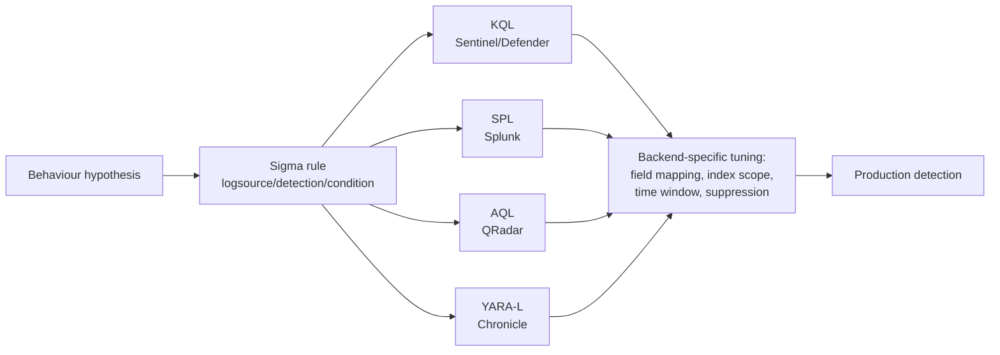

# Appendix A3 — Query Language Quick Reference

This appendix is a condensed syntax reference, not a tutorial. It assumes you've read the relevant
chapters in Parts XVII-XXII where each language's semantics, performance characteristics, and
failure modes were covered in depth. Use this as a lookup table when you're switching between
languages mid-shift — e.g. porting a Sigma rule to KQL for Sentinel, or translating an SPL hunt
into AQL for a QRadar deployment.

Five languages, five different execution models:

| Language | Native platform | Execution model | Primary use in this book |
|---|---|---|---|
| Sigma | Vendor-neutral (compiled to backend) | Declarative rule → backend query translation | Detection-as-code, sharing rules across SIEMs |
| KQL | Microsoft Sentinel / Defender / Log Analytics | Pipe-delimited tabular operators | Cloud/M365/Sentinel-native detection and hunting |
| SPL | Splunk | Pipe-delimited search + stats commands | On-prem/hybrid SIEM, large-scale ad hoc hunting |
| AQL | IBM QRadar | SQL-like, event/flow-oriented | QRadar detection rules and offense triage |
| YARA-L | Google Chronicle / SecOps | Event-matching with outcome variables | Chronicle detection rules, UDM-based correlation |



**Engineering Reality:** Sigma's "write once, run anywhere" promise breaks down at the field-mapping
layer more than at the syntax layer. The `sigmac`/`pySigma` translation gets the logic right; it's
your `fieldmappings.yaml` — whether `CommandLine` in your SIEM is actually populated, actually
called `CommandLine`, and actually contains the full string rather than a truncated 1024-byte
chunk — that determines whether the translated rule fires on anything at all. Never trust a
translated rule without validating field mappings against a live sample event first.

---

## 1. Sigma

Sigma is not queried directly — it's compiled to a backend. The core structural elements:

| Element | Purpose | Notes |
|---|---|---|
| `title` / `id` | Human name + stable UUID | UUID never changes across revisions |
| `status` | `stable` / `test` / `experimental` / `deprecated` | Gate for auto-deployment pipelines |
| `logsource` | `category`, `product`, `service` | Determines which backend index/table it compiles against |
| `detection.selection*` | Named field-match blocks | Multiple selections combined by name in `condition` |
| `detection.condition` | Boolean expression over selection names | Supports `and`, `or`, `not`, `1 of`, `all of`, wildcards (`1 of selection_*`) |
| `falsepositives` | Known legitimate matches | Not machine-enforced — analyst/tuning guidance only |
| `level` | `informational` / `low` / `medium` / `high` / `critical` | Maps to alert severity/routing, not confidence |
| `tags` | MITRE ATT&CK technique IDs, other taxonomy | `attack.t1055`, `attack.execution`, etc. |

**CONCEPTUAL SAMPLE — Sigma rule (illustrative):**

```yaml
title: Suspicious LSASS Access by Non-Standard Process
id: 5f3b1a2c-88e1-4e2a-9c11-example0001
status: test
logsource:
  category: process_access
  product: windows
detection:
  selection_target:
    TargetImage|endswith: '\lsass.exe'
  selection_access:
    GrantedAccess|contains:
      - '0x1010'
      - '0x1410'
  filter_known_good:
    SourceImage|endswith:
      - '\MsMpEng.exe'
      - '\werfault.exe'
  condition: selection_target and selection_access and not filter_known_good
falsepositives:
  - EDR agent memory scanning
  - Crash-dump generation by werfault.exe
level: high
tags:
  - attack.t1003.001
  - attack.credential-access
```

[DETECTION ENGINEER] The `condition` line is where most translation bugs hide. `not filter_known_good`
excludes matches — if `filter_known_good` is itself misspelled or the field doesn't exist in a given
backend's schema, pySigma will silently produce a condition that never excludes anything, and you
get a flood of known-good matches instead of a quiet rule. Always test the compiled output against
both a true positive and a known false positive sample before deploying.

---

## 2. KQL (Kusto Query Language)

Pipe-delimited, left-to-right, each operator narrows or reshapes the tabular result.

| Operator | Purpose | Illustrative syntax |
|---|---|---|
| `where` | Row filter | `where EventID == 4688` |
| `project` | Select/rename columns | `project TimeGenerated, Account, ProcessName` |
| `extend` | Add computed column | `extend ParentName = tostring(split(ParentProcessName, '\\')[-1])` |
| `summarize` | Aggregate | `summarize count() by Account, bin(TimeGenerated, 1h)` |
| `join` | Combine tables | `join kind=inner (OtherTable) on $left.Account == $right.Account` |
| `let` | Named variable/subquery | `let susp_procs = dynamic(["rundll32.exe","mshta.exe"]);` |
| `make-series` / `render` | Time-series shaping | Used for trend/anomaly baselining, not covered in depth here |
| `parse` | Regex-lite field extraction | `parse CommandLine with * "-enc " b64Payload` |

**CONCEPTUAL SAMPLE — KQL, illustrative (Sentinel/Defender schema names may vary by table version):**

```kusto
let SuspiciousParents = dynamic(["winword.exe","excel.exe","outlook.exe"]);
DeviceProcessEvents
| where InitiatingProcessFileName in~ (SuspiciousParents)
| where FileName in~ ("powershell.exe","cmd.exe","mshta.exe","wscript.exe")
| extend CmdLen = strlen(ProcessCommandLine)
| where CmdLen > 200 or ProcessCommandLine has_any ("-enc","-e ","FromBase64String")
| project TimestampUTC = Timestamp, DeviceName, AccountName, InitiatingProcessFileName,
          FileName, ProcessCommandLine, CmdLen
| summarize Occurrences = count(), Devices = make_set(DeviceName) by AccountName, FileName
| where Occurrences >= 1
```

[THREAT HUNTER] Swap the final `where Occurrences >= 1` filter for a `summarize ... by bin(Timestamp, 1d)`
and render a time-series when you're baselining — you want to know if this pattern is a once-a-quarter
macro-enabled invoice process before you tune the rule to "office app spawns script interpreter,
alert always."

---

## 3. SPL (Search Processing Language)

Pipe-delimited like KQL, but with a stronger raw-search-first culture and a separate accelerated
path (`tstats`) for indexed/summary data.

| Command | Purpose | Illustrative syntax |
|---|---|---|
| `search` (implicit) | Base filter over index | `index=win_security EventCode=4688` |
| `stats` | Aggregate | `stats count by user, dest` |
| `eval` | Computed field | `eval cmd_len=len(CommandLine)` |
| `rex` | Regex field extraction (inline) | `rex field=CommandLine "-enc\s+(?<b64>\S+)"` |
| `tstats` | Query accelerated data models (fast, no raw event scan) | `tstats count from datamodel=Endpoint.Processes where ...` |
| `transaction` | Group related events into sessions | Expensive at scale — prefer `stats` + `eval` where possible |
| `lookup` | Enrich with external table (e.g. threat intel, asset list) | `lookup threat_intel_ip.csv ip AS dest_ip OUTPUT verdict` |

**CONCEPTUAL SAMPLE — SPL, illustrative:**

```spl
| tstats count min(_time) as firstTime max(_time) as lastTime
  from datamodel=Endpoint.Processes
  where Processes.parent_process_name IN ("winword.exe","excel.exe","outlook.exe")
        Processes.process_name IN ("powershell.exe","cmd.exe","mshta.exe","wscript.exe")
  by Processes.dest, Processes.user, Processes.process_name, Processes.process
| eval cmd_len=len(process)
| where cmd_len > 200 OR match(process, "(?i)-enc|FromBase64String")
| rex field=process "-enc\s+(?<b64_blob>\S+)"
| stats count values(process) as commands by dest, user, process_name
| where count >= 1
```

**Hunter's Note:** `tstats` only sees what's already in the accelerated data model. If your CIM
mapping for `Processes.process` truncates the command line, or the sourcetype isn't mapped into
the Endpoint data model at all, `tstats` returns clean, confident, and completely wrong (empty)
results — with no error. Cross-check any zero-hit `tstats` query against a raw `search` over the
same time window before concluding "no activity."

---

## 4. AQL (Ariel Query Language — QRadar)

SQL-like, oriented around QRadar's `events` and `flows` Ariel databases.

| Clause | Purpose | Illustrative syntax |
|---|---|---|
| `SELECT` | Fields/functions to return | `SELECT sourceip, username, "Event Name"` |
| `FROM` | `events` or `flows` | `FROM events` |
| `WHERE` | Filter | `WHERE "Event Name" ILIKE '%Logon Failure%'` |
| `GROUP BY` | Aggregation grouping | `GROUP BY sourceip, username` |
| `COUNT` / `UNIQUECOUNT` | Aggregate functions | `COUNT(*)`, `UNIQUECOUNT(sourceip)` |
| `LAST <n> DAYS` / `START ... STOP ...` | Time window | `LAST 7 DAYS` |
| `HAVING` | Post-aggregation filter | `HAVING COUNT(*) > 10` |

**CONCEPTUAL SAMPLE — AQL, illustrative:**

```sql
SELECT
  sourceip,
  username,
  UNIQUECOUNT(destinationip) AS distinct_targets,
  COUNT(*) AS attempt_count
FROM events
WHERE "Event Name" ILIKE '%Logon Failure%'
  AND logsourcename(logsourceid) ILIKE '%Windows Security%'
GROUP BY sourceip, username
HAVING UNIQUECOUNT(destinationip) > 5 AND COUNT(*) > 20
LAST 1 HOURS
```

[DETECTION ENGINEER] This is the AQL shape of a classic password-spray hunt: one account, many
destinations, high failure count, short window — distinguishing it from a single-target brute
force (`UNIQUECOUNT(destinationip)` near 1, high `COUNT(*)`) and from normal lockout noise (low
counts on both). Tune the thresholds against your own authentication baseline; a shared service
account hitting 30 hosts in an hour might be a legitimate scanning/patching tool, not an attacker.

---

## 5. YARA-L (Google Chronicle / SecOps)

Event-matching language built around UDM (Unified Data Model) events, variable binding across
events, and explicit outcome sections.

| Section | Purpose | Notes |
|---|---|---|
| `meta` | Rule metadata (author, severity, MITRE tags) | Free-form key-value |
| `events` | Event patterns + variable bindings | Uses `$variable.field` binding across multiple events |
| `match` | Grouping/dedup window | `match: $user over 15m` |
| `condition` | Boolean expression over bound events | `$e1 and $e2 and $e1.target = $e2.target` |
| `outcome` | Computed output fields for the alert | Risk scores, counts, extracted values |
| `options` | Rule execution behavior | e.g. multi-event matching mode |

**CONCEPTUAL SAMPLE — YARA-L 2.0, illustrative:**

```yara-l
rule suspicious_lsass_access_by_uncommon_process {
  meta:
    author = "detection-eng-handbook"
    severity = "High"
    mitre_technique = "T1003.001"

  events:
    $proc_access.metadata.event_type = "PROCESS_OPEN"
    $proc_access.target.process.file.full_path = /lsass\.exe$/ nocase
    $proc_access.principal.process.file.full_path = $source_path
    not $source_path = /MsMpEng\.exe$|werfault\.exe$/ nocase

  match:
    $source_path over 15m

  condition:
    $proc_access

  outcome:
    $risk_score = 65
    $matched_source = array_distinct($source_path)
}
```

**Detection Autopsy — the naive version of this same rule:**

The first draft most teams write is: `target process = lsass.exe` with no exclusion and no
`match` grouping at all — one event, one alert, full stop. It looks reasonable in a demo because
lsass.exe access does correlate with credential dumping tools like Mimikatz.

What breaks in production: EDR agents, AV engines, and crash-dump handlers (`werfault.exe`) open
handles to `lsass.exe` constantly as part of normal memory scanning and crash reporting. Without
the exclusion list and without grouping by source process over a time window, this rule fires
dozens of times per host per day — the SOC either mutes it within a week or the analysts start
auto-closing it, which is functionally the same as not having the detection.

Missing context in the naive version: no `GrantedAccess` rights check (a mimikatz-style dump
requests `PROCESS_VM_READ`/full access; a benign AV scan often requests a narrower right), no
distinction between signed/known-good source binaries and unsigned/unknown ones, and no baseline
of what's normal for that specific EDR vendor's process names on that specific fleet.

Revised analytic (shown above) adds: an exclusion filter for known-good scanners, a `match`
window to dedup repeated access from the same source path rather than alerting per-event, and an
`outcome` risk score that a downstream triage playbook can use to auto-route rather than
auto-close.

How it was tested: replay a Mimikatz `sekurlsa::logonpasswords` run in an isolated lab VM against
the rule with logging enabled, confirm it fires; separately run a full AV on-demand scan and
confirm the exclusion suppresses it. Result: true positive preserved, the single largest source
of noise removed. Residual false positives (other EDR vendors' scanner binary names) get added to
the exclusion list as they're identified — this list needs an owner or it silently drifts.

> **[SCREENSHOT PLACEHOLDER — CONTROLLED LAB]** — Sysmon process-access (Event ID 10) log entry
> showing `TargetImage=lsass.exe`, `SourceImage`, and `GrantedAccess` fields, captured from a lab
> Windows host running a credential-dumping tool test, to illustrate exactly which fields the
> Sigma/YARA-L selection logic above keys on.

---

## 6. Cross-Language Concept Map

| Concept | Sigma | KQL | SPL | AQL | YARA-L |
|---|---|---|---|---|---|
| Filter rows | `detection.selection` | `where` | `search` / `where` | `WHERE` | `events:` block |
| Boolean combine | `condition` (and/or/not/1 of) | `and` / `or` / `not` in `where` | `AND`/`OR`/`NOT` | `AND`/`OR` | `condition:` |
| Aggregate/count | (not native — backend does this) | `summarize` | `stats` | `GROUP BY` + `COUNT`/`UNIQUECOUNT` | `outcome:` computed fields |
| Named variable | `selection_*` names | `let` | macro / `eval` | subquery alias | `$variable` bindings |
| Cross-event correlation | not expressible (single logsource) | `join` | `transaction` / `stats` join pattern | subselect / join | `match ... over` + shared `$var` |
| Field rename/reshape | (backend field mapping) | `project` / `extend` | `eval` / `rename` | `SELECT ... AS` | UDM field paths |
| Time window | `timeframe` (correlation rules) | `bin()`, `ago()` | `earliest`/`latest`, `bin` | `LAST n DAYS`, `START/STOP` | `match ... over 15m` |
| Severity/confidence | `level` | (alert rule setting, not KQL itself) | (correlation rule setting) | (offense rule setting) | `meta.severity`, `outcome.$risk_score` |

**SOC Management View:** Standardizing on Sigma for the *logic layer* and letting each backend
own the *tuning layer* (thresholds, exclusion lists, field mappings) is what makes multi-SIEM
detection content maintainable at scale. Teams that instead maintain four separate hand-written
copies of the same detection (one per platform) reliably let them drift — six months later the
Splunk version has an exclusion the Sentinel version never got, and nobody can say why the two
alert at different rates for the same behavior. Budget translation-and-validation time explicitly
when you inherit a multi-platform detection stack; it's not a one-time port, it's ongoing
maintenance overhead.

---

## References

- Sigma Specification, SigmaHQ project documentation
- Microsoft Learn — Kusto Query Language (KQL) documentation
- Splunk Docs — Search Reference (SPL)
- IBM QRadar Documentation — Ariel Query Language (AQL)
- Google Cloud — Chronicle/SecOps YARA-L 2.0 Language Syntax documentation
- MITRE ATT&CK — Technique T1003.001 (OS Credential Dumping: LSASS Memory)
