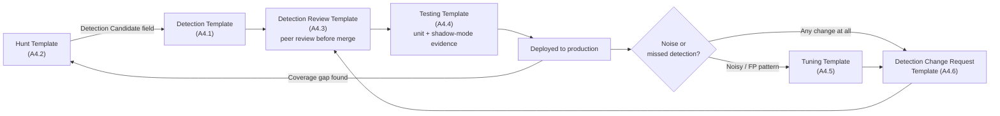

# Appendix A4 — Templates

This appendix is the toolbox version of Parts XVI, XXVIII, XXX, XXXIII, and XXXIX. Those chapters
explain *why* each field, gate, or test dimension exists. This appendix just gives you the blank
form to copy into a ticket, a pull request description, or a `docs/decisions/` file, so a team
doesn't have to reconstruct the schema from memory every time.

Every template here follows the same rule stated in Part XXVIII and repeated because it's the
single most-violated rule in practice: **every field is mandatory.** If a field genuinely doesn't
apply, write "N/A" and say why in one clause. A blank field is indistinguishable, to the next
person who reads it, from "forgot to fill this in," and that ambiguity is exactly what turns a
documentation habit into documentation nobody trusts.

**Hunter's Note** — The fastest way to tell whether a team's documentation discipline is real or
theater is to open ten of their most recent detection records and count how many fields say "N/A —
[reason]" versus how many are just empty. Empty fields cluster; once one person skips one, the next
person treats it as license to skip the same one, and within a quarter the field is dead weight
that gets deleted from the template instead of enforced.



## A4.1 — Detection Template

Matches the metadata schema referenced in Part XVI (Detection as Code) and Part XXXVIII
(governance). Use one of these per detection, checked into the detection repository alongside the
query itself, not maintained separately in a wiki that drifts out of sync.

```markdown
### ID
### Name
### Description
### Author
### Version
### Date (Created / Last Modified)
### Severity
### Status (Experimental / Stable / Disabled / Deprecated)
### Data Sources
### MITRE ATT&CK Mapping
### Query
### Known False Positives
### Test Cases
### References
```

### Field guidance

| Field | What goes here | Common mistake |
|---|---|---|
| ID | Stable identifier used in commit messages, alert metadata, and change records (e.g. `part30-01`) | Reassigning an existing ID to a rewritten rule instead of versioning it |
| Name | Short, behaviour-based name — what is being detected, not the tool that inspired it | Naming the rule after a specific tool ("Mimikatz Detection") when the logic actually matches a broader behaviour, or vice versa |
| Description | One or two sentences: the behaviour, why it matters, and the boundary of what this specific rule does *not* cover | Copy-pasting an ATT&CK technique description instead of stating what the query actually matches |
| Author | Person or team, plus a contact path that still works in six months (team alias, not an individual's name only) | Individual name with no team fallback — becomes an orphaned rule the day they leave |
| Version | Incremented on every logic change, tied to the version-controlled tag | Editing the query without bumping the version, breaking traceability to test evidence |
| Date | Created date and last-modified date, both — not just one | Only tracking creation date, so staleness is invisible |
| Severity | Tied to realistic blast radius if the underlying behaviour is confirmed malicious, not to how alarming the technique name sounds | Universal "High" severity that trains analysts to ignore the field entirely |
| Status | Current lifecycle state, with a mandatory reason for Disabled/Deprecated (Part XXXVIII) | Status left as "Experimental" indefinitely after months of stable production use |
| Data Sources | Exact log source, table/index name, and the specific fields the logic depends on | Naming the product ("EDR telemetry") instead of the actual table/field |
| MITRE ATT&CK Mapping | Technique/sub-technique ID(s) matching what the query *actually* detects | Mapping to the tactic instead of the technique, or to the technique that inspired the rule rather than the one it matches |
| Query | The query itself, query language stated explicitly, marked illustrative if not verified against a live backend | Pasting a query with no note on which backend/schema version it was validated against |
| Known False Positives | Specific, named sources of benign overlap (see Part XXXIII's taxonomy), not "some false positives possible" | Vague FP notes that give the next analyst nothing to triage against |
| Test Cases | At least one true-positive fixture and one benign fixture, referenced by ID (Part XXX / A4.4) | No fixtures at all — "peer reviewed" with nothing to actually run |
| References | Named source (ATT&CK page, vendor docs, internal hunt/incident ID) — URL only if certain | Fabricated or unverified URLs |

### Worked example — `appA4-01`

```markdown
### ID
appA4-01

### Name
Kerberoasting via Rare-Actor Distinct-SPN TGS Burst

### Description
Detects a single account requesting Kerberos service tickets (TGS) for multiple distinct
service-principal-name-registered accounts, using RC4 ticket encryption, within a short window,
where that account has little or no history of doing so. Does not cover cloud/hybrid-identity
Kerberos-equivalent ticket requests (out of scope — see Coverage Gap in linked hunt `HUNT-2026-014`).

### Author
Detection Engineering Team (alias: det-eng@internal)

### Version
2 (supersedes `DET-0142` v1, flat-volume threshold — see Detection Autopsy, Part XXX)

### Date
Created 2026-06-02 / Last Modified 2026-09-01

### Severity
Medium (baseline) / High (if enriched with logon-host mismatch or SPN-enumeration command line)

### Status
Stable

### Data Sources
Windows Security Event Log, Event ID 4769, forwarded from domain controllers; enrichment from
Event ID 4624 (logon) and Sysmon Event ID 1 (process creation) where available.

### MITRE ATT&CK Mapping
- T1558.003 — Steal or Forge Kerberos Tickets: Kerberoasting (primary)
- T1087.002 — Account Discovery: Domain Account (enrichment/contributing signal)

### Query
Illustrative KQL against a `SecurityEvent`-style schema (Microsoft Sentinel / Log Analytics field
names — adjust field names for Splunk CIM or raw WEF schemas before running):

​```kql
SecurityEvent
| where EventID == 4769
| where TicketEncryptionType == "0x17"            // RC4-HMAC
| where ServiceName !endswith "$"                  // exclude machine-account noise
| summarize RequestCount = dcount(ServiceName), Services = make_set(ServiceName)
    by Account = TargetUserName, SourceIP = IpAddress, bin(TimeGenerated, 10m)
| where RequestCount >= 5
| extend Severity = iff(RequestCount >= 15, "high", "medium")
​```

### Known False Positives
- Backup/monitoring service accounts sweeping many SPNs on a schedule — self-excluded by requiring
  no prior 30-day baseline of TGS activity for the account (see full rare-actor join in Part XXVIII
  worked example, Query 2).
- Certificate Services / print-server re-registration around patch or reboot cycles — shows as many
  *different accounts* requesting the *same* SPN, the inverse grouping key, and is distinguishable
  but worth flagging to whoever tunes thresholds.
- Authorized penetration testing — cross-check against the authorized-testing calendar before
  escalating.

### Test Cases
- TP fixture: replayed `j.harmon` event sequence from `HUNT-2026-014` (14 distinct SPNs, RC4, 11
  minutes) — fires, high severity.
- Benign fixture: 30-day baseline replay of two known backup-account sweeps — zero false positives.
- Full test matrix: see A4.4 worked walkthrough, Part XXX.

### References
- MITRE ATT&CK T1558.003, T1087.002
- Microsoft Learn — Windows Security Event 4769
- Internal: `HUNT-2026-014` (originating hunt), `DET-0142` (superseded rule)
```

## A4.2 — Hunt Template

This is the exact notebook schema from Part XXVIII — reproduced here unchanged so it can be copied
without flipping back to that chapter. The full worked Kerberoasting hunt (`HUNT-2026-014`) that
demonstrates every field filled in, including illustrative KQL queries and pivot chains, lives in
Part XXVIII rather than being duplicated here.

```markdown
### Hunt ID
### Hypothesis
### Threat
### ATT&CK Mapping
### Scope
### Telemetry
### Assumptions
### Queries
### Pivots
### Findings
### False Positives
### Confirmed Activity
### Coverage Gap
### Detection Candidate
### Next Steps
### References
```

**Engineering Reality** — The `Telemetry` field is where hunts most often quietly fail: an analyst
assumes a retention window rather than checking it, gets a clean-looking "no findings" result, and
that result gets treated as coverage evidence when it's actually just an artifact of a short
lookback. State the retention window you *verified*, not the one you assumed. If you didn't check,
write "not verified."

## A4.3 — Detection Review Template

Draws the review questions directly from the peer-review checklist in Part XVI, extended with the
governance staleness checks from Part XXXVIII. Use this as the actual PR review comment or ticket
checklist, not as a mental pass — mark each row explicitly rather than leaving it implied by
"approved."

```markdown
### Detection under review
### Reviewer
### Date

| # | Review question | Pass / Fail / N/A | Notes |
|---|---|---|---|
| 1 | Does the query logic match the stated behaviour in the description? | | |
| 2 | Are the MITRE mappings correct for what the query *actually* detects, not just what it was inspired by? | | |
| 3 | Is there at least one true-positive fixture and one benign fixture covering a known false-positive pattern? | | |
| 4 | Does severity match realistic blast radius, not just how alarming the technique name sounds? | | |
| 5 | Are field names and table/index references valid for the current schema version? | | |
| 6 | Is there a rollback plan if this causes an alert storm or a coverage loss? | | |
| 7 | Is the Owner field a team alias or role, not only an individual who could leave? | | |
| 8 | Is Status accurate, and if Disabled/Deprecated, is there a mandatory reason and re-review date? | | |
| 9 | Is Last Tested date current, or is this rule running on stale test evidence? | | |
| 10 | Does this change (if tuning) trace to specific gate-2-style evidence rather than a single anecdote? | | |

### Second reviewer required? (Y/N, and why)
### Overall verdict (Approve / Request changes / Reject)
### Follow-up items
```

**SOC Management View** — This template is the artifact an auditor will actually sample. A
detection program that claims "peer review required" but can't produce a filled copy of this table
for a given rule on request has a policy, not a control. Store completed copies where they're
queryable — attached to the PR or the change record — not scattered across chat history.

## A4.4 — Testing Template

Built directly from the eleven test dimensions in Part XXX. Fill one row per dimension for every
detection before it leaves shadow mode; "N/A" is acceptable only with a one-line reason (e.g.
single-source rules have no time-skew dimension to test).

```markdown
### Detection under test
### Tester
### Date / Test environment

| Test dimension | Method used | Result | Evidence reference |
|---|---|---|---|
| 1. Does it fire at all? | | | |
| 2. Does it fire for the right reason (not a coincidental field match)? | | | |
| 3. Does known-good benign activity also trigger it? | | | |
| 4. Can the fields the logic depends on go missing, and what happens if they do? | | | |
| 5. Does a parser/schema change silently break it? | | | |
| 6. Does field casing matter to the query engine? | | | |
| 7. Does clock skew between sources break time-window logic? | | | |
| 8. What happens with duplicate events? | | | |
| 9. What happens with partial telemetry (some but not all expected events arrive)? | | | |
| 10. Can volume/sampling/performance limits overwhelm the detection? | | | |
| 11. Does aggregation hide the underlying suspicious behaviour (low-and-slow / distributed variant)? | | | |

### Shadow-mode window (start / end) and alert-volume delta
### Sign-off (tester + second reviewer)
```

> **[SCREENSHOT PLACEHOLDER — CONTROLLED LAB]** — a SIEM search-job or analytics-rule run-history
> panel (e.g. a lab Sentinel or Splunk instance replaying synthetic Windows Security Event Log
> data) captured as the Evidence Reference for test dimension 10 above, showing actual query run
> time against production-scale event volume compared to the scheduling interval. Would illustrate
> what a real completed evidence link in this template looks like, without presenting a fabricated
> result as production data.

## A4.5 — Tuning Template

Based on the tuning decision tree and the five root-cause questions from Part XXXIII. The point of
this template is to make "just exclude it" structurally harder than doing the root-cause work —
the form has no field for "suppress and move on" without first answering why.

```markdown
### Alert / rule reference
### Date raised, and by whom
### Observed false-positive pattern (with sample count and time window)

#### Root cause (answer before choosing a tuning type)
1. What specific field(s) and value(s) caused the match?
2. Why does that value appear in this benign case — shared tool, naming coincidence, missing
   enrichment, or a genuinely correct match on activity that's just authorized here?
3. Would this same fix also hide a real attacker doing the same thing under the same cover?
4. Is this a one-off, or does it represent a whole class of activity the rule was never designed
   to distinguish? (If a class: this is a hypothesis rewrite, not a tuning exercise — route to A4.6.)
5. Who owns review of this fix, and when does it expire or get re-validated?

### Tuning type selected (Contextual / Temporary / Scoped Suppression / Time-Based / Asset-Aware /
Role-Aware / Threshold / Sequence)
### Scope of the fix (exact accounts/hosts/certs/time windows — not a broad category)
### Expiry / review date (mandatory for Temporary and Scoped types)
### Validation: re-tested against known true positives in the same pattern? (Y/N + evidence)
### Sign-off
```

**Detection Autopsy callback** — Part XXXIII's 2 a.m.-exclusion write-up in Part XXXIX is the
canonical failure mode this template exists to prevent: a broad, undocumented exclusion (`hostname
contains "SCCM"`) added under incident pressure with no root-cause field, no expiry, and no peer
review, which went on to blind the rule to a real intrusion three months later. Every field above
maps to something that exclusion was missing.

## A4.6 — Detection Change Request Template

Matches the change-record schema and gate sequence from Part XXXIX exactly, so a filled copy of
this template *is* the audit trail for that chapter's eleven gates.

```markdown
### Change ID
### Change class (Tuning / New detection / Deprecation / Response-action / Multi-tenant-client-visible)

| Gate | Evidence required | Status (Go / No-Go / Waived) | Evidence link / notes |
|---|---|---|---|
| 1. Issue identified | Alert/incident/hunt ID + stated hypothesis | | |
| 2. Evidence gathered | Fire-count history, disposition breakdown, samples | | |
| 3. Change proposed | Written diff, rationale, blast radius, rollback draft | | |
| 4. Risk reviewed | Impact/likelihood assessment, contractual/SLA check | | |
| 5. Peer review | Second reviewer sign-off (A4.3 completed) | | |
| 6. Stakeholder/client approval | Recorded approval or documented waiver | | |
| 7. Test | Shadow-mode 7-14 day parallel-run diff (A4.4 completed) | | |
| 8. Deploy | Version tag, on-call briefing, rollback confirmed ready | | |
| 9. Validate | Post-deploy health check, canary confirmation | | |
| 10. Monitor | 2-4 week metrics trend, analyst feedback | | |
| 11. Rollback (if triggered) | Rollback record, root cause, new Gate-1 issue filed | | |

### Requester / issue source
### Risk score & owner
### Reviewer(s)
### Deployed version / tag / timestamp
### Change closed date (baseline updated) or reopened as new issue
```

**Engineering Reality** — A CI pipeline going green (Gate 5-adjacent) proves the query is
syntactically valid against the fixtures someone thought to write. It does not prove Gate 7 or Gate
9 — shadow-mode behaviour and live post-deploy validation are different evidence, from a different
environment, and this template's row-per-gate structure exists specifically so nobody can point at
a green pipeline and skip straight to "deployed."

## Summary

Six templates, one lifecycle: a hunt (A4.2) produces a Detection Candidate that becomes a Detection
record (A4.1); every change to that record — new, tuned, or deprecated — goes through review (A4.3)
and testing (A4.4) before it ships, using the Tuning Template (A4.5) specifically when the trigger
is a false-positive pattern, and the Change Request Template (A4.6) as the umbrella record that ties
Gate evidence from all of the above together for audit. None of these templates do anything on
their own — they only have value if the fields get filled in by the person who actually did the
work, at the time they did it, not reconstructed from memory during an audit six months later.
