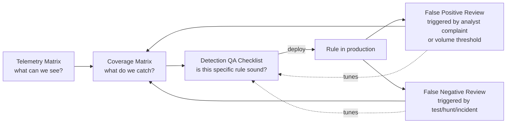

# Appendix A5 — Matrices and Checklists

This appendix is the blank-template counterpart to Part XXXVI (Detection Coverage Matrix), Part
III (Telemetry Engineering), Part XXX (Detection Testing), Part XXXIII (False Positive
Engineering), and Part XXXIV (False Negatives). Those chapters argue *why* each artifact matters
and walk through worked, filled-in examples. This appendix gives you the empty structure to copy
into your own tracking system — a spreadsheet, a wiki table, a detection-as-code repo's metadata
schema, whatever your team actually maintains rather than lets rot.

**Engineering Reality** — a template that lives in this book gets copied once and then drifts from
whatever your team actually needs within two quarters. Treat every table below as a starting
schema, not a final one. The columns that matter are the ones that force an honest answer, not the
ones that match this page exactly.

## How the five artifacts relate



The Telemetry Matrix answers "what can we possibly see." The Coverage Matrix answers "what have we
actually built, and how well." The QA Checklist is the gate a single detection has to pass before
it's trusted to page someone. The FP and FN review checklists are the two directions a detection
can be wrong in production, and both feed corrections back into the Coverage Matrix's Coverage
Level and Known Gap columns — which is the mechanism that keeps that matrix from going stale (see
Part XXXVI's discussion of matrix rot).

---

## 1. Detection Coverage Matrix — blank template

Matches the column set defined in Part XXXVI. Populate one row per technique/sub-technique/fleet-
segment combination — a technique with different telemetry availability on different platforms
gets two rows, not one row with a caveat buried in a cell.

| Technique | Sub-technique | Telemetry | Detection | Test | Last Validation | Coverage Level | Known Gap | Owner |
|---|---|---|---|---|---|---|---|---|
| *T#### Name* | *T####.### Name, or implementation variant* | *Exact log source(s) + event ID(s) + field(s) this depends on — not "EDR"* | *Rule ID/name + one-line logic, link to detection-as-code repo* | *Atomic Red Team GUID / Caldera ability ID / internal case ID, or "none"* | *Date last proven to fire in production pipeline, or "never validated"* | *NO VISIBILITY / TELEMETRY ONLY / PARTIAL DETECTION / RELIABLE DETECTION / MULTI-SOURCE DETECTION / TESTED/VALIDATED* | *Plain language: what implementation path or evasion this does not catch* | *Named individual, not a team alias* |
| | | | | | | | | |
| | | | | | | | | |

**Fill-in rules that keep this matrix honest:**

- Coverage Level is a derived judgment, not a preference. Run the flowchart from Part XXXVI (data
  exists? → analytic exists? → known evasion paths? → single or multi source? → validated within
  recency window?) before writing a tier in, every time, even for a row you're updating rather than
  creating.
- Known Gap is mandatory, not optional, at every tier except a genuinely exhaustive
  TESTED/VALIDATED row — and even then, write "no known gap as of [test date]" rather than leaving
  it blank, so a blank cell always means "nobody has thought about this yet," never "there is
  none."
- "Last Validation" is a date a test execution actually ran through the production pipeline. A rule
  someone eyeballed and said "looks right" does not get a date in this column.

[MANAGEMENT] When this matrix rolls up to a slide, report the distribution across the six tiers,
not a single coverage percentage — see Part XXXVI's SOC Management View callout for why a single
number actively hides the risk picture leadership needs.

---

## 2. Telemetry Matrix — blank template

This tracks the data plane underneath the coverage matrix: what a given source actually gives you,
what it doesn't, how long you can look back, what it costs, and who you call when it breaks.

| Source | Provides | Does Not Provide | Retention | Cost | Owner |
|---|---|---|---|---|---|
| *e.g., Sysmon (specific config version)* | *Exact event IDs collected and the fields populated for each — be specific: "EID 1 ProcessCreate with CommandLine, Hashes; EID 3 NetworkConnect without full TLS SNI"* | *Event IDs disabled in this config, fields stripped by policy, platforms not covered (e.g., no Linux/macOS equivalent deployed)* | *Hot/searchable window vs. cold/archived window, separately* | *Ingest volume/day, license cost tier, storage cost, or "unmeasured" if genuinely unknown* | *Named owner for config changes and health monitoring* |
| | | | | | |
| | | | | | |

**What belongs in "Does Not Provide," specifically:**

- Fields the source *could* carry but doesn't, in your actual deployed configuration — this is
  where "Sysmon" quietly becomes "Sysmon without command-line logging enabled on 30% of the fleet"
  or "CloudTrail management events only, no S3 data events."
- Platforms, regions, or business units the source doesn't reach at all — a source that's 100%
  deployed on Windows server infrastructure and 0% on the developer laptop fleet is not "deployed,"
  it's "deployed on one segment," and every downstream detection built on it inherits that gap
  silently unless this column says so.
- Retroactive limits: a source that only started being collected six months ago provides zero
  historical hunting value for anything older, no matter what its nominal retention window is.

[ENGINEERING] Retention should be two numbers, not one: how far back you can run a live query
today, and how far back you could go if you had to restore from cold storage and how long that
restore takes. A retention policy that says "395 days" but means "395 days if legal signs off on an
emergency cold-storage restore that takes six business days" is a materially different capability
during an actual incident than 395 days of hot, queryable data.

**SOC Management View** — the Cost column is what turns this from an engineering reference into a
budget conversation input. A detection that depends on a telemetry source costing four times as
much per GB as the rest of the pipeline, for a technique with low realistic likelihood in your
environment, is a legitimate candidate for de-scoping — but only if the cost is written down
somewhere instead of living in one person's memory of the last vendor invoice.

---

## 3. Detection QA Checklist

Run this against every detection before it goes live, and again at every scheduled review. It's
built directly from the review questions this book keeps returning to: what behaviour, what
telemetry proves it, what fields it depends on, what looks similar, whether it can be bypassed,
what happens if a field is missing, expected volume, safe exclusions, how it was tested, and how
you'll know if it silently stops working.

| # | Question | Answer required (not a checkbox) |
|---|---|---|
| 1 | **What behaviour** is this detecting, in one sentence, without naming an Event ID? | If you can't write this sentence without reaching for a field name, the hypothesis isn't clear yet — see Part XXXIII's Hunter's Note. |
| 2 | **What telemetry proves it occurred?** | Exact source + event ID(s), not a category. |
| 3 | **What fields does the logic depend on**, and which are mandatory vs. optional? | List every field the query touches. Mark each as required-for-the-rule-to-function vs. enrichment-that-improves-confidence. |
| 4 | **What legitimate activity looks structurally similar?** | Name the specific tool/process/user pattern, not "false positives may occur." Reference Part XXXIII's taxonomy (poor hypothesis, wrong field, missing context, static threshold, shared system, legitimate automation, environment change) to categorize each. |
| 5 | **Can this be bypassed, and how?** | Describe at least one concrete evasion path (different LOLBin, renamed binary, API call instead of command line, timing below a threshold). If you genuinely can't think of one, that's a signal to look harder, not a sign the rule is airtight. |
| 6 | **What happens if an optional field is missing or null?** | Does the rule fail to fire, fire with reduced confidence, or fire and throw a query error? A rule that silently never fires because one enrichment join returns null is a false negative nobody will notice. |
| 7 | **What is the expected alert volume and false-positive rate?** | A number, from a test run against real production data — "low" is not an answer. State the sample window used to estimate it. |
| 8 | **What exclusions are safe to add, and why?** | Every exclusion needs a stated reason and an owner, not just a value added during a tuning session. An unexplained exclusion list is exactly what gets exploited later (Part XXXIII, Section 6's warning about allow-listing an RMM tool by name instead of by instance). |
| 9 | **How was this tested?** | Atomic Red Team/Caldera/manual test-case reference, executed through the actual production telemetry pipeline, not a synthetic event injected straight into the SIEM. Record the date. |
| 10 | **How will we know if this stops working?** | Name the monitoring mechanism: a scheduled re-test cadence, a field-population health check, an alert-volume floor/ceiling alert, or an explicit statement that nothing currently monitors this and it depends entirely on the next scheduled review. |
| 11 | **Who owns this rule?** | Named individual. A rule with no accountable owner is a rule nobody fixes when question 10's monitoring fires. |
| 12 | **What is the coverage level per Part XXXVI's six-tier scale**, and does that match what's recorded in the Coverage Matrix? | Cross-check against the row in Section 1 above — a mismatch here is usually the first sign the matrix has drifted from reality. |

### Worked example: running the checklist against a real rule (`appA5-01`)

**Rule:** `appA5-01` — alert when a process other than an EDR agent or a signed backup utility
opens a handle to `lsass.exe` with an access mask consistent with memory-read capability, and the
requesting process image is not present in a maintained allow-list of known credential-provider
and diagnostic tooling.

Illustrative Sigma, not guaranteed to run unmodified against every backend:

```yaml
title: Suspicious Process Access to LSASS Memory
id: appA5-01
status: experimental
logsource:
  category: process_access
  product: windows
detection:
  selection:
    TargetImage|endswith: '\lsass.exe'
    GrantedAccess:
      - '0x1010'
      - '0x1410'
      - '0x1438'
      - '0x143a'
      - '0x1fffff'
  filter_known_tools:
    SourceImage|endswith:
      - '\MsMpEng.exe'
      - '\WerFault.exe'
    Signed: true
  filter_allowlisted_edr:
    SourceImage|contains:
      - '\Program Files\CrowdStrike\'
      - '\Program Files\Microsoft Defender ATP\'
  condition: selection and not (filter_known_tools or filter_allowlisted_edr)
falsepositives:
  - Some legitimate diagnostic and backup tooling reads LSASS handles for reasons unrelated to
    credential theft; the allow-list above is illustrative and must be built against your actual
    fleet inventory.
level: high
```

Applying the checklist:

1. **Behaviour:** an unrecognized process reading LSASS process memory, consistent with credential
   dumping.
2. **Telemetry:** Sysmon Event ID 10 (ProcessAccess) with `TargetImage`, `SourceImage`,
   `GrantedAccess`, `Signed`.
3. **Fields:** `TargetImage` and `GrantedAccess` are required for the rule to fire at all;
   `Signed` and `SourceImage` allow-list matching are required for the exclusion logic, and their
   absence means the exclusion silently fails to suppress — see item 6.
4. **Looks similar:** EDR agents themselves, crash-dump/WER handling, some backup agents that
   snapshot process memory for application-consistent backups, and legitimate incident-response
   tooling run manually by the SOC's own team during an investigation.
5. **Bypass:** `comsvcs.dll` MiniDump invoked via `rundll32.exe`, or direct syscalls that avoid the
   documented `OpenProcess` access-mask pattern the rule keys on, both plausibly evade this
   specific mask list — matching the T1003.001 gap documented in Part XXXVI's worked matrix.
6. **Missing field behavior:** if `Signed` is unpopulated (common on hosts where Sysmon's code
   signing verification is disabled for performance), the `filter_known_tools` exclusion never
   matches, and the rule over-fires on legitimate signed tooling rather than under-firing — the
   opposite failure mode from a rule that fails closed. This needs to be stated explicitly, because
   "missing field causes false negative" and "missing field causes false positive" require
   different tuning responses.
7. **Expected volume:** in a 30-day production sample against 4,000 endpoints prior to allow-list
   tuning, this fired approximately 40 times/day, almost entirely from one internal backup product;
   after adding that product to the allow-list by signer and install path, volume dropped to
   roughly 2–3/day.
8. **Safe exclusions:** the backup product above, added by code-signing certificate thumbprint plus
   install path, not by process name alone (a process name is trivially spoofable).
9. **Tested:** Atomic Red Team T1003.001 test executed in an isolated lab segment forwarding
   telemetry through the same Sysmon config and SIEM ingestion path as production.
10. **Stops-working monitor:** a scheduled query checks that Sysmon EID 10 volume against
    `lsass.exe` targets stays within an expected daily range per host group; a sustained drop to
    zero on a host group that previously produced steady volume pages the rule owner rather than
    being silently interpreted as "no attacks happened."
11. **Owner:** named individual on the endpoint detection team (illustrative).
12. **Coverage level:** PARTIAL DETECTION, matching the T1003.001 row in Part XXXVI's worked
    matrix — the comsvcs.dll/syscall bypass in item 5 is the reason it isn't RELIABLE.

---

## 4. False Positive Review Checklist

Trigger this review whenever a rule crosses an analyst-complaint threshold, a scheduled tuning
review comes up, or a volume-anomaly alert fires on the rule itself.

| # | Question | Notes |
|---|---|---|
| 1 | Which FP taxonomy category does this fall into? | Use Part XXXIII's seven categories: poor hypothesis, wrong field/logic, missing context, static threshold vs. dynamic baseline, shared/multi-tenant system, legitimate automation, environment change. Naming the category points at the fix. |
| 2 | Is this a single recurring source, or many distinct sources? | One noisy backup job is a targeted exclusion. Many unrelated sources triggering the same logic is usually a sign the underlying hypothesis (item 1) is too broad, not that you need ten exclusions. |
| 3 | What is the exact matching field value that triggered it? | Get the literal value (process path, signer, hash, IP range) before writing any exclusion — excluding on a guessed pattern widens the hole further than intended. |
| 4 | Is the proposed exclusion scoped as narrowly as the false positive actually is? | Exclude by signer + install path + parent process where possible, not by process name alone. Revisit Part XXXIII's RMM-tooling warning: exclude the specific known-good instance, not the tool category. |
| 5 | Does this exclusion reduce coverage for a real attack path? | State explicitly whether an attacker abusing the same legitimate tool/path would now evade detection. If yes, decide consciously whether that tradeoff is acceptable, don't let it happen by default. |
| 6 | Is there a documented reason and owner recorded for the new exclusion? | An exclusion with no recorded reason is technical debt that looks like tuning. |
| 7 | Has alert volume actually dropped after the change, measured, not assumed? | Re-run against a comparable time window post-change and record the before/after numbers. |
| 8 | Did this FP review reveal a gap that belongs in the Coverage Matrix's Known Gap column? | If the exclusion narrows real coverage (item 5), update the corresponding Coverage Matrix row, don't let the change live only in the rule's exclusion list. |
| 9 | Should the recency/coverage tier change as a result? | A rule that just lost one of its two independent telemetry paths to an exclusion may need to move from MULTI-SOURCE back to PARTIAL. |

**Hunter's Note** — a false positive review that only produces an exclusion, and never produces an
answer to "would an attacker abusing this same legitimate path now get through," is half a review.
The exclusion is the easy half.

---

## 5. False Negative Review Checklist

Trigger this review after any purple-team/red-team exercise, any incident postmortem where a rule
should have fired and didn't, and on the recurring recency-window schedule from the Coverage
Matrix's "Last Validation" column.

| # | Question | Notes |
|---|---|---|
| 1 | Did the source telemetry exist for this event at all, and can you show the raw event? | Start here, per Part XXXIV — most false negatives are a data-plane problem, not a logic problem, and confirming the event exists (or doesn't) settles that immediately. |
| 2 | If the event exists, are the fields the rule depends on populated correctly in that specific event? | Check field population, not just event presence — a parser can ingest the event and still null out or mis-split the exact field the rule needs. |
| 3 | If fields are populated correctly, did the rule's logic actually cover this specific variant? | Compare the real event against the rule's condition clause by clause. Identify the exact clause that failed to match, don't stop at "it didn't fire." |
| 4 | Is this a known evasion path already documented in the Coverage Matrix's Known Gap column? | If yes, this is confirmation, not news — update the "Last Validation" style tracking to reflect that the gap is now empirically demonstrated, not just theorized. |
| 5 | Is this a new evasion path not previously documented? | If yes, this is new information that must be written into Known Gap immediately, and ideally becomes a standing hunt hypothesis (Part XXVII/XXVIII) while the engineering fix is scheduled. |
| 6 | What is the minimum logic change needed to catch this specific variant, and does it introduce new false-positive risk? | Every false-negative fix should be checked against the FP checklist above before deployment — a fix that closes one gap by widening the match criteria can open a new false-positive source. |
| 7 | Was this variant something a different, independent telemetry source would have caught? | If yes, this is an argument for moving the technique toward MULTI-SOURCE DETECTION rather than patching the single existing rule indefinitely. |
| 8 | Has the Coverage Matrix row's Coverage Level been corrected to reflect this finding? | A confirmed false negative on a row marked RELIABLE DETECTION or higher means that tier was wrong the moment the gap was proven, and the row must be downgraded immediately, not at the next scheduled audit. |
| 9 | Has a regression test been added so this specific variant is checked on every future validation run? | The point of finding a false negative once is to never have to find the same one twice. |

**Detection Autopsy: a false-negative review that stopped too early.** A team ran a purple-team
exercise executing a Kerberoasting technique (T1558.003) and found their rule — which alerted on a
spike in TGS requests for accounts with weak encryption types — didn't fire. The review stopped at
"the attacker used AES-supporting service accounts with intentionally weak encryption negotiated
down, so the encryption-type filter never matched," logged it as a known limitation, and closed the
review. What that stopped-too-early review missed: it never asked question 7 above — whether the
*volume* signal (a single account receiving TGS requests from a source that had never requested a
ticket for that account before) would have caught the same activity independent of the encryption-
type field entirely. Re-opening the review and asking that question found that a volume/novelty-
based analytic, run against the same raw event, would have fired cleanly — meaning the fix wasn't
"expand the encryption-type list" (which just chases the next downgrade variant), it was "add a
second, independent detection path that doesn't depend on encryption type at all," moving the
technique toward MULTI-SOURCE DETECTION instead of endlessly patching one narrow filter. The lesson
generalizes: a false-negative review that only asks "how do I fix this specific rule" instead of
"what independent signal would have caught this anyway" produces a narrower patch every time,
forever, rather than converging on real coverage.

---

## Using these together in a review cadence

```mermaid
flowchart TD
    Sched[Scheduled review\n(recency window per Part XXXVI)] --> Run[Execute test case\nthrough production pipeline]
    Run --> Fired{Did it fire\ncorrectly?}
    Fired -- Yes, no excess noise --> QA2[Re-run QA Checklist\nconfirm still accurate]
    Fired -- Yes, but noisy --> FPR[False Positive Review Checklist]
    Fired -- No --> FNR[False Negative Review Checklist]
    QA2 --> Matrix[Update Coverage Matrix:\nLast Validation, Coverage Level]
    FPR --> Matrix
    FNR --> Matrix
    Matrix --> Sched
```

None of these five artifacts is useful in isolation for long. A Coverage Matrix nobody re-derives
from real test executions goes stale within a quarter (Part XXXVI). A Telemetry Matrix nobody
checks against actual field-population rates tells you what you *think* you collect, not what you
collect (Part III, Part XXXIV). A QA Checklist run once at deployment and never again just proves
the rule was sound on the day it shipped. The FP and FN checklists are the mechanisms that keep
correcting the other three — build the review cadence so that every FP/FN finding is required, not
optional, to update the corresponding Coverage Matrix row before the review is considered closed.
