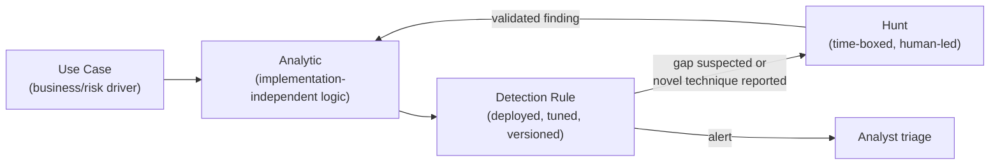
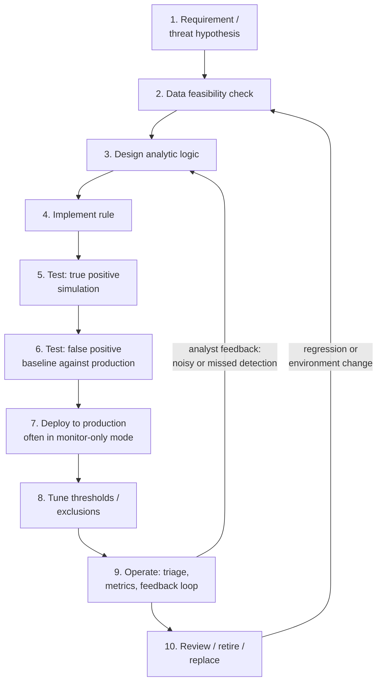
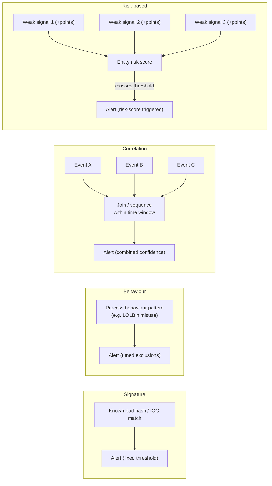
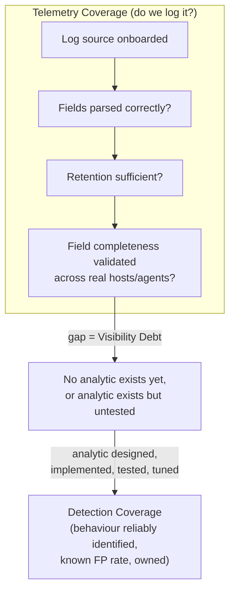

# Part I — Detection Engineering Foundations

## What Detection Engineering Actually Is

Detection engineering is the discipline of turning a hypothesis about adversary behaviour into a
reliable, maintainable, testable piece of logic that runs continuously against production
telemetry and produces a signal an analyst can act on. That sentence is doing a lot of work, so
unpack it piece by piece:

- **Hypothesis about adversary behaviour** — you start from "here is something an attacker would
  have to do," not "here is a log line that looks weird."
- **Reliable** — it fires when the behaviour happens and stays quiet when it doesn't, across the
  range of legitimate variation in your environment.
- **Maintainable** — someone other than the author can read it, understand why it exists, and
  change it in six months without breaking it.
- **Testable** — you can prove, with evidence, that it catches the thing it claims to catch and
  roughly how often it fires on benign activity.
- **Continuous** — it isn't a one-off query run during an investigation; it's a standing piece of
  logic with a lifecycle, an owner, and a review cadence.

[CONCEPT] If you strip away tooling, detection engineering is applied epistemology: how do you
know an attacker did something, given only the traces that behaviour leaves in systems you can
observe? Every detection is a bet about which traces are reliable enough to act on.

[MANAGEMENT] The reason this needs to be a named discipline, staffed and resourced like software
engineering, is that most organizations already have hundreds or thousands of rules written by
whoever was on shift when a false positive got annoying or an auditor asked for coverage of a
specific technique. Without engineering discipline, a rule set decays: duplicate logic, contradictory
thresholds, silent breakage when a source schema changes, and no one who can explain why a rule
exists or whether it still fires. Detection engineering exists to stop that decay.

**Hunter's Note** — If you can't say what behaviour a rule is trying to catch in one sentence,
without naming an Event ID, you don't have a detection, you have a hunch someone wrote into a
query box.

## Detection Rule vs Analytic vs Use Case vs Hunt

These four terms get used interchangeably in casual conversation and that sloppiness causes real
confusion in backlog management, coverage reporting, and handoffs between teams. They are not
synonyms.

| Term | What it is | Lifecycle | Owner | Output |
|---|---|---|---|---|
| **Detection rule** | The literal, deployed logic (a Sigma rule, a SIEM correlation search, a KQL scheduled query) that evaluates telemetry and produces an alert | Deployed, versioned, tuned, deprecated | Detection engineer | Alert in a queue |
| **Analytic** | The underlying logical statement of what pattern in the data indicates the behaviour — implementation-independent | Designed, validated, then implemented as one or more rules | Detection engineer / threat intel | A documented logic pattern, possibly implemented in several SIEM-specific rules |
| **Use case** | The business/security justification for having detection in a given area at all ("detect lateral movement via remote service creation") — a grouping of analytics tied to a risk or compliance driver | Defined at a program level, revisited yearly or on major re-architecture | Detection engineering lead / SOC management | A section of a coverage matrix, budget line, or audit artifact |
| **Hunt** | A time-boxed, human-led investigation into a hypothesis that does not yet have (or may never get) a standing automated rule | Started, executed, closed with findings; may spawn a new analytic | Threat hunter | Findings report, and optionally a new detection candidate |

Concretely: the **use case** is "we need to detect credential theft from memory." The **analytic**
is "a process other than LSASS itself, not on an approved allow-list, opens a handle to
lsass.exe with access rights sufficient for memory reading, shortly followed by that process
writing a file or making an outbound connection." The **detection rule** is the actual Sysmon
Event ID 10 (ProcessAccess) correlation you deployed in your SIEM, with your environment's specific
allow-list of EDR/AV processes that legitimately touch LSASS. The **hunt** is what you do when you
suspect a new LSASS-access technique (say, a novel driver-based approach) is evading that rule, and
you go looking for it manually before writing the next analytic.



Getting this taxonomy wrong has practical consequences. If "use case" and "detection rule" are
treated as the same thing, a coverage report that says "lateral movement: covered" because one
brittle rule exists gives leadership false confidence. If "hunt" and "detection rule" are conflated,
hunt findings never get operationalized into anything that runs without a human, and the same gap
gets rediscovered every quarter.

## The Detection Lifecycle, End to End

A detection is not "done" when it's deployed. It has a lifecycle, and skipping stages is the single
biggest source of rules that either never fire, fire constantly, or fire on the wrong thing.



1. **Requirement / threat hypothesis.** Comes from threat intel, a red team finding, a MITRE
   ATT&CK gap analysis, an incident post-mortem, or a hunt. Write it down before touching a query
   editor.
2. **Data feasibility check.** Do you actually have the telemetry, at the right fidelity, from the
   right hosts, for long enough retention, before you design anything? This step gets skipped
   constantly and is the reason so many "detections" exist only on paper.
3. **Design the analytic.** Implementation-independent logic: what fields, what sequence, what
   thresholds, what exclusions in principle.
4. **Implement the rule.** Translate the analytic into the query language of your SIEM/EDR,
   accounting for that platform's field names, timing model, and join/correlation limits.
5. **Test against true positives.** Simulate or replay the behaviour (atomic tests, red team
   engagement, captured attacker session from a honeynet) and confirm the rule fires.
6. **Test against a false-positive baseline.** Run the rule against a real (or realistic)
   production data sample and count what it would have fired on that wasn't malicious.
7. **Deploy**, often first in a monitor-only / non-alerting mode to gather volume data without
   waking anyone up.
8. **Tune** — add exclusions for legitimate tools, adjust thresholds, add enrichment to raise
   confidence rather than just suppressing.
9. **Operate** — the rule lives in a queue, analysts triage it, and every triage outcome (true
   positive, false positive, benign-true-positive, unable-to-determine) is metadata that feeds back
   into tuning.
10. **Review, retire, or replace** on a schedule and whenever the environment changes (OS upgrade,
    EDR migration, new logging pipeline, a technique becoming obsolete).

**Engineering Reality** — Stage 2 (data feasibility) is where most "detection coverage" claims
quietly fall apart. A rule can be fully designed, reviewed, and approved in a tabletop sense and
still be undeployable because the required field isn't populated in your actual log source, or is
only populated on 60% of your endpoints because of an agent version split. Always confirm the field
exists, is populated, and has the value distribution you expect, on a sample of real production
data, before spending time on rule logic.

## Signals, Noise, and Confidence

Every detection rule is a filter on a stream that contains both malicious and benign events. Three
concepts govern whether that filter is any good:

- **Signal** — the property of an event (or event sequence) that correlates with the malicious
  behaviour you're targeting.
- **Noise** — legitimate activity that also has that property, which will trigger the same rule.
- **Confidence** — a measure of how likely it is that a given alert instance represents true
  malicious activity, usually raised by combining several weak signals or adding context
  (asset criticality, user risk score, time of day, known-attacker infrastructure).

No single signal is both perfectly reliable and perfectly specific to malicious behaviour — if it
were, the technique would already be blocked outright rather than detected after the fact. Detection
engineering is the practice of combining imperfect signals to push confidence high enough that
acting on the alert is worth an analyst's time, without pushing so many exclusions in that you
create blind spots.

[DETECTION ENGINEER] A practical way to reason about a candidate signal is to ask: how expensive
is it for an attacker to avoid generating this specific trace, versus how expensive is it for a
legitimate admin to avoid it? If the answer is "trivially avoidable by the attacker, but normal
admin work generates it constantly," you have a weak signal that should feed a correlation, not
stand alone as an alert.

| Signal type | Example | Standalone confidence | Attacker evasion cost |
|---|---|---|---|
| Single rare artifact | A specific mutex name from a known malware family | High if unmodified | Low — trivial to rename |
| Behavioural sequence | Office process spawns cmd.exe spawns encoded PowerShell | Medium | Medium — requires different execution chain |
| Statistical anomaly | Account authenticates from a country never seen for that user | Medium | Medium — attacker rarely controls this |
| Combination / correlation | Remote authentication + new scheduled task + outbound connection to new destination, same host, short window | High | High — requires avoiding multiple independent traces |

## Behaviour-Based vs Signature-Based vs Correlation-Based vs Risk-Based Detection

These four approaches are not competing philosophies you pick one of — mature programs run all
four, layered, because they cover different failure modes.

**Signature-based detection** matches a known, fixed artifact: a file hash, a YARA string, a
specific command-line substring, a known-bad IP. Cheap to write, cheap to evaluate, and it degrades
to zero value the moment the artifact changes. It's still worth having, because commodity
malware and unsophisticated actors genuinely do reuse infrastructure and tooling, and a signature
hit on a known-bad hash is about as high-confidence as detection gets. The failure mode is treating
signature coverage as if it were technique coverage — a hash match tells you nothing about the next
sample from the same actor.

**Behaviour-based detection** targets the underlying action rather than the artifact: not "this
specific PowerShell script" but "PowerShell downloading and executing content in memory without
touching disk." It survives tooling changes (new malware family, same technique) but requires much
more careful false-positive engineering, because legitimate administration frequently looks similar
to the malicious version of the same behaviour.

**Correlation-based detection** doesn't rely on any single event being suspicious; it fires on a
*combination* of events, often across sources, within a time window — for example, a failed VPN
authentication followed by a successful one from a new device, followed by a first-time access to a
sensitive file share. Each individual event is unremarkable. The correlation is where the signal
lives. This is the most powerful category for catching novel techniques, and the most expensive to
build and maintain, because it depends on reliable joins across data sources that may have
different timestamp precision, different identity representations, and different retention.

**Risk-based detection** (sometimes called risk-based alerting, RBA) doesn't produce a binary
alert per rule at all. Instead, individual weak signals — each on its own far below alerting
threshold — contribute points to a running risk score for an entity (user, host), and an alert fires
only when the accumulated score crosses a threshold within a time window. This is how you use large
numbers of low-confidence behavioural signals (which would be far too noisy individually) without
either drowning the queue or dropping the signal entirely.



**SOC Management View** — Signature coverage is cheap and looks great on a slide, but it does not
reduce dwell time against a competent adversary. Correlation and risk-based detection catch more of
what actually matters, but they need more engineering time, more cross-source data quality, and
analysts who can interpret a risk score instead of a single-cause alert. If your program is 90%
signature rules, you have low operating cost and low effectiveness against anyone who isn't reusing
public tooling unmodified. Budget conversations should map spend against this breakdown, not just
against total rule count.

## Detection-as-Code: Why It Matters (Full Treatment Later)

Detection-as-code means managing detection logic the way software engineers manage application
code: version control, code review, automated testing, CI/CD deployment, and rollback — instead of
editing rules directly in a SIEM's web UI with no history and no review.

The short version of why this matters, ahead of the dedicated part of this book that covers
tooling and pipelines in depth:

- **Change history** — you can answer "who changed this rule, when, and why" instead of
  discovering a rule silently stopped firing three months ago with no record of what changed.
- **Peer review** — a second engineer catches logic errors, missing exclusions, or performance
  problems (an unbounded join, a regex that will choke on high-volume fields) before deployment,
  not after an incident.
- **Automated testing** — true-positive and false-positive test cases run on every change, so a
  tuning fix for one false positive doesn't silently reopen a gap you fixed six months ago.
- **Consistent deployment** — the same rule, in the same state, across dev/test/prod SIEM
  instances, instead of manual copy-paste drift.
- **Rollback** — a bad deployment (rule that suddenly alerts on everything, or nothing) can be
  reverted in minutes instead of requiring someone to reconstruct what it used to say.

None of this requires exotic tooling to start: a git repository holding Sigma rules, a linter, and
a CI job that runs each rule against a stored sample dataset already gets you most of the benefit.
The deep dive on this — pipelines, testing frameworks, Sigma-to-backend conversion, CI/CD for
detections specifically — is a later part of this book; the point here is only to establish that
this is an engineering discipline problem, not a SIEM-feature problem.

## Detection Coverage vs Log Coverage: Two Different Things

This distinction is the most commonly collapsed one in the entire field, and it's usually collapsed
by whoever is building a slide for leadership.

**Telemetry coverage** (also called log coverage) answers: *do we ingest data from this source at
all?* "We have Windows Security logs from domain controllers" is a telemetry coverage statement. It
says nothing about what you can detect with that data — only that the data exists somewhere in your
pipeline.

**Detection coverage** answers: *can we reliably identify a specific adversary behaviour, with an
acceptable false-positive rate, using the telemetry we have?* "We can reliably detect suspicious
remote authentication followed by privileged local execution" is a detection coverage statement. It
implies a working analytic, tested and tuned, not just a data source sitting in the SIEM.

**Visibility debt** is the gap between the two — the accumulating backlog of "we log it but we
can't actually detect anything meaningful with it yet." Every new log source you onboard without a
corresponding analytic increases visibility debt, even though it looks like progress on a coverage
dashboard that only counts ingested sources.

Worked contrast, concretely:

| Statement | Type | What it actually tells you |
|---|---|---|
| "We collect Windows Security event logs (4624, 4625, 4672, 4688) from all domain-joined hosts." | Telemetry coverage | Data exists in the SIEM at some retention, with some field completeness. Nothing about detection capability. |
| "We can reliably detect a successful interactive or RDP logon (4624, type 3/10) to a host where that account has no prior 30-day history, followed within 10 minutes by a process creation (4688) with elevated token or a known privilege-escalation LOLBin pattern." | Detection coverage | A tested, tuned analytic exists, has a known false-positive rate, and has an owner. |
| "We collect Sysmon on 40% of endpoints, but no analytic uses Event ID 10 (ProcessAccess) against LSASS, and no one has validated field completeness for GrantedAccess." | Visibility debt | Data theoretically supports a valuable detection (credential-theft-from-memory), but the gap between "logged" and "detected" is unaddressed and probably invisible on a source-count dashboard. |



**Detection Autopsy** — *"Alert on any 4672 (Special Privileges Assigned) followed by any 4688
(Process Creation) within 5 minutes, same host."*

Why it looked reasonable: 4672 fires when a logon session is granted admin-equivalent privileges,
and 4688 is process creation — chaining them looks like it should catch "attacker gets admin, then
runs something." It reads like textbook privileged-execution detection.

What breaks in production: 4672 fires on essentially every interactive administrator logon,
including every scheduled task running as SYSTEM or a service account, every legitimate admin RDP
session, and most backup/patching agents. Nearly any 4688 within five minutes of any of those is
functionally guaranteed on a domain controller or any moderately busy admin workstation. The rule
doesn't discriminate at all — it fires on almost the entire population of admin activity, which
means the SOC either gets buried or (more likely, and worse) mutes it entirely within a week.

False positives: patch management runs, backup jobs, monitoring agents, any RMM tool, scheduled
tasks, literally every normal admin login followed by opening anything.

False negatives: an attacker who already has an existing elevated session (no new 4672 in the
window) and just runs a malicious process gets missed entirely, because the rule requires the
*sequence*, not the underlying condition (elevated token present at time of execution).

Missing context: no baseline of *which* accounts/hosts this pairing is normal for, no exclusion for
known admin/service accounts, no distinction between interactive human logon types and
service/batch logon types, no destination or process reputation check.

Revised analytic: restrict logon type to interactive/RDP/remote-interactive (types 2, 10, 7), require
the account to be a human account (exclude service accounts and known automation via an allow-list
maintained by IT), require the subsequent 4688 process to be a LOLBin, a scripting engine, or an
unsigned binary from a non-standard path — and separately track the account/host pairing's 30-day
baseline so first-time pairings raise confidence and routine ones don't fire at all.

How it was tested: replayed against a 30-day production sample of the two event IDs on a
representative set of hosts including at least one domain controller and one busy admin
workstation; counted resulting alert volume before and after the revision.

Result: original logic produced alert volume in the hundreds-per-day range on a mid-size domain
controller population — effectively unusable. The revised version, restricted to interactive logon
types, non-baseline account/host pairings, and suspicious process characteristics, dropped volume
by roughly two orders of magnitude in the sample while still firing on simulated
credential-relay-then-execute test cases (see worked example below).

## What Makes a Detection Good, What Makes It Fragile

**A good detection:**
- Targets a specific, named behaviour (mappable to a MITRE ATT&CK technique/sub-technique where
  applicable), not a log line.
- Has a documented, testable false-positive rate measured against real production data, not
  guessed.
- Degrades gracefully — if an optional enrichment field is missing, it still fires (at lower
  confidence) rather than silently not firing at all.
- Has an owner and a review date.
- Is written in a form a second engineer can read and validate the logic of without running it.
- Has at least one documented true-positive test case and ideally a way to replay it (atomic test,
  captured sample, red team artifact).

**A fragile detection:**
- Depends on a single artifact an attacker controls (a specific string, a specific filename, a
  specific registry path) with no behavioural backup.
- Hard-codes environment specifics (a particular admin account name, a particular subnet) that will
  silently stop matching after an unrelated infrastructure change.
- Was tuned by adding exclusions for every false positive encountered, one at a time, with no
  record of why each exclusion exists — eventually excluding a path an attacker later uses.
- Has never been tested against a true positive, only assumed to work because the logic "looks
  right."
- Breaks silently when an upstream parser or field name changes, with no monitoring on the rule's
  own execution/error rate.

**How this differs from "just writing SIEM rules":** writing a SIEM rule is stage 4 of the ten-stage
lifecycle above, and it's the stage that takes the least engineering judgment. The parts that
separate detection engineering from rule-writing are stages 1–3 (deciding what behaviour actually
matters and whether you have the data to see it) and 5–10 (proving it works, tuning it against real
noise, and keeping it correct over time). A rule-writer produces a query that runs. A detection
engineer produces a maintained analytic with known behaviour under test, known failure modes, and
an owner — and can tell you, on request, roughly how many false positives it produced last month and
why.

## Worked Example: From Hypothesis to Tested Detection

**Use case:** Detect credential-relay-style lateral movement — remote authentication using
credentials obtained elsewhere, followed by privileged local execution on the target.

**Analytic (implementation-independent):** An account authenticates interactively or via RDP to a
host it has not authenticated to in the prior 30 days, and within a short window afterward, a
process is created that is either a known LOLBin used for execution (e.g., `rundll32.exe`,
`mshta.exe`, `regsvr32.exe`), a scripting host with an encoded or obfuscated command line, or an
unsigned binary launched from a user-writable path — on a host where the authenticating account is
not documented as a standard administrator for that host.

**Illustrative Sigma-style detection** (CONCEPTUAL SAMPLE — field names/log source assumed to be
Windows Security + Sysmon; verify field mappings against your own backend before deploying):

```yaml
title: Suspicious Remote Logon Followed by Privileged Execution (part01-01)
id: part01-01
status: experimental
description: >
  Detects an interactive/RDP logon by an account with no 30-day history on the
  target host, followed within 10 minutes by execution of a LOLBin or an
  unsigned process from a non-standard path.
logsource:
  product: windows
  category: process_creation
detection:
  selection_logon:
    EventID: 4624
    LogonType:
      - 2
      - 10
  selection_no_baseline:
    # implemented as a lookup against a maintained 30-day
    # account-to-host baseline table, not inline in the rule
    AccountHostPairing: 'not_in_baseline'
  selection_execution:
    EventID: 1          # Sysmon process creation
    Image|endswith:
      - '\rundll32.exe'
      - '\mshta.exe'
      - '\regsvr32.exe'
  timeframe: 10m
  condition: selection_logon and selection_no_baseline and selection_execution
falsepositives:
  - Legitimate first-time admin access during incident response or provisioning
  - Software deployment tools that legitimately use rundll32/regsvr32
level: medium
tags:
  - attack.lateral-movement
  - attack.t1078
  - attack.t1218
```

[ANALYST] On triage, the first things to pull: is the source of the authentication a known jump
host or VPN egress, or something unusual; is the account a service/admin account expected to touch
many hosts (check against the maintained baseline exclusion list, not just gut feel); what parent
process launched the LOLBin (a deployment agent's parent process looks very different from
`explorer.exe` or a spawned shell); and whether the destination host is high-value (domain
controller, credential store, jump box) or a routine workstation.

[THREAT HUNTER] Hunt beyond this specific rule by pivoting on the account-host baseline table
itself: look for accounts whose *set* of hosts touched in a rolling window suddenly expanded, even
when no single logon triggered the rule (e.g., because the follow-on execution used a binary not on
the LOLBin list). Also hunt for the inverse pattern — privileged execution with *no* preceding
remote authentication event at all, which can mean the attacker already had a live session or used
a technique that doesn't generate 4624 the way you expect (e.g., token impersonation).

[ENGINEERING] This rule depends on a maintained, refreshed 30-day account-host baseline lookup —
that's a pipeline component, not a one-time query. If the baseline job fails silently or falls
behind, the rule either alerts on everything (stale baseline treats known-good pairings as new) or
misses everything (baseline treats an attacker's now-repeated access as "known"). Monitor the
baseline job's own freshness, not just the detection rule.

**How this could fail in production:** logon type filtering misses non-interactive lateral movement
(WMI, PsExec-style service creation, WinRM) entirely, since those don't always generate a 4624 with
type 2/10 — this rule is deliberately scoped to one access vector and should be paired with sibling
analytics for those other vectors, not treated as complete lateral-movement coverage on its own.

**MITRE mapping:** T1078 (Valid Accounts) for the authentication leg, T1218 (System Binary Proxy
Execution) for the LOLBin execution leg — this is a correlation across two techniques, which is
normal; most real intrusion behaviour spans more than one technique ID, and forcing a detection into
a single technique tag understates what it's actually watching for.

> **[SCREENSHOT PLACEHOLDER — CONTROLLED LAB]** — A Sysmon process-creation log entry (Event ID 1)
> from a Windows endpoint showing `rundll32.exe` launched with a suspicious parent process shortly
> after an interactive logon event, captured from a real test host in a controlled lab environment,
> illustrating the `Image`, `ParentImage`, and `CommandLine` fields the analytic above relies on.

## Summary

Detection engineering is not "writing SIEM rules faster." It is the disciplined practice of turning
threat hypotheses into tested, owned, maintained analytics — with a clear vocabulary distinguishing
use case, analytic, rule, and hunt; a full lifecycle from hypothesis through retirement; deliberate
layering of signature, behavioural, correlation, and risk-based approaches; and a hard distinction
between having the data (telemetry coverage) and being able to actually detect the behaviour
(detection coverage), with visibility debt as the named, trackable gap between them. Everything in
the rest of this book — telemetry architecture, adversary behaviour modelling, detection-as-code
pipelines, and scaling detection across a large environment — builds on getting this foundation
right.
