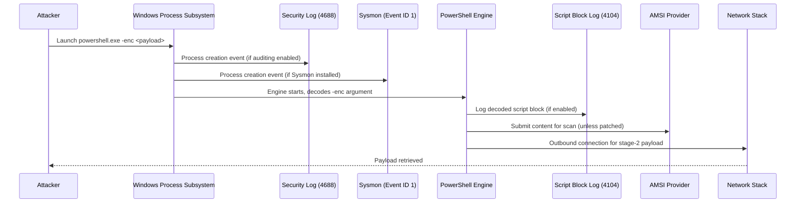

# Part II — How Attacks Become Data

## Why this chapter exists

Every other chapter in this book assumes you already understand one thing: an alert is not a
direct observation of an attacker's intent. It is the end product of a long chain of translations,
and every translation step can lose information, add noise, or fail outright.

The chain looks like this:

```
Adversary Behaviour
  → OS / Application Action
    → Artifact (change of state on the host)
      → Telemetry (that state change gets recorded somewhere)
        → Collector (something reads/ships the recorded event)
          → Parser (raw event becomes structured fields)
            → Schema (fields get mapped to a common data model)
              → SIEM / Data Lake (event lands in a queryable index)
                → Detection Logic (analytic runs over the field)
                  → Alert
```

Most detection engineers who are handed a MITRE technique ID jump straight from "adversary
behaviour" to "detection logic" — they think in terms of "Event ID 4688 means process creation,
write a rule." That shortcut is how you end up with rules that looked correct in a design review
and produced nothing in production, or worse, produced alerts nobody could act on because half the
fields they needed were never populated.

This chapter walks the full chain end to end, using one concrete example — a user or attacker
launching PowerShell — and follows it through every layer where evidence could show up. The goal
is not "here is a PowerShell detection." The goal is to build the habit of asking, for any
technique: which layers *could* produce evidence, which of those layers are actually enabled and
shipping in this environment, and what happens to my detection quality if one of them is missing.

**Hunter's Note**: If you can only describe a technique in terms of a single Event ID, you don't
yet understand the technique — you understand one artifact of one implementation of it, observed
by one sensor, under one set of default logging settings. That's a fragile place to build a
detection from.

## The chain, link by link

### Link 1: Adversary behaviour

This is the *intent* layer — something a human or a script is trying to accomplish: execute
attacker-controlled code, move laterally, exfiltrate data, establish persistence. Behaviour itself
leaves no trace anywhere. It only becomes observable once it causes something to happen on a
system.

[CONCEPT] Behaviour maps to MITRE ATT&CK techniques and sub-techniques, but a technique ID is a
label for a category of behaviour, not a specification of what telemetry it produces. T1059.001
(Command and Scripting Interpreter: PowerShell) covers everything from an admin running a
one-line diagnostic script to a fileless in-memory loader executed through reflection. Those two
things trigger overlapping but not identical telemetry.

### Link 2: OS/application action

The behaviour causes the operating system or an application to do something concrete: create a
process, open a handle, write a registry value, resolve a DNS name, authenticate a token. This is
the first point where the abstract intent becomes a deterministic, instrumentable action — but it
is still not "data" yet. It's just something the kernel or a subsystem did.

### Link 3: Artifact

The action leaves a change of state somewhere: a new PID and image path in the process table, a
new file on disk, a new registry key, a new row in the DNS cache, a new prefetch file, a page of
committed memory. Artifacts persist to different degrees — some vanish the moment the process
exits (command line in the process table, on some OS versions), some persist for weeks
(Prefetch), some are attacker-erasable (event logs, if they get local admin and run `wevtutil cl`).

**Engineering Reality**: An artifact existing does not mean it was recorded. Windows creates a
process whether or not Sysmon is installed, whether or not 4688 auditing is enabled, whether or
not your EDR agent is running that day. The artifact is a fact about the OS. Telemetry is a
*choice* someone made about which facts to capture.

### Link 4: Telemetry

Telemetry is the artifact expressed as a recorded event — an entry in the Security event log, a
Sysmon event, an EDR sensor event, a network flow record. This is the first layer that is
optional, configurable, and frequently under-scoped. It's also the layer most people skip past
when they say "the event log shows X" — they mean "the event log shows X, provided the right audit
policy/sensor/logging feature was turned on before the event happened," which is a much narrower
claim.

### Link 5: Collector

Something has to read the telemetry off the host and get it somewhere centralized: Windows Event
Forwarding, a Splunk universal forwarder, an EDR cloud channel, a syslog agent, Filebeat. Collectors
have their own failure modes independent of the telemetry itself: forwarder service stopped,
network path blocked, buffer overflowed and events were dropped, agent crashed and didn't restart,
disk queue filled up during a burst of activity (which, unhelpfully, is exactly when attacker
activity tends to generate the most events).

### Link 6: Parser

Raw telemetry — often semi-structured text, XML, or a proprietary binary/JSON shape — has to be
turned into named fields. This is where a huge amount of silent detection failure originates.
A parser that doesn't know about a new event subtype, doesn't handle a locale difference, expects
a field in position 4 that shifted to position 5 after a vendor update, or truncates an
oversized field (looking at you, long PowerShell command lines) will produce an event that looks
present in your SIEM but is missing or corrupting exactly the field your detection logic depends
on.

### Link 7: Schema

Individual parsed fields get mapped onto a common naming convention — Elastic Common Schema, OCSF,
a vendor CIM, or your own home-grown field names. This mapping is a design decision made by
whoever wrote your data model, and it's another point where information can be dropped (a
schema that doesn't have a slot for `OriginalFileName` will drop it even if the parser extracted
it) or conflated (mapping both `ParentImage` and `Image` loosely to `process.name` in a way that
makes parent/child relationships unrecoverable in a query).

### Link 8 onward: SIEM, detection logic, alert

Once the event is indexed with the right fields, you can finally write and run the query, correlate
it with other events, and generate an alert that a human sees. Everything downstream of this
point is what most training material treats as the *entire* subject of detection engineering. It
is, at most, the last two links of an eight-link chain.


## Worked example: PowerShell execution across every evidence layer

Take the simplest possible case: an attacker with an initial foothold runs a PowerShell one-liner
to download and execute a second-stage payload. In our scenario:

```powershell
powershell.exe -nop -w hidden -enc <base64-encoded-download-and-invoke-string>
```

Follow it through the chain.

**Adversary behaviour**: execute attacker-controlled code on a compromised host, T1059.001.

**OS action**: Windows creates a new process. The parent is whatever spawned it (a macro-enabled
Office document's child process, a scheduled task, an existing shell — in a phishing chain, often
`WINWORD.EXE` or `EXCEL.EXE` directly, or an intermediate `cmd.exe`). The image path resolves to
`C:\Windows\System32\WindowsPowerShell\v1.0\powershell.exe`.

**Artifact**: a process table entry (PID, PPID, image path, command line, user token, integrity
level), a Prefetch file update (`POWERSHELL.EXE-<hash>.pf`) recording that this executable ran
recently on this host, in-memory decoded script content that exists only for the process
lifetime, possible temp files or registry run-key writes depending on what the payload does next,
and network artifacts if it reaches out (a DNS resolution, a TCP connection, a TLS handshake, an
HTTP request).

Now — where does *evidence of this* show up, and what does each layer actually give you?

| Layer | What it can show | What it typically misses | Attacker evasion |
|---|---|---|---|
| Event ID 4688 (Security log, process creation auditing) | Image path, PID, PPID, user, (command line only if "Include command line in process creation events" GPO is enabled) | No parent image *name* by default in some configurations reconciled by PID only, no hashes, no network correlation | Command-line auditing GPO frequently left disabled; short-lived processes can still be missed if forwarding lags |
| Sysmon Event ID 1 (process creation) | Image, CommandLine, ParentImage, ParentCommandLine, User, IntegrityLevel, Hashes (if configured), a GUID for the process usable across all Sysmon event types | Requires Sysmon installed and a config that doesn't filter it out; hash computation costs CPU and some configs disable it | Renaming binaries doesn't help (hash still matches); running via reflection/in-memory can reduce *child* process creation but the initial powershell.exe launch still fires this |
| EDR process telemetry | Similar fields to Sysmon plus often richer context: loaded modules, memory-region flags, behavioural tags the vendor already computed, sometimes command-line reconstruction even after truncation | Vendor-specific field names and coverage vary; agent tampering/kill is a real category | Direct kernel object manipulation, EDR-aware attacker tooling, uninstalling/disabling the agent (needs elevated access) |
| Event ID 4104 (PowerShell script block logging) | The actual **decoded** script content, including de-obfuscated blocks PowerShell resolves internally — this defeats simple base64/string-concat obfuscation because logging happens after PowerShell's own parser resolves it | Only present if script block logging is enabled (`EnableScriptBlockLogging` GPO); very large scripts get split across multiple 4104 events you must reassemble by `ScriptBlockId` | Attackers can downgrade to PowerShell v2 (no AMSI, weaker logging) if v2 engine is still installed; heavy runtime obfuscation techniques exist that reduce block-log usefulness |
| AMSI (Antimalware Scan Interface) telemetry | Content submitted for scanning at the point .NET/PowerShell hands it to the AMSI provider — another de-obfuscation point independent of script block logging | Only as good as the AMSI provider's detection; some attacker techniques patch AMSI in memory (`AmsiScanBuffer` patching) to blind it | AMSI bypass techniques are common and well documented; if AMSI is patched, this layer produces nothing, silently |
| Prefetch | Confirms `powershell.exe` executed on this host at approximately this time, with some run-count/timestamp data — useful for **after-the-fact** forensic reconstruction | No command line, no arguments, no network activity, coarse timing; can be absent on SSDs with Superfetch/Prefetch tuned differently, and is cleared on some cleanup activity | Trivial to clear given local admin, though clearing it is itself an artifact if you're watching for that |
| Process memory | The actual decoded/decrypted payload if you can capture memory before it's freed — most complete picture, but must be captured live | Rarely collected automatically; needs a live-response trigger or EDR memory-scan feature; expensive to do at scale | In-memory-only payloads specifically bank on nobody capturing memory in time |
| Network telemetry (proxy/firewall/DNS logs, NetFlow) | The C2 or payload-staging destination, timing, volume, TLS certificate/JA3 if captured, DNS query if a domain was used | Doesn't tell you *which process* on the host made the connection unless correlated by host+time+port, or by EDR network-attribution fields | Payloads staged over HTTPS to common CDNs/legitimate cloud storage blend into normal traffic; DoH bypasses your DNS logging entirely if not blocked |



**[DETECTION ENGINEER]** The lesson from that table is not "collect everything." It's that these
layers are *not redundant copies of the same fact* — they answer different questions:

- 4688 / Sysmon 1 / EDR: **did a process get created, by whom, from what parent, with what
  literal command line?**
- 4104 / AMSI: **what did the code actually say after PowerShell resolved its own obfuscation?**
- Prefetch / memory: **forensic backstop when live logging failed or arrived too late**
- Network telemetry: **where did it go, and does that correlate with known bad infrastructure?**

A mature detection for this technique correlates at least two independent layers — e.g., Sysmon
Event ID 1 showing suspicious parent/child (`WINWORD.EXE` spawning `powershell.exe`) *and* an
encoded-command pattern in the command line, cross-checked against 4104 content when available.

### Illustrative Sigma detection — encoded PowerShell spawned from an Office process

```yaml
title: Suspicious PowerShell Launched from Office Application with Encoded Command
id: part02-01
status: experimental
description: >
  Detects powershell.exe spawned directly by an Office application, using an
  encoded/hidden-window command line consistent with a macro-driven downloader.
logsource:
  category: process_creation
  product: windows
detection:
  selection_parent:
    ParentImage|endswith:
      - '\WINWORD.EXE'
      - '\EXCEL.EXE'
      - '\POWERPNT.EXE'
      - '\OUTLOOK.EXE'
  selection_child:
    Image|endswith: '\powershell.exe'
  selection_args:
    CommandLine|contains:
      - '-enc'
      - '-EncodedCommand'
      - '-nop'
      - '-w hidden'
      - '-windowstyle hidden'
  condition: selection_parent and selection_child and selection_args
falsepositives:
  - Legitimate mail-merge or reporting macros that shell out to PowerShell (rare, but exists in
    some finance/legal workflows — verify against a change-managed allowlist before tuning out)
  - Internal tooling that uses Office as an automation front-end (uncommon, but present in some
    regulated environments running legacy VBA-driven reporting)
level: high
tags:
  - attack.t1059.001
  - attack.t1566
```

This is illustrative — field availability (`ParentImage`, `CommandLine`) assumes Sysmon or
equivalent EDR telemetry with process-lineage fields populated; the same logic against raw 4688
data would need to reconcile parent/child by PID+timestamp since native Windows auditing does not
always carry a clean `ParentImage` field by name.

## Detection Autopsy: the rule that only looked at one layer

**Original logic**: an analyst wrote a rule that alerted on any `powershell.exe` command line
containing `-enc`, sourced purely from the Security event log's 4688 events, because that was the
only log source shipping to the SIEM at the time. It looked reasonable: `-enc` is a genuinely
common encoding flag for both attacker droppers and legitimate encoded-argument scripts.

**Why it looked reasonable in review**: `-enc` is a real, well-known indicator (LOLBAS and multiple
threat reports call it out), the query was simple and fast, and a quick manual test with a red-team
sample fired correctly.

**What broke in production**:

1. Command-line auditing (the GPO that populates the `CommandLine` field on 4688) had been enabled
   on servers but not on the workstation OU during the initial rollout. Roughly 40% of endpoints
   were sending 4688 events with an *empty* command-line field. The rule was structurally blind on
   those hosts — not noisy, not quiet, just never able to fire, and nobody noticed for months
   because the absence of an alert looks identical to the absence of the behaviour.
2. On hosts where it *did* have command-line data, the rule fired constantly on a legitimate
   internal deployment tool that base64-encodes its arguments for an unrelated reason (avoiding
   shell-escaping issues with embedded quotes), producing several hundred false positives a week
   from a handful of admin workstations, which trained the on-call team to reflexively dismiss the
   alert.
3. It had no parent-process context, so an encoded diagnostic one-liner run interactively by IT
   support looked identical to one spawned from a phishing macro.

**False positives**: the internal deployment tool, plus any admin using `Invoke-Command` patterns
that happen to base64-encode a payload for transport.

**False negatives**: any attacker technique that avoided the literal `-enc`/`-EncodedCommand`
flag — reflection-based loaders that never invoke PowerShell.exe with an encoded argument at all,
`IEX (New-Object Net.WebClient).DownloadString(...)` one-liners with no encoding, or execution via
`powershell.exe -Command` with the payload embedded in a script file rather than the command line.
Also blind on any workstation missing command-line auditing — the exact gap described above.

**Missing context**: no parent-process lineage, no script-block content, no correlation with
network destination, no host-coverage awareness (the rule owner didn't know coverage was partial).

**Revised analytic**: moved the primary signal to Sysmon Event ID 1 (guaranteed `CommandLine`,
`ParentImage`, `ParentCommandLine`, `IntegrityLevel` fields once Sysmon is deployed, independent of
that GPO), added parent-process context (flagging Office/browser/archive-utility parents as higher
severity than an interactive `cmd.exe`/`explorer.exe` parent), added a secondary broader-net
analytic over 4104 script block content for known download-and-execute patterns
(`Net.WebClient`, `Invoke-Expression`, `DownloadString`, `IEX`) to catch non-encoded one-liners,
and added an explicit low-severity "telemetry gap" health check that alerts the detection engineering
team — not the SOC — when a host stops sending Sysmon Event ID 1 for more than a defined window,
so silent coverage loss is itself detected rather than assumed away.

**How it was tested**: replayed against a labelled sample set containing (a) the original red-team
encoded one-liner, (b) the internal deployment tool's legitimate encoded call, (c) a non-encoded
`IEX`/`DownloadString` variant, and (d) a run on a host with command-line auditing deliberately
disabled to confirm the Sysmon-based version still fired where the old 4688-based version would
have gone silent.

**Result**: true-positive detection preserved and extended to the non-encoded variant, false
positives on the deployment tool dropped to near zero once parent-process context was added
(the tool's parent process pattern differs from the phishing chain), and the coverage-gap check
surfaced two additional hosts mid-rollout that had Sysmon installed but misconfigured to filter out
process-creation events entirely — a gap that would otherwise have looked, from the SIEM's point of
view, exactly like "no PowerShell activity happened here."

## When a layer goes missing: what detection quality actually loses

**[MANAGEMENT] / SOC Management View**

Treat each telemetry layer as an independent, partially-overlapping insurance policy, not a nice-
to-have. The cost/benefit differs sharply by layer:

| Layer removed | Detection impact | Typical reason it's missing | Cost to restore |
|---|---|---|---|
| Command-line auditing (4688) | Lose literal arguments from native Windows logging; Sysmon/EDR can often substitute if deployed | GPO never rolled to all OUs, forgotten during new-host provisioning | Low — one GPO change, but needs fleet-wide verification |
| Sysmon | Lose parent/child lineage, consistent field naming across event types, optional hashing; EDR may substitute if its process telemetry is equally rich | Perceived as redundant with EDR, or config drift/filtering removes the events that matter | Medium — deployment plus config maintenance overhead |
| Script block logging (4104) | Lose actual decoded script content; back to inferring intent from command-line string matching alone, which obfuscation defeats easily | Performance/storage concerns (script blocks can be large and numerous), or simply never enabled | Low to enable, higher on the storage/ingest cost side at scale |
| AMSI telemetry | Lose an independent, provider-level de-obfuscation checkpoint; if AMSI itself is bypassed, this was never reliable anyway | Depends on antivirus/AMSI provider configuration and version; not all EDRs surface AMSI events distinctly | Low to enable if the provider supports it, effectively zero marginal benefit if attacker already patches AMSI |
| EDR agent | Lose richest behavioural context and often the fastest time-to-detection; single point of failure if it's your only source | Agent tampering, licensing gaps, unsupported OS/appliance that can't run an agent | High — this is usually a budget and licensing conversation |
| Network telemetry | Lose destination/infrastructure correlation; can't tell C2 from benign outbound without it | DNS-over-HTTPS bypassing your resolver logs, TLS inspection gaps, unmonitored egress paths | Medium to high depending on network architecture |

The practical implication: before you trust a "no alerts fired" result for any technique, check
whether that means "the behaviour didn't happen" or "the layer that would have shown it wasn't
collecting." These look identical downstream and only your telemetry inventory (see Part III and
Appendix A1/A5) can tell them apart.

**Engineering Reality**: In most environments audited for the first time, at least one of these
layers is either not deployed everywhere, misconfigured to drop the exact field a detection
depends on, or shipping to the SIEM with a parser that silently truncates or mis-maps a field.
Assume partial coverage until you've verified otherwise — verify by checking a live sample of the
event with the field populated, not by checking a config file that says the feature is "enabled."

## Threat hunter's angle: don't wait for the detection to fire

**[THREAT HUNTER]** The layered view above is also a hunting map. If your standing detection
depends on the command line containing `-enc`, hunt separately and periodically over:

- Script block content (4104) for download-and-execute idioms regardless of whether the outer
  command line was encoded.
- Parent/child process pairs that are individually unremarkable but rare in combination — Office
  or PDF-reader processes spawning any scripting interpreter (`powershell.exe`, `wscript.exe`,
  `mshta.exe`, `cscript.exe`) at all, ranked by rarity across the fleet rather than by a fixed
  blocklist of flags.
- Prefetch execution evidence on hosts that show *no* corresponding process-creation telemetry for
  the same binary in the same window — that gap itself is a finding, either a coverage hole or a
  sign that live logging was tampered with or arrived late.
- AMSI bypass indicators independent of the payload itself — e.g., known-bad in-memory patch
  patterns for `amsi.dll`, which some EDR platforms expose as a discrete event type separate from
  process creation.

A short hunt query pattern (illustrative KQL, Microsoft Sentinel/Defender schema) for the
"Office spawns scripting interpreter" idea, independent of any specific flag string:

```kql
DeviceProcessEvents
| where InitiatingProcessFileName in~ ("winword.exe","excel.exe","powerpnt.exe","outlook.exe")
| where FileName in~ ("powershell.exe","pwsh.exe","wscript.exe","cscript.exe","mshta.exe")
| project Timestamp, DeviceName, AccountName, InitiatingProcessFileName, FileName,
          ProcessCommandLine, InitiatingProcessCommandLine
| order by Timestamp desc
```

This is illustrative syntax for a Microsoft Defender/Sentinel-style schema and should be validated
against your actual table and field names before use — table names and casing vary by workspace
configuration and product version.

## Named artifacts in this chapter

- **part02-01** — Sigma detection: encoded PowerShell spawned from an Office application (T1059.001,
  T1566), included above.

## Summary

The habit this chapter is trying to build: for any attacker action, sketch the full chain from
behaviour to alert before you write a single line of detection logic. Identify every layer that
could plausibly produce evidence, check which of those layers are actually deployed and correctly
configured in your environment right now (not in the vendor's default documentation), and design
your detection — and your hunting cadence — to use more than one of them. When you can't get
multiple layers, at minimum know precisely which one you're depending on, and build a way to notice
when that one goes quiet.

> **[SCREENSHOT PLACEHOLDER — CONTROLLED LAB]** — Sysmon Event ID 1 process-creation log entry for
> a `powershell.exe` process spawned by a Windows host in a lab, captured to illustrate the
> populated `Image`, `CommandLine`, `ParentImage`, `ParentCommandLine`, `User`, and `Hashes`
> fields side by side with the same moment's Event ID 4104 script block log entry, to make the
> "different layers answer different questions" point concrete with real field values rather than
> the conceptual table above.

CONCEPTUAL SAMPLE (not captured evidence) — the shape of what that Sysmon Event ID 1 record would
contain, for reference while reading the table above:

```
Image: C:\Windows\System32\WindowsPowerShell\v1.0\powershell.exe
CommandLine: powershell.exe -nop -w hidden -enc SQBFAFgAIAAoAE4AZQB3AC0ATwBiAGoAZQBjAHQA...
ParentImage: C:\Program Files\Microsoft Office\root\Office16\WINWORD.EXE
ParentCommandLine: "WINWORD.EXE" /n "C:\Users\vic\Downloads\invoice_2026.docm"
User: CORP\vic
IntegrityLevel: Medium
UtcTime: 2026-09-15 14:02:11.318
```
