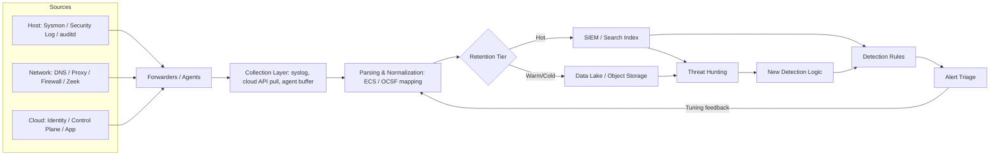
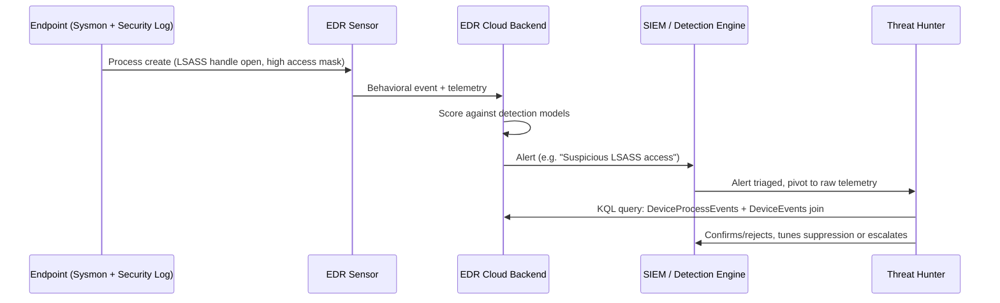
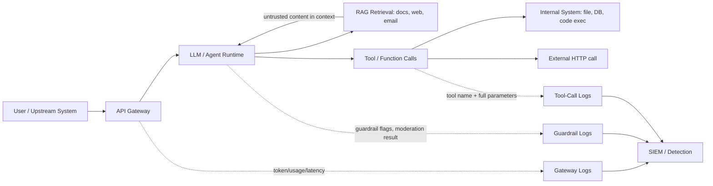

# Part III — Telemetry Engineering

Detection engineering fails or succeeds upstream of the rule. A perfectly written Sigma rule
against a field that isn't populated, a log source that rotated out before anyone looked at it, or
a parser that silently drops half the message is not a detection gap — it's a telemetry gap
wearing a detection gap's clothes. This part treats telemetry as its own engineering discipline:
what each source actually gives you, what it quietly does not, what it costs to keep, and where an
adversary can walk around it.

The recurring failure mode across every source below is the same shape: a team assumes a log
source has a property it doesn't (full command lines, full packet payload, indefinite retention,
tamper resistance) and only discovers the gap during an incident, when it's too late to go back
and collect what wasn't collected.

**Engineering Reality**: nobody budgets for parsing. Every telemetry source in this chapter will,
at some point, change its schema — a vendor renames a field, an OS update adds a new event
subtype, a cloud provider ships a v2 API with different casing — and your parser will either
silently drop the new shape or silently misparse it. Silent is the operative word: broken
ingestion rarely throws an error, it just under-reports. Budget recurring time for parser
validation, not just initial build.

## Source Survey

The table below covers every source in scope for this part at a compact level. Deeper prose
follows for the eight sources with the highest day-to-day operational leverage: Windows Security
Logs, Sysmon, PowerShell logging, Linux auditd, EDR/MDE, DNS, cloud identity logs, and AI
application logs.

| Source | Provides | Does NOT provide | Volume / cost | Blind spot / evasion | Operational value |
|---|---|---|---|---|---|
| Windows Security Log | Logon/logoff, privilege use, object access, account/group changes, audit policy changes | Command lines (unless 4688 auditing enabled), network payload, script content | Moderate–high; 4625/4768 storms during brute force or Kerberoasting | Log clearing (1102), audit policy tampering (4719), SID-to-name resolution failures | Foundational identity/access trail on Windows |
| Sysmon | Process creation w/ command line + hashes, network connections, file/registry/image-load, named pipes, WMI, DNS query (v13+) | Auth context, full payload, anything outside configured event types | High on busy hosts; config-dependent; real SIEM cost driver | Service can be stopped/uninstalled by admin; config tampering; excluded paths become blind zones | Best single free source for host behavioural detail |
| PowerShell logging (Module, ScriptBlock, Transcript) | Script content (deobfuscated at time of execution), pipeline invocation, module loads | Nothing if logging disabled or ScriptBlock not on; transcripts can be deleted locally | Can be very high with verbose ScriptBlock logging on scripting-heavy hosts | Obfuscation defeats naive keyword rules; downgrade to PSv2 skips ScriptBlock logging entirely (patched but check) | Highest-value source for living-off-the-land detection |
| Windows Defender (AV) | Detection/quarantine events, signature updates, scan results | Behavioural context around the file, most tradecraft below AV signature coverage | Low volume, cheap | Real-time protection can be tampered with (T1562.001); exclusions abused | Baseline hygiene signal, not primary detection source |
| Microsoft Defender for Endpoint | Rich process/network/file telemetry, behavioural alerts, Advanced Hunting (KQL) over raw events, live response | Retention/hunting depth tied to license tier; some telemetry deduplicated/sampled at scale | Subscription-tiered; hunting table retention commonly 30 days unless extended | EDR tamper/uninstall protection can be bypassed with local admin + known techniques; BYOVD | Primary EDR for many enterprises; strong pivot from alert to raw telemetry |
| Linux syslog/journald | Service and daemon messages, kernel messages, auth events routed via syslog | No structured process ancestry by default; format varies wildly by distro/daemon | Low–moderate; journald binary format adds parsing overhead | Local log tampering with root; journald can be configured volatile-only (no persistence) | Baseline OS-level visibility, inconsistent without hardening |
| auditd | Syscall-level events: exec, file access, network socket creation, user/group changes | No command-line beyond what rule captures; verbose without careful rule tuning; heavy CPU under bad rules | High if rules too broad; requires deliberate rule design | auditd itself can be stopped by root; rules audit but don't alert — needs pipeline | Closest Linux equivalent to Sysmon, more effort to tune |
| SSH (auth/session logs) | Successful/failed logins, key fingerprint used, source IP, session start/stop | Commands run inside the session (need shell logging/auditd/Sysmon-equivalent for that) | Low | Key-based auth logs differ from password auth; jump-host hides true source IP | Core access trail for Linux/network devices |
| sudo | Command executed, invoking user, target user, TTY | Nothing if sudoers NOPASSWD misused or logging redirected | Low | `sudo -s`/shell escapes then hide subsequent commands from sudo log alone | Privilege escalation trail, pairs with auditd |
| systemd | Unit start/stop/failure, timer activation | Not a security log by design; limited without journald forwarding | Low | Persistence via unit files can hide in plain sight among legitimate units | Persistence-hunting source (service/timer units) |
| Process telemetry (general) | Parent/child lineage, command line, hashes, signer | Varies hugely by collection tool; nothing if tool absent | Depends on collector | Process hollowing/injection breaks naive lineage assumptions | Core building block for almost all host detections |
| File telemetry | Create/modify/delete, hash, path, sometimes signer | Content inspection usually separate (YARA/AV integration) | High if unfiltered | Timestomping alters metadata; alternate data streams often unindexed | Ransomware/staging detection, integrity monitoring |
| Network telemetry (host-level) | Connection tuples, sometimes process-to-socket mapping | Payload content unless full packet capture | Moderate | Encrypted payload; process-to-socket mapping fails for kernel-mode C2 | Correlates host behaviour to network behaviour |
| DNS (resolver/query logs) | Query name, type, timestamp, source, response code | Full response chain unless logged explicitly; nothing for DoH/DoT bypass | High volume, cheap to log, expensive to retain fully | DNS-over-HTTPS/TLS bypasses local resolver entirely | Cheap, high-yield C2/exfil detection surface |
| Proxy | URL, method, user-agent, bytes, sometimes TLS SNI/cert | Payload if TLS-terminated proxy not doing inspection; nothing for direct-to-IP traffic bypassing proxy | Moderate–high | Direct connections bypassing proxy (split tunnel, personal hotspot) | Strong for web-based C2/exfil, policy enforcement evidence |
| Firewall | Allow/deny, 5-tuple, sometimes NAT translation | No application context, no payload | High volume, often under-retained | Allowed-by-design traffic looks identical to abuse of same allowed path | Perimeter/segmentation validation, not primary detection |
| Zeek | Rich protocol-aware logs (conn, dns, http, ssl/x509, files, notice) from packet capture | Requires tap/mirror placement; misses traffic not seen by the sensor (asymmetric routing, encrypted lateral movement without decrypt) | High engineering cost to deploy well, moderate storage per log type | Encrypted payload beyond metadata (JA3/JA3S mitigates partially) | Best network-layer ground truth when deployed properly |
| NetFlow / IPFIX | Flow metadata: 5-tuple, bytes, packets, duration | No payload, no DNS/HTTP detail | Low storage relative to full capture | Sampling at high rates loses short-lived flows entirely | Cheap long-retention network behavioural baseline |
| NDR | Behavioural network detections, often ML-assisted, encrypted-traffic analysis | Vendor-dependent transparency into alert logic ("why" is often opaque) | High licensing cost | Model drift/blind spots undisclosed by vendor; encrypted analysis is inference, not certainty | Complements EDR where host agent is absent (IoT/OT/unmanaged) |
| Cloud logs (control plane) | API calls, resource changes, IAM actions (CloudTrail, Azure Activity, GCP Audit) | Data-plane access to resource contents unless data events separately enabled | Cost scales with API call volume; data events much pricier | Some read-only/data-plane actions not logged by default (notorious CloudTrail gap history) | Backbone of cloud detection engineering |
| Identity logs (cloud) | Sign-ins, MFA method, conditional access decision, risk score | Session/token-level forensics without extra logging; on-host context | Retention often tier-gated (e.g., 30 days free) | Token theft/replay bypasses interactive auth entirely | Highest-leverage source in cloud-first environments |
| Email logs | Message metadata, delivery/routing, attachment hash, URL rewrite clicks | Full body/attachment content unless archived separately; encrypted body content | Moderate | Encrypted attachments, link redirection chains hide true destination | Primary initial-access detection surface |
| Application logs | App-specific events (login, transaction, error) | Wildly inconsistent structure across apps; security relevance often an afterthought in design | Highly variable | Devs log what's useful for debugging, not what's useful for detection | Essential but requires per-app normalization investment |
| Database logs | Query audit (if enabled), auth, schema changes | Full query logging often disabled by default for performance | Can be very high if full query audit enabled | Query logging frequently disabled precisely where it matters most (prod perf) | Insider threat / data exfil evidence, chronically under-enabled |
| WAF logs | Blocked/allowed requests, rule matched, payload snippet | Business-logic abuse that doesn't match a signature | Moderate | Encoding/obfuscation to slip signature matching; allowed traffic pre-block-decision | Web attack surface visibility, signature-bounded |
| API logs (gateway) | Endpoint, caller identity, rate, response code | Request/response body often excluded for privacy/size | High for busy APIs | Legitimate-looking credential-stuffing against API auth endpoints | Growing detection surface as attack surface shifts to APIs |
| AI application logs | Prompt/response metadata, tool-call/function-call invocations, model/version, token usage, guardrail flags | Full prompt/response content often redacted; reasoning traces frequently not persisted | New territory; volume/cost norms still forming | Prompt injection via retrieved content leaves no distinct "malicious" log shape; multi-turn jailbreaks split innocuous-looking turns | Emerging — treat like early-2000s web app logging: build it now or reconstruct incidents blind later |



## Windows Security Log

[CONCEPT] The Security event log is Windows' native audit trail: authentication (4624/4625/4634/4648/4672/4776), privilege use, object access (if SACLs are configured), account and group management (4720/4722/4728/4732), and audit policy changes (4719). It exists on every Windows host by default, which is both its strength and its limit — default retention and default audit policy are both too thin for detection work out of the box.

[ANALYST] Logon Type matters more than most analysts treat it: Type 2 (interactive), Type 3 (network — SMB, most lateral movement), Type 10 (RemoteInteractive — RDP), Type 5 (service) each imply a different attack surface. A 4624 with Type 3 from a workstation to another workstation off-hours is a different story than the same event to a file server during business hours.

[DETECTION ENGINEER] Command-line auditing (Event ID 4688) requires "Include command line in process creation events" via Group Policy — it's off by default, and Sysmon usually replaces this need with a richer event anyway. If both are present, resolve them into a single normalized "process creation" event type rather than treating them as independent signals — otherwise every process-creation alert doubles.

[ENGINEERING] Default log size on Security is small and rotates fast under load. Without forwarding to a SIEM or WEF/WEC collector, a busy domain controller can lose hours of 4768/4769 Kerberos events during a Kerberoasting spray before anyone looks. Provision log size and forwarding before an incident, not during one.

Common blind spot: audit policy itself is a target. Event ID 4719 ("audit policy changed") is frequently under-monitored, which means an attacker who disables object-access auditing on a sensitive file share leaves almost no trace of the change itself.

**MITRE techniques touched**: T1078 (Valid Accounts), T1558.003 (Kerberoasting, via 4769 pattern), T1070.001 (Clear Windows Event Logs, via 1102), T1562.002 (Disable Windows Event Logging).

## Sysmon

[CONCEPT] Sysinternals Sysmon is a kernel-mode driver plus user-mode service that logs process creation with full command line and hash, network connections, file creation, registry modification, image/driver loads, named pipe activity, and (recent versions) DNS query events — none of which the base Windows Security log gives you well.

[DETECTION ENGINEER] The single highest-value field is `ParentImage`/`ParentCommandLine` paired with `ProcessGuid`, which is unique per process instance across the machine's lifetime (unlike PID, which recycles). Building correlation logic on PID alone across a busy host is a known source of false correlation — always join on ProcessGuid where the config version supports it.

[ENGINEERING] Sysmon is only as good as its config. A permissive config drowns the SIEM in Event ID 3 (network connection) noise from routine browser and update traffic; an overly restrictive config (excluding common paths to cut volume) creates exactly the blind spots an attacker who's done reconnaissance on your environment will use. Test config changes against a baseline capture before pushing fleet-wide — a config edit is a detection-coverage change, not just a performance tweak.

[THREAT HUNTER] Sysmon Event ID 10 (ProcessAccess) is under-used for hunting: it logs one process opening a handle to another with a given access mask. Filtering for `TargetImage` = lsass.exe with access masks associated with memory-read rights, excluding known-good callers (other AV/EDR processes), is a durable hunt for credential-dumping tooling regardless of the specific tool name.

[ANALYST] Sysmon can be stopped, uninstalled, or reconfigured by anyone with local admin — it has no native tamper protection unless paired with a protected-process mechanism or an EDR product supervising it. Treat Sysmon service-stop events (logged by the Security log or EDR, not by Sysmon itself once it's dead) as a high-priority signal.

**MITRE techniques touched**: T1003.001 (LSASS Memory), T1055 (Process Injection), T1057 (Process Discovery via lineage review), T1562.001 (Impair Defenses — Sysmon service manipulation).

> **[SCREENSHOT PLACEHOLDER — CONTROLLED LAB]** — Sysmon process-creation log (Event ID 1) captured on a Windows test host, illustrating `CommandLine`, `ParentImage`, `Hashes`, and `ProcessGuid` fields as they'd appear in Event Viewer / forwarded JSON.

## PowerShell Logging

[CONCEPT] Three distinct capabilities, often conflated: Module Logging (logs pipeline execution of cmdlets), Script Block Logging (logs the actual code executed, including code that de-obfuscates itself at runtime — this is the important one), and Transcription (writes a plain-text session transcript to disk).

**Detection Autopsy — the keyword PowerShell rule**

*Original logic*: alert when Script Block Logging content matches `IEX` or `DownloadString` or `-EncodedCommand`.

*Why it looked reasonable*: those strings show up constantly in public offensive tooling and in real intrusions, so the base rate of true positives on a small test set looked good.

*What breaks in production*: `-EncodedCommand` flags a large amount of legitimate configuration-management tooling that ships base64-wrapped commands for line-length reasons; `IEX` appears in developer scratch scripts and in some vendor deployment scripts. False positive volume trains analysts to dismiss the alert reflexively — which is worse than not having the rule, because it burns attention budget on noise while a genuinely malicious hit gets the same reflexive dismissal.

*What breaks the other direction (false negative)*: Script Block Logging captures the code as executed, including after runtime deobfuscation — but only if Script Block Logging is actually enabled and the block size limit isn't truncating long blocks. String-splitting, character-code concatenation, and multi-stage download-then-invoke patterns rarely contain the literal substrings a keyword rule looks for at the point they'd match, and an attacker who has seen this class of detection (which is public, well documented) trivially avoids the literal tokens.

*Missing context*: parent process. `powershell.exe` spawned by `winword.exe` or `outlook.exe` is a materially different prior than the same command spawned by a scheduled task running a known internal script.

*Revised analytic*: combine parent-process context, suspicious-cmdlet co-occurrence (`New-Object Net.WebClient`, `Invoke-WebRequest` combined with `Start-Process` or `Add-MpPreference` in the same block), and a behavioral fallback — flag Script Block Logging entries with unusually high entropy or unusually long single-line length, which correlates with obfuscation regardless of which specific cmdlet is used.

```
title: Suspicious PowerShell Download-and-Execute Pattern with Office Parent
logsource:
  product: windows
  service: powershell
  definition: Event ID 4104 (Script Block Logging)
detection:
  selection_parent:
    ParentImage|endswith:
      - '\WINWORD.EXE'
      - '\EXCEL.EXE'
      - '\OUTLOOK.EXE'
  selection_behavior:
    ScriptBlockText|contains|all:
      - 'Net.WebClient'
    ScriptBlockText|contains:
      - 'DownloadString'
      - 'DownloadFile'
  condition: selection_parent and selection_behavior
falsepositives:
  - Legitimate internal automation scripts launched from Office macros (rare, but exists — verify against a change-managed allowlist)
level: high
```
*(Illustrative Sigma — field names and event mapping should be validated against your actual PowerShell/Sysmon logging pipeline before deployment; treat as a starting shape, not a drop-in rule.)*

*How it was tested (conceptually for this pass)*: run against a captured baseline of legitimate Office-macro-driven automation plus a simulated Emotet-style download cradle, confirm the parent-process gate suppresses the bulk of unrelated `IEX` noise while the behavioral pair still catches the cradle pattern.

*Result*: fewer, higher-confidence alerts; the tradeoff is a real coverage gap against download cradles launched from non-Office parents (e.g., a compromised scheduled task), which needs a second, differently-scoped rule rather than widening this one back into noise.

**MITRE techniques touched**: T1059.001 (PowerShell), T1027 (Obfuscated Files or Information), T1204.002 (Malicious File via macro-launched PowerShell).

## Linux auditd

[CONCEPT] auditd is the Linux kernel audit framework's userspace daemon — it logs syscalls matched by loaded audit rules: process execution, file access, network socket creation, and privileged operations. It is the closest Linux analogue to Sysmon, but ships with no default useful ruleset — you build the ruleset or you get almost nothing of value.

[DETECTION ENGINEER] The `execve` syscall rule (`-a always,exit -F arch=b64 -S execve`) is the foundation for process-execution visibility, roughly analogous to Sysmon Event ID 1, but arrives as raw syscall records keyed by numeric UID/GID and requires `ausearch`/`aureport` or a parser to become readable. Budget real engineering time for the auditd-to-SIEM pipeline — this is not a checkbox.

[ENGINEERING] Overly broad rules (auditing every file read under `/`, for instance) will measurably load a busy production host's CPU and can affect application latency. Scope file-watch rules (`-w /etc/passwd -p wa`) to specific sensitive paths rather than broad directory trees.

[HUNTER] auditd logs the syscall, not necessarily the intent — a `sudo -s` followed by an interactive shell breaks the clean command-per-line audit trail that `sudo`'s own log provides, because subsequent commands are now just shell activity under a root session, not individually logged sudo invocations. Pair auditd with shell history hardening (or better, session recording) if `sudo -s`/`su -` use is common in the environment.

**MITRE techniques touched**: T1548 (Abuse Elevation Control Mechanism — sudo misuse), T1070.002 (Clear Linux/Mac System Logs), T1053.003 (Cron persistence, visible via execve + file-write rules on crontab paths).

> **[SCREENSHOT PLACEHOLDER — CONTROLLED LAB]** — Linux `auth.log`/journald entries captured via SSH on a hardened test host, illustrating a `sudo` invocation line (command, invoking user, TTY, target user) alongside a failed SSH key-auth attempt for comparison.

## EDR / Microsoft Defender for Endpoint

[CONCEPT] EDR agents provide what host logging alone doesn't: continuous behavioral monitoring, memory scanning, script-content capture via AMSI integration, cross-host correlation in the cloud backend, and response actions (isolate, kill process, collect forensic package) from a single console. MDE additionally exposes Advanced Hunting — KQL queries over raw telemetry tables, not just fired alerts.

[MANAGEMENT] The gap between "we have EDR" and "we have full raw telemetry retained for 12 months" is a licensing and cost decision, not a technical given. Advanced Hunting retention defaults are commonly shorter than incident responders assume; verify actual retention against your license tier before promising a hunt window to leadership.

[DETECTION ENGINEER] EDR-native alerts are pre-scored and deduplicated by the vendor's backend — useful for triage, risky for detection engineering, because two logically distinct techniques can collapse into one vendor alert category. Pivot from the alert into the raw event tables (`DeviceProcessEvents`, `DeviceNetworkEvents` in MDE's schema, for example) to validate what actually happened before writing a custom detection on top of a vendor alert's metadata alone.

[ANALYST] EDR tamper protection is not absolute. Techniques include stopping the service with elevated/SYSTEM privileges obtained another way, BYOVD (Bring Your Own Vulnerable Driver) to load a signed-but-exploitable kernel driver that can blind or crash the sensor, and direct syscalls that skip usermode API hooks the sensor relies on. A tamper-protection alert firing, or a host that suddenly stops reporting heartbeats, is itself a high-priority signal — "quiet" is not "clean."



**MITRE techniques touched**: T1003.001 (LSASS Memory), T1562.001 (Impair Defenses), T1068 (Exploitation for Privilege Escalation via BYOVD).

## DNS

[CONCEPT] DNS query logs — from a resolver, forwarder, or endpoint agent — record the domain queried, query type, timestamp, source, and (if logged) response code and answer. It is one of the cheapest, highest-yield telemetry sources for command-and-control and exfiltration detection because almost every piece of malware still needs name resolution somewhere in its chain.

**Hunter's Note**: query volume and entropy are more durable signals than any domain blocklist. Blocklists chase infrastructure that rotates; a domain-generation algorithm or a DNS-tunneling channel produces a *shape* — high subdomain entropy, unusually large TXT/NULL record usage, abnormal query-per-minute rate from a single host — that survives infrastructure rotation.

[DETECTION ENGINEER] Illustrative KQL sketch for a DNS-tunneling style hunt against a query-log table:

```kql
DnsEvents
| where TimeGenerated > ago(24h)
| where QueryType in ("TXT", "NULL", "CNAME")
| extend LabelCount = array_length(split(Name, "."))
| where LabelCount >= 5
| summarize QueryCount = count(), DistinctSubdomains = dcount(Name) by ClientIP, bin(TimeGenerated, 1h)
| where QueryCount > 200 and DistinctSubdomains > 150
```
*(Illustrative — table/field names vary by platform; validate against your actual DNS logging schema.)*

[ENGINEERING] The single biggest blind spot in 2024-onward environments is DNS-over-HTTPS and DNS-over-TLS: a browser or malware sample configured to resolve via a public DoH endpoint bypasses the local resolver entirely, and the query never appears in your DNS logs at all — it shows up, if anywhere, as an HTTPS connection to the DoH provider's IP in network telemetry. Detecting DoH usage itself (known DoH endpoint list, or JA3/TLS-based heuristics) becomes a prerequisite for trusting your DNS log coverage claims.

**MITRE techniques touched**: T1071.004 (DNS, C2), T1568.002 (Domain Generation Algorithms), T1048 (Exfiltration Over Alternative Protocol via DNS tunneling).

### Worked Hunt Example — part03-01: DNS Tunneling / C2 Beacon Hunt Across DNS + Zeek + NetFlow

1. Start from DNS query logs: aggregate by client and hour, flag high distinct-subdomain-count clients against a rolling baseline (avoids static thresholds that break across environments of different size).
2. Pivot flagged clients into Zeek `dns.log` for the same window to recover full query/answer detail DNS logs alone may have truncated (TTL, answer record type, response size — tunneling tools often use unusually large TXT responses).
3. Cross-reference NetFlow for the same client/time window: tunneling traffic to the resolver itself is usually small-packet, high-frequency, and — critically — the *only* outbound flow if the host is otherwise idle, which is a strong corroborating signal absent from DNS logs alone.
4. Check whether the resolved-to authoritative nameserver is recently registered or has a small resolution footprint across the wider fleet (one client resolving a domain nobody else queries is more suspicious than a domain half the company queries).
5. Escalate to EDR process-to-socket mapping on the flagged host to identify which process is generating the queries — this is where the hunt closes the loop from network behavior back to host attribution.

> **[SCREENSHOT PLACEHOLDER — CONTROLLED LAB]** — Pi-hole DNS query log showing a burst of high-entropy subdomain queries against a single authoritative domain from one client IP, illustrating the query-rate and subdomain-entropy fields a tunneling hunt would key on.

## Cloud Identity Logs

[CONCEPT] Sign-in logs (Entra ID, Okta System Log) and their AWS/GCP equivalents (CloudTrail `ConsoleLogin`/`AssumeRole`, GCP Cloud Audit Logs identity events) are the highest-leverage telemetry source in a cloud-first environment, because identity — not the network perimeter — is now the primary control boundary.

[ANALYST] Fields worth anchoring on beyond success/failure: authentication method used (password vs. FIDO2 vs. legacy basic auth), conditional access policy result, client app (browser vs. legacy protocol like IMAP/POP which often can't enforce MFA), IP/ASN, and — where available — a sign-in risk score from the identity provider's own risk engine.

[DETECTION ENGINEER] Impossible-travel and token-replay heuristics are the classic cloud-identity detections; they're also the classic false-positive generators when VPN egress points or CDN-fronted corporate proxies make geolocation noisy. A revised version narrows on the token-replay signal specifically — same session/refresh token reused from an inconsistent device or IP fingerprint without a corresponding fresh interactive MFA — rather than geolocation distance alone.

```
title: Cloud Session Token Reuse From Inconsistent Device Fingerprint
logsource:
  product: azure
  service: signinlogs
detection:
  selection:
    ResultType: '0'
    AuthenticationRequirement: 'singleFactorAuthentication'
  same_session_diff_device:
    # conceptual: correlate SessionId/RefreshTokenId across two sign-ins
    # with differing DeviceId/Browser fingerprint within a short window
    TimeDeltaMinutes: '<15'
  condition: selection and same_session_diff_device
falsepositives:
  - Shared/kiosk devices; token refresh across legitimately paired mobile+desktop app sessions
level: high
```
*(Illustrative — session/token correlation of this shape typically requires a workbook or hunting query joining multiple sign-in events, not a single-event Sigma match; shown here as a conceptual detection logic sketch, id part03-03.)*

**SOC Management View**: default sign-in log retention on many identity provider free/basic tiers is 30 days. If a breach investigation needs 90+ days of sign-in history — routine for a slow-burn credential-based intrusion — and no export to a SIEM or long-term log store was configured in advance, that history is simply gone. This is a governance decision (export configuration, retention budget) that has to be made before the incident, and it's one of the most common gaps found during post-incident review.

[HUNTER] Legacy authentication protocols (IMAP, POP, SMTP AUTH, older Exchange Web Services calls) frequently can't enforce modern MFA/conditional access at all — an account with legacy auth still enabled is a standing bypass regardless of how strong the interactive MFA policy looks on paper. Hunting for any legacy-auth sign-in activity, successful or not, is worth doing as a standing query rather than a one-off.

**MITRE techniques touched**: T1078.004 (Valid Accounts: Cloud Accounts), T1550.004 (Web Session Cookie / token theft-replay), T1556 (Modify Authentication Process — legacy auth abuse).

## AI Application Logs

[CONCEPT] As LLM-backed applications and agents move into production — customer-facing chatbots, internal copilots, autonomous agents with tool/function-calling access to real systems — they generate a new telemetry category: prompt/response metadata, tool-call invocations with parameters, retrieval-augmented-generation (RAG) source documents pulled into context, guardrail/moderation flags, and API gateway metrics (token usage, latency, model version).

[ENGINEERING] Most teams log the API gateway layer (who called what model, how many tokens, response time) long before they log anything about content or behavior, because gateway metrics are cheap and privacy-uncomplicated. That's the layer that answers "is this expensive" — it does not answer "is this being abused."

[ANALYST] The behaviors worth watching are qualitatively different from classic host/network intrusion patterns: prompt injection (malicious instructions embedded in retrieved content — a document, a web page, an email — that the model ingests and follows), jailbreak attempts split across multiple individually-benign turns, and tool-call abuse where an agent with real system access (file read/write, code execution, outbound HTTP) is manipulated into calling a legitimate tool with attacker-serving parameters. None of these produce a single obviously-malicious log line the way a `mimikatz.exe` process-create event does.

[DETECTION ENGINEER] The most tractable near-term detections are at the tool-call boundary, not the natural-language boundary: log every tool/function invocation an agent makes with full parameters, and apply the same anomaly logic you'd apply to any privileged API — unusual target paths, unusual outbound destinations, parameter values that don't match the shape of legitimate application usage, invocation rate spikes. This treats the agent as a caller of your existing sensitive APIs, which lets existing detection infrastructure (API logs, database audit, WAF) pick up part of the load instead of requiring a wholly new NLP-based detection stack on day one.

[THREAT HUNTER] Because reasoning traces and full prompt/response bodies are frequently redacted or not persisted (privacy requirements, storage cost, or the vendor API simply not exposing them), a hunter reconstructing "why did the agent do that" after the fact is often limited to tool-call logs and whatever RAG source-document logging exists — treat the absence of content logging as a known constraint to plan around, not something to discover mid-investigation.



**MITRE techniques touched**: mapped in MITRE ATLAS (Adversarial Threat Landscape for AI Systems) rather than classic ATT&CK — relevant ATLAS categories include prompt injection and LLM data/tool exfiltration; where an agent's tool access reaches real infrastructure, standard ATT&CK techniques (T1005 Data from Local System, T1567 Exfiltration Over Web Service) become reachable through the agent as an intermediary.

## Closing the Loop

Every source above eventually funnels into the same three questions a detection engineer has to answer before writing a rule against it: what does this source reliably capture, what does it never capture no matter how it's configured, and what does an adversary have to do to make this source lie or go silent. Part IV builds detections on top of these sources — the coverage claims in Part IV are only as good as the honest answers to those three questions here.

**SOC Management View**: telemetry retention and volume are budget line items with security consequences attached — every retention-period shortcut and every "let's not log that, it's noisy" decision is a coverage decision made in advance of an incident that hasn't happened yet. Review source-by-source retention against realistic investigation windows (30/90/365 days) at least annually, not only after a breach reveals the gap.
