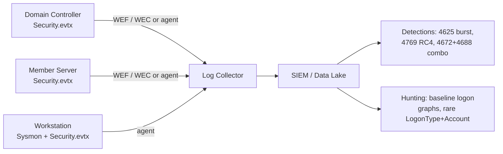
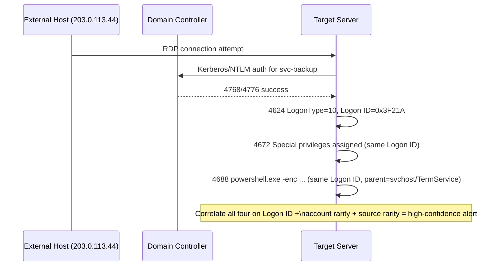

# Part IV — Windows Detection Engineering

## Why this part exists

Most Windows detection content on the internet is a table: Event ID, name, one-line description. That
table is useful as a lookup, but it is not detection engineering — it is trivia. An Event ID by
itself almost never tells you whether something bad happened. What tells you something bad happened
is the combination: which logon type, from which source, against which account, followed by which
process, at what time, relative to what baseline.

This part builds the Windows security event reference the way you actually need it in production:
per-event meaning and fields, then the context that turns a log line into a signal. We give the
deepest treatment to the events that carry the most detection weight — 4624/4625 (logon),
4672 (privileged logon), 4688 (process creation), 4768/4769/4771/4776 (Kerberos and NTLM
authentication) — and the Windows Logon Types, because almost every credential-based attack chain
on a Windows estate passes through this handful of events before anything else fires.

[ENGINEERING] Everything below assumes Advanced Audit Policy is configured (not the legacy basic
audit policy), that Sysmon or an EDR agent supplies process telemetry where native auditing is
thin, and that logs are centrally forwarded — because the Security event log on a busy domain
controller wraps in hours, not days, if you rely on local retention alone.



---

## 1. Windows Logon Types — the field that changes everything

Every 4624 (successful logon) and 4625 (failed logon) carries a `LogonType` field. This single
integer is the difference between "someone opened a file share" and "someone just RDP'd in from an
IP that has never touched this host before." Analysts who skip past `LogonType` and go straight to
"was there a 4624" are throwing away the most useful field in the entire Windows security log.

| Type | Name | What actually happened | Typical legitimate source | Typical attacker use |
|---|---|---|---|---|
| 2 | Interactive | Logon at the local keyboard/console | Physical console logon, KVM | Rare for remote attackers; relevant on kiosks, VDI hosts |
| 3 | Network | Connection to a shared resource (SMB, IPC$, most remote WMI/PsExec auth) | File share access, print, service-account binds | Lateral movement via SMB, PsExec, WMI, pass-the-hash |
| 4 | Batch | Logon by a scheduled task | Scheduled Task engine (`taskeng.exe`/`svchost`) | Persistence via scheduled task run-as |
| 5 | Service | Logon by a Windows service under a specific account | Service start (SCM) | Malicious service (see 7045) run as a domain/privileged account |
| 7 | Unlock | Workstation unlock, not a new session | User returning to locked screen | Rare in attack chains; watch for unlock immediately after a suspicious 4648 |
| 8 | NetworkCleartext | Network logon where credentials traveled in a form the LSA could see in cleartext (e.g. some IIS basic auth, some scripted auth) | Basic-auth web apps, some FTP/legacy | Credential capture opportunities; also seen with certain phishing-harvested-creds replay |
| 9 | NewCredentials | `RunAs /netonly` — new outbound network identity, local session unchanged | Admin using `runas /netonly` for a different network context | Attacker using captured/looted creds for lateral access while keeping local session as originally-compromised user |
| 10 | RemoteInteractive | RDP / Terminal Services logon | Legitimate remote admin, helpdesk, RDP jump host | Direct RDP intrusion, lateral movement via RDP, ransomware operators |
| 11 | CachedInteractive | Interactive logon using cached domain credentials, DC unreachable | Laptop logon off-network/off-VPN | Rare in intrusions; more a resilience/telemetry-gap signal (DC didn't validate it) |

[CONCEPT] The logon type tells you the *mechanism*, not the *intent*. Type 10 means "this was RDP."
It does not mean "this was an attacker." Type 3 means "this authenticated to reach a shared
resource." It does not mean "this was PsExec." You need the surrounding fields and events to get
from mechanism to intent.

### Why context matters — the layered example the brief asks for

A single event: `4624, LogonType 10, Account: svc-backup, Source IP: 203.0.113.44`.

On its own this is weak. Service accounts sometimes get logged into interactively by admins for
troubleshooting; IP geolocation on a NAT'd corporate range can look "external" incorrectly; a single
RDP logon proves nothing.

Now layer it:

1. `4624` Type 10, account `svc-backup`, source `203.0.113.44` — an IP that has never authenticated
   to this host in the last 90 days of baseline, and does not belong to any known VPN/jump-host
   range.
2. `svc-backup` is a member of a privileged group (Backup Operators, or worse, Domain Admins) —
   confirmed by directory data, or inferred because the same session shortly produces a `4672`
   (special privileges assigned at logon).
3. Within the same logon session (`Logon ID` correlates), a `4688` fires for
   `powershell.exe -enc <base64>` — a process type this account has never spawned in its history.
4. That PowerShell process makes further child processes or network connections consistent with
   discovery or credential access.

None of steps 1–4 is individually a high-confidence detection. Step 1 alone is "RDP from an unusual
IP" — happens for legitimate reasons (new remote worker, new vendor, dynamic IP reassignment) more
often than it happens for intrusions. Step 2 alone is "privileged account logged on" — that's every
normal admin day. Step 3 alone is "PowerShell ran" — happens thousands of times a day in most
estates. The chain of all four, correlated on the same `Logon ID` within a tight time window, is a
materially different and much higher-confidence signal than any single event. This is the core
argument of this whole part: **build detections on combinations correlated by Logon ID / Subject
fields, not on single Event IDs.**



**Hunter's Note:** Logon ID (`TargetLogonId` in 4624, referenced in 4672 and process events via
`SubjectLogonId`) is the join key that most SIEM content ignores because it requires a bit more
query work than filtering on account name. If you're not correlating on Logon ID, you're
re-deriving sessions from timestamps and guessing — and guessing produces both missed detections
and false correlations across concurrently-logged-on sessions.

---

## 2. Authentication and logon events — the core set

### 4624 — An account was successfully logged on

- **Source:** Security log, Microsoft-Windows-Security-Auditing, subcategory Logon.
- **Key fields:** `TargetUserName`, `TargetDomainName`, `LogonType`, `LogonProcessName`,
  `AuthenticationPackageName` (Kerberos/NTLM/Negotiate), `WorkstationName`, `IpAddress`, `IpPort`,
  `TargetLogonId`, `SubjectUserSid` (often blank/SYSTEM), `ElevatedToken` / `TargetUserSid`,
  `ProcessName`, `KeyLength`.
- **Normal example (conceptual sample):** helpdesk analyst `jsmith` logs on interactively at their
  own workstation, `LogonType 2`, `AuthenticationPackageName Negotiate`, `IpAddress -` (local
  console has no meaningful remote IP), during business hours, matching their historical pattern.
- **Suspicious example (conceptual sample):** account `svc-sql` (a service account that has never
  had an interactive or RDP session in 6 months of baseline) shows `LogonType 10`,
  `IpAddress 198.51.100.9` (external), `AuthenticationPackageName NTLM` (service accounts on this
  estate normally auth Kerberos internally — NTLM here is itself a minor anomaly), at 03:14 local
  time.
- **Detection opportunities:** first-seen `(Account, LogonType, SourceIP)` triples; NTLM where
  Kerberos is expected on an internal segment; service/machine accounts authenticating
  interactively or via RemoteInteractive; logons to Tier-0 assets (DCs) from non-PAW/non-jump-host
  sources; impossible travel between two source IPs for the same account within a short window.
- **False positives:** VPN/NAT IP churn causing "new source IP" noise; legitimate admin
  troubleshooting logons to service accounts; RDS/Citrix farms where many users legitimately show
  Type 10 constantly (baseline this population separately); DHCP re-lease changing a workstation's
  apparent source.
- **Correlations:** 4672 (privileged logon on the same Logon ID), 4688 (what process the session
  spawned), 4648 (explicit credential use preceding it), 4624 immediately following 4768/4769/4776
  (which authentication protocol actually validated the credential).
- **Blind spots:** 4624 tells you a logon succeeded, not what the session then did — you need
  process/network telemetry for that. Pass-the-hash and Kerberos ticket reuse both produce a
  perfectly normal-looking 4624; the event does not distinguish "typed the password" from "replayed
  a hash/ticket."
- **Evasion:** attackers favor LogonType 3 (Network) for lateral movement specifically because it
  is the highest-volume, least-scrutinized logon type in most environments (every SMB share access
  generates one); using existing valid sessions (token theft, ticket reuse) avoids generating a new
  4624 at all in some techniques.
- **Hunt questions:** Which accounts have a LogonType today that they've never used before? Which
  external-facing systems show Type 10 or Type 3 logons from source IPs outside known ranges? Which
  service accounts have ever produced Type 2, 7, 10, or 11?

### 4625 — An account failed to log on

- **Source/fields:** same schema family as 4624, plus `Status` and `SubStatus` codes (e.g.
  `0xC000006A` bad password, `0xC0000064` no such user, `0xC0000234` account locked).
- **Normal example:** a user mistypes their password once, `SubStatus 0xC000006A`, `LogonType 2`.
- **Suspicious example (conceptual sample):** dozens of 4625 events in under a minute for account
  `administrator`, `LogonType 3`, varying `WorkstationName`, all `SubStatus 0xC000006A`, from a
  single internal host — classic password-spray or brute-force pattern hitting a shared/local
  admin account across the estate.
- **Detection opportunities:** velocity-based (N failures per account per window), fan-out (one
  source hitting many accounts — spray) vs. fan-in (many sources hitting one account — distributed
  brute force), failures immediately followed by a success on the same account (brute-force
  success), failures against disabled/expired accounts (someone probing stale identities).
- **False positives:** service restarts with stale cached credentials retrying on a loop; expired
  password on a scheduled task nobody rotated; misconfigured mapped drives retrying at logon.
- **Correlations:** the 4625→4624 success sequence for the same account is far more actionable than
  either alone; correlate with 4740 (account lockout) which is the *consequence* of enough 4625s
  against a policy-locked account.
- **Blind spots:** an attacker with a correct low-and-slow spray rate (a handful of attempts per
  account, spread over days, one attempt per account per lockout-observation-window) can stay under
  velocity thresholds indefinitely; NTLM downgrade attempts may not always surface distinctly.
- **Evasion:** spray at a rate below lockout threshold and below your alert threshold; rotate source
  IPs/hosts to avoid fan-in detection; target only accounts confirmed to exist (avoids
  `0xC0000064` noise that's easier to threshold on).
- **Hunt questions:** Which accounts have failed logons from more distinct source hosts than their
  historical norm? Which source hosts have attempted authentication against the most distinct
  accounts this week?

### 4648 — A logon was attempted using explicit credentials

- **Meaning:** a process explicitly supplied a *different* set of credentials than the ones the
  current session is running under — e.g. `runas`, mapped drive with alternate creds, scheduled
  task "run as," or a tool like PsExec/WMI supplying creds directly.
- **Fields:** `SubjectUserName` (who initiated), `TargetUserName` (credentials used),
  `TargetServerName`, `ProcessName`.
- **Normal example:** an admin uses `runas /user:domainadmin` from their standard workstation to
  open an MMC snap-in.
- **Suspicious example:** a user's normal workstation process (e.g. Outlook, a browser) generates
  4648 events supplying domain admin credentials to an unfamiliar `TargetServerName` — credentials
  are being used from a context that shouldn't have them at all, often indicative of malware that
  harvested cached creds and is testing them.
- **Detection opportunities:** explicit-credential use from non-admin tooling; explicit-credential
  use targeting servers the subject account has no legitimate business reaching; volume spikes
  (credential-testing tools iterate many `TargetServerName` values with the same harvested creds).
- **False positives:** legitimate multi-hop admin workflows, password managers/RDP managers that
  cache and supply creds, service accounts designed to impersonate.
- **Correlations:** 4648 on host A followed by 4624 Type 3/10 on host B using the same
  `TargetUserName` within seconds is a lateral-movement pivot signature.
- **Blind spots:** does not fire for pass-the-hash/pass-the-ticket performed at a lower level than
  explicit `runas`-style credential supply (e.g. injected into an existing authenticated session).
- **MITRE:** T1078 (Valid Accounts), supports detecting T1550.002/.003 (Pass the Hash / Pass the
  Ticket) pivots when chained with 4624.

### 4672 — Special privileges assigned to new logon

- **Meaning:** fires when a logon session is granted one or more sensitive privileges (e.g.
  `SeDebugPrivilege`, `SeBackupPrivilege`, `SeTakeOwnershipPrivilege`) — in practice this fires for
  essentially every Administrators-group logon, so it is a *privileged session marker*, not a
  standalone alert.
- **Fields:** `SubjectUserName`, `PrivilegeList`, shares `Logon ID` with the corresponding 4624.
- **Normal example:** a domain admin logs on to a server for patching; 4672 fires alongside 4624
  Type 10, expected and routine.
- **Suspicious example:** 4672 fires for an account that is not supposed to be in any privileged
  group according to your identity data — indicating either group membership drift you didn't know
  about, or a token manipulation / privilege escalation technique granted rights outside normal
  provisioning.
- **Detection opportunities:** the real value of 4672 is as a *multiplier* — join it to 4624
  (logon type + source) and 4688 (what the privileged session then executed). A privileged 4672 on
  a workstation (not a server/DC) is itself often worth a lower-severity alert, since admin
  credentials showing up on end-user workstations is a common lateral-movement precursor
  (credential exposure via cached sessions, "admin logged into a phished user's laptop to help
  them" antipattern).
- **False positives:** every routine admin task on a server generates this; it is high volume by
  design.
- **Correlations:** 4672 + 4688 (privileged session spawns an unusual process) + LogonType 10/3 from
  unexpected source = the layered example from Section 1.
- **Blind spots:** does not tell you *which* privilege was actually used, only which were granted to
  the token; a session can hold `SeDebugPrivilege` and never invoke it.

### 4688 — A new process has been created

- **Source:** requires "Audit Process Creation" enabled, ideally with command-line auditing turned
  on (`Include command line in process creation events` GPO) — without that, 4688 gives you the
  process image but not the arguments, which guts most of its value.
- **Fields:** `NewProcessName`, `CommandLine` (if enabled), `ParentProcessName`,
  `SubjectUserName`, `SubjectLogonId`, `TokenElevationType`.
- **Normal example:** `explorer.exe` spawns `outlook.exe` at user logon.
- **Suspicious example (conceptual sample):**
  `ParentProcessName: winword.exe`, `NewProcessName: powershell.exe`,
  `CommandLine: powershell.exe -nop -w hidden -enc JABzAD0A...` — Office spawning encoded
  PowerShell is a textbook macro-dropper pattern.
- **Detection opportunities:** parent/child pairs that should never occur (`winword.exe` →
  `powershell.exe`/`cmd.exe`; `lsass.exe` spawning anything); encoded or obfuscated command lines;
  execution from user-writable paths (`%TEMP%`, `%APPDATA%`) for LOLBins; rare process names for a
  given host role.
- **False positives:** legitimate macro-driven business processes (some finance/reporting tooling
  does spawn PowerShell from Office — must be baselined per environment); software deployment
  tools that legitimately chain interpreters; developer workstations where this is normal noise.
- **Correlations:** everything upstream — 4624/4672 for who/how they got there, 4103/4104 for
  PowerShell script-block content if the process is `powershell.exe`.
- **Blind spots:** 4688 without command-line auditing enabled is close to useless for anything
  beyond "this binary ran"; fileless/reflective-loaded payloads that never spawn a distinct
  process won't show up here at all — that's EDR/Sysmon (Event ID 1) territory, and even then only
  if the loader itself is observed.
- **Evasion:** LOLBin renaming won't fool `NewProcessName` (that's the on-disk image path/hash, not
  attacker-controlled window title), but attackers do rename the *binary itself* on disk, use
  living-off-the-land binaries that look legitimate, or use process injection to avoid creating a
  new process image entirely.
- **Hunt questions:** What parent/child combinations exist in the estate that occur on fewer than N
  hosts? Which processes have command lines matching known encoding/obfuscation patterns (long
  base64 runs, `-enc`, `-e`, `IEX`, `FromBase64String`)?

### 4103 / 4104 — PowerShell module logging and script block logging

- **Source:** Microsoft-Windows-PowerShell/Operational log (not the Security log).
  4103 = module logging (records pipeline execution details); 4104 = script block logging (records
  the actual code executed, including de-obfuscated content when PowerShell itself decodes it at
  runtime).
- **Fields:** `ScriptBlockText` (4104), `Path`, `ScriptBlockId`.
- **Normal example:** a signed, versioned deployment script runs a documented cmdlet sequence.
- **Suspicious example (conceptual sample):** 4104 captures a script block containing
  `[Convert]::FromBase64String(...)`, `IEX`, `Net.WebClient`, `-bxor` — obfuscation and
  download-and-execute primitives in one block.
- **Detection opportunities:** this is your single best source for PowerShell *intent*, because
  4104 often captures the de-obfuscated final command even when the attacker heavily obfuscated the
  invocation on the 4688 command line. Alert on known offensive-tooling strings (with the caveat
  that serious attackers rename/reformat to dodge string matches), on `ScriptBlockText` length/entropy
  outliers, and on AMSI-bypass indicator strings.
- **False positives:** legitimate admin scripts, DSC, and many commercial management tools use
  patterns (base64 payload delivery, dynamic invocation) that overlap with offensive tooling
  signatures — tune per environment, expect noise initially.
- **Correlations:** join to 4688 for the parent process and command line, to 4624/4672 for who/how.
- **Blind spots:** PowerShell running with `-version 2` on hosts where the legacy engine is still
  present bypasses AMSI and much of this logging; some obfuscation techniques defeat static string
  detection even with full script-block content captured.
- **Engineering Reality:** if your build doesn't explicitly enable Script Block Logging (via GPO —
  "Turn on PowerShell Script Block Logging") on every host, you have 4688 command lines and nothing
  else for PowerShell activity, and attackers know this. This one GPO setting is one of the highest
  detection-value-per-effort changes available on a Windows estate, and it is routinely missing on
  servers that were built before someone thought about detection.

---

## 3. Kerberos and NTLM — the deep-dive set

### 4768 — A Kerberos authentication ticket (TGT) was requested

- **Source:** Domain Controller Security log, Kerberos Authentication Service.
- **Fields:** `TargetUserName`, `TargetDomainName`, `IpAddress`, `TicketOptions`,
  `TicketEncryptionType` (`0x12` AES256, `0x17` RC4), `Result Code` (`0x0` success,
  `0x6`/`0x12`/`0x18` various failures/pre-auth issues), `PreAuthType`.
- **Normal example:** a workstation logon generates a 4768 for the user's UPN, `EncryptionType 0x12`
  (AES), `Result Code 0x0`.
- **Suspicious example (conceptual sample):** a burst of 4768 requests for many *different*
  usernames from a single source workstation in a short window, several with
  `Result Code 0x6` (`KDC_ERR_C_PRINCIPAL_UNKNOWN`) — consistent with username enumeration/AS-REP
  probing (part of AS-REP roasting reconnaissance, T1558.004, looking for accounts with Kerberos
  pre-authentication disabled).
- **Detection opportunities:** RC4 (`0x17`) TGT requests in an estate that should be AES-only
  (downgrade indicator); requests with `PreAuthType` absent/`0` for accounts (AS-REP roasting
  candidates — accounts with "Do not require Kerberos preauthentication" set); high-volume
  requests from a single source for many target users.
- **False positives:** legitimate mixed-mode environments with older devices/appliances that only
  support RC4; some non-Windows Kerberos clients (certain NAS/print appliances) default to weaker
  encryption.
- **Correlations:** 4768 (TGT issued) → 4769 (service ticket requested using that TGT) is the normal
  Kerberos flow; a 4768 with no corresponding later 4769 activity from the same principal is not
  itself suspicious, but 4769 volume without a matching normal 4768 pattern is worth checking.
- **Blind spots:** golden ticket attacks (forged TGTs signed with the stolen KRBTGT hash) do not
  necessarily generate a 4768 at all on the real DC, because the ticket wasn't legitimately
  requested through the KDC — this is the classic blind spot that makes golden-ticket detection
  rely on *downstream* anomalies (4769 for tickets whose lifetime/attributes don't match domain
  policy, or PAC validation events) rather than the 4768 itself.
- **MITRE:** T1558.004 (AS-REP Roasting), T1558.001 (Golden Ticket) downstream implications.

### 4769 — A Kerberos service ticket was requested

- **Fields:** same family as 4768 plus `ServiceName`/`ServiceSid` (the target service principal),
  `TicketEncryptionType`, `TicketOptions`, `Result Code`.
- **Normal example:** a user's workstation requests a service ticket for `CIFS/fileserver01` with
  `EncryptionType 0x12`, once, when they map a drive.
- **Suspicious example (conceptual sample):** a single account requests service tickets for a large
  number of *distinct* SPNs in a short window (many different `HTTP/`, `MSSQLSvc/`, custom SPNs)
  with `EncryptionType 0x17` (RC4) — this is the classic Kerberoasting signature: an attacker
  enumerating SPN-registered accounts (often via LDAP first) and requesting RC4 service tickets for
  each, to crack offline.
- **Detection opportunities (this is the fully worked example below).**
- **False positives:** legitimate multi-service access patterns (a user or service account that
  genuinely touches many SPNs — e.g. a monitoring/backup service account) — this is the single
  biggest tuning fight for Kerberoasting detections and needs a real allowlist of known
  multi-service accounts plus volume/rate thresholds, not a flat "any RC4 request" rule.
- **Correlations:** 4768 preceding it (was there a normal TGT first, or is this ticket-only
  activity suggestive of ticket reuse/injection); 4688 on the requesting host around the same time
  (tool execution — Rubeus, PowerView, `setspn.exe` enumeration, native `.NET`
  `KerberosRequestorSecurityToken` calls all leave process/command-line traces worth correlating).
- **Blind spots:** encryption type alone is a weak signal in mixed environments; an attacker who
  requests tickets slowly, one account at a time, over days, evades simple volume thresholds; some
  Kerberoasting toolkits can request AES tickets too if the account's supported encryption types
  allow it — AES-encrypted Kerberoast tickets are crackable too, just far more expensive, so
  encryption type is a *tell*, not a *filter*.
- **Evasion:** targeting only accounts with weak/reused passwords already known through other
  recon; spacing requests to blend into normal service-ticket volume; using AES accounts to avoid
  the RC4 heuristic specifically.
- **MITRE:** T1558.003 (Kerberoasting).

**Detection Autopsy — the naive Kerberoasting rule**

*Original logic:* "Alert on any 4769 where `TicketEncryptionType = 0x17`." This is the rule almost
every new detection engineer writes first because Kerberoasting write-ups lead with "RC4 = bad."

*Why it looked reasonable:* Kerberoasting toolchains historically defaulted to requesting RC4
tickets because RC4 is dramatically cheaper to crack offline than AES, so RC4-encrypted service
tickets became shorthand for "someone is Kerberoasting."

*What breaks in production:* Any domain that isn't fully hardened to AES-only Kerberos policy has
routine legitimate RC4 traffic — older printers, some NAS appliances, legacy line-of-business
service accounts whose `msDS-SupportedEncryptionTypes` was never updated, and domain controllers
themselves negotiating RC4 for backward compatibility in specific scenarios. In most mid-size
estates this rule fires hundreds to thousands of times a day.

*False positives:* every legacy device and every un-hardened service account, every day, forever,
until someone does a real `msDS-SupportedEncryptionTypes` remediation project across the domain
(which is its own multi-month change-management effort, not a detection fix).

*False negatives:* an attacker who deliberately targets an AES-capable account, or who requests
tickets one at a time with hours between requests, sails through untouched — because the rule has
no volume or rarity component at all, an attacker doing exactly one careful RC4 request for one
juicy SPN doesn't stand out from the legacy-device noise floor either way, but the analyst who's
been trained to distrust the rule from FP fatigue is the real risk.

*Missing context:* requesting account identity and behavior baseline (has this account ever
requested service tickets for dozens of distinct SPNs before?), request volume/distinct-SPN-count
per account per time window, and correlation with recon activity (LDAP SPN enumeration, PowerView/
`Get-DomainUser -SPN`-style queries) that typically precedes a real Kerberoasting run.

*Revised analytic:* alert on an account requesting service tickets for an unusually high number of
**distinct** SPNs within a short window (e.g. more than N distinct `ServiceName` values in 10
minutes, tuned per environment), weighted higher when `TicketEncryptionType` is RC4 and the
requesting account has no history of multi-SPN requests, and cross-referenced against known
legacy/allowlisted service accounts.

*How it was tested:* validated against a labeled baseline of 30 days of production 4769 traffic to
confirm normal multi-SPN accounts (backup/monitoring service accounts) are captured as an
allowlist rather than tripping the rule, then validated against Kerberoasting simulation traffic
(e.g. Rubeus `kerberoast` against a controlled set of test SPNs in a lab domain) to confirm the
distinct-SPN-count threshold catches the attack pattern within the intended window.

*Result:* alert volume dropped from four-digit daily noise to single-digit weekly candidates,
each with an actual distinct-SPN-count and requesting-account-rarity justification an analyst can
triage in under a minute, instead of a wall of RC4 events nobody has time to look at — which in
practice means the naive version was actively harmful: it trained the SOC to ignore Kerberoasting
alerts entirely.

**Illustrative Sigma rule (part04-01 — Kerberoasting via anomalous distinct-SPN service ticket
requests)** — illustrative, would need field-name validation against your specific log source
(native Windows Security channel vs. a SIEM's normalized schema):

```yaml
title: Possible Kerberoasting - High Distinct SPN Service Ticket Request Volume
id: part04-01
status: experimental
description: >
  Detects a single account requesting Kerberos service tickets (4769) for an
  unusually high number of distinct service principals within a short window,
  weighted by RC4 encryption use and exclusion of known multi-service accounts.
logsource:
  product: windows
  service: security
  definition: 'Requires Domain Controller Kerberos Service Ticket auditing (4769)'
detection:
  selection:
    EventID: 4769
    TicketOptions|contains: '0x40810000'   # forwardable/renewable flag pattern, tune per environment
  filter_known_service_accounts:
    TargetUserName:
      - 'svc-backup-known'
      - 'svc-monitor-known'
  timeframe: 10m
  condition: selection and not filter_known_service_accounts | distinct_count(ServiceName) by TargetUserName > 8
fields:
  - TargetUserName
  - ServiceName
  - TicketEncryptionType
  - IpAddress
level: high
tags:
  - attack.credential_access
  - attack.t1558.003
```

**Illustrative KQL companion hunt (part04-02)** for the same behavior, phrased for a Sentinel-style
`SecurityEvent` table — illustrative syntax, verify field names against your actual schema:

```kql
SecurityEvent
| where EventID == 4769
| where TicketEncryptionType == "0x17"
| where TargetUserName !in ("svc-backup-known", "svc-monitor-known")
| summarize DistinctSPNs = dcount(ServiceName), SPNList = make_set(ServiceName) by TargetUserName, bin(TimeGenerated, 10m)
| where DistinctSPNs > 8
| order by DistinctSPNs desc
```

### 4771 — Kerberos pre-authentication failed

- **Meaning:** a TGT request failed at the pre-authentication stage — usually a bad password, but
  the `Failure Code` distinguishes causes (`0x18` = bad password, `0x2` = no pre-auth performed).
- **Detection opportunities:** this is the DC-side equivalent of a 4625 for Kerberos-only clients
  and is important because some brute-force/spray tooling talks Kerberos directly rather than NTLM,
  which means it will *not* show up as 4625 at all — if you only watch 4625 for brute-force
  detection, Kerberos-native spraying tools are a blind spot. Correlate for the same fan-out/fan-in
  patterns described under 4625.
- **False positives:** same causes as 4625 — expired passwords on services, clock skew causing
  pre-auth failures unrelated to credential guessing.
- **Blind spots:** does not fire for AS-REP roasting targets (accounts without pre-auth required
  don't hit this failure path at all — that's the point of the technique).

### 4776 — The domain controller attempted to validate credentials for an account (NTLM)

- **Meaning:** DC-side NTLM authentication attempt logging — fires for NTLM auth regardless of the
  logon type that eventually results, so it is your primary DC-side visibility into NTLM use across
  the domain.
- **Fields:** `TargetUserName` (note: no domain field, and no source IP — a well-known and
  important limitation), `Workstation` (the computer name that initiated the request, not
  necessarily accurate/complete), `Error Code`.
- **Normal example:** a legacy application server authenticates a service account via NTLM to the
  DC, `Error Code 0x0`.
- **Suspicious example:** a spike of 4776 events for many accounts from a single `Workstation`
  value, mixed success/failure — NTLM-based brute-force/spray, or a relay attack where a captured
  NTLM authentication is relayed to the DC.
- **Detection opportunities:** NTLM usage volume trending (should be shrinking over time in a
  hardened estate — rising NTLM volume is itself worth investigating as a regression); fan-out
  failure patterns; correlate `Workstation` field values that don't match any real hostname in your
  asset inventory (relay tooling often supplies an attacker-controlled or spoofed workstation
  name).
- **False positives:** legacy line-of-business apps hardcoded to NTLM, printers/appliances,
  cross-forest/cross-domain trust scenarios that still negotiate NTLM.
- **Blind spots:** **no source IP field** — this is the single biggest limitation of 4776; you
  cannot pivot from a 4776 straight to "where did this come from" without correlating against
  `Workstation` name (unreliable) or joining to a 4624 on the target member server, which *does*
  carry `IpAddress`. This is a very common gap: teams write 4776-based detections expecting
  IP-based enrichment and then discover mid-incident that the field doesn't exist.
- **Correlations:** join to member-server 4624 (same account, tight time window) to recover source
  IP; join to 4648 for explicit-credential chains; NTLM relay detections benefit from correlating
  4776 against SMB/LDAP signing enforcement logs where available.
- **MITRE:** T1557 (Adversary-in-the-Middle, NTLM relay variants), T1110 (Brute Force), T1078.

**Engineering Reality:** the absence of a source IP on 4776 is not a misconfiguration you can fix
with an audit policy tweak — it's a schema limitation of the event itself. Any runbook that says
"pivot from 4776 to source IP" needs an explicit join step to a different event, and if your SIEM
normalization silently drops null/missing fields instead of flagging them, analysts will waste time
looking for a field that was never going to be there.

---

## 4. Object, task, and service events (lighter treatment)

| Event | Meaning | Primary detection angle |
|---|---|---|
| **4697** | A service was installed on the system (Security log, requires Audit Security System Extension) | New service installation outside change windows, unsigned binary paths, service binaries in user-writable directories; correlates with **7045** below |
| **4698** | A scheduled task was created | New scheduled tasks with suspicious actions (`powershell.exe`, `rundll32.exe`, staged payload paths), tasks created by non-admin accounts, tasks with unusual triggers (at logon, at startup) — T1053.005 |
| **4702** | A scheduled task was updated | Modification of an existing legitimate task to add malicious actions — often stealthier than creating a new task, since it doesn't trip "new task created" baselines |
| **4719** | System audit policy was changed | Audit policy tampering preceding other malicious activity — an attacker disabling process-creation or logon auditing before continuing; treat as a near-critical tripwire event, very low legitimate volume |
| **7045** | A new service was installed (System log, Service Control Manager) | Same intent as 4697 but logged to the System channel and enabled by default (no special audit policy needed) — often the more reliably-present of the two in practice; watch `ImagePath` for LOLBin abuse, encoded commands, or paths outside `Program Files`/`Windows` |

**Correlations for this group:** 4697/7045 (service creation) immediately followed by a 4624
LogonType 5 (service logon) and a 4688 for the service binary is the standard "malicious service
persistence" chain. 4719 with no corresponding change-ticket is treated as a standalone
high-priority alert regardless of what follows, because legitimate audit policy changes are rare
and almost always planned.

**False positives across this group:** legitimate software installers and patch deployment tools
generate 4697/7045 constantly — this category needs an allowlist tied to your patch/deployment
tooling's known service accounts and binary paths, or it drowns in noise. Scheduled task creation
(4698) is similarly noisy from legitimate IT automation (SCCM, Ansible-via-WinRM, backup software).

**Blind spots:** 4702 (task *update*) is checked far less often than 4698 (task *creation*) in most
detection content — deliberately updating an existing, already-trusted task to add a malicious
action is a known technique to avoid "new scheduled task" detection logic entirely.

---

## 5. Account and group management events (lighter treatment)

| Event | Meaning | Detection angle |
|---|---|---|
| **4720** | A user account was created | New accounts outside provisioning workflow/ticket, accounts created then immediately added to privileged groups (chain to 4728/4732), accounts created by non-IdM service accounts |
| **4724** | An attempt was made to reset an account's password | Password resets on privileged accounts by non-helpdesk actors, resets immediately preceding a 4624 from a new source (attacker resetting a compromised-but-locked-out account to regain access) |
| **4728** | A member was added to a security-enabled global group | Additions to sensitive groups (Domain Admins, Enterprise Admins, Backup Operators) — very low legitimate volume, should be near-zero-tolerance alerting with change-ticket correlation |
| **4732** | A member was added to a security-enabled local group | Local Administrators group additions on servers/workstations — common privilege-escalation persistence step; watch for additions by accounts that aren't the standard admin-group-management tooling |
| **4740** | A user account was locked out | Consequence signal — correlate backward to the 4625 burst that caused it; lockouts on privileged accounts specifically deserve faster triage than routine helpdesk-ticket lockouts |
| **4798** | A user's local group membership was enumerated | Reconnaissance signal (`net user <account> /domain`-style queries, or tooling like BloodHound/PowerView collectors) — high legitimate volume from management tooling, so needs source-process/account baselining, not a standalone alert |
| **4799** | A security-enabled local group membership was enumerated | Same reconnaissance category as 4798, often generated together by the same recon tooling enumerating local Administrators/RDP group membership across many hosts |

**Correlations:** 4720 → 4728/4732 in quick succession (new account, immediately privileged) is one
of the highest-value low-volume detections available in this category — legitimate provisioning
almost never grants privileged group membership in the same action as account creation. 4798/4799
at volume across many hosts in a short window from a single source account is a strong lateral
reconnaissance indicator (mirrors what BloodHound-style collection looks like on the wire).

**MITRE:** T1136/T1136.002 (Create Account), T1098 (Account Manipulation), T1069 (Permission Groups
Discovery) for 4798/4799.

---

## 6. Log tampering — 1102

**1102 — The audit log was cleared.**

- **Source:** Security log itself (ironically, clearing the log generates one final event in it, if
  the clearing happens through the standard API — a fully-privileged direct manipulation of the
  log file at rest could in principle avoid even this).
- **Fields:** `SubjectUserName`, `SubjectLogonId`.
- **Why it matters disproportionately for its volume:** legitimate log clearing is vanishingly rare
  in a properly managed estate (log rotation should be automatic, not manual clearing), so this
  event should be treated as a near-guaranteed incident indicator, not tuned against a baseline the
  way volume-based detections are.
- **Detection opportunities:** alert on every occurrence, full stop, with no suppression window;
  treat as an automatic severity escalation on whatever incident (if any) is already open for that
  host, since log clearing is almost always a cover-up step late in an intrusion, not an opening
  move.
- **False positives:** deliberate, documented log-clearing as part of imaging/decommissioning a
  host, or specific compliance-driven log rotation tooling that clears rather than archives — both
  should be rare enough to allowlist explicitly by change ticket rather than by broad exception.
- **Blind spots:** only covers the Security log specifically; other log channels (System,
  Application, PowerShell Operational) have their own equivalent clear events and are cleared
  independently — an attacker who only clears Security and forgets PowerShell Operational leaves
  evidence behind, which is a real and common operator mistake worth hunting for.
- **Correlations:** almost always follows a period of activity you'd want to reconstruct — pair the
  1102 timestamp with whatever centralized/forwarded copy of the log exists elsewhere, because the
  entire point of forwarding logs off-host in near-real-time is that a local 1102 doesn't delete
  the forwarded copy.
- **MITRE:** T1070.001 (Clear Windows Event Logs).

**SOC Management View:** 1102 is one of the few Windows events where the right SOC policy is "zero
tuning, zero suppression, page someone" regardless of time of day. If your alerting on this event is
routed through a normal ticket queue with SLA-based triage, that's a governance gap worth raising —
by the time a queue-based SLA gets to it, the attacker has had hours-to-days of head start on
whatever they were covering up. This is also a strong argument for centralized, near-real-time log
forwarding as a control in its own right, independent of any specific detection: local log integrity
is not something you can rely on once a host is compromised at admin level.

---

## 7. Bringing it together — a worked hunt walkthrough

**Hunt part04-03 — Privileged RemoteInteractive sessions from unbaselined sources with anomalous
child processes.**

Hypothesis: an attacker with a privileged credential (phished, dumped, or purchased) will RDP
directly into a server or workstation from infrastructure that has no logon history against that
account, then use the session for discovery or further credential access.

Data needed: 4624 (Security, all hosts), 4672 (Security), 4688 with command-line auditing
(Security), 4103/4104 (PowerShell Operational) — ideally centralized in a SIEM/data lake with
90+ days retention, since baseline-building needs history.

Illustrative KQL sketch (part04-03), Sentinel-style schema, illustrative and unverified against a
live schema:

```kql
let baseline = SecurityEvent
| where EventID == 4624 and LogonType == 10
| where TimeGenerated between (ago(90d) .. ago(1d))
| summarize KnownSources = make_set(IpAddress) by TargetUserName;
SecurityEvent
| where EventID == 4624 and LogonType == 10
| where TimeGenerated > ago(1d)
| join kind=leftouter baseline on TargetUserName
| where IpAddress !in (KnownSources)
| join kind=inner (
    SecurityEvent | where EventID == 4672 | project TargetLogonId, PrivilegeList
  ) on $left.TargetLogonId == $right.TargetLogonId
| join kind=inner (
    SecurityEvent | where EventID == 4688 | project SubjectLogonId, NewProcessName, CommandLine
  ) on $left.TargetLogonId == $right.SubjectLogonId
| project TimeGenerated, TargetUserName, IpAddress, PrivilegeList, NewProcessName, CommandLine
```

Walkthrough logic: build a 90-day per-account source-IP baseline for Type 10 logons, flag Type 10
logons from IPs outside that baseline where the same Logon ID also produced a 4672 (privileged
token) and a 4688 (process execution) — surfacing exactly the layered pattern from Section 1, as a
repeatable hunt rather than a one-off alert. Analysts reviewing hits should pull 4103/4104 for the
same Logon ID if the flagged process is `powershell.exe`, to see actual script content before
escalating.

Expected output volume: low, if the baseline window is long enough and privileged-account
population is reasonably small — this is meant to run weekly as a hunt, not stream as a real-time
alert, because the 90-day baseline join is comparatively expensive and the behavior it's looking for
doesn't require sub-hour detection latency to still be actionable.

> **[SCREENSHOT PLACEHOLDER — CONTROLLED LAB]** — Windows Security Event Log (Event Viewer or
> forwarded WEC view) on a domain-joined member server, filtered to Event ID 4624 with LogonType 10,
> showing the `IpAddress`, `TargetUserName`, and `TargetLogonId` fields, from a Windows Server test
> host in a controlled AD lab — would illustrate the exact field layout referenced throughout
> Sections 1 and 3. Not yet captured; no Windows AD lab is currently provisioned in this
> environment's infrastructure (the existing home lab is Proxmox/Linux-container based).

> **[SCREENSHOT PLACEHOLDER — CONTROLLED LAB]** — PowerShell Operational log entry for Event ID
> 4104 showing a `ScriptBlockText` field with a deliberately-obfuscated, de-obfuscated-at-capture
> base64/IEX payload, from a Windows 10/11 or Server test host with Script Block Logging enabled —
> would illustrate the de-obfuscation behavior described in Section 2's PowerShell logging entry.

---

## 8. Coverage summary

| Category | Events covered | Depth |
|---|---|---|
| Logon mechanics | 4624, 4625, 4648, 4672, Logon Types 2/3/4/5/7/8/9/10/11 | Deep |
| Process/script execution | 4688, 4103, 4104 | Deep (4688), moderate (4103/4104) |
| Kerberos/NTLM | 4768, 4769, 4771, 4776 | Deep |
| Persistence objects | 4697, 4698, 4702, 7045 | Light |
| Account/group management | 4719, 4720, 4724, 4728, 4732, 4740, 4798, 4799 | Light |
| Log integrity | 1102 | Focused (low volume, high severity) |

**Named detections/hunts in this chapter:** part04-01 (Kerberoasting distinct-SPN Sigma rule),
part04-02 (Kerberoasting KQL companion), part04-03 (privileged RemoteInteractive baseline-deviation
hunt).

**References (title/publisher only, no fabricated URLs):** Microsoft Learn — "Audit Logon" and
"4624(S): An account was successfully logged on"; Microsoft Learn — "4769(S, F): A Kerberos service
ticket was requested"; Microsoft Learn — "Event 1102(S) The audit log was cleared"; MITRE ATT&CK —
T1558.003 (Steal or Forge Kerberos Tickets: Kerberoasting), T1070.001 (Indicator Removal: Clear
Windows Event Logs), T1110 (Brute Force), T1136 (Create Account); Sysmon and PowerShell
"about_Logging_Windows" documentation for script block logging behavior.
