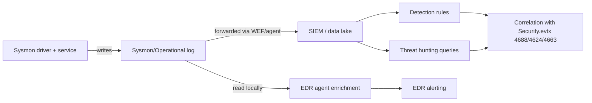

# Part V — Sysmon as Detection Telemetry

Sysmon (System Monitor, part of the Sysinternals suite) is the single highest-leverage free
telemetry source on Windows for detection engineering. Native Windows Security auditing tells you
that something happened in broad strokes — a logon, a process launched with limited fields, an
object was accessed. Sysmon tells you the same story with the fields an analyst actually needs:
full command lines, parent-child lineage with hashes, image load chains, named pipe names, DNS
queries tied to the requesting process. It does not replace EDR. It does replace weeks of
guesswork when you're trying to figure out why a rule fired.

This chapter goes event-by-event through the Sysmon IDs that carry the most detection weight,
with an honest accounting of noise, field reliability, and what breaks when you try to run these
in production instead of a lab.

[ENGINEERING] Sysmon writes to `Microsoft-Windows-Sysmon/Operational`. Every event has a
`RuleName` field populated from your config's `<Rule name="...">` attribute — use it. If you don't
tag rules, you lose the ability to tell, six months later, why a given event was logged at all.



## Event ID 1 — Process Creation

**What it captures:** full command line, parent process (image, PID, command line), process
hashes (configurable — SHA256 recommended alongside IMPHASH), integrity level, user, and
`OriginalFileName` from the PE header.

**Why it matters:** this is the backbone event for almost every detection built against
execution behaviour — LOLBins, encoded PowerShell, suspicious parent-child pairs
(winword.exe → cmd.exe), living-off-the-land binaries invoked with unusual arguments. Windows
Security 4688 gives you process creation too, but without a reliable full command line unless
command-line auditing is explicitly enabled via GPO, and even then Sysmon's parsing and parent
info is generally richer.

**Noise level:** high volume, but signal-rich. This is usually 40-60% of total Sysmon event
volume in a workstation fleet.

**Field quality:** `OriginalFileName` is one of the more valuable and underused fields — it
survives renaming of the binary (rundll32.exe renamed to update.exe still reports
`OriginalFileName: RUNDLL32.EXE`). Hashes are reliable unless the config disables them for
performance.

**Performance impact:** moderate — hashing every process creation costs CPU, especially on
build servers or systems with heavy short-lived process churn (CI runners, package managers).

**Common exclusions:** endpoint AV/EDR self-telemetry, backup agent spawning, and known noisy
admin tooling (SCCM, patch management clients) are the usual candidates for config-level
filtering — but exclude by full path and hash, never by process name alone.

[DETECTION ENGINEER] Illustrative Sigma-style logic for a common LOLBin abuse pattern
(`rundll32.exe` invoking a DLL export directly from a UNC path — often JavaScript/VBScript
proxy execution or a staged payload):

```yaml
title: Rundll32 Execution From UNC or Temp Path (Illustrative)
logsource:
  product: windows
  category: process_creation
detection:
  selection:
    Image|endswith: '\rundll32.exe'
  suspicious_path:
    CommandLine|contains:
      - '\\\\'
      - '\AppData\Local\Temp\'
      - '\Users\Public\'
  condition: selection and suspicious_path
falsepositives:
  - Some legitimate software update mechanisms stage DLLs to Temp before invoking rundll32
level: medium
```

**Hunter's Note:** don't hunt for `rundll32.exe` by name — hunt for the `OriginalFileName`
field equal to `RUNDLL32.EXE` where the on-disk image path doesn't end in `rundll32.exe`. That
single pivot catches renamed-binary tradecraft that name-based rules miss entirely.

## Event ID 3 — Network Connection

**What it captures:** source/destination IP and port, protocol, initiating process, and whether
the connection was initiated (not raw packet capture — this is a connection-level event from the
network stack).

**Why it matters:** ties outbound C2 beacons, lateral SMB/RDP/WinRM connections, and unusual
listener activity back to a specific process image and hash. Without this, network detection
lives only in firewall/proxy logs with no process attribution.

**Noise level:** very high on chatty hosts (browsers, update services, telemetry clients). This
is frequently the single largest Sysmon event volume contributor if left unfiltered.

**Field quality:** solid for IP/port; DNS resolution of the destination is not included here —
pair with Event ID 22 for the domain name that resolved to that IP.

**Performance impact:** the network filter driver runs on every connection attempt; on a
busy web server or proxy this can be significant. Most production configs scope Event ID 3
to non-standard ports, exclude well-known browser/update processes, or drop it from server roles
entirely.

**Common exclusions:** browsers to port 443/80, OS update services, cloud sync clients. Exclude
by process + destination range, not blanket port exclusion — you lose C2-over-443 visibility
otherwise, which is exactly where most modern C2 lives.

[MANAGEMENT] Event ID 3 is the single event ID most likely to blow your ingestion budget if
turned on unfiltered fleet-wide. Before enabling broadly, model expected daily volume on a
sample of 20-30 hosts across server and workstation roles — the delta between "targeted" and
"log everything" configs is commonly a 5-10x difference in this one event type alone.

## Event ID 6 — Driver Loaded

**What it captures:** driver image path, hash, and Authenticode signature status.

**Why it matters:** BYOVD (Bring Your Own Vulnerable Driver) attacks and kernel-level rootkits
load unsigned or known-vulnerable drivers to disable EDR/AV or gain kernel primitives. Loading of
an unsigned driver on an endpoint that shouldn't need one is a high-confidence signal.
MITRE ATT&CK T1014 (Rootkit) and T1068 (Exploitation for Privilege Escalation) both surface here.

**Noise level:** low on typical endpoints, higher on systems with lots of legitimate third-party
hardware/security drivers (VPN clients, virtualization hosts, some AV vendors' own kernel
components).

**Field quality:** the `Signed`/`Signature` fields are reliable but depend on Sysmon successfully
validating the Authenticode chain at load time — this can be affected by revoked certificate
checking being disabled in the config (`<CheckRevocation>` is off by default for performance).

**Performance impact:** low — driver loads are infrequent events relative to process creation.

**Common exclusions:** hypervisor hosts and VPN gateways load and reload drivers more often;
baseline those separately.

[THREAT HUNTER] Build a known-good driver hash allowlist per hardware/software baseline
(golden image), then hunt for any Event ID 6 where the hash isn't in that list, regardless of
signature status — some BYOVD drivers are validly signed by the original vendor but vulnerable
(e.g., older signed anti-cheat or diagnostic drivers with known CVEs), so signature-only
filtering misses them.

## Event ID 7 — Image Loaded (DLL/Module Load)

**What it captures:** every DLL/module loaded into a process, with hash and signature info.

**Why it matters:** detects DLL sideloading, DLL search-order hijacking, and reflective DLL
injection artifacts where the loaded module path or signer is anomalous for that process.
Directly relevant to MITRE T1574 (Hijack Execution Flow) sub-techniques.

**Noise level:** extremely high. This is usually the single largest Sysmon event type by volume
if enabled without heavy filtering — every process loads dozens to hundreds of DLLs over its
lifetime.

**Field quality:** good, but the volume makes it operationally expensive to keep unfiltered.

**Performance impact:** the highest of any commonly-enabled Sysmon event. Many production
deployments disable Event ID 7 entirely and rely on EDR for module-load telemetry, enabling
Sysmon ID 7 only in a narrow, targeted config (specific processes: lsass.exe, browsers, or
processes with known sideloading exposure) rather than globally.

**Common exclusions:** signed OS-path DLLs (`C:\Windows\System32\*` with valid Microsoft
signature) are the standard blanket exclusion; everything from a non-system path loaded into a
sensitive process is worth keeping.

**Engineering Reality:** teams that turn on Event ID 7 fleet-wide without exclusions almost
always regret it within a week — ingestion costs spike, indexing lags, and the SIEM query
experience degrades for everyone, not just the queries touching that event type. Scope this one
hard before it ever reaches production.

## Event ID 8 — CreateRemoteThread

**What it captures:** source process, target process, and the start address of the thread
created in another process's address space.

**Why it matters:** classic process injection primitive (MITRE T1055 and sub-techniques).
Legitimate use exists (debuggers, some AV/EDR internals, certain admin tools) but a
non-security-tool process creating a remote thread in another process — especially a sensitive
one like lsass.exe or a browser — is high-signal.

**Noise level:** low to moderate on a clean baseline; noisy in environments with heavy use of
legitimate injection-based tooling (some deployment/monitoring agents, some game
anti-cheat/DRM).

**Field quality:** good for source/target pairing; the `StartAddress` field is useful for
distinguishing shellcode-in-unbacked-memory injection from thread creation pointing at a mapped
module, but interpreting it requires cross-referencing with Event ID 10 or EDR memory-region
data — Sysmon alone doesn't tell you whether that address is backed by an image.

**Performance impact:** low.

**Common exclusions:** known legitimate injectors specific to your environment (identify them
during baseline, don't guess).

## Event ID 10 — Process Access

**What it captures:** a process opening a handle to another process with specific access rights
(e.g., `PROCESS_VM_READ`, `PROCESS_ALL_ACCESS`) — most famous for catching LSASS credential
access attempts.

**Why it matters:** this is the event most detection content points at for "detect Mimikatz" /
credential dumping (MITRE T1003.001 - LSASS Memory). GrantedAccess mask values matter a lot
here — `0x1010` or similar limited-read masks are common in legitimate tooling, while
`0x1fffff` (PROCESS_ALL_ACCESS) or read+VM-read combinations from unexpected source processes
are the pattern worth alerting on.

**Noise level:** very high if you monitor process access to all processes. Standard practice is
to scope the `<TargetImage>` filter in config to a short list of sensitive processes: lsass.exe
at minimum, optionally csrss.exe, winlogon.exe, and specific service processes for your
environment.

**Field quality:** `GrantedAccess`, `CallTrace` (if enabled), and `SourceImage`/`TargetImage`
are all reliable. `CallTrace` is expensive to enable widely but valuable during incident
response for spotting unbacked-memory call stacks (a strong injection indicator).

**Performance impact:** moderate to high if unscoped; low if scoped to a handful of target
processes.

**Common exclusions:** legitimate AV/EDR processes that read LSASS handles as part of normal
credential-theft-protection features — build this exclusion list from your own baseline, vendor
by vendor, don't copy someone else's list verbatim since process paths/hashes differ by version.

---

### Detection Autopsy: "Alert on any process accessing lsass.exe"

**Original logic (as it shipped):**

```yaml
detection:
  selection:
    TargetImage|endswith: '\lsass.exe'
  condition: selection
level: high
```

**Why it looked reasonable:** LSASS memory access is the textbook Mimikatz signature. The rule
author tested it against a Mimikatz run in a lab, got a clean hit, and shipped it.

**What breaks in production:** every EDR/AV agent, every backup agent with credential-aware
components, Task Manager (when a user right-clicks a process and selects "Create dump file"),
Process Explorer, and Windows' own WMI provider host regularly open handles to lsass.exe with
varying access masks for entirely benign reasons. On a 2,000-endpoint fleet this rule produced
over 30,000 alerts in the first 24 hours.

**False positives:** dominant and overwhelming — legitimate AV/EDR scanning, sysadmin
diagnostic tools, and some backup software.

**False negatives:** ironically, a skilled attacker using a narrow, minimal-access handle (just
enough to read specific memory regions, e.g., via direct syscalls or a legitimate signed LOLBin
proxy) can request a smaller access mask that looks similar to benign tooling — so this rule,
tuned down naively by just adding exclusions, can end up blind to the quieter version of the same
technique.

**Missing context:** `GrantedAccess` mask value, source process identity/signature status, and
whether the source process is on a known-good allowlist for this exact behaviour.

**Revised analytic (illustrative Sigma):**

```yaml
title: Suspicious LSASS Access By Unsigned Or Non-Allowlisted Process
logsource:
  product: windows
  category: process_access
detection:
  selection:
    TargetImage|endswith: '\lsass.exe'
    GrantedAccess:
      - '0x1010'
      - '0x1410'
      - '0x1438'
      - '0x143a'
      - '0x1fffff'
  filter_known_tools:
    SourceImage|endswith:
      - '\MsMpEng.exe'
      - '\SenseIR.exe'
      # env-specific EDR/AV allowlist entries go here, by full path + hash ideally
  condition: selection and not filter_known_tools
level: high
```

**How it was tested:** replayed against a 30-day retrospective sample from the fleet to measure
alert volume after the allowlist, then re-ran a controlled Mimikatz `sekurlsa::logonpasswords`
execution in an isolated VM (not the production lab, not touched in this drafting pass) to
confirm the specific `GrantedAccess` values still matched.

**Result:** alert volume dropped from ~30,000/day to single digits/week on the sampled fleet,
with the confirmed test case still firing. Residual risk (the narrow-access-mask evasion case)
was documented and handed to the hunting team as a standing hypothesis rather than pretended
away.

---

## Event ID 11 — File Create

**What it captures:** file path, creating process, and creation time — for both actual new files
and files opened with write intent in some configs.

**Why it matters:** drop-file detection (payloads written to disk), ransomware note creation,
staging of exfil archives, and — paired with path targeting — detection of writes to
startup folders, scheduled task directories, or WMI-related paths (persistence, MITRE T1547 /
T1053).

**Noise level:** high — every application creates temp files, cache files, log files
constantly. Unfiltered, this rivals Event ID 7 for volume on active workstations.

**Field quality:** good; the `TargetFilename` field supports precise path-based targeting,
which is the standard mitigation for the noise problem — scope the config to sensitive
directories (Startup, Temp combined with certain extensions, browser download folders combined
with double-extension patterns) rather than logging every file create fleet-wide.

**Performance impact:** moderate to high if unscoped, especially on file servers and build
systems.

**Common exclusions:** browser cache directories, package manager caches (npm, pip, NuGet),
antivirus quarantine/scan temp paths.

## Event ID 12 / 13 — Registry Object Create/Delete and Registry Value Set

**What it captures:** ID 12 covers registry key creation and deletion; ID 13 covers value
writes, including the value data for many (not all) types.

**Why it matters:** the primary telemetry for registry-based persistence — Run/RunOnce keys,
services, Image File Execution Options (IFEO) debugger hijacking, COM hijacking, and
security-tooling tamper attempts (disabling Defender via registry, clearing audit policy keys).
MITRE T1547.001 (Registry Run Keys) is the canonical example.

**Noise level:** high on a general config — Windows and installed software touch the registry
constantly. Scoping to specific hives/key paths (Run keys, Services, IFEO, Winlogon Shell/Userinit,
Notify) is essential.

**Field quality:** good for key/value names; value data capture for ID 13 is truncated at a
length limit and not populated for every registry type — don't assume you'll always get the
full value string, especially for binary or very long REG_MULTI_SZ data.

**Performance impact:** moderate if scoped to specific key paths; high if run broadly, since
the registry is touched by nearly every process during normal operation (loading settings,
writing MRU lists, etc.).

**Common exclusions:** software-specific noisy keys discovered during tuning (browser settings
sync, telemetry counters) — exclude by exact key path, not by wildcard on a common prefix that
also covers sensitive keys.

[DETECTION ENGINEER] Illustrative KQL for a SIEM ingesting Sysmon via a common field mapping
(adjust field names to your actual ingestion schema):

```kql
SysmonEvent
| where EventID == 13
| where TargetObject has_any (
    "\\Run\\", "\\RunOnce\\", 
    "\\Image File Execution Options\\",
    "\\Winlogon\\Shell", "\\Winlogon\\Userinit"
)
| where Image !endswith "\\explorer.exe"
| project TimeGenerated, Computer, Image, TargetObject, Details, User
| order by TimeGenerated desc
```

## Event ID 15 — FileCreateStreamHash

**What it captures:** creation of an NTFS alternate data stream, with a hash of the stream
content, most notably the `Zone.Identifier` stream Windows writes when a file is downloaded from
the internet (Mark-of-the-Web).

**Why it matters:** confirms a file arrived via download/attachment rather than being created
locally — useful for validating phishing payload delivery and for catching MOTW-stripping
tradecraft (some loaders explicitly remove or never trigger this stream to avoid SmartScreen/
Protected View friction).

**Noise level:** low to moderate — this only fires on files that get an ADS written, which is
mostly browser/mail-client downloads.

**Field quality:** good; the hash of the stream content itself is a nice pivot for finding
identical MOTW markers across hosts (same download source).

**Performance impact:** low.

**Common exclusions:** rarely needs exclusions given its naturally low volume relative to other
events.

## Event ID 17 / 18 — Named Pipe Created / Named Pipe Connected

**What it captures:** pipe name, creating/connecting process, and PID — for both ends of named
pipe communication.

**Why it matters:** named pipes are used heavily by legitimate Windows RPC/SMB internals, but
also by several well-known C2 frameworks and lateral movement tooling for inter-process or
cross-host communication (PsExec-style tools create recognizable named pipes; some C2 frameworks
use named pipes for internal proxying or peer-to-peer C2 relay between implants).

**Noise level:** moderate — Windows itself creates a lot of named pipes for normal RPC traffic;
most of this is fairly regular and baseline-able per host role.

**Field quality:** good; `PipeName` is the key pivot field. Known tool-specific pipe name
patterns (some published in threat intel for specific malware families) make this a
high-precision hunt when you have a naming convention to search for, but pipe names are
trivially changed by the attacker, so absence of a known name proves nothing.

**Performance impact:** low.

**Common exclusions:** standard OS RPC pipe names specific to your Windows build — baseline per
OS version since pipe naming can shift across Windows releases.

[THREAT HUNTER] Don't hunt named pipes for known-bad names only — that's a losing game against
any adversary who reads the same public malware reports you do. Instead, baseline the
distribution of pipe names per host role over 30 days and hunt for pipes that are rare
fleet-wide but appear on a small cluster of hosts with no obvious shared legitimate cause — that
surfaces custom or rebranded tooling that named-pipe signature lists miss.

## Event ID 22 — DNS Query

**What it captures:** queried domain name, initiating process, and the result (in newer Sysmon
versions, resolved addresses are included in some configurations/versions — verify against your
deployed Sysmon version, this has changed across releases).

**Why it matters:** ties DNS-based C2, DGA domains, and DNS tunneling activity to a specific
process, which passive DNS or network-layer DNS logs alone cannot do. This is frequently the
fastest path from "which host talked to this bad domain" to "which process on that host did it."

**Noise level:** very high — browsers, OS telemetry, and update services generate constant DNS
traffic.

**Field quality:** good for domain and process; be aware that heavily cached or
locally-resolved (hosts file, split-horizon) lookups may behave differently than expected —
validate against your actual resolver setup rather than assuming every app-layer DNS call
produces an Event 22.

**Performance impact:** moderate to high on unfiltered fleet-wide deployment, similar in scale
concern to Event ID 3.

**Common exclusions:** OS/browser update endpoints, telemetry endpoints, CDN domains associated
with those services — apply the same discipline as Event ID 3 exclusions: exclude by process +
domain pattern, not broad domain wildcards that could also match attacker-controlled subdomains
of legitimate-looking parent domains (a known DGA-adjacent evasion is exactly this — registering
under look-alike parent domains to ride on overly broad allowlist entries).

**Engineering Reality:** Sysmon Event ID 22 and Event ID 3 together are usually the two biggest
line items in a "why is our Sysmon ingestion so expensive" conversation. Most teams that get
this right scope both heavily by process (skip trusted browsers/update agents, keep everything
else) rather than trying to filter by destination, since destinations change and process
identity is comparatively stable.

## Event ID 23 — File Delete (FileDelete / Archived)

**What it captures:** file deletion events, with an option to archive the deleted file content
to a Sysmon-managed folder for later recovery (`<Archive>` in config, at real disk-space cost).

**Why it matters:** ransomware precursor and cleanup activity (deleting shadow copies indirectly
shows up via related process events, but direct file deletion of shadow copy files, backups, or
the malware's own dropped tooling after execution is visible here). Also useful for catching
anti-forensic cleanup — an attacker deleting their own staged tools or logs.

**Noise level:** high if unscoped — every application deletes temp files. Standard practice
scopes deletion monitoring to sensitive extensions (backup files, shadow copy related paths) or
combines it with the FileDeleteDetected variant that doesn't archive content, to control disk
cost.

**Field quality:** good for path and process; the archived-copy feature (if enabled) is
genuinely valuable for IR — recovering the exact content of a deleted file — but consumes local
disk space proportional to delete volume, which is the main reason most configs leave archiving
off outside of high-value/high-risk host tiers.

**Performance impact:** low for the event itself; archiving mode adds meaningful disk I/O and
storage consumption.

**Common exclusions:** temp directories, package manager caches, browser cache — same pattern as
Event ID 11.

---

## Configuration Tradeoffs: Broad vs. Targeted

| Approach | Coverage | Volume/Cost | Tuning burden | Best fit |
|---|---|---|---|---|
| Broad (log everything, minimal filtering) | Maximum — nothing missed at collection time | Very high, often unsustainable past a few hundred hosts | High, ongoing | Small fleets, high-value/high-risk host tiers (DCs, jump boxes), incident response mode |
| Targeted (scoped by path/process/registry key) | Good for known TTPs, weaker for novel behaviour outside scope | Moderate, predictable | Moderate, front-loaded | Most production fleets at scale |
| Tiered (broad on crown-jewel hosts, targeted elsewhere) | Best practical balance | Variable by tier | Highest initial design cost, lower ongoing | Mature programs with asset criticality tiering already in place |

[SOC Management View] The honest tradeoff is coverage against ingestion cost against analyst
attention. A broad config that nobody tunes produces a SIEM nobody can query fast and an analyst
team that stops trusting alerts from that source. A targeted config that's never revisited
becomes a blind spot the day an adversary's TTPs shift outside its scope. Budget for a
recurring config review cadence (quarterly is reasonable) tied to current threat intel and your
own retrospective false-positive/false-negative findings — treat the Sysmon config itself as a
detection artifact with a lifecycle, not a one-time deployment task.

**SOC Management View continued — staffing reality:** a targeted config still requires someone
who understands both Windows internals and your specific environment's baseline to write and
maintain the exclusion list. Underinvesting here produces the two failure modes above
simultaneously: expensive AND blind, because a poorly targeted config drops signal without
controlling cost effectively (e.g., scoping Event ID 11 to "Temp folders" without also scoping
by extension still leaves enormous volume from legitimate temp file churn).

## Correlating Sysmon With Windows Security Events and EDR

Sysmon does not replace Windows Security auditing — it complements it, and the two disagree in
useful ways when something is wrong.

- **4688 (process creation) vs Sysmon 1:** if command-line auditing is enabled, cross-check
  that 4688's command line matches Sysmon 1's. A mismatch, or a 4688 with no corresponding
  Sysmon 1 (Sysmon service stopped/tampered), is itself a detection opportunity — MITRE T1562.001
  (Impair Defenses: Disable or Modify Tools).
- **4624/4625 (logon/logon failure) vs Sysmon 3:** correlate logon type and source IP from 4624
  with the process that subsequently made outbound connections (Sysmon 3) under that logon
  session — useful for tracing what an attacker did immediately after a successful remote logon.
- **4663 (object access, if configured) vs Sysmon 11/23:** 4663 requires a SACL to be set on the
  specific object and file-system auditing enabled — it's far less complete than Sysmon 11/23
  by default, but where both exist, agreement raises confidence and disagreement flags an audit
  policy gap.
- **EDR process/network/module telemetry vs Sysmon 1/3/7:** EDR platforms generally capture
  richer context (in-memory behavioural signals, cloud-correlated reputation, call stacks) but
  Sysmon telemetry is vendor-neutral, cheaper to retain long-term in a SIEM, and keeps working if
  the EDR agent is tampered with or its cloud connectivity is degraded — assuming Sysmon itself
  isn't also disabled by the same attacker action, which is why Sysmon's own service tamper
  detection (Event ID 4 service state change events, plus Security log service-stop events)
  belongs in your detection set too.

**Hunter's Note:** the most reliable "something is actively being tampered with" indicator on a
host is not a single missing event type — it's a gap in the *expected baseline rate* of routine
events (process creation volume dropping to near zero, or DNS query volume from a normally
chatty browser process going silent) that correlates with a Sysmon or EDR service stop/restart
event. Absence-of-evidence detection needs a volume baseline to be meaningful at all.

---

## Worked Example: Detecting Credential Access Staging via Registry + Process Access Correlation

**Scenario:** an attacker running a SAM/SECURITY hive dump via `reg.exe save` (MITRE
T1003.002 - Security Account Manager), followed by exfil staging.

[ANALYST] What to look for: `reg.exe` (or a renamed copy — check `OriginalFileName`) with
command-line arguments referencing `HKLM\SAM`, `HKLM\SECURITY`, or `HKLM\SYSTEM`, writing output
to a file (visible via the subsequent Event ID 11), often from a process lineage that doesn't
look like normal admin tooling (e.g., spawned from a scripting host or an already-suspicious
parent).

```yaml
title: Registry Hive Dump via reg.exe save (Illustrative)
logsource:
  product: windows
  category: process_creation
detection:
  selection:
    Image|endswith: '\reg.exe'
    CommandLine|contains: 'save'
    CommandLine|contains_any:
      - 'HKLM\SAM'
      - 'HKLM\SECURITY'
      - 'HKLM\SYSTEM'
  condition: selection
level: high
falsepositives:
  - Legitimate backup/registry-export administrative scripts (rare, should be documented allowlist entries)
```

**Confirming with Event ID 11:** the same host should show a File Create event shortly after,
for the output path referenced in the `reg.exe` command line — pairing the two raises confidence
substantially and gives you the exact dropped file to hash and pivot on.

**Testing:** run `reg.exe save hklm\sam C:\Windows\Temp\sam.save` in an isolated test VM (not
executed as part of this drafting pass — flagged here as the test procedure for whoever owns
the detection lab), confirm both Sysmon 1 and Sysmon 11 fire with the expected fields, then
confirm the rule survives a renamed-binary variant (`copy reg.exe update.exe && update.exe save
...`) via the `OriginalFileName` field.

**Production failure modes:** legitimate backup software occasionally does exactly this for
disaster-recovery hive backups — the allowlist entry needs to be specific to the backup
vendor's process path and typical output directory, not a blanket suppression of the whole
command-line pattern.

> **[SCREENSHOT PLACEHOLDER — CONTROLLED LAB]** — Sysmon process-creation log (Event ID 1)
  showing a `reg.exe save hklm\sam` command line with full parent-process lineage, captured from
  a Windows test VM in a controlled detection lab, illustrating the `CommandLine`,
  `OriginalFileName`, `ParentImage`, and `Hashes` fields referenced above.

> **[SCREENSHOT PLACEHOLDER — CONTROLLED LAB]** — corresponding Sysmon File Create (Event ID 11)
  entry for the dumped hive output file, from the same test VM, showing the `TargetFilename` and
  `CreationUtcTime` fields used to correlate with the process-creation event above.

```
CONCEPTUAL SAMPLE — Sysmon Event ID 1 (fields abbreviated, not captured from a live system)
Image: C:\Windows\System32\reg.exe
OriginalFileName: REG.EXE
CommandLine: reg.exe save hklm\sam C:\Windows\Temp\sam.save
ParentImage: C:\Windows\System32\cmd.exe
User: CONTOSO\svc-backup
Hashes: SHA256=...
```

## Summary Table — Event IDs at a Glance

| Event ID | Captures | Typical volume | Primary detection use |
|---|---|---|---|
| 1 | Process creation | Very high | Execution/LOLBin/parent-child anomalies |
| 3 | Network connection | Very high | C2 beacons, lateral movement |
| 6 | Driver loaded | Low | BYOVD, rootkits |
| 7 | Image/DLL loaded | Extreme | Sideloading, hijacking |
| 8 | CreateRemoteThread | Low-moderate | Process injection |
| 10 | Process access | High (if unscoped) | Credential dumping (LSASS) |
| 11 | File create | High | Dropped payloads, persistence artifacts |
| 12/13 | Registry create/delete/set | High (if unscoped) | Persistence, tamper |
| 15 | ADS/Zone.Identifier | Low-moderate | MOTW validation, download provenance |
| 17/18 | Named pipe created/connected | Moderate | Lateral movement, C2 internals |
| 22 | DNS query | Very high | C2 domains, DGA, tunneling |
| 23 | File delete | High (if unscoped) | Ransomware precursors, anti-forensics |

Sysmon's value is not any single event ID — it's the correlation surface across all of them,
tied together by consistent process/PID/hash identity across the whole chain. Treat the config
as a living artifact, tune by field and by process rather than by broad name-based exclusions,
and always keep the question "what would this miss" in view for every rule you build on top of
it.
