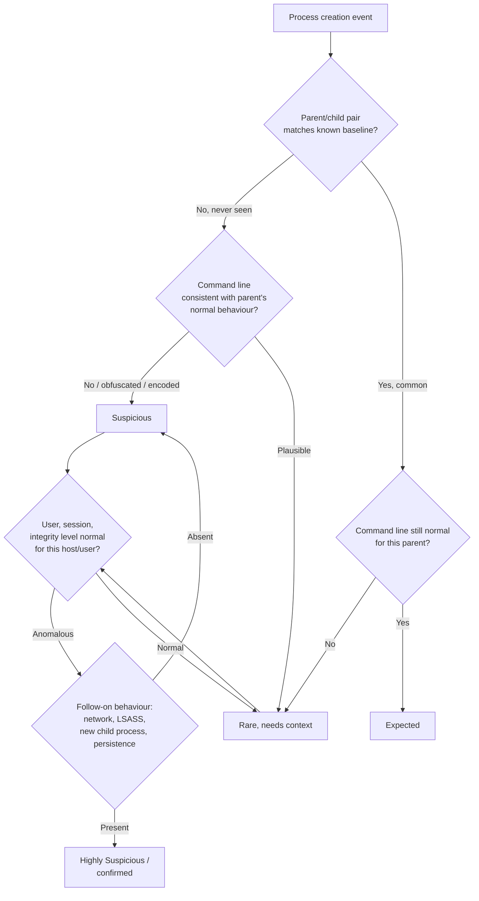
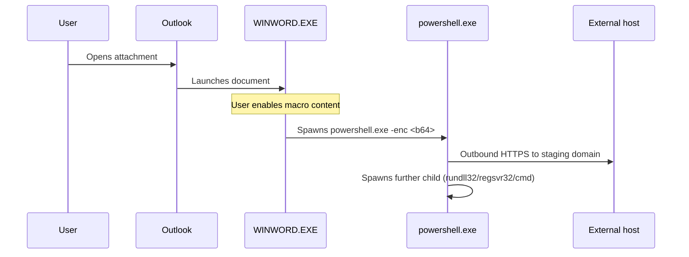

# Part VI — Process Tree Detection

## Why ancestry, not just events

[CONCEPT] A single process-creation event — one line saying "powershell.exe ran" — tells you almost nothing. Every enterprise endpoint runs PowerShell hundreds of times a day for legitimate reasons: Group Policy, Exchange management, backup agents, CI runners, help-desk scripts. What tells you something is the *chain* the process sits in: who spawned it, what spawned that, what account context it ran under, what it was signed with, and what it did next. Process tree detection is the discipline of reasoning about that chain as a unit instead of scoring processes one at a time.

The core insight practitioners eventually internalize: attackers don't get to choose the parent process for free. Malware execution has to originate somewhere — an Office document, a browser download, a scheduled task, a service, an exploited server process — and that origin leaves a structural fingerprint in the process tree that is much harder to disguise than a file hash or a domain name. Hashes change per build. C2 domains rotate. The fact that `WINWORD.EXE` is the parent of `powershell.exe` is architecturally awkward for an attacker to avoid if the initial access vector is a malicious document.

This is also why process tree detection ages well. A hash-based rule is dead the moment the payload is recompiled. A well-built ancestry-and-behavior analytic keeps catching new payloads that reuse the same tradecraft, because the tradecraft — "office app launches a script interpreter which launches a network client" — doesn't change even when every binary in the chain does.

## The fields that make up an ancestry judgment

No single field is sufficient. The judgment call is always made from a combination. Here is the field set worth having in the telemetry pipeline and understanding cold:

| Field | What it tells you | Reliability |
|---|---|---|
| `Image` / `NewProcessName` | What actually ran | High — but path/name can be spoofed via masquerading (renamed binary, unusual directory) |
| `CommandLine` | Arguments, flags, encoded payloads, target scripts | High signal, but attacker-controlled and can be obfuscated, split, or omitted (`-nop -w hidden -enc ...`) |
| `ParentImage` / `ParentProcessName` | Who launched it | High under normal conditions; can be falsified by parent PID spoofing (MITRE T1134.004) or by process hollowing/injection that reuses a legitimate parent |
| `ParentCommandLine` | What the parent was doing when it spawned the child | Very high value, frequently missing depending on EDR/Sysmon config |
| Grandparent chain | Confirms the origin (e.g. `outlook.exe → WINWORD.EXE → powershell.exe`) | High value, often the piece that turns "suspicious" into "confirmed," but many pipelines truncate depth to 2–3 hops |
| `User` / logon session | Whose context, interactive vs service vs system | High — but service accounts and shared admin accounts weaken this |
| Integrity level / token type | Elevated vs standard vs SYSTEM | Medium-high; attacker can request elevation via UAC bypass, but the level itself is accurately reported |
| Code signature / signer | Whether the binary is Microsoft-signed, third-party signed, or unsigned | Medium — legitimate unsigned tools exist (many admin scripts, some LOLBins used oddly); signature theft and living-off-the-land abuse of signed binaries both undercut this |
| Hash (SHA256/IMPHASH) | Exact binary identity | High for known-bad matching, useless against novel payloads, easily changed by attacker |
| Path | Where the binary lives on disk | Medium — `C:\Windows\System32\svchost.exe` vs `C:\Users\Public\svchost.exe` is a strong tell, but only if you check it |
| Session ID / logon type | Interactive console vs RDP vs service logon vs network logon | Useful for separating "user at keyboard" from "remote/automated" activity |

**Hunter's Note:** if your pipeline only keeps `ParentImage` as a string and drops `ParentCommandLine`, you have thrown away the single highest-value field in process tree telemetry short of the full ancestry chain itself. Fight for that field in your Sysmon config and EDR schema before you fight for anything else.

## Reasoning across a chain, not a pair

[DETECTION ENGINEER] The naive version of process tree detection is a lookup table: "if parent = X and child = Y, alert." That table is either too broad (constant false positives) or too narrow (trivially evaded by inserting one extra hop). The mature version treats the chain as a small state machine and asks a sequence of questions:

1. **Is this parent/child pairing structurally expected for this environment?** (baseline-dependent — "expected" for a developer workstation is not "expected" for a domain controller)
2. **Is the command line consistent with how this parent normally invokes this child?** (Word invoking `cmd.exe /c calc.exe` via a macro looks nothing like Word's own installer repair routines)
3. **What is the user/session context?** Interactive console session, RDP session, SYSTEM/service context, or a scheduled task's `S-1-5-18` token all carry different priors.
4. **What does the child do immediately afterward?** Network connection, credential access, LSASS touch, further child spawn — this is where "suspicious" becomes "confirmed."
5. **How rare is this specific combination across the fleet, and for this specific host/user, over time?** Frequency and novelty are detection signal in their own right, independent of any single field being "bad."



## A spectrum, not a binary

[MANAGEMENT] The single most damaging habit in immature detection programs is treating "parent X spawned child Y" as a boolean malicious/benign fact. It is not. The same pairing can be routine on one host and a compromise on another, routine for one user and anomalous for another, routine at 10am on a patch-Tuesday and anomalous at 3am from a host that's normally idle overnight. Build your triage vocabulary around a spectrum instead:

- **Expected** — matches known, frequent, low-risk usage for this environment; requires no action beyond baseline logging.
- **Rare** — structurally unusual but explainable by a known-but-infrequent legitimate workflow (an admin's one-off script, a software installer's helper process, a new deployment tool). Worth a light-touch look, not an incident.
- **Suspicious** — the pairing plus at least one additional weak signal (odd command line, unusual user, off-hours, unsigned binary in a signed-only lineage) that together raise real doubt, but with a plausible benign explanation still on the table.
- **Highly Suspicious** — the pairing plus strong corroborating signal (encoded/obfuscated command line, network beacon immediately following, credential-access behavior, known LOLBin abuse pattern, integrity-level or token anomaly) that leaves little room for an innocent explanation, and should drive analyst response now.

Every worked example below is classified against this spectrum — and every one of them explicitly depends on context that a bare parent/child rule cannot see.

## Worked example 1: WINWORD.EXE spawning powershell.exe

[CONCEPT] This is the textbook malicious-macro chain: a phishing attachment with a VBA macro runs `Shell()` or `CreateObject("WScript.Shell").Run` to launch PowerShell, usually with a downloader one-liner.

- **Expected:** essentially never, on a properly hardened endpoint. Word does not need to spawn PowerShell for any normal editing workflow. Some enterprises have legitimate document-automation tooling that does this deliberately (mail-merge add-ins, DLP scanners) — if so, that's a documented, narrow exception, not a default assumption.
- **Rare-but-explainable:** an IT-approved macro-based deployment tool, or a security product's own instrumentation shimming through Word. These should be enumerated and allow-listed by exact command line, not by parent/child pair alone.
- **Suspicious:** WINWORD.EXE → powershell.exe with a short, unencoded command line, from a user who has never triggered this before, shortly after opening a file received via email/downloaded from the web (Zone.Identifier / Mark-of-the-Web present).
- **Highly Suspicious:** the classic `powershell.exe -nop -w hidden -enc <base64>` or `-EncodedCommand`, or a command line invoking `IEX (New-Object Net.WebClient).DownloadString(...)`, immediately followed by an outbound connection from `powershell.exe` itself.



**Illustrative Sigma:**

```yaml
title: Office Application Spawning PowerShell with Encoded Command
status: experimental
logsource:
  category: process_creation
  product: windows
detection:
  selection_parent:
    ParentImage|endswith:
      - '\WINWORD.EXE'
      - '\EXCEL.EXE'
      - '\POWERPNT.EXE'
      - '\OUTLOOK.EXE'
  selection_child:
    Image|endswith: '\powershell.exe'
  selection_cmdline:
    CommandLine|contains:
      - '-enc'
      - '-EncodedCommand'
      - 'hidden'
      - 'IEX'
      - 'DownloadString'
  condition: selection_parent and selection_child and selection_cmdline
falsepositives:
  - Approved macro-based deployment or DLP tooling (allow-list by exact command line hash, not by parent alone)
level: high
```

MITRE mapping: T1566.001 (Phishing: Spearphishing Attachment), T1204.002 (User Execution: Malicious File), T1059.001 (Command and Scripting Interpreter: PowerShell).

## Worked example 2: Explorer spawning cmd.exe

- **Expected:** extremely common. Users double-click `.bat` files, right-click "Run as administrator," or open a command prompt via Start menu, all of which show `explorer.exe` as parent. This is baseline noise on almost every fleet.
- **Rare:** cmd.exe launched with a command line pointing at a script in an unusual location (`%TEMP%`, `%APPDATA%`, a recently-downloaded-and-extracted zip folder) — still explainable, but worth a glance.
- **Suspicious:** cmd.exe launched from Explorer with a command line invoking `mshta`, `certutil -urlcache`, `bitsadmin`, or `regsvr32 /s /u /i:http...` — living-off-the-land download/execute patterns riding on an entirely normal-looking parent.
- **Highly Suspicious:** the above plus the originating file having Mark-of-the-Web, arriving minutes after a browser download, and cmd.exe's child process reaching out over the network.

The reason this pair deserves its own worked example is precisely because it demonstrates why parent/child alone is worthless as a rule: `explorer.exe → cmd.exe` fires thousands of times a day in most environments. The entire analytic value is in the command line and follow-on behavior, not the pairing.

## Worked example 3: services.exe spawning an unexpected binary

- **Expected:** `services.exe` is the Service Control Manager; it legitimately spawns the executables registered as Windows services — `svchost.exe`, vendor agent binaries, backup/AV services — at boot or on service start/restart.
- **Rare:** a legitimate but newly-installed service binary, or a service restarting outside its normal schedule (patch, crash-recovery).
- **Suspicious:** `services.exe` spawning a binary from a non-standard path (`C:\Users\Public\`, `C:\ProgramData\<random>\`, `C:\Windows\Temp\`), or spawning `cmd.exe`/`powershell.exe` directly — services should run their own executables, not a shell, except for a small number of known legitimate wrapper services you should already have enumerated.
- **Highly Suspicious:** a newly created service (correlate with Windows Security 4697 / Sysmon Event ID 13 registry-key-based service creation, or Event ID 7045 service install) whose `ImagePath` is an unsigned or newly-seen binary, immediately spawned by `services.exe`, especially if the service name is a single-letter or randomly generated string — a classic pattern for `PsExec`-style remote service execution (T1569.002) and for many ransomware pre-encryption staging techniques.

**SOC Management View:** service-creation abuse is one of the highest-value, lowest-noise detection surfaces in Windows environments precisely because legitimate new service installs are relatively rare compared to process creation volume overall. If you have budget for exactly one ancestry-based detection this quarter and don't already have one here, this is where it goes — the signal-to-noise ratio outperforms almost anything else in this chapter.

## Worked example 4: w3wp.exe spawning cmd.exe

- **Expected:** never, in the overwhelming majority of production IIS deployments. `w3wp.exe` (the IIS worker process) serving a normal ASP.NET or static site has no legitimate reason to spawn a shell.
- **Rare:** some legacy or poorly designed web applications intentionally shell out (calling `cmd.exe` or PowerShell to run a report generator, an image-processing tool, a legacy CGI-style script). If this exists in your environment it should be a documented, named exception tied to a specific application pool identity and command line pattern — not a blanket allow.
- **Suspicious:** `w3wp.exe` → `cmd.exe` or `powershell.exe` with any command line at all, from an application pool identity that has never done this before.
- **Highly Suspicious:** the classic post-exploitation-of-a-web-app chain — a webshell drop followed by `w3wp.exe → cmd.exe → whoami/net/systeminfo/certutil` reconnaissance and download commands. This maps to a specific and very well-known pattern: exploitation of a web application (T1190, Exploit Public-Facing Application) followed by command execution via the compromised process.

**Illustrative KQL (Microsoft Sentinel / Defender):**

```kql
DeviceProcessEvents
| where InitiatingProcessFileName =~ "w3wp.exe"
| where FileName in~ ("cmd.exe", "powershell.exe", "powershell_ise.exe", "cscript.exe", "wscript.exe", "certutil.exe")
| project Timestamp, DeviceName, AccountName, InitiatingProcessFileName,
          InitiatingProcessCommandLine, FileName, ProcessCommandLine
| order by Timestamp desc
```

This is deliberately broad — in a hardened environment it should return near-zero rows most days. If it returns dozens of rows daily, that is itself a finding: either a legitimate app is doing something risky by design (fix the app or scope the exception tightly), or something is already wrong.

## Worked example 5: browser spawning a script interpreter

- **Expected:** essentially never for the browser's main renderer/content processes to directly spawn `wscript.exe`, `cscript.exe`, `mshta.exe`, or `powershell.exe`. Browsers sandbox content processes specifically to prevent this.
- **Rare:** browser extension helper processes or a legitimate downloaded installer's `.exe`/`.msi` chain briefly touching a script host during setup — this is a chain worth distinguishing from the browser process itself invoking a script host directly.
- **Suspicious:** `chrome.exe`/`msedge.exe`/`firefox.exe` as the immediate parent of `wscript.exe`, `mshta.exe`, or `powershell.exe`, especially where the child's command line references a file just written to the Downloads folder.
- **Highly Suspicious:** the sequence download-of-`.hta`/`.js`/`.vbs` file → browser (or explorer, after user double-click) spawns the matching script host → script host spawns a further LOLBin (`rundll32`, `regsvr32`, `certutil`) → outbound connection. This is the standard drive-by / fake-update / ClickFix-style social-engineering chain seen heavily in 2023–2025 campaigns (fake CAPTCHA pages instructing users to paste a `mshta`/PowerShell command into the Run dialog — note in that variant the parent is actually `explorer.exe`, not the browser, because the user manually pastes and runs the command, which is itself a useful discriminator between "browser auto-executed something" and "user was socially engineered into running it themselves").

MITRE mapping across this example: T1204.001/T1204.004 (User Execution), T1218 (System Binary Proxy Execution — mshta, rundll32, regsvr32, certutil), T1059.005/T1059.007 (VBScript/JScript).

## Detection Autopsy: the naive parent/child rule

**Original logic:** "Alert when `ParentImage` = `explorer.exe` and `Image` = `powershell.exe` and `CommandLine` contains `-enc`."

**Why it looked reasonable:** encoded PowerShell commands are genuinely a strong indicator, and this rule catches a real and common attack pattern (a user double-clicking a malicious shortcut/HTA that launches encoded PowerShell).

**What breaks in production:**
- False positives: several legitimate deployment tools and some MDM/RMM agents base64-encode arguments for reasons that have nothing to do with evasion (avoiding shell-quoting issues with special characters). Any environment running such tooling will fire this daily.
- False negatives: trivially bypassed by splitting the command across an intermediate `cmd.exe /c` hop, by using `-EncodedCommand` written differently (`-e`, `-en`, case variation, whitespace insertion), by reading the encoded payload from a file instead of the command line, or by using `-Command` with an in-line downloader that isn't base64 at all.
- Missing context: no check on user, host role, time of day, frequency, or what happened next. A workstation that does this once a year looks identical in the rule to a server that has been doing it every five minutes for a week (a beaconing loader).
- The rule also has zero signal from grandparent — it can't distinguish "explorer.exe because the user double-clicked a `.lnk` that was itself dropped by a phishing email two minutes ago" from "explorer.exe because an admin opened a PowerShell console from the taskbar and pasted an encoded one-liner from a runbook."

**Revised analytic:** correlate the base rule with (a) file-creation/Mark-of-the-Web on the originating artifact within a preceding time window, (b) rarity of this exact command-line pattern for this host over a 30-day baseline, (c) any outbound network connection from the resulting `powershell.exe` process within 60 seconds, and (d) whether the account is a standard user vs. an admin/service account with documented scripting duties. Score these as weighted signals rather than a single boolean.

**How it was tested (illustrative — not a live capture):** replayed against a Sysmon-instrumented Windows 10 lab VM using an Office macro test harness and an Atomic Red Team T1059.001 test case, alongside a week of legitimate RMM-tool traffic from the same lab image, to confirm the encoded-command-only version fired on the RMM traffic and the correlated version did not.

**Result:** the correlated version cut the RMM-driven false positives essentially to zero in the lab replay while still firing on the macro test case, at the cost of added query complexity and a dependency on having Mark-of-the-Web / Zone.Identifier telemetry and outbound network correlation available — which not every pipeline has (see Engineering Reality below).

## Threat hunting beyond the alert

[THREAT HUNTER] Alerting rules catch what you've already anticipated. Hunting through process trees means looking for the shapes attackers try to hide inside, even when no single field crosses an alert threshold:

- **Depth anomalies:** processes with an unusually long or unusually short ancestry chain compared to their peer group (a service binary with a five-hop ancestry chain when its siblings all have two).
- **Signer discontinuity:** a chain where every hop up to some point is Microsoft-signed and then the chain suddenly continues with an unsigned or third-party-signed binary — a strong tell for injection, sideloading, or masquerading.
- **Parent PID / process start-time mismatch:** the reported `ParentProcessId` exists, but the process that actually held that PID at that timestamp had already exited — classic evidence of parent PID spoofing (T1134.004). This requires cross-referencing process start/stop timestamps, not just the PID field at face value.
- **Rare exact command lines, common parent:** hunt by grouping on `(ParentImage, Image)` pairs and then ranking the *distinct command lines* within each pair by rarity across the fleet — this surfaces the one weird invocation of an otherwise totally normal pairing.
- **Session/logon type outliers:** a chain that should be interactive (user opening a document) but is running under a service or network logon session, or vice versa.

**Illustrative hunting query (KQL, frequency/rarity framing):**

```kql
DeviceProcessEvents
| where Timestamp > ago(30d)
| where InitiatingProcessFileName in~ ("winword.exe","excel.exe","powerpnt.exe")
| where FileName =~ "powershell.exe"
| summarize Count = count(), Hosts = dcount(DeviceName), Users = dcount(AccountName)
    by ProcessCommandLine
| sort by Count asc
```

Sorting ascending on count surfaces the rarest exact command lines first — often the highest-value place to start manual review, since common ones are more likely to be a known deployment pattern and rare ones are more likely to be a one-off, either benign-but-unusual or malicious.

## Engineering Reality

Process ancestry detection is only as good as the depth and completeness of what your collection layer actually preserves. Three concrete failure modes recur across real deployments: (1) many EDR agents and default Sysmon configs cap or omit `ParentCommandLine`, which guts a huge fraction of the analysis above; (2) short-lived processes that spawn and exit within milliseconds are sometimes missed entirely under agent load or during high-volume bursts (exactly when an attacker is most likely to be chaining several LOLBins quickly); (3) grandparent-and-beyond ancestry usually isn't stored as a native field at all — it has to be reconstructed by joining process-creation events on `ProcessGuid`/`ParentProcessGuid` chains at query time, and that join silently breaks the moment any single hop in the chain fell outside your retention window or was dropped by filtering upstream. Test your ancestry-reconstruction query against a deliberately long, deliberately slow chain (spawn a process, wait past your shortest relevant retention/rollup boundary, spawn its child) before trusting it in an incident.

> **[SCREENSHOT PLACEHOLDER — CONTROLLED LAB]** — Sysmon process-creation log (Event ID 1) from a Windows 10/11 lab VM, captured via a local Sysmon install with a config that preserves `ParentCommandLine`, showing a WINWORD.EXE → powershell.exe → child chain generated by a benign Atomic Red Team T1059.001 test macro. Would illustrate: `ParentImage`, `ParentCommandLine`, `Image`, `CommandLine`, `IntegrityLevel`, `Hashes`, and `ParentProcessGuid`/`ProcessGuid` linkage fields side by side, to show exactly which fields survive into the raw event versus which require a downstream join.

## SOC Management View

Process tree detection is disproportionately valuable per analyst-hour compared to most other detection categories, because a well-tuned ancestry rule generalizes across many malware families and campaigns that share the same execution tradecraft — but it is also disproportionately expensive to build correctly, because it requires deep, current knowledge of what's "normal" for a specific environment's software estate (RMM tools, backup agents, legacy line-of-business apps that shell out, homegrown deployment scripts). Budget for an initial baselining pass — typically two to four weeks of parent/child/command-line frequency analysis across the fleet before writing high-severity ancestry rules — or expect the first month of any new ancestry-based ruleset to generate an outsized volume of "this is just our software" tickets. This baselining cost is a one-time investment per environment, and it's also the first thing that goes stale after any major software rollout (new EDR agent, new RMM tool, new backup product) — put ancestry-rule review on the same change-management trigger as those rollouts, not just on a calendar cadence.

## Tuning notes and evasion awareness

Attackers actively target the weak points in ancestry-based detection: parent PID spoofing (T1134.004) to make a malicious process appear to descend from something innocuous; process injection/hollowing (T1055) to run code inside a legitimate process's address space so no new suspicious child process ever appears at all; and simple insertion of extra innocuous-looking hops (`cmd.exe /c` wrapping, or chaining through a signed utility) to break a rule written against an exact two-hop pairing. None of this makes ancestry analysis useless — it means ancestry should always be one layer among several (also correlate with network telemetry, file writes, registry persistence, and credential-access indicators), and it means "no visible malicious parent" is not evidence of absence when injection is on the table.

When tuning, resist the temptation to fix false positives by narrowing the parent/child pair further — that's how rules become brittle and easily walked around. Prefer narrowing on command-line pattern, path, signer, or behavior-after-execution instead, and keep the parent/child structural condition broad enough to survive an attacker inserting or removing a hop.
