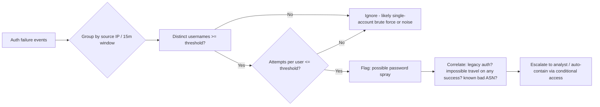
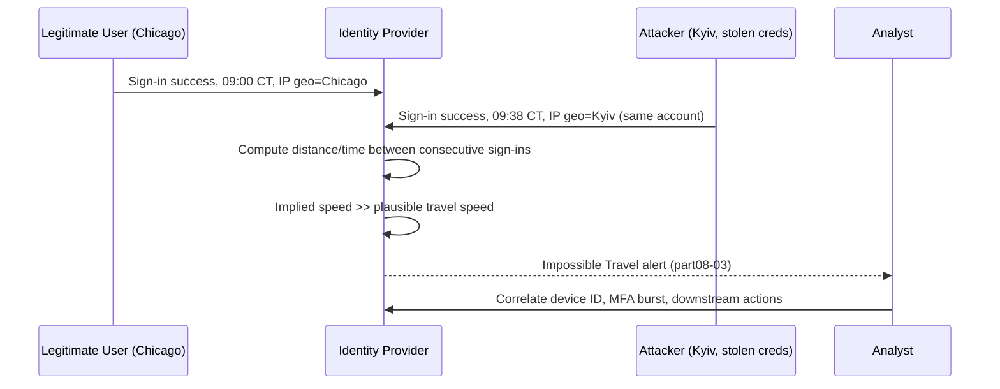
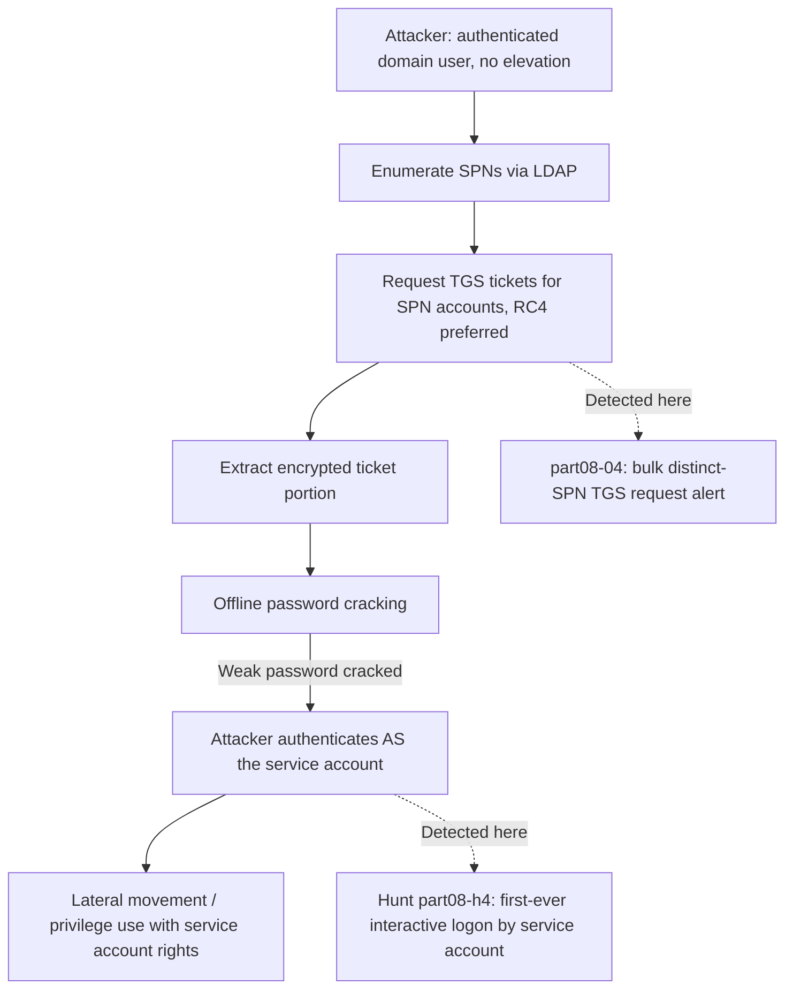
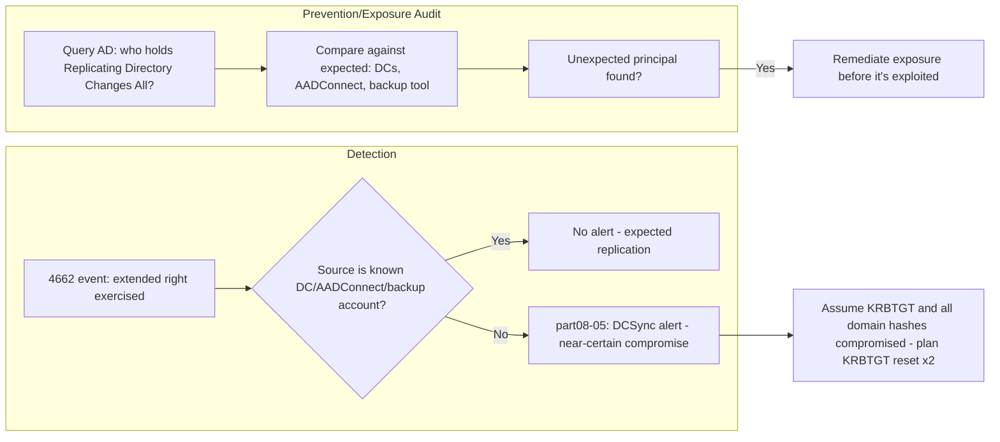

# Part VIII — Identity Detection Engineering

Identity is the control plane attackers actually want. Once you have valid credentials — a
password, a Kerberos ticket, an OAuth token, a session cookie — you look like the user. Endpoint
detection stops mattering because you never ran malware; network detection stops mattering because
your traffic is TLS to services the organization already trusts. This is why identity telemetry
(authentication logs, directory service logs, IdP sign-in logs, Kerberos event data) has become as
central to a detection program as EDR process trees.

The problem is that identity telemetry is noisy, distributed across systems that don't share a
clock or a schema, and full of legitimate behaviour that looks exactly like the attack you're
trying to catch. A help-desk password reset looks like account takeover. A traveling executive
looks like impossible travel. A misconfigured service account looks like Kerberoasting. Good
identity detection is less about writing clever queries and more about building the baseline and
correlation logic that lets you tell the difference.

This part works through the identity attack surface end to end: credential attacks against
authentication (brute force, spraying, MFA fatigue), session and geography anomalies (impossible
travel, new device/country), delegated-access abuse (OAuth), and the Active Directory-specific
techniques that let an attacker escalate from "a user account" to "domain dominance"
(Kerberoasting, AS-REP roasting, DCSync, pass-the-hash, pass-the-ticket, golden tickets), plus
directory reconnaissance and privilege-change abuse.

Five topics get the full treatment — threat hypothesis through hunt variant — because they are
the ones teams get wrong most often in production: Password Spraying, MFA Fatigue, Impossible
Travel, Kerberoasting, and DCSync. The rest get a solid, usable treatment without the full nine-part
structure.

---

## 1. Password Spraying (full depth)

### Threat hypothesis

An attacker has a list of usernames (harvested from LinkedIn, breach dumps, email format
guessing, or LDAP enumeration) and tries one or two common/seasonal passwords against every
account, rather than many passwords against one account. This evades classic "N failed logins for
one user" lockout thresholds and per-account brute-force detections. The goal is usually initial
access or lateral movement into an account with weak governance (shared password policy, no MFA,
stale account).

### Required telemetry

| Source | Why |
|---|---|
| Windows Security Event Log (Domain Controllers), Event ID 4625 (failed logon) | Core signal for on-prem AD |
| Azure AD / Entra ID Sign-in logs (`AADSignInEventsBeta` / Sign-in log) | Cloud identity, includes result codes and risk signals |
| Okta / Ping / other IdP system log | If AD isn't the primary IdP |
| VPN / remote access auth logs | Spraying often lands here first, not directly at AD |
| RADIUS logs | Wireless/VPN-adjacent spray attempts |

### Core fields

- Source IP (and ASN/geolocation — attacker infra is frequently datacenter/VPN/residential-proxy)
- Target username (the discriminator vs. brute force — high *cardinality* of usernames, low
  *cardinality* of passwords/attempts-per-user)
- Result code (invalid password vs. account disabled vs. account locked vs. unknown user —
  distinguishing "bad password" from "no such user" tells you whether the attacker's username
  list is accurate)
- Logon type (3 = network, 10 = RDP, etc. on Windows; matters for scoping)
- Client/application (legacy auth — POP/IMAP/ActiveSync — vs. modern auth; legacy protocols don't
  support MFA and are a favorite spray target)
- Timestamp, with enough precision to bucket into short windows

### Baseline

Before setting a threshold you need to know, per environment: normal failed-login rate per hour
across the tenant, the fraction of failures attributable to shared kiosks/service accounts with
stale creds cached in a scheduled task, and the "unique users failing per source IP per hour"
distribution under normal conditions (helpdesk workstations doing password resets can spike this).
Build the baseline over at least 2–4 weeks including a payroll/badge-renewal cycle, which reliably
produces a mass password-reset noise spike.

### Detection logic

The signature of spraying is **breadth over depth**: many distinct usernames, few attempts each,
from one source (or a small rotating pool of sources) in a short window, with a low overall
success rate.

**Illustrative Sigma-style logic (conceptual, not vendor-verified):**

```yaml
title: Possible Password Spraying Against Domain Controllers
id: part08-01
status: experimental
logsource:
  product: windows
  service: security
detection:
  selection:
    EventID: 4625
    LogonType:
      - 3
      - 8
  timeframe: 15m
  condition: selection | count(distinct TargetUserName) by IpAddress > 15
             and count(TargetUserName) by IpAddress, TargetUserName <= 3
falsepositives:
  - NAT gateway or VPN concentrator shared by many legitimate users
  - Misconfigured application service account hammering with a stale password (this looks like
    brute force against ONE account, not spraying, but often triggers on the same rule if the
    threshold logic is sloppy)
level: medium
```

**Illustrative KQL against Entra ID sign-in logs:**

```kql
SigninLogs
| where TimeGenerated > ago(1h)
| where ResultType in ("50126") // invalid username or password
| summarize DistinctUsers = dcount(UserPrincipalName),
            Attempts = count(),
            Users = make_set(UserPrincipalName, 25)
          by IPAddress, bin(TimeGenerated, 15m)
| where DistinctUsers >= 10 and Attempts < (DistinctUsers * 2)
| order by DistinctUsers desc
```

The `Attempts < DistinctUsers * 2` clause is the part that separates spraying from a noisy
brute-force sweep against a handful of accounts — it enforces the "shallow" shape.

### Correlation

Spraying detections get dramatically more actionable when correlated with:
- **Impossible travel / new-country** on any of the low-and-slow successes that do land (see §3)
- **Legacy authentication protocol usage** (spray campaigns disproportionately target IMAP/SMTP
  basic auth because MFA doesn't apply)
- **Threat intel on source IP/ASN** (known spray infrastructure, Tor exit nodes, residential
  proxy networks like commercial "proxy as a service" providers)
- A **success following a run of failures from the same source** — that's a different named
  detection (§2, "Successful Login After Failures") but the two should fire into the same
  investigation queue with linked context.

### False positives

- Shared NAT egress (branch office, VPN concentrator) legitimately produces many distinct users
  failing from one IP during a mass password expiry event.
- Password-manager autofill bugs after a bulk password reset causing many users to submit stale
  cached passwords once each.
- Security scanning tools (your own vulnerability scanner or a red team engagement) doing
  credential validation sweeps.
- Federated authentication proxies where the "source IP" in your logs is actually the federation
  server, not the real client — this collapses cardinality onto one IP and can either mask real
  spraying or false-positive constantly. Fix at the parser/telemetry level, not the rule level.

### Tuning strategy

Start high (e.g., ≥20 distinct users, ≤2 attempts each, 15-minute window) to establish signal,
then lower thresholds gradually while tracking false-positive rate per week. Maintain an allowlist
of known NAT/VPN egress IPs with a *separate, higher* threshold rather than a blanket exclusion —
attackers do use compromised VPN infrastructure. Segment by logon type and by legacy vs. modern
auth; legacy auth deserves a much lower threshold since it has no MFA backstop.

### Test method

Run a controlled spray in a lab AD domain: script logons against 20 test accounts with 1–2 wrong
passwords each from a single source, confirm the rule fires within the expected window, then run a
"normal noise" simulation (mass expiry + helpdesk resets) to confirm it does *not* fire. Track
detection latency, not just fire/no-fire — spraying campaigns are often only visible for a short
window before the attacker moves to a different technique.

> **[SCREENSHOT PLACEHOLDER — CONTROLLED LAB]** — Windows Security Event Log (Event Viewer) on a
> lab Domain Controller filtered to Event ID 4625, showing a burst of failed logons across many
> distinct `TargetUserName` values from one `IpAddress` within a short window, illustrating the
> "breadth over depth" field pattern the detection logic keys on.

### Threat hunt variant

**Hunt part08-h1 — Low-and-slow spray hunt.** Rule-based detection catches loud spraying inside a
short window. Hunt for the version tuned to evade it: attackers spreading the same shallow attempt
pattern over hours or days, sometimes rotating source IPs from the same ASN or proxy pool. Pull 30
days of 4625/sign-in failures, group by *destination realm* (not source IP) and look for the same
small set of 1–2 candidate passwords appearing across an unusually wide swath of usernames over a
long window, cross-referenced against ASN diversity of the sources. A cluster of "different IPs,
same narrow password guess pattern, same target population" over days is a spray campaign that
rate-based rules will never catch on their own.



---

## 2. Successful Login After Failures

[CONCEPT] The single strongest, cheapest signal in identity detection: a run of failed
authentications followed immediately by success, for the same account. This is what brute force,
spraying (on the accounts that land), and credential-stuffing all look like at the *individual
account* level.

**Core fields:** account name, source IP for both failures and the success (same IP is a stronger
signal than a different IP — a different IP might mean the legitimate user finally typed their
password correctly on a different device, or it might mean an attacker pivoted after failing
elsewhere), time delta between last failure and success, geographic/ASN consistency across the
sequence.

**Detection logic (illustrative):** within a rolling window (commonly 10–30 minutes), ≥5 failures
followed by 1 success for the same `TargetUserName`/`UserPrincipalName`. Weight confidence up if
the success comes from a *different* IP/geography than the failures (credential validated
elsewhere, session opened here) — that pattern is harder to explain with "user fat-fingered their
password five times."

**False positives:** users who genuinely forget passwords and eventually get it right; account
lockout/unlock cycles where the "success" is actually a helpdesk-assisted reset; MFA-enabled
accounts where "failure" was actually a denied MFA push and "success" was the legitimate user
approving a delayed prompt (make sure failure and success codes are semantically comparable, not
mixing password failures with MFA denials in a way that inflates the count artificially).

**Tuning:** exclude known service accounts with intentionally aggressive retry logic. Require the
failures to be *password* failures specifically, not lockout-state failures (an account already
locked can't "fail" meaningfully — that's a different signal).

**Hunt angle:** look for the inverse — successful logins with *zero* prior failures from a brand
new source/device/geography for an account that has an established, narrow historical pattern.
That's covered more fully under Impossible Travel and New Device below, but it's worth noting the
"success after failures" and "success with no failures but wrong context" are two ends of the same
credential-compromise spectrum.

---

## 3. MFA Fatigue (Push Bombing) (full depth)

### Threat hypothesis

The attacker already has valid credentials (phished, stuffed, purchased) but the account is
MFA-protected. Rather than trying to defeat MFA cryptographically, they trigger repeated push
notifications, hoping the user approves one out of habit, annoyance, or confusion — or they combine
it with a phone call posing as IT ("approve the prompt so I can fix your account"). This is a
social-engineering attack that happens to leave a very clean telemetry signature. T1621 (Multi-Factor
Authentication Request Generation) is the closest ATT&CK mapping.

### Required telemetry

- IdP MFA event logs (Entra ID `AADNonInteractiveUserSignInLogs`/`SigninLogs` with MFA detail,
  Okta `system_log` events for `user.mfa.factor.attempt` / `user.authentication.auth_via_mfa`,
  Duo authentication log)
- Push notification service provider logs specifically (Duo Push, Microsoft Authenticator,
  Okta Verify) — these carry the accept/deny/timeout result, which generic sign-in logs sometimes
  collapse into a single "failure" bucket
- Correlated primary-factor auth logs (to confirm password/first factor validity, which tells you
  whether the attacker has real credentials or is just guessing account existence)

### Core fields

- Account/UPN
- MFA method and result per attempt (`push sent`, `push denied`, `push timed out`, `push approved`)
- Number of prompts within a window
- Time between prompts (rapid repeats vs. a legitimate user's phone genuinely re-prompting after
  a missed notification)
- Requesting IP/device/app context for each prompt (attacker-originated prompts often come from
  one consistent IP/ASN across all attempts, unlike a user's own multiple devices)
- Final outcome — approved, denied, or abandoned

### Baseline

Legitimate MFA retry patterns: a user with a bad signal genuinely gets 2–3 prompts in a few
minutes. Establish the normal distribution of prompts-per-successful-login and prompts-per-user-per-day
before setting a threshold; corporate populations vary a lot depending on whether conditional
access re-prompts frequently (aggressive session-lifetime policies inflate baseline prompt counts).

### Detection logic

Signature: high volume of MFA prompts to a single account in a short window, especially where
prompts originate from one requesting IP/app that differs from the user's normal device pattern,
culminating in either an approval (worst case) or eventual timeout/abandonment (still worth
alerting — the attacker may retry later or pivot to phone-based social engineering).

**Illustrative KQL against Entra sign-in logs (MFA detail):**

```kql
SigninLogs
| where TimeGenerated > ago(30m)
| mv-expand AuthDetail = parse_json(AuthenticationDetails)
| where tostring(AuthDetail.authenticationMethod) has "Mobile app notification"
| summarize
    PromptCount = count(),
    DeniedCount = countif(tostring(AuthDetail.authenticationStepResultDetail) has "declined"),
    ApprovedCount = countif(tostring(AuthDetail.authenticationStepResultDetail) has "success"),
    DistinctRequestingIPs = dcount(IPAddress),
    FirstSeen = min(TimeGenerated),
    LastSeen = max(TimeGenerated)
  by UserPrincipalName
| where PromptCount >= 5 and (LastSeen - FirstSeen) < 20m
```

Detection ID **part08-02 — MFA Push Bombing**: flag when ≥5 prompts hit one account inside a
20-minute window, with severity escalated to critical if any prompt in that burst resulted in
approval.

### Correlation

- Was the first factor (password) successful just before the burst? Confirms the attacker holds
  valid credentials, not just guessing.
- Any help-desk ticket or password-reset activity for this user in the same window (attackers
  sometimes call the help desk mid-bombing to socially engineer a reset or MFA re-enrollment —
  correlate against ticketing system logs if available).
- Post-approval activity: if a prompt is approved, immediately pivot to checking for new OAuth app
  consents, new MFA method registration, mailbox rule creation, or unusual resource access in the
  minutes following — approval is the start of the incident, not the end of it.

### False positives

- Poor cellular/WiFi signal causing a user's phone to resend/miss pushes, generating a genuine
  burst of 3–5 prompts from the *user's own* consistent device/IP.
- Shared or kiosk devices where multiple legitimate users trigger MFA back-to-back and get
  aggregated if your grouping key is wrong (group by account, not device).
- Buggy client applications that silently retry authentication in a loop (a known failure mode
  with some legacy mobile mail clients) — this can look identical to an attack and needs an
  application/client-ID allowlist exception once diagnosed, not a blanket exception.

### Tuning strategy

Segment thresholds by requesting-app and by whether requesting IP is stable across the burst.
A burst from one consistent IP/device is far more likely to be a real user's own retries; a burst
where each prompt comes from a different IP/ASN is a strong attacker signal (they're re-issuing
the auth request themselves, not the user's device resending). Add a "number-matching" / prompt
detail check if your MFA provider supports it (modern Duo/Microsoft Authenticator number-matching
reduces blind-approval risk and changes what "fatigue" even looks like in the logs — plan to
revisit this detection when number-matching is enforced org-wide, since raw prompt-count bombing
becomes less effective and attackers shift to combining a moderate prompt count with a phone call).

### Test method

In a lab tenant, script 6–8 rapid MFA push requests against a test account with number-matching
disabled, confirm firing and confirm the analyst-facing alert surfaces requesting IP/device
diversity so triage doesn't require pulling raw logs. Separately, simulate the false-positive case
(poor signal, same device, same IP, 3 retries) and confirm it stays under threshold.

> **[SCREENSHOT PLACEHOLDER — CONTROLLED LAB]** — Entra ID sign-in log detail pane (or Duo
> Authentication Log) in a lab tenant showing a rapid sequence of MFA push events for one account —
> `authenticationMethod`, `authenticationStepResultDetail` (declined/success), and `IPAddress` per
> attempt — illustrating the fields the KQL query above keys on.

### Threat hunt variant

**Hunt part08-h2 — Quiet fatigue / abandoned-burst hunt.** Attackers who get denied or ignored
sometimes give up on that account rather than escalate — meaning no compromise occurred and no
downstream alert fires, but the account is now known-targeted and should get a lowered threshold
and manual review. Hunt for accounts with elevated prompt bursts (3–4, below your alert threshold)
occurring repeatedly across multiple days — a pattern rate-based single-window detection misses
entirely because each individual burst is sub-threshold. Aggregate prompt-burst count *per account
per week*, not just per session, to surface this.

**Hunter's Note:** MFA fatigue detections that only look at approve/deny miss the most important
outcome — abandonment. An attacker who tries eight pushes and gives up when none get approved
just told you exactly which account they hold valid credentials for. Treat that account as
compromised-credential-confirmed even with zero successful auth, and force a password reset.

---

## 4. Impossible Travel (full depth)

### Threat hypothesis

A single account authenticates from two geographically distant locations within a time window too
short for physical travel between them (e.g., Chicago then Kyiv 40 minutes later). This implies
either credential sharing/theft (attacker using stolen creds from elsewhere while the legitimate
user is also active) or, less maliciously, VPN/proxy usage that makes geolocation misleading.

### Required telemetry

- IdP sign-in logs with resolved geolocation (city/region/country) per sign-in, ideally with
  IP-to-geo resolution done consistently (mixing providers mid-pipeline breaks distance math)
- IP reputation/ASN classification (residential, datacenter/hosting, known VPN provider, known
  anonymization service) — critical context, not optional
- Device/session metadata (device ID, browser/user-agent, whether the session is a continuation of
  an existing token vs. a fresh interactive login)

### Core fields

- Account, timestamp, source IP, resolved lat/long or city, ASN/IP category, device ID,
  authentication type (interactive vs. token refresh — token refreshes from a stale session can
  create false impossible-travel signals that aren't really a new login)

### Baseline

Most accounts have a small, stable set of egress geographies (home ISP, office, maybe one or two
VPN exit regions if the org runs its own VPN). Frequent business travelers and globally
distributed teams need a *per-user* baseline, not a org-wide one — a rule tuned for a mostly-local
workforce will drown a travel-heavy sales team in false positives and get disabled entirely.

### Detection logic

Compute great-circle distance between consecutive sign-ins for the same account, divide by time
elapsed to get an implied minimum travel speed, and flag when that speed exceeds what's physically
plausible (commercial flight speed plus reasonable buffer, commonly a threshold like 500–1000 km/h
depending on how much false-positive tolerance you accept for the buffer zone that catches
"landed and immediately logged in").

**Illustrative KQL:**

```kql
let MaxPlausibleSpeedKmh = 900.0;
SigninLogs
| where ResultType == 0 // successful sign-ins only
| project TimeGenerated, UserPrincipalName, IPAddress,
          Lat = tolong(LocationDetails.geoCoordinates.latitude),
          Long = tolong(LocationDetails.geoCoordinates.longitude),
          Country = tostring(LocationDetails.countryOrRegion)
| sort by UserPrincipalName asc, TimeGenerated asc
| serialize
| extend PrevTime = prev(TimeGenerated), PrevLat = prev(Lat), PrevLong = prev(Long),
         PrevUser = prev(UserPrincipalName)
| where UserPrincipalName == PrevUser
| extend DistanceKm = geo_distance_2points(Long, Lat, PrevLong, PrevLat) / 1000.0
| extend HoursElapsed = datetime_diff('second', TimeGenerated, PrevTime) / 3600.0
| extend ImpliedSpeedKmh = DistanceKm / HoursElapsed
| where ImpliedSpeedKmh > MaxPlausibleSpeedKmh and DistanceKm > 300
```

Detection ID **part08-03 — Impossible Travel**.

### Correlation

- Was this account also involved in a recent MFA prompt burst or a password-spray success? If the
  "impossible" sign-in is from a location matching known spray/attack infrastructure, confidence
  jumps sharply.
- Device ID: is the second sign-in from a *never-seen-before* device as well? Two anomalies
  (impossible travel + new device) together are much stronger than either alone.
- Downstream action: mailbox rule changes, OAuth consent grants, or data access immediately
  following the anomalous sign-in.

### False positives

This is one of the highest false-positive-rate detections in identity security, for structural
reasons:
- **VPN/proxy exit points** that don't reflect true user location — a user in Texas connecting
  through a corporate VPN with an exit node in Amsterdam, then disconnecting and connecting
  directly, looks like impossible travel between Amsterdam and Texas.
- **Cloud service/API sign-ins on the user's behalf** (mobile mail sync, calendar polling) using
  cached tokens from different app instances, geolocated to different cloud regions.
- **IP geolocation database inaccuracy**, especially for mobile carrier IP ranges that get
  re-assigned across wide geographies.
- **Shared/last-mile CGNAT** where many users' traffic exits through the same provider IP pool that
  the geo database maps inconsistently.

### Tuning strategy

Exclude known corporate VPN and cloud-proxy egress ranges from distance calculations (compute
distance from the *pre-VPN* client IP if your architecture exposes it, rather than the VPN exit
IP). Maintain a per-user travel-calendar exception path if your organization has one (calendar
integration, travel booking system) so legitimate travel doesn't need daily manual triage. Require
a minimum distance floor (e.g., 300+ km) to avoid flagging metro-area IP reassignment noise.

**Detection Autopsy — the naive impossible-travel rule.**
*Original logic:* flag any two consecutive sign-ins for an account from different countries within
1 hour. *Why it looked reasonable:* simple, matches the intuitive definition, cheap to compute.
*What broke in production:* the org's VPN terminated in a different country than most users
physically sat in, so literally every remote employee tripped this rule on their first login of
the day (direct-to-VPN, country A, then app SSO token refresh reporting country B from a different
egress). *False positives:* effectively 100% of the remote workforce, daily — the rule was muted
within a week by the SOC because it was unusable. *False negatives:* meanwhile, a real
credential-theft case where the impossible pair was same-country-different-city (short-haul,
still implausible speed) was missed because the rule only checked country, not actual distance/time
math. *Missing context:* no ASN/VPN-awareness, no device correlation, no distance-vs-time
calculation — just a country-pair boolean. *Revised analytic:* the distance/speed calculation
above, with VPN egress excluded from distance math and a device-ID cross-check added as a
confidence multiplier rather than a hard requirement. *How it was tested:* replayed 30 days of
historical sign-in logs through both the old and new logic in a lab query environment; old logic
produced ~40 alerts/day per 1,000 users, new logic produced ~1–2/week with the same underlying
data, and the short-haul real case that had been missed was recovered under the new logic.
*Result:* rule went from muted-and-ignored to a trusted, actioned alert.

### Test method

Replay historical sign-in data (as above) rather than trying to physically generate impossible
travel in a lab — the value is in tuning against real geographic/VPN noise patterns specific to
the environment, which synthetic lab traffic won't reproduce.

### Threat hunt variant

**Hunt part08-h3 — Sub-threshold geographic drift.** Hunt for accounts showing a *slow* drift
across geographies over days/weeks that never crosses the "impossible" speed threshold in any
single hop but is nonetheless inconsistent with the user's established home region — this can
indicate a persistent session/token being used from attacker infrastructure that's simply patient,
or a legitimate but unreported travel pattern worth confirming with the user directly.



---

## 5. New Device / New Country

[CONCEPT] Simpler cousin of impossible travel: flag first-time-seen device fingerprints or
first-time-seen countries for an account, regardless of travel-speed math.

**Core fields:** device ID/fingerprint (OS, browser, TLS/JA3 fingerprint if available), country,
whether the sign-in was interactive, historical device/country set for the account (needs a
rolling profile store, typically 30–90 days).

**Detection logic:** maintain a per-user set of previously-seen device IDs and countries; alert on
first occurrence of a new value, weighted by risk of the target country (some orgs weight
sanctioned/high-risk-threat-actor countries higher) and by whether MFA was satisfied on that new
device/country combination.

**False positives:** new laptop provisioning, browser reinstalls/profile resets that regenerate
fingerprints, legitimate first-time travel, mobile carrier IP geo misattribution. This detection
is noisy as a standalone alert and works far better as a *risk signal that feeds a composite score*
(alongside impossible travel, MFA burst, spray hits) than as a standalone page-the-analyst rule.

**Tuning:** require MFA-satisfied new-device sign-ins to be treated very differently from
MFA-failed/skipped ones (if an org has any legacy-auth paths that skip MFA, new-device-without-MFA
is the far higher-value signal). Age out old devices/countries from the baseline deliberately —
permanent accumulation without decay eventually means "new" never really triggers because the
historical set has grown to include everything.

**Hunt angle:** look for accounts whose device/country baseline has grown unusually large or
diverse over a short period — that's consistent with credential sharing or a compromised account
being accessed from multiple attacker-controlled endpoints over time, distinct from one-off single
new-device events.

---

## 6. Suspicious OAuth (Illicit Consent Grant)

[CONCEPT] Rather than stealing a password, the attacker tricks a user (or abuses an already-open
session) into granting an OAuth application permissions to read mail, files, or directory data.
The "login" is the user's own, entirely legitimate; the abuse is in what the user consented to. ATT&CK
T1528 (Steal Application Access Token) and the broader consent-phishing pattern.

**Required telemetry:** IdP OAuth consent/grant audit logs (Entra ID `AuditLogs` for
`Consent to application` events, Google Workspace OAuth token audit, admin consent workflow logs),
application registry metadata (publisher verification status, app age, redirect URIs).

**Core fields:** granting user, application name/ID, publisher (verified vs. unverified), scopes
granted (read mail, read files, directory read, offline_access — offline_access is the one that
matters most, since it grants a long-lived refresh token independent of the user's session),
consent type (user consent vs. admin consent), app creation date relative to consent date (apps
created minutes before being used in a phishing campaign are a strong signal).

**Detection logic (illustrative):** alert on consent grants to applications that are unverified
publishers AND request high-risk scopes (mail read, offline_access, directory read) AND were
registered very recently, especially if granted by more than one user in a short window (mass
consent-phishing campaigns hit many users with the same malicious app link).

**False positives:** legitimate line-of-business apps built in-house or by small vendors that
never went through publisher verification; user-approved productivity integrations (calendar
schedulers, e-signature tools) that legitimately need broad mail/file scopes.

**Tuning:** maintain an allowlist of pre-approved apps and scopes; where possible, disable
user-consent entirely for high-risk scopes and route through admin consent workflow — this converts
a detection problem into a prevention control, which is the better outcome where organizational
policy allows it.

**Hunt angle:** periodically enumerate all app registrations with `offline_access` + mail/file
read scopes across the tenant, independent of any specific alert, and review against a known-good
list — this catches slow-burn consent grants that never triggered a volume-based alert.

---

## 7. Privilege Change / Admin Group Changes

[CONCEPT] Additions to privileged groups (Domain Admins, Enterprise Admins, Global Administrators,
any group holding elevated app/API roles) are one of the highest-value, lowest-volume signals
available — legitimate privilege changes are rare enough that near-100% of them can be reviewed by
a human. ATT&CK T1098 (Account Manipulation) / T1136 (Create Account) often precede or accompany
this.

**Required telemetry:** Windows Security Event 4728/4732/4756 (member added to global/local/universal
security group) and 4737/4735 (group modified), Entra ID `AuditLogs` for role assignment events,
AWS IAM/GCP IAM audit events for privileged role grants if hybrid/cloud identity is in scope.

**Core fields:** actor (who made the change), target account added, group/role name, timestamp,
whether the actor's own session shows other suspicious activity (new device, impossible travel)
in the same window.

**Detection logic:** alert on any addition to a defined set of Tier-0 groups, full stop — the
volume is low enough that thresholding isn't the challenge, correct scoping of "which groups
count" is. Escalate severity sharply if the addition happens outside change-management windows or
if the actor account itself was recently the subject of another identity alert.

**False positives:** legitimate but unticketed emergency access grants ("break glass" accounts),
which is a process gap more than a detection tuning problem — fix by requiring all Tier-0 changes
to reference a change ticket, and alert on any that don't.

**SOC Management View:** privileged group membership should be reconciled against an
authoritative source (PAM tool, change management system) on a fixed cadence (daily is reasonable
for Tier-0), not just detected reactively. The detection is a safety net; the reconciliation job
is the actual control. Track mean-time-to-review for every Tier-0 addition as a KPI — this is a
control leadership can point to directly when asked "how do you know nobody quietly gave
themselves Domain Admin."

---

## 8. Service Account Abuse

[CONCEPT] Service accounts are built for automation, which means they're built to *not* trigger
the human-behaviour assumptions most identity detections rely on (they log in at the same time
every day, from the same host, doing the same task). That makes any deviation unusually
meaningful — and also means service accounts are chronically under-monitored because "it's just
automation" becomes an excuse to suppress alerts rather than investigate them.

**Core fields:** account flagged/tagged as service account (requires an accurate inventory — this
is the actual hard part), logon type (interactive logon by a service account is itself a strong
anomaly signal — most should only ever authenticate via scheduled task/service logon types),
source host consistency, time-of-day consistency, resource-access pattern consistency.

**Detection logic:** baseline each service account individually (source host, logon type,
time-of-day window, accessed resources) and alert on any dimension deviating — interactive logon
type where none was ever seen before is usually the single highest-value rule here, since it
often indicates an attacker has grabbed the service account's credentials and is using them
directly rather than letting the automation run.

**Engineering Reality:** you cannot detect service-account abuse without a real, maintained
inventory of which accounts are service accounts and what they're supposed to do. Most
organizations don't have this, and building it (even a spreadsheet cross-referenced against AD
`servicePrincipalName`/managed service account attributes and cloud service-principal registries)
is prerequisite work, not optional polish, before this detection category produces anything
actionable.

**False positives:** legitimate infrastructure changes (migrating a scheduled task to a new host)
that look identical to compromise on day one; fix with a change-ticket cross-reference rather than
loosening the detection.

---

## 9. Kerberoasting Indicators (full depth)

### Threat hypothesis

Any authenticated domain user can request a Kerberos service ticket (TGS) for any service
principal without needing elevated privileges — that's normal Kerberos delegation working as
designed. The attack: request TGS tickets for accounts with a Service Principal Name (SPN) set
(common for service accounts running SQL, IIS app pools, etc.), then crack the ticket's encrypted
portion offline, since it's encrypted with a hash derived from the service account's password.
Weak/old service account passwords fall quickly offline with no further interaction with the
domain required. ATT&CK T1558.003.

### Required telemetry

- Windows Security Event ID **4769** (Kerberos service ticket requested) on Domain Controllers —
  the core signal
- Event ID 4768 (TGT requested) for cross-referencing initial authentication
- SPN inventory (which accounts have SPNs set — from AD, via `setspn` output or LDAP query,
  maintained as reference data, not per-event)
- Encryption type field within 4769 — RC4 (etype 0x17) requests against accounts that support AES
  are a strong signal, since RC4 is the weaker, more crackable option and legitimate modern
  clients/services generally negotiate AES when available

### Core fields

- Requesting account (`TargetUserName`... careful, field naming in 4769 is a common source of
  parser confusion — the *requesting* account and the *service* the ticket is for are both
  present but easy to transpose in a badly built parser)
- Service name / SPN requested
- Encryption type
- Source workstation
- Ticket options
- Timestamp

### Baseline

Legitimate TGS requests happen constantly — every time any user connects to a service, a ticket is
requested. What's abnormal is *volume of distinct SPNs requested by one account in a short window*
(a normal user touches a handful of services in a workday; enumerating and requesting tickets for
every SPN in the domain in minutes is not normal) and *encryption downgrade* (RC4 requested where
AES is available and normally used).

### Detection logic

**Illustrative Sigma-style logic (part08-04 — Kerberoasting via bulk RC4 TGS requests):**

```yaml
title: Possible Kerberoasting - Bulk RC4 TGS Requests
id: part08-04
status: experimental
logsource:
  product: windows
  service: security
detection:
  selection:
    EventID: 4769
    TicketEncryptionType: '0x17'   # RC4
  filter_machine_accounts:
    TargetUserName|endswith: '$'
  timeframe: 10m
  condition: selection and not filter_machine_accounts | count(distinct ServiceName) by TargetUserName > 8
falsepositives:
  - Legacy applications or older domain functional levels that only support RC4
  - Legitimate bulk service-account audit/inventory tooling
level: high
```

The distinct-SPN-count-per-requestor is the load-bearing part of this logic; encryption type alone
is too noisy in mixed-age environments to stand on its own.

### Correlation

- Cross-reference the requesting account against your SPN inventory: is this account one that
  normally requests service tickets for many SPNs (an inventory/audit tool, a monitoring system)?
  If not, and it's a regular user account, that's high confidence.
- Look immediately after a burst for a successful interactive logon *as* one of the requested
  service accounts, potentially from a different host than where the SPN is normally used —
  that's the offline-crack-succeeded follow-through.
- Cross-reference with account enumeration/LDAP enumeration activity from the same source shortly
  before the roasting burst (attackers commonly enumerate SPNs via LDAP query before requesting
  tickets for them).

### False positives

- Legitimate SPN inventory/health-check tools that walk every SPN in the domain (common in some
  AD monitoring/vulnerability tools) — these need explicit allowlisting by account, not by
  behaviour, since their behaviour is indistinguishable from an attacker's by design.
- Environments still running services that only support RC4 for compatibility reasons, generating
  constant RC4 traffic that has nothing to do with an attack — this is where the *distinct SPN
  count per requestor* clause earns its keep, since normal RC4-only services are still requested at
  normal, narrow volume by normal clients.

### Tuning strategy

Tune the distinct-SPN-per-window threshold against your own SPN inventory tool's known behaviour
first (allowlist it explicitly), then lower thresholds for everyone else. Where you control it,
the actual fix is upstream of detection entirely: migrate service accounts to Group Managed Service
Accounts (gMSA) with long, randomized, automatically-rotated passwords, which makes the offline
crack step computationally infeasible regardless of how many tickets get requested. Detection here
is a compensating control for accounts that haven't been migrated yet — track migration progress
as the real KPI, not just alert volume.

### Test method

In a lab domain, create a handful of SPN-bearing service accounts with deliberately weak passwords,
run a scripted bulk TGS request against all of them from one test account (simulating a
Kerberoasting tool's behaviour without running an actual attacker tool if policy prohibits it), and
confirm the rule fires within the 10-minute window. Separately run the SPN-inventory-tool
allowlisted account through the same pattern and confirm it's suppressed.

> **[SCREENSHOT PLACEHOLDER — CONTROLLED LAB]** — Windows Security Event Log on a lab Domain
> Controller filtered to Event ID 4769, showing multiple distinct `ServiceName` values requested by
> a single `TargetUserName` within a short window with `TicketEncryptionType` 0x17 (RC4),
> illustrating the bulk-request pattern the Sigma rule above keys on.

### Threat hunt variant

**Hunt part08-h4 — Slow-roll Kerberoasting.** Some tooling and cautious operators space out ticket
requests specifically to stay under volume-based thresholds. Hunt by building a per-account
baseline of *which* SPNs are normally requested by *which* requestors over 30+ days, then flag any
account requesting a ticket for an SPN it has never touched before, regardless of volume, weighted
by whether that SPN's account has a weak/old password (last password change date is a good, cheap
proxy — SPNs unchanged for years are the ones worth prioritizing in the hunt output). Also hunt
directly for the crack outcome rather than the request: look for the first-ever interactive logon
by a service account, which is rare and high-signal regardless of how the attacker obtained the
password.



---

## 10. AS-REP Roasting Indicators

[CONCEPT] Close cousin of Kerberoasting, targeting accounts with **"Do not require Kerberos
preauthentication"** set. Normally, requesting a TGT requires proving knowledge of the password
first (preauthentication); accounts with preauth disabled skip that step, so an attacker can
request a TGT for *any* such account without any credentials at all, then crack the returned,
encrypted portion offline — no valid credentials needed to start, unlike Kerberoasting. ATT&CK
T1558.004.

**Required telemetry:** Event ID 4768 (TGT requested) on Domain Controllers, specifically the
`Pre-Authentication Type` field (value 0 / absent indicates no preauth was used), plus an inventory
of which accounts have the "does not require preauth" UAC flag set (this should be a short,
actively-managed list — very few accounts should ever need this).

**Detection logic:** alert on 4768 events with no preauthentication present for accounts *not* on
the known/expected exception list, and separately alert on repeated 4768-no-preauth requests
against the same or multiple accounts from one source in a short window (an attacker sweeping the
domain for preauth-disabled accounts, since they can request TGTs for many usernames without
needing to know if the account even exists in a way that fails loudly).

**False positives:** legacy systems/accounts intentionally configured without preauth for
compatibility (older Unix Kerberos integrations sometimes require this) — these should be a
tracked, minimal, documented exception list, not silently tolerated across the whole domain.

**Tuning:** the actual fix is removing the "does not require preauth" flag wherever it isn't
strictly necessary — this is a hardening action, not just a detection tuning knob, and should be
tracked as remediation work alongside the alert.

**Hunt angle:** periodically query AD directly for all accounts with the preauth-disabled UAC flag
set, independent of any triggered alert — this is the same "audit the exposure, don't just wait
for the alert" pattern as OAuth scope review and privileged group reconciliation above.

---

## 11. DCSync (full depth)

### Threat hypothesis

DCSync abuses the Directory Replication Service (DRS) Remote Protocol — the legitimate mechanism
Domain Controllers use to replicate directory data with each other — to pull password hashes
(including the KRBTGT account hash, which enables golden tickets) directly from AD, without ever
touching the NTDS.dit file on disk or running a credential-dumping tool locally. It requires the
requesting account to hold `Replicating Directory Changes` and `Replicating Directory Changes All`
extended rights — normally held only by Domain Controllers, Domain Admins, and Enterprise Admins.
An attacker who has compromised an account with those rights (or a DC itself) uses this to
harvest domain-wide credential material with minimal footprint. ATT&CK T1003.006.

### Required telemetry

- Windows Security Event ID **4662** (an operation was performed on an object) on Domain
  Controllers, specifically filtered to the two extended-rights GUIDs for `Replicating Directory
  Changes` (`1131f6aa-9c07-11d1-f79f-00c04fc2dcd2`) and `Replicating Directory Changes All`
  (`1131f6ad-9c07-11d1-f79f-00c04fc2dcd2`) — this requires the domain's directory-service-access
  audit subcategory to be enabled and the relevant SACL to be present, which is not always the case
  by default and needs to be explicitly verified
- Domain Controller inventory (the list of legitimate replication partners — every source of this
  event that isn't a real DC is immediately suspicious)
- Network-level telemetry as a fallback/corroboration: DRS replication traffic (MS-DRSR, over
  RPC/135 and dynamic high ports, or over the AD Web Services port range depending on
  configuration) originating from a non-DC host

### Core fields

- Requesting account (`SubjectUserName`)
- Source computer/IP
- Object accessed and the extended-rights GUID granted/used
- Timestamp
- Whether the source host is a known Domain Controller

### Baseline

In a correctly configured environment, the only sources that should ever exercise these two
extended rights are the Domain Controllers themselves (replicating with each other) and, rarely,
specific tools like Azure AD Connect / Entra Connect (which legitimately needs replication rights
to sync password hashes to the cloud) and certain backup/recovery tools. That's a very short,
enumerable list — build and maintain it explicitly.

### Detection logic

**Illustrative logic (part08-05 — DCSync from non-DC source):**

```
Event ID 4662 AND
ObjectType == "domainDNS" AND
Properties contains ("1131f6aa-9c07-11d1-f79f-00c04fc2dcd2" OR "1131f6ad-9c07-11d1-f79f-00c04fc2dcd2") AND
SubjectUserName NOT IN (known_DC_computer_accounts, known_AADConnect_service_account, known_backup_service_account)
```

This is deliberately an allowlist-based rule rather than a threshold-based one, because the
legitimate population exercising this right is small and known, and any use outside it is close to
100% actionable regardless of volume — one single event matters.

### Correlation

- Was the requesting account recently the subject of a privilege-change alert (§7)? DCSync is
  frequently the *next* step after an attacker adds an account to a privileged group or steals an
  account that already holds Domain Admin rights.
- Source host: is it a workstation, not a server, let alone a DC? Mimikatz's DCSync module and
  similar tooling run from wherever the attacker has a foothold, not necessarily from a DC.
- Downstream: watch for subsequent golden-ticket indicators (§13) using the KRBTGT hash obtained
  via this DCSync, and for widescale credential use across the domain shortly after.

### False positives

Legitimate ones are narrow and enumerable: newly-deployed DCs during promotion (before they're in
your "known DC" allowlist — update the allowlist as part of DC deployment runbooks, not
reactively), Azure AD Connect/Entra Connect sync accounts, some legitimate backup solutions that
integrate at the directory-replication level. Because the allowlist is short, false positives here
should be rare and each one should result in an allowlist update with a documented reason, not a
threshold change.

**Engineering Reality:** this detection is worthless if directory-service-access auditing isn't
enabled and the SACL isn't set on the domain object to actually generate 4662 events for these
extended rights — check this explicitly in every environment rather than assuming it, since it is
frequently *not* enabled by default and the detection will silently produce nothing rather than
erroring, which is worse than an obvious gap because it looks covered on paper.

### Tuning strategy

There isn't much to "tune" in the threshold sense — this is closer to a pure allowlist maintenance
problem. The tuning work is: (1) verifying auditing is actually enabled and generating events,
(2) keeping the DC/AADConnect/backup-tool allowlist current as infrastructure changes, and
(3) making sure computer account names for DCs are matched correctly (trailing `$`, case
sensitivity depending on your SIEM) so real DCs don't spuriously alert.

### Test method

In a lab domain, use a legitimate replication-capable test operation from a non-DC test account
that has been temporarily granted the two extended rights (or use a recognized red-team tool in an
isolated lab specifically for this test) and confirm the 4662-based rule fires. Just as important:
verify the *absence* case — confirm normal DC-to-DC replication in the lab does *not* fire, and
confirm the rule fails safely and *visibly* (not silently) if directory-service-access auditing
gets disabled, so a config regression is itself detected.

> **[SCREENSHOT PLACEHOLDER — CONTROLLED LAB]** — Windows Security Event Log on a lab Domain
> Controller filtered to Event ID 4662 showing the `Replicating Directory Changes All` extended
> rights GUID being exercised by a non-DC `SubjectUserName`/source computer, illustrating the exact
> field combination the allowlist-based rule checks.

### Threat hunt variant

**Hunt part08-h5 — Replication rights audit + retrospective 4662 sweep.** Two-part hunt,
independent of any live alert: (1) directly query AD for every principal holding
`Replicating Directory Changes All` at the domain level — this is a static exposure check, and
almost universally turns up a forgotten service account, an over-permissioned group, or a
leftover delegation from a past migration that nobody remembers granting; (2) retrospectively sweep
historical 4662 events (as far back as retention allows) for any non-DC source ever exercising
these rights, since DCSync activity that predates your current detection's deployment or that
occurred during a gap in logging would otherwise go permanently unnoticed. This pairing —
"who *could* do this" plus "who has *ever* done this" — is the standard hunt shape for any
rare-but-catastrophic AD right, and it's worth reusing for DCSync, Kerberoasting (SPN + weak
password exposure), and privileged group membership all together on a recurring cadence.



---

## 12. Pass-the-Hash Indicators

[CONCEPT] The attacker authenticates using a captured NTLM password hash directly, without ever
knowing or cracking the plaintext password. ATT&CK T1550.002.

**Core fields/telemetry:** Windows Security Event 4624 (successful logon) with Logon Type 3
(network) and the authentication package `NTLM`, cross-referenced against 4625/4776 (NTLM
credential validation) — the signature to look for is a network logon authenticating as a
privileged account via NTLM where Kerberos would normally be expected/available (mixed
NTLM-in-a-Kerberos-preferring-environment is itself a soft anomaly), especially from a source host
that account doesn't normally use interactively.

**Detection logic:** flag NTLM network logons for accounts belonging to privileged groups,
especially where the source workstation has no prior history of that account logging on
interactively there, or where the same source host performs NTLM network logons as *multiple
different* privileged accounts in a short window (consistent with a compromised host being used
as a hash-replay launchpad against several accounts whose hashes were harvested from it or
elsewhere).

**False positives:** legitimate NTLM fallback in environments with NTLM-only legacy services,
some file share/print server authentication that still uses NTLM by design, cross-forest/cross-trust
scenarios that don't support Kerberos cleanly.

**Tuning:** the durable fix is architectural — restrict NTLM domain-wide via group policy where
feasible, and specifically enforce Kerberos-only for privileged accounts. Detection is the
compensating control while NTLM dependency gets reduced; track NTLM usage volume over time as a
KPI showing whether that reduction work is actually happening.

**Hunt angle:** look for one source host authenticating (via NTLM) as many distinct accounts over
time — a stronger structural signal than any single event, consistent with a host being reused
repeatedly as a hash-replay point.

---

## 13. Pass-the-Ticket Indicators

[CONCEPT] Same idea as pass-the-hash, but with a stolen/forged Kerberos ticket (TGT or service
ticket) rather than an NTLM hash — the attacker injects a captured ticket into their own session
(commonly via Mimikatz `sekurlsa::tickets` extraction plus injection) and authenticates as the
ticket's owner without needing the password at all. ATT&CK T1550.003.

**Core fields/telemetry:** correlate Event ID 4768/4769 (ticket issuance) against the *source
host* the ticket was issued for versus the source host it's subsequently *used* from — a genuine
ticket should be used from the same host session it was issued to; a ticket used from a different
host than where it was issued for is the core anomaly (this requires correlating logon session IDs
across hosts, which typically means EDR/endpoint telemetry in addition to DC event logs, since the
DC alone can't always see "which physical host actually presented this ticket").

**Detection logic:** flag Kerberos authentication where the ticket's originating logon session and
the presenting host don't line up with the account's normal single-session pattern, and flag
unusual ticket lifetimes (renewed far past normal, or with a start time inconsistent with a fresh
logon — forged/replayed tickets sometimes show anomalous timestamp fields depending on the tooling
used).

**False positives:** legitimate roaming scenarios (RDP session moving across jump hosts,
constrained delegation architectures where a service legitimately presents a ticket on a user's
behalf) — constrained/resource-based delegation in particular needs to be explicitly modeled as
expected, or this detection will alert constantly in any environment using delegation as designed.

**Hunt angle:** hunt for the same Kerberos ticket (by session/ticket identifier where your
telemetry captures one) observed presented from more than one distinct host — the clearest
possible signature of ticket theft/replay, though it depends on endpoint telemetry richness most
environments don't have by default; this is a good candidate to flag as a telemetry gap to close
rather than assume you're covered.

---

## 14. Golden Ticket Indicators

[CONCEPT] The ultimate escalation of DCSync/KRBTGT compromise: with the KRBTGT account's hash, an
attacker forges their own TGTs offline, valid for any account (including nonexistent ones) with
any group memberships and any lifetime they choose, without ever touching the DC to issue them.
This bypasses normal issuance entirely, which is exactly what makes it both powerful and, in a
specific way, detectable. ATT&CK T1558.001.

**Core fields/telemetry:** forged tickets tend to violate assumptions real DCs enforce — look for
TGTs with implausible lifetimes (default domain policy commonly caps TGT lifetime around 10 hours;
a ticket valid for years is a strong forgery signal), TGTs for account names that don't exist in
AD or that are disabled, and service-ticket requests (4769) presenting a TGT that was never
actually issued by a DC (visible as a 4769 with no corresponding 4768 from any DC for that session —
this correlation is the single highest-value golden-ticket detection technique, since a forged
TGT skips the 4768 step entirely by construction).

**Detection logic:** correlate 4769 (service ticket request) events against 4768 (TGT request)
history for the same logon session/account; a 4769 with no matching prior 4768 anywhere in DC logs
for that session, or a TGT lifetime field wildly exceeding domain policy, is the core signature.

**False positives:** genuinely rare if the correlation is built correctly, since normal Kerberos
flow always has a 4768 before any 4769 for a session — most false positives here come from log
*gaps* (a 4768 that occurred but wasn't collected/retained, due to a DC logging outage or
collection pipeline drop) rather than genuine ambiguity, which makes pipeline reliability itself
part of this detection's accuracy.

**SOC Management View:** a confirmed golden ticket means the KRBTGT account is compromised, which
means every Kerberos ticket in the domain is suspect until KRBTGT's password/hash is reset **twice**
in sequence (a well-known requirement — resetting once still leaves the old hash valid for a
grace period by design) — this is a full incident-response/domain-recovery event, not a
"tune the rule and move on" situation, and should trigger the organization's most senior IR
escalation path immediately.

**Hunt angle:** the 4768/4769 correlation above works as both a live detection and a retrospective
hunt — run it against historical logs periodically, not just forward from deployment, since a
golden ticket forged before detection existed would otherwise never surface.

---

## 15. Account Enumeration

[CONCEPT] Reconnaissance step where an attacker determines which usernames are valid before
attempting authentication attacks — via authentication error-message differences (some systems
reveal "no such user" vs. "bad password" distinctly), SMTP `VRFY`/`RCPT TO` probing, or web
login-form timing/response differences. ATT&CG T1087 (Account Discovery).

**Core fields/telemetry:** authentication failure result codes at volume from one source across
many distinct attempted usernames with a *very* high proportion of "unknown user" results
(distinguishing this from spraying, where the failure reason is predominantly "bad password"
against real accounts) — mail server logs (SMTP probe attempts), web application auth logs,
VPN portal logs.

**Detection logic:** flag sources generating a high volume of "unknown user"/"no such account"
results across many distinct attempted identifiers in a short window — this is the enumeration
precursor to spraying/credential stuffing and should be treated as an early-warning signal that
often precedes those attacks by hours to days from the same source infrastructure.

**False positives:** email typo/bounce traffic, aggressive third-party mail validation services
some organizations legitimately use, security scanning tools testing your own authentication
surface (including your own red team/pentest activity — coordinate scheduling to avoid false
"detections" that are actually your own authorized testing).

**Tuning:** the strongest single fix, where the platform supports it, is making failure responses
indistinguishable ("invalid username or password" for both cases) — this doesn't stop the
detection value of the *volume* pattern but removes the attacker's ability to cheaply distinguish
valid from invalid usernames in the first place, which is a prevention control worth pursuing
alongside detection.

---

## 16. LDAP Enumeration

[CONCEPT] Direct querying of Active Directory via LDAP to map users, groups, SPNs, ACLs, trust
relationships, and delegation configuration — the reconnaissance phase that commonly precedes
Kerberoasting, AS-REP roasting, and privilege-escalation path attacks (BloodHound-style tooling is
the most common vehicle). Falls under T1087.002/T1069.002 (Domain Account/Group Discovery) and
T1482 (Domain Trust Discovery).

**Required telemetry:** Directory Service audit logs (Event ID 4662 with the correct SACL/object
auditing configured for read-access — note this has the same "must actually be enabled" caveat as
the DCSync detection above), network-level LDAP query volume/pattern from endpoint or network
telemetry if directory-object-level auditing isn't fully enabled, and endpoint telemetry for known
enumeration tool execution (BloodHound's SharpHound collector, ADRecon, PowerView cmdlets) as a
complementary, tool-specific signal.

**Detection logic:** volume-based — a single host issuing a very large number of distinct LDAP
queries against a wide swath of AD objects (users, groups, GPOs, OUs, trusts) in a short window,
from an account and host that doesn't normally perform bulk directory queries (domain-joined
workstations belonging to regular users essentially never do this; legitimate bulk queries come
from a short, known list of management/monitoring tools).

**False positives:** legitimate AD management tooling (backup software, identity governance
products, monitoring/CMDB sync jobs) that walks the whole directory as part of normal operation —
allowlist these explicitly by account/host, same pattern as the Kerberoasting SPN-inventory-tool
exception.

**Hunt angle:** hunt for known enumeration tool artifacts on endpoints (specific process names,
command-line patterns, or `.bin`/output-file signatures associated with SharpHound and similar
collectors) as a complementary detection surface to the LDAP-volume signal, since a careful
attacker using a custom or modified collector can throttle query volume below a naive threshold but
is harder to fully hide at the process-execution level.

---

## Cross-Cutting Coverage Matrix

| Detection | Primary telemetry | Key MITRE ID | Alert vs. Hunt |
|---|---|---|---|
| Password Spraying | AD 4625, IdP sign-in logs | T1110.003 | Both (part08-01, part08-h1) |
| Successful Login After Failures | AD 4624/4625, IdP sign-in logs | T1110 | Alert |
| MFA Fatigue | IdP MFA/push logs | T1621 | Both (part08-02, part08-h2) |
| Impossible Travel | IdP sign-in logs (geo) | T1078 | Both (part08-03, part08-h3) |
| New Device / New Country | IdP sign-in logs, device inventory | T1078 | Alert (risk-score input) |
| Suspicious OAuth | IdP consent/audit logs | T1528 | Both |
| Privilege/Admin Group Change | AD 4728/4732/4756, IdP role audit | T1098 | Alert + reconciliation |
| Service Account Abuse | AD logon events, service inventory | T1078.002 | Alert (needs inventory) |
| Kerberoasting | AD 4769 | T1558.003 | Both (part08-04, part08-h4) |
| AS-REP Roasting | AD 4768 (no preauth) | T1558.004 | Alert + exposure audit |
| DCSync | AD 4662 (DRS extended rights) | T1003.006 | Both (part08-05, part08-h5) |
| Pass-the-Hash | AD 4624/4776 (NTLM) | T1550.002 | Alert |
| Pass-the-Ticket | AD 4768/4769 + endpoint session correlation | T1550.003 | Hunt-heavy |
| Golden Ticket | AD 4768/4769 correlation | T1558.001 | Both |
| Account Enumeration | Auth failure logs (unknown-user) | T1087 | Alert |
| LDAP Enumeration | AD 4662 (object read), endpoint tool telemetry | T1087.002 / T1482 | Both |

---

## Closing Note

None of these detections work in isolation as well as they work together. An attacker's real path
often looks like: LDAP enumeration → password spray → successful login after failures → MFA
fatigue → new device sign-in → OAuth consent grant or privileged group addition → Kerberoasting →
DCSync → golden ticket. Any single stage might individually sit just under threshold or get
written off as a plausible false positive. The identity detection program's real job is stitching
these into one account-centric timeline so that five sub-threshold anomalies on the same account in
the same week light up as what they actually are: one incident.
