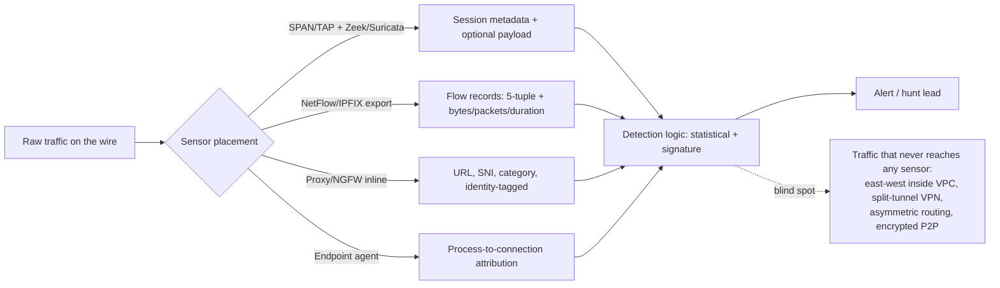

# Part IX — Network Detection Engineering

Network detection engineering is the discipline of finding adversary behaviour in the metadata and
content of traffic that crosses a wire, a switch, a firewall, or a proxy — without necessarily
having an endpoint agent on the box generating that traffic. It is the oldest branch of detection
engineering (NIDS predates EDR by a couple of decades) and it is also the branch most affected by
encryption, cloud egress patterns, and the sheer volume of noise that "normal" enterprise traffic
generates.

This part treats network detection as applied statistics as much as signature matching. Almost
everything here — scanning, beaconing, tunnelling, DGA domains, fast flux, exfiltration — reduces
to a small number of underlying measurements: how often something happens, how regular the timing
is, how much data moves, in which direction, to how many distinct endpoints, and how "expected"
that endpoint is given history. Get comfortable with those measurements first; the specific
detections are just different combinations of them.

## 1. What the network actually gives you

[ENGINEERING] Before writing any network detection, know what telemetry tier you are working with,
because it changes what is detectable at all.

| Tier | Example source | What you get | What you don't get |
|---|---|---|---|
| Flow/NetFlow/IPFIX | Router/switch flow export, VPC Flow Logs, Zeek `conn.log` | src/dst IP, port, proto, bytes, packets, duration, flags | payload content, TLS metadata (unless enriched) |
| Full packet capture | Zeek, Suricata, tap/SPAN | everything, including payload if unencrypted | storage cost is brutal at scale, usually short retention |
| Proxy/firewall logs | web proxy, NGFW, DNS resolver logs | URL/domain, category, user identity, TLS SNI, sometimes JA3 | traffic that bypasses the proxy (direct-to-IP, non-web ports) |
| Session metadata (Zeek-style) | `conn.log`, `dns.log`, `ssl.log`, `x509.log`, `ssh.log`, `smb_files.log` | protocol-aware fields without full payload storage cost | still needs SPAN/tap placement to see the traffic at all |
| EDR network events | Sysmon Event ID 3 (network connection), EDR network module | process-to-connection attribution on the endpoint | no visibility into east-west traffic between hosts without an agent, no wire truth (relies on OS reporting) |

**Engineering Reality**: the single biggest failure mode in network detection engineering isn't
the analytic — it's coverage gaps in what actually reaches the sensor. Asymmetric routing, TAP
aggregation drops during bursts, VPN split-tunnel traffic that never touches the monitored egress,
and cloud workloads that talk to each other inside a VPC without ever crossing a monitored
boundary — all of these produce silent blind spots that never show up as an error. A rule that
looks solid in a tabletop review can have zero real detection surface because the traffic path it
assumes doesn't exist in your environment. Validate sensor placement against actual routing/VPC
architecture before trusting any network detection's stated coverage.



## 2. The underlying statistics

Everything downstream in this part is built from these primitives. Learn them once.

### 2.1 Frequency and connection count

How many times does X happen in a window? Trivial to compute, easy to defeat with jitter, but
still the first filter applied because it's cheap. A host making 50,000 outbound connection
attempts in ten minutes is worth looking at regardless of what else is true.

### 2.2 Fan-out and fan-in

- **Fan-out**: one source talking to many distinct destinations (ports, IPs, or both). This is the
  signature of scanning, and also of legitimate things like a patch server or a CDN health-checker.
- **Fan-in**: many distinct sources talking to one destination. This is the signature of a
  scan *target*, a popular internal service, or — if the destination is external and unusual — a
  possible shared C2 or credential-harvesting drop point being hit by multiple compromised hosts.

[DETECTION ENGINEER] Fan-out/fan-in thresholds must be baselined per role. A vulnerability
scanner, an asset-inventory tool, a load balancer health check, and a DNS resolver all have
naturally high fan-out or fan-in as their job. Building a network detection without a
role-aware allowlist produces immediate, permanent noise from your own infrastructure.

### 2.3 Periodicity (beacon timing)

Malware C2 checks in on a schedule, even a jittered one. The statistic that matters is the
**coefficient of variation** of inter-arrival times: `stddev(intervals) / mean(intervals)`. Human
and application-driven traffic (browsing, sync clients doing real work) tends to have irregular,
bursty inter-arrival times — high CoV. A beacon calling back every 60 seconds ± a few seconds of
jitter has a low CoV, often under 0.2–0.3, even with jitter designed to evade naive timing checks.

Worked example: connection timestamps (seconds since epoch) for one internal host to one external
IP over an hour:

```
0, 58, 121, 179, 242, 301, 360, 419, 481, 539, 601, 660
```

Intervals: `58, 63, 58, 63, 59, 59, 59, 62, 58, 62, 59` — mean ≈ 60, stddev ≈ 2.2, CoV ≈ 0.037.
That is an extremely regular beacon. Compare to a user's browser making requests to the same
number of connections over the same hour with intervals scattered from 4 seconds to 640 seconds —
mean might be similar but stddev will be an order of magnitude larger, CoV well above 1.

**Hunter's Note**: don't threshold CoV alone. Legitimate heartbeat/telemetry agents (endpoint
agents phoning their own vendor cloud, NTP, monitoring agents, license checks) are also low-CoV by
design. Pair periodicity with destination rarity — a low-CoV beacon to a well-known,
long-established, widely-contacted vendor domain is far less interesting than the same pattern to a
domain first seen this week.

### 2.4 Duration and byte ratio

- **Session duration** separates a quick beacon check-in (connect, exchange a few hundred bytes,
  close, all in under a second) from an interactive session (RDP, SSH, remote shell) that stays
  open for minutes or hours.
- **Byte ratio** (bytes sent by internal host ÷ bytes received, or the reverse depending on your
  convention) separates traffic shapes. A C2 beacon with no tasking pending is asymmetric toward
  tiny outbound, tiny inbound (heartbeat). A C2 beacon that just received a task and is exfiltrating
  a file is asymmetric the other way — large outbound relative to inbound. Normal web browsing is
  usually inbound-heavy (small request, large response — pages, images). A host that suddenly
  flips from inbound-heavy to outbound-heavy on a connection to an external IP is a strong
  exfiltration indicator.

### 2.5 Entropy

Used two ways in this part:

- **String/label entropy** — Shannon entropy of a DNS label, subdomain, or URL path. Human-chosen
  and dictionary-based names have low-to-moderate entropy (`www`, `mail`, `cdn-assets-prod`).
  Algorithmically generated names (DGA domains, base32/base64-encoded tunnelled data in a subdomain)
  have entropy closer to the theoretical maximum for the character set.
- **Payload byte entropy** — used to distinguish compressed/encrypted blobs (high entropy, flat
  byte-value distribution) from plaintext or structured data (lower entropy, skewed distribution).
  Relevant for spotting encrypted archives or encoded payloads riding over protocols that are
  normally plaintext.

Shannon entropy formula, for reference: `H = -Σ p(x) * log2(p(x))` over the character (or byte)
frequency distribution `p(x)` in the string. A random lowercase-alphanumeric 20-character string
lands close to 4.0–4.3 bits/character; an English word or hostname sits lower, typically 2.5–3.5.

### 2.6 Rarity — rare destination, rare ASN, new domain, unexpected protocol

Rarity detections all follow the same shape: build a baseline of "what has this
host/user/segment normally talked to" over a rolling window (commonly 30–90 days), then flag
anything absent from that baseline. Variants:

- **Rare destination**: this specific IP/domain has never (or rarely) been contacted by this host
  or by the organisation as a whole.
- **Rare ASN**: the destination IP belongs to an Autonomous System the organisation almost never
  talks to (e.g., a residential/hosting ASN in a country with no business relationship, versus the
  handful of cloud/CDN ASNs that carry most legitimate traffic).
- **New domain**: the domain's WHOIS/registration or first-seen-in-passive-DNS date is recent
  (commonly under 30 days) — attacker infrastructure is disproportionately young because domains
  get burned and rotated.
- **Unexpected protocol on a port**: TLS negotiated on port 8080, or a non-DNS protocol on port 53,
  or SSH on port 443 — protocol/port mismatch is a classic evasion technique and a classic
  detection technique in one.

**SOC Management View**: rarity-based detections are the most valuable *and* most alert-fatigue-
prone category in this part. "First time this ASN has been contacted org-wide" fires constantly in
any organisation with any cloud sprawl, SaaS adoption, or remote workforce. Budget for these as
hunt-queue/risk-score inputs (see Part XXIV, Risk-Based Alerting) rather than standalone paging
alerts, unless combined with at least one other rarity or behavioural signal.

## 3. Port scanning — horizontal and vertical

[CONCEPT] **Vertical scanning** is one source probing many ports on one (or few) destinations —
"what's open on this box." **Horizontal scanning** is one source probing the same port (or small
port set) across many destinations — "who out there has this port open." Both are fan-out
problems, just fanning out over different axes (port vs. IP).

[ANALYST] What you look for in flow/session data:
- Vertical: single src IP, single (or very few) dst IP, high distinct dst-port count in a short
  window, mostly `SYN` with no completed handshake (`SYN`/`RST` or `SYN` with no `SYN-ACK`) if you
  have flag-level visibility.
- Horizontal: single src IP, high distinct dst-IP count, narrow dst-port set, same asymmetric
  handshake pattern.

Legitimate look-alikes: vulnerability scanners (Nessus/Qualys/Rapid7 doing exactly this by design,
usually from known scanner subnets — allowlist these explicitly and monitor the allowlist itself
for drift), asset discovery tools, load balancers/health checkers, and — increasingly — internal
security tooling doing its own attack-surface discovery. The reliable differentiator from
malicious scanning is usually *source identity and schedule* (a known scanner running on its known
schedule from its known subnet) rather than anything in the traffic shape itself, since the traffic
shape is identical.

**Illustrative Sigma-style detection (network category), horizontal scan:**

```yaml
title: Horizontal Port Scan - Single Port Fan-Out Across Many Destinations
id: part09-01
status: experimental
logsource:
  category: network_connection
  product: zeek
detection:
  selection:
    dst_port: 445           # example: SMB scan sweep
  timeframe: 5m
  condition: selection | count(dst_ip) by src_ip > 25
falsepositives:
  - Vulnerability scanners (allowlist known scanner subnets)
  - Asset discovery / CMDB tooling
  - Backup/replication jobs enumerating file shares at startup
level: medium
tags:
  - attack.reconnaissance
  - attack.t1046
```

**Illustrative KQL, vertical scan (single source, many distinct ports on one destination):**

```kql
// part09-02 — Vertical port scan: one host probing many ports on one target
NetworkSessionEvents
| where Timestamp > ago(15m)
| summarize DistinctPorts = dcount(DstPort), Attempts = count()
    by SrcIP, DstIP, bin(Timestamp, 15m)
| where DistinctPorts > 20 and Attempts < DistinctPorts * 2   // mostly single-attempt probes
| where SrcIP !in (KnownScannerIPs)
```

[THREAT HUNTER] Hunt for scanning that stays *under* your count threshold — slow scans spread
over days, or scans that touch only a handful of high-value ports (3389, 445, 22, 5985) rather
than a broad sweep, are deliberately built to sit under naive thresholds. Pivot on "distinct ports
probed per source, per day, over a 7-day rolling window" rather than a single short window, and
look for sources that show up as low-and-slow across multiple days versus a single burst.

## 4. Beaconing and C2 patterns

Beaconing is the network behaviour, not a specific tool — any C2 framework, RAT, or even
legitimate check-in software beacons because it's the simplest reliable way to maintain a channel
without keeping a connection open. The engineering problem is separating malicious beacons from
the very large population of legitimate low-CoV periodic traffic (Section 2.3) already living in
your environment: telemetry agents, license servers, update checkers, monitoring heartbeats, NTP,
health checks, CDN pings.

[DETECTION ENGINEER] A practical beacon-scoring analytic combines:

1. **Periodicity** — low coefficient of variation of inter-arrival time (Section 2.3).
2. **Destination rarity** — new or rarely-contacted domain/IP/ASN (Section 2.6).
3. **Session shape** — small, similar-sized requests/responses repeated across sessions (many C2
   frameworks pad or fix beacon size; look for low variance in bytes-per-session too, not just
   timing).
4. **Duration of the pattern** — malicious beacons tend to persist for days/weeks once
   established; a one-off periodic burst that stops is more likely a scheduled job or update check.
5. **Volume outside beacon windows** — tasking/exfil bursts that break the small-and-regular
   pattern occasionally, riding on top of the steady beacon.

None of these alone is reliable. Combined, they cut the false-positive rate dramatically because
legitimate low-CoV traffic rarely also scores high on destination rarity, and rare-destination
traffic rarely also has this level of timing regularity.

### Detection Autopsy: the naive "beacon" rule

**Original logic**: "Alert if any internal host connects to the same external IP more than 100
times in 24 hours." This is a rule that shows up early in a lot of SOC's rule sets because it's
one line of SPL/KQL and it does catch *some* beacons.

**Why it looked reasonable**: beacons do connect repeatedly to the same destination, and 100
connections/day (~one every 15 minutes) sounds like a specific enough threshold to avoid one-off
traffic.

**What breaks in production**:
- **False positives, massively**: every SaaS app doing polling/sync (mail client, chat client,
  monitoring agent, browser keeping a tab open with a page that polls for updates, software update
  checkers) trips this instantly. CDNs and cloud API endpoints get contacted by hundreds of
  internal hosts each individually exceeding 100 connections/day, so the rule effectively fires
  organisation-wide, every day, against the same handful of high-volume legitimate destinations.
- **False negatives**: a beacon with a 30-minute or hourly interval, or one that jitters its
  destination across a small pool of front-domains/IPs (common in modern C2 frameworks using
  domain fronting or CDN-backed redirectors), never crosses 100 same-IP connections in a day and
  sails through untouched.
- **Missing context**: the rule has no concept of *whether the destination is unusual for this
  organisation or this host*, and no concept of *timing regularity* — it only measures raw count,
  which is the single weakest of the beacon signals on its own.

**Revised analytic** (conceptual, illustrative SPL):

```spl
| index=network sourcetype=zeek_conn
| bin _time span=1h
| stats count as conns, sum(orig_bytes) as out_bytes, sum(resp_bytes) as in_bytes,
        values(_time) as times by src_ip, dst_ip
| eval interval_list=mvmap(times, times)
| ... (interval delta + stddev/mean computed upstream in a scheduled search or notebook) ...
| where conns > 20
| lookup asset_first_seen_destinations.csv dst_ip OUTPUT first_seen_days
| where first_seen_days < 30 OR isnull(first_seen_days)
| eval cov = beacon_stddev / beacon_mean
| where cov < 0.3
| table src_ip, dst_ip, conns, cov, first_seen_days, out_bytes, in_bytes
```

**How it was tested**: replayed known C2 framework beacon traffic (fixed 60s interval, ±10% jitter)
in a lab pcap against both the naive rule and the revised analytic, alongside a week of production
Zeek `conn.log` from a segment with heavy SaaS traffic.

**Result**: naive rule — fired on 40+ distinct legitimate destinations per day, missed the
lab-simulated beacon entirely because it used a 60-second interval (which is only ~1,440
connections/day, actually *would* trip count-only... but the same test against a 20-minute-interval
beacon, 72 connections/day, sailed under the 100/day threshold and was missed). Revised analytic —
zero hits on the SaaS baseline traffic (high destination familiarity filtered it out), caught the
20-minute-interval lab beacon because of its CoV and destination-rarity score, even though its raw
count was well under 100.

> **[SCREENSHOT PLACEHOLDER — CONTROLLED LAB]** — Zeek `conn.log` entries from a lab host running a
> C2 framework beacon at a fixed interval with jitter, showing the `ts`, `duration`, `orig_bytes`,
> `resp_bytes` fields needed to compute inter-arrival intervals and byte-ratio for the worked
> beacon-scoring example above.

## 5. DNS tunnelling, DGA, and fast flux (summary — see Part X for depth)

These three get full treatment in Part X (DNS Detection); here's the network-detection-relevant
summary so this part stands on its own.

- **DNS tunnelling** encodes data (C2 tasking or exfiltrated content) inside DNS queries/responses,
  typically as long, high-entropy subdomain labels (base32/base64-like alphabets), with unusually
  high query volume and query length for the querying host, and often unusual record types (`TXT`,
  `NULL`, `CNAME` chains) for a "resolution." [DETECTION ENGINEER] measure label entropy
  (Section 2.5), label length distribution, and query rate per host — see Part X for the full
  statistical treatment and worked Sigma/KQL examples.
- **DGA (Domain Generation Algorithm)** domains are the *destination* side of a similar problem:
  malware computes a list of candidate C2 domains algorithmically (often seeded by date, so the
  domain rotates daily) rather than hardcoding one. Network-visible signal: a host generating a
  burst of NXDOMAIN responses for high-entropy, unregistered-looking domains, followed by a single
  successful resolution — the "shotgun then hit" pattern.
- **Fast flux** is infrastructure resilience for the attacker: a single hostname resolves to a
  rapidly rotating set of IPs (often compromised residential hosts) with very low TTLs. Network
  signal: a domain's resolved-IP set changes every few minutes, the IPs span many unrelated ASNs
  (often residential/eyeball networks rather than hosting), and TTL values sit well below what a
  legitimate CDN or load balancer would use for the same purpose.

**Hunter's Note**: DGA and fast-flux hunts both benefit enormously from passive DNS / historical
resolution data — without it you're only ever looking at "what does this domain resolve to right
now," which tells you nothing about the rotation behaviour that actually defines the pattern.

## 6. Suspicious TLS, JA3/JA4, and encrypted traffic analysis

[CONCEPT] You mostly can't read encrypted payload, but the TLS handshake itself — before
encryption is fully established — leaks a surprising amount: the client's offered cipher suites,
extensions, and their order (fingerprinted as **JA3** for the client, **JA3S** for the server
response, and the newer **JA4** family which improves on JA3's weaknesses, notably its sensitivity
to cipher-suite list reordering and TLS 1.3's reduced negotiation surface); the server's
certificate (`x509.log` in Zeek — subject, issuer, validity period, self-signed status); and the
**SNI (Server Name Indication)** field, which — unless ECH (Encrypted Client Hello) is in use —
names the destination hostname in plaintext even over TLS.

[ANALYST] What's suspicious in TLS metadata, roughly in order of reliability:

| Signal | What it suggests | Caveat |
|---|---|---|
| Self-signed certificate on an external connection | Attacker-operated infrastructure, or an internal tool with a bad cert (very common false positive) | Plenty of legit internal appliances/dev environments self-sign |
| Certificate valid for a very short period, or issued the same day it's first seen in traffic | Disposable/rapidly rotated attacker infra | Some legit automation (Let's Encrypt short-lived certs) also looks like this |
| SNI/domain mismatch with certificate CN/SAN | Domain fronting, misconfigured proxy, or C2 hiding behind a legitimate front | Some CDNs and enterprise proxies legitimately do this |
| JA3/JA4 client fingerprint matching a known malware family or C2 framework's TLS library | Direct tool identification | Fingerprint collides with anything else using the same TLS library/version (e.g., same Python `requests`/`urllib3` build) — collision rate is non-trivial |
| TLS version/cipher suite far below current standard (e.g., forced TLS 1.0) on an internal server | Legacy or vulnerable service, not necessarily malicious | Also just old, unpatched, boring infrastructure |
| No SNI at all on an otherwise normal-looking TLS handshake to a public IP | Possible domain fronting or direct-to-IP tooling | Some legitimate clients omit SNI when connecting by IP literal |

**Engineering Reality**: JA3/JA4 fingerprints identify the *TLS client library and its configured
options*, not the malware. A JA3 hash shared by a known C2 framework and by an internal Python
automation script using the same underlying TLS stack version is exactly the same hash — you will
get real collisions, not edge cases. Treat a JA3/JA4 match as a strong pivot point for hunting and
correlation, not as a standalone high-confidence alert.

**Illustrative KQL, self-signed cert + rare destination combo:**

```kql
// part09-03 — External TLS session, self-signed cert, first-seen destination
let knownDests = TlsSessions
    | where Timestamp between (ago(90d) .. ago(1d))
    | summarize by DstIP;
TlsSessions
| where Timestamp > ago(1d)
| where IsSelfSigned == true
| where DstIPIsExternal == true
| join kind=leftanti knownDests on DstIP
| project Timestamp, SrcIP, DstIP, SNI, CertSubject, CertIssuer, JA3
```

## 7. Proxy abuse

[CONCEPT] "Proxy abuse" here covers two related but distinct patterns: (a) adversaries routing
their C2 or exfil traffic through legitimate proxy/relay infrastructure (open proxies, residential
proxy networks, compromised routers used as relays, or cloud functions used as forwarders) to
blend in and defeat IP-reputation blocking; and (b) adversaries abusing *your own* proxy/NAT egress
as a pivot, e.g. using a compromised internal host as a SOCKS/HTTP relay to reach other internal
segments or to exfiltrate under the identity of a trusted egress point.

[ANALYST] Signals: a single internal host generating traffic to a large, diverse set of
destination ASNs known primarily as residential-proxy or VPN-exit ranges; proxy logs showing a
user-agent or client fingerprint that doesn't match the claimed application; CONNECT-method proxy
requests to non-standard ports; or — for the internal-relay case — an internal host suddenly
appearing as the source of connections to segments it has no business reason to reach, immediately
following an initial compromise indicator on that host.

[THREAT HUNTER] Cross-reference proxy CONNECT logs against your egress firewall/NGFW allow rules:
a host successfully reaching a destination through the proxy that isn't in the categories your
proxy policy is supposed to allow indicates either a policy gap or that the traffic is tunnelling
inside an allowed protocol (e.g., HTTPS CONNECT to a port normally reserved for something else).

## 8. Tor usage

[CONCEPT] Tor entry/exit nodes are public and change frequently, but consolidated, regularly
updated Tor node lists (from the Tor Project itself, and various threat-intel feeds that mirror it)
make this one of the more reliable rare/known-bad-list matches in network detection — the hard
part is keeping the list fresh, not building the logic.

[DETECTION ENGINEER] Match destination IP (for direct Tor connections) or, more usefully, match
JA3/JA4 fingerprint patterns associated with the Tor client's bundled TLS library alongside
destination-port conventions (9001, 9030, and non-standard high ports commonly used by
bridges/pluggable transports, which exist specifically to evade simple IP-list blocking). Because
bridges are designed to look like arbitrary TLS traffic to arbitrary IPs, a pure IP-list approach
will always have a detection gap against bridge-based Tor usage — this is a case where the
adversary/user side has explicitly engineered around exactly this detection.

[MANAGEMENT] Whether Tor usage itself is an incident depends entirely on policy — for most
enterprises it's a policy violation and possible exfiltration/anonymisation-of-malicious-activity
indicator worth an automatic ticket, not necessarily a page-the-on-call event, unless it correlates
with a host that has other compromise indicators. Decide and document this threshold before the
first alert fires, not after.

## 9. SMB lateral movement

[CONCEPT] SMB (TCP 445, plus legacy 139) carries file share access, named pipes, and — critically
for lateral movement — remote service creation, scheduled task creation, and admin share access
(`C$`, `ADMIN$`) that tools like PsExec-style remote execution and many post-exploitation
frameworks rely on.

[ANALYST] Network-visible SMB lateral movement signals: a single source host making SMB
connections (fan-out) to many distinct internal hosts in a short window — normal file-share usage
is typically many clients to few servers (high fan-in to file servers), not one client fanning out
to many peers; connections to `ADMIN$`/`C$` shares from a host that isn't a management/deployment
system; and SMB sessions immediately followed (same host pair, seconds later) by a new process or
service artifact on the target if you can correlate with endpoint telemetry (Sysmon Event ID 3 for
the network leg, Event ID 1/process-creation on the target, or Windows Security Event ID 5145 for
detailed file-share object access, 4624/logon-type-3 for the network logon itself).

**Illustrative Sigma-style detection, SMB fan-out:**

```yaml
title: Single Host SMB Fan-Out to Multiple Internal Peers
id: part09-04
status: experimental
logsource:
  category: network_connection
  product: any
detection:
  selection:
    dst_port: 445
    src_ip|cidr: '10.0.0.0/8'      # internal source only
    dst_ip|cidr: '10.0.0.0/8'      # internal destinations only
  timeframe: 10m
  condition: selection | count(dst_ip) by src_ip > 10
falsepositives:
  - File server replication/DFS-R
  - Backup agents enumerating shares across the estate
  - Vulnerability scanners with SMB checks enabled
  - Domain controllers (SYSVOL/NETLOGON replication is expected high fan-out)
level: high
tags:
  - attack.lateral-movement
  - attack.t1021.002
```

[DETECTION ENGINEER] The false-positive list above is not decorative — DFS-R, backup agents, and
domain controller replication are the three most common causes of this rule firing in any real
enterprise, and all three need explicit role-based exclusion (by known server/service account
identity, not just IP range) before this rule is usable operationally.

[THREAT HUNTER] Pivot from any confirmed initial-access host: what internal SMB fan-out happened
from that host in the following hours, and did any of those destination hosts show new service
creation, new scheduled tasks, or new local admin logons shortly after? This chain — SMB
connection, then remote execution artifact, then possibly a new beacon originating from the
*new* host — is the core lateral-movement-to-second-beacon pattern worth hunting even when no
single step alone crossed an alerting threshold.

## 10. RDP activity

[ANALYST] RDP (TCP 3389, though it's commonly moved to non-standard ports both by legitimate admin
practice and by attackers trying to blend in either direction) lateral movement and external
exposure both matter here. Network-visible signals: external-source connections to internal RDP
listeners (should essentially never happen without going through a jump host/VPN/PAM
solution — treat any exception as notable); internal RDP fan-out from a single source similar to
the SMB pattern; and session duration/byte patterns that distinguish an interactive human RDP
session (variable, bursty byte flow matching screen updates and input) from an automated tool
abusing the RDP channel.

[ENGINEERING] Windows Security Event ID 4624 with Logon Type 10 (RemoteInteractive) is the
endpoint-side correlation point for RDP logons; pairing that with the network-visible connection
(Sysmon Event ID 3, or flow/session data showing port 3389) gives you both "who logged in" and
"where the network path actually went," which matters when RDP is proxied/gatewayed and the
visible network hop isn't the true origin.

## 11. SSH activity

[ANALYST] SSH (TCP 22, or wherever it's been moved) lateral movement and tunnelling both matter.
Beyond straightforward brute-force/credential-stuffing patterns (high connection count, many
failed auth attempts, from one source to one or many destinations — a fan-out/fan-in problem
again), SSH's built-in port-forwarding (`-L`, `-R`, `-D` for dynamic/SOCKS forwarding) makes it a
capable tunnelling and proxy tool in its own right. A SOCKS proxy set up over an SSH session (`-D`)
can carry arbitrary further traffic that never shows up as its own network flow — from the
network's point of view it's all just one long SSH session with an unusual byte profile (sustained,
variable bidirectional traffic rather than the short, bursty pattern of an interactive terminal
session).

[DETECTION ENGINEER] Session duration outliers are the most practical network-only signal for
SSH tunnelling: an SSH session open for hours with continuous bidirectional data flow, versus the
typical interactive-shell pattern of short bursts separated by idle gaps, is worth flagging for
review even without payload visibility. Combine with source/destination roles — an SSH session
from a workstation (not a designated jump host or automation account) held open for an unusually
long duration is a stronger signal than the same duration from a known bastion host.

## 12. Data exfiltration patterns

[CONCEPT] Exfiltration detection at the network layer is fundamentally a byte-ratio and
destination-rarity problem, sometimes with a timing/volume-burst component layered on.

[DETECTION ENGINEER] Practical exfiltration analytics, roughly from cheapest/noisiest to most
precise:

1. **Absolute outbound volume threshold per host** — simplest, catches gross exfil, drowns in
   false positives from legitimate large uploads (backups, cloud sync, video calls, large file
   shares to partners).
2. **Outbound/inbound byte ratio flip** — a host whose historical traffic to a given destination
   (or destination category) is normally inbound-heavy suddenly sending far more than it receives.
   Better signal-to-noise than raw volume because it's relative to the host's own baseline.
3. **Volume + destination rarity combined** — large outbound transfer to a destination the
   organisation or host has never talked to before is meaningfully more suspicious than the same
   volume to a long-established, whitelisted partner or cloud storage endpoint.
4. **Volume + unusual timing** — large transfer outside the host's normal active hours (e.g., 3
   AM from a workstation with no scheduled job history at that time) adds another independent
   signal.
5. **Slow/low exfiltration over time** — the evasive case: an attacker deliberately keeps
   per-session volume low and spreads the transfer over days/weeks specifically to stay under any
   single-session threshold. This requires aggregating cumulative bytes to a given destination (or
   destination category/ASN) over a rolling multi-day window, not just per-session — the single
   most commonly missing analytic in exfiltration detection programs, because it requires
   maintaining running state rather than evaluating each session independently.

**Fully worked example — combining byte ratio, rarity, and rolling volume:**

Illustrative SPL, flagging hosts whose *cumulative* outbound volume to a rare destination over 7
days crosses a threshold, even though no single session did:

```spl
| index=network sourcetype=zeek_conn earliest=-7d
| lookup asset_first_seen_destinations.csv dst_ip OUTPUT first_seen_days
| where isnull(first_seen_days) OR first_seen_days < 14
| stats sum(orig_bytes) as total_out, sum(resp_bytes) as total_in,
         count as sessions, dc(_time) as active_days
    by src_ip, dst_ip
| eval byte_ratio = total_out / (total_in + 1)
| where total_out > 50000000 and byte_ratio > 3 and active_days > 1
| sort - total_out
```

This deliberately favours a *low* per-session threshold spread across multiple active days over a
single-session spike threshold, to surface the slow/low pattern that pure per-session rules miss.

**Detection Autopsy is covered above for beaconing; for exfiltration the single most common
production failure is the same shape**: a per-session (not cumulative) volume threshold, tuned
against last month's "biggest exfil incident" size, that a patient attacker simply stays under by
splitting the transfer across enough sessions and enough days. Any exfiltration detection program
that doesn't include a rolling cumulative-volume-per-destination analytic has this exact gap,
whether or not it's been exploited yet.

## 13. Rare destination / rare ASN / new domain / unexpected protocol — pulling it together

Section 2.6 introduced these individually. In practice they're most useful stacked as independent
scoring inputs into a risk-based model (Part XXIV) rather than as standalone rules, because each
one alone has a high base rate of legitimate hits in any organisation with normal cloud/SaaS usage.
A connection that is simultaneously (a) to a domain first seen in the last 7 days, (b) hosted on an
ASN the organisation has contacted fewer than 5 times ever, and (c) using a protocol/port
combination that doesn't match the SNI's implied service, is a meaningfully different risk level
than any one of those facts alone — and that stacking is the practical answer to "why do all four
of these get their own category but none of them get their own page-the-analyst alert."

## 14. Coverage summary and telemetry mapping

| Behaviour | Primary telemetry | Key statistic(s) | MITRE technique(s) |
|---|---|---|---|
| Horizontal/vertical port scan | Flow/session logs (Zeek `conn.log`, NetFlow) | Fan-out, connection count, handshake completion ratio | T1595, T1046 |
| Beaconing/C2 | Flow/session logs, TLS metadata | Periodicity (CoV), destination rarity, byte-ratio consistency | T1071, T1568, T1105 |
| DNS tunnelling / DGA / fast flux | DNS resolver logs, passive DNS | Label entropy, query rate, NXDOMAIN ratio, TTL/IP rotation | T1071.004, T1568.002, T1568.001 |
| Suspicious TLS / JA3/JA4 | `ssl.log`/`x509.log`, proxy TLS inspection metadata | Fingerprint matching, cert age/self-sign, SNI/cert mismatch | T1573, T1071.001 |
| Proxy abuse | Proxy/NGFW logs, flow logs | Destination ASN diversity, CONNECT method anomalies | T1090, T1090.002, T1090.003 |
| Tor usage | Flow logs, TLS metadata | Known-node matching, JA3/JA4 + port convention | T1090.003 |
| SMB lateral movement | Flow/session logs, Windows 5145/4624, Sysmon 3 | Fan-out, share-access pattern | T1021.002, T1570 |
| RDP activity | Flow logs, Windows 4624 (LogonType 10), Sysmon 3 | External-source anomaly, fan-out, session byte pattern | T1021.001 |
| SSH activity | Flow/session logs, `ssh.log` (Zeek), auth logs | Fan-out/fan-in (brute force), session duration outliers | T1021.004, T1572 |
| Data exfiltration | Flow/session logs, proxy logs, DLP | Byte ratio, rolling cumulative volume, destination rarity | T1041, T1048, T1567 |
| Rare destination/ASN/new domain/protocol mismatch | Flow logs, DNS logs, WHOIS/passive-DNS enrichment | First-seen tracking, ASN reputation, entropy | T1071, T1568 |

## 15. Closing note for this part

Network detection engineering rewards building a small library of reusable statistical
building blocks — periodicity scoring, rarity/first-seen tracking, byte-ratio computation, entropy
scoring — once, well, and applying them across every behaviour in this part, rather than writing
each detection as a one-off threshold rule. The specific adversary technique changes constantly;
the underlying traffic-shape math barely does. Part X picks up DNS-specific depth (tunnelling, DGA
scoring detail, resolver telemetry engineering) building directly on the entropy and rarity
statistics introduced here.
