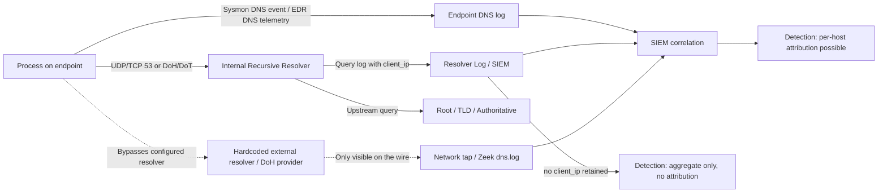

# Part X — DNS Detection

DNS is the one protocol almost every piece of malware, every C2 framework, and every red team
toolkit still has to touch, because it is the one protocol almost never fully blocked outbound.
It is also one of the highest-volume, lowest-signal telemetry sources a SOC collects. A mid-size
enterprise resolver easily logs tens of millions of queries a day. Detection engineering on DNS is
mostly a statistics and baselining problem wearing a security hat — and it's one of the places
where a "clever-sounding" single-field rule looks great in a slide deck and falls apart in
production within a week.

This chapter works through the actual signal types available in DNS telemetry, why the popular
naive heuristics fail, and how to combine weak signals into something that survives contact with
a real network.

## What DNS Actually Gives You

Before touching detection logic, be precise about what a query/response pair actually contains,
because the field-level detail is what breaks most "textbook" DNS rules.

| Field | Reliable? | Notes |
|---|---|---|
| `query_name` (QNAME) | Yes | Case-insensitive, but DNS-0x20 randomization means case varies query to query — don't build detections that assume stable case. |
| `query_type` | Yes | A, AAAA, TXT, MX, NS, CNAME, ANY. TXT and NULL abuse matter for tunnelling. |
| `response_code` | Yes | NOERROR, NXDOMAIN, SERVFAIL, REFUSED. |
| `answer` (resolved IP/CNAME chain) | Partial | Missing on NXDOMAIN, and CDNs/anycast make the IP nearly meaningless for reputation. |
| `client_ip` | Depends on vantage point | Internal resolver logs give you the real endpoint. A query seen at a recursive resolver serving thousands of NAT'd clients gives you nothing per-host. |
| `TTL` | Often missing in logs | Very short TTLs (0–300s) correlate with fast-flux and some DGA/C2 infra, but plenty of legit CDN/load-balanced services also use short TTL. |
| `EDNS/DNSSEC flags` | Rarely logged | Useful for fingerprinting resolver software, rarely for behavioural detection. |
| Query timing/jitter | Only if you build it | Beaconing detection requires you to bucket timestamps yourself; nothing hands this to you. |

[ENGINEERING] The single biggest failure mode in DNS detection programs isn't the analytic
logic — it's not knowing *which resolver tier* generated the log. Enterprises frequently have
three DNS visibility points that behave completely differently:

1. **Endpoint-to-internal-resolver** (e.g., via Windows DNS Client debug logging, Sysmon config
   change, or EDR DNS telemetry) — per-process, per-host, highest fidelity, often missing on
   Linux/macOS unless you specifically enable it.
2. **Internal resolver to upstream/recursive** — aggregated across every client behind that
   resolver; you lose the requesting host unless the resolver logs client IP per query (most do,
   but retention is often hours, not weeks).
3. **Passive DNS / network-tap view** (e.g., Zeek `dns.log`) — sees the wire traffic, catches
   clients that bypass the configured resolver entirely (hardcoded 8.8.8.8, DoH to an
   uncontrolled provider), but usually can't attribute to a specific process.

If your detection assumes host attribution and your pipeline is actually built on tier 2 logs
without client IP, every alert becomes "some machine behind this resolver did X" — which is not
actionable. Confirm this before writing a single rule.



## Debunking "Long Domain Name = Malicious"

This rule shows up in nearly every "DNS security 101" writeup: flag any QNAME over N characters
(commonly 40, 50, or matching a regex for long random-looking labels). It is a bad rule, and it's
worth walking through exactly why, because the failure modes generalize to a lot of naive DNS
detection.

**Why it looked reasonable:** DGA-generated domains and encoded tunnelling subdomains are often
long, because they're carrying entropy or encoded payload. A 45-character subdomain label does
look unusual compared to `www.example.com`.

**What breaks in production:**

- **Massive legitimate long-domain traffic.** CDN and cloud-service subdomains are routinely
  40–70+ characters: S3 presigned-URL-style hostnames, Azure/AWS/GCP internal service discovery
  names, Microsoft Teams/Exchange Online federation subdomains, Akamai/Cloudflare edge names,
  Kubernetes-generated service DNS names inside cluster-internal zones, SPF/DKIM-related TXT
  lookups with long selector names, and mobile app SDK telemetry endpoints (ad networks,
  crash reporters) that embed device/session identifiers directly in the hostname.
- **Length alone says nothing about randomness.** `checkout-service-eu-west-1-prod-v2.internal.
  bigretailer.com` is long, structured, and completely benign. `xk4jz9qmvbnpqrs7.evil-c2.net` is
  shorter but far more suspicious. A length threshold can't distinguish "long and structured"
  from "long and random."
- **False negative side is worse than the false positive side.** Modern DGAs (Necurs-era,
  many banking trojan families) frequently generate domains in the 8–16 character range —
  short enough to sail under any length threshold entirely. A rule tuned to avoid FPs from CDN
  traffic ends up missing most real DGA traffic.
- **Trivial evasion.** Any attacker who reads the same blog posts you do will keep tunnelling
  chunk sizes and DGA output under the threshold. This is a rule the adversary can test against
  for free, offline, with zero telemetry footprint.

**What replaces it:** length is a *weight*, not a *decision*. The real detection needs entropy,
n-gram/dictionary scoring, rarity/reputation, volume pattern, and client behaviour context, fused
together. That's the rest of this chapter.

> **Detection Autopsy — "Long Subdomain" Rule**
>
> **Original logic:** `len(qname_label) > 40` → alert `medium`.
>
> **Why it looked reasonable:** matched the mental model of "DGA/tunnelling domains look weird
> and long," and is trivial to implement in almost any log query language with zero baselining
> work.
>
> **What broke:** in a real enterprise dataset, roughly 15–30% of daily unique QNAMEs seen at the
> internal resolver exceeded 40 characters, dominated by CDN edge nodes, SaaS federation
> endpoints, and mobile telemetry SDKs. The rule generated hundreds to low-thousands of alerts a
> day depending on org size — enough that analysts began auto-closing the queue without reading
> individual alerts (alert fatigue turning into a silent false-negative machine).
>
> **False positives:** essentially all CDN/cloud/SaaS long-hostname traffic.
> **False negatives:** short DGA domains (8–16 chars), tunnelling implementations that
> deliberately chunk into short labels, and any DNS-over-HTTPS traffic the resolver never sees at
> all.
> **Missing context:** no entropy scoring, no frequency/rarity check against a rolling baseline,
> no NXDOMAIN ratio, no client behaviour (single host vs. many hosts querying the same name).
>
> **Revised analytic:** combine normalized Shannon entropy of the label, digit/consonant-run
> ratio, first-seen/rarity against a 30-day rolling org-wide baseline, NXDOMAIN ratio for the
> registered domain, and per-client query volume/periodicity — scored, not boolean (worked
> example below).
>
> **How it was tested:** replayed against six months of resolver logs containing labeled DGA
> samples (Sality/Necurs-family conceptual generators used in a lab, not live malware) mixed into
> production-representative background traffic; compared alert volume and recall against the
> length-only rule.
>
> **Result:** alert volume dropped by roughly two orders of magnitude, recall on the labeled DGA
> set went up because short high-entropy domains were now caught, and the CDN/SaaS false-positive
> class nearly disappeared because those domains score low on entropy and are seen repeatedly by
> many hosts (i.e., they're not rare).

## Signal Inventory

### Domain reputation and newly registered domains (NRDs)

[CONCEPT] A domain's WHOIS/registration age is a strong prior: most legitimate business
infrastructure is registered well before it's used at scale, while phishing and C2
infrastructure is frequently registered days or hours before first use, precisely because
reputation lists haven't caught up yet.

[DETECTION ENGINEER] You need a threat-intel feed or passive-DNS provider that surfaces
registration/first-seen date (many commercial TI feeds and some free ones like a WHOIS/RDAP
lookup pipeline provide this). The detection pattern is: `resolved/queried domain age < 30 days`
AND the domain is being contacted by an internal host shortly after registration. This is strong
but not sufficient alone — plenty of legitimate marketing campaigns, newly launched SaaS
features, and CDN endpoints also register domains shortly before use.

[HUNTER] Pivot from any confirmed-malicious NRD to passive DNS: what other internal hosts
queried it, in what order, and did any of them resolve it before the alert fired (patient zero
identification).

### Entropy and randomness of labels

[CONCEPT] Shannon entropy measures how "random" a string looks based on character distribution.
Human-chosen or templated names cluster in a low-to-moderate entropy band; algorithmically
generated strings (DGA output, base32/base64-encoded tunnel payload) cluster higher.

Normalized Shannon entropy for a string of length *n* over alphabet *A*:

```
H(X) = -Σ p(x) * log2(p(x))   for each unique character x
```

Divide by `log2(n)` or by `log2(|A|)` to normalize across different label lengths so you can
compare a 10-character label to a 40-character label on the same scale.

[DETECTION ENGINEER] Entropy alone still has false positives — legitimate base32/base62 unique
identifiers (session tokens, container IDs, hash-based CDN cache keys) are also high entropy.
Entropy is a strong *contributing* signal, never a standalone trigger.

### Subdomain explosion / label-count anomaly

[CONCEPT] A registered domain that suddenly has thousands of distinct subdomains queried in a
short window is a classic DNS-tunnelling and DGA-with-single-C2-domain pattern: instead of many
domains, the attacker uses one domain and encodes data/commands in the subdomain label, or a
DGA family that's actually "one seed domain, many generated subdomains" rather than many
top-level domains.

[DETECTION ENGINEER] Track distinct subdomain count per registered (eTLD+1) domain per
client per rolling window (e.g., 15 minutes, 1 hour). Legitimate high-cardinality subdomain
generators exist (CDN cache-busting, some ad-tech, container orchestration health checks) so this
needs a rarity/allowlist layer, not a flat threshold.

### TXT record abuse

[CONCEPT] TXT records are free-form text and were never meant to carry much traffic, which makes
them a favorite tunnelling and C2 covert-channel type: SPF/DKIM/DMARC lookups are legitimate and
frequent, but a client repeatedly issuing TXT queries against one domain, receiving large
responses, or issuing many distinct queries against the same domain in sequence is a different
pattern than routine mail-authentication lookups.

[DETECTION ENGINEER] Baseline: TXT query rate per client, TXT response size distribution, and
ratio of TXT-to-total query volume per client. A workstation with a 40:1 TXT-to-A-record ratio
sustained over hours is not doing SPF checks — mail relays and mail security gateways doing that
ratio *is* normal, so this must be scoped by host role, not applied uniformly.

### NXDOMAIN patterns

[CONCEPT] A high ratio of NXDOMAIN responses from a single client against a single registered
domain (or against many freshly-seen domains) is a signature of DGA malware "spraying" generated
candidate domains until one resolves to a live C2 node — the vast majority of generated names
were never registered by the attacker and will NXDOMAIN forever.

[ANALYST] Distinguish this from ordinary NXDOMAIN noise: browser typo/autocomplete, expired
internal DNS records, misconfigured software retrying a decommissioned service name, and
Chromium's DNS-probing behavior (some browsers query random-looking hostnames to detect
captive-portal DNS hijacking — this specifically causes legitimate high-entropy NXDOMAIN traffic
and is a well-known false-positive source worth explicitly allowlisting/documenting).

[DETECTION ENGINEER] Score: (NXDOMAIN count / total queries) per client per registered-domain-
root per window, combined with entropy of the failing labels and distinctness of eTLD+1 roots
being tried. A client hitting hundreds of distinct freshly-seen eTLD+1 roots that all NXDOMAIN in
a five-minute window is a strong DGA indicator regardless of individual label length.

### DGA behaviour (beyond the individual domain)

[THREAT HUNTER] The strongest DGA tell isn't any single domain, it's the *pattern across many
domains from the same host*: sequential/batch resolution attempts, consistent label-length
distribution, consistent character-set (many DGAs stick to lowercase alnum, no hyphens), and a
seed-driven periodicity (many families regenerate a new candidate set daily, tied to date as a
seed — so you'll see bursts around similar times of day across multiple infected hosts if you
have more than one).

### DNS tunnelling

[CONCEPT] Tunnelling encodes payload (C2 commands, exfil data, or a full IP-over-DNS session,
e.g., iodine, dnscat2, DNSMessenger-style techniques) inside query labels and/or TXT/NULL/CNAME
responses. It is slow and lossy compared to a normal socket, but it survives environments where
DNS is the only outbound protocol reliably permitted.

[DETECTION ENGINEER] Reliable multi-signal tunnelling profile:

- Sustained high query rate to a single registered domain from one client (tunnelling needs many
  round trips to move meaningful data).
- High entropy, high label-length consistency (fixed-size chunks — encoders like base32 often
  produce very consistent lengths).
- Elevated TXT/NULL/CNAME query-type ratio versus the client's own historical baseline.
- Low TTL / low answer diversity, or answers that are themselves encoded data rather than routable
  infrastructure.
- Query timing consistent with programmatic generation (very low jitter) rather than human-driven
  browsing.

[ANALYST] Legitimate lookalikes: security/EDR agents that use DNS for licensing/heartbeat checks,
some enterprise software update mechanisms that poll via TXT for version strings, and
corporate VPN/SD-WAN health-check domains that resolve very frequently. Get an inventory of these
before rolling out a tunnelling detection or you'll spend the first two weeks chasing your own
endpoint agents.

### Rare/first-seen domains

[CONCEPT] "First seen in the environment" and "queried by very few distinct hosts" are two of the
highest-value, lowest-cost signals available, and they require no threat intel feed — only a
rolling baseline of what's normal for *this* network.

[ENGINEERING] Building this requires state: a rolling window (commonly 30–90 days) of distinct
QNAMEs (or eTLD+1s) seen org-wide, refreshed continuously, cheap to query (bloom filter or a
dedicated lookup table keyed by domain hash scales far better than re-aggregating raw logs on
every query). Get this wrong and either the baseline never fills (false first-seen floods on day
one) or it's stale (a domain that was rare three months ago but is now the org's new SaaS vendor
keeps alerting).

[MANAGEMENT] This is the single highest-ROI DNS detection capability to build, and it's
infrastructure, not a rule — budget it as a small pipeline project (rolling aggregation +
lookup service), not a SIEM correlation search. Once it exists, entropy/tunnelling/DGA/NRD
detections all get dramatically better because "and this domain is rare" is a near-universal
confidence multiplier across every other analytic in this chapter.

### Internal vs. external resolver visibility

[ENGINEERING] Internal authoritative DNS (AD-integrated zones, internal service discovery) and
external recursive resolution are different problems with different attacker relevance. Lateral
movement and internal reconnaissance show up in internal DNS query patterns (unusual SRV/LDAP
lookups, sudden reverse-lookup sweeps, service-account hosts resolving names they've never
resolved before) — external DNS misses all of this. Conversely, C2/tunnelling/DGA is almost
entirely an external-resolution problem. A program that only ingests external DNS (common,
because it's the "security" DNS feed vendors sell) has a structural blind spot on internal
lateral movement via DNS-based service discovery abuse.

## Worked Example: Fusing Signals Instead of One Rule

Below is an illustrative multi-signal scoring approach, shown as pseudocode/SPL-style logic
(illustrative syntax — adapt field names to your platform; not guaranteed to run unmodified).

**Detection: part10-01 — DGA / DNS-Tunnelling Composite Score**

```
| eval label = mvindex(split(query_name, "."), 0)
| eval etld1 = <extract registered domain from query_name>
| eval label_len = len(label)
| eval entropy = <shannon_entropy(label)> / log2(label_len)   /* normalized 0-1 */
| eval digit_ratio = <count_digits(label)> / label_len
| eval consonant_run = <longest_consonant_run(label)>
| stats
    count as total_queries,
    dc(query_name) as distinct_subdomains,
    sum(eval(response_code="NXDOMAIN")) as nx_count,
    dc(eval(if(query_type="TXT", query_name, null()))) as txt_domains,
    avg(entropy) as avg_entropy,
    stdev(label_len) as label_len_stdev,
    values(client_ip) as clients
  by etld1, client_ip, _time span=15m
| eval nx_ratio = nx_count / total_queries
| lookup org_domain_baseline etld1 OUTPUT first_seen_days, distinct_client_count_90d
| eval rarity_score = if(first_seen_days < 7 OR distinct_client_count_90d <= 2, 1, 0)
| eval score =
    (avg_entropy * 3) +
    (if(nx_ratio > 0.7, 2, 0)) +
    (if(distinct_subdomains > 50, 2, 0)) +
    (rarity_score * 2) +
    (if(label_len_stdev < 2, 1, 0))     /* fixed-size chunking = tunnelling tell */
| where score >= 6
| table _time, client_ip, etld1, total_queries, distinct_subdomains, nx_ratio, avg_entropy,
        rarity_score, score
```

Sigma-style summary of the same logic (illustrative, category-agnostic — real Sigma needs a
concrete logsource product/service and backend-specific correlation, which native Sigma doesn't
fully express for stateful aggregations like this; this is meant to communicate intent, not to be
deployed as-is):

```yaml
title: DNS DGA/Tunnelling Composite Indicator
id: part10-01
status: experimental
description: >
  Flags client/registered-domain pairs combining high label entropy, high NXDOMAIN ratio,
  subdomain-count explosion, domain rarity, and consistent (chunked) label length —
  correlated over a 15-minute window. Not a single-event rule; requires a stateful
  aggregation layer.
logsource:
  category: dns
detection:
  # expressed here as intent; actual implementation is the aggregation pipeline above
  condition: composite_score >= 6
falsepositives:
  - CDN / cloud provider infrastructure with high-cardinality subdomains
  - Security agents and update mechanisms with legitimate high-frequency TXT/heartbeat checks
  - Captive-portal DNS probing by some browsers (looks like random-label NXDOMAIN traffic)
level: high
tags:
  - attack.command-and-control
  - attack.t1071.004
  - attack.t1568.002
  - attack.exfiltration
  - attack.t1048.003
```

**How to test it:** generate synthetic DGA-pattern traffic in an isolated lab VLAN (a scripted
generator producing pseudo-random subdomains against a domain you control, resolving to NXDOMAIN
except for a small percentage) plus a simple tunnelling client (e.g., `iodine` or `dnscat2` in a
lab, never against production infrastructure) against a test domain, and confirm the composite
score crosses threshold while a control set of normal CDN/browsing traffic from the same segment
stays below it.

**How it fails in production:** the rarity lookup table going stale (new SaaS rollout floods
"first seen" alerts org-wide on day one of any change-managed rollout — coordinate with change
management), and eTLD+1 extraction breaking on multi-part public suffixes (`.co.uk`, `.github.io`)
if you're using a naive "last two labels" parser instead of a real public-suffix-list-based
extractor.

**How to tune it:** run scoring in shadow/log-only mode for at least two full business cycles
(to catch weekly and monthly-batch-job patterns), build the CDN/SaaS/security-agent allowlist from
observed high-scoring-but-benign hits, and separately tune the NXDOMAIN-ratio threshold per host
role (a dev workstation running local tooling that mistypes internal service names will have
naturally higher NXDOMAIN rates than a locked-down kiosk machine).

> **Hunter's Note:** if you only have budget to build one DNS capability, build the
> rarity/first-seen baseline before you build any scoring logic. Every other signal in this
> chapter — entropy, NXDOMAIN ratio, subdomain explosion — becomes dramatically more precise the
> moment you can also say "and nobody else in this org has ever seen this domain before."

> **Engineering Reality:** most DNS log pipelines silently drop or truncate the query/response
> pair for high-volume periods under load, and almost none retain full answer chains for CNAME-
> chased responses by default. If your detection depends on seeing the terminal A record behind
> a three-hop CNAME chain, verify your collector actually resolves and logs that chain — many
> only log the first hop.

> **SOC Management View:** DNS detection content has a much higher false-positive floor than most
> other telemetry classes because DNS traffic patterns are dictated by cloud/CDN architecture
> decisions your org doesn't control and that change without notice. Budget ongoing tuning time
> (not a one-time build) and don't put unscoped DNS analytics straight into an auto-block/auto-
> quarantine SOAR playbook — start detect-and-review, promote to auto-response only after the
> allowlist has stabilized for at least one quarter.

## Hunting Beyond the Alert

[THREAT HUNTER] Concrete pivots once you have a candidate:

- **Domain-first pivot:** who else in the org has ever queried this domain, going back as far as
  retention allows — a single compromised host is triage, five hosts across three business units
  is an incident.
- **Time-correlation pivot:** does the suspicious DNS activity align with process-creation or
  network-connection telemetry on the same host (a spike in DNS TXT queries immediately following
  a suspicious parent-process chain is a much stronger case than DNS alone).
- **Infrastructure pivot:** passive-DNS history on the resolved IP (if any resolution occurred) —
  has this IP hosted other now-flagged domains recently (fast-flux/bulletproof-hosting reuse
  pattern).
- **Negative-space pivot:** for DGA specifically, hunt for hosts with *unusually low* successful-
  resolution rates over a rolling day — a host stuck NXDOMAIN-ing hundreds of candidate domains a
  day is functionally waiting for its C2 domain to go live, and this pattern is visible before any
  single domain would individually score as malicious.

> **[SCREENSHOT PLACEHOLDER — CONTROLLED LAB]** — Pi-hole DNS query log filtered to a single
> client IP showing a burst of high-entropy, short-TTL, mostly-NXDOMAIN subdomain queries against
> one registered domain over a 10-minute window, illustrating the subdomain-explosion + NXDOMAIN-
> ratio pattern described above; would be captured from the home-lab Pi-hole instance against a
> lab-generated synthetic DGA client, never against live production traffic.

## Coverage Summary

| Signal | Standalone reliability | Best combined with | Primary evasion |
|---|---|---|---|
| Domain length | Very low | Nothing — retire as standalone | Trivial (stay under threshold) |
| Entropy | Low-medium | Rarity, NXDOMAIN ratio | Dictionary-word DGA, wordlist concatenation |
| Rarity/first-seen | Medium-high | Everything | Slow-burn pre-registration, long dwell before activation |
| NXDOMAIN ratio | Medium | Entropy, subdomain count | Attacker pre-registers all candidates (rare, costly) |
| Subdomain explosion | Medium-high | Rarity, TTL, TXT ratio | Low-and-slow tunnelling under volume threshold |
| TXT abuse | Medium | Host-role baseline | Switch to CNAME/NULL record encoding instead |
| NRD/registration age | Medium | Client volume, rarity | Domain aged/parked before use (common APT tradecraft) |
| Client behaviour (volume, jitter, timing) | Medium | All of the above | Randomized jitter, human-paced C2 |

None of these rows is sufficient alone. That's the actual takeaway for this chapter: DNS
detection maturity is measured by how many independent weak signals you can fuse with a real
baseline behind them, not by how clever any single rule looks.
