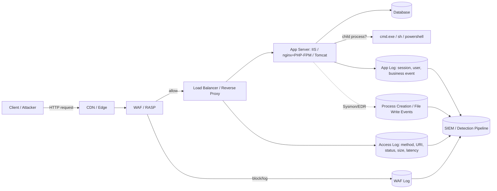
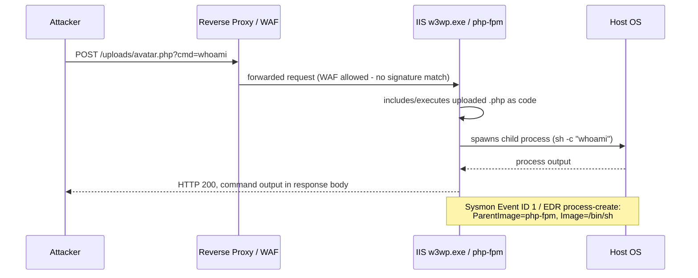

# Part XI — Web Detection Engineering

## Why web detection breaks single-field thinking faster than any other domain

Web application attacks are the one place where "write a rule for the payload" fails hardest and fastest. A SQL injection attempt looks, at the raw string level, almost identical to a penetration tester's scan, a vulnerability scanner's crawl, a legitimate ORM building a dynamic `WHERE` clause, and a customer support agent pasting a ticket number with an apostrophe in it. The string `' OR 1=1` is not malicious — the *context* it appears in, repeated across *how many* requests, from *which* source, hitting *which* parameter, followed by *what* response, is what makes it malicious.

This is the core argument of this part: web detection has to be built as a join across HTTP method, URI/path, headers, status code, response size/latency, source identity, session identity, application identity, and WAF signal — not as a regex match against one field. Everything below is written against that model.

[CONCEPT] A web request is not one event, it's a bundle of correlated facts. Method + path + parameters + headers describe *intent*. Status code + response size + latency describe *outcome*. Source IP + session/cookie + auth identity describe *who*. WAF/RASP verdict describes *a second opinion*. Detection logic that only looks at intent (payload matching) without outcome and identity drowns in false positives and still misses attackers who chunk payloads, obfuscate encoding, or use methods no signature was written for.

## Telemetry sources for web detection

| Source | What it gives you | Common gaps |
|---|---|---|
| Reverse proxy / load balancer logs (nginx, HAProxy, ALB/ELB) | Method, URI, status, latency, upstream target, sometimes headers | Often missing request body; TLS termination point may strip client IP unless `X-Forwarded-For` is trusted correctly |
| WAF logs (ModSecurity, AWS WAF, Cloudflare, Imperva, F5 ASM) | Rule ID, matched pattern, action (block/log/challenge), anomaly score | Blocked-only logging misses "logged but allowed" — attacker learned the WAF exists |
| Application/web server access logs (IIS W3C, Apache combined, PHP-FPM) | Same as proxy but closer to the app; may include response size | Timestamp skew vs. proxy layer; log rotation loses history fast on busy hosts |
| Application-level logs (auth events, business logic, API gateway) | Session ID, authenticated user, application-layer errors, rate-limit hits | Inconsistent schema across teams; often the last thing instrumented, first thing cut for "noise" |
| Host telemetry on the web server (Sysmon, EDR, auditd) | Process creation, child processes of `w3wp.exe`/`httpd`/`php-fpm`, file writes under web root | Requires host-level agent on a tier that's often treated as disposable/ephemeral (containers, autoscaled instances) |
| NetFlow / VPC flow logs | Outbound connections from the web tier — critical for SSRF and web-shell C2 | No payload visibility, just who talked to whom |
| DNS logs | Outbound resolution from web-tier hosts — SSRF-to-external, webshell beaconing domains | Needs to be captured at the host or resolver, not just the perimeter |

**Engineering Reality:** Most "web attack" detection content assumes you have full request bodies logged with parameters intact. In production, most reverse proxies do *not* log POST bodies by default, WAFs often only log the field that tripped the rule (not the full payload), and PII/compliance rules get bolted on later that strip query strings entirely. Before writing any detection logic below, confirm what your actual proxy/WAF config captures — most of these analytics assume URI and query string are visible; if your org strips query strings at the edge for compliance reasons, half of this section needs a different telemetry source (app-layer logging) or it silently never fires.



## The multi-signal field model

Before covering each attack category, this is the field set every detection in this part draws from:

- **Method** — GET vs POST vs PUT vs unusual verbs (TRACE, CONNECT, PROPFIND, custom)
- **URI/path** — depth, encoding, traversal sequences, extension mismatches
- **Query string / body parameters** — payload content, parameter count, parameter names that shouldn't exist for that route
- **Headers** — User-Agent, Referer, `X-Forwarded-For` chain, Accept-Language consistency, `Content-Type` vs actual body, custom/missing headers a real browser would always send
- **Status code** — 200 vs 403 vs 500 vs 404 sequences over time
- **Response size / body** — size deviation from baseline for that route, error page fingerprints, reflected payload in body
- **Latency** — abnormal response time (blind SQLi time-based payloads, heavy regex DoS, SSRF probing internal hosts that hang)
- **Source** — IP, ASN, geolocation consistency with account history, TLS fingerprint (JA3) where available
- **Session** — cookie/session ID reuse across IPs, session age vs behavior, session fixation patterns
- **Application identity** — authenticated user, role, whether the endpoint should even accept unauthenticated calls
- **WAF signal** — did a WAF rule fire, at what confidence, was it just logged or actually blocked

## SQL injection

[CONCEPT] SQL injection abuses string concatenation into a query so attacker-supplied input changes the query's logic — bypassing auth, extracting data, or in bad configurations executing OS commands via `xp_cmdshell` or similar.

[ANALYST] Look for: SQL syntax fragments in parameters (`UNION SELECT`, `information_schema`, stacked `;--`, boolean patterns like `AND 1=1`/`AND 1=2` pairs), unusually long parameter values, error-based leakage (database error strings reflected in the response body — `ORA-`, `SQLSTATE`, `You have an error in your SQL syntax`), and time-based blind indicators (a single endpoint's latency jumping from ~80ms baseline to 5000ms+ correlated with `SLEEP()`/`WAITFOR DELAY` style payloads even if the payload itself is URL-encoded or obfuscated).

[DETECTION ENGINEER] Don't alert on payload pattern alone. Combine: (a) SQL metacharacter/keyword density in a parameter value, (b) response size or status code deviation from that route's baseline, (c) request rate from the source against that parameter, (d) WAF signal if present. A single `UNION SELECT` in a search box that returns a normal 200 with normal page size is a much weaker signal than the same string producing a 500 or an outsized response.

```
Illustrative KQL — SQLi indicator with response-based confirmation, not payload-only
(labeled illustrative: exact field names depend on your WAF/proxy log schema)

W3CIISLog
| where cs_uri_query has_any ("UNION SELECT", "information_schema", "xp_cmdshell", "SLEEP(", "WAITFOR DELAY", "' OR '1'='1")
| extend PayloadHit = true
| join kind=inner (
    W3CIISLog
    | summarize AvgLatency = avg(TimeTaken), AvgSize = avg(sc_bytes) by cs_uri_stem
) on cs_uri_stem
| extend LatencyRatio = TimeTaken * 1.0 / AvgLatency, SizeRatio = sc_bytes * 1.0 / AvgSize
| where LatencyRatio > 5 or SizeRatio > 3 or sc_status in (500, 502)
| project TimeGenerated, c_ip, cs_uri_stem, cs_uri_query, sc_status, TimeTaken, LatencyRatio, sc_bytes
```

**Detection Autopsy — the naive SQLi regex rule**

Original logic: a rule matching `(?i)(union.*select|or 1=1|--)` against the raw query string, alert on any match, severity high.

Why it looked reasonable: these are textbook SQLi tokens straight out of an OWASP cheat sheet, and the rule "caught things" in the demo environment where the test payloads were unencoded and unobfuscated.

What broke in production:
- False positives: any application that legitimately builds SQL-like text — reporting tools, BI dashboards passing filter expressions in query strings, marketing UTM parameters that happen to contain `--` (double-dash used in campaign codes), and comment systems where a user typed "union select committee members" in a free-text field that got URL-encoded into the query string.
- False negatives: attackers URL-encoding, double-encoding, using inline comments (`/**/`) to break up `UNION SELECT` into `UNI/**/ON SEL/**/ECT`, using alternate boolean syntax (`' OR 'a'='a`), or moving the payload into a header (`X-Forwarded-For`, `Referer`) the rule never inspected because it only looked at the query string.
- Missing context: the rule had no idea whether the matched request actually caused a database error, returned more/less data than normal, or came from a source that had hit twenty other parameters in the last minute — it fired identically for a single one-off hit and for a scanner working through a parameter list.

Revised analytic: keep the token match as a *low-confidence signal*, not an alert trigger by itself. Require at least one of: (1) response status/size deviation from that route's rolling baseline, (2) three or more distinct parameters on the same route probed with SQLi-pattern payloads from the same source within a short window (scanning behavior), or (3) WAF rule match at medium+ confidence on the same request. Decode query strings and inspect headers, not just the raw query string, before pattern matching.

How it was tested: replayed captured sqlmap traffic (in an isolated lab, not production) against the revised rule, confirmed it fired on the multi-parameter probing pattern within the first ten requests; replayed a week of legitimate BI-tool traffic containing `--` and `union`-like report names and confirmed zero false positives after adding the response-deviation requirement.

Result: alert volume from this analytic dropped by roughly an order of magnitude in the pilot tenant while time-to-detect for the simulated scan stayed under two minutes — the tradeoff of losing single-shot low-confidence hits was accepted because those are now captured as a lower-severity hunting lead instead of a page-out alert.

## Cross-site scripting (XSS)

[CONCEPT] XSS gets attacker-controlled script content to execute in another user's browser session — stored (persisted in the app, hits every viewer), reflected (in the immediate response to a crafted request), or DOM-based (client-side JS mishandles a URL fragment or input).

[ANALYST] Reflected/stored XSS attempts show up server-side as `<script>`, `onerror=`, `javascript:`, `%3Cscript%3E`, event-handler attributes, or unusual attribute injection (`" autofocus onfocus=`) in parameters that get rendered back into HTML. DOM-based XSS often never touches the server in a detectable way — the payload lives entirely in the URL fragment (`#`) which browsers don't send to the server, so server-side logs will show nothing. That gap matters: don't tell management that server-side log monitoring covers XSS risk, because it structurally cannot cover the DOM-based class.

[DETECTION ENGINEER] Server-side signal: HTML/JS metacharacters in parameters that are known to be reflected into the page (this requires knowing your application's reflected parameters — a generic detection has to treat any parameter as potentially reflected). Combine with response body inspection where feasible: did the exact injected string come back unescaped in the response body? That's a strong confirmation signal a WAF or RASP can give you that a log-only pipeline usually can't.

[THREAT HUNTER] Hunt for stored XSS by looking for successful (2xx) POST/PUT requests containing script-like payloads to content-submission endpoints (comments, profile fields, ticket descriptions) that were *not* blocked — a WAF that blocks reflected XSS on the way out often still allows the write on the way in if it only inspects response bodies, or vice versa.

## Path traversal, LFI, and RFI

[CONCEPT] Path traversal manipulates file path parameters (`../../../etc/passwd`, encoded variants `%2e%2e%2f`, `..%c0%af`, null-byte tricks on older stacks) to read files outside the intended directory. Local File Inclusion (LFI) goes further on apps that `include()`/`require()` a path parameter, potentially executing code if the attacker can get attacker-controlled content into a file the app then includes (log poisoning via User-Agent, session file inclusion, uploaded file inclusion). Remote File Inclusion (RFI) has the app fetch and execute a remote URL as code — largely mitigated on modern PHP configs (`allow_url_include` off by default) but still seen against legacy/misconfigured stacks.

[DETECTION ENGINEER] Detect on: traversal sequences (including encoded/double-encoded/Unicode variants — `..%2f`, `%252e%252e%252f`, `..%c0%af`) in any path-like parameter; parameter values containing absolute paths (`/etc/`, `C:\Windows\`) where a filename was expected; requests to file-serving endpoints where the resolved extension doesn't match an allowlist; and for RFI specifically, parameter values that are themselves full URLs (`http://`, `\\\\` UNC paths) passed into what should be a local filename field.

[THREAT HUNTER] Baseline the *legitimate* depth and character set of path-like parameters per route, then hunt for outliers — most apps have a small, boring set of valid values for a "file" or "page" parameter (a handful of template names), so any traversal sequence or absolute path there is high-signal even at volume one.

## Command injection and RCE attempts

[CONCEPT] Command injection gets attacker input concatenated into a shell command the app executes (`; cat /etc/passwd`, backticks, `$()`, `|`, `&&`). Broader RCE attempts include deserialization attacks (Java, PHP, .NET), template injection (SSTI — `{{7*7}}` style probes against Jinja2/Twig/Freemarker), and known-CVE exploit strings against specific frameworks (Log4Shell's `${jndi:ldap://...}` pattern, Spring4Shell class-loader manipulation, Struts OGNL injection).

[DETECTION ENGINEER] Shell metacharacter density plus known-CVE payload signatures are the front-line signal, but the *confirming* signal is host-side: does a web-facing process spawn a shell or interpreter child process shortly after the request? That correlation — web request in, unexpected child process out — is the single highest-confidence web-RCE detection you can build, and it's the subject of the worked web-shell example below.

## Web shells: the worked example

[CONCEPT] A web shell is a small script (PHP, JSP, ASPX, ASP) dropped onto a web server — via file upload abuse, an LFI-to-write chain, or direct RCE — that gives the attacker a persistent, authenticated-as-the-webserver command interface reachable over HTTP. It survives across attacker sessions and often outlives the original vulnerability that got it there, because nobody patches the *entry point* after finding the shell.

[ANALYST] The behavior that separates a web shell from normal application logic is process lineage: a web application worker process (`w3wp.exe` on IIS, `php-fpm`, `httpd`/`apache2`, `java` running Tomcat) should almost never spawn a command interpreter or shell as a child process. Normal web apps talk to databases over network sockets and to the filesystem via API calls — they don't need to fork `cmd.exe`, `powershell.exe`, `/bin/sh`, or `/bin/bash`.

[DETECTION ENGINEER] Core analytic: alert on process creation where the parent process name is a known web server/app-server worker and the child process is a shell/interpreter/recon binary (`cmd.exe`, `powershell.exe`, `wscript.exe`, `sh`, `bash`, `whoami`, `net.exe`, `ipconfig.exe`, `id`, `uname`). This is a process-tree detection (see Part VI) applied specifically to the web tier, joined back to the HTTP request that likely triggered it via timestamp correlation against the access log for that host.



**Illustrative Sigma rule — unexpected child process from a web application worker**

```yaml
title: Web Server Process Spawning Command Interpreter (Possible Web Shell)
id: 5f3b0a2e-part11-01
status: experimental
description: >
  Detects a web application worker process (IIS worker, PHP-FPM, Apache/nginx
  worker, Java app-server process) spawning a shell or command interpreter as
  a direct child process — a strong indicator of web shell activity or command
  injection being actively exploited.
logsource:
  category: process_creation
  product: windows   # companion Linux rule needed for php-fpm/httpd/auditd exec events
detection:
  selection_parent:
    ParentImage|endswith:
      - '\w3wp.exe'
      - '\php-cgi.exe'
      - '\httpd.exe'
      - '\nginx.exe'
      - '\tomcat*.exe'
  selection_child:
    Image|endswith:
      - '\cmd.exe'
      - '\powershell.exe'
      - '\pwsh.exe'
      - '\wscript.exe'
      - '\cscript.exe'
      - '\net.exe'
      - '\whoami.exe'
      - '\ipconfig.exe'
      - '\certutil.exe'
  condition: selection_parent and selection_child
falsepositives:
  - Legitimate admin tooling that shells out from a management console hosted on the same worker (rare, should be an allowlisted exception with a documented business reason)
  - Health-check or monitoring agents misconfigured to run as a child of the app pool (should be excluded by specific command-line match, not by disabling the rule)
level: high
tags:
  - attack.t1505.003
  - attack.t1059
  - attack.t1190
```

**Illustrative KQL companion — correlate the process event back to the triggering HTTP request**

```
DeviceProcessEvents
| where InitiatingProcessFileName in~ ("w3wp.exe","php-cgi.exe","httpd.exe","nginx.exe")
| where FileName in~ ("cmd.exe","powershell.exe","sh","bash","whoami.exe","net.exe")
| project TimeGenerated, DeviceName, InitiatingProcessFileName, FileName, ProcessCommandLine
| join kind=inner (
    W3CIISLog
    | where TimeGenerated between (ago(15m) .. now())
    | project ReqTime = TimeGenerated, s_computername, cs_uri_stem, cs_method, sc_status, c_ip
) on $left.DeviceName == $right.s_computername
| where abs(datetime_diff('second', TimeGenerated, ReqTime)) < 10
| project TimeGenerated, DeviceName, cs_method, cs_uri_stem, sc_status, c_ip, FileName, ProcessCommandLine
```

[THREAT HUNTER] Beyond the alert: hunt for web shells that never trigger the process-spawn analytic because they don't shell out — pure PHP/JSP shells that use language-native functions (`eval()`, `system()` wrapped in error suppression, `Runtime.exec()` called but immediately piping through a language function instead of a visible child process, or shells that only read/write files rather than executing commands). Hunt signals: newly-created script files under web-writable directories (uploads, temp, cache folders) with script extensions, files with recent modification time but old creation time (touched to blend in), unusually small script files with high entropy (obfuscated/base64-encoded shell code), and HTTP requests to those specific new files returning 200 with abnormal response size or timing relative to the rest of that directory's traffic (static assets don't usually take 3 seconds to serve).

**Hunter's Note:** if your only web-shell detection is the process-spawn rule, you have covered the shells written by people who didn't bother to hide, which in a real intrusion is often the *second* shell — dropped for convenience after the quieter one already got initial access. Always pair process-tree detection with file-integrity/file-creation monitoring on web-writable directories.

> **[SCREENSHOT PLACEHOLDER — CONTROLLED LAB]** — Sysmon Event ID 1 (process creation) captured from a lab IIS host, showing `ParentImage=w3wp.exe` and `Image=cmd.exe` with the triggering command line, to illustrate the exact field layout the Sigma rule above matches against.

## Admin panel scanning, discovery, and enumeration

[CONCEPT] Before exploiting anything, attackers (and every automated scanner) enumerate: `/wp-admin`, `/admin`, `/.env`, `/.git/config`, `/phpmyadmin`, `/actuator`, `/api/swagger.json`, sequential IDs, common backup filenames (`backup.zip`, `.sql`). This is reconnaissance, not exploitation — but it's the highest-volume, easiest-to-detect precursor signal you have.

[DETECTION ENGINEER] Volume and diversity are the signal, not any single path: a source hitting more than N distinct non-existent (404) paths within a short window, especially against a known wordlist pattern (common scanner path lists overlap heavily — dirbuster, gobuster, nikto, and commercial scanner default wordlists share a large common core). Cross-reference against WAF/bot-management signal and User-Agent — but don't rely on User-Agent alone (see below).

```
Illustrative SPL — 404 fan-out enumeration detection
index=web_proxy status=404
| bin _time span=2m
| stats dc(cs_uri_stem) as distinct_paths, values(cs_uri_stem) as paths_tried by c_ip, _time
| where distinct_paths > 25
| sort - distinct_paths
```

[THREAT HUNTER] Hunt for the scans that *don't* fan out fast — low-and-slow enumeration spread across hours/days from a rotating pool of source IPs (residential proxy networks), which defeats a fixed-window rate rule. Cluster by requested-path pattern and User-Agent/JA3 fingerprint similarity across IPs instead of by single-source volume.

> **[SCREENSHOT PLACEHOLDER — CONTROLLED LAB]** — honeynet attacker session log showing a real automated scan hitting a sequence of admin-panel and config-file paths against the exposed honeynet web service, illustrating the 404 fan-out pattern and the User-Agent string used.

## Suspicious uploads

[CONCEPT] File upload functionality is a direct path to a web shell if the app doesn't validate content type, doesn't re-extension-check after any processing, and stores uploads inside the web-servable directory tree.

[DETECTION ENGINEER] Signal set: extension/content-type mismatch (file claims `image/jpeg` but has a PHP/JSP/ASPX extension or the file's actual magic bytes don't match an image format), uploads to directories that are also web-servable, double extensions (`resume.pdf.php`), null-byte or alternate-extension tricks depending on stack (`shell.php%00.jpg` on old configs, `shell.pHp`/`shell.phtml` to dodge a naive extension blocklist), and — the strongest confirming signal — an HTTP GET request to the exact path of a file uploaded minutes earlier that returns a 200 with dynamic-looking response size/timing rather than a static file response.

## Bot behavior, credential stuffing, and API abuse

[CONCEPT] Credential stuffing replays breached username/password pairs against a login endpoint at scale, betting on password reuse. API abuse covers scraping, inventory hoarding (bots buying limited-stock items), and automated account creation/fraud.

[ANALYST] Credential stuffing signatures: high login-failure rate against distinct usernames from a small set of sources (or one source rotating through many IPs), unusually consistent request timing (bots are more regular than humans — near-identical inter-request intervals), missing or fake browser fingerprint headers, and — critically — a nonzero but low success rate mixed into a high failure rate (real stuffing campaigns succeed on a percentage of attempts, that's the point; a pile of 100% failures might just be a botnet with a stale credential list, still worth alerting but different triage).

[DETECTION ENGINEER] Build this as a rate-and-diversity analytic, not a threshold on failed logins alone: count distinct usernames attempted per source/ASN/JA3 within a window, require a minimum volume, and weight by whether User-Agent/header combinations are internally inconsistent with claimed browser (a UA string claiming Chrome 120 that doesn't send the Sec-CH-UA family of headers real Chrome 120 sends, or an `Accept-Language` header that doesn't match anything a browser would generate).

```
Illustrative KQL — credential stuffing: username diversity + failure rate by source
SigninLogs
| where TimeGenerated > ago(1h)
| summarize DistinctUsers = dcount(UserPrincipalName),
            Attempts = count(),
            Failures = countif(ResultType != "0")
          by IPAddress, bin(TimeGenerated, 10m)
| extend FailureRate = Failures * 1.0 / Attempts
| where DistinctUsers > 15 and FailureRate > 0.8
| project TimeGenerated, IPAddress, DistinctUsers, Attempts, FailureRate
```

[THREAT HUNTER] Hunt for stuffing campaigns tuned to stay under your threshold — low request rate per source spread across a very large rotating IP pool (common with residential-proxy-as-a-service credential stuffing tooling). The tell is usually at the account level, not the source level: a spike in failed logins against a specific set of usernames (e.g., ones known to be in a recent breach dump) coming from an unusually high number of *distinct* source IPs each only trying once or twice.

**SOC Management View:** credential stuffing detection is cheap to build and expensive to tune well, because the false-positive failure mode (blocking a legitimate user who fat-fingered a password a few times from a shared office IP, or a password manager auto-filling wrong) directly costs the business in support tickets and lost conversions. Budget for a challenge/step-up-auth response tier (CAPTCHA, MFA prompt) rather than hard-block as the default action, and track false-positive rate against real customer complaints as a tuning input, not just detection-team judgment.

## SSRF indicators

[CONCEPT] Server-Side Request Forgery abuses a server-side feature that fetches a URL on the app's behalf (webhooks, "import from URL", PDF renderers, image-proxy features, SSO metadata fetchers) to make the *server* issue requests to internal-only targets — cloud metadata services (`169.254.169.254`), internal admin panels, or other services behind the perimeter that trust traffic from the app tier.

[DETECTION ENGINEER] Server-side signal: URL-accepting parameters containing internal/private IP ranges, the cloud metadata IP literal, `localhost`/`127.0.0.1`/`0.0.0.0`, alternate IP encodings (decimal, octal, hex forms of an IP meant to slip past a naive string blocklist — `2130706433` is `127.0.0.1` in decimal), and non-HTTP schemes (`file://`, `gopher://`, `dict://`) in a field that should only ever hold `https://`. The strongest signal is host-side: NetFlow/VPC flow logs showing the *web application host itself* originating a connection to the metadata IP or an internal management port it has no legitimate reason to talk to.

```
Illustrative KQL — SSRF: web-tier host connecting to cloud metadata IP
VMConnection
| where SourceIp in (WebTierHostIPs)   // reference list of known web-tier hosts
| where DestinationIp == "169.254.169.254"
| where ProcessName !in ("known-metadata-agent.exe")  // exclude legitimate metadata agents
| project TimeGenerated, SourceIp, ProcessName, DestinationIp, DestinationPort
```

[THREAT HUNTER] Hunt for SSRF used for blind exfiltration/DNS-rebinding style attacks where the app fetches a URL whose hostname resolves differently at request time than at validation time (DNS rebinding). This won't show up as an obviously internal IP in the request parameter at all — the parameter looks like a normal external hostname. The tell is at the DNS layer: that hostname's resolved answer changing between an initial validation lookup and the actual fetch, or resolving to a private-range address at all from a resolver that a web-tier host uses.

## Unusual HTTP methods

[CONCEPT] Most application traffic is GET and POST. `PUT`, `DELETE`, `PATCH`, `TRACE`, `CONNECT`, `OPTIONS` at volume, or entirely custom/malformed verbs, are worth attention — some enable direct file write (`PUT` against a misconfigured WebDAV endpoint), some are diagnostic/legacy (`TRACE` can be used for cross-site tracing attacks against old browsers), and malformed verbs are often a scanner or exploit tool fingerprint rather than a browser.

[DETECTION ENGINEER] Baseline the method distribution per route. A route that has only ever seen GET suddenly receiving PUT/DELETE is a stronger signal than "PUT exists somewhere in the logs," because plenty of legitimate REST APIs use PUT/DELETE by design on other routes.

## Suspicious User-Agent patterns

[CONCEPT] User-Agent is attacker-controlled and trivially spoofed — treat it as a weak corroborating signal, never a primary one.

[DETECTION ENGINEER] Useful patterns: known tool default strings (`sqlmap`, `Nikto`, `python-requests` at volume against auth-sensitive routes, `curl` where a browser is expected, `Go-http-client`, empty or missing User-Agent entirely), and — more durable than string matching — *inconsistency* between the claimed client and other signals: a UA claiming a mobile Safari browser that never sends the header ordering or TLS/JA3 fingerprint real mobile Safari produces. Attackers rotate the UA string in five seconds; reproducing an entire real browser's header/TLS fingerprint stack is much more expensive, which is why fingerprint-consistency checks age better than string blocklists.

**Engineering Reality:** every "block requests with User-Agent containing sqlmap" rule catches exactly the attackers who didn't bother to change the default string — genuinely dangerous, well-resourced attackers set a realistic UA in the first five minutes of any engagement. Treat UA-string rules as a tripwire for unsophisticated/automated noise, budget your real detection effort at the behavioral and fingerprint-consistency layer instead.

## Coverage matrix

| Category | Primary telemetry | Corroborating signal | MITRE technique |
|---|---|---|---|
| SQL injection | Access/WAF logs (URI, query, body) | Status/size/latency deviation, WAF verdict | T1190 |
| XSS | Access logs, response body (where captured) | Reflected-payload confirmation | T1190, T1059.007 |
| Path traversal / LFI/RFI | Access logs (URI/path params) | Response size for file-read routes | T1190, T1005 |
| Command injection / RCE | Access logs + host process telemetry | Child-process spawn from app worker | T1190, T1059 |
| Web shells | Host process creation (Sysmon/EDR), file-creation monitoring | HTTP request timestamp correlation | T1505.003, T1071.001 |
| Admin panel scanning / enumeration | Access/proxy logs (404 fan-out) | WAF/bot-management signal, UA/JA3 clustering | T1595.002, T1592 |
| Suspicious uploads | App/access logs, file-integrity monitoring | Content-type/extension/magic-byte mismatch | T1505.003 |
| Credential stuffing | Auth/sign-in logs | Header/TLS fingerprint consistency | T1110.004 |
| API abuse / bot behavior | API gateway logs | Request-timing regularity, header anomalies | T1596 |
| SSRF | App logs (URL params) + NetFlow/VPC flow from web tier | DNS resolution history for target hostname | T1190, T1552 |
| Unusual HTTP methods | Access/proxy logs | Per-route method baseline deviation | T1190 |
| Suspicious User-Agent | Access logs | Fingerprint/behavioral consistency check | T1071.001 |

## Closing point for this part

None of the analytics above are meant to run standalone as page-out alerts on day one. The realistic path is: land the multi-field model in your pipeline first (you cannot build any of this on payload-string matching alone), stand up the process-tree web-shell detection early because it has the best signal-to-noise ratio of anything in this part, and treat the scanning/enumeration and User-Agent signals as hunting leads and correlation inputs rather than primary alerts — they're too easily spoofed or too high-volume to page a human on their own, but they're exactly the kind of secondary signal that turns a borderline SQLi alert into a confirmed incident when it shows up on the same source in the same ten-minute window.
