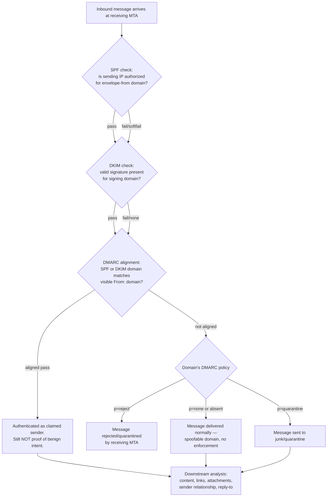
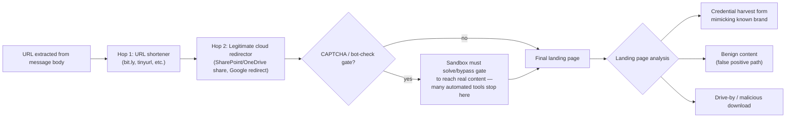
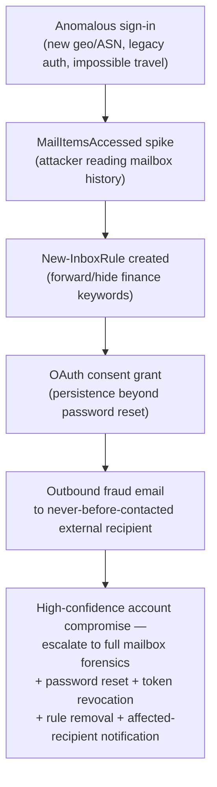

# Part XII — Email Detection Engineering

Email is still the most common initial access vector in enterprise intrusions, and it is also
the noisiest telemetry source most SOCs own. A mid-size org sees tens of thousands of inbound
messages a day; a handful of those are the first move in a ransomware intrusion, a wire-fraud
BEC, or an OAuth token theft that never touches a single endpoint. The job of this part is to
build detections and hunts that separate that handful from the rest without drowning the analyst
queue — and to be honest about where email telemetry lies to you.

Two things make email detection different from host or network detection:

1. **The attacker controls almost every field in the message.** From, Reply-To, Subject,
   Message-ID, even most of the `Received:` chain before it reaches your infrastructure — all of
   it is attacker-supplied and untrustworthy until your own mail system stamps something on top
   of it.
2. **"Normal" is defined per-relationship, not per-organization.** A message from an unfamiliar
   external domain is normal for your sales inbox and highly anomalous for your CFO's inbox if
   that CFO has never corresponded with that domain before. Generic reputation lists get you
   partway; communication-pattern baselining gets you the rest of the way.

## Email Authentication: SPF, DKIM, DMARC — What Each One Actually Proves

[CONCEPT] SPF, DKIM, and DMARC are the three checks that let a receiving mail server decide
whether a message's claimed sending domain is legitimate. They are frequently confused, so it's
worth being precise about what each one covers and — more importantly — what it does *not* cover.

| Mechanism | Validates | Does NOT validate | Common failure mode |
|---|---|---|---|
| **SPF** (Sender Policy Framework) | The sending IP is authorized by the domain in the `5321.MailFrom` (envelope-from / Return-Path) | The visible `From:` header the user sees | Breaks on legitimate mail forwarding (SPF checks the last-hop IP, not the original sender) |
| **DKIM** | The message body/headers were signed by a private key matching a DNS-published public key for the signing domain | That the signing domain matches the visible `From:` domain | Signature survives forwarding if body/headers aren't modified, but many mailing lists/forwarders break it by rewriting Subject or adding footers |
| **DMARC** | That SPF *or* DKIM passed **and** is aligned with the visible `From:` domain (identifier alignment), then applies a policy (`none`/`quarantine`/`reject`) | The intent or content of the message | `p=none` means "report only" — attackers can spoof domains that publish a weak or absent DMARC policy with zero enforcement |

**The critical point for detection engineers:** SPF and DKIM alone can each pass on a phishing
message, because SPF validates the envelope sender (which can be a completely different,
attacker-registered domain) and DKIM validates a signature for whatever domain the attacker owns
and controls DNS for. Only DMARC alignment ties the authenticated identity back to the domain the
user actually sees. A rule that only checks "SPF = fail OR DKIM = fail" catches almost nothing
interesting — most real phishing today passes both SPF and DKIM cleanly because the attacker is
sending from infrastructure they fully control (freemail, compromised legitimate tenants, or a
freshly registered lookalike domain with correctly configured SPF/DKIM/DMARC of its own).



[DETECTION ENGINEER] Pull the raw `Authentication-Results:` header (Microsoft 365) or
`ARC-Authentication-Results:` (if the message passed through an intermediary using Authenticated
Received Chain) and parse `compauth` where available — Microsoft's composite authentication
verdict already folds SPF/DKIM/DMARC plus internal reputation signals into a single pass/fail/soft-fail.
Trust the header your *own* gateway added at the top of the `Received:` chain — anything below
that, an external sender fully controls.

**Engineering Reality:** `Authentication-Results:` headers below the one your own MTA inserted are
just text an attacker can forge to *look* like a passed SPF/DKIM check from some other hop. If
your SIEM parser blindly regexes the first `Authentication-Results` header it finds in the raw
message instead of the one your ingress gateway added, you will happily log a spoofed "pass" as
fact. Always anchor header parsing to a known-trusted hop (your gateway's hostname) and discard
anything above it as attacker-controlled narrative.

## Header Forensics: Message-ID, Received Chain, Reply-To Mismatch

[CONCEPT] Every hop a message takes through mail infrastructure should add a `Received:` header
(in reverse chronological order, newest on top) and the originating client typically stamps a
`Message-ID:`. Neither is authenticated, but both leave patterns worth checking.

**Message-ID** — Format is usually `<random-string@sending-host-or-domain>`. Legitimate mail
clients and MTAs generate this consistently for a given tenant (e.g., Outlook/Exchange Online
Message-IDs commonly reference the sending org's domain or a Microsoft-assigned GUID pattern; a
Gmail-originated message will have a `mail.gmail.com` fragment). A mismatch — visible `From:`
claims to be `finance@bigcorp.com` but the Message-ID domain fragment references a bulk-mail
platform, a PHP mailer script signature, or a completely unrelated free host — is a low-cost,
high-value signal, especially combined with other indicators. It is trivially forgeable by a
competent attacker, so treat it as a soft indicator, not a standalone verdict.

**Received chain** — Read bottom-to-top for the true path. Look for: a mismatch between the HELO
hostname and the connecting IP's reverse DNS, an unexpected number of hops for a domain that
normally sends direct-to-your-gateway, or (in BEC investigations) a hop that shows the message
originated from a residential/VPS IP range rather than the claimed corporate mail infrastructure.

**Reply-To mismatch** — This is one of the highest-signal, lowest-effort checks available and is
under-used. Legitimate business mail almost never sets a `Reply-To:` header that differs from
`From:`. Attackers running BEC/invoice-fraud set `Reply-To:` to an inbox they control so that any
reply — "confirming" the wire transfer — goes straight to them, even though the visible `From:`
still shows the impersonated executive's real (or lookalike) address.

> **Detection: part12-01 — Reply-To / From Domain Mismatch on External Mail**
> **Behaviour detected:** attacker sets a Reply-To address on a different domain than the
> displayed sender, redirecting victim replies.
> **Reliable trace:** `Reply-To:` header present and its domain differs from `From:` domain, on
> mail from an external sender.
> **Evadable:** trivially — attacker can simply not set Reply-To and instead register a lookalike
> domain that receives replies directly. Treat as a contributing signal, not a sole trigger.
> **Legitimate look-alikes:** marketing platforms, ticketing systems, and some CRM/no-reply setups
> intentionally set a different Reply-To (e.g., `noreply@vendor.com` replying to
> `support@vendor-helpdesk.com`). Suppress on a known-vendor allowlist and on internal mail.

```text
# Illustrative Sigma-style detection — validate field names against your mail connector's schema
title: Reply-To Domain Mismatch on External Inbound Mail
id: part12-01
status: experimental
logsource:
  category: email
  product: m365   # or generic mail gateway
detection:
  selection:
    direction: inbound
    sender_domain_is_external: true
  reply_to_present:
    reply_to_header: '*'
  mismatch:
    # pseudo-field: compare registrable domain of Reply-To vs From
    reply_to_domain|not_equals_field: from_domain
  filter_known_vendors:
    from_domain:
      - 'salesforce.com'
      - 'zendesk.com'
      - 'hubspot.com'
  condition: selection and reply_to_present and mismatch and not filter_known_vendors
falsepositives:
  - Marketing/ticketing platforms with legitimate Reply-To routing
  - Shared departmental mailboxes
level: medium
```

**Hunter's Note:** don't hunt "Reply-To mismatch" alone — pivot from it. Once you find a mismatch,
immediately check whether the `From:` display name is a known executive or finance contact and
whether the recipient has ever emailed the Reply-To domain before. A mismatch to a domain the
recipient talks to daily is far less interesting than a mismatch to a domain that appeared in
your tenant for the first time this week.

## Sender & Domain Impersonation

[ANALYST] Impersonation shows up in three overlapping forms, and each needs a different check:

1. **Display-name spoofing** — `From: "Jane Doe (CEO)" <random123@freemail.com>`. The visible
   name is real, the address is not. Cheap for the attacker, catches users who read only the
   display name on mobile mail clients (MITRE ATT&CK **T1036.005**, Masquerading).
2. **Exact domain spoofing** — `From: ceo@yourcompany.com`, only possible/likely to land if your
   own domain's DMARC policy is `none` or absent, or if the attacker is relaying through a
   compromised internal account (in which case this isn't spoofing, it's a real compromised
   sender — see the account-compromise section below).
3. **Lookalike / cousin domain** — `yourcompany-inc.com`, `yourcornpany.com` (homoglyph),
   `yourcompany.co` (TLD swap), or a domain that differs only in a transposed/added character.
   Registered by the attacker specifically for this campaign (MITRE ATT&CK **T1583.001**, Acquire
   Infrastructure: Domains).

[DETECTION ENGINEER] Build a lookalike-domain check against your own primary domain(s) and known
partner/vendor domains using edit-distance (Levenshtein/Damerau) and homoglyph normalization, not
naive substring matching — attackers use Cyrillic/Greek lookalike characters that render
identically in most fonts. Score by: edit distance ≤2 from a protected domain, domain age
(WHOIS/registration date — most lookalike domains are registered days before use), and whether the
domain has ever appeared in your tenant's mail flow before.

> **Detection: part12-02 — Newly Registered Lookalike Domain in Inbound Mail**
> **What it detects:** first-seen sender domain with low edit-distance to a protected brand/partner
> domain, combined with young domain age.
> **Reliable:** domain-age lookup against a WHOIS/passive-DNS feed; edit-distance computation is
> deterministic.
> **Evadable:** attacker can age a domain for months before use (increasingly common for
> high-value BEC), or buy an aged/expired domain with existing reputation — defeats the age check
> but not the edit-distance check.
> **Missing data:** many orgs have no automated WHOIS/passive-DNS enrichment wired into the SIEM;
> this becomes a manual analyst step, which does not scale past a handful of alerts a day.

```kusto
// Illustrative KQL — Microsoft Sentinel / M365 Defender Advanced Hunting
// Flags inbound mail where the sender domain is edit-distance-close to a protected domain
// and was first seen in the tenant within the lookback window.
let ProtectedDomains = dynamic(["contoso.com", "contoso-partners.com"]);
EmailEvents
| where Timestamp > ago(14d)
| where DeliveryLocation != "Failed"
| extend SenderDomain = tostring(split(SenderFromAddress, "@")[1])
| where SenderDomain !in (ProtectedDomains)
| extend FirstSeen = toscalar(
    EmailEvents
    | where SenderDomain == SenderDomain
    | summarize min(Timestamp))
| where FirstSeen > ago(30d)   // domain new to this tenant
| extend EditDistanceHint = strcat("compare_offline: ", SenderDomain)
  // NOTE: KQL has no built-in edit-distance function; compute candidate set
  // offline (Python/pandas against ProtectedDomains) and feed the resulting
  // suspect domain list back in as a watchlist join, e.g.:
| join kind=inner (LookalikeDomainWatchlist) on SenderDomain
| project Timestamp, SenderFromAddress, SenderDomain, RecipientEmailAddress, Subject, FirstSeen
```

The comment in that query is deliberate: KQL has no native fuzzy-string function suited to
domain-lookalike scoring at scale, so the realistic pipeline is an offline job (Python,
`python-Levenshtein` or similar) that maintains a watchlist table of suspect domains, refreshed
daily, which your hunting queries then join against. Don't try to force edit-distance logic into
the SIEM query language itself.

## Business Email Compromise and Mailbox Rule Persistence

[CONCEPT] BEC doesn't need malware. The attacker phishes credentials or an OAuth token, logs into
the real mailbox, and from there runs the fraud (invoice redirection, payroll diversion, wire
transfer approval) using the victim's actual, authenticated identity. Once in, a very common move
is creating a mailbox rule that hides the evidence: auto-delete or auto-forward-and-delete
messages matching keywords like "invoice", "wire", "payment", or auto-forward all mail to an
external address the attacker controls — so the victim never sees replies and the attacker gets a
running feed of the mailbox's mail (MITRE ATT&CK **T1114.003**, Email Forwarding Rule, and
**T1564.008**, Hide Artifacts: Email Hiding Rules).

```mermaid
sequenceDiagram
    participant Attacker
    participant Victim as Victim mailbox (compromised)
    participant M365 as Exchange Online / M365
    participant Target as Finance/Partner contact

    Attacker->>Victim: Phishing / credential harvest or OAuth consent grant
    Attacker->>M365: Authenticate as victim (stolen creds or token)
    Attacker->>M365: New-InboxRule / Set-Mailbox forwarding rule\n(hide/delete "invoice","payment"; forward to external addr)
    M365-->>Attacker: Rule created (logged: New-InboxRule / UpdateInboxRules)
    Target->>Victim: Sends real invoice / payment reply
    M365->>M365: Rule auto-moves/deletes matching mail\nbefore victim sees it
    Attacker->>Target: Sends fraudulent payment-redirect email\nfrom compromised (or spoofed) address
    Note over Victim,Target: Victim never sees the reply that would\nhave exposed the fraud
```

> **Detection: part12-03 — Suspicious Inbox Rule Creation (BEC Persistence)**
> **Behaviour:** new mailbox rule created that forwards to an external recipient and/or
> deletes/moves mail matching finance-relevant keywords.
> **Telemetry:** Microsoft 365 Unified Audit Log operations `New-InboxRule`, `Set-InboxRule`,
> `UpdateInboxRules` (client-side rule changes surfaced via MailItemsAccessed-adjacent operations
> in some tenants); on-prem Exchange equivalents are much sparser and often require enabling
> mailbox audit logging explicitly.
> **Reliable:** the audit event itself, if mailbox auditing is enabled (it is on by default in
> Exchange Online for most tenant configurations since 2019, but *verify* — this has been toggled
> by tenant-level policy changes historically).
> **Evadable:** attacker creates the rule via Outlook Web/desktop client using legitimate,
> authenticated session — nothing about the *mechanism* looks abnormal, only the *content and
> target* of the rule are abnormal.
> **False positives:** users legitimately set up out-of-office forwarding, vacation delegation, or
> forward rules to personal accounts before terminating employment (which is its own investigable
> event, just not necessarily malicious).

```kusto
// Illustrative KQL — hunt for inbox rules with forwarding/deletion of finance-relevant content
CloudAppEvents
| where ActionType in ("New-InboxRule", "Set-InboxRule")
| extend RuleParams = parse_json(RawEventData).Parameters
| extend ForwardTo = tostring(RuleParams.ForwardTo), DeleteMessage = tostring(RuleParams.DeleteMessage)
| where isnotempty(ForwardTo) or DeleteMessage == "True"
| extend Keywords = tostring(RuleParams.SubjectContainsWords)
| where Keywords has_any ("invoice", "payment", "wire", "bank", "w-2", "w2", "urgent")
    or isnotempty(ForwardTo)
| project Timestamp, AccountId, ActionType, ForwardTo, DeleteMessage, Keywords
| sort by Timestamp desc
```

[THREAT HUNTER] Don't wait for the keyword match — hunt every new externally-forwarding inbox
rule created in the last 30 days regardless of keyword content, then cross-reference the
account's sign-in log for impossible-travel or new-device/new-country sign-ins in the preceding 24
hours. Rule creation *following* an anomalous sign-in is a near-certain compromise indicator;
rule creation with no preceding sign-in anomaly is more likely a legitimate user action (or a
sign that the attacker is coming in through a channel your sign-in logging doesn't cover, such as
a legacy protocol or a stolen OAuth refresh token that never triggers interactive sign-in
telemetry — see OAuth section below).

**Detection Autopsy — "Alert on any SPF fail"**

*Original logic:* a junior analyst's first email rule, deployed almost everywhere at some point:
`alert if Authentication-Results contains spf=fail`.

*Why it looked reasonable:* SPF fail sounds like exactly what you want — a message claiming to be
from a domain that isn't actually authorized to send as that domain. Should be spoofing, right?

*What breaks in production:* SPF fails constantly for completely benign reasons. Any mailing
list, ticket system, or forwarding rule that relays mail without rewriting the envelope-from will
fail SPF at your gateway even though DKIM (checking the original signer, which survives relay
better) still passes and DMARC is aligned. In one real deployment this rule generated 400+ alerts
a day in a 3,000-mailbox org, almost entirely internal-to-internal forwards and vendor
distribution lists. The SOC muted the rule within a week.

*False negatives it also has:* an attacker sending from a freshly registered domain with
correctly configured SPF for their own infrastructure passes this check cleanly — SPF fail says
nothing about whether the *sending domain itself* is malicious, only whether the connecting IP is
authorized for whatever domain claims to be sending. Most real phishing today passes SPF because
attackers configure their own infrastructure correctly.

*Missing context:* the rule had no DMARC alignment check, no sender-domain reputation/age lookup,
no recipient-relationship baseline, and no distinction between internal and external mail flow.

*Revised analytic:* fire only on (DMARC = fail or unaligned) AND (external sender) AND (sender
domain is new to this tenant within 30 days OR sender domain edit-distance to a protected brand
domain ≤2) AND NOT (allowlisted forwarder/mailing-list infrastructure). This dropped daily alert
volume from 400+ to roughly 6-10 in the same environment, with a materially higher true-positive
rate on manual triage.

*How it was tested:* replayed a corpus of known-benign forwarded/mailing-list mail plus a set of
red-team-crafted lookalike-domain phishing samples through the revised logic in a non-production
detection pipeline before promoting it; confirmed zero false positives against the benign corpus
and 100% detection against the crafted sample set (small sample, not a statistical guarantee, but
sufficient for a go/no-go tuning decision).

## URL Risk and Redirect Chain Analysis

[CONCEPT] Phishing URLs are rarely the final malicious host in the first hop anymore. Attackers
chain through URL shorteners, legitimate cloud redirectors (SharePoint/OneDrive share links, Google
redirects, marketing-platform click-trackers), and CAPTCHA/human-verification gates specifically
to defeat automated sandboxing and static reputation lookups — a sandbox that doesn't complete a
CAPTCHA never sees the real payload page.

[DETECTION ENGINEER] A URL risk pipeline needs to actually walk the chain, not just reputation-check
the first-hop domain:



Reputation-check every hop's domain independently, flag any hop where the domain is <30 days old,
and flag chains that terminate on a page requesting credentials for a brand that does not match
any hop's domain. Reliable signal: final-landing-page brand mismatch against domain. Evadable:
attacker rotates final-hop infrastructure faster than reputation feeds refresh — this is why
behavioral page analysis (does the page render a login form styled like Microsoft 365 but served
from an unrelated domain) matters as much as domain reputation.

**Engineering Reality:** most SEG/EDR "URL rewriting" (Safe Links, Proofpoint URL Defense, etc.)
rewrites the *displayed* URL to point through the vendor's own scanning redirector. If your
detection logic extracts URLs from message bodies *after* this rewriting has already happened in
your logged copy of the message, you're reputation-checking the vendor's redirector domain, not
the attacker's domain — you have to unwrap the rewrite first, and the unwrap logic is
vendor-specific and breaks silently when the vendor changes their URL format.

## QR-Code Phishing ("Quishing")

[CONCEPT] Embedding the malicious URL as a QR code image rather than clickable text specifically
defeats URL-extraction-based detection: there is no `<a href>` or plain-text URL in the message
body for a text-based scanner to find. The user scans the code with their personal phone — which
is very likely outside your MDM/EDR visibility and outside your corporate network egress
monitoring entirely, making this a deliberate telemetry-blind-spot exploitation technique, not
just a phishing-lure gimmick. Falls under MITRE ATT&CK **T1566.002** (Spearphishing Link), with
the delivery mechanism specifically chosen to evade link-based controls.

> **Detection: part12-04 — Inbound Mail Containing Embedded QR Code Image**
> **Reliable trace:** image attachment or inline image with QR-code structural pattern (finder
> patterns detectable via image processing, not just "has an image").
> **Detection approach:** run inline/attached images through a QR decoder as part of mail pipeline
> processing; if decoded content is a URL, feed that URL into the same redirect-chain/reputation
> pipeline used for plain-text URLs.
> **False positives:** legitimate QR use is widespread now — restaurant menus, event check-ins,
> MFA-enrollment instructions, conference badges scanned and emailed as receipts. Do not
> auto-block on "contains QR code"; use it to *trigger* URL analysis, and only escalate if the
> decoded URL itself scores as risky (new domain, brand mismatch, redirect chain to credential
> harvest).
> **What's missing:** most legacy SEG platforms did not build QR-decode into their pipeline until
> quishing became a headline problem in 2023-2024; check whether your current gateway/EOP/Defender
> tier actually decodes QR content or merely flags "image attachment present" — those are very
> different capability levels and vendors are not always precise about which they ship.

> **[SCREENSHOT PLACEHOLDER — CONTROLLED LAB]** — a QR-phishing sample rendered in a sandboxed mail
> client, showing the decoded URL and its multi-hop redirect chain, captured from a detonation
> sandbox / secure email gateway test tenant (not a production mailbox). Would illustrate: the
> QR image as delivered, the decoded destination URL, and the final credential-harvest landing
> page mimicking a known brand login.

## OAuth Consent Abuse (Illicit Consent Grant)

[CONCEPT] Rather than phishing a password, the attacker phishes *consent*. The victim clicks a
link to an attacker-registered OAuth application requesting permissions like `Mail.Read`,
`Mail.ReadWrite`, or `offline_access`, and clicks "Accept" on what looks like a normal
third-party-app consent screen. No password is stolen, MFA is never prompted (the user is already
authenticated to their own tenant), and the attacker walks away with a refresh token that reads
the victim's mailbox indefinitely, until the grant is revoked (MITRE ATT&CK **T1528**, Steal
Application Access Token).

[ANALYST] This is invisible to almost every detection built around sign-in anomalies, because
there frequently *is no anomalous sign-in* — the victim is sitting at their normal desk on their
normal device, consenting to an app. The signal lives in the **application consent audit log**,
not the sign-in log.

> **Detection: part12-05 — High-Risk OAuth App Consent Grant**
> **Reliable trace:** Azure AD/Entra ID audit log operation `Consent to application`, with
> requested permission scopes including mail, files, or directory read/write, granted to an
> application not on an admin-approved allowlist and/or registered outside the tenant.
> **Evadable:** attacker names the app something innocuous ("Document Viewer", "Meeting Scheduler")
> and uses a legitimate-looking publisher verification bypass or an unverified publisher — Entra
> ID surfaces publisher verification status, use it.
> **Combination signal that raises confidence:** consent event immediately followed by
> `MailItemsAccessed` or `New-InboxRule` operations from the same application's service principal.

```kusto
// Illustrative KQL — Microsoft Sentinel / Entra ID audit logs
AuditLogs
| where OperationName == "Consent to application"
| extend Scopes = tostring(TargetResources[0].modifiedProperties)
| where Scopes has_any ("Mail.Read", "Mail.ReadWrite", "Files.Read", "offline_access")
| extend AppDisplayName = tostring(TargetResources[1].displayName)
| join kind=leftouter (
    AuditLogs
    | where OperationName in ("MailItemsAccessed", "New-InboxRule")
    | project RelatedTimestamp = TimeGenerated, InitiatedBy, OperationName
) on $left.InitiatedBy == $right.InitiatedBy
| where isnotempty(RelatedTimestamp) and RelatedTimestamp between (TimeGenerated .. TimeGenerated + 1h)
| project TimeGenerated, AppDisplayName, Scopes, InitiatedBy, OperationName, RelatedTimestamp
```

**SOC Management View:** OAuth consent abuse is one of the highest-leverage, lowest-cost email
security gaps to close from a governance angle rather than a detection angle — disabling
user-consent for unverified third-party apps (admin-consent-required policy) at the tenant level
prevents the entire technique class rather than trying to detect every variant after the fact.
Detection engineering effort here should go toward *catching consent grants that predate the
policy change or that slip through legacy allowlist exceptions*, not toward trying to out-detect
every new lure. Budget conversation: this is a policy/IAM fix that costs configuration time, not
a SIEM content fix that costs ongoing tuning and alert-fatigue budget — make that tradeoff visible
to leadership rather than defaulting to "write a detection."

## Mass Mail Campaigns and Sender Reputation

[CONCEPT] A single phishing message is a needle. The same lure sent to 200 mailboxes across your
org in an 20-minute window is a haystack you can actually see, because volume and timing
similarity are themselves the signal, independent of content analysis.

[DETECTION ENGINEER] Cluster inbound mail by (near-duplicate subject line, or clustered
attachment hash, or clustered sender-domain-pattern) within a rolling window, and alert on cluster
size crossing a threshold relative to the sender's historical volume to your org. A vendor that
normally sends your org 3 emails a day suddenly sending 150 in an hour is the anomaly, regardless
of content.

```kusto
// Illustrative KQL — cluster inbound mail by near-identical subject + attachment hash
EmailEvents
| where Timestamp > ago(1h)
| where DeliveryLocation != "Failed"
| join kind=inner (EmailAttachmentInfo) on NetworkMessageId
| summarize RecipientCount = dcount(RecipientEmailAddress),
            Recipients = make_set(RecipientEmailAddress, 20)
          by Subject, SHA256, SenderFromAddress
| where RecipientCount >= 15
| project Subject, SHA256, SenderFromAddress, RecipientCount, Recipients
```

**Sender reputation composite:** don't rely on a single third-party reputation feed. Build a
composite score combining external reputation (if licensed), domain age, DMARC alignment history
for that domain over the last 90 days in your own tenant, and volume-to-your-org trend. A domain
that has sent you mail daily for two years with consistent DMARC alignment is fundamentally
different from a domain seen for the first time today, even if both currently show "clean" on an
external feed (feeds lag new infrastructure by design).

## Attachment Risk: Hash and Type Analysis

[ENGINEERING] Hash-matching against known-bad is necessary but structurally limited — it only
ever catches attachments identical to something already seen and submitted somewhere upstream.
File-type analysis catches more of the *technique* space regardless of specific payload:

| Signal | What it catches | Limitation |
|---|---|---|
| SHA-256 hash vs. threat-intel feed | Known malicious files, exact matches | Zero-day/first-seen payloads always miss |
| True file type vs. extension (magic-byte check) | Renamed executables (`.pdf` that's actually a `.exe`/`.hta`), disguised archives | Doesn't catch macro-laden but correctly-typed Office docs |
| Nested/archive extraction depth | Payloads hidden inside password-protected zip/7z to evade scanning | Password itself often delivered in the email body — trivial for a human, hard for automated scanning without the password |
| Macro/OLE object presence in Office docs | Macro-based droppers (MITRE **T1566.001** delivery) | Legitimate business documents use macros too — needs behavior context (macro that spawns a process, writes to disk, or reaches out to network on open) |
| Container format anomalies (e.g., ISO/IMG attachments) | A technique that surged specifically because it bypasses Mark-of-the-Web propagation that `.zip`/direct attachments trigger | High detection value if your org rarely legitimately emails disk-image files — check your own baseline before assuming it's rare |

**Hunter's Note:** if your org has *ever* legitimately emailed an ISO/IMG file for a business
reason, find out who and why before writing a blanket block — but if you can't find a single
legitimate business justification for inbound ISO/IMG attachments in your environment, that's a
near-zero-false-positive block, not just a detection.

## Relationship and Communication-Pattern Analysis

[CONCEPT] The single highest-value context most orgs fail to build: does this sender normally
talk to this recipient? A message from an unfamiliar external domain claiming to be a vendor
invoice is unremarkable to an AP clerk who onboards new vendors weekly, and is a five-alarm signal
to a specific individual who has never once corresponded with anyone at that domain.

[DETECTION ENGINEER] Build a rolling communication graph: for each (sender-domain, recipient)
pair, track first-seen date, message count, and whether prior correspondence included a reply
from the recipient (bidirectional, not just inbound spray). Score new inbound mail against this
graph:

- **No prior correspondence at all** + external domain + finance/executive-titled recipient →
  high suspicion tier.
- **Prior correspondence exists, but always initiated by the recipient (outbound first)**, and
  this message is an unprompted inbound with a payment/urgency theme → moderate suspicion; this
  pattern specifically fits vendor-email-compromise-style BEC where the *real* vendor's account
  was compromised and the fraud rides on a genuine business relationship.
- **Established bidirectional correspondence, consistent volume, consistent DMARC-aligned domain**
  → low suspicion baseline; anomaly threshold should be higher for this tier.

This is also the check that catches the scenario hash/reputation/domain-age analysis structurally
cannot: a *real* vendor whose *real*, aged, well-reputed domain has been compromised and is now
sending fraudulent payment-redirect instructions through a completely legitimate, DMARC-aligned
channel. Content and behavior-pattern analysis (sudden banking-detail-change request, urgency
language, request to move future correspondence off the normal channel) is the only layer left
once authentication and reputation both pass cleanly.

## Internal Account Compromise Indicators

Pulling the threads above together, the combination that should escalate an internal mailbox
compromise investigation from "maybe" to "high confidence":

1. Anomalous sign-in (new country/ASN, impossible travel, or legacy-auth protocol usage bypassing
   MFA) in Azure AD/Entra sign-in logs, **followed within hours by**
2. A new mailbox rule (`New-InboxRule`) with forwarding or hide/delete behavior, **and/or**
3. An OAuth app consent grant to an unfamiliar application, **and/or**
4. Outbound mail from that mailbox to external recipients the account has never contacted before,
   containing payment-redirect or credential-harvest content, **and**
5. `MailItemsAccessed` activity volume spiking against that mailbox's own historical baseline
   (an attacker reading the full mailbox to study prior invoice threads before crafting a
   convincing fraud reply).



> **[SCREENSHOT PLACEHOLDER — CONTROLLED LAB]** — Microsoft 365 Defender / Entra ID sign-in log
> and Unified Audit Log entries for a simulated compromised-mailbox scenario in a test tenant,
> showing the `New-InboxRule` operation detail pane with forwarding parameters and the timestamp
> correlation against a preceding anomalous sign-in event. Would illustrate the exact audit
> log fields (`Operation`, `Parameters.ForwardTo`, `ClientIP`, `UserId`) an analyst pivots on.

## Building and Testing These Detections

[MANAGEMENT] Before promoting any email detection out of a tuning environment, confirm you can
answer these for each rule:

- What is the expected daily/weekly alert volume in this tenant's actual traffic, measured against
  30-90 days of historical data, not a guess?
- What is the analyst effort per alert (time to triage), and does volume × effort fit inside
  existing SOC capacity, or does it require hiring/reallocation to sustain?
- Which of the underlying signals (SPF/DKIM/DMARC, domain age, edit-distance, communication graph,
  OAuth scope risk) are you currently missing due to licensing tier or unconfigured logging
  (mailbox audit logging, admin-consent-required policy), and what is the cost/timeline to close
  each gap?

[DETECTION ENGINEER] For testing, replay known-benign traffic (your own mailing lists, vendor
distribution mail, internal forwards) alongside a red-team-crafted or purchased phishing-simulation
sample set through the detection logic in a non-production path before promotion — the Detection
Autopsy above is a direct illustration of why skipping this step produces either an unusable flood
of false positives or a rule quietly muted within a week of deployment.

## Summary Table: Signal Reliability

| Signal | Reliability | Attacker evasion cost | Best combined with |
|---|---|---|---|
| SPF pass/fail alone | Low | Trivial (attacker controls own SPF) | DMARC alignment |
| DKIM pass/fail alone | Low-medium | Low-medium (attacker signs with own key) | DMARC alignment |
| DMARC alignment | Medium-high | Medium (needs a domain with weak/no DMARC to spoof) | Domain age, comms graph |
| Reply-To mismatch | Medium | Trivial to avoid (just don't set it) | From-display-name check |
| Lookalike domain edit-distance | Medium-high | Medium (aged domains defeat age-check, not edit-distance) | Domain age |
| Mailbox rule creation (forward/hide) | High once found | Low visibility cost to attacker, but detectable if audit logging enabled | Preceding sign-in anomaly |
| OAuth consent grant scope | High | Medium (publisher verification bypass, disguised app name) | Post-consent mailbox activity |
| Communication-graph anomaly | High, hardest to evade | High (requires compromising an actual trusted relationship) | Content/urgency-language analysis |
| Attachment hash match | High confidence, low coverage | Trivial (any new payload misses) | Type/behavior analysis |

## References

- MITRE ATT&CK: T1566 (Phishing) and sub-techniques T1566.001, T1566.002, T1566.003; T1114.003
  (Email Collection: Email Forwarding Rule); T1564.008 (Hide Artifacts: Email Hiding Rules);
  T1528 (Steal Application Access Token); T1583.001 (Acquire Infrastructure: Domains); T1036.005
  (Masquerading: Match Legitimate Name or Location)
- Microsoft Learn — documentation on how Exchange Online evaluates SPF, DKIM, and DMARC, and on
  composite authentication (`compauth`) header values
- NIST Special Publication 800-177 (Trustworthy Email) — baseline reference for SPF/DKIM/DMARC
  design intent and deployment guidance
- CISA — published advisories on Business Email Compromise trends and mitigations
