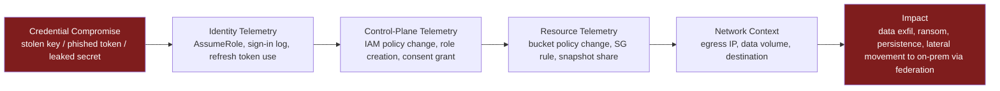
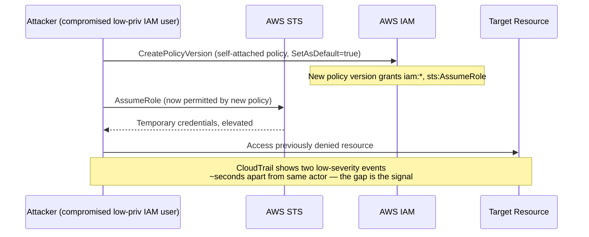
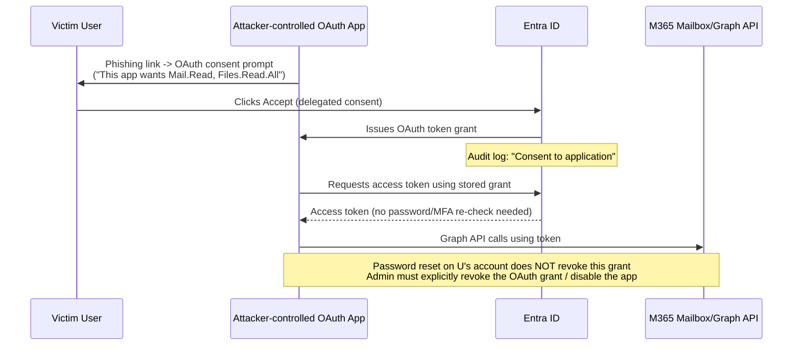

# Part XIII — Cloud Detection Engineering

Cloud detection engineering is not "SIEM detection engineering but with a different log format."
The control plane is the attack surface. In an on-prem estate, an attacker needs code execution
before they can do much damage. In AWS, Azure, or GCP, a stolen access key or a manipulated OAuth
consent grant *is* code execution — against the API that controls every resource in the account.
This part works through the control-plane patterns that show up across incident reports year after
year: privilege escalation via IAM, logging tampering, exposed storage, mass data movement, and
identity abuse in Entra ID / M365. The goal is not "here is the event name," it's "here is what
this event means, what normal looks like next to it, and where it breaks."

## 13.1 The Four Telemetry Planes

Before the individual patterns, it helps to fix vocabulary, because cloud vendors don't use it
consistently and vendor docs blur the lines.

- **Control-plane telemetry** — API calls against the cloud provider's own management surface:
  CloudTrail (AWS), Azure Activity Log / Azure Resource Manager (ARM) operations, GCP Cloud Audit
  Logs (Admin Activity). This is "who called what API, on what resource, from where."
- **Identity telemetry** — authentication and authorization events: AWS IAM/STS/SSO events
  (`ConsoleLogin`, `AssumeRole`, `GetSessionToken`), Entra ID Sign-in logs and Audit logs, GCP
  Cloud Identity / Workspace login events. This is "who authenticated, how, with what factor, from
  where, and what token did they get."
- **Resource telemetry** — the data plane and configuration state of the resource itself: S3
  server access logs / S3 data events, Azure Storage diagnostic logs, VPC Flow Logs / NSG flow
  logs, GCS data access logs, database audit logs. This is "what actually happened to the data or
  the workload."
- **Network context** — source IP, ASN, geolocation, VPN/Tor/anonymizer indicators, and — critically
  — whether the source is a known corporate egress range, a cloud provider's own IP space (Lambda,
  Azure Functions, GCP Cloud Build), or an unattributed residential/hosting IP.

[CONCEPT] Almost every serious cloud incident is visible in control-plane + identity telemetry
*before* it is visible in resource telemetry. By the time S3 access logs show the exfil, CloudTrail
already showed the `AssumeRole` and the `PutBucketPolicy` that made it possible. Detection
engineering effort in cloud pays off disproportionately on control-plane and identity logs, not on
trying to inspect every data-plane byte.



**Engineering Reality**: every one of these logging sources can be silently incomplete and nothing
in the console tells you that by default. CloudTrail has to be explicitly configured to log S3
*data events* (GetObject/PutObject) — the default trail only covers management events. Azure
Storage diagnostic logging is off by default per storage account. GCP Data Access audit logs for
BigQuery/Storage are off by default and, for some services, cannot be enabled without a support
request. If you haven't verified data-event logging is turned on for the specific resource types
you care about, assume you have a control-plane view and a blind data plane.

## 13.2 Root / Global Admin Login

[CONCEPT] AWS root, Azure/Entra Global Administrator, and GCP org-level Owner are the accounts
that can undo any other security control, including MFA enforcement, conditional access, and
logging itself. They should almost never be used for daily work.

| Cloud | Identity | Typical event | Notes |
|---|---|---|---|
| AWS | Root user | CloudTrail `ConsoleLogin` / `GetSessionToken` with `userIdentity.type = Root` | Root shouldn't have active access keys at all in a mature account |
| Azure/Entra | Global Administrator | Entra sign-in log, `userPrincipalName` mapped to a Global Admin role assignment | Role is now assignable via PIM (Privileged Identity Management) — check for *activation* events too |
| GCP | Organization Owner / super admin | Cloud Identity login event + Admin Audit log for the action taken | Google Workspace super admin is a *separate* privilege plane from GCP IAM — don't conflate them |

[DETECTION ENGINEER] The reliable signal isn't "root logged in" alone (some orgs still do this for
account recovery or billing) — it's root/global-admin login **combined with** any of: no prior
login from that identity in N days, login from a new country/ASN, login without MFA satisfied, or
a sensitive action taken within the same session (IAM change, logging change, billing change).

```
# CONCEPTUAL SAMPLE — Sigma-style detection, AWS root login, illustrative only
title: AWS Root Account Console Login
id: part13-01
status: experimental
logsource:
  product: aws
  service: cloudtrail
detection:
  selection:
    eventName: ConsoleLogin
    userIdentity.type: Root
    responseElements.ConsoleLogin: Success
  filter_known_break_glass:
    userIdentity.accountId: '<break-glass-exempt-account-ids>'
  condition: selection and not filter_known_break_glass
level: high
tags:
  - attack.privilege_escalation
  - attack.t1078.004
```

**Cloud-specific false positives**: break-glass procedures that legitimately use root for account
recovery after Global Admin lockout; AWS Organizations root actions performed by automation for
account creation in some legacy setups (should be migrated off root, but audit before you assume);
billing/tax console access that historically required root in older AWS accounts.

[THREAT HUNTER] Hunt for **Global Admin role activation** in Entra PIM without a corresponding
ticket/justification field populated, and for activations that happen outside business hours for
that admin's normal pattern. Also hunt for **emergency access accounts** ("break-glass" accounts)
being used for anything other than the documented emergency scenario — these accounts are usually
excluded from Conditional Access and MFA by design, which makes them a prime target if their
credentials leak.

## 13.3 New Credential / Access Key / Secret Creation

[CONCEPT] Every cloud provider lets an identity mint new ways to authenticate as itself or as
another identity: AWS `CreateAccessKey` / `CreateLoginProfile`, Azure/Entra "add credential to
application" or "add secret to service principal," GCP `google.iam.admin.v1.CreateServiceAccountKey`.
This is one of the highest-value control-plane signals in the entire cloud stack because attackers
use it for **persistence that survives password resets and even MFA re-enrollment** — a new access
key or client secret is a completely separate credential from the human's password.

| Cloud | Event | What it grants |
|---|---|---|
| AWS | `CreateAccessKey`, `CreateLoginProfile`, `UpdateLoginProfile` | Programmatic key pair or console password for an IAM user |
| Azure/Entra | `Add service principal credentials`, `Update application – Certificates and secrets` | Client secret or certificate an attacker can use to authenticate as the app/service principal, bypassing user MFA entirely |
| GCP | `CreateServiceAccountKey` | Long-lived JSON key for a service account — no expiry unless organization policy enforces it |

**Detection Autopsy — "Alert on CreateAccessKey"**

*Original logic*: fire an alert any time `CreateAccessKey` appears in CloudTrail.

*Why it looked reasonable*: it's the single event most tied to real incidents in AWS breach
write-ups — it's how an attacker who compromised one IAM user pivots to a durable key.

*What breaks in production*: CI/CD pipelines, Terraform runs, and onboarding automation call
`CreateAccessKey` constantly for legitimate service accounts. In a mid-size AWS estate this fires
dozens to hundreds of times a day. Analysts stop reading it inside a week.

*False positives*: automated user provisioning (Okta/SCIM syncing into AWS IAM), key rotation jobs
that intentionally create-then-delete on a schedule, infra-as-code pipelines that manage IAM users
as code and re-apply on every merge.

*False negatives*: the naive version says nothing about **who created the key** relative to that
identity's normal behavior, and nothing about **what happened right after** — which is where the
actual risk lives. It also completely misses the Azure/GCP equivalents if the rule is AWS-only,
even though the same attacker technique (mint a durable secret) applies identically there.

*Missing context*: identity of the creator vs. identity of the key's owner (self-service key
creation is far more suspicious than an admin provisioning a new service account), whether the
creating principal is a known automation role, and whether the new key was used within minutes of
creation from an unfamiliar network location.

*Revised analytic*:

```
# CONCEPTUAL SAMPLE — Sigma-style detection, illustrative only
title: IAM Access Key Created by Non-Automation Principal Followed by First Use From New Location
id: part13-02
status: experimental
logsource:
  product: aws
  service: cloudtrail
detection:
  key_created:
    eventName: CreateAccessKey
  not_automation:
    userIdentity.arn|contains|all:
      - 'iam::'
    userIdentity.arn|contains:
      - 'terraform'
      - 'ci-cd'
      - 'automation'
  condition: key_created and not not_automation
correlation:
  # Second-stage: within 30 minutes, a call authenticated with the new
  # AccessKeyId originates from an ASN/geo not seen for that account in 30 days.
  window: 30m
  join_field: responseElements.accessKey.accessKeyId
level: high
tags:
  - attack.persistence
  - attack.t1098.001
```

*How it was tested*: replayed against a sample CloudTrail set with a known Terraform-managed IAM
user pool (to confirm the exclusion suppresses expected noise) and against a simulated
key-creation-then-use-from-new-ASN sequence built with a local test harness (not against any live
account).

*Result*: alert volume for the standalone `CreateAccessKey` rule dropped from noise-level to a
handful of true candidates per week in the test dataset; the correlated version surfaces the
create+use pattern that actually matters, at the cost of requiring a stateful correlation engine
or a short lookback join, which not every SIEM tier supports cheaply.

[ENGINEERING] The correlation window matters more than people think. Attackers scripting this
pattern often use the new key within seconds. Legitimate provisioning tools (SCIM, Terraform,
config-management) also frequently use a key immediately after creating it — so "used quickly"
alone is not the discriminator. "Used quickly **from a network location never associated with that
account/automation role before**" is the discriminator, and that requires you to actually maintain
a rolling baseline of source ASNs per principal, not just per human user.

## 13.4 Privilege / Role Changes and IAM Policy Modification

[CONCEPT] This covers attaching a more permissive policy to an existing identity, adding a user to
a privileged group, creating a new role with broad trust relationships, or modifying an existing
role's trust policy so an external account can assume it.

Key AWS events: `AttachUserPolicy`, `AttachRolePolicy`, `PutUserPolicy`, `PutRolePolicy`,
`CreatePolicyVersion` (attackers sometimes create a new policy *version* rather than attach a new
policy, which evades detections that only watch for `Attach*`), `UpdateAssumeRolePolicy` (widens
who can assume a role — this is the one that lets an external AWS account assume into yours).

Key Entra events: role assignment additions (`Add member to role`), especially to Global
Administrator, Privileged Role Administrator, or Application Administrator (the latter is a
frequent escalation path because an Application Administrator can add credentials to *any* app
registration, including ones with high-privilege API permissions already granted).

Key GCP events: `SetIamPolicy` at the project or org level — GCP's IAM model concentrates almost
everything into this single audited call, which is good for coverage but means you must parse the
policy diff, not just the event name, to know what actually changed.

[DETECTION ENGINEER] Watch specifically for privilege escalation **chains** that are individually
low-severity but dangerous in combination — this is one of the best-documented AWS attack classes
(cf. published research on AWS IAM privilege escalation paths, e.g. via `iam:PassRole` +
`lambda:CreateFunction`, or `iam:CreatePolicyVersion` on a policy the attacker can already touch).
A single `CreatePolicyVersion` call is not alertable on its own at scale. `CreatePolicyVersion`
on a policy attached to a highly-privileged role, by a principal that did not create that policy
originally, is.



**Cloud-specific false positives**: break-fix by platform teams who legitimately widen a role's
trust policy for a new cross-account integration (e.g., adding a security vendor's AWS account ID
to a role trust policy for a SaaS security tool); Terraform/Pulumi state reconciliation reapplying
policy versions on every pipeline run even when the policy content is unchanged (`CreatePolicyVersion`
fires regardless); Entra PIM-eligible role activations that are legitimate but look identical in
the audit log to a permanent assignment unless you check the `activationType` / duration field.

[THREAT HUNTER] Query for policy documents (not just event names) that contain wildcard actions
(`"Action": "*"`) or wildcard resources (`"Resource": "*"`) created outside of your known
IaC-managed policy set. Most orgs can enumerate "policies we manage in Terraform" — anything with
broad permissions that didn't come through that pipeline is worth a look regardless of who created
it.

## 13.5 MFA Changes

[CONCEPT] Disabling MFA, registering a new MFA method (especially a phone number or authenticator
app under attacker control), or downgrading a Conditional Access policy that previously required
MFA are all classic **account-takeover consolidation** steps — the attacker already has the
password and is removing the thing that would otherwise force a second factor on their next
login.

Entra ID / M365 signals: `Add registered security info` in the Entra audit log (registering a new
MFA method), `Disable Strong Authentication` (legacy but still seen), Conditional Access policy
edits that remove MFA requirements or add a new "trusted" IP range, and `User registered security
info` events happening from a location or device inconsistent with the user's normal pattern.

AWS signals: IAM MFA device deactivation (`DeactivateMFADevice`), console sign-in policy changes.
GCP/Workspace: 2-Step Verification enrollment or exemption changes at the org unit level (a much
bigger blast radius — org-unit-level changes affect every user under that OU).

[ANALYST] The single most useful correlation here is **new MFA method registered, followed by
sign-in from a new device using that method, followed by removal of the user's *original* MFA
method**. That three-step sequence — register, use, remove-the-old-one — is very hard to explain
as anything other than an attacker locking the real user out while keeping their own access.

**Hunter's Note**: don't just alert on "MFA method added." Baseline the *time between* account
creation/last method change and this new registration. Legitimate users register a new phone
maybe once every year or two, usually right after buying a new phone (which itself often shows up
as a new device ID in the sign-in log around the same time, for an innocent reason). An MFA method
added minutes after a suspicious sign-in, from a different device fingerprint than the one that
just signed in successfully, is a very different animal from a user upgrading their phone.

## 13.6 Logging Disabled — CloudTrail Stop/Delete, Diagnostic Settings Removal

[CONCEPT] This is the attacker turning off the camera. It is one of the few control-plane actions
that is *almost never* legitimate outside of a documented maintenance window, which makes it one of
the highest-confidence, lowest-noise detections available in cloud — provided you're actually
ingesting the logs from a source that survives the trail being stopped.

| Cloud | Event | Effect |
|---|---|---|
| AWS | `StopLogging`, `DeleteTrail`, `UpdateTrail` (narrowing scope), `PutEventSelectors` (removing data events) | Stops or narrows CloudTrail recording |
| Azure | Deletion or modification of a Diagnostic Setting; disabling Azure Activity Log export | Stops forwarding of Activity Log / resource logs to Log Analytics / storage / Event Hub |
| GCP | `google.logging.v2.ConfigServiceV2.UpdateSink` (disable/delete a log sink), removing IAM bindings that let Cloud Audit Logs export | Stops log export from the project |
| Entra/M365 | Disabling **Unified Audit Log** for the tenant, or changing mailbox audit settings | Loses M365 activity visibility — a well-known step in Business Email Compromise cleanup |

**Engineering Reality**: `StopLogging` only stops that *specific trail*. If you rely on it as your
sole detection, verify (a) it fires for every trail in every region, not just the one your SIEM
happens to be ingesting, and (b) your alerting pipeline for this event does not itself depend on
CloudTrail delivery through the same trail an attacker could stop — route this specific alert
through a path that doesn't have a single point of failure (e.g., CloudWatch Events/EventBridge
rule triggered directly off the API call, independent of trail delivery lag, plus a separate
periodic "is logging still enabled" configuration check that doesn't depend on the trail at all).

```
# CONCEPTUAL SAMPLE — KQL, illustrative only, for Azure Sentinel / Log Analytics
AzureActivity
| where OperationNameValue in (
    "MICROSOFT.INSIGHTS/DIAGNOSTICSETTINGS/DELETE",
    "MICROSOFT.INSIGHTS/DIAGNOSTICSETTINGS/WRITE")
| where ActivityStatusValue == "Success"
| extend Caller = tostring(Caller)
| where Caller !in (KnownAutomationServicePrincipals)
| project TimeGenerated, Caller, ResourceId, OperationNameValue, CallerIpAddress
```

**Cloud-specific false positives**: legitimate log pipeline migrations (moving from one Diagnostic
Setting/sink to another as part of a platform change — this looks like delete+create in quick
succession); cost-optimization work deliberately narrowing which resource types get logged; GCP
projects being decommissioned where a sink deletion is part of normal teardown. The mitigation for
all three is the same: require a change ticket reference or a maintenance-window tag before
suppressing, never a blanket exclusion by identity, because the same automation identity that does
legitimate log pipeline work is exactly the identity an attacker would try to impersonate or reuse.

[MITRE] This maps most directly to **T1562.008 – Impair Defenses: Disable Cloud Logs**, with
`DeactivateMFADevice`/Conditional Access weakening mapping to **T1556 – Modify Authentication
Process** and **T1621 – Multi-Factor Authentication Request Generation** adjacent techniques for
the fatigue-style variant.

## 13.7 Security Group / NSG / Firewall Rule Opened to the World

[CONCEPT] A security group (AWS), network security group (Azure), or firewall rule (GCP) that
allows `0.0.0.0/0` (or `::/0`) inbound on a sensitive port — SSH (22), RDP (3389), database ports
(3306, 5432, 1433, 27017), or management ports — is one of the fastest paths from "internal
misconfiguration" to "internet-wide compromise." Shodan-style scanning finds these within hours.

**Resource telemetry** for this is the security group/rule configuration itself and VPC Flow Logs
/ NSG flow logs showing the actual traffic that results. **Control-plane telemetry** is the API
call that made the change (`AuthorizeSecurityGroupIngress`, `CreateNetworkSecurityRule` /
`UpdateNetworkSecurityRule`, `compute.firewalls.insert`/`patch`).

```
# CONCEPTUAL SAMPLE — Sigma-style detection, illustrative only
title: Security Group Rule Opened to 0.0.0.0/0 on Sensitive Port
id: part13-03
status: experimental
logsource:
  product: aws
  service: cloudtrail
detection:
  selection:
    eventName: AuthorizeSecurityGroupIngress
    requestParameters.ipPermissions.items.ipRanges.items.cidrIp: '0.0.0.0/0'
    requestParameters.ipPermissions.items.fromPort:
      - 22
      - 3389
      - 3306
      - 5432
      - 1433
      - 27017
      - 6379
  condition: selection
level: high
tags:
  - attack.initial_access
  - attack.t1190
```

[DETECTION ENGINEER] Pair this with the flow-log confirmation: the config change tells you exposure
*exists*, flow logs tell you whether it's actually being *hit* from outside your known ranges. A
rule opened to the world that gets zero inbound connections in the following hour is still a
finding (fix it), but a rule opened to the world that immediately starts receiving connections from
dozens of distinct ASNs is an active-exploitation-risk finding — escalate differently.

**Cloud-specific false positives**: load balancers and CDN edge nodes legitimately need `0.0.0.0/0`
on 80/443 — the detection should scope to sensitive/management ports, not "any 0.0.0.0/0 rule."
Bastion/jump-box patterns sometimes intentionally allow 22/3389 from `0.0.0.0/0` behind a
compensating control (e.g., AWS Instance Connect, Azure Bastion, a WAF in front) — these need a
documented exception list, not a permanent suppression, because exception lists rot: the
compensating control gets removed later and the "known exception" rule silently stops being true.

[THREAT HUNTER] Periodically diff the *current* security group/NSG/firewall rule set against last
week's, independent of whether a change alert fired — this catches rules that were created and
then later widened by a second, separate change that individually looked benign (e.g., first
rule scoped to a /24, later "temporarily" widened to /0 and never narrowed back).

## 13.8 Public Storage Bucket / Blob / GCS Exposure

[CONCEPT] The single most common cause of large-scale cloud data breaches in postmortems remains
misconfigured object storage — S3 buckets, Azure Blob containers, GCS buckets — made readable (or
listable) by anyone on the internet, sometimes deliberately for a specific file and sometimes as
an accidental blast-radius mistake (bucket-level policy applied when only one object should have
been public).

| Cloud | Control-plane signal | Resource-level signal |
|---|---|---|
| AWS S3 | `PutBucketPolicy`, `PutBucketAcl`, `PutPublicAccessBlock` (disabling it) | S3 server access logs showing anonymous `GetObject` (`requester = anonymous`); AWS Config / Access Analyzer findings |
| Azure Blob | Storage account "Allow Blob public access" toggle, container-level access-level change to Blob/Container | Storage diagnostic logs showing anonymous reads |
| GCS | `storage.setIamPolicy` adding `allUsers`/`allAuthenticatedUsers` | GCS Data Access logs showing unauthenticated reads |

**Detection Autopsy** would repeat the same shape as 13.3 here, so the short version: don't just
alert on the policy change event — resolve the actual resulting effective permission (a policy
*attach* that grants public read to `allUsers` at the bucket level is very different from one scoped
to a single prefix for a legitimate public-download use case, e.g. software release artifacts).
Cloud-native posture tools (AWS Access Analyzer for S3, Azure Defender for Storage,
GCP Security Command Center) compute this effective-permission resolution for you — use them as an
enrichment source rather than re-implementing bucket policy evaluation logic in your SIEM.

**Cloud-specific false positives**: static website hosting buckets and public software/package
distribution buckets are *supposed* to be public — maintain an explicit allow-list of these by
bucket name/tag, reviewed on a schedule, rather than suppressing by "looks like a website bucket"
heuristics.

> **[SCREENSHOT PLACEHOLDER — CONTROLLED LAB]** — AWS S3 server access log entries showing an
> anonymous `REST.GET.OBJECT` request against a bucket after a `PutBucketAcl` grant to
> `AllUsers`, captured from a lab AWS account with S3 access logging and a deliberately
> misconfigured test bucket (no production or real customer data involved), illustrating the
> `requester`, `operation`, and `httpstatus` fields that distinguish anonymous access from
> authenticated access.

## 13.9 Mass Data Download / Cloud Storage Exfiltration

[CONCEPT] Volume-based exfil detection in cloud is genuinely harder than on-prem DLP because
"downloading a lot of data from storage" is also exactly what backup jobs, data pipeline ETL, BI
tools, and legitimate bulk exports do, constantly, by design.

[DETECTION ENGINEER] Baseline per-identity, per-day data-plane read volume (bytes and object
count) from S3/Blob/GCS, not a single global threshold. A threshold that's reasonable for a
5-person startup's S3 bucket will never fire in an enterprise data lake, and a threshold sized for
the data lake will never fire for the 5-person startup's actual exfil. Alert on **deviation from
that identity's own baseline**, combined with at least one of: unfamiliar source
IP/ASN/region for that identity, use of temporary/STS credentials assumed minutes earlier, or
access to buckets/prefixes that identity has never touched before.

```
# CONCEPTUAL SAMPLE — Sigma-style detection, illustrative only
title: Anomalous Volume of S3 GetObject Calls by Single Principal
id: part13-04
status: experimental
logsource:
  product: aws
  service: cloudtrail
  definition: 'Requires S3 data event logging enabled on the trail'
detection:
  selection:
    eventName: GetObject
  timeframe: 1h
  condition: selection | count() by userIdentity.arn > baseline_p99_for_arn
level: medium
tags:
  - attack.exfiltration
  - attack.t1530
```

**Engineering Reality**: this rule is unimplementable as literally written in most SIEMs without a
UEBA-style baselining component or a scheduled analytics job that computes and stores per-identity
percentiles — a naive static-threshold version of "count() > N" is what most teams ship first, and
it is either too noisy or too blind depending on which population it's tuned for. Be explicit in
your detection documentation about which version you actually deployed.

[THREAT HUNTER] Hunt for **cross-region replication or `CopyObject`/`sync`-style calls targeting a
bucket outside your organization's AWS account/org** — this is a quieter exfil path than direct
`GetObject` downloads because the data never has to leave AWS's network to a residential IP; it
just moves to a bucket the attacker controls in a different account, which can look like ordinary
inter-account data-sharing traffic if you're not checking destination account ownership.

**Cloud-specific false positives**: scheduled backup/DR replication jobs, BI tool nightly refreshes,
data warehouse ETL, and — this one catches teams out — **multi-region legitimate access** by a
global user base or a follow-the-sun ops team, where the same human identity genuinely
authenticates from multiple continents within a day. Don't treat "impossible travel" as automatic
truth for identities you know are geographically distributed (traveling engineers, global SRE
rotations); tune impossible-travel logic per identity class, not as one org-wide rule.

## 13.10 Instance / Resource Enumeration

[CONCEPT] Before doing anything destructive, an attacker with a foothold typically runs
discovery: `DescribeInstances`, `ListBuckets`, `GetCallerIdentity`, `ListUsers`, `ListRoles`,
Azure `Microsoft.Resources/subscriptions/resourceGroups/read` sweeps, GCP `compute.instances.list`
/ `resourcemanager.projects.get`. This maps to **T1580 – Cloud Infrastructure Discovery** and
**T1526 – Cloud Service Discovery**.

[ENGINEERING] The hard truth here: discovery API calls are also exactly what every cloud security
posture tool, every cost-management tool, every asset-inventory scanner, and every Terraform
`plan` does, continuously, at massive volume. Raw discovery-call detection is close to useless as
a standalone signal in most environments — the signal-to-noise ratio is poor enough that it
usually belongs in a hunt query or an enrichment pivot ("what did this already-suspicious identity
enumerate right before the suspicious action") rather than a standing alert.

**SOC Management View**: resist pressure to "just alert on `DescribeInstances` from new IPs" as a
quick win. It will generate an alert queue nobody triages after the second week, which is worse
than not having the detection at all, because it trains analysts to ignore that alert category —
including the rare time it's genuinely the first sign of an intrusion. Spend the engineering
budget on the correlation (discovery → privilege change → data access chain) instead of the
single-event alert.

## 13.11 Cloud Shell Usage

[CONCEPT] AWS CloudShell, Azure Cloud Shell, and GCP Cloud Shell give an authenticated user a
browser-based Linux shell with the cloud CLI pre-authenticated as them, running from the cloud
provider's own IP space. This is valuable to attackers for two reasons: it evades network egress
controls (traffic to the outside world originates from the provider's IP, not the compromised
identity's usual network context), and it provides a scriptable shell without needing to compromise
an actual endpoint.

[ANALYST] Cloud Shell usage is rare-to-nonexistent for most business users and routine for
platform/cloud engineering teams. The detection value is almost entirely in **who** is using it,
not that it's being used at all: a marketing department service account or a user who has never
touched the CLI showing a Cloud Shell session is a strong anomaly; a member of the platform team
using it daily is not.

**Cloud-specific false positive**: incident responders and cloud administrators legitimately use
Cloud Shell *during* an investigation or remediation — make sure your own IR runbook usage doesn't
train the detection to suppress the exact tool your attacker-hunters are using.

AWS CloudTrail records CloudShell session creation (`CreateSession`/environment events under the
`cloudshell.amazonaws.com` event source); Azure records Cloud Shell start in the Activity Log tied
to the storage account it mounts (Cloud Shell persists a filesystem in an Azure Files share you
should also be monitoring for unusual file activity); GCP Cloud Shell activity surfaces in Cloud
Audit Logs under the Cloud Shell API.

## 13.12 Service Principal / App Registration Abuse and OAuth Consent Abuse

This is the pattern most specific to Azure/Entra/M365 and worth walking through as the fully worked
example for this chapter, because it combines almost every plane discussed above and is
under-covered relative to how often it shows up in real M365 business-email-compromise and
supply-chain incidents.

[CONCEPT] An **app registration** in Entra ID is a definition of an application; a **service
principal** is that application's identity within a specific tenant, with its own permissions. An
attacker (or a malicious/compromised third-party app) can request **OAuth consent** from a user —
"this app would like to read your mail, files, and calendar" — and if the user (or, worse, an
admin, via **admin consent**) clicks accept, the attacker's app now has a durable OAuth token grant
that survives password resets and, depending on the permission scope, sometimes survives MFA
re-enrollment too, because the grant is to the *application*, not tied to re-proving the user's
credential on every access.

This is the well-documented **illicit consent grant attack** pattern (covered in Microsoft's own
incident response guidance) and is exactly how several publicized M365 compromises persisted
access after the victim organization thought they'd remediated by resetting passwords.

[DETECTION ENGINEER] Signals to combine, from Entra/M365 Unified Audit Log and Entra sign-in logs:

1. **New app registration or service principal created** by a non-admin, non-automation identity
   (`Add application`, `Add service principal`).
2. **New OAuth permission grant / consent event** (`Consent to application`), especially where
   the requested scope includes `Mail.Read`, `Files.ReadWrite.All`, `Directory.Read.All`, or any
   `*.All`-suffixed application permission (application permissions, not delegated, mean the app
   acts with that scope regardless of which user is "using" it — this is the dangerous half).
3. **Admin consent granted** (`Consent to application` with `ConsentType = AllPrincipals`) —
   this single event can expose the whole tenant to that app, not just one user, and should always
   be treated as a high-severity event requiring a documented business justification.
4. **New client secret or certificate added** to that service principal shortly after registration
   (see 13.3) — this is how the attacker gets a durable, MFA-independent credential to use the
   granted consent programmatically going forward.
5. **First API call using that service principal's credential**, and from where.



**Illustrative KQL hunt** against Entra/M365 Unified Audit Log data (field names as commonly seen
in Sentinel's `AuditLogs`/`OfficeActivity` tables — verify exact schema against your tenant before
deploying):

```
// CONCEPTUAL SAMPLE — KQL, illustrative only
AuditLogs
| where OperationName in ("Consent to application", "Add app role assignment to service principal")
| extend Scopes = tostring(TargetResources[0].modifiedProperties)
| where Scopes has_any ("Mail.Read", "Files.ReadWrite.All", "Directory.Read.All", ".All")
| extend GrantedBy = tostring(InitiatedBy.user.userPrincipalName)
| project TimeGenerated, OperationName, GrantedBy, Scopes, Result
| order by TimeGenerated desc
```

**Named hunt — part13-h01: Stale or Unused App Registrations with Broad Grants**. Enumerate all
service principals with application-permission grants including `*.All` scopes, join against sign-in
logs to find ones with **no successful sign-in/token use in the last 90 days**, and flag any that
also have a client secret expiring far in the future (multi-year secrets are themselves a smell —
legitimate rotation practice keeps these short). Dormant-but-privileged app registrations are a
common finding in tenant reviews and a favorite persistence mechanism precisely because nobody is
watching them.

**Cloud-specific false positives**: legitimate SaaS integrations (CRM-to-M365 connectors, e-signature
tools, calendar schedulers) request exactly these kinds of broad mail/file scopes as part of
normal function — the discriminator is **who granted it and whether it went through your org's
app-consent review process**, not the scope itself. If your tenant allows user consent for
low-risk apps but requires admin consent for high-risk scopes (the Microsoft-recommended posture),
your detection should specifically flag **user consent granted for scopes your policy says should
require admin consent** — that's a policy-bypass indicator, not just an app doing app things.

## 13.13 Token Theft and Replay

[CONCEPT] Modern cloud/identity attacks increasingly skip password theft entirely and go straight
for session tokens or refresh tokens — via adversary-in-the-middle phishing kits, malware that
steals browser cookies, or (in a well-documented incident pattern) theft of a signing key that lets
an attacker forge tokens directly.

[ANALYST] The classic detection angle is **token/session use inconsistent with the original
authentication context**: a sign-in that satisfied MFA from one device/location, followed by API
or Graph activity using that same session token from a materially different network context, with
no new authentication event in between (because there doesn't need to be one — that's the point
of token replay). Entra Identity Protection's "anomalous token" and "token issuer anomaly" detections
target exactly this, and Continuous Access Evaluation (CAE) is Microsoft's mitigation — check
whether CAE is actually enabled for the workloads you care about, since it isn't universal by
default across every client/app combination.

**Cloud-specific false positive**: corporate VPN egress changes, CDN/proxy re-routing, and
travel — a device legitimately changing apparent network location mid-session is common and not
inherently malicious. This is why token-replay detection needs device-identity signals (is this
the same registered/compliant device continuing the session, per device ID in the token claims)
rather than IP/geo alone — IP/geo alone produces too many false positives to be actionable at
scale.

## 13.14 Coverage Matrix

| Pattern | Control-plane | Identity | Resource | Network | Primary MITRE mapping |
|---|---|---|---|---|---|
| Root/Global Admin login | — | Sign-in/ConsoleLogin | — | Source IP/ASN | T1078.004 |
| New credential/key/secret | CreateAccessKey / add secret | — | — | First-use IP | T1098.001, T1136.003 |
| Privilege/role/IAM policy change | AttachPolicy/SetIamPolicy | Role assignment | — | — | T1098, T1484 |
| MFA change | Conditional Access edit | Register/remove auth method | — | Device/session context | T1556, T1621 |
| Logging disabled | StopLogging/sink delete | — | — | — | T1562.008 |
| SG/NSG/FW opened to world | Authorize/Create rule | — | Flow logs | Inbound connections | T1190 |
| Public storage exposure | PutBucketPolicy/setIamPolicy | — | Anonymous GetObject | Anonymous source IPs | T1530 |
| Mass data download | — | Assumed-role context | GetObject/CopyObject volume | Egress volume/destination | T1530, T1537 |
| Instance/resource enumeration | Describe*/List* | Caller identity | — | — | T1580, T1526 |
| Cloud shell usage | Session create | Who authenticated | Files share (Azure) | Provider-owned egress IP | T1059, T1578 |
| Service principal / app reg abuse | Add app/SP, add credential | Consent grant | — | Token-use IP | T1098.001, T1136.003 |
| OAuth consent abuse | Consent to application | Delegated vs admin consent | Graph API activity | — | T1528, T1550 |
| Token theft/replay | — | Anomalous token/CAE signal | — | Inconsistent device/network | T1528, T1550.001 |
| Storage exfiltration | Cross-account copy/replication | Assumed-role/SP context | Data-event volume | Destination account/IP | T1537, T1530 |

**SOC Management View**: cloud detection coverage is often reported as "we ingest CloudTrail/Activity
Log/Cloud Audit Logs, so we have visibility" — that statement says nothing about whether S3/Blob/GCS
*data-event* logging is turned on per bucket, whether Entra sign-in logs retain enough history for
your baselining window, or whether every subscription/project/account in a multi-account
organization is actually forwarding logs to the same place. Track logging coverage as its own
metric, per account/subscription/project, separate from detection-rule coverage — a beautifully
tuned detection against a log source that only covers 60% of your accounts is a 60% detection, not
a shipped one.

## 13.15 Closing Note on IaC and Automation Noise

Every pattern in this part shares one recurring tuning problem: infrastructure-as-code pipelines
and service accounts generate control-plane events that are structurally identical to attacker
actions — a Terraform apply legitimately calls `PutBucketPolicy`, `AttachRolePolicy`, and
`AuthorizeSecurityGroupIngress` in the same run that an attacker's manual privilege escalation
would use individually. The durable fix is not a growing exclusion list of automation principal
ARNs/service accounts (that list becomes stale and becomes an attacker's preferred identity to
impersonate or compromise, since it's provably under-monitored). The durable fix is scoping what
each automation identity is *allowed* to do as tightly as the pipeline's actual job requires, and
alerting when an "automation" identity does something outside that allow-listed action set — at
that point it doesn't matter whether it's a compromised pipeline credential or a human attacker
who found the same identity's leaked secret; the behavior is anomalous either way.
