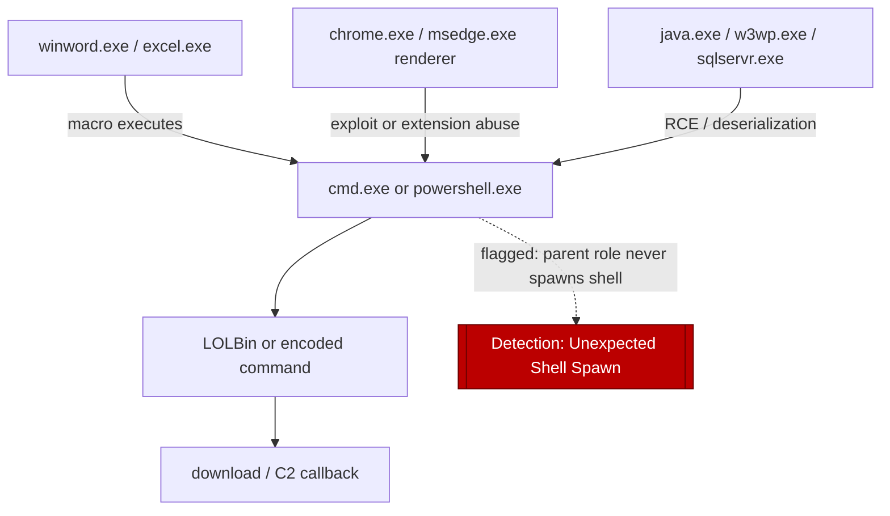
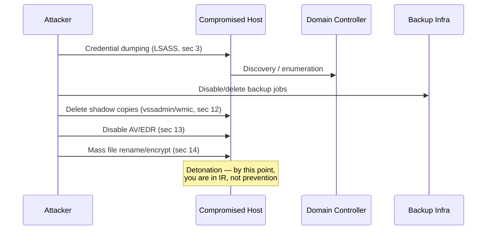

# Part XIV — Endpoint Detection Engineering

Everything in this part assumes you already have the process-tree discipline from Part VI (parent/child
lineage, ancestry chains, session and token context) and the command-line normalization work from Part
VII (tokenization, deobfuscation, argument parsing). This chapter does not re-derive those foundations.
Where a detection here leans on "look at the parent process" or "check the decoded command line," that
is a pointer back to those chapters, not a restatement.

What this chapter *does* add is the behavior layer that sits on top of process/command-line data:
credential access, persistence, injection, defense evasion, and the impact-stage behaviors that show up
right before ransomware detonates. Endpoint telemetry is where most of these behaviors leave their first
— and sometimes only — trace. If your EDR or Sysmon pipeline drops fields, samples events under load, or
lags behind process termination, every detection in this chapter degrades quietly. Keep that in mind as
you read; several sections call it out explicitly.

## 1. Encoded and obfuscated PowerShell

[CONCEPT] Attackers encode PowerShell (Base64, compression, char-array reconstruction, string reversal)
for two reasons: to defeat naive substring matching in AV/EDR, and to survive command-line length limits
or shell-escaping problems when payloads are staged via LOLBins, scheduled tasks, or registry values.

[ANALYST] The giveaway is rarely the encoding itself — `-EncodedCommand` is used by plenty of legitimate
config-management tooling. The giveaway is the *combination*: encoded command line + unusual parent
process + execution from a user-writable path + a decoded payload that does something a legitimate
script wouldn't (download, reflective load, `Invoke-Expression` on a variable built from decoded bytes).

[DETECTION ENGINEER] Detect on both the encoded-flag and post-decode content. If your pipeline can
decode Base64/UTF-16 blobs at ingest (many SIEMs and EDR platforms do this natively via a parsing rule),
run your content-matching logic against the *decoded* string, not the ciphertext. If you can't decode at
ingest, at minimum flag the presence of `-enc`, `-EncodedCommand`, `-e ` (short form), `FromBase64String`,
`[System.Convert]`, `-join`, `[char[]]`, and compression class names (`IO.Compression.GzipStream`,
`DeflateStream`) as a first-stage filter, then route matches to a decode-and-rescan step.

```yaml
title: PowerShell Execution with Base64-Encoded Command and Suspicious Parent
id: part14-01
status: experimental
description: >
  Detects powershell.exe/pwsh.exe invoked with an encoded command argument,
  spawned from a parent process not typically associated with legitimate
  scripted administration (Office apps, browsers, LOLBins, scheduled task host).
logsource:
  category: process_creation
  product: windows
detection:
  selection_proc:
    Image|endswith:
      - '\powershell.exe'
      - '\pwsh.exe'
  selection_flag:
    CommandLine|contains:
      - '-enc'
      - '-EncodedCommand'
      - 'FromBase64String'
  selection_parent:
    ParentImage|endswith:
      - '\winword.exe'
      - '\excel.exe'
      - '\outlook.exe'
      - '\mshta.exe'
      - '\wscript.exe'
      - '\cscript.exe'
      - '\cmd.exe'
      - '\rundll32.exe'
      - '\svchost.exe'
  condition: selection_proc and selection_flag and selection_parent
falsepositives:
  - RMM tools that legitimately wrap PowerShell in an encoded launcher
  - Some backup/patch agents
level: high
```

[THREAT HUNTER] Don't stop at exact strings. Hunt for the *shape* of obfuscation independent of specific
flags: unusually long command lines (95th+ percentile for that host role), high ratio of non-alphanumeric
characters, command lines built from concatenated short tokens (`'p'+'o'+'w'+'e'+'r'`-style string
splitting), and `-NoProfile -NonInteractive -WindowStyle Hidden` in combination — none of those alone is
rare, together they're a strong prior. Also hunt PowerShell invoked via `powershell.exe` with *no*
command-line logging captured at all (Event ID 4103/4104 module/script-block logging missing) — that gap
is itself a signal if script-block logging is enabled fleet-wide and one host is silent.

[ENGINEERING] PowerShell has three overlapping telemetry sources and they are not redundant, they're
complementary: process creation (command line as typed/encoded), Module Logging (4103, pipeline
execution details), and Script Block Logging (4104, the deobfuscated script text, including
auto-deobfuscation for common encoding patterns). If you only ingest process creation, you will *never*
see the deobfuscated payload — you're matching on ciphertext forever. Script Block Logging is the highest
leverage single control for PowerShell detection and it's frequently missing because it wasn't turned on
via GPO/Intune, not because of a licensing gate.

## 2. LOLBin abuse

[CONCEPT] Living-off-the-land binaries — `mshta.exe`, `regsvr32.exe`, `rundll32.exe`, `certutil.exe`,
`bitsadmin.exe`, `msbuild.exe`, `installutil.exe`, `wmic.exe`, `forfiles.exe` — are signed Microsoft
binaries that can execute, download, or proxy arbitrary code. MITRE ATT&CK groups most of these under
T1218 (Signed Binary Proxy Execution) with per-binary subtechniques.

[ANALYST] The base rate problem is severe: `rundll32.exe` and `regsvr32.exe` run constantly during normal
software installs and updates. You cannot alert on presence. You alert on argument shape and context —
`rundll32.exe` with no DLL export name (calling a function directly by ordinal or an unusual export like
`Control_RunDLL` from a non-`shell32` path), `regsvr32.exe /s /n /u /i:http://...` (the classic Squiblydoo
pattern pulling a scriptlet over HTTP), `certutil.exe -urlcache -split -f` (download-as-cert-cache abuse),
`mshta.exe` with inline `javascript:` or `vbscript:` in the argument rather than an `.hta` file path.

[DETECTION ENGINEER] Build one analytic per binary family, keyed on argument patterns, and a second
cross-binary analytic keyed on network egress immediately following LOLBin execution (LOLBin process
creation followed within N seconds by that same PID or a child opening an outbound connection is a much
stronger signal than either alone).

| LOLBin | High-signal pattern | ATT&CK |
|---|---|---|
| `mshta.exe` | inline script protocol, remote `.hta` URL argument | T1218.005 |
| `regsvr32.exe` | `/i:http`, `scrobj.dll`, no prior install context | T1218.010 |
| `rundll32.exe` | export by ordinal, `javascript:` argument, unusual DLL path | T1218.011 |
| `certutil.exe` | `-urlcache`, `-decode`, `-decodehex` | T1105 / defense evasion |
| `msbuild.exe` | inline `.xml`/project file from temp/user-writable path | T1127.001 |
| `wmic.exe` | `process call create`, `/node:` remote targeting | T1047 |

[THREAT HUNTER] Baseline LOLBin usage per host role first — a software-packaging or SCCM distribution
point legitimately runs `msiexec`/`regsvr32` constantly; a finance workstation should not. The hunt query
is a frequency outlier query against the *host's own history*, not a fleet-wide rarity query, because
fleet-wide rarity will bury you in false positives from legitimate deployment tooling that only a subset
of hosts run.

## 3. Credential dumping and LSASS access

[CONCEPT] Credential dumping (T1003) covers pulling hashes, plaintext creds, or Kerberos tickets from
memory or disk — LSASS process memory (T1003.001) is the highest-value target because it holds live
logon-session material for every interactively or network-authenticated account on the box.

[ANALYST] LSASS access itself is not inherently malicious — plenty of legitimate processes (other LSA
components, some AV/EDR agents, credential-provider plugins) open handles to `lsass.exe`. What matters is
the *combination* of requested access rights and the calling process identity: `PROCESS_VM_READ` (0x10)
or full `PROCESS_ALL_ACCESS` requested by a process that has no legitimate reason to touch LSASS —
`taskmgr.exe` (opened manually to dump via "create dump file"), `rundll32.exe` calling `comsvcs.dll`'s
`MiniDump` export, `procdump.exe` (Sysinternals, legitimate tool but frequently abused), or an unsigned
binary entirely.

[DETECTION ENGINEER] Sysmon Event ID 10 (ProcessAccess) with `TargetImage` = `lsass.exe` is the core
telemetry. Filter on `GrantedAccess` values that include read/VM-read bits, and exclude known-benign
source images (build an allowlist per environment — this list drifts, review it quarterly).

```yaml
title: LSASS Memory Access via comsvcs.dll MiniDump
id: part14-02
status: stable
description: Detects rundll32 invoking comsvcs.dll MiniDump export against lsass.exe PID
logsource:
  category: process_creation
  product: windows
detection:
  selection:
    Image|endswith: '\rundll32.exe'
    CommandLine|contains|all:
      - 'comsvcs.dll'
      - 'MiniDump'
  condition: selection
falsepositives:
  - Extremely rare; essentially none in normal administration
level: critical
```

```yaml
title: Non-Standard Process Requesting High-Privilege Access to LSASS
id: part14-03
status: experimental
logsource:
  category: process_access
  product: windows
  service: sysmon
detection:
  selection:
    TargetImage|endswith: '\lsass.exe'
    GrantedAccess:
      - '0x1010'
      - '0x1410'
      - '0x1438'
      - '0x143a'
      - '0x1fffff'
  filter_known_benign:
    SourceImage|endswith:
      - '\MsMpEng.exe'
      - '\dllhost.exe'      # verify per-env; dllhost has legitimate WMI-provider paths too
  condition: selection and not filter_known_benign
falsepositives:
  - EDR/AV agents not in the allowlist
  - Backup agents that enumerate logon sessions
level: high
```

[THREAT HUNTER] Hunt for LSASS *dump file artifacts* independent of the access event — files named or
sized like an LSASS minidump written to disk (`.dmp` in temp/user-writable paths, size in the
tens-to-hundreds-of-MB range depending on logged-on session count), and for `sekurlsa`-style DLL naming
patterns if Mimikatz or forks are used unmodified. Also hunt registry/policy state that *enables* easier
dumping: `HKLM\...\NTDS` dump prep, or disabling LSA protection (`RunAsPPL`) shortly before a dump attempt
— an attacker who can't touch protected LSASS will often try to turn protection off first, which is its
own detectable event (registry modify + reboot, or a driver-load attempt to bypass PPL).

[ENGINEERING] LSASS protection (Credential Guard, RunAsPPL) changes what's *possible*, not what's
*logged*. If PPL is enforced, a dump attempt from a non-protected process will fail with an access-denied
status — that failure is still visible in the ProcessAccess event and is arguably a stronger signal
(explicit escalation attempt) than a successful open on an unprotected host. Don't tune out failed
attempts as noise; they're often the highest-confidence event in this category.

## 4. Scheduled task persistence

[CONCEPT] Scheduled tasks (T1053.005) give an attacker durable re-execution across reboots and logons,
and — because Task Scheduler can run as SYSTEM — a path to privilege elevation from a task defined by a
lower-privileged but task-creation-capable account.

[ANALYST] Two telemetry sources matter: process creation for `schtasks.exe /create` (or direct COM/API
calls to the Task Scheduler service that never touch `schtasks.exe` at all), and the Task Scheduler
operational log (Event ID 106 task registered, 141 task deleted, 200/201 task executed/completed). If you
only watch `schtasks.exe` command lines you miss tasks created via `ITaskService` COM automation from a
PowerShell or C# payload — this is a common gap.

[DETECTION ENGINEER] Correlate task-creation with action content: a task whose action runs `powershell`,
`cmd`, `wscript`, `mshta`, or a binary from a user-writable path, especially with a trigger of `ONSTART`,
`ONLOGON`, or a short repeating interval, and especially when created by a process other than
`svchost.exe`/legitimate deployment tooling.

[THREAT HUNTER] Pull the full task inventory periodically (`schtasks /query /fo csv /v` conceptually, or
via the Task Scheduler WMI/COM interface) and diff against last snapshot — new tasks, changed actions on
existing tasks, and tasks with author/run-as mismatches (task authored by a standard user but configured
to run as SYSTEM) are all worth a look. Tie this back to Part VI: the *executing* process's parent will
be `taskeng.exe`/`svchost.exe` (Task Scheduler service host), which is itself a normal parent — the
anomaly is one level down, in what that scheduled action actually launches.

## 5. Service persistence

[CONCEPT] Windows service creation (T1543.003) is the SYSTEM-track equivalent of scheduled tasks: a
service installed to auto-start, running as `LocalSystem`, surviving reboot.

[ANALYST] Watch Event ID 7045 (System log, "A new service was installed") and 4697 (Security log, if
auditing is enabled) together with process creation for `sc.exe create`, `New-Service`, or direct
`CreateService` API use. Fields to check: `ImagePath` pointing to a user-writable or temp path, unusual
service DLLs loaded via `svchost.exe -k <group>` with a newly added group, and services with no
`Description` or a description copy-pasted from a legitimate-looking but slightly-off name (`Windows
Update Orchestrat0r`-style typosquats on real service display names).

[DETECTION ENGINEER] The highest-value single field is `ImagePath` path legitimacy — services genuinely
almost never run from `%TEMP%`, `%APPDATA%`, `C:\Users\Public`, or `C:\ProgramData\<random-looking
name>`. Flag any 7045 where `ImagePath` resolves to one of those locations, full stop; the false-positive
rate is low enough to run at high severity.

[THREAT HUNTER] Hunt for service *binary replacement* on existing legitimate services (attacker points an
existing benign service's `ImagePath` at a malicious binary instead of creating a new service, which
avoids the 7045 "new service" signal entirely and instead triggers a 7040 "service start type changed" or
a 4657 registry-value-modified event on the service's `ImagePath` value under
`HKLM\SYSTEM\CurrentControlSet\Services\<name>`). This is a known evasion of naive "alert on 7045 only"
detections.

## 6. Registry persistence (Run keys and beyond)

[CONCEPT] Run/RunOnce keys (T1547.001) are the oldest and still most-used registry persistence
mechanism, but the technique family is much larger: Winlogon Shell/Userinit, IFEO debugger hijack,
AppInit_DLLs, Image File Execution Options, COM hijacking, and Active Setup all achieve the same outcome
via different registry locations.

[ANALYST] Sysmon Event ID 13 (RegistryEvent — Value Set) on the classic Run key paths is the baseline.
The interesting cases are values that don't look like normal software entries: paths to scripts rather
than executables, `rundll32`/`mshta`/`powershell` invocations as the value data, values written by a
process other than an installer (a browser, a document app, a script host writing directly to the
registry is far more suspicious than an MSI-based installer doing the same).

```
HKCU\Software\Microsoft\Windows\CurrentVersion\Run
HKLM\Software\Microsoft\Windows\CurrentVersion\Run
HKLM\Software\Microsoft\Windows\CurrentVersion\RunOnce
HKLM\SOFTWARE\Microsoft\Windows NT\CurrentVersion\Winlogon  (Shell, Userinit)
HKLM\SOFTWARE\Microsoft\Windows NT\CurrentVersion\Image File Execution Options\<binary>  (Debugger value)
```

[DETECTION ENGINEER] Build the detection on `(TargetObject in run-key list) AND (Details matches
script-host or LOLBin pattern OR ImageWritingValue is not an installer/known-updater)`. IFEO Debugger
hijacks deserve their own rule — a Debugger value set for a commonly-launched binary (`sethc.exe`,
`utilman.exe` — the classic sticky-keys accessibility backdoor, or any AV/EDR executable name) is almost
never legitimate and should page someone immediately.

[THREAT HUNTER] Registry hunting benefits enormously from a known-good baseline snapshot per gold image —
diffing current Run-key contents against the gold image surfaces additions instantly, and it's a much
cheaper query than fleet-wide anomaly scoring. Also hunt Active Setup (`StubPath` under
`HKLM\SOFTWARE\Microsoft\Active Setup\Installed Components\<GUID>`) — it's rarer, less monitored, and
still functional for per-user re-execution at logon.

## 7. DLL loading anomalies and sideloading

[CONCEPT] DLL search-order hijacking and sideloading (T1574.001/.002) abuse the order in which Windows
resolves DLL names: if an attacker can place a malicious DLL with the expected name in a directory
searched *before* the legitimate one (often the same directory as a legitimate, signed executable), the
signed executable loads and executes attacker code — useful both for persistence and for defense evasion
(the process on the process tree is the trusted signed binary).

[ANALYST] Sysmon Event ID 7 (Image Loaded) is the core source, but it's extremely high volume — you
cannot alert on every DLL load. Narrow to: DLLs loaded from non-standard locations (a DLL with the same
name as a known system DLL but loaded from the application's own directory or from `%TEMP%`/user
profile), unsigned DLLs loaded into signed, well-known executables, and DLLs whose on-disk hash doesn't
match the known-good hash for that DLL name (if you maintain a hash reference set — most mature shops
maintain one for high-value binaries like browsers, Office, and common LOLBins).

[DETECTION ENGINEER] The pragmatic approach: don't try to catch sideloading at load-time for every
process, catch it for a curated list of high-value, frequently-hijacked signed binaries
(`OneDrive.exe`, security-product components, common productivity apps with known hijack history), and
flag any Image Load event for that binary where `Signed=false` on the loaded module or the module's
directory does not match its expected install path.

[THREAT HUNTER] Hunt for the *write* that precedes the hijack, not just the load: a file-creation event
placing a `.dll` into a directory alongside an existing signed executable, where the new DLL's name
matches a DLL that executable is known to import. This shifts detection left from execution time to
staging time, and it correlates cleanly with process-tree data — the process that dropped the DLL is
usually the same process (or a close relative) that later benefits from its load.

## 8. Process injection indicators

[CONCEPT] Process injection (T1055 and its subtechniques — DLL injection, process hollowing T1055.012,
thread execution hijacking, APC injection) puts attacker code inside the address space of a legitimate,
often trusted, running process, so the code executes with that process's identity and typically evades
naive "unsigned binary ran" detections entirely.

[ANALYST] No single event proves injection; you build confidence from a chain: `OpenProcess`/`CreateRemoteThread`-style
API activity (surfaced as Sysmon Event ID 8, CreateRemoteThread, or Event ID 10 ProcessAccess with
write/execute-capable access rights) targeting a process that did not spawn the source process, followed
by that target process doing something behaviorally inconsistent with its normal role (a browser
suddenly making raw socket connections on a non-HTTP(S) port, `explorer.exe` writing to disk in a
location it never does, `svchost.exe` spawning a child it never spawns).

[DETECTION ENGINEER] Event ID 8 (CreateRemoteThread) with a `SourceImage` that has no legitimate reason
to inject into `TargetImage` is the highest-value narrow signal — genuine cross-process thread creation
is rare outside of debuggers, some AV/EDR self-protection, and a handful of legitimate app frameworks.
Process hollowing specifically shows up as a process created in suspended state whose main module image
is later replaced — this is harder to catch from process-creation logs alone and usually needs
EDR-vendor-specific behavioral telemetry (memory-scanning, unbacked executable memory regions) rather
than Sysmon alone.

[THREAT HUNTER] Hunt for the *effect* rather than the *mechanism*: processes with memory regions marked
executable that aren't backed by any file on disk (a strong hollowing/reflective-load indicator most EDR
platforms expose as a discrete telemetry field), and network or file-write behavior attributed to a
process that is behaviorally out of character for that binary given six months of baseline. This ties
directly to Part VI's process-tree work — a hollowed `svchost.exe` still *looks* like `svchost.exe` in the
tree; the tree alone will not catch it, you need the behavioral layer on top.

**Hunter's Note:** if your EDR gives you one memory-forensics field to alert on across the whole fleet,
make it "unbacked executable memory region." It's the single highest signal-to-noise indicator for
injection and hollowing that doesn't require you to enumerate every known injection API pattern, which is
a losing game — there are dozens of injection primitives and new ones surface regularly.

## 9. Unexpected shell spawning

[CONCEPT] This is where process-tree work (Part VI) and this chapter meet directly. A shell
(`cmd.exe`, `powershell.exe`, `/bin/sh` on cross-platform endpoints) spawned by a process that has no
business spawning a shell — a browser, a document reader, a mail client, a database engine, a web server
worker process — is one of the most reliable initial-access and exploitation indicators available,
because it's very hard for legitimate software to have a reason to do it and very common for exploit
payloads and macro/script droppers to do it as their first action.

[ANALYST] The check is a parent/child pair lookup against a denylist of parent roles that should never
spawn a shell, cross-referenced against the exceptions that *do* legitimately exist (IT helpdesk tools
that shell out for diagnostics, some browser extensions/dev tools, database maintenance scripts).

[DETECTION ENGINEER] This is largely a restatement of Part VI's parent-child anomaly detection applied to
a specific high-value child (shell processes) — build it as a lookup-table analytic (parent image →
allowed/denied child set) rather than a bespoke rule per application, so new applications get covered
automatically as you extend the parent role table.



[THREAT HUNTER] Extend beyond exact-match parent images to parent *categories* — anything running under
a service account with no interactive logon capability spawning an interactive shell is worth a look
regardless of which specific binary is the parent, because it catches new/unlisted software you haven't
individually reviewed yet.

## 10. Unsigned binary execution

[CONCEPT] Code-signing status alone is weak — plenty of legitimate internal tooling and some commercial
software ships unsigned — but it's a useful *modifier* on other signals rather than a standalone
detection.

[ANALYST] Combine unsigned-status with execution location (user-writable/temp paths score higher),
absence from any known-software inventory, and recency (a binary that appeared on disk in the last few
minutes and is already executing scores much higher than one that's been present for months). Signature
*validity* also matters separately from *presence* — a revoked or expired certificate, or a signature
that fails chain validation, should be treated as functionally unsigned and flagged with extra weight
since it often indicates a stolen/leaked signing cert being used past revocation.

[DETECTION ENGINEER] Don't build "alert on unsigned execution" as a standalone high-severity rule unless
your environment genuinely locks down to signed-only execution (some regulated/high-security estates do,
via WDAC/AppLocker). For everyone else, use unsigned status as a scoring input into other analytics in
this chapter (e.g., "unsigned DLL loaded into signed process" in the sideloading section, "unsigned binary
dropped by Office process" in the shell-spawn section).

**Detection Autopsy: "Alert on any unsigned .exe execution"**

*Original logic:* a new analyst, early in the program, wrote a rule that fired on every process-creation
event where the binary's Authenticode signature status was not "Signed" or "SignedAndVerified." It looked
reasonable on paper — unsigned code is inherently less trustworthy, and MITRE explicitly calls out
unsigned execution under several defense-evasion and execution techniques.

*What broke in production:* the rule fired thousands of times a day. Internal build tooling, several
widely-used open-source utilities distributed unsigned, PowerShell scripts compiled ad hoc by developers,
and — the biggest single contributor — every temp-file extraction step of dozens of legitimate installers
that drop small unsigned helper `.exe` files during setup and delete them seconds later. Analysts muted
the rule within a week because triage time exceeded any value it returned.

*What was missing:* execution *context*. The rule had no path filter, no parent-process filter, no
lifetime filter (binary present for seconds vs. months), and no correlation with anything else happening
on the host.

*Revised analytic:* unsigned execution was folded into three narrower, context-aware rules instead of one
broad one — unsigned binary executing from a temp/download path with a parent browser or document
application (initial-access pattern), unsigned DLL loaded into an allowlisted set of high-value signed
processes (sideloading pattern, see section 7), and unsigned binary written and executed within the same
process lifetime as the writer (drop-and-run pattern, common to droppers).

*How it was tested:* replayed two weeks of production process-creation logs against all three revised
rules offline before enabling in blocking/alerting mode, confirmed the original noisy cases (installer
temp helpers, dev build tools) no longer matched, and confirmed a red-team dropper sample from a prior
engagement still triggered the drop-and-run variant.

*Result:* alert volume dropped from ~2,000/day to under 15/day fleet-wide, with the 15 being materially
higher quality — every one had at least one additional corroborating signal.

## 11. Ransomware precursor behavior

[CONCEPT] Ransomware operators (and their affiliates/access brokers) follow a fairly consistent sequence
before detonation: discovery and lateral movement, credential harvesting (section 3), backup and
recovery-mechanism sabotage (section 12), security tooling disablement (section 13), then mass
file-encryption/rename activity (section 14). Detecting the *precursors* is far more valuable than
detecting detonation, because by detonation time you're in incident response, not prevention.

[ANALYST] Watch for the sequence, not just individual events: enumeration commands (`net view`, `nltest`,
AD reconnaissance tooling), followed within a short window by backup-related process/service activity
(backup agent stopped, backup catalog files deleted or accessed unusually), followed by shadow-copy or
recovery-mechanism tampering. Any one of these alone might be routine admin work; the sequence compressed
into a short time window on the same host or same small set of hosts is the signal.

[DETECTION ENGINEER] This is a strong candidate for a correlation/sequence rule (multi-stage detection)
rather than a single-event rule — most modern SIEMs support "event A followed by event B within window W
on the same entity" logic. Build the sequence chain explicitly rather than relying on separate rules
firing independently and hoping an analyst notices the pattern manually.



[MANAGEMENT] If your detection coverage matrix (see the table at the end of this chapter) shows strong
coverage on detonation-stage signatures (mass rename, ransom-note drops) but weak coverage on
precursor-stage behaviors (shadow-copy deletion, backup sabotage, EDR tampering), that's a real gap worth
budget attention — precursor detections are what buy you response time before encryption starts, and
they're generally cheaper to build than robust anti-encryption behavioral analytics.

## 12. Shadow copy and volume shadow deletion

[CONCEPT] Deleting Volume Shadow Copies (T1490, Inhibit System Recovery) removes the easiest local
recovery path before or during encryption, forcing victims toward backups (which the actor may have
already sabotaged) or paying.

[ANALYST] The command patterns are narrow and well-known: `vssadmin delete shadows /all /quiet`,
`wmic shadowcopy delete`, `Get-WmiObject Win32_ShadowCopy | Remove-WmiObject` (PowerShell equivalent),
and `bcdedit /set {default} recoveryenabled no` / `bcdedit /set {default} bootstatuspolicy
ignoreallfailures` (disabling boot-time recovery options) alongside `wbadmin delete catalog -quiet`
(deleting the Windows Server Backup catalog).

[DETECTION ENGINEER] These are close to zero-false-positive commands in the vast majority of
environments — legitimate shadow-copy management is typically done through backup software APIs, not
interactive `vssadmin`/`wmic` invocation. Run this at high severity with minimal exceptions (documented
backup/DR runbooks that do call these commands directly should be the *only* allowlist entries, and they
should be rare and well-known).

```yaml
title: Volume Shadow Copy or Backup Catalog Deletion
id: part14-04
status: stable
logsource:
  category: process_creation
  product: windows
detection:
  selection_vssadmin:
    Image|endswith: '\vssadmin.exe'
    CommandLine|contains|all: ['delete', 'shadows']
  selection_wmic:
    Image|endswith: '\wmic.exe'
    CommandLine|contains|all: ['shadowcopy', 'delete']
  selection_wbadmin:
    Image|endswith: '\wbadmin.exe'
    CommandLine|contains: 'delete catalog'
  selection_bcdedit:
    Image|endswith: '\bcdedit.exe'
    CommandLine|contains|all: ['recoveryenabled', 'no']
  condition: 1 of selection_*
falsepositives:
  - Documented backup/DR maintenance scripts (allowlist explicitly, keep the list short)
level: critical
```

[THREAT HUNTER] Hunt for the PowerShell/WMI equivalents that skip `vssadmin.exe`/`wmic.exe` entirely
(direct `Win32_ShadowCopy` WMI class manipulation from a script), and for the *precursor* to shadow-copy
deletion — attackers sometimes first check shadow-copy state (`vssadmin list shadows`) before deciding
whether deletion is worth the noise, which is a useful early-warning if you catch it before the delete
command runs.

## 13. EDR tampering and security tool disabling

[CONCEPT] T1562 (Impair Defenses) covers stopping, uninstalling, or blinding security tooling —
disabling Windows Defender real-time protection, stopping EDR services, unloading kernel drivers,
tampering with the Windows Event Log service, or using legitimately-signed "driver unloader"/anti-EDR
tools (T1562.001 Disable or Modify Tools, T1562.002 Disable Windows Event Logging, T1562.004
Disable/Modify Firewall).

[ANALYST] The uncomfortable reality: if the tampering succeeds against *your* EDR agent, your primary
telemetry source for everything else in this chapter just went dark on that host. This is why tamper
detection needs to be treated as tier-0 — often via an out-of-band heartbeat/health-check mechanism
independent of the agent's own event pipeline (an agent that's been killed can't report its own death
through its normal channel).

[DETECTION ENGINEER] Layer three mechanisms: (1) service-state monitoring from a source independent of
the endpoint agent itself — most EDR platforms have a management-plane "agent offline"/"tamper detected"
alert that should page immediately and be treated as equivalent to a confirmed compromise until proven
otherwise; (2) Windows Security log 4689/7036 style service-stop events for the AV/EDR service name,
correlated with the account/process that issued the stop; (3) Event Log service tampering itself —
`wevtutil cl` (clear log) or `Set-Service EventLog -StartupType Disabled` should be treated as
near-certain malicious activity outside of a small number of documented log-rotation jobs.

[THREAT HUNTER] Hunt for gaps, not just events — a host with an EDR agent installed that suddenly stops
producing *any* telemetry (not an explicit stop event, just silence) is a stronger and stealthier
tampering indicator than any logged "service stopped" event, because sophisticated tampering tools target
the agent's kernel callbacks or unhook its userland hooks without ever touching the Windows service
control manager in a way that generates a clean stop event. Build a "last-seen heartbeat per host" table
and alert on hosts that go silent outside of expected patterns (patch-window reboots, scheduled
maintenance).

**Engineering Reality:** EDR tamper-resistance is a genuine security boundary, not a checkbox — vendors
differ enormously in how hard their agent is to blind from a SYSTEM-level attacker, and "we have EDR
deployed" tells you nothing about whether that EDR can be silently killed by a privileged local attacker.
Ask your vendor specifically how tamper protection is implemented (self-protection driver, ELAM boot-time
driver, out-of-band heartbeat) and validate it in your own lab rather than trusting the marketing sheet —
this is exactly the kind of claim that needs a controlled-lab validation pass, not a documentation
review.

> **[SCREENSHOT PLACEHOLDER — CONTROLLED LAB]** — Sysmon/Security Event Log capture from a Windows test
> VM showing a service-stop event (Event ID 7036, service entering "Stopped" state) for a security-tooling
> service name, correlated in the same time window with the process-creation event for the command that
> issued the stop, to illustrate the fields an analyst would pivot on (`ServiceName`, `Account`, calling
> `Image`/`CommandLine`).

## 14. Mass file rename/modify events (ransomware detonation)

[CONCEPT] The detonation phase itself: an encryptor process opens, reads, encrypts, and rewrites (often
renaming with a new extension or appending a ransom-note-style suffix) a large number of files in a short
time window, frequently across multiple directories and sometimes across mapped/network shares from a
single host.

[ANALYST] Volume and rate are the core signals: a single process performing file-modify/rename operations
against hundreds or thousands of distinct files within seconds to low minutes, especially across
directory boundaries and especially against file types with no reason to change together (documents,
images, databases, archives all modified by the same process in the same burst). File extension churn —
many files gaining the same new extension or losing their original one — is a strong secondary signal.

[DETECTION ENGINEER] This needs either native EDR ransomware-behavior modules (most EDR platforms ship
one, typically combining rate-of-change with entropy analysis on file content, which endpoint agents can
see and SIEM-only pipelines generally can't) or a file-activity telemetry source with per-process
aggregation (Sysmon FileCreate, Event ID 11, doesn't cover modify/rename well by itself — you generally
need EDR-vendor file-monitoring telemetry or a file integrity monitoring agent for reliable coverage
here).

```sql
-- Illustrative KQL (Microsoft Sentinel / Defender for Endpoint style schema)
-- Detects a single process performing high-volume file rename/modify activity
-- across multiple folders within a short window.
DeviceFileEvents
| where ActionType in ("FileRenamed", "FileModified")
| where Timestamp > ago(1h)
| summarize
    DistinctFiles = dcount(FileName),
    DistinctFolders = dcount(FolderPath),
    Extensions = make_set(FileExtension),
    FirstSeen = min(Timestamp),
    LastSeen = max(Timestamp)
    by DeviceId, InitiatingProcessId, InitiatingProcessFileName
| extend DurationSeconds = datetime_diff('second', LastSeen, FirstSeen)
| where DistinctFiles > 200 and DistinctFolders > 5 and DurationSeconds < 120
| order by DistinctFiles desc
```
*(illustrative — validate field names and thresholds against your actual schema and normal backup/sync/AV-scan baseline before deploying; legitimate bulk operations like antivirus full scans, backup software, and file-sync clients can produce superficially similar volume and need explicit exclusion.)*

[THREAT HUNTER] Hunt for the slower, more deliberate variant — an actor who deliberately throttles
encryption rate to stay under volume-based detection thresholds (a known evasion against exactly the kind
of rule above). Look for sustained, moderate-rate file modification from a single process over a longer
window (tens of minutes to hours) rather than only alerting on short, high-volume bursts, and correlate
against entropy/content-type signals where your platform provides them (a file's content becoming
high-entropy binary data when it used to be a structured document format is a strong indicator regardless
of the rate at which it happened).

**SOC Management View:** mass file-modify detection is one of the few places where response *speed*
matters more than almost anywhere else in the book — every minute between first-file-encrypted and
network isolation is measured in additional encrypted files, and most encryptors move fast enough that a
human-in-the-loop triage step before containment defeats the purpose of the detection. This is the
strongest argument in most environments for pre-authorized automated response (isolate host, kill
process) on a narrow set of very-high-confidence ransomware-behavior detections specifically, even in
programs that otherwise require human sign-off on containment actions.

## 15. Remote administration tool (RMM) abuse

[CONCEPT] Legitimate RMM tools (AnyDesk, ScreenConnect/ConnectWise Control, TeamViewer, Atera, Splashtop,
and dozens of others) are increasingly the initial-access and persistence mechanism of choice for
ransomware affiliates and access brokers (T1219, Remote Access Software) precisely because they're
signed, common in enterprise environments, and rarely blocked outright by security tooling that
allowlists "known good" software.

[ANALYST] The detection problem is inherently an *authorization* problem, not a malware problem — the
binary is legitimate, signed, and behaves exactly as designed. What makes it malicious is that it's
running somewhere your organization didn't install or approve it. That means detection depends heavily
on maintaining an accurate inventory of *approved* RMM tools and their expected deployment scope
(which admin workstations, which support team, which hours).

[DETECTION ENGINEER] Build a denylist of RMM binary names/publishers *not* on your approved list (there
are maintained community lists of RMM executable names/hashes specifically for this purpose — treat any
hit as high-confidence unauthorized software), and separately build an anomaly rule for *approved* RMM
tools running outside their expected scope (approved tool appearing on a host/user that's never used it
before, approved tool installed via a delivery mechanism inconsistent with your normal deployment
process — e.g., dropped by a browser download rather than pushed via your endpoint management platform).

[THREAT HUNTER] Hunt network egress for RMM-specific domains/ports even when the process-level signature
is evaded (renamed binary, portable/no-install variant) — most RMM tools have recognizable and fairly
stable C2 relay infrastructure or at minimum a small, enumerable set of vendor domains, and DNS/TLS-SNI
telemetry catches renamed-binary variants that process-name-based detection misses entirely.

## Worked example: chaining the chapter into one detection story

A mid-size retail company's SOC gets a single medium-severity alert: an unsigned scheduled task was
created on a domain-joined workstation, action pointing to a PowerShell one-liner with an encoded
argument. Walking it through this chapter's lens rather than treating it as an isolated finding:

1. **Command-line decode (Part VII + section 1):** decoded payload downloads a secondary stage from a
   domain registered nine days prior.
2. **Process tree (Part VI + section 9):** the task's action process is a child of `taskeng.exe` as
   expected, but *that* PowerShell process's own child, seconds later, is `rundll32.exe` calling
   `comsvcs.dll` against the PID of `lsass.exe` (section 3) — LSASS memory access from a process with no
   business touching it.
3. **Fifteen minutes later:** `vssadmin.exe delete shadows /all /quiet` runs on the same host (section
   12), and the local EDR agent's heartbeat drops from the management console shortly after (section 13).
4. **Twenty-two minutes after that:** file-modify telemetry on a mapped file server share shows a
   different host — one the original workstation has an active SMB session to — beginning high-rate file
   renames across multiple department shares (section 14, section 11's precursor chain fully realized).

None of steps 1–3 individually would have justified emergency network isolation on their own merit in a
lot of SOCs' escalation criteria. Chained together with timestamps this tight, across this specific
sequence, the case for immediate isolation at step 2 — before steps 3 and 4 ever happened — is
unambiguous. This is the practical argument for building sequence/correlation detections across the
techniques in this chapter rather than relying on an analyst to mentally chain independent alerts under
shift-change time pressure.

## Coverage matrix

| Behavior | Primary telemetry | ATT&CK | Reliable trace | Evadable via |
|---|---|---|---|---|
| Encoded PowerShell | 4104 script block, process creation | T1059.001, T1027 | decoded script text | in-memory-only execution, AMSI bypass |
| LOLBin abuse | process creation, command line | T1218.x, T1105 | argument shape | renamed binaries (limited — signed name is fixed), custom LOLBin discovery |
| LSASS access | Sysmon 10 ProcessAccess | T1003.001 | GrantedAccess bits | PPL bypass drivers, direct syscalls |
| Scheduled task | Task Scheduler op log, process creation | T1053.005 | 106/141/200/201 events | COM API creation bypassing schtasks.exe |
| Service persistence | 7045, 4697, process creation | T1543.003 | ImagePath legitimacy | existing-service ImagePath swap |
| Registry run keys | Sysmon 13 | T1547.001 | value content | IFEO/Active Setup/COM hijack variants |
| DLL sideloading | Sysmon 7 Image Load | T1574.001/.002 | unsigned/mislocated module | hash-matched malicious DLL, signed-but-vulnerable loader |
| Process injection | Sysmon 8, memory telemetry | T1055.x | unbacked exec memory | direct syscalls, novel injection primitives |
| Unexpected shell spawn | process tree | multiple | parent/child pair | spawning via non-shell LOLBin instead |
| Unsigned execution | process creation + Authenticode | T1204.002 (context-dependent) | signature status | stolen/valid signing cert |
| Shadow copy deletion | process creation | T1490 | command syntax | direct WMI/API calls |
| EDR tampering | agent heartbeat, 7036 | T1562.001/.002/.004 | service state / silence | kernel-level unhooking |
| Mass file rename | EDR file-activity telemetry | T1486, T1485 | volume/rate/entropy | throttled encryption rate |
| RMM abuse | process creation, DNS/TLS | T1219 | binary/publisher identity | renamed portable builds |

## Summary

Endpoint detection engineering succeeds or fails on the combination logic, not any single event source.
Nearly every technique in this chapter has a legitimate look-alike, and nearly every reliable single-event
signal has a known evasion. The durable detections in this chapter are the ones built as sequences and
combinations — parent-child pairs, access-rights-plus-caller-identity, volume-plus-rate-plus-entropy —
layered on the process-tree and command-line foundations from Parts VI and VII, with tamper-resistant
telemetry (section 13) treated as a prerequisite rather than an afterthought, because every other
detection in this chapter depends on the endpoint agent staying alive and honest long enough to report
what it saw.
