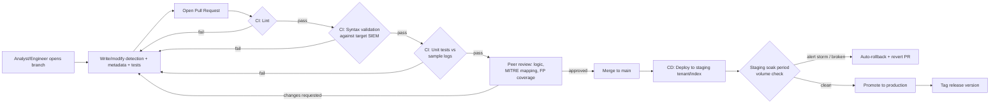
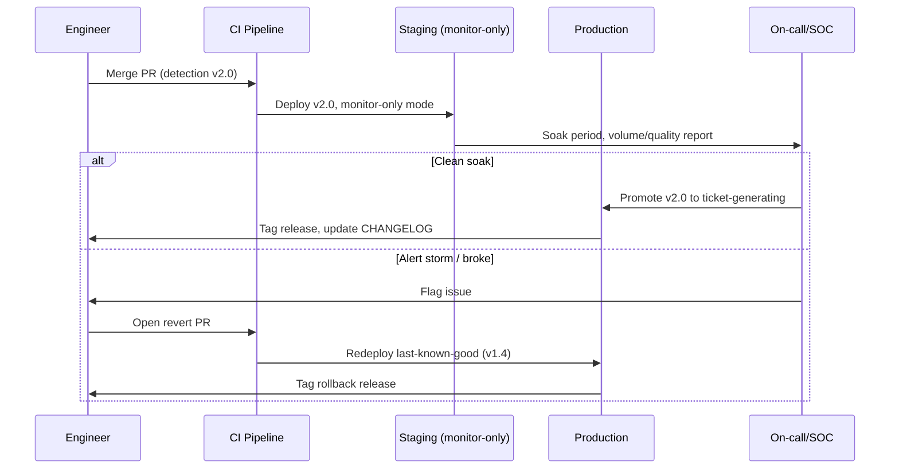

# Part XVI — Detection as Code

## Why a rule is not enough

[CONCEPT] Most detection programs start the same way: someone writes a query in the SIEM's web UI, clicks "save as alert," and moves on. That works for the first twenty rules. It falls apart at rule two hundred, when nobody remembers why a rule exists, whether it still fires, who owns it, what it was supposed to catch, or whether the last "quick edit" someone made in the console six months ago silently broke it. Detection-as-code is the practice of treating detection logic the same way you'd treat application code: stored in version control, structured with metadata, reviewed by a peer before merge, validated by automated tests, deployed through a pipeline, and rolled back the same way you'd roll back a bad software release.

[MANAGEMENT] The business case is not aesthetic. It's auditability (who changed this rule and why, provable to a regulator or a post-incident review board), it's velocity (new analysts can contribute without SIEM-console access or tribal knowledge), and it's survivability (when the SIEM vendor changes syntax, gets replaced, or the one person who understood a rule leaves, the logic and its history still exist as text in a repository, not as an artifact locked inside a UI).

**Engineering Reality:** a rule sitting only in a SIEM's rule editor is a single point of failure with no diff history. If someone "fixes" a false positive by narrowing a field match at 2am during an incident, and that narrowing quietly guts detection coverage for three months until someone notices, you have no record of what changed, when, or why — unless it went through code review first.

## Repository structure

[ENGINEERING] A detection-as-code repository needs a structure that scales past the point where one person can hold the whole thing in their head. There's no single correct layout, but a structure that has proven itself across mature programs organizes by telemetry domain first, then by function:

```
detections-repo/
├── detections/
│   ├── windows/
│   │   ├── process-creation/
│   │   ├── logon/
│   │   └── persistence/
│   ├── identity/
│   │   ├── azuread/
│   │   └── okta/
│   ├── network/
│   │   ├── dns/
│   │   ├── firewall/
│   │   └── proxy/
│   ├── cloud/
│   │   ├── aws/
│   │   ├── azure/
│   │   └── gcp/
│   ├── email/
│   ├── ai/
│   │   ├── llm-api-abuse/
│   │   └── copilot-agent-misuse/
│   └── endpoint/
├── tests/
│   ├── unit/
│   └── integration/
├── samples/
│   ├── windows/
│   ├── identity/
│   └── cloud/
├── lib/
│   └── shared-filters/
├── docs/
│   ├── runbooks/
│   └── decisions/
├── .ci/
│   ├── lint.yml
│   ├── validate-syntax.yml
│   └── run-tests.yml
└── CHANGELOG.md
```

A few structural decisions worth calling out explicitly:

- **`detections/ai/`** deserves its own top-level domain now, not a subfolder buried under "cloud" or "endpoint." LLM API abuse, prompt-injection side effects, agentic-tool misuse, and Copilot/agent action logs are a distinct telemetry class with their own field vocabulary (prompt text, token counts, tool-call names, model IDs) and deserve first-class treatment rather than being shoehorned into existing categories.
- **`samples/`** holds the log fixtures that unit tests execute against — de-identified, synthetic, or carefully scrubbed real captures. This directory is what turns "detection as code" from a metaphor into something literally testable.
- **`lib/`** holds shared logic (common exclusion lists, shared lookup tables, reusable macros/functions in whatever the SIEM's native language supports) so five different DNS detections don't each hardcode their own copy of a stale allow-list.
- **`docs/decisions/`** is a lightweight architecture-decision-record folder — short files explaining *why* a detection was built a certain way or why a whole category was deliberately not covered yet (e.g., "we do not alert on raw PowerShell ScriptBlock content matches because volume made it untunable; see part16-04 rationale"). This is what saves the next engineer from re-litigating a decision that was already made and documented.

[SOC Management View — cost/governance] Folder structure is also how you answer "what's our MITRE coverage in cloud identity" without a spreadsheet: if the repo layout mirrors the domains you actually operate, coverage reporting can be generated by walking the tree and reading metadata, not maintained by hand in a separate document that inevitably drifts out of sync.

## Branching, review, and the pull-request workflow

[DETECTION ENGINEER] The workflow that scales is the same one software teams use, adapted for the fact that a "bug" here means either a missed attack or an analyst drowning in false positives:

1. **Branch per detection or per logical change set.** `feature/part16-01-krbtgt-golden-ticket` not `dev` or a long-lived personal branch that drifts for months.
2. **Pull request required for every change to `detections/`, no direct commits to main.** This is non-negotiable even for "trivial" fixes — the trivial fix is exactly the one that breaks in production because nobody looked at it twice.
3. **Peer review checklist**, not just "looks fine to me":
   - Does the query logic match the stated behaviour in the description?
   - Are the MITRE mappings correct for what the query actually detects (not just what it was inspired by)?
   - Is there at least one test case that should fire (true positive fixture) and one that should not (benign fixture covering a known false-positive pattern)?
   - Does severity match realistic blast radius, not just how scary the technique name sounds?
   - Are field names and table/index references valid for the current schema version?
   - Is there a rollback plan if this causes an alert storm (see release process below)?
4. **A second reviewer with SIEM/query-language fluency, ideally not the author's usual pair**, catches syntax issues a domain expert without query depth might miss, and vice versa — pairing a threat-intel-heavy reviewer with a query-engineering-heavy reviewer on the same PR catches more than either alone.
5. **Merge triggers CI**, not the reverse — nothing reaches a deployable branch without passing the pipeline.



**Hunter's Note:** if your review process has never once rejected a detection PR for a missing false-positive test case, your review process isn't actually reviewing — it's rubber-stamping. The whole point of the checklist is that it occasionally says no.

## CI: linting, syntax validation, and unit testing

[ENGINEERING] Three distinct, separable checks belong in the pipeline, and conflating them is a common early mistake:

**Linting** — style and metadata completeness, not correctness. Does every detection file have all required metadata fields populated? Is the YAML/JSON well-formed? Are naming conventions followed (ID format, file path matching category)? Sigma's own `sigma-cli`/`pySigma` tooling and the Sigma specification's schema are the reference point if the repository is Sigma-based; an equivalent JSON-schema validation step works for native-query repositories.

**Syntax validation** — does the query actually parse against the target platform's grammar? For Sigma rules this typically means running the rule through a backend converter (`pySigma` with the relevant backend plugin) to confirm it compiles to valid KQL/SPL/ESQL/etc. without executing it against real data. For native-language detections (raw KQL saved queries, SPL correlation searches, Sentinel analytics rules as ARM/Bicep templates), this means a dry-run/`validate`-only API call against the platform, or a local parser if the vendor ships one.

**Unit testing against sample logs** — the step that actually proves behaviour, not just grammar. This requires the `samples/` fixtures mentioned earlier: a small corpus of log lines (or events, in whatever the platform's native ingest format is) that represent both the attack behaviour and adjacent benign behaviour. The test harness runs the detection logic against each fixture and asserts the expected outcome (fires / does not fire).

[DETECTION ENGINEER] Illustrative unit test structure (pseudocode, tool-agnostic — treat as illustrative, not runnable unmodified):

```python
# tests/unit/test_part16-01.py — illustrative pseudocode
import detection_test_harness as dth

detection = dth.load("detections/identity/azuread/part16-01-impossible-travel-mfa-bypass.yml")

def test_fires_on_true_positive_sample():
    events = dth.load_sample("samples/identity/azuread/impossible-travel-tp.json")
    result = dth.evaluate(detection, events)
    assert result.fired is True
    assert result.matched_field("UserPrincipalName") == "victim@corp.example"

def test_does_not_fire_on_vpn_failover_benign_sample():
    events = dth.load_sample("samples/identity/azuread/vpn-failover-benign.json")
    result = dth.evaluate(detection, events)
    assert result.fired is False

def test_does_not_fire_on_known_travel_exception_sample():
    events = dth.load_sample("samples/identity/azuread/exec-travel-exception.json")
    result = dth.evaluate(detection, events)
    assert result.fired is False
```

**Detection Autopsy: the impossible-travel rule that ate its own false-positive list**

*Original logic:* an early version of an impossible-travel detection fired whenever the same user authenticated from two geolocations more than 500 miles apart within 60 minutes, full stop. It looked reasonable — the physics argument is sound, nobody travels 500 miles in under an hour commercially in a way that produces two independent authentication events.

*What broke in production:* corporate VPN exit-node failover. When the primary VPN gateway in one region failed over to a secondary gateway in another region mid-session, the user's *apparent* egress IP geolocated to a different continent in under a minute, with no actual travel. Every failover event on that VPN platform generated an alert. Separately, mobile carrier IP reassignment (a phone hopping cell towers near a regional boundary, combined with carrier-grade NAT reallocating the public IP to a pool geolocated elsewhere) produced the same false signature for a meaningful slice of the mobile user population.

*False positives:* roughly 40 alerts a week from VPN failover alone at a mid-size org, drowning the maybe 1-2 real impossible-travel events per quarter that mattered.

*False negatives:* the rule also missed the more common real attack pattern — credential-stuffing logins that succeed from a *plausible* geolocation (attacker infrastructure in the same country/region as the victim, which is common for targeted credential stuffing) but from an ASN, device, and user-agent the account has never used before. The naive rule's whole threat model was "far apart in distance," which isn't actually the strongest signal for account compromise.

*Missing context:* no exclusion for known corporate egress ASNs/VPN gateway ranges, no device/user-agent fingerprint comparison, no check against the user's own historical travel/login pattern, and no MFA-outcome correlation (whether the second login also required and passed MFA, versus riding an existing token).

*Revised analytic:* combine geolocation-distance/time-implausibility with (a) an exclusion for a maintained list of known corporate VPN/NAT egress ranges, (b) a novel-ASN-for-this-user check using a rolling 30/60-day baseline instead of a hardcoded distance threshold, and (c) a check for whether MFA was satisfied fresh versus a stale/cached session token being replayed. Illustrative KQL sketch for the tuned version, in a Microsoft Sentinel / Azure AD sign-in log style:

```kql
// Illustrative — field names approximate Azure AD SigninLogs schema, verify against live schema before use
SigninLogs
| where ResultType == 0  // successful sign-in
| where AuthenticationRequirement == "singleFactorAuthentication" or TokenIssuerType == "AzureAD"
| extend ASN = tostring(NetworkLocationDetails.asn)
| where ASN !in (KnownCorporateEgressASNs)  // maintained exclusion table
| summarize LoginTimes = make_list(TimeGenerated),
            Locations = make_list(LocationDetails),
            ASNs = make_list(ASN)
          by UserPrincipalName, bin(TimeGenerated, 1h)
| where array_length(ASNs) > 1
| extend IsNovelASN = ASNs !in (UserHistoricalASNBaseline)  // 30/60-day baseline lookup
| where IsNovelASN
| project UserPrincipalName, LoginTimes, Locations, ASNs
```

*How it was tested:* the `samples/identity/azuread/` fixtures were expanded to include the VPN-failover benign case and the exec-travel-exception case (a small allow-listed set of users with genuine frequent international travel who'd previously been individually exempted by hand) as explicit "must not fire" tests, alongside a true-positive credential-stuffing-with-novel-ASN fixture.

*Result:* weekly alert volume dropped from ~40 to roughly 3-5, and the tuned version caught two real account-compromise cases in the following quarter that the distance-only version would have missed because the attacker's egress geolocated in-region.

## Release process, versioning, and rollback

[SOC Management View] Detections need a release discipline distinct from ad hoc SIEM edits:

- **Semantic-ish versioning per detection.** A detection's `Version` field bumps on every logic change (not on typo fixes to the description). Major bump = detection logic materially changed (different behaviour targeted or different query structure); minor bump = tuning (new exclusion, threshold change); patch = cosmetic/metadata-only.
- **Staged rollout.** Merge to main deploys to a staging index/tenant or a "monitor-only, no ticket generated" mode first. A soak period (a few days is typical, longer for high-volume telemetry) lets the team observe real-world firing rate before promoting to a ticket-generating production state.
- **Tagged releases with a changelog.** Each release tag maps to a set of detection versions, so "what detections were live during incident X" is answerable by checking out the tag active on that date.
- **Rollback is a revert PR, not a manual SIEM-console edit.** If a detection causes an alert storm or, worse, silently stops firing, the fix is reverting the merge commit through the same pipeline, which redeploys the last known-good version and preserves the record of what happened.
- **Deprecation, not silent deletion.** A detection that's no longer useful gets its status metadata field set to `deprecated` with a reason, and is moved to an archive path rather than deleted outright — this preserves the historical record for audits and post-incident reviews that ask "was this ever detected as a possibility."



## Required metadata

[DETECTION ENGINEER] Every detection file, regardless of target SIEM or query language, should carry this metadata as structured fields (YAML front matter is the common convention, mirroring the approach the Sigma project uses for its own rule format):

| Field | Purpose | Notes |
|---|---|---|
| `id` | Stable unique identifier | Never reused after retirement; new logic gets a new ID even if it replaces an old one, so historical alert references stay valid |
| `name` | Short human-readable title | Should describe the behaviour, not the technique name verbatim ("Suspicious LSASS Access via Non-Standard Process" not "T1003.001") |
| `description` | What behaviour this detects and why it matters | Written for the analyst who's never seen this rule before, at 2am, mid-incident |
| `author` | Who wrote/owns it | Individual or team; used for review routing and questions |
| `version` | Semantic-ish version of the logic | Bumped per the rules above |
| `date` / `modified` | Creation and last-modified dates | Supports audit and staleness review |
| `status` | `experimental` / `stable` / `deprecated` | Governs whether it generates tickets or just logs |
| `severity` | Realistic impact if true positive | Calibrated against blast radius, not technique scariness |
| `data_sources` | Exact log sources/tables/indices required | Should be specific enough to check "do we actually have this telemetry" (e.g. "Sysmon EventID 10, ProcessAccess" not just "endpoint logs") |
| `mitre_attack` | Technique/sub-technique ID(s) | Mapped to what the query *actually* checks, verified against current ATT&CK, not copied from a blog post |
| `query` | The detection logic itself | In the native query language, kept in the same file or a clearly linked sibling file |
| `false_positives` | Known benign triggers | The single most valuable field for a receiving analyst under alert fatigue |
| `test_cases` | Pointers to the `samples/` fixtures and expected fire/no-fire outcome | What CI actually runs against |
| `references` | Source material (vendor docs, ATT&CK page, prior incident write-up) | Named by title; only link if the URL is certain |

**Engineering Reality:** the `data_sources` field is the one field teams most often leave vague ("Windows logs") and it's the one that causes the most production surprises — a detection that assumes Sysmon EventID 10 is enabled fleet-wide will silently under-fire for the 30% of the fleet where that Sysmon config never got pushed, and nobody notices until an incident review asks why nothing fired.

## Worked example: a complete detection file

[THREAT HUNTER] Below is a full detection file for a specific, well-scoped behaviour: use of `rundll32.exe` to execute a DLL export directly from a non-standard, user-writable directory — a common LOLBin execution pattern for both initial payload execution and defense-evasion-flavored persistence.

```yaml
id: part16-01
name: Rundll32 Executing DLL From User-Writable Path
description: >
  Detects rundll32.exe invoked with a DLL path located outside standard
  system directories (System32, SysWOW64, Program Files) — typically
  user profile, temp, or public-writable paths. Rundll32 is a common
  living-off-the-land binary used to execute attacker DLLs while
  inheriting a trusted, frequently-allow-listed process name. This does
  not detect all rundll32 abuse (e.g. abuse of legitimately-installed
  third-party DLLs in standard paths is out of scope for this rule) —
  see part16-02 for command-line obfuscation variants.
author: detection-engineering-team
version: 1.2.0
date: 2026-06-02
modified: 2026-09-01
status: stable
severity: medium
  # elevated to high if combined with network connection within 60s
  # of execution, or if parent process is a script host (wscript,
  # cscript, powershell) rather than explorer.exe
data_sources:
  - Sysmon EventID 1 (Process Creation) — CommandLine, ParentImage fields required
  - Windows Security EventID 4688 (Process Creation) if Sysmon unavailable,
    with command-line auditing enabled via Group Policy
mitre_attack:
  - T1218.011  # Signed Binary Proxy Execution: Rundll32
tags:
  - attack.defense_evasion
  - attack.execution
query: |
  # Illustrative Sigma-style logic — verify field names against your
  # backend before deployment.
  title: Rundll32 Executing DLL From User-Writable Path
  logsource:
    category: process_creation
    product: windows
  detection:
    selection:
      Image|endswith: '\rundll32.exe'
    dll_path_suspicious:
      CommandLine|re: '(?i)(\\Users\\[^\\]+\\(AppData|Downloads|Desktop)|\\Temp\\|\\ProgramData\\(?!Microsoft))'
    filter_known_admin_tooling:
      ParentImage|endswith:
        - '\SCCM\ccmexec.exe'
        - '\deployment-agent.exe'   # replace with real allow-listed agent paths
    condition: selection and dll_path_suspicious and not filter_known_admin_tooling
  falsepositives:
    - Some legitimate installers stage a DLL in %TEMP% and invoke it via
      rundll32 during first-run configuration (observed with a handful of
      consumer-grade printer/webcam driver installers).
    - Endpoint management agents that self-update by dropping a DLL into
      a per-user cache directory before invoking it once. Must be
      allow-listed explicitly by parent process path, not by DLL path,
      since the DLL path pattern is otherwise indistinguishable from abuse.
    - Software packaged via certain third-party installer frameworks that
      extract to a per-user temp path before invoking rundll32 as part of
      a self-extracting archive step.
  level: medium
false_positives:
  - id: fp-01
    description: Printer/webcam driver first-run install from %TEMP%
    handling: Allow-listed by parent process (installer binary path + Authenticode signer), not by DLL path
  - id: fp-02
    description: Endpoint management agent self-update routine
    handling: Allow-listed by parent image path; reviewed quarterly against current agent inventory
test_cases:
  - name: true_positive_temp_dll_execution
    sample: samples/windows/process-creation/part16-01-tp-rundll32-temp-dll.json
    expected: fires
  - name: benign_printer_installer
    sample: samples/windows/process-creation/part16-01-fp-printer-installer.json
    expected: does_not_fire
  - name: benign_system32_dll_execution
    sample: samples/windows/process-creation/part16-01-benign-system-dll.json
    expected: does_not_fire
  - name: benign_endpoint_agent_selfupdate
    sample: samples/windows/process-creation/part16-01-fp-agent-selfupdate.json
    expected: does_not_fire
references:
  - title: MITRE ATT&CK — Signed Binary Proxy Execution: Rundll32 (T1218.011)
  - title: Microsoft Learn — Sysmon documentation (Event ID 1, process creation fields)
  - title: LOLBAS Project — rundll32.exe entry
```

[ANALYST] What to actually do with this alert when it fires: pull the full command line (not just the DLL path — the exported function name after the comma, e.g. `rundll32.exe evil.dll,DllRegisterServer`, is diagnostic), check the parent process and whether it's explorer.exe (user double-click), a script host, or something odder like an Office process; check the file's signature status and prevalence across the fleet (a DLL seen on one host only is a much stronger signal than one seen on four hundred); and check for a network connection from `rundll32.exe` itself in the following minute, which turns a medium-severity "unusual but explainable" finding into a high-confidence one.

[THREAT HUNTER] Hunting beyond this specific rule: pivot on the exported-function pattern rather than the path pattern — search across the fleet for any `rundll32.exe` command line invoking `DllRegisterServer`, `Control_RunDLL`, or other commonly abused exports, regardless of path, over a 90-day window, and cluster by DLL hash prevalence. Also hunt for the evasion variant that drops this rule entirely: attackers renaming `rundll32.exe` itself, or using `regsvr32.exe`/`mshta.exe` as sibling LOLBins for the same "trusted binary loads attacker code" pattern — a mature hunt cadence treats this rule as one tripwire in a family, not the whole family.

> **[SCREENSHOT PLACEHOLDER — CONTROLLED LAB]** — Sysmon process-creation log (Event ID 1) captured from a Windows endpoint in a controlled lab VM, showing a `rundll32.exe` process creation event with `CommandLine` referencing a DLL path under `C:\Users\<user>\AppData\Local\Temp\`, `ParentImage` set to `explorer.exe`, and the associated `ParentCommandLine` field — illustrating exactly which fields this rule's `selection` and `dll_path_suspicious` conditions evaluate.

## Testing checklist before merge

[DETECTION ENGINEER] A practical pre-merge checklist worth pinning to the PR template:

- [ ] All required metadata fields populated, `mitre_attack` verified against current ATT&CK technique/sub-technique IDs
- [ ] Query passes syntax validation against the target backend
- [ ] At least one true-positive sample fixture exists and the detection fires against it
- [ ] At least one benign/false-positive sample fixture exists and the detection does not fire against it
- [ ] `data_sources` field names the exact log source/table, verified against current schema
- [ ] `false_positives` field lists known benign triggers, not left as "TBD" or blank
- [ ] Severity justified against realistic blast radius
- [ ] Peer review completed by someone other than the author
- [ ] Staged/monitor-only deployment plan noted if this is a new detection rather than a tuning change

## Where this breaks down in practice

**Engineering Reality:** the single biggest failure mode of detection-as-code programs isn't the tooling — it's sample-fixture rot. Teams build a beautiful CI pipeline, write great tests on day one, and then eighteen months later half the `samples/` fixtures reference a log schema the SIEM vendor changed two versions ago, so the tests pass not because the detection works but because nobody's kept the fixtures current. Treat sample fixtures as living artifacts with their own maintenance owner and review cadence — a test suite that's stopped catching real breakage is worse than no test suite, because it creates false confidence.

**SOC Management View:** budget for detection-as-code tooling and process as an ongoing line item, not a one-time build. The pipeline, the fixture maintenance, the periodic MITRE-mapping audit, and the quarterly false-positive-list review are recurring work. Programs that fund the initial CI build and then staff detection engineering purely for "write new rules" end up with the pipeline described in this chapter existing on paper while the actual day-to-day workflow reverts to console edits within a year.
