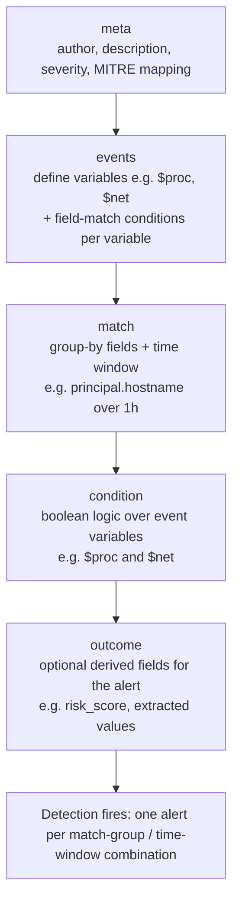

# Part XVIII — YARA-L / Google SecOps

This part is intentionally shorter than the Sigma, KQL, and SPL chapters. YARA-L is Google SecOps'
(formerly Chronicle) native detection language, and the practitioner population that writes it
directly is smaller than the Splunk/Sentinel/Elastic world — most SecOps deployments also run
Sigma-to-YARA-L translation for a chunk of their content. But the language has real properties
worth understanding on their own terms: it's built around a normalized event model (UDM) and
native multi-event, multi-entity correlation in a way that reads closer to a small state machine
than a single search query. If you already think in Sigma or SPL, the mental shift here is from
"one query over one event stream" to "named event variables joined by shared field values, with a
condition over how many of each you saw."

## The Unified Data Model (UDM)

[CONCEPT] Every log source ingested into Google SecOps — Windows Event Logs, Sysmon, firewall
logs, EDR telemetry, cloud audit logs, proxy logs — gets parsed into a common schema called the
Unified Data Model. A UDM event has a fixed top-level structure regardless of source:

- `metadata` — event type (e.g., `PROCESS_LAUNCH`, `NETWORK_CONNECTION`, `USER_LOGIN`), timestamp,
  vendor/product, log type.
- `principal` — the entity that initiated the action (process, user, host, IP).
- `target` — the entity acted upon.
- `src` / `target` network fields — IPs, ports, domains.
- `security_result` — for logs that already carry a verdict (EDR alerts, IDS hits): rule name,
  severity, action taken.

[ENGINEERING] The value of UDM is the same value proposition as Sigma's field mapping, OCSF, or
CIM in Splunk: write one detection against `principal.process.file.sha256` instead of writing one
version per vendor's raw field name (`Hashes`, `process.hash.sha256`, `FileHash`, `md5`, whatever
the specific product calls it that week).

**Engineering Reality:** UDM normalization quality is entirely dependent on the parser for that
specific log source, and Google-maintained parsers vary in completeness. A common failure mode:
you write a YARA-L rule against `principal.process.command_line`, it works perfectly against
Sysmon-sourced Windows process events, and it silently never fires against a different EDR vendor's
process telemetry because that vendor's parser populates `principal.process.file.full_path` and
leaves `command_line` empty, or truncates it, or puts arguments in a different field entirely. You
cannot assume a UDM field is populated just because the schema defines it — check actual parsed
output for your specific log source before you trust a field in production. This is the single
most common cause of "the rule never triggers" tickets in SecOps deployments.

## Rule Structure: meta, events, match, condition, outcome

A YARA-L 2.0 rule has a fixed section layout, borrowed loosely from YARA's own syntax (hence the
name), repurposed for log events instead of file bytes:



- **meta** — free-text metadata: author, description, severity, references, and (in practice, by
  convention rather than a hard requirement) MITRE ATT&CK technique IDs. Purely documentation —
  doesn't affect matching.
- **events** — the core of the rule. You declare one or more event *variables* (`$e1`, `$proc`,
  `$net`, whatever names you pick) and, for each, a set of UDM field conditions that must hold.
  Critically, variables can be **joined** by requiring the same field value across them (e.g.
  `$proc.target.process.pid = $net.principal.process.pid`), which is how YARA-L expresses "the
  process that made this network connection is the same process that was just spawned."
- **match** — the `match` section (used in multi-event rules) defines what you group by (typically
  hostname, user, or an entity ID) and the time window the correlation is scoped to — e.g. all
  qualifying events must occur within the same rolling window on the same host.
- **condition** — the boolean expression over your declared event variables: which combinations of
  `$e1`, `$e2`, etc. must all be present (logically true) for the rule to fire. This is where you
  express "process launch AND outbound connection AND NOT the usual parent."
- **outcome** — optional. Lets you compute and attach derived fields to the resulting alert/UDM
  detection record — a risk score, a concatenated list of matched process names, counts. This is
  what feeds severity or context into downstream case management rather than a bare "rule fired."

[DETECTION ENGINEER] The thing that trips people up coming from Sigma or SPL: in YARA-L, a single
rule can require multiple *distinct* UDM events to co-occur, joined on shared field values, within
one time window — natively, without a separate correlation search or a scheduled join job. In
Splunk this is usually a two-stage search (base search + subsearch/join) or a correlation search
built in the note-able-event framework. In YARA-L it's one rule.

## Multi-Event Correlation and Time Windows

The `match` section's time window is the scope boundary for the whole correlation — think of it as
"all these event variables must resolve to true for the *same* grouping key within *this* rolling
window," not "run this query once over a fixed historical range." Under the hood the backend
evaluates this as a continuous streaming/rolling detection over ingested UDM events, which is
different from a batch-scheduled search that runs every N minutes over a lookback window — you
don't control a cron-like schedule the way you do in Splunk saved searches or Sentinel scheduled
analytics rules; you control the correlation window itself.

**Hunter's Note:** the time window is your single biggest tuning lever and also your single
biggest blind spot. A 15-minute window catches a scripted "spawn shell, then immediately beacon"
sequence and misses an attacker who waits 20 minutes between steps deliberately to duck exactly
that kind of window. Widening the window to catch slow attackers increases the chance of
coincidental co-occurrence between unrelated legitimate events on a busy host (a user's browser
making a connection near-simultaneously with an unrelated scheduled task launching a process) —
that's your false-positive knob, not free width.

## Worked Example: Suspicious LOLBin Network Egress

**[part18-01] Rundll32 or Regsvr32 process launch immediately followed by an outbound connection
from that same process — a common shape for living-off-the-land C2 staging (MITRE ATT&CK
T1218.011 Rundll32, T1218.010 Regsvr32, broader Signed Binary Proxy Execution T1218).**

The behaviour: a LOLBin that's frequently abused to load a malicious DLL or execute a scriptlet
(`rundll32.exe`, `regsvr32.exe`) gets launched, and within the same short window that exact process
makes an outbound network connection — a shape rarely produced by the binary's legitimate uses
(most legitimate `rundll32` invocations are local, calling an exported function in a system DLL,
with no network activity at all).

```yaral
rule suspicious_lolbin_network_egress {
  meta:
    author = "detection-engineering-handbook"
    description = "rundll32/regsvr32 process launch followed by outbound network connection from the same process"
    severity = "MEDIUM"
    mitre_attack_technique = "T1218.011, T1218.010"

  events:
    $proc.metadata.event_type = "PROCESS_LAUNCH"
    $proc.target.process.file.full_path = /(?i)\\(rundll32|regsvr32)\.exe$/
    $proc.principal.hostname = $net.principal.hostname

    $net.metadata.event_type = "NETWORK_CONNECTION"
    $net.principal.process.file.full_path = $proc.target.process.file.full_path
    $net.principal.process.pid = $proc.target.process.pid
    $net.target.ip != ""
    // exclude RFC1918 destinations to cut internal-tooling noise; tune per environment
    not $net.target.ip = /^(10\.|172\.(1[6-9]|2[0-9]|3[0-1])\.|192\.168\.)/

  match:
    $proc.principal.hostname over 10m

  condition:
    $proc and $net

  outcome:
    $risk_score = 65
    $matched_binary = array_distinct($proc.target.process.file.full_path)
    $dest_ip = array_distinct($net.target.ip)
}
```

**[ANALYST]** what to check when this fires:

- **Parent process of `$proc`.** `regsvr32.exe` spawned by `explorer.exe` from an interactive user
  double-click is a very different story from `regsvr32.exe` spawned by `winword.exe` or
  `powershell.exe` moments after a phishing attachment opened. If the parent field isn't in this
  rule's join, pull it from the raw process-launch event during triage — don't assume it's benign
  just because the rule fired without it.
- **Command line arguments**, especially `regsvr32 /s /n /u /i:<url> scrobj.dll` (the classic
  Squiblydoo pattern) or a `rundll32` invocation pointing at a DLL in a user-writable path
  (`%TEMP%`, `%APPDATA%`, a mounted ISO/IMG mount point) rather than `system32`.
- **Destination reputation and TLS/JA3 fingerprint** if available — a LOLBin talking to a
  freshly-registered domain over a self-signed cert is a much stronger signal than the same
  connection to a long-lived, categorized destination.
- **Process file hash vs. path** — confirm the binary at that path is actually the legitimate
  signed Microsoft binary and not a renamed dropper sitting at a path that happens to match the
  filename regex (the regex here matches on filename, not signer — that's a known weak point, see
  below).

**[THREAT HUNTER]** variants this specific rule won't catch, worth a periodic hunt query instead
of a standing rule:

- Other LOLBins with similar proxy-execution abuse patterns not in this filename list —
  `mshta.exe`, `certutil.exe -urlcache`, `msiexec.exe /y`, `installutil.exe`. Same rule shape, swap
  the regex, or better, hunt across all of them with a broader `principal.process.file.full_path`
  IN-list join and manually review volume before turning it into a standing detection (each binary
  has a different legitimate-use baseline).
- Renamed binaries — copy `rundll32.exe` to `svchost32.exe`, run it from there. The filename regex
  won't match; a hunt should pivot on `original_file_name`/internal PE metadata where the parser
  populates it, not the on-disk filename, precisely because this rule's join condition trusts the
  filename.
- Delayed egress — process launches, sits idle past the 10-minute match window, then connects.
  Widening the window is the direct mitigation, at the false-positive cost described above.

**Detection Autopsy — the naive first draft of this rule:**

The first version most people write drops the PID join and just checks "same hostname, same
filename, within N minutes":

```
$proc.target.process.file.full_path = /(?i)\\(rundll32|regsvr32)\.exe$/
$net.principal.process.file.full_path = /(?i)\\(rundll32|regsvr32)\.exe$/
$proc.principal.hostname = $net.principal.hostname
```

It looked reasonable because on a quiet test host it fires correctly every time. What breaks in
production: on any host where `rundll32`/`regsvr32` legitimately runs more than once inside the
correlation window — which is common, since Windows itself invokes `rundll32` for a range of
Control Panel and shell-extension operations — you get **cross-matching**: process launch instance
A gets paired with an unrelated network connection from process launch instance B, because neither
event carries anything tying them to the *same* process instance beyond the shared filename. The
false positives cluster on hosts with routine `rundll32`-driven Control Panel activity (display
settings, add/remove programs applets) that happens to occur near legitimate, unrelated outbound
traffic from a second, coincidental `rundll32` invocation. The fix — adding the PID join alongside
the filename join, as in the revised rule above — collapses matching back down to "this literal
process instance," at the cost of missing cases where the correlating log source doesn't populate
PID consistently for both event types (a real risk with some agent parsers, worth verifying against
your actual ingested data before relying on the join). Tested by replaying two independent
`rundll32` launches with staggered unrelated network connections into a lab UDM feed and confirming
the PID-joined version no longer cross-matches while the naive version does.

## Second Example: Impossible Travel via UDM Login Events

**[part18-02] Two successful authentications for the same principal user from geographically
distant source IPs within an implausible time gap** — a coarse but genuinely useful correlation
that leans entirely on YARA-L's native multi-event join rather than needing a separate geo-lookup
pipeline stitched together after the fact (MITRE ATT&CK T1078 Valid Accounts).

```yaral
rule impossible_travel_login {
  meta:
    author = "detection-engineering-handbook"
    description = "same user account authenticates successfully from two IPs whose implied travel time is impossible within the observed gap"
    severity = "MEDIUM"
    mitre_attack_technique = "T1078"

  events:
    $login1.metadata.event_type = "USER_LOGIN"
    $login1.security_result.action = "ALLOW"
    $login1.principal.user.userid = $login2.principal.user.userid
    $login1.principal.ip != $login2.principal.ip

    $login2.metadata.event_type = "USER_LOGIN"
    $login2.security_result.action = "ALLOW"

  match:
    $login1.principal.user.userid over 1h

  condition:
    $login1 and $login2

  outcome:
    $source_ips = array_distinct($login1.principal.ip, $login2.principal.ip)
}
```

**[DETECTION ENGINEER]** this skeleton deliberately leaves out the actual distance/velocity math —
in a real deployment that logic either lives in the `outcome` section as a computed field fed by a
geo-IP enrichment already present on the UDM event (many parsers populate
`principal.location.country_or_region` or coordinates during ingestion), or the rule is narrowed to
"different countries" as a coarser proxy rather than true haversine-distance/time velocity, which
YARA-L's expression language isn't built to compute inline. Confirm your specific log source's UDM
parser actually populates location fields before assuming this rule sees anything beyond raw IPs —
plenty of on-prem AD/VPN log parsers don't enrich geo at ingest, and you'd need a separate
enrichment feed joined earlier in the pipeline.

**[SOC Management View]** impossible-travel is a classic "cheap to build, expensive to run" rule.
Coverage-wise it's real: it catches session-cookie theft, token replay, and straightforward
credential-stuffing-then-login-from-attacker-infra scenarios that plenty of other detections miss
entirely, and it needs no endpoint agent — pure identity-log signal. Cost-wise, without careful
tuning (VPN egress-IP flapping, corporate NAT changing on failover, mobile users switching
cellular-to-WiFi mid-session producing two logins from "different" IPs seconds apart, and any SSO
provider that logs a token refresh as a fresh login) it produces a steady trickle of low-value
tickets that erodes analyst trust in the rule within a few weeks. Budget explicit tuning time after
first deployment — this is not a "write once" rule, it needs an allowlist of known corporate egress
ranges and VPN concentrator IPs before it's usable at scale.

## When YARA-L Fits and When It Doesn't

| Scenario | YARA-L native fit | Notes |
|---|---|---|
| Single-event field-match detection | Good, but arguably overkill | If it's one event type and no join, Sigma-to-YARA-L translation or even a simpler UDM search often suffices. |
| Multi-event correlation within a time window, same host/user/entity | Strong fit — this is the language's reason to exist | Native `match` + variable joins beat bolting together separate searches. |
| Long-window behavioural baselining (weeks of history, statistical outliers) | Weak fit | YARA-L rules are built for rolling/streaming correlation, not long historical aggregation — that's a job for SecOps' search/dashboarding layer or an external analytics pipeline feeding results back in as enrichment. |
| Cross-org/cross-tenant threat intel matching | Good, if IOC matching is on your data (Google SecOps has separate IOC-matching mechanisms outside plain YARA-L rules) | Don't reinvent IOC matching inside a YARA-L rule if the platform's built-in matching feature already covers it. |

**[SCREENSHOT PLACEHOLDER — CONTROLLED LAB]** — Google SecOps rule editor showing a YARA-L rule's
`events`/`match`/`condition` sections alongside the retroactive detection results panel, captured
from a lab SecOps tenant ingesting Sysmon process-creation and network-connection UDM events, to
illustrate how the multi-event join in [part18-01] renders as a single grouped detection rather
than two separate alerts.

## Testing and Tuning Notes

[DETECTION ENGINEER] Google SecOps supports retrohunt — running a new or modified rule against
already-ingested historical UDM data before it goes live as a continuously-running rule. Always
retrohunt a new multi-event rule across at least a few days of real traffic before enabling it live
— the cross-matching failure mode in the Detection Autopsy above is invisible in a quiet lab and
obvious within hours of retrohunting against a real production UDM corpus with routine LOLBin
noise. Treat a clean retrohunt against a *small* synthetic dataset as no signal at all about
production false-positive rate; it only tells you the syntax is valid and the logic fires on the
case you built it for.

[ENGINEERING] Because matching depends entirely on shared UDM field values across event variables,
the most common silent failure in production isn't bad detection logic — it's a join field that's
populated for one log source feeding the rule and empty or differently-formatted for another. Pull
raw parsed UDM output for every log source that's supposed to feed a given rule and manually
confirm the join fields are populated and in the expected format before trusting the rule's
absence of alerts as "no malicious activity," rather than "the join silently never matches."
