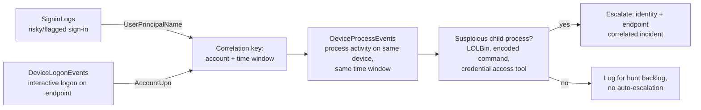

# Part XIX — KQL

## Why KQL Gets Its Own Part

Kusto Query Language runs Microsoft Sentinel, Defender XDR advanced hunting, Azure Monitor, and a
growing pile of adjacent products (Azure Data Explorer, Log Analytics, parts of Fabric). If you
work anywhere near a Microsoft-centric SOC, KQL is not optional tooling — it is the language you
think in. That makes it worth treating the same way we treated Sigma and SPL elsewhere in this
book: not as syntax to memorize, but as a way of expressing a hypothesis about attacker behaviour
against a specific set of tables with specific gaps.

[CONCEPT] KQL is a pipe-based query language. Data flows left to right through operators
separated by `|`, each one narrowing, reshaping, or aggregating the previous result set. If you've
used SPL or PowerShell pipelines, the mental model transfers almost directly — the main
differences are in join semantics, time handling, and the aggregation surface (`summarize` does a
lot of the heavy lifting that SPL splits across `stats`, `dedup`, and `eval`).

[ENGINEERING] Two schema families matter for detection work: **Sentinel/Log Analytics tables**
(`SigninLogs`, `AuditLogs`, `SecurityEvent`, `DeviceProcessEvents` via the Defender connector,
custom `_CL` tables) and **Defender XDR advanced hunting tables** (`DeviceProcessEvents`,
`DeviceNetworkEvents`, `DeviceLogonEvents`, `IdentityLogonEvents`, `EmailEvents`, `AlertEvidence`).
They share the query language but not always the same field names for the same concept — `SigninLogs`
uses `UserPrincipalName`, `IdentityLogonEvents` uses `AccountUpi` in some contexts and
`AccountObjectId` in others. Never assume a field name carries across tables; check the schema
reference for the specific table before you write the join.

## Core Operators for Detection Work

### `where` — filter early, filter often

```kql
SigninLogs
| where TimeGenerated > ago(1d)
| where ResultType == "0"
```

[DETECTION ENGINEER] `where` is your single biggest performance lever. Kusto pushes time-range
filters and simple equality filters down to the storage layer efficiently, so putting `where
TimeGenerated > ago(1d)` as close to the top of the query as possible — ideally as the very first
line after the table name — lets the engine skip whole data shards instead of scanning them and
discarding rows later. A query that filters on time first and string-contains second will
consistently outperform the same filters in reverse order, and on tables with retention in the
hundreds of GB/day the difference is minutes versus timeout.

**Engineering Reality**: `contains` and `has` are not interchangeable. `has` matches whole terms
using the built-in term index (fast, case-insensitive by default) and is what you want for
matching a command-line token like `mimikatz`. `contains` is a substring search that cannot use
the term index the same way and is meaningfully slower at scale, but it is the only correct choice
when the substring doesn't sit on a word boundary — e.g. matching `.ps1` inside `evil.ps1`, since
`has` tokenizes on non-alphanumeric characters and `.ps1` alone isn't a token. Pick `has`/`has_any`
whenever the thing you're matching is a delimited token; reach for `contains` only when it has to
match mid-token.

### `project`, `project-away`, `extend`

```kql
DeviceProcessEvents
| where Timestamp > ago(1h)
| where FileName =~ "powershell.exe"
| extend CmdLower = tolower(ProcessCommandLine)
| where CmdLower has_any ("-enc", "-encodedcommand", "downloadstring", "iex")
| project Timestamp, DeviceName, AccountName, ProcessCommandLine, InitiatingProcessFileName
```

`project` selects and can rename/compute columns; `extend` adds computed columns while keeping
everything else; `project-away` drops columns you don't want carried forward (useful before a
`join` to avoid column-name collisions you'd otherwise have to prefix). Building a `CmdLower`
column with `extend` before filtering on it is a common pattern — KQL string operators like `has`
are case-insensitive already for most operators, so this is mostly needed when you're about to do
an exact match (`==`) or a regex where case matters.

### `summarize`, `arg_max`, `make_set`, `bin`

This is where KQL earns its keep for detection logic — collapsing a firehose of raw events into
one row per entity per time window.

```kql
SigninLogs
| where TimeGenerated > ago(7d)
| where ResultType == "0"
| summarize
    SignInCount = count(),
    DistinctIPs = dcount(IPAddress),
    IPs = make_set(IPAddress, 10),
    Countries = make_set(Location, 10),
    LastSignIn = arg_max(TimeGenerated, *)
    by UserPrincipalName, bin(TimeGenerated, 1h)
```

- `arg_max(TimeGenerated, *)` returns the full row (all columns, via `*`) corresponding to the
  maximum value of `TimeGenerated` for each group — the standard KQL idiom for "give me the latest
  event per entity" without a separate sort-and-take-first. `arg_min` is the mirror for earliest.
- `make_set(column, N)` builds a deduplicated array of up to N values seen in the group — good for
  "which source IPs did this account authenticate from" without blowing up row count.
- `bin(TimeGenerated, 1h)` buckets timestamps into fixed-width windows, which is how you build
  time-series aggregation (sign-ins per hour, bytes transferred per 5-minute window) instead of
  collapsing the whole time range into one row.

**Hunter's Note**: `dcount()` is an approximate distinct count using the HyperLogLog algorithm
under the hood — fast, low memory, and usually within a percent or two of exact even at scale.
For fewer than a few hundred distinct values it's exact anyway. It is the right default; only
switch to `count_distinct` — the exact form your organization's Kusto documentation may reference
under `hll`/`dcount` internals — if you're building a compliance-grade count where "approximately
14 distinct source IPs" is not an acceptable answer, e.g., a legal-hold export.

### `join` — the operator that will make or break your query's runtime

```kql
let RiskySignins = SigninLogs
    | where TimeGenerated > ago(1d)
    | where RiskLevelDuringSignIn in ("high", "medium");
AuditLogs
| where TimeGenerated > ago(1d)
| where OperationName in ("Add member to role", "Update user", "Add app role assignment")
| join kind=inner (RiskySignins) on $left.InitiatedBy == $right.UserPrincipalName
```

[ENGINEERING] KQL join performance is dominated by which side is smaller and which side is on the
left. Kusto's default join strategy broadcasts the **right-hand** table to all nodes computing the
left-hand side, so the convention — and the one Microsoft's own performance docs push — is: put
the smaller, pre-filtered result set on the right, and the larger table on the left, already
filtered down as far as possible before the join executes. A `join` between two unfiltered
multi-terabyte tables over a 30-day window is the single most common cause of a Sentinel analytics
rule timing out or a hunting query never returning. Always filter both sides on time and on
whatever narrow predicate you can before the `join` line, not after.

`kind=inner` (default), `leftouter`, `rightouter`, `leftsemi`, `rightsemi`, `leftanti`,
`rightanti` are the join kinds you'll actually use. `leftanti` is underrated for detection: "give
me every sign-in that did NOT have a matching MFA-satisfied conditional access record" is a
`leftanti` join, not an `inner` join with a negation bolted on.

### `union` — searching across tables you don't fully trust to agree

```kql
union isfuzzy=true
    (DeviceProcessEvents | where Timestamp > ago(1h) | project Timestamp, DeviceName, AccountName, Detail = ProcessCommandLine, Source = "MDE"),
    (SecurityEvent | where TimeGenerated > ago(1h) | where EventID == 4688 | project Timestamp = TimeGenerated, DeviceName = Computer, AccountName = SubjectUserName, Detail = CommandLine, Source = "WinEvent")
```

`isfuzzy=true` tells Kusto not to fail the whole query if one of the underlying tables doesn't
exist in this workspace (common when a customer hasn't onboarded a particular connector). This is
the pattern for building one hunt that works whether an org sends process creation via Defender
for Endpoint, Sysmon-via-AMA, or plain Security 4688 — genuinely useful when you're writing content
meant to ship to multiple tenants with different telemetry maturity, and a footgun if you forget
it and a query silently returns zero rows for a customer missing one table, with no error to tell
you why.

### `let` — named subqueries and readability

`let` binds a name to a scalar, a list, or a tabular expression for reuse later in the query (as
shown with `RiskySignins` above). For detection content meant to be maintained by more than one
person, `let` blocks documenting each named threshold (`let ImpossibleSpeedKmh = 900;`) are worth
the extra lines — six months later nobody remembers why `900` appears bare in a `where` clause.

## Worked Example 1 — Impossible Travel (part19-01)

**Behaviour**: a valid credential authenticates from two geographically distant locations within a
time window too short for physical travel, and no reasonable explanation (VPN egress change,
mobile carrier NAT reassignment) accounts for it.

[ANALYST] What you're actually looking at when this fires: two `SigninLogs` rows, same UPN,
different city/country, timestamps close together. The question you have to answer before
escalating is whether the "distance" is real geography or an artifact of IP geolocation databases
disagreeing about a CDN or corporate VPN exit node. Corporate VPN concentrators, cloud provider
egress NAT pools, and satellite/mobile carrier IP reassignment are the three biggest sources of
false positives, in that order.

```kql
// part19-01: Impossible travel via successful sign-ins
let TimeWindow = 1h;
let MinKmh = 900.0; // conservative — commercial flight speed, leaves room for genuine travel
SigninLogs
| where TimeGenerated > ago(1d)
| where ResultType == "0"
| where isnotempty(LocationDetails.geoCoordinates.latitude)
| project
    TimeGenerated,
    UserPrincipalName,
    IPAddress,
    City = tostring(LocationDetails.city),
    Country = tostring(LocationDetails.countryOrRegion),
    Lat = todouble(LocationDetails.geoCoordinates.latitude),
    Lon = todouble(LocationDetails.geoCoordinates.longitude)
| sort by UserPrincipalName asc, TimeGenerated asc
| serialize
| extend PrevTime = prev(TimeGenerated), PrevLat = prev(Lat), PrevLon = prev(Lon),
         PrevCity = prev(City), PrevUser = prev(UserPrincipalName)
| where UserPrincipalName == PrevUser
| extend HoursBetween = datetime_diff('second', TimeGenerated, PrevTime) / 3600.0
| where HoursBetween > 0 and HoursBetween < 12
| extend DistanceKm = geo_distance_2points(PrevLon, PrevLat, Lon, Lat) / 1000.0
| extend RequiredKmh = DistanceKm / HoursBetween
| where RequiredKmh > MinKmh and DistanceKm > 300
| project TimeGenerated, UserPrincipalName, PrevCity, City, DistanceKm, HoursBetween, RequiredKmh, IPAddress
```

[DETECTION ENGINEER] Notes on why this query is built the way it is:

- `serialize` before `prev()` is required — `prev()`/`next()` only work on a row order Kusto
  guarantees stable, and `serialize` is what locks that order in after the `sort`. Skip it and the
  window functions can silently return inconsistent results depending on how Kusto parallelizes
  the query.
- Comparing `UserPrincipalName == PrevUser` after the `prev()` calls is how you avoid computing
  "distance" between the last sign-in of user A and the first sign-in of user B, which is what
  happens if you forget this check — a subtle bug that produces impossible-looking numbers for
  pairs of unrelated users.
- `geo_distance_2points` is a real Kusto geo function that returns meters, hence the `/1000.0`.
- The `DistanceKm > 300` floor exists because at short distances even a modest clock skew or
  geolocation database imprecision produces a triple-digit `RequiredKmh` for perfectly normal
  travel (someone driving between two cities 40km apart in 20 minutes shows as "impossible" by pure
  math but is mundane).

**What legitimate activity looks like the same**: shared service accounts authenticating from
multiple SaaS-to-SaaS integration IPs in different regions; users behind carrier-grade NAT whose
egress IP geolocates to a different city between requests; travelling users who genuinely flew
and whose second sign-in lands just outside your window's plausibility because the geolocation
database placed their departure airport IP in the wrong city.

**Detection Autopsy**

> **Original logic** (a common first draft): "alert if the same user has two sign-ins from
> different countries within 1 hour." No speed calculation, just country-change-plus-time.
>
> **Why it looked reasonable**: it's simple, cheap to compute, and catches the textbook case
> (login from Country A, ten minutes later from Country B).
>
> **What breaks in production**: users on corporate VPN clients that rotate exit nodes between
> a US and EU pop mid-session generate this constantly. So do users with a personal VPN or
> privacy browser extension. Mobile users switching between WiFi and cellular can flip
> country-level geolocation in seconds with zero travel. The false-positive rate on this version
> in a mixed remote-workforce org is high enough that analysts start auto-closing the alert type
> within two weeks, which is the real failure mode — not that it's technically wrong, but that it
> trains the SOC to ignore it.
>
> **False negatives**: an attacker using a proxy in the *same* country as the victim (increasingly
> common — residential proxy services sold specifically to defeat impossible-travel detection)
> never triggers this rule at all, country-change or speed-based.
>
> **Missing context**: no distance/speed math, no allowlist for known corporate VPN egress
> ranges, no correlation with device compliance state (a compliant, previously-seen device is a
> different risk than a brand-new unmanaged device appearing in a new country).
>
> **Revised analytic**: the query above — actual great-circle distance and required speed, a
> plausibility floor, same-user enforcement via `prev()`, and (in production) a suppression list
> for known VPN/proxy egress CIDR ranges maintained as a watchlist, applied as a `join
> kind=leftanti` before the final `project`.
>
> **How it was tested**: illustrative for this chapter — in a live environment you'd validate
> against a Sentinel workspace with `SigninLogs` populated from Entra ID, seed two sign-ins for a
> test account from a VPN exit node and a mobile hotspot to confirm expected true positives, and
> replay 30 days of production `SigninLogs` through both the naive and revised query to compare
> alert volume.
>
> **Result**: distance/speed-based version with a VPN-range exclusion is the shape most mature
> Sentinel content packs converge on; country-change-only versions are what you find in
> quickstart templates and should be treated as a starting point, not shippable content.

## Worked Example 2 — Risky Sign-In Followed by a Privileged Operation (part19-02)

**Behaviour**: an account authenticates under conditions Entra ID's own risk engine flags (new
location, anonymized IP, atypical travel, leaked credential match), and shortly afterward performs
a sensitive directory operation — adding itself or another principal to a privileged role,
registering a new OAuth application, or adding credentials to an existing app registration. This
is the "initial access confirmed, now watch for privilege escalation" pattern and maps well to
ATT&CK T1078 (Valid Accounts) chained into T1098 (Account Manipulation) or T1136 (Create Account).

```kql
// part19-02: Risky sign-in followed by privileged directory operation within 30 minutes
let LookbackWindow = 1d;
let CorrelationWindow = 30m;
let SensitiveOps = dynamic([
    "Add member to role",
    "Add app role assignment to service principal",
    "Add service principal credentials",
    "Update application – Certificates and secrets management",
    "Add owner to application"
]);
let RiskySignins = SigninLogs
    | where TimeGenerated > ago(LookbackWindow)
    | where ResultType == "0"
    | where RiskLevelDuringSignIn in ("high", "medium") or RiskState == "atRisk"
    | project SignInTime = TimeGenerated, UserPrincipalName, IPAddress, RiskLevelDuringSignIn, CorrelationId;
AuditLogs
| where TimeGenerated > ago(LookbackWindow)
| where OperationName in (SensitiveOps)
| extend InitiatedByUpn = tostring(InitiatedBy.user.userPrincipalName)
| join kind=inner RiskySignins on $left.InitiatedByUpn == $right.UserPrincipalName
| where TimeGenerated - SignInTime between (0min .. CorrelationWindow)
| project
    OperationTime = TimeGenerated,
    SignInTime,
    UserPrincipalName,
    OperationName,
    RiskLevelDuringSignIn,
    IPAddress,
    TargetResources = tostring(TargetResources),
    CorrelationId
| sort by OperationTime desc
```

[ANALYST] Triage priority for a hit on this: first confirm the risk signal wasn't already
investigated and dismissed (check Entra ID Identity Protection risk detections for that
`CorrelationId` — a "medium risk, unfamiliar sign-in properties" the user themselves confirmed
last week is different from a fresh one). Second, look at exactly what the target of the
`AuditLogs` operation was — a role addition where the target is the account's own object ID is a
much stronger signal than an admin adding a *different* user to a role, which could be routine.

[THREAT HUNTER] Variants worth hunting even when this exact query doesn't fire: the same pattern
but where the "sensitive operation" is a **Microsoft Graph API call** rather than a portal/PowerShell
audit event — those show up in `MicrosoftGraphActivityLogs` if that connector is enabled, and
attackers increasingly prefer Graph API calls with a stolen token/refresh token precisely because
some legacy detection content only watches `AuditLogs` UI-driven operations. Also hunt for the
inverse ordering — privileged operation first, risky sign-in flagged afterward — which happens
when Identity Protection's risk scoring lags the actual sign-in event by several minutes.

**What's missing/optional here**: `RiskLevelDuringSignIn` requires Entra ID P2 (Identity
Protection) licensing — without it this field is empty and the whole correlation degrades to
"just show me sensitive operations," which is a much noisier starting point. Confirm licensing
before you ship this as content; it's a common reason a customer's "it's not firing" ticket turns
out to be a licensing gap, not a query bug.

## Worked Example 3 — Entity Correlation Across Sign-In and Endpoint Tables

This is the pattern for stitching an identity-plane event to an endpoint-plane event using a
shared entity (account or device) rather than a shared session ID, which usually doesn't exist
across products.



```kql
let Account = "jdoe@contoso.com";
let Window = 2h;
let AnchorTime = datetime(2026-09-14T03:10:00Z); // from the flagged SigninLogs row
DeviceLogonEvents
| where Timestamp between (AnchorTime .. AnchorTime + Window)
| where AccountUpn =~ Account
| project LogonTime = Timestamp, DeviceName, AccountUpn, LogonType, RemoteIP
| join kind=inner (
    DeviceProcessEvents
    | where Timestamp between (AnchorTime .. AnchorTime + Window)
    | where AccountUpn =~ Account
    | project Timestamp, DeviceName, FileName, ProcessCommandLine, InitiatingProcessFileName
) on DeviceName
| where Timestamp >= LogonTime
| project LogonTime, DeviceName, RemoteIP, ProcessTime = Timestamp, FileName, ProcessCommandLine, InitiatingProcessFileName
| sort by ProcessTime asc
```

**Reliable vs. optional vs. evadable traces in this chain**: the `SigninLogs` risk flag is
reliable as a starting point but coarse. `DeviceLogonEvents` reliably ties an identity to a
specific endpoint for interactive/RDP/network logons but is absent for sign-ins that never touch
an onboarded, Defender-for-Endpoint-enrolled device (SaaS-only access, BYOD without the agent).
`ProcessCommandLine` in `DeviceProcessEvents` is the most useful field and the most evadable — an
attacker who renames binaries, uses in-memory execution, or leans on living-off-the-land binaries
with innocuous-looking arguments defeats naive string matching here, which is why this correlation
is meant as a pivot for a human hunter, not a standalone auto-close rule.

## Performance Considerations Worth Internalizing

| Practice | Why it matters | What it looks like |
|---|---|---|
| Filter on time first | Time-range predicates prune data at the storage/shard level before anything else runs | `where TimeGenerated > ago(1d)` as line 2, not buried after five other filters |
| Filter before join, not after | Joins cost scales with both input sizes; filtering post-join still paid the full join cost | Move `where` clauses into the `let` subquery feeding the join |
| Smaller table on the right of `join` | Kusto's default (`shuffle`-free) join broadcasts the right side | Put the pre-aggregated/pre-filtered result on the right |
| Prefer `has`/`has_any` over `contains` for token matches | Term index lookup vs. full substring scan | `has "mimikatz"` not `contains "mimikatz"` when it's a clean token |
| Avoid `TimeGenerated` in `extend`/derived filters when a native predicate exists | Native operators can be pushed down; computed-column filters can't | Filter on the raw column, compute derived columns after |
| Use `summarize` to shrink before further joins/unions | Reduces row count feeding downstream operators | Aggregate per-entity first, then join the small result to a reference table |
| Cap `make_set`/`make_list` size | Unbounded set/list accumulation on high-cardinality columns eats memory | `make_set(IPAddress, 20)` not bare `make_set(IPAddress)` |
| Materialize expensive repeated subqueries with `let` + `materialize()` | Avoids recomputing the same subquery multiple times in one query | `let X = materialize(ExpensiveQuery);` when `X` is referenced more than once |

**Engineering Reality**: query timeouts in Sentinel/Log Analytics are not purely a "your KQL is
bad" problem — they're also a function of workspace ingestion volume, table tier (Analytics vs.
Basic vs. Auxiliary logs, which have different query performance characteristics and Auxiliary in
particular is not queryable the same way), and how many other scheduled analytics rules are
competing for the same compute at the same five-minute mark. A query that runs fine in the
portal's ad-hoc editor can behave differently as a scheduled analytics rule running on a tight
frequency against the same underlying data, purely due to concurrent load — budget for that when
you're tuning a rule's schedule and lookback window, not just its logic.

**SOC Management View**: KQL query cost isn't billed per-query the way some SIEM licensing
models charge per search, but it is a real constrained resource — Log Analytics workspaces have
query concurrency limits, and a handful of badly-written hunting queries (unfiltered joins over
30-day windows, run interactively by several analysts at once) can degrade or throttle scheduled
analytics rules for the whole workspace. Track query performance as a governance item, not just a
detection-quality item: a detection engineer who ships a rule that regularly takes 4 of a 5-minute
scheduling window to execute has built technical debt that will eventually cause missed detection
windows, not just a slow dashboard.

## Testing and Tuning Checklist

- **Test with a known-benign account first.** Run any new correlation query (impossible travel,
  risky-sign-in-to-privileged-op) against a service account or your own account's history before
  trusting the output — service accounts and CI/CD identities are the most common source of
  "impossible" false positives because they legitimately authenticate from many IPs in short
  windows.
- **Check field population before trusting a filter.** `RiskLevelDuringSignIn`,
  `LocationDetails.geoCoordinates`, and similar enriched fields depend on licensing tiers and
  connector configuration. An empty-string filter match isn't the same as "no risk" — it can mean
  "no data."
- **Validate join keys for case and type.** `UserPrincipalName` casing can differ between
  `SigninLogs` and `AuditLogs`'s nested `InitiatedBy` JSON depending on how the value was
  originally written to the directory; use `=~` (case-insensitive equality) or `tolower()` on both
  sides rather than assuming exact match.
- **Re-run after schema changes.** Microsoft periodically adds/renames columns in Defender XDR
  advanced hunting tables (this has happened to `DeviceInfo` and identity table fields before) —
  pin a review cadence for production detection content, not just a "set and forget."
- **Backtest against a real incident if you have one.** If a past incident has a confirmed
  timeline, replay the query against that historical window with the time bounds adjusted — this
  is the highest-confidence tuning signal you'll get, better than any synthetic test.

> **[SCREENSHOT PLACEHOLDER — CONTROLLED LAB]** — Sentinel Logs blade showing the impossible-travel
> query (part19-01) executed against a live workspace populated from a test Entra ID tenant, with
> the results grid showing `PrevCity`, `City`, `DistanceKm`, and `RequiredKmh` columns populated
> for a seeded two-location test sign-in pair. Would illustrate actual `geo_distance_2points`
> output and confirm the `prev()`/`serialize` row-ordering logic behaves as expected against real
> `SigninLogs` data rather than only in theory.

## Sample Log Shape (Conceptual)

```text
CONCEPTUAL SAMPLE — not captured output, illustrative SigninLogs row shape only:

TimeGenerated: 2026-09-14T03:11:02Z
UserPrincipalName: jdoe@contoso.com
IPAddress: 203.0.113.44
ResultType: 0
RiskLevelDuringSignIn: medium
LocationDetails: {"city":"Warsaw","countryOrRegion":"PL","geoCoordinates":{"latitude":52.23,"longitude":21.01}}
```

## Where This Connects

The correlation patterns here — identity risk signal into endpoint pivot, sign-in into directory
operation — are the KQL-specific expression of the same entity-correlation principle covered
generally in the telemetry-fusion material earlier in this book. What's specific to KQL is the
`join`/`summarize`/`arg_max` toolkit for building that correlation cheaply, and the discipline of
filtering early enough that the correlation query survives contact with a production-sized
workspace instead of timing out before it tells you anything.
