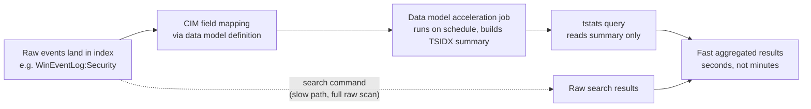

# Part XX — Splunk SPL

## Why SPL matters for detection engineering

[CONCEPT] SPL (Search Processing Language) is Splunk's query language, and it shows its lineage: it started life as a way to grep and pipe text, and the pipe-chain mental model never went away. Every SPL search is a pipeline — a base search that pulls raw or indexed events, followed by a series of commands separated by `|` that each transform the result set handed to them. If you've used Unix pipelines, the mental model transfers almost directly; the difference is that the first stage of the pipeline (the base search before the first `|`) is not like the rest — it decides how much data gets pulled off disk, and that decision is where most SPL performance problems and most SPL correctness bugs originate.

For a detection engineer, the practical consequence is: the same behavioural logic can be written as fast, accurate SPL or as slow, wrong SPL, and the difference is rarely the analytic idea — it's how you selected the initial event set and which command you reached for to aggregate it.

This chapter covers the commands you'll actually use to build production detections: `stats`, `eval`, `rex`, `transaction` (and why you should treat it with suspicion), `streamstats`, `eventstats`, `tstats` against accelerated data models, `lookup`, and how these combine into a risk-scoring layer rather than a pile of independent point-in-time alerts.

## Search fundamentals: what happens before the first pipe

```spl
index=win_security sourcetype=WinEventLog:Security EventCode=4624 Logon_Type=3
```

[ENGINEERING] Everything left of the first `|` is evaluated against Splunk's indexed fields and time-series index (the TSIDX files), which is fast, and then against raw text search, which is slower. `index=`, `sourcetype=`, `host=`, and any field that Splunk indexes at search time from structured fields (or that you've made into an indexed extraction) are cheap. Free-text terms like `EventCode=4624` are cheap too because Splunk indexes tokens from the raw event text — `4624` is a token. But something like `CommandLine="*powershell*-enc*"` is expensive: wildcards at the start of a term force Splunk to fall back to scanning raw events rather than using the token index efficiently, and the more permissive the wildcard, the worse it gets.

**Hunter's Note:** if a search feels slow, the first thing to check isn't the stats logic at the end — it's whether the base search is doing a full raw scan because someone put a leading wildcard on a big field. `*mimikatz*` against `CommandLine` on a high-volume index will make a fast SIEM feel like a slow one.

[SOC MANAGEMENT VIEW] Search cost is a real operational cost on shared search head / indexer infrastructure — a badly scoped scheduled search that scans a 90-day window every 5 minutes competes for the same search slots as an analyst's incident-response query. Detection content reviews should include a search-cost pass, not just a logic pass, especially before content goes into a saved/scheduled search that runs continuously.

## stats, eventstats, and streamstats — three different aggregation models

These three commands look similar (all produce statistics) but solve different problems, and confusing them is one of the most common SPL correctness mistakes.

| Command | What it does | Output shape | Typical detection use |
|---|---|---|---|
| `stats` | Aggregates events into a new, smaller result set, one row per group-by key | Collapses events — original per-event fields are gone unless you kept them via `values()`/`list()` | Counting distinct hosts a user touched, counting failed logons per source IP |
| `eventstats` | Computes the same aggregate stats as `stats`, but appends them as new fields onto the *original, ungrouped* events | Same number of rows as input, with new summary columns added | Flagging events where a per-event value (e.g. bytes transferred) is far above the *session's* average, without losing the individual event |
| `streamstats` | Computes a running aggregate over events *in the order they arrive in the pipeline*, updating as it goes | Same number of rows, with a cumulative/rolling field added | Detecting the Nth failed logon in a rolling window, rate-of-events-per-time detections, "3rd distinct host in 10 minutes" logic |

[DETECTION ENGINEER] The distinguishing question to ask yourself: do I need to lose the individual events (use `stats`), do I need to keep every event but compare it to a group-wide summary (use `eventstats`), or do I need a value that changes as I walk through events in time order (use `streamstats`)? A very common mistake is using `stats count` to say "user X logged into 6 hosts today" and then not being able to answer "which 6, and in what order, and from where" because the per-event detail was discarded — `stats ... values(dest) values(_time)` fixes that by keeping representative values alongside the aggregate.

`streamstats` requires sorted input to mean anything time-wise — if your events aren't already time-ordered when they hit `streamstats`, add `sort 0 _time` first, and know that a full re-sort on a large result set is not free.

## eval and rex — building fields SPL doesn't hand you

[CONCEPT] `eval` creates or overwrites a field using an expression (arithmetic, string functions, conditionals via `if()`/`case()`, time math). `rex` runs a regular expression against an existing field (usually `_raw` or a parsed field) and extracts named capture groups as new fields, at search time, without touching how the data was originally indexed.

```spl
| eval is_admin_share=if(match(ShareName, "(?i)^\\\\?(ADMIN\$|C\$|IPC\$)$"), 1, 0)
| rex field=CommandLine "(?i)-enc(?:odedcommand)?\s+(?<b64_payload>[A-Za-z0-9+/=]{20,})"
```

[ANALYST] `rex` is what you reach for when the field you need was never parsed out by the source's field extraction — for example, pulling a Base64 blob out of an obfuscated PowerShell command line, or pulling a parent process's PID out of a raw Sysmon message. It's search-time work, which means it's flexible (no re-index needed to try a new pattern) but also repeated on every search that runs it — a `rex` on a huge index over a wide time range is doing real regex work over every matching event, every time.

**Engineering Reality:** if you find yourself writing the same `rex` pattern in five different detections, that's a signal the source's field extraction (or a `TRANSFORMS`/`props.conf` indexed/search-time extraction) should be doing that work once, centrally, not five analysts maintaining five slightly different regexes that will drift out of sync the first time someone tunes one of them.

## transaction — powerful, and the command most likely to quietly break your detection

[CONCEPT] `transaction` groups events into "transactions" based on shared field values and time/event proximity — commonly used to stitch together, say, a VPN session's start and end event, or a sequence of firewall events that represent one flow.

```spl
index=vpn sourcetype=vpn_session (event=start OR event=end)
| transaction user host startswith=eval(event="start") endswith=eval(event="end") maxpause=30m
```

That looks clean. Here is where it breaks in practice.

### Detection Autopsy: the naive "lateral movement session" transaction

**Original logic:** an analyst wanted to detect "a user authenticates to 3+ distinct hosts within a short window," reasoning that `transaction` was built for exactly this kind of session-stitching:

```spl
index=win_security EventCode=4624 Logon_Type=3
| transaction user maxspan=10m maxpause=5m
| where eventcount>=3
| stats values(dest) as hosts by user
```

**Why it looked reasonable:** `transaction` groups by `user`, and `eventcount` conveniently tells you how many raw events landed in each grouped transaction. It reads like it directly implements the requirement.

**What breaks in production:**

1. **It doesn't deduplicate by host.** `transaction` counts *events*, not *distinct hosts*. A user with 3 logons to the *same* host in 10 minutes (completely normal — think a scheduled task re-authenticating, or a user's client retrying) satisfies `eventcount>=3` and fires, while a real lateral-movement chain across exactly 2 hosts with a third quick reconnect to the first doesn't get flagged as "3 distinct hosts" logic even though the analyst thinks that's what they wrote.
2. **`transaction` is memory-hungry and slow at scale.** It has to hold open transactions in memory while it scans, and on a high-volume index (domain-wide 4624 events) this is one of the more expensive commands in SPL. It does not parallelize the way `stats`-based approaches do across indexers, because transaction boundary logic requires event-order awareness within each group.
3. **Silent transaction truncation.** Splunk has internal limits on transaction size/duration (`maxopentxn`, `maxopenevents` in `transactions.conf`) — if those limits are hit under load, transactions get closed early or events get dropped from consideration, and the search gives no obvious error, it just silently produces an incomplete answer. A detection that "usually works" but occasionally misses events on the busiest hosts, with no error to explain why, is a bad detection to have in production.
4. **Ordering assumption.** If `4624` events for the same user arrive out of strict time order across indexers (clock skew, indexing delay), `transaction`'s pause/span logic can split what should be one session into two, each individually under threshold.

**False positives:** repeated same-host reauthentication, service accounts with legitimate rapid multi-host access (backup agents, EDR consoles, patch management), load-balanced RDP gateways that generate multiple 4624 events per real session.

**False negatives:** the exact "3 distinct hosts" case the rule was meant to catch, if any of the 3 logons collapse into fewer transactions due to timing, or if an attacker deliberately spaces hops beyond `maxpause`.

**Missing context:** no distinction between logon types beyond the initial filter carried through cleanly, no source IP correlation, no check for whether the account is a service account expected to touch many hosts.

**Revised analytic**, using `stats` with `dc()` (distinct count) instead of `transaction`, which is both more correct and dramatically cheaper at scale:

```spl
index=win_security sourcetype=WinEventLog:Security EventCode=4624 Logon_Type=3
| bucket _time span=10m
| stats dc(dest) as distinct_hosts values(dest) as hosts_touched earliest(_time) as first_seen latest(_time) as last_seen by user, _time
| where distinct_hosts>=3
| lookup service_account_lookup user OUTPUT is_service_account
| where isnull(is_service_account) OR is_service_account=0
```

**How it was tested:** run against a known red-team exercise dataset (or a lab-generated PsExec/WMI lateral-movement chain across 3+ hosts within 10 minutes) and confirm the revised search fires once per real chain; run against 30 days of production 4624 volume and confirm the service-account lookup suppresses the expected noisy accounts without suppressing the red-team account (which shouldn't be in the lookup).

**Result:** the `dc()`-based version is both an order of magnitude cheaper (no in-memory transaction stitching, fully summarizable via `stats`, works with `tstats` if the fields are in a data model) and semantically correct for "distinct hosts," which is what the requirement actually was. `transaction` is still the right tool when you genuinely need *session boundaries* (start/end pairing, total session duration, ordered event sequences within one grouping) rather than *distinct-value counting* — the mistake was reaching for it out of habit rather than matching the command to the actual question.

**When `transaction` is still the right call:** pairing a firewall "connection start" with "connection end" to compute session duration and bytes transferred, or reconstructing a multi-step authentication flow (Kerberos AS-REQ → AS-REP → TGS-REQ) where order and pairing genuinely matter and volumes are modest enough that the memory/performance cost is acceptable.

## tstats and data models — where the real performance lives

[ENGINEERING] Raw `search` commands scan events. `tstats` scans a *data model acceleration summary* — a pre-built, columnar, statistics-oriented index (TSIDX-backed) that Splunk maintains in the background against a defined data model (commonly the CIM — Common Information Model — data models like `Authentication`, `Network_Traffic`, `Endpoint.Processes`, `Web`). Because the summary is already field-extracted and pre-aggregated in a search-friendly form, `tstats` queries over the *same time range and same underlying data* run dramatically faster than an equivalent raw `search` — often the difference between a query that finishes in seconds versus one that takes many minutes on a high-volume index, because `tstats` never has to touch the raw `_raw` text at all for the fields the model covers.



The tradeoffs:

- **Acceleration lag.** The summary is built on a schedule (commonly every 5–10 minutes, configurable). A `tstats` query is only as current as the last acceleration build — for near-real-time detection this matters; know your acceleration interval before you promise an SLA on alert latency.
- **Field coverage.** `tstats` can only use fields that are part of the accelerated data model. If your detection needs a field that isn't CIM-mapped for that source (a vendor-specific field not in the standard `Authentication` model, for example), you either extend the data model or you're back to raw `search`.
- **Storage cost.** Acceleration summaries consume additional disk on indexers — accelerating every data model over every index "just in case" is a real capacity-planning cost, not a free performance win.
- **CIM compliance is a prerequisite, not a given.** If your source's field extraction doesn't correctly populate the CIM fields the data model expects (`Authentication.action`, `Authentication.user`, `Authentication.src`, etc.), `tstats` results will be silently wrong or empty — this is a common failure mode when onboarding a new log source: the raw data is fine, but nobody validated the CIM mapping, so accelerated searches quietly return nothing or return incomplete results while raw `search` against the same index looks fine.

**Engineering Reality:** "just use tstats" is good advice only after someone has verified the CIM mapping for that specific source actually populates the fields your search depends on. Test every new tstats-based detection with a raw `search` over the same window and compare counts before trusting it — this catches CIM mapping gaps that produce false negatives with zero error output.

## Worked example: password spray detection with tstats + risk scoring

[THREAT HUNTER] Password spraying (T1110.003) shows up as many accounts, each with a handful of failures, from a small number of source IPs, in a short window — the opposite signature of classic brute force (one account, many failures). The detection needs distinct-account counting per source, not simple failure counting.

```spl
| tstats summariesonly=true count as failure_count
    from datamodel=Authentication.Authentication
    where Authentication.action=failure
    by Authentication.src, Authentication.user, _time span=15m
| stats dc(Authentication.user) as distinct_users sum(failure_count) as total_failures values(Authentication.user) as targeted_users by Authentication.src
| where distinct_users>=10 AND total_failures>=15
| lookup src_ip_reputation_lookup src as Authentication.src OUTPUT reputation_score
| eval risk_score=case(
    distinct_users>=25, 80,
    distinct_users>=10, 50,
    true(), 20)
| eval risk_score=risk_score + coalesce(reputation_score,0)
| where risk_score>=50
| table _time, Authentication.src, distinct_users, total_failures, targeted_users, risk_score
```

*(Illustrative SPL — field names assume the standard CIM `Authentication` data model; verify against your own data model deployment and acceleration status before relying on this unmodified.)*

[DETECTION ENGINEER] Notes on this analytic:

- `summariesonly=true` forces `tstats` to use *only* the accelerated summary, never falling back to raw search for gaps — this keeps the query fast but means you must trust the acceleration is current and complete; drop `summariesonly` during testing to compare.
- The `by ... _time span=15m` bucketing happens inside `tstats`, which is much cheaper than bucketing after the fact over raw events.
- The second `stats` collapses the 15-minute buckets per source IP — this is where "how many distinct users did this source try" actually gets computed; getting this distinct-count logic right at the `tstats` stage vs. the follow-on `stats` stage is the crux of the whole detection.
- The `lookup` against a source-IP reputation table (fed from threat intel — could be a CSV lookup, a KV store lookup, or an external lookup script) adds context without requiring the base logic to know anything about threat intel.
- The risk score isn't a verdict, it's a triage input — this is the beginning of a risk-based alerting layer (conceptually similar to what Splunk Enterprise Security calls Risk-Based Alerting), where individual detections contribute a score to an entity (user, host, or in this case source IP) rather than each firing an independent, equally-weighted alert. An analyst then looks at *why* an entity's cumulative score crossed a threshold, which is a richer starting point than "rule X fired."

**What legitimate activity looks similar:** a misconfigured application doing repeated auth attempts against a shared service account list (e.g., a broken monitoring tool retrying against several test accounts), a password-expiry event causing many users to fail login the same morning from a VPN concentrator's shared egress IP, a NAT gateway aggregating many real users' occasional typos into one apparent "source."

**Tuning path:** exclude known NAT/VPN egress IPs from the `distinct_users` threshold (or raise the threshold specifically for those sources), add a check for whether targeted accounts overlap with a known valid-user list (spray tools sometimes guess usernames that don't exist, producing a different Windows error code worth splitting out), and correlate with subsequent *successful* logons from the same source within the following hour — a spray that gets zero successes is lower priority than one immediately followed by a 4624 for one of the targeted accounts.

**How to test:** run a scripted spray in a lab (a handful of accounts, deliberately below individual-account lockout thresholds, from one source) and confirm the analytic fires within one acceleration cycle; separately run a synthetic "shared NAT gateway" scenario (many distinct real users, low failure rate per user, no attacker) and confirm your exclusion/tuning logic suppresses it.

> **[SCREENSHOT PLACEHOLDER — CONTROLLED LAB]** — Splunk search results table from the query above, run against the homelab honeynet's authentication telemetry once it is fed through a CIM-mapped `Authentication` data model, showing the `distinct_users`, `total_failures`, and computed `risk_score` columns for a real (or lab-simulated) spray burst.

## Worked example: eventstats for outlier detection without losing per-event detail

[ANALYST] Data exfiltration over an approved channel (e.g., cloud storage upload) often shows up as one session transferring far more than that user's or that app's typical session — not as an absolute byte threshold, which varies wildly across users. `eventstats` lets you compute a per-user baseline and compare each event against it without collapsing the individual events you need for investigation.

```spl
index=proxy sourcetype=proxy_web action=allowed category=cloud_storage
| eval bytes_out=bytes_out/1024/1024
| eventstats avg(bytes_out) as avg_bytes stdev(bytes_out) as stdev_bytes by user
| eval upper_bound=avg_bytes + (3*stdev_bytes)
| where bytes_out > upper_bound AND bytes_out > 100
| table _time, user, dest, bytes_out, avg_bytes, upper_bound
```

*(Illustrative SPL, CONCEPTUAL SAMPLE field names — proxy sourcetypes and field names vary widely by vendor.)*

[ENGINEERING] The `avg_bytes > 100` MB floor matters: without it, a user whose normal sessions are tiny (a few KB) will trip the statistical outlier threshold on a perfectly ordinary larger-than-usual-but-still-small transfer, generating noise that erodes analyst trust in the detection. Statistical baselining always needs a floor sanity check layered on top — pure standard-deviation logic breaks down at the low end of the distribution.

**What's often missing:** most proxy logs don't reliably capture the *destination* granularity needed to distinguish "uploaded to the corporate-sanctioned SharePoint tenant" from "uploaded to a personal Dropbox" — if `category=cloud_storage` is a broad vendor category rather than a per-tenant distinction, this detection needs a supplementary lookup mapping known-good destination hostnames/tenant IDs, or it will flag routine large legitimate transfers to sanctioned SaaS as often as it flags anything interesting.

## Performance summary: choosing the right tool

| Approach | Speed on large index | When to use |
|---|---|---|
| Raw `search` with tight index/sourcetype/time filters | Fast if filters are indexed-field-selective, slow otherwise | One-off investigation, fields not in any data model, small index |
| `search` + `stats`/`eventstats`/`streamstats` | Depends entirely on the base search's selectivity | Standard scheduled detections where required fields aren't CIM-mapped |
| `tstats` over accelerated data model | Fast, largely independent of raw index size | High-frequency scheduled detections (every 5–15 min) over CIM-covered sources at scale |
| `transaction` | Slow, memory-bound, doesn't parallelize well | Genuine session/sequence stitching where order and pairing matter more than aggregate counting |
| Summary indexing / scheduled `stats` written to a summary index | Fast for downstream searches, adds pipeline complexity | Long-lookback trend detections (30/90-day baselines) where re-scanning raw data repeatedly is wasteful |

[SOC MANAGEMENT VIEW] Every accelerated data model and every summary index is an ongoing storage and maintenance cost, and every one needs an owner who checks acceleration health (backlogged acceleration jobs are common after ingestion spikes or indexer maintenance windows, and a backlogged model silently serves stale `tstats` results). Before greenlighting a detection built on `tstats`, confirm someone is actually monitoring `| rest /services/data/models` or the acceleration summary status, not just assuming it's healthy because the query used to work.

## Hunt walkthrough: pivoting from an alert into `streamstats` rate hunting

**Hunter's Note:** if a single account's failed-logon rate detection didn't fire (below threshold) but something still feels off, don't re-run the same threshold search with a lower number — that just moves the false-positive/false-negative tradeoff around. Instead pivot to rate-of-change: is this account's failure *rate* accelerating compared to its own recent history, independent of any fixed threshold?

```spl
index=win_security EventCode=4625 Logon_Type=3
| bucket _time span=1h
| stats count as hourly_failures by user, _time
| sort user, _time
| streamstats current=f window=6 avg(hourly_failures) as trailing_avg by user
| where hourly_failures > (trailing_avg * 4) AND hourly_failures>=5
```

`streamstats window=6 current=f` computes the trailing average of the *prior* 6 hourly buckets for each user (excluding the current bucket via `current=f`), so the comparison is always "is this hour unusual relative to this account's own recent past," which self-tunes per account rather than relying on one global threshold that's wrong for most accounts most of the time.

## Summary

SPL detection work is less about knowing every command and more about matching the command to the actual question: `stats` when you need grouped aggregates and can discard per-event detail, `eventstats` when you need a group-wide baseline attached to every original event, `streamstats` when order and running/rolling computation matter, `transaction` only when you genuinely need session/sequence pairing rather than counting, and `tstats` against a well-maintained CIM data model whenever the source and fields support it and the detection runs frequently enough that raw-search cost would be prohibitive. Lookups turn static thresholds into context-aware detections, and a risk-scoring layer on top turns a pile of independently-tuned point alerts into a triage queue an analyst can actually reason about.
