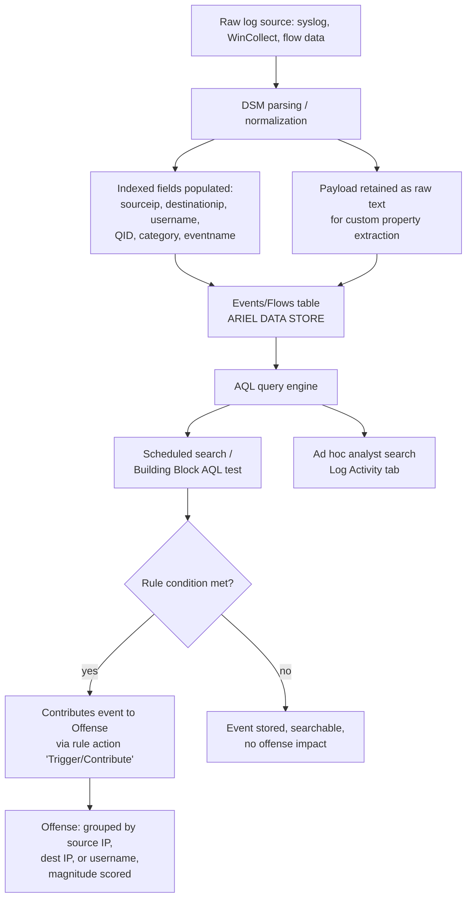

# Part XXI — QRadar AQL

## Why AQL matters even if you live in the offense list

[CONCEPT] IBM QRadar presents most analysts with two very different surfaces. The first is the
**Offense** — a correlated, deduplicated incident object that QRadar's rules engine builds by
grouping matching events and flows together (by source IP, destination IP, username, or a
combination) and assigning a magnitude score. The second is **Ariel Query Language (AQL)** — the
SQL-like language that actually queries the underlying events and flows tables (`events`, `flows`,
and derived views like `simarc` for offenses themselves).

Most SOC analysts only ever click into an offense, read the summary, and pivot to the "Events"
tab, which silently generates an AQL query on their behalf. That's fine for triage. It's not fine
for detection engineering. Every custom rule, every building block, and every scheduled search you
tune is, underneath, an AQL statement (or the rule-wizard equivalent of one) running against
indexed and non-indexed fields. If you don't understand what's indexed, what's computed at query
time, and how offense grouping works, you will write rules that are either too slow to run at
required intervals or too narrow to catch variants.

[MANAGEMENT] This distinction also matters for cost and stability conversations. A poorly written
AQL-backed rule doesn't just produce false negatives — it can consume disk I/O and CPU on shared
Event Processors, degrading correlation for every other rule running on that processor. "The rule
missed the attack" and "the rule broke ingest for two hours" are both AQL problems, and leadership
needs to know which one they're paying for.

## How an offense relates to the AQL underneath it



The point analysts often miss: **the offense is not a separate detection mechanism**. It is a
bucket that rules dump matching events into, keyed on whatever field the rule's "index offense
based on" setting specifies. If you set that field to source IP and an attacker rotates source IPs
(cloud egress NAT, Tor, credential-stuffing infrastructure), you'll get a fresh offense per IP
instead of one growing offense — magnitude looks low, priority queue looks noisy, and the actual
campaign is invisible until someone runs the AQL directly across a wider time window and username
instead of IP.

**Hunter's Note:** if an offense's event count looks low but you suspect a larger pattern, don't
trust the offense's own scope. Re-run the underlying logic as a standalone AQL search over a wider
`START`/`STOP` window and a different grouping key (username or destination instead of the
offense's source-IP grouping). Offenses answer "what did the rule already catch." AQL answers
"what actually happened."

## AQL fundamentals for defensive queries

[DETECTION ENGINEER] AQL syntax mirrors SQL closely enough that anyone comfortable with SQL is
productive in an afternoon, but the semantics around indexing and time are QRadar-specific.

Core clauses used constantly in defensive queries:

| Clause | Purpose | Notes |
|---|---|---|
| `SELECT` | Fields/aggregates to return | Can include arithmetic, `CASE`, string functions |
| `FROM events` / `FROM flows` | Table to query | Events = log data, Flows = network flow records |
| `WHERE` | Row filter | Push indexed-field filters here first — see performance section |
| `GROUP BY` | Aggregation key(s) | Required whenever using `COUNT`, `SUM`, `UNIQUECOUNT` |
| `HAVING` | Filter on aggregate result | e.g. `HAVING COUNT(*) > 20` |
| `ORDER BY` | Sort aggregate output | Usually descending on the count/uniquecount |
| `LAST X MINUTES/HOURS/DAYS` | Time window shorthand | Equivalent to `START ... STOP ...` |
| `START '...' STOP '...'` | Explicit UTC time bound | Required for anything beyond default search window |

Aggregate functions you'll use in almost every hunt or rule test:

- `COUNT(*)` — raw event count per group.
- `UNIQUECOUNT(<field>)` — cardinality of a field per group. This is the workhorse for anomaly
  logic: "how many distinct destination IPs did this source talk to," "how many distinct usernames
  attempted auth from this source."
- `SUM`, `AVG`, `MAX`, `MIN` — usually on flow bytes/packets fields (`sourcebytes`,
  `destinationbytes`) for volumetric detections.

## Worked example 1 — brute-force / password-spray pattern (part21-01)

**part21-01 — Excessive distinct usernames per source, single destination, short window**

[ANALYST] Password spraying looks different from classic brute force: instead of many attempts
against one account, you see few attempts against *many* accounts from one source, aimed at one
destination (an OWA endpoint, a VPN concentrator, an SSO gateway). `UNIQUECOUNT(username)` is the
right primitive, not `COUNT(*)`, because volume alone doesn't distinguish spraying from a single
noisy but legitimate retry loop.

```sql
-- ILLUSTRATIVE AQL, not guaranteed to run unmodified on a given QRadar build/DSM version
SELECT
    sourceip,
    destinationip,
    UNIQUECOUNT(username) AS distinct_usernames,
    COUNT(*) AS total_auth_events
FROM events
WHERE
    QIDNAME(qid) ILIKE '%authentication failure%'
    AND category = 5001               -- Authentication category (verify against your DSM mapping)
    AND destinationip = '10.20.30.15' -- known SSO gateway, narrows to an indexed field first
GROUP BY sourceip, destinationip
HAVING UNIQUECOUNT(username) >= 8
LAST 15 MINUTES
ORDER BY distinct_usernames DESC
```

[DETECTION ENGINEER] Translated into a QRadar rule, this becomes: "when an event matches
Authentication Failure AND UNIQUECOUNT(username) >= 8 in 15 minutes, grouped by source IP" —
indexed on **source IP**, not username, because the attacker's source IP is the stable pivot here
and the victim usernames are the varying dimension.

**What's reliable:** the authentication-failure category mapping, assuming the DSM correctly
tags failed logons (verify this per log source — some custom DSMs miscategorize).
**What's evadable:** an attacker who paces below the threshold-per-window, rotates source IP per
attempt (residential proxy pools), or targets a destination that isn't in your category-5001
mapping because it's a niche SaaS app with a custom log source extension that was never
mapped.
**What looks similar and causes false positives:** a misconfigured service account retrying
against multiple downstream systems, a load balancer health-check user, or a legitimate password
reset campaign hitting many accounts at once (HR-driven bulk reset). Tune by excluding known
service-account and health-check identities via a reference set lookup (`IN REFERENCE SET`
against a maintained allowlist) rather than hardcoding usernames in the WHERE clause.

MITRE mapping: T1110 (Brute Force), specifically T1110.003 (Password Spraying).

## Worked example 2 — long-lived low-and-slow beaconing candidate (part21-02)

**part21-02 — Low unique-destination count, high event count, from a single internal host**

[THREAT HUNTER] Classic beacon-hunting logic: a host talking to very few unique destinations
but generating a steady, disproportionately high event/flow count relative to its peer group, over
a long window, is worth a look — especially if the destination is external and rare across the
whole environment (a query you'd cross-check against a reference set of previously-seen-destinations
or a rarity-scoring pipeline, since AQL alone won't compute "rare across all hosts" cheaply).

```sql
-- ILLUSTRATIVE AQL, flows table example
SELECT
    sourceip,
    UNIQUECOUNT(destinationip) AS distinct_destinations,
    COUNT(*) AS flow_count,
    SUM(sourcebytes) AS total_bytes_out
FROM flows
WHERE
    sourceip IN ('10.0.0.0/8')          -- indexed, CIDR-narrowed to internal ranges
    AND destinationip NOT IN ('10.0.0.0/8', '172.16.0.0/12', '192.168.0.0/16')
START '2026-09-14 00:00' STOP '2026-09-15 00:00'
GROUP BY sourceip
HAVING UNIQUECOUNT(destinationip) <= 2 AND COUNT(*) > 500
ORDER BY flow_count DESC
```

[DETECTION ENGINEER] This is a *candidate generator*, not a standalone high-confidence rule — the
false-positive rate on raw thresholds like this is high (NTP, DNS-over-HTTPS resolvers, monitoring
agents, and backup jobs all produce exactly this shape). In production this AQL pattern almost
always feeds a scheduled search whose output is reviewed, or is combined with additional AQL
conditions such as consistent inter-arrival timing (which AQL itself is weak at computing — that
kind of jitter/interval analysis is usually better done by exporting to a notebook or a UEBA
add-on than by fighting AQL's aggregate functions into computing standard deviation of timestamp
deltas).

MITRE mapping: T1071 (Application Layer Protocol) as the likely channel, T1105 potentially for
payload delivery if correlated with a following event.

**Detection Autopsy — the naive "any process talked to a rare IP" rule**

*Original logic:* a well-meaning engineer wrote a building block: `destinationip NOT IN
(reference set: known_good_destinations) AND eventcategory = 'Network Communication'`, scheduled
every 5 minutes, LAST 5 MINUTES window, no `GROUP BY`, no aggregate — just raw matching events
routed straight into offense contribution.

*Why it looked reasonable:* the logic reads cleanly, the reference set was populated from 90 days
of Netflow, and in testing against a small pilot subnet it caught two real test-lab C2 callbacks.

*What broke in production:* the reference set had ~40,000 entries and was never pruned; every
laptop that resolved a new CDN edge node, every SaaS app rotating its egress IPs, and every
software update endpoint generated a "rare destination" hit. The rule fired roughly 8,000 times a
day across the full environment. Offenses piled up with magnitude scores clustered at the bottom
of the queue, analysts stopped opening anything below a magnitude threshold, and the rule was
effectively muted by fatigue rather than by design — meaning the two real hits it was designed to
catch became statistically invisible inside the noise.

*Missing context:* no volumetric or cardinality gate (no `UNIQUECOUNT`/`COUNT` threshold), no
distinction between a one-off DNS resolution and sustained repeated communication, no exclusion for
asset criticality or known SaaS CDN ranges, and no separate track for user workstations vs. servers
(servers legitimately talk to far fewer external destinations than end-user laptops, so a single
threshold across both asset classes is wrong for both).

*Revised analytic:* switched the reference-set exact-match to an AQL aggregate query executed on a
15-minute schedule, `GROUP BY sourceip`, `HAVING UNIQUECOUNT(destinationip) BETWEEN 1 AND 3 AND
COUNT(*) > 200`, restricted to the server VLAN only, with a second, separately-tuned instance for
the workstation VLAN using a higher event-count threshold. Reference set was pruned to a curated
CDN/update-endpoint allowlist refreshed weekly instead of accreting indefinitely.

*How it was tested:* re-run against the prior 30 days of stored flow data as an ad hoc AQL search
(not a live rule) to count how many offenses the new logic *would* have generated, compared against
the 8,000/day baseline, before re-enabling as a live rule.

*Result:* offense volume from this logic dropped to roughly 15–20 per day, all with meaningfully
higher signal — and the change made the two-hit history from the pilot reproducible on the full
data set instead of a fluke of the pilot's small scope.

## Custom properties vs. indexed fields — the performance conversation

[ENGINEERING] This is the single most consequential AQL performance decision, and it's routinely
gotten wrong by people transplanting SQL habits onto Ariel.

QRadar events carry a set of **normalized, indexed fields** populated at parse time by the DSM:
`sourceip`, `destinationip`, `username`, `qid` (and the category/eventname it maps to),
`sourceport`, `destinationport`, `magnitude`, and a handful of others depending on log source type.
These live in optimized index structures and filtering on them in a `WHERE` clause is cheap —
QRadar can skip large swaths of data without scanning payload text.

**Custom properties** — the "Custom Event Properties" you define in the QRadar UI, typically a
regex or a calculated expression pulled from the raw payload (extracting, say, a process command
line, an HTTP User-Agent substring, or an application-specific error code that the DSM doesn't
normalize) — come in two flavors that behave very differently:

| Property type | Extraction time | Query cost | Reuse |
|---|---|---|---|
| Indexed custom property (property flagged "optimize/index" and pre-computed at ingest) | Ingest time | Cheap — behaves like a normalized field once backfilled | High — every query benefits |
| Non-indexed custom property (evaluated on demand) | **Query time**, per matching event, per search | Expensive — regex run against raw payload text for every candidate row | None — recomputed every single query |

If you reference a non-indexed regex-based custom property in a `WHERE` clause on a broad time
range, QRadar has to pull the raw payload for every candidate event in that range and evaluate the
regex row by row — there's no index to prune the search first. On a high-EPS log source (Windows
Security event logs from a large domain, firewall traffic logs) this is the difference between a
sub-second indexed-field query and a search that times out or takes minutes against a single day
of data.

**Engineering Reality:** the fix engineers reach for first — "just add more custom properties for
everything we might want to filter on" — is exactly backwards if those properties aren't flagged
for indexing/optimization. Every unindexed custom property you add to a hot rule's `WHERE` clause
is a per-event regex tax paid on every scheduled run, forever. The right sequence in a `WHERE`
clause is: filter on indexed fields first (`sourceip`, `destinationip`, `qid`, `category`, time
window) to shrink the candidate set as much as possible, *then* apply any custom-property or
`LIKE`/`ILIKE` payload matching against the much smaller remaining row set. Building blocks that
lead with an unindexed regex property before narrowing by indexed fields are a recurring root
cause of "why is this rule so slow / why does log activity time out" tickets.

[MANAGEMENT] Every custom property you flag for indexing has a real ingest-time and storage cost
across the whole deployment, not just for the rule that needed it — that's a licensing-relevant,
EPS-relevant conversation with whoever owns QRadar capacity planning, not a free lunch. Treat
"index this custom property" requests with the same review rigor as a schema change, because in
effect that's what it is.

## Time filtering discipline

[DETECTION ENGINEER] `LAST N MINUTES/HOURS/DAYS` is convenient for interactive hunting but for
anything you intend to schedule or hand off, use explicit `START`/`STOP` in UTC — it removes
ambiguity about what "now" meant when the query ran, makes results reproducible for
documentation/case notes, and avoids drift when a search is paused and resumed. Every AQL query
should have exactly one time predicate; stacking a `LAST` clause with an unrelated timestamp
comparison in `WHERE` is a common way to accidentally scan far more data than intended (QRadar will
honor both, but if they conflict you get a confusing, possibly-empty result set that looks like a
bug in the detection logic when it's actually a bug in the time bound).

> **[SCREENSHOT PLACEHOLDER — CONTROLLED LAB]** — QRadar console, Log Activity tab, showing an AQL
> query entered directly (the `part21-01` password-spray query above) with the resulting grouped
> table (`sourceip`, `destinationip`, `distinct_usernames`, `total_auth_events`) and the query's
> actual elapsed run time displayed, to illustrate the indexed-field-first performance point. Would
> be captured from a lab QRadar Community Edition instance, not a fabricated screenshot.

## SOC Management View

Running AQL well at scale is a staffing and governance problem as much as a technical one:

- **Query review as change control.** Any AQL-backed rule that will run on a recurring schedule
  should go through the same review as a scheduled job in any other system — someone checks the
  `WHERE` clause ordering, the time bound, and whether it references unindexed custom properties,
  before it goes live on shared Event Processors.
- **EPS and retention tension.** High-cardinality `UNIQUECOUNT` queries over long windows
  (`LAST 30 DAYS`) are the queries most likely to blow past search timeouts on a busy deployment.
  Decide up front whether a hunt query like part21-02 is meant to run ad hoc by a human (acceptable
  to be slow, run once) or as a recurring scheduled search (must be bounded, indexed-first, and
  tested against realistic data volume before scheduling).
- **Coverage documentation.** Track which detections are pure rule-wizard logic vs. rules backed by
  hand-written AQL with custom properties — the latter need an owner who understands regex
  extraction, because DSM updates or log format changes silently break custom property extraction
  without erroring, they just start returning empty/null values.

## Summary for the working analyst

- The offense is a grouping artifact of rule logic, not the ground truth of what happened — go back
  to AQL against a wider window/different grouping key when the offense scope looks too narrow.
- Lead every `WHERE` clause with indexed fields (source/destination IP, username, QID/category,
  time window); push custom-property regex matching to the end, after the candidate set is small.
- `UNIQUECOUNT` combined with `GROUP BY` and `HAVING` is the core pattern for both spray-style
  auth abuse and low-and-slow beaconing candidates — raw `COUNT` alone rarely distinguishes attack
  shape from noisy-but-legitimate behavior.
- Treat "index this custom property" as a capacity-planning decision, not a free UI toggle.
