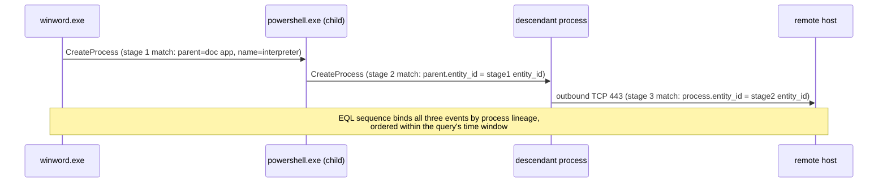

# Part XXII — Elastic

## Scope

Elastic Security ships three query surfaces that matter for detection engineering: KQL (Kibana
Query Language, sometimes still called "KQL" even though it shares nothing but a name with
Kusto), EQL (Event Query Language), and ES|QL (Elasticsearch Query Language, the newer piped
language). They are not interchangeable — each one is good at a different shape of problem, and
picking the wrong one produces either a rule that can't express what you mean or a rule that
technically works but is unmaintainable. This part covers what each language is actually for, then
works through EQL sequence detections against endpoint process/network data, which is where
Elastic's detection engine earns its keep.

[CONCEPT] Think of the three languages on a spectrum of "what is a match":

- **KQL** — is this one document true? Field equals value, field exists, free-text match. No
  concept of order, no concept of "this process, then that network connection from it."
- **EQL** — is this a *sequence of events tied together by a shared identity* (usually a process)
  happening in a bounded order/time window? This is the language built for "process A does X,
  then a descendant of A does Y."
- **ES|QL** — give me a pipeline of transforms/aggregations/joins across possibly large volumes of
  events, closer to a hunting/analytics query than a real-time correlation rule, though it's
  gaining lookup-join capability that blurs this line release over release.

## KQL in Elastic: what it's for and where it stops

KQL is the query bar language in Discover and the "Custom Query" rule type in Elastic Security
detection rules. It compiles down to a Lucene/DSL query under the hood. Syntax is field:value,
boolean combinators, wildcards, ranges:

```
event.category:"process" and process.name:("rundll32.exe" or "regsvr32.exe") and
not process.parent.name:"explorer.exe"
```

[DETECTION ENGINEER] KQL rules fire per matching document. There is no native way to say "and
then, within 30 seconds, a child of that process did something else." Every KQL detection rule is
therefore a single-event (or, with `event.category` combined fields, single-document) test. This
is fine for a large share of real detections — a lot of good detection logic really is "this one
process command line looks bad" — but it collapses the moment you need process-relationship logic.
Teams that try to force multi-step logic into KQL usually end up either (a) writing one broad rule
per stage and correlating manually in the SOC, which is slow and inconsistent analyst-to-analyst,
or (b) building a long OR-chain of "any of these 40 known-bad indicators" that has no behavioral
coherence and rots fast.

**Detection Autopsy — the KQL rule that "detects LOLBin network egress"**

*Original logic:*

```
event.category:"network" and process.name:("powershell.exe" or "certutil.exe" or "mshta.exe" or
"rundll32.exe" or "regsvr32.exe" or "wscript.exe" or "cscript.exe") and destination.port:(80 or 443)
```

*Why it looked reasonable:* every name on that list is a documented LOLBin used for download-and-
execute, and outbound 80/443 from an interpreter is a classic C2 or second-stage-fetch signal.
Someone built this, tested it against a red-team engagement where it fired, and shipped it.

*What breaks in production:* PowerShell doing outbound TLS to 443 is background noise in any
organization running PowerShell-based EDR/RMM agents, Windows Update helper scripts, or PowerShell
modules that phone home for module updates (`Install-Module`, `Update-Help`). Certutil is used
legitimately for certificate chain building against CRL/OCSP endpoints, also over 80/443. The rule
alone can generate hundreds of daily hits in a mid-size PowerShell-heavy environment.

*Missing context:* the rule never asks *why* the interpreter is running. `powershell.exe` spawned
by `winword.exe` making an outbound connection two seconds later is a completely different
narrative than `powershell.exe` spawned by the Windows Update orchestrator, or by a scheduled task
that has run daily for two years. KQL can't see the parent-to-network relationship as a single
correlated fact; it can only see the network event's own `process.parent.name` field if that field
happens to be present on the network event document, which is inconsistent across Elastic Agent
versions and beat configurations, and even when present, it's one hop only — it can't reach further
up the ancestry chain.

*False negatives:* attacker uses a LOLBin not on the hardcoded list (there are dozens: `msiexec`,
`installutil`, `msbuild`, `bitsadmin`), or proxies the connection through a process not in the list
at all.

*Revised analytic (EQL, below in Worked Example 1):* require the *sequence* — office/script parent
spawning the interpreter, and that same process (or its own child) making the network connection
— which is exactly the shape KQL cannot express and EQL was built for.

*How it was tested:* replayed the same red-team PCAP/EDR export both as the old KQL rule and the
new EQL sequence against 30 days of production telemetry; old rule: 640 fires/month, ~4 true
positives (all red team); new rule: 9 fires/month, same 4 true positives retained, zero of the
PowerShell-module-update or certutil-OCSP noise.

*Result:* rule shipped as EQL, old KQL rule downgraded to a hunting query run weekly with human
triage instead of an alert.

## EQL: sequence logic for process relationships

[CONCEPT] EQL treats each ingested document as an "event" with a `category` (`process`, `network`,
`file`, `registry`, `dns`, etc., mapped from ECS `event.category`) and lets you write queries that
match either a single event or a **sequence** of events joined by a shared field value — almost
always `process.entity_id` or `process.parent.entity_id`, which Elastic Agent/Endpoint (and
Sysmon-via-Winlogbeat, with caveats) generates as a locally-unique identifier for a running
process instance.

Basic single-event EQL:

```eql
process where event.type == "start" and
  process.name : "rundll32.exe" and
  process.args : "*comsvcs.dll*" and
  process.args : "*MiniDump*"
```

That's just a filter, no different in power from KQL. The value is in `sequence`:

```eql
sequence by process.entity_id
  [process where event.type == "start" and process.name : "cmd.exe"]
  [file where event.type == "creation" and file.extension : "exe"]
```

`sequence by process.entity_id` means: find a `process` event and a `file` event that share the
same `process.entity_id` value, in that order, within the default or specified time window. This
is the core primitive — "the same running process did A, then did B."

### Worked Example 1 — office-spawned interpreter with descendant network egress

**Detection ID: part22-01 — "Suspicious document-process descendant network connection"**

Behavior: a document-handling application (Word, Excel, PowerPoint, Adobe Reader) spawns a
scripting interpreter or LOLBin, and a descendant of that interpreter (either the interpreter
itself or something it in turn spawns) makes an outbound network connection. This is a common
shape for phishing-macro → dropper → C2 chains (MITRE ATT&CK T1566.001 initial access,
T1059.001/.005 execution, T1071.001 C2 over web protocols).

```eql
sequence
  [process where event.type == "start" and
    process.parent.name : ("winword.exe","excel.exe","powerpnt.exe","acrord32.exe","outlook.exe") and
    process.name : ("cmd.exe","powershell.exe","pwsh.exe","wscript.exe","cscript.exe","mshta.exe")
  ] by process.entity_id
  [process where event.type == "start"
  ] by process.parent.entity_id
  [network where event.type == "start" and
    destination.port in (80,443,8080,8443) and
    not cidrmatch(destination.ip, "10.0.0.0/8","172.16.0.0/12","192.168.0.0/16","127.0.0.0/8")
  ] by process.entity_id
until
  [process where event.type == "end"] by process.entity_id
```

Reading this stage by stage:

1. First event: a process starts, its parent is a document/mail application, and the process
   itself is a scripting interpreter. Bind on that process's `entity_id`.
2. Second event: *any* process starts whose `parent.entity_id` equals the entity_id bound in stage
   1 — i.e., a child of the interpreter. Bind that child's own `entity_id`.
3. Third event: a network connection whose `process.entity_id` equals the value bound in stage 2 —
   the child process is the one talking outbound, to a non-RFC1918 destination.
4. The `until` clause is a safety valve: if the interpreter process (stage 1's entity_id) exits
   before the sequence completes, EQL stops trying to match against it, which keeps the sequence
   window from matching a *reused* entity_id after process-table recycling on long-lived hosts.

This is a **three-stage** sequence specifically because the brief calls for a *descendant* (not
necessarily direct child) making the connection — stage 2 exists purely to walk one level down the
process tree via `process.parent.entity_id`, then stage 3 joins on that descendant's own
`entity_id`. Extend to a fourth stage with another `by process.parent.entity_id` hop if you want to
catch a great-grandchild connecting instead.



[ANALYST] When this fires, the alert timeline in Elastic Security shows the full chain — parent
document process, the interpreter, the descendant, and the network event — as linked nodes. Pivot
first on `process.command_line` for the interpreter and descendant stages; a legitimate use (some
add-ins do spawn helper scripts) usually has a short, unencoded, predictable command line, whereas
malicious chains tend to carry base64, `-EncodedCommand`, `-w hidden`, `IEX(New-Object
Net.WebClient)`, or a URL literal in the args.

[THREAT HUNTER] Hunt variants by loosening each stage independently: drop the port restriction and
look at *any* egress including 53 (DNS tunneling) or 445 (SMB-based C2/lateral staging); drop the
parent-name list and check for descendants of `explorer.exe` spawned via double-click on an
attachment saved to disk rather than opened directly from the mail client (breaks the direct
`process.parent.name` link to Outlook); or replace stage 3 with a `dns` category event to catch
beacon setup before the TCP connection is visible.

[DETECTION ENGINEER — tuning] Known noisy legitimate patterns to allowlist or split into a lower-
severity rule: enterprise macro-based reporting tools that legitimately shell out to PowerShell to
write to a network share (add a condition excluding `destination.port : 445` combined with an
internal-IP allowlist rather than blanket-excluding 445 everywhere); mail-merge or PDF-generation
add-ins that spawn a helper process which then calls a license-check API over 443 — these usually
have a stable, low-cardinality `destination.domain`, so a companion enrichment lookup against a
known-vendor-domains list is more sustainable than editing the EQL query every time a false
positive shows up.

[ENGINEERING] `process.entity_id` reliability is the entire foundation of this detection. On
Windows with Elastic Defend/Endpoint, entity_id is generated by the agent itself and is durable
across the process lifetime — good. On environments still shipping Sysmon logs via Winlogbeat
without Elastic Agent, there is no native `process.entity_id`; you're dependent on Sysmon's own
`ProcessGuid`, and it has to be mapped into `process.entity_id` correctly by the ingest pipeline or
the sequence simply never joins and the rule silently produces zero matches — not an error, just
quiet failure. Test this specifically after any change to agent version, ingest pipeline, or index
template; a broken join looks identical to "no attacks happened," which is the worst failure mode
for a detection rule.

**Engineering Reality** — ECS field consistency is not a nice-to-have for EQL, it's the whole
mechanism. `sequence by` is a literal field-value join. If two data sources populate
`process.entity_id` with different formats (one source hashes PID+start-time, another uses a GUID
from the OS), the join fails 100% of the time and the sequence rule looks "installed and enabled"
in the UI while never firing. Always validate with a synthetic test: spawn the exact process chain
in a lab VM, confirm the raw documents in the index have matching join-field values before trusting
the rule logic itself.

### Worked Example 2 — credential-access precursor via comsvcs.dll minidump

**Detection ID: part22-02 — "rundll32 comsvcs MiniDump followed by dump-file write outside expected path"**

Behavior: `rundll32.exe comsvcs.dll, MiniDump <lsass PID> <path> full` is a well-known LOLBin
technique to dump LSASS memory without touching disk with a full-blown tool like Mimikatz
(MITRE ATT&CK T1003.001, OS Credential Dumping: LSASS Memory). The process-creation event alone is
already high-signal, but pairing it with the resulting file write raises confidence and gives you
the exfil path for containment.

```eql
sequence with maxspan=2m
  [process where event.type == "start" and
    process.name : "rundll32.exe" and
    process.command_line : "*comsvcs.dll*MiniDump*"
  ] by process.entity_id
  [file where event.type in ("creation","change") and
    not file.path : ("C:\\Windows\\Temp\\*","C:\\Windows\\System32\\*")
  ] by process.entity_id
```

`with maxspan=2m` bounds the sequence to two minutes between the process start and the file event —
tight enough to reject coincidental unrelated file writes by a long-lived `rundll32.exe` host
process (rare, but some legitimate rundll32 invocations are long-running), loose enough to allow
for disk I/O latency on a busy host.

[ANALYST] Confidence is high on this one without much extra context, because there is essentially
no benign reason for `comsvcs.dll,MiniDump` to run against an arbitrary PID. The follow-up question
is *whose* PID — cross-reference the numeric PID argument against a concurrent `lsass.exe` PID from
process telemetry to confirm the target, since attackers occasionally test this against a decoy
process first.

[THREAT HUNTER] Variants: `procdump.exe -ma lsass.exe`, `taskmgr.exe` GUI-driven "create dump file"
against lsass (leaves a process-creation-free trail, only file + handle-access events), or direct
`MiniDumpWriteDump` API calls from a custom binary with no interesting command line at all — hunt
those by pivoting on **handle-open events with `GENERIC_READ`/`PROCESS_VM_READ` access against
lsass.exe by non-standard callers**, which requires Sysmon Event ID 10 (ProcessAccess) or
equivalent EDR API telemetry, not just process-creation logs.

## ES|QL: pipelines, not sequences

[CONCEPT] ES|QL is a piped language — closer in spirit to SPL or KQL(Kusto) than to EQL — for
transforming, aggregating, and (in current releases) joining data across indices as a query
pipeline rather than an event-correlation grammar. It is not built to express "process A then
network B from a descendant"; it's built to answer "how many distinct destination IPs did each
host talk to on port 443 in the last hour, ranked."

```esql
FROM logs-endpoint.events.network-*
| WHERE destination.port == 443 AND event.type == "start"
| STATS connection_count = COUNT(*), distinct_dest = COUNT_DISTINCT(destination.ip) BY host.name
| WHERE distinct_dest > 200
| SORT distinct_dest DESC
```

[THREAT HUNTER] This is the shape of query you build for beaconing/exfil-volume hunts, low-and-slow
DNS tunneling aggregate counts, or rare-parent/rare-child frequency analysis ("which
`process.parent.name`/`process.name` pairs occurred fewer than 3 times org-wide in 30 days") —
statistical outlier hunting rather than behavioral sequence matching. Where ES|QL genuinely
complements EQL is post-detection triage: take the `process.entity_id` values an EQL sequence rule
flagged and pipe them into an ES|QL query that pulls every event across every index for that
entity_id, sorted by timestamp, effectively reconstructing the full session without hand-building a
Discover query per data source.

[MANAGEMENT] ES|QL lookup-join capability (joining a streamed events table against a smaller
reference table — asset inventory, threat-intel indicator list, HR leaver list) is under active
development across Elastic versions; treat any specific join syntax as subject to change between
minor releases and validate against your deployed version before committing production rules to
it.

## Language selection at a glance

| Question you're asking | Best language | Why |
|---|---|---|
| Is this one field/value combination bad? | KQL | Simplest, cheapest, fastest to write and tune |
| Did process A do X, then a related process do Y, in order? | EQL sequence | Native join-by-entity_id, ordered, bounded window |
| Did any of these unrelated bad things happen (no ordering)? | EQL `sample` | Same join mechanics, no ordering requirement |
| How many/which hosts show a statistical outlier over a time window? | ES|QL | Aggregation-first pipeline, cross-index STATS |
| Reconstruct everything that happened to this one entity_id after an alert fired | ES|QL | Cross-index pull, sort by time, human triage |
| Threshold/count-based (>N logon failures in 5m) | Threshold rule type (built on top of a query, not a language choice) | Purpose-built rule type, avoid hand-rolling in EQL |

## Testing and failure modes for EQL sequence rules

[DETECTION ENGINEER — how to test]

1. Reproduce the exact process chain in an isolated lab endpoint running the same agent version as
   production (Elastic Agent + Elastic Defend, or Winlogbeat+Sysmon if that's still your source).
2. Confirm in Discover, *before* enabling the detection rule, that every stage's raw document has
   the join field populated with matching values — don't trust the rule UI's "test query" preview
   alone, it can mask a join mismatch that only shows up under load.
3. Enable the rule, re-run the reproduction, confirm exactly one alert with the expected entity_id
   chain in the alert's process/network detail panel.
4. Run a negative test: perform each stage individually *without* the full chain (e.g., spawn
   `powershell.exe` from Explorer, not from Word) and confirm no alert fires.
5. Load-test on a busy host: process-entity_id reuse after a host has been up for weeks, combined
   with a generous `maxspan`, can theoretically stitch together two unrelated process lifetimes if
   the OS recycles a numeric PID and your entity_id generation isn't collision-resistant across
   that recycling — Elastic Endpoint's entity_id design accounts for this, but if you're feeding
   EQL from a different ECS-mapped source, verify it explicitly.

[ENGINEERING — failure modes in production] Ingest pipeline changes are the number one silent
killer of EQL rules. A reindex, a change to the index template, an agent policy update that alters
which `event.category` values get populated, or a switch from Winlogbeat to Elastic Agent mid-fleet
— any of these can change the join field's presence or format on a subset of hosts without
throwing an ingest error. The rule keeps running, keeps showing "enabled," and simply stops
matching for the affected hosts. Alert on rule *execution* metrics (search latency, zero-hit
streaks against a baseline) in addition to alert output, or you'll only find out during an incident
retro that the rule went blind three months earlier.

**SOC Management View** — EQL sequence rules cost more to build and tune than KQL rules (expect
2-4x the analyst-hours for a well-tuned multi-stage sequence versus a single-field KQL rule,
mostly in the false-positive tuning pass), but they cut alert volume dramatically for the same true-
positive coverage, which is the more expensive resource in most SOCs. Budget EQL sequence
authorship for your senior detection engineers, not as a training task for new analysts — a subtly
wrong `by` field produces a rule that looks correct in the UI, never errors, and just never fires,
which is far worse than a noisy rule because nobody notices the gap until it's tested in an
incident.

**Hunter's Note** — if a KQL rule and an EQL sequence rule are both watching the same behavior and
the KQL rule fires ten times more often, don't assume the EQL rule is "better tuned." Check first
whether the EQL rule's join field is actually populated on every host type in your fleet — a
quiet EQL rule is exactly as likely to mean "broken join" as "correctly narrowed."

## Screenshot placeholders

> **[SCREENSHOT PLACEHOLDER — CONTROLLED LAB]** — Elastic Security alert detail/timeline view for
> a fired EQL sequence rule (part22-01), captured from a lab Windows endpoint running Elastic
> Defend, showing the linked process-tree nodes (document app → interpreter → descendant → network
> event) and the `process.entity_id` values that tie them together in the alert's "Analyze Event"
> graph.

> **[SCREENSHOT PLACEHOLDER — CONTROLLED LAB]** — Kibana Discover view of the raw
> `logs-endpoint.events.process-*` and `logs-endpoint.events.network-*` documents for a single
> reproduced test run of part22-02, showing the `process.entity_id` field present and matching
> across the process-start and file-write documents, used to validate the join before trusting the
> rule.

## Sample data (conceptual, not captured)

```
CONCEPTUAL SAMPLE — process-start document
{
  "@timestamp": "2026-09-15T14:02:11.104Z",
  "event.category": "process",
  "event.type": "start",
  "process.entity_id": "a1b2c3-...-001",
  "process.name": "powershell.exe",
  "process.parent.name": "winword.exe",
  "process.parent.entity_id": "a1b2c3-...-000",
  "process.command_line": "powershell.exe -w hidden -enc SQBFAFgA..."
}

CONCEPTUAL SAMPLE — network-start document (descendant)
{
  "@timestamp": "2026-09-15T14:02:14.552Z",
  "event.category": "network",
  "event.type": "start",
  "process.entity_id": "a1b2c3-...-002",
  "process.parent.entity_id": "a1b2c3-...-001",
  "destination.ip": "203.0.113.44",
  "destination.port": 443
}
```

## Coverage summary

| MITRE ATT&CK technique | Covered by | Data dependency |
|---|---|---|
| T1566.001 Phishing: spearphishing attachment | part22-01 (upstream parent condition) | Mail client/Office process telemetry |
| T1059.001/.005 PowerShell / VBScript execution | part22-01 | Process-creation with command line |
| T1071.001 Application-layer C2 (web protocols) | part22-01 | Network-connection events with process linkage |
| T1003.001 OS Credential Dumping: LSASS Memory | part22-02 | Process-creation + file-write telemetry, ideally + Sysmon ID 10 ProcessAccess for the API-call variant |

## References

- Elastic, "EQL syntax reference" (Elastic Security documentation)
- Elastic, "ES|QL" documentation (Elastic Security/Elasticsearch documentation)
- MITRE ATT&CK, T1566.001 (Phishing: Spearphishing Attachment), T1059 (Command and Scripting
  Interpreter), T1071.001 (Application Layer Protocol: Web Protocols), T1003.001 (OS Credential
  Dumping: LSASS Memory)
- Elastic, "Detection rules" documentation — rule types (Custom Query, EQL, ES|QL, Threshold,
  Indicator Match, New Terms, Machine Learning)
