# Part XXIII — Detection Correlation

Every prior part in this book has largely dealt with single-event or single-process detections:
one Sysmon event, one DNS query, one cloud API call, scored on its own merits. Real intrusions
don't look like that. They look like a sequence of individually-plausible events spread across
multiple log sources, multiple hosts, and multiple minutes-to-hours, where the *combination* is the
signal and no single event would justify an alert on its own.

Detection correlation is the discipline of tying discrete events together into a chain that
represents a behavior, scoring the chain rather than the events, and doing that reliably even when
the underlying telemetry is incomplete, duplicated, delayed, or arrives out of order — which, in
production, it always eventually is.

This chapter uses one worked chain end to end:

**Failed Logons → Successful Login → Privileged Token Use → Suspicious Process → External
Connection**

That chain maps to a common intrusion shape: password guessing or spraying against an account,
eventual success, escalation or use of a high-privilege token, execution of something that isn't
normal for that account/host, and a network callout. Individually: failed logons happen constantly
(users mistype passwords), successful logons happen constantly, privileged token use happens
constantly on admin workstations, process execution happens constantly, and outbound connections
happen constantly. Chained together with the right entity keys and the right time ordering, this
sequence is a meaningfully higher-confidence signal than any of its parts.

## 1. Why single-event detection isn't enough here

[CONCEPT] A correlation rule doesn't ask "did X happen?" — it asks "did X happen, and then did Y
happen to the *same* subject within a *bounded* time window, and then Z?" The value is entirely in
the "same subject" and "bounded time window" qualifiers. Remove either one and you're back to
counting coincidences.

[MANAGEMENT] Correlation rules are more expensive to build, tune, and maintain than single-event
rules — they require state (something has to remember "user X failed 8 logons on host Y at time
T" until the next stage arrives or the window expires), they require entity resolution logic, and
they fail in more subtle ways. Budget for this. A team that ships ten single-event Sigma rules a
week cannot ship ten correlation rules a week; expect one well-tested multi-stage correlation to
take as long as building and tuning five independent rules, and expect it to need revisiting every
time a log source's schema or timestamp behavior changes upstream.

## 2. The chain, stage by stage

```mermaid
flowchart LR
    A[Failed Logons\nMultiple 4625 events\nsame account] -->|within window,\nsame account+source| B[Successful Login\n4624]
    B -->|within window,\nsame logon session| C[Privileged Token Use\n4672 / token elevation]
    C -->|within window,\nsame host+session| D[Suspicious Process\nSysmon 1 / EDR proc-create]
    D -->|within window,\nsame host+process| E[External Connection\nSysmon 3 / firewall / proxy log]

    A -.entity: account, source IP.-> B
    B -.entity: logon session ID.-> C
    C -.entity: host, session, user.-> D
    D -.entity: process GUID, host.-> E

    style A fill:#4a1a1a,color:#fff
    style E fill:#4a1a1a,color:#fff
```



### Stage 1 — Failed logons

[ANALYST] Windows Security Event ID 4625 (An account failed to log on), or the equivalent
authentication-failure event from your IdP (Okta `user.authentication.auth_via_mfa` failure, Azure
AD sign-in log with a non-zero error code, SSH `Failed password` in auth.log). The behavior you
care about is a *pattern* of failures — a burst against one account (password guessing), or one
source hitting many accounts (spraying) — not any single failure. A single 4625 is background
noise on any authentication system; users fat-finger passwords constantly.

[DETECTION ENGINEER] The stage-1 detection is itself usually a threshold rule: N failures for the
same TargetUserName within a rolling window, or N distinct TargetUserName values from the same
source IP/workstation within a window. That threshold rule's *output* — "account X has an active
failure burst" — becomes the entry condition into the correlation, not the final alert.

[ENGINEERING] **Engineering Reality**: 4625 volume on a mid-size AD environment can be enormous —
expired service account passwords retried on a cron schedule, stale cached credentials on laptops
that were off the network, misconfigured mapped drives. If you correlate on raw 4625 volume without
first suppressing known-noisy failure reasons (Sub Status codes for expired password, disabled
account, workstation restriction) you will build your correlation entry condition on top of garbage
and it will fire on cron jobs long before it fires on an attacker.

### Stage 2 — Successful login

[ANALYST] Event ID 4624 (An account was successfully logged on) for the *same account* that had the
failure burst, within a bounded time after the last failure — minutes, not hours. Logon type
matters: Type 3 (network), Type 10 (RemoteInteractive/RDP), and Type 2 (interactive) tell very
different stories about attacker access. A 4624 immediately following a 4625 burst against the same
account, from the same or a related source, is the first genuinely elevated-confidence point in the
chain.

[DETECTION ENGINEER] This is where entity keys start to matter and where naive correlation breaks
first. See section 4.

### Stage 3 — Privileged token use

[CONCEPT] After a successful logon, the next behavior of interest is the account exercising
privilege it doesn't normally exercise — a token elevation, use of a privileged SID, or a
logon session gaining a right like `SeDebugPrivilege` or `SeImpersonatePrivilege` shortly after
authenticating. Event ID 4672 (Special privileges assigned to new logon) fires whenever an account
with admin-equivalent rights logs on — including every routine domain admin logon — so on its own
it is not suspicious. In the chain, it's suspicious because it's the *same logon session* that just
came off a failed-then-successful authentication burst.

[ANALYST] Also watch for token manipulation techniques independent of 4672: `SeDebugPrivilege`
enabled on a process that shouldn't need it, `runas` with `/netonly`, or an EDR-reported token-theft
event (duplicated/impersonated token, `NtCreateToken`-family API use). MITRE ATT&CK T1134 (Access
Token Manipulation) and T1078 (Valid Accounts) both live at this stage.

### Stage 4 — Suspicious process

[ANALYST] Now tie the elevated session to process execution: something spawned under that logon
session that doesn't match the account's or host's baseline — LOLBin chains, a process spawned by
`services.exe`/`wmiprvse.exe`/`svchost.exe` with an unusual child, encoded PowerShell, a
credential-dumping tool signature, or simply a binary that account has never run before on that
host. This is where Parts VI and VII's process-tree and command-line work plugs directly into the
correlation — the suspicious-process stage of this chain *is* a Part VI/VII detection, just gated
by "and it's downstream of stages 1–3 for the same subject."

### Stage 5 — External connection

[ANALYST] The suspicious process (or a short-lived child of it) makes an outbound network
connection — Sysmon Event ID 3, EDR network-connect telemetry, a firewall/proxy log entry — to a
destination outside normal baseline: new ASN, no prior history for that host, a raw IP with no DNS
resolution preceding it, or a known/likely C2 port pattern. MITRE ATT&CK T1071 (Application Layer
Protocol) or T1219 (Remote Access Software) depending on what the traffic looks like.

[HUNTER'S NOTE] If stage 5 is DNS-over-HTTPS or a connection straight to an IP with no A/AAAA
lookup logged by your resolver in the preceding minute, that absence of a normal-looking DNS lookup
is itself worth flagging — most legitimate outbound connections from a Windows host are preceded by
a name resolution you can see if you're logging DNS centrally (see Part X). Attackers using raw IP
C2 or DoH specifically to skip your DNS logging leave a *gap*-shaped signal, not a positive one, and
gap-shaped signals require you to know what "normal" density of preceding DNS lookups looks like.

## 3. Correlation windows

[CONCEPT] A correlation window is the maximum time you'll wait between stage N and stage N+1 before
you consider the chain broken and expire the partial match. Get the window wrong in either
direction and the correlation stops working.

- **Too short**: legitimate multi-step attacker activity (or legitimate admin activity that
  resembles it) spans longer than your window, especially with manual/interactive attackers who
  pause to reconnoiter between steps, or with time-zone-lagged log delivery. You silently drop true
  positives and never know it — the partial chain expires and nothing alerts.
- **Too long**: you correlate unrelated events that happen to share an entity key by coincidence.
  A service account that fails logon at 9:00 AM (expired password, gets fixed), then legitimately
  runs a scheduled privileged task at 9:00 PM, then makes a normal outbound connection at 9:05 PM —
  if your window is 12 hours, that's a full false-positive chain built entirely from unrelated,
  individually benign events.

[DETECTION ENGINEER] Don't use one window for the whole chain. Each hop should have its own window,
sized to the behavior:

| Hop | Typical window | Why |
|---|---|---|
| Failed logon burst → success | 5–15 min | Automated guessing/spraying tools attempt and succeed fast; a human retrying a forgotten password also resolves within minutes |
| Success → privileged token use | 1–30 min | Immediate for automated tooling; allow more slack for an interactive attacker doing manual recon before escalating |
| Token use → suspicious process | 1–60 min | Widest realistic range — attacker dwell between access and action varies a lot |
| Suspicious process → external connection | seconds–5 min | Malware calling out after execution is typically fast; delay usually means a sleep timer, which is itself worth noting |

[DETECTION ENGINEER] Make windows configurable per environment and revisit them using your own
incident timelines, not defaults borrowed from a vendor whitepaper. A domain with slow log
forwarding (batch shipping every 5 minutes from a syslog relay) needs its windows padded to account
for *pipeline* latency on top of *behavioral* latency, or you will systematically miss real chains
because the clock the correlation engine uses (ingest time) doesn't match the clock the attacker
operated on (event time). This distinction — event time vs. ingest time vs. processing time — is
the single most common root cause of correlation windows silently failing in production. Always
correlate on event timestamp, not arrival timestamp, and treat the gap between them as a monitored
pipeline health metric in its own right.

## 4. Entity keys — how you actually tie events together

[CONCEPT] An entity key is the field (or combination of fields) that lets you say "these two events
are about the same thing." Get this wrong and every other part of the correlation is built on sand.

| Candidate key | What it ties together | Strength | Failure mode |
|---|---|---|---|
| Username / SAMAccountName | Same account across auth events | Strong for auth stages | Shared/service accounts used by many hosts simultaneously make this key overly broad; case-sensitivity and domain-prefix inconsistencies (`DOMAIN\user` vs `user@domain.com` vs `user`) cause silent join misses |
| Logon session ID (Windows: Logon ID / LUID) | Same authenticated session across 4624→4672→process creation | Strongest link for stages 2–4 | Not preserved across host reboots or if the session is replaced (re-logon); not present at all in some non-Windows sources |
| Source/destination IP | Ties network-layer stages | Useful but weak alone | NAT, VPN concentrators, and cloud egress gateways collapse many distinct hosts/users onto one IP; DHCP churn means one IP represents different hosts over time |
| Hostname / asset ID | Ties host-local stages (process → network) | Strong if asset inventory is accurate | Hostname reuse after reimage, short-lived cloud instances, and containers sharing a host IP all break this |
| Process GUID (Sysmon ProcessGuid) | Ties process creation to its own network connections and child processes | Strongest link for stages 4–5 | Only available where Sysmon (or EDR-equivalent) is deployed and correctly correlating on the *same* field across event types — some EDR platforms use different process identifiers for process-create vs. network-connect telemetry, breaking the join |
| Cloud identity (AWS ARN, Azure Object ID, GCP unique ID) | Ties cloud API calls to a specific principal across services | Strong when present | Assumed-role/service-account chains mean the "identity" changes mid-session (see Part XIII); the human behind an assumed role is often not directly in the log |

[ENGINEERING] **Engineering Reality**: the entity key you *want* to correlate on (a stable session
or user identity) is often not the field that's actually populated consistently across your log
sources. You will frequently have to correlate through an intermediate key — e.g., you can't join
4625 directly to a Sysmon process-creation event by session ID because the session didn't exist yet
at logon-failure time, so you join failed-logon→success by account+source IP, then join
success→process by logon session ID, then join process→network by process GUID. Each hop can use a
*different* key. Document which key each hop uses; this is exactly the kind of logic that looks
obvious when you write it and is completely opaque six months later when someone else has to debug
why the correlation stopped firing.

[MANAGEMENT] **SOC Management View**: entity resolution quality is an asset-management and identity
-governance problem before it's a SIEM problem. If your CMDB doesn't reliably map IP-to-hostname-
to-owner, or your IAM doesn't give you a stable principal identity across on-prem AD and cloud IdP,
no amount of correlation-rule cleverness fixes that. Fund the boring inventory/identity work; it's
a force multiplier for every correlation rule you'll ever write, not just this one.

## 5. Event ordering — and why you can't just trust arrival order

[CONCEPT] The chain implies a causal order: failures before success, success before token use,
token use before process execution, process before connection. Naive implementations assume the
order events *arrive* in your SIEM matches that causal order. It frequently doesn't.

Sources of order-breaking:

- **Multi-hop log forwarding with different latencies.** Windows Security events might forward
  through a local agent with near-real-time delivery, while Sysmon events queue behind a batching
  relay that flushes every 60 seconds. The causally-earlier 4624 can arrive at the SIEM *after* the
  causally-later Sysmon process-creation event.
- **Clock skew.** A domain controller with a few seconds of drift relative to an endpoint means
  event timestamps themselves — not just arrival order — can appear reversed. NTP misconfiguration
  on even one log source in the chain is enough to flip stage ordering by timestamp.
- **Batch/replay ingestion.** Re-ingesting a log source after an outage, or bulk-loading an
  archived source during an investigation, delivers a large block of old events at "now," with
  correct event timestamps but wildly incorrect arrival order relative to live sources.

[DETECTION ENGINEER] Build correlation logic to evaluate strictly on event timestamp, and make it
tolerant of out-of-order *arrival*. Practically, this means: don't build a correlation as "stream
processor sees A, sets state, expects B next" without also being willing to accept B arriving first
and A confirming the chain retroactively (a short reordering/holdback buffer), or you need to
re-evaluate a rolling window of already-ingested events whenever a late event lands, rather than
only evaluating going forward from the moment of arrival. Most modern SIEM correlation engines
(Splunk correlation searches, Sentinel scheduled/fusion rules, Elastic sequence rules) have
first-class support for this; check whether your specific rule type evaluates on arrival order or
event-time order before you rely on it — this detail is easy to get wrong silently.

## 6. The practical failure modes

This is the part that actually determines whether your correlation works in production. Four
failure modes, each breaking the chain differently.

### 6.1 Missing events

[CONCEPT] A stage in the chain simply never arrives — the source didn't log it, the forwarder
dropped it, the parser failed silently, or a fleet element (a specific host, a specific log
channel) has no coverage at all.

- Stage 1 missing: audit policy on the DC doesn't log failure events for that account type
  (service accounts are sometimes explicitly excluded from noisy-failure alerting, which also
  strips them from correlation).
- Stage 3 missing: 4672 doesn't fire for non-interactive/network logons in some configurations, or
  the "privileged token use" indicator you're relying on isn't Windows-Security-log-based at all
  (it's an EDR-only signal) and that EDR agent is disabled or crashed on the host in question.
- Stage 5 missing: outbound connection uses a protocol/port your network telemetry doesn't capture,
  or the connecting process terminates before the network-connect event is written (short-lived
  connections racing against Sysmon's own event generation is a known real issue).

[DETECTION ENGINEER] Decide, per hop, whether that stage is **required** or **optional** for the
chain to fire, and say so explicitly in the rule design — don't let it be an accidental property of
how the join happens to behave. A defensible design for this specific chain: require stages 1, 2,
4, and 5 (failed logons, success, suspicious process, external connection), but treat stage 3
(privileged token use) as a *confidence booster* rather than a hard requirement, because token-use
visibility gaps are common and you don't want a coverage gap on one telemetry source to silently
disable the entire chain. Score the chain (e.g., base score for 1-2-4-5, +X if 3 is also present)
rather than using pure AND logic across all five stages.

[MANAGEMENT] **SOC Management View**: every hard AND-gate in a correlation rule is a single point
of failure equal to your worst telemetry source in that chain. If stage 3's source has 80%
uptime/coverage across your fleet, a strict five-stage AND rule has, at best, roughly 80% of the
detection coverage of a scored four-stage-plus-booster version — and in practice worse, because
coverage gaps cluster (the same misconfigured hosts tend to be missing multiple sources at once,
not independently-random ones).

### 6.2 Duplicate events

[CONCEPT] The same logical event gets logged, forwarded, or ingested more than once — a Windows
event forwarded via both WEF and a legacy agent, a Sysmon event captured by both the EDR's own
telemetry and a separate Sysmon-to-SIEM pipeline, or a retry in the ingestion pipeline after a
transient failure that didn't actually fail.

[DETECTION ENGINEER] Duplicates break threshold-based stage-1 logic first and worst: if every 4625
is double-counted, your failure-burst threshold fires at half the real number of attempts, dropping
your effective sensitivity in a way that's invisible until you compare against ground truth. They
also inflate chain-completion counts and, in engines that count "number of times the chain
completed" as a severity signal, artificially raise perceived severity.

Dedup on a stable unique key before threshold or correlation logic runs — Windows Event RecordID +
source host is usually reliable within a single forwarding path; across *multiple* forwarding paths
you often need a synthetic key (timestamp + EventID + key fields hashed) because the two paths
assign different RecordIDs to the same underlying event. Test this specifically: send one real
event through your actual dual-path pipeline in a lab and confirm your dedup key collapses it to
one. Don't assume it does; go verify it.

### 6.3 Delayed events

[CONCEPT] The event is real, not duplicated, not missing — it just arrives later than the
correlation window allows, most often from a source with periodic (rather than streaming) log
shipping: a batch export, a store-and-forward relay, a source that only ships during a maintenance
window, or a cloud API log with documented delivery lag (some cloud audit/management-event logs
have a multi-minute-to-multi-hour delivery SLA rather than near-real-time delivery — check your
specific provider's documented latency, don't assume streaming speed).

[DETECTION ENGINEER] Two mitigations, used together: (1) size each hop's window to the *slowest*
source involved in that hop, informed by measured p95/p99 delivery latency, not the median — a
window sized to median latency will systematically miss the slowest 20-50% of true chains; (2) for
sources with genuinely long/variable delay, run a periodic re-evaluation pass (e.g., every 15
minutes, look back over the last N hours of already-processed partial chains and re-check for
newly-arrived completions) rather than relying solely on a live streaming join.

[ENGINEERING] **Engineering Reality**: pick one telemetry source in this specific chain and go
measure its actual p50/p95/p99 ingestion delay (event timestamp to SIEM-searchable timestamp) over
a real week before you set that hop's window. Guessing "a few minutes" and moving on is how
correlation rules end up with a mysteriously low true-positive rate that nobody investigates because
the rule *looks* correct on paper.

### 6.4 Out-of-order arrival

[CONCEPT] Covered causally in section 5, but worth restating as a distinct failure mode from
"delayed": an event can be *not late* by any absolute measure and still arrive out of causal order
relative to its neighbors, purely because different stages transit different pipelines. This is
the normal case, not the edge case, in any environment with more than one log source type feeding
the correlation.

[DETECTION ENGINEER] The fix is architectural, not tunable: your correlation engine needs to
support either (a) a small reordering buffer that holds recent events briefly and sorts by event
time before evaluating sequence conditions, or (b) window-based re-evaluation that doesn't assume
first-arrival-triggers-evaluation. If your current tooling only supports strict "trigger on arrival,
evaluate forward" logic, you will lose a real, measurable fraction of true positives purely to
ordering — with `stage_1_time < stage_2_time < ... < stage_5_time` as your logical condition but the
engine checking that condition only at the moment each event arrives, using whatever partial state
already existed, a same-timestamp or reversed-arrival pair silently fails the chain even though the
underlying behavior actually happened in the right order.

## Detection Autopsy: the naive version of this chain

**Original logic** (as it might ship in a first draft): a Splunk correlation search that runs every
5 minutes, looks for ≥5 `EventCode=4625` for a `user` in the last 5 minutes, then looks for
`EventCode=4624` for the *same* `user` in the last 5 minutes, then looks for `EventCode=4672` for
the same `user` in the last 5 minutes, then a Sysmon `EventCode=1` for the same `user` in the last 5
minutes, then a Sysmon `EventCode=3` for the same `user` in the last 5 minutes, ANDing all five
conditions together in one search over a flat 5-minute lookback, alerting if all five are present.

**Why it looked reasonable**: every individual condition maps directly onto a stage in the chain,
the window is short (feels "tight" and therefore precise), and it's a single search — easy to write,
easy to explain in a design review.

**What breaks in production**:
- The flat 5-minute window for *every* hop means an interactive attacker who pauses 6 minutes
  between gaining access and escalating never triggers stage 3, silently.
- Correlating purely on `user` string loses the logon-session linkage entirely — a different logon
  session by the same user (e.g., a legitimate concurrent RDP session while the attacker's session
  is separate) can supply the 4672/4624 events and produce a false-positive chain that isn't
  actually describing one continuous attacker action.
- Sysmon events arriving through a batched forwarder land outside the 5-minute window on a
  meaningful fraction of hosts, so stage 4/5 conditions never fire even when the behavior happened
  within the true causal window — a delayed-event failure mode, not a real absence.
- Duplicate 4625s from dual-forwarding paths sometimes satisfy the ≥5 threshold on 2-3 real attempts,
  producing false positives against normal password-fatigue logon patterns.
- No handling for missing stage 3 at all — accounts without 4672 visibility (some service accounts,
  some non-interactive logon types) can never complete this chain regardless of what else happens.

**False positives observed**: help desk password resets (user fails logon repeatedly while locked
out, succeeds after reset, then does normal privileged IT work and normal network activity within
5 minutes of each other) reliably completed all five conditions.

**False negatives observed**: two out of three red-team exercises run against this rule during
tuning were missed — one because the attacker paused 8 minutes between stage 2 and stage 3, one
because Sysmon forwarding for that specific host batched on a 3-minute delay that pushed stage 5
outside the window relative to stage 1's timestamp.

**Revised analytic**: per-hop windows (15 min / 30 min / 60 min / 5 min per the table in section 3),
join stage 1→2 on account+source IP, join stage 2→3→4 on logon session ID (not username), treat
stage 3 as a confidence booster rather than a hard gate, dedup stage 1 events on a synthetic key
before thresholding, and re-evaluate on a 15-minute lookback pass in addition to the live streaming
join to catch delayed Sysmon arrivals.

**How it was tested**: replayed the two missed red-team exercise timelines against the revised
logic in a lab SIEM instance with synthetic delay injected on the Sysmon forwarding path to
reproduce the original failure conditions.

**Result**: both previously-missed chains completed under the revised logic; the help-desk-reset
false-positive pattern no longer completes because the logon-session join separates the locked-out
session from the IT admin's own separate authenticated session.

## 7. Worked example: illustrative Sigma correlation

Sigma's correlation feature (rule type `correlation`) is the closest widely-known, vendor-neutral
syntax for expressing multi-stage sequences like this. The following is illustrative — written to
demonstrate structure and should be validated against your specific Sigma backend before
deployment, since correlation-rule support varies by backend maturity.

```yaml
title: Failed Logon Burst Followed By Success, Token Use, and Suspicious Egress
id: part23-01
status: experimental
description: >
  Multi-stage correlation: failed logon burst against an account, followed by
  a successful logon for the same account/source, privileged token use on the
  same logon session, a process-creation event flagged as suspicious under
  Part VI/VII logic on the same session, and an external network connection
  from that same process within a bounded window.
correlation:
  type: temporal
  rules:
    - failed_logon_burst
    - successful_logon
    - privileged_token_use
    - suspicious_process
    - external_connection
  group-by:
    - TargetUserName
  timespan: 60m
---
title: Failed Logon Burst
name: failed_logon_burst
logsource:
  product: windows
  service: security
detection:
  selection:
    EventID: 4625
  timeframe: 10m
  condition: selection | count() by TargetUserName >= 5
---
title: Successful Logon Following Failure Burst
name: successful_logon
logsource:
  product: windows
  service: security
detection:
  selection:
    EventID: 4624
    LogonType:
      - 3
      - 10
  condition: selection
---
title: Privileged Token Use
name: privileged_token_use
logsource:
  product: windows
  service: security
detection:
  selection:
    EventID: 4672
  condition: selection
---
title: Suspicious Process (from Part VI/VII baseline)
name: suspicious_process
logsource:
  category: process_creation
  product: windows
detection:
  selection:
    CommandLine|contains:
      - '-enc'
      - 'FromBase64String'
      - 'IEX'
  condition: selection
---
title: External Connection from Flagged Process
name: external_connection
logsource:
  category: network_connection
  product: windows
detection:
  selection:
    Initiated: 'true'
  filter_known_dest:
    DestinationIp|cidr:
      - '10.0.0.0/8'
      - '172.16.0.0/12'
      - '192.168.0.0/16'
  condition: selection and not filter_known_dest
falsepositives:
  - Account lockout/reset cycles followed by routine privileged admin work
  - RMM/remote-support tooling that authenticates, elevates, and connects out
    within a short window as part of normal support sessions
level: high
```

[DETECTION ENGINEER] Note the deliberate choices reflected here versus the naive version in the
Detection Autopsy above: `group-by: TargetUserName` links stages 1-2 (appropriate, since a logon
session doesn't exist yet at failure time), but a production version should carry a *second*
group-by key — logon session ID — for stages 2 through 5, which most Sigma backends currently
express as a chained/nested correlation rather than a single flat `group-by`. Treat this rule as a
starting skeleton, not a drop-in production rule; the actual session-ID linkage logic is
backend-specific and needs to be built against whatever correlation engine you're actually running
(Splunk, Sentinel, Elastic, or a custom streaming layer).

## 8. Hunting beyond the alert

[THREAT HUNTER] Once the chain rule exists, hunt for the variants that don't complete it cleanly:

- **Partial chains that stall at stage 3 or 4.** Query for accounts that hit stage 1+2 (failure
  burst then success) with no stage 3/4/5 follow-through at all within a much longer window (days).
  Low-and-slow attackers, or attackers who got access and are waiting, show up here — the chain
  rule's window is too short by design to catch them, but a hunt query without that time pressure
  will.
- **Chains that skip stage 1 entirely.** Valid-account access via phished/purchased credentials
  never generates a failure burst — stage 2 (success) appears with no preceding stage 1. Hunt
  successful logons with no recent failure history for that account, combined with an unusual
  source (new geography, new ASN, first-time source for that account) — this is a different chain
  shape covering the same underlying behavior (T1078) that the failure-burst-anchored rule
  structurally cannot catch.
- **Stage 4/5 without any preceding auth anomaly.** Look for the suspicious-process → external-
  connection pair on its own, unanchored to any logon-stage detection, on hosts/accounts that
  wouldn't normally generate that process/network combination — this catches token theft or
  session hijacking where the attacker never authenticated interactively at all (T1550 - Use
  Alternate Authentication Material) and stages 1-3 as defined here simply don't apply.

> **[SCREENSHOT PLACEHOLDER — CONTROLLED LAB]** — a SIEM correlation-search timeline view showing
  the five stages of this chain plotted against a common time axis with the entity-key join lines
  drawn between them, captured against a lab Windows domain controller's forwarded Security event
  log (4625/4624/4672) joined to a Sysmon process-creation and network-connection log from a
  domain-joined endpoint, illustrating both the correct join and a deliberately-introduced delayed-
  arrival gap on the Sysmon side to show the visual effect of a broken window.

## 9. Sample log lines (conceptual)

```
# CONCEPTUAL SAMPLE — illustrative only, not captured evidence

EventID=4625 TargetUserName=svc_backup SourceAddress=10.20.5.44 SubStatus=0xC000006A LogonType=3   [x7 in 4 min]
EventID=4624 TargetUserName=svc_backup SourceAddress=10.20.5.44 LogonType=3 LogonId=0x3A9F21
EventID=4672 TargetUserName=svc_backup LogonId=0x3A9F21 PrivilegeList=SeDebugPrivilege,SeBackupPrivilege
Sysmon EventID=1  User=CORP\svc_backup  Image=C:\Windows\Temp\upd.exe  ParentImage=C:\Windows\System32\svchost.exe  CommandLine="upd.exe -enc <base64>"
Sysmon EventID=3  Image=C:\Windows\Temp\upd.exe  DestinationIp=203.0.113.77  DestinationPort=443  Initiated=true
```

## 10. Summary table — chain to MITRE mapping

| Stage | Primary telemetry | MITRE technique | Entity key forward |
|---|---|---|---|
| Failed logons | Windows Security 4625 / IdP auth-failure log | T1110 (Brute Force) | Account, source IP |
| Successful login | Windows Security 4624 | T1078 (Valid Accounts) | Logon session ID |
| Privileged token use | Windows Security 4672 / EDR token event | T1134 (Access Token Manipulation) | Logon session ID |
| Suspicious process | Sysmon 1 / EDR process-create | Varies (T1059, T1218, etc. — see Parts VI/VII) | Process GUID |
| External connection | Sysmon 3 / firewall / proxy | T1071 (Application Layer Protocol) | Process GUID, destination IP |

## Hunter's Note

If you can only fix one thing about an existing correlation rule that's underperforming, check
whether it's joining on username instead of logon session ID between the authentication stages and
the process-execution stages. That single substitution — string identity of a person versus
identity of a specific authenticated session — is responsible for more silent correlation failures
and more false positives in production multi-stage rules than window sizing, deduplication, and
ordering combined.
