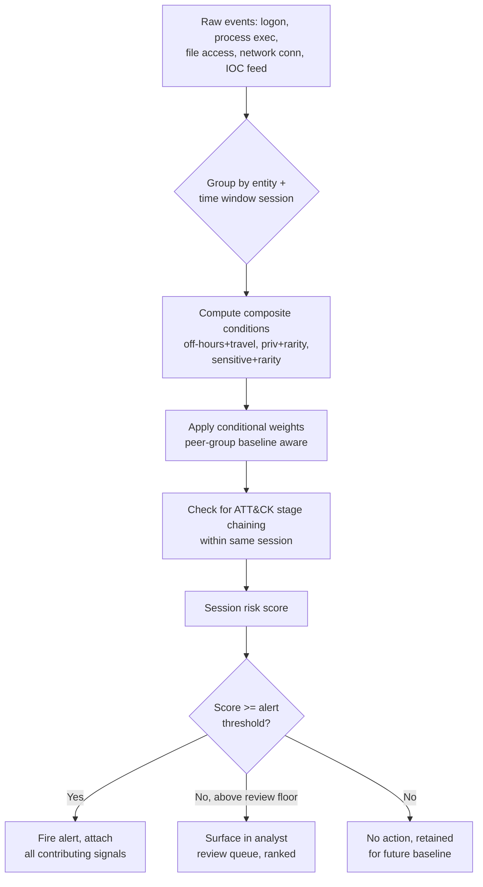

# Part XXIV — Risk-Based Alerting

## Why binary alerting runs out of road

A traditional detection rule is a yes/no gate: the pattern matched, fire an alert, someone triages it. That model works fine when the pattern is high-fidelity — a known-bad hash, a confirmed C2 domain, a Mimikatz string in command-line arguments. It falls apart the moment you try to detect *behaviour* rather than *artifacts*, because most individual behavioural signals are weak. A service account authenticating from a new source IP is not an incident. A PowerShell process making an outbound HTTPS connection is not an incident. An admin account logging in outside business hours is not an incident. Each of these, alone, generates too many false positives to alert on directly — so most teams either suppress them entirely (losing coverage) or alert on them anyway (losing analyst attention to fatigue).

[CONCEPT] Risk-based alerting (RBA) is the practice of scoring individual weak signals, accumulating those scores against an entity (a user, a host, a session, a case) over a time window, and firing an alert only when the accumulated score crosses a threshold — or surfacing entities ranked by score for proactive review rather than waiting for a single rule to trip. The alert is no longer "rule X matched." It's "this entity's behaviour this week is unusual enough, on enough independent dimensions, to warrant a look."

This chapter covers the scoring factors that matter in practice, how to combine them without fooling yourself, and where the naive version of this idea — summing arbitrary point values — actively produces wrong answers.

## The eight factors worth scoring

None of these factors is new information. What changes under RBA is that you stop asking "did this cross a fixed threshold" for each one in isolation, and instead treat each as a contributor to a combined judgment about the entity.

### 1. Identity privilege

[DETECTION ENGINEER] The same raw event means different things depending on who generated it. A failed logon from a standard user account is noise; a failed logon from a Domain Admin account, a break-glass account, or a service account with `SeDebugPrivilege` is not. Privilege tiering (Microsoft's Tier 0/1/2 model, or your own equivalent) gives you a lookup table: account name or group membership → privilege weight. Feed this from your identity provider (Active Directory group membership, Okta/Azure AD role assignments, PAM vault checkout logs) — not from a static CSV someone built eighteen months ago and never updated.

**Engineering Reality:** Privilege tier tables rot. Someone gets added to Domain Admins for a migration project and stays there for two years. If your risk engine trusts a stale tier mapping, you will simultaneously under-score a genuinely elevated account that fell out of your CSV and over-score a low-risk account that was never cleaned up. Pull privilege data live from the directory at scoring time, or refresh the cache on an interval short enough to matter (hours, not months), and log the mapping's age so an analyst can sanity-check "was this account actually privileged at the time of the event."

### 2. Asset criticality

[CONCEPT] Not all hosts are equal. A workstation in the marketing department and the domain controller that issues Kerberos tickets for eleven thousand accounts should not carry the same weight for an identical event (say, a new scheduled task creation). Asset criticality is usually a tiered classification — crown-jewel servers, tier-0 infrastructure, regulated-data stores, then everything else — maintained in a CMDB, asset inventory, or tagged in your EDR console.

[MANAGEMENT] The failure mode here is coverage theater: a criticality list that was built once during an audit and never reconciled against what's actually running. If the CMDB says a host is a "test box" but it's actually running production billing, your risk score for events on that host will be systematically wrong in the dangerous direction — too low. Asset criticality should be reviewed on the same cadence as your asset inventory process, and ideally cross-checked against actual data flows (what talks to what, what processes production data) rather than a label someone assigned at provisioning time.

### 3. Threat reputation

[CONCEPT] Reputation is externally-sourced context about an indicator: is this destination IP, domain, hash, or certificate associated with known infrastructure, a known campaign, or a low-reputation ASN/hosting provider. Threat intel feeds (commercial, open-source, ISAC-shared, or your own honeynet enrichment pipeline) supply this.

[THREAT HUNTER] Reputation scoring is the factor most prone to false confidence. A domain with no reputation hits is not a clean domain — it might just be new, or your feed might not cover it yet. Treat absence of a reputation hit as "unknown," not "benign," and never let a clean reputation check suppress an otherwise-suspicious behavioural chain. Conversely, a single reputation hit on a widely-shared piece of infrastructure (a compromised WordPress site briefly serving malware, a shared cloud IP later reused by legitimate tenants) can be stale or overbroad. Reputation should nudge a score, rarely gate it outright.

### 4. Behaviour rarity

[DETECTION ENGINEER] This is the workhorse of most modern risk engines: is this specific behaviour rare *for this entity* (a user running a tool they've never run before), rare *for this peer group* (a behaviour common on the DevOps team but never seen on Finance), or rare *across the whole environment* (a LOLBin combination nobody has used in ninety days). Rarity requires a baseline — which means it requires enough historical data, stored long enough, to compute "never seen before" honestly rather than "never seen because we only started logging last Tuesday."

**Engineering Reality:** Rarity scoring silently breaks the first time you onboard a new business unit, roll out a new tool company-wide, or acquire another company. Every account in the newly onboarded population looks maximally "rare" against your old baseline because none of them exist in it yet. If you don't age out or re-baseline after known population changes, you get a spike of noise that looks like a detection engine improvement and is actually a data problem.

### 5. Detection confidence

[CONCEPT] Every analytic that contributes a signal has its own known false-positive rate. A YARA hit on a packed executable and a hardcoded Mimikatz command-line string do not deserve equal weight — the latter is far more likely to indicate what it says. Confidence should be attached to the *analytic*, tracked over time from triage outcomes (how often did this rule's firings get closed as true positive vs. benign-true-positive vs. false positive), and revised as you gather more disposition data. Treat it as a live metric, not a value picked at rule-authoring time and forgotten.

### 6. Sequence completion

[THREAT HUNTER] Individual techniques matter less than whether they chain into a plausible attack sequence — discovery, then credential access, then lateral movement, then collection, in a timeframe consistent with hands-on-keyboard activity rather than coincidence. A risk engine that scores "recon command run" and "new admin login" as two independent unrelated blips misses the point; scored as *steps 1 and 3 of a plausible ATT&CK chain for the same entity within the same 45-minute window*, they mean something different. This is where session- or case-based scoring (grouping events by user+host+time window rather than scoring each event in isolation) earns its cost.

### 7. Known malicious IOC match

[CONCEPT] A direct match against a confirmed-bad indicator — a hash on a malware sample, a C2 domain from an active campaign, a known-compromised credential from a breach dump — is qualitatively different from the softer signals above. It's not "unusual," it's "known-bad." Most risk engines correctly treat a confirmed IOC match as a large, sometimes threshold-crossing-on-its-own contribution, separate from the statistical/behavioural signals.

### 8. Sensitive data access

[ANALYST] What was touched matters as much as who touched it and from where. Access to a file share tagged as containing PII/PHI/PCI data, a query against a table holding customer records, or a read of a secrets vault entry should weight differently than access to a shared drive of internal wiki exports. This requires data classification to exist and be current — which, in most environments, it isn't, or is only partially rolled out. Where classification doesn't cover a given data store, say so explicitly in the scoring logic (a fourth state: "sensitivity unknown," not silently treated as "not sensitive").

## Combining signals: the correlation trap

Here is where teams get into trouble. The intuitive move is: assign each factor a point value, sum the points across all signals fired for an entity in the scoring window, alert when the sum crosses a threshold. It's simple, it's explainable in a slide to management, and it is frequently wrong — because it assumes the signals are statistically independent, and they usually aren't.

[CONCEPT] Two signals are independent if knowing one tells you nothing about the likelihood of the other. Two signals are correlated if they tend to co-occur for reasons that have nothing to do with the thing you're trying to detect. Naive summation treats every combination of fired signals as equally informative, regardless of whether those signals are actually five independent pieces of evidence or one underlying cause wearing five different signal costumes.

### Detection Autopsy: the naive sum that flags the wrong analyst

**Original logic.** A SOC builds a risk score per user per day:

- New source IP for a login: +20
- Login outside normal hours: +15
- PowerShell execution: +10
- Access to a file share tagged "sensitive": +15
- Behaviour rarity (process never seen for this user): +20
- Alert threshold: 50

This looks reasonable on paper — five plausible weak signals, none of them alone concerning, summed to catch the entity that trips several at once.

**Why it looked reasonable.** Each individual weight was calibrated against how often that signal alone was a true positive in a sample of past incidents. The team validated each row independently and multiplied through.

**What breaks in production.** A detection engineer on the on-call rotation VPNs in from a hotel during an incident response engagement (new source IP, +20), works the incident at 2 a.m. (outside normal hours, +15), runs PowerShell to pull Sysmon configs and triage scripts (PowerShell execution, +10; behaviour rarity, because they don't normally run these scripts, +20), and opens a case file on a "sensitive"-tagged share to document the finding (+15). Total: 80. Alert fires, tuned as high-confidence "insider threat candidate."

The five signals are not independent — they are five *consequences of one cause* (this person is doing incident response work off-hours), not five separate pieces of evidence pointing at compromise. Naive summation double-, triple-, and quintuple-counts the same underlying explanation. Meanwhile a genuinely suspicious but quieter case — a service account that only trips "new source IP" and "sensitive data access," because the rest of its activity looks routine by design — scores 35 and never surfaces.

**False positives.** Any legitimate off-hours, off-network work pattern (on-call responders, follow-the-sun support handoffs, anyone traveling) racks up correlated points fast and dominates the top of the risk queue, burying genuinely rare combinations under a pile of "this person's job just looks like this."

**False negatives.** Signals that are individually rare *and* actually independent — a compromised low-privilege account that got a confirmed IOC match on an outbound connection, and separately touched a sensitive share it had legitimate access to but rarely used — might sum to something below threshold if the scoring never asked whether the combination made sense together, only whether the total crossed a line.

**Missing context.** The model has no notion of *why* a signal fired — no linkage to an open IR case, an on-call schedule, a change ticket, or a peer-group baseline (other responders on this rotation show the identical pattern that week). It also has no notion of conditional relationships: "outside normal hours" and "new source IP" are not two independent 1-in-20 events for a traveling responder — they're one event with two names.

**Revised analytic.** Instead of summing raw weights, the team restructures scoring around three changes:

1. **Group correlated signals before scoring, not after.** "Off-hours + new source IP + no on-call/travel context" becomes one composite condition, not two additive line items. If an on-call/travel exception source exists (PagerDuty schedule, travel calendar, VPN policy exception list), the composite is suppressed or down-weighted, not summed on top of.
2. **Weight by conditional rarity, not marginal rarity.** Behaviour rarity should ask "how rare is running this specific PowerShell script *given that this account is on the SOC/IR team*," not "how rare is PowerShell execution for this account historically." Peer-group baselines catch this; global baselines don't.
3. **Require independence-aware combination for escalation, not just a sum.** A simple approach: only let the *top two* signal categories by weight count at full value, and heavily discount additional signals from the same underlying category (identity/context, data access, execution). A more rigorous approach — where the analytics team has enough labeled outcome data — is a Bayesian or log-odds combination that explicitly models P(compromise | signal A) and updates rather than adds, so correlated signals stop compounding linearly.

```
Naive:      score = w1*s1 + w2*s2 + w3*s3 + w4*s4 + w5*s5
Better:     score = f(context-adjusted composite conditions,
                       weighted by conditional rarity given entity's peer group,
                       capped contribution per underlying cause)
```

**How it was tested.** The team replayed twelve months of on-call/IR-responder activity plus eight confirmed insider-risk and compromised-account cases through both models. The naive model ranked seven of the top ten "highest risk" days as responder off-hours work; zero of the eight confirmed cases were in the naive top 20. Under the revised model, off-hours responder work dropped out of the top ranks (composite suppressed by the on-call exception list), and six of the eight confirmed cases appeared in the top 15.

**Result.** The revised model didn't add new detection logic — it removed double-counting and added one contextual suppression list. Analyst time spent on the top-of-queue entities dropped because the queue stopped being dominated by the same three people's normal jobs.

### The general lesson

**Hunter's Note:** If your top-10 risk-ranked list is stable week over week and it's always the same job function (on-call, IT admins, backup operators), you're not scoring risk — you're scoring "whose job looks unusual by the baseline you built." That's a modeling bug, not a threat.

Before adding a factor to a sum, ask three questions:

1. **Is this factor caused by the same underlying condition as another factor I'm already scoring?** If yes, combine them into one composite before weighting, don't add both.
2. **Does this factor mean something different depending on the state of another factor?** (Behaviour rarity means something different for a privileged account than for a standard one — that's an interaction, not two independent additive terms.)
3. **Do I have outcome data to check whether the combined score actually correlates with confirmed incidents, or am I just trusting that the arithmetic feels right?**

[MANAGEMENT] This is also a governance and explainability problem, not just a math problem. If an analyst — or a regulator, or an employee under an insider-threat investigation — asks "why did this score fire," the answer needs to be more than "it summed to 87." You need to be able to show which signals fired, why they were weighted as they were, and why the combination was treated as more than the sum of unrelated parts. Vendor UEBA/SIEM risk-scoring products vary widely in how transparent this math actually is; test with your own labeled data before trusting a vendor's default weights, and ask the vendor directly whether their model treats signals as independent or accounts for correlation.

## A worked example: session-based risk scoring in practice

[DETECTION ENGINEER] Below is an illustrative structure for accumulating a session-level risk score, combining several of the eight factors, with composite grouping applied to avoid the naive-sum trap above. This is written in a generic pseudo-SPL/KQL hybrid style to focus on the logic rather than a specific product's exact syntax — treat query syntax as illustrative, not copy-paste-ready.

```
// ILLUSTRATIVE — conceptual scoring pipeline, adapt syntax to your SIEM

// Step 1: build composite conditions per session (user + host + rolling 4h window)
composite_offhours_travel = (login_hour NOT IN business_hours)
                              AND (source_ip NOT IN known_ip_ranges)
                              AND NOT (user IN oncall_schedule OR user IN travel_exceptions)

composite_priv_execution  = (identity_tier <= 1)
                              AND (process_rarity_score > 0.9 for this user's peer group)

composite_sensitive_touch = (data_classification IN ["PII","PCI","secrets"])
                              AND (access_rarity_score > 0.8 for this user)

// Step 2: score composites, not raw signals
session_score =
      (composite_offhours_travel  * 25) +
      (composite_priv_execution   * 30) +
      (composite_sensitive_touch  * 25) +
      (ioc_match_confirmed        * 60) +          // large, near-threshold on its own
      (sequence_chain_score)                        // separately computed, see below

// Step 3: sequence chain bonus — only if >=2 distinct ATT&CK stages
// observed for the SAME session within the window
sequence_chain_score = CASE
    WHEN distinct_attack_stages >= 3 THEN 40
    WHEN distinct_attack_stages == 2 THEN 15
    ELSE 0
END

// Step 4: escalate
alert_if session_score >= 70
review_queue_if session_score >= 40 AND session_score < 70
```



## Testing and tuning a risk-based model

[DETECTION ENGINEER] Before deploying score-based alerting, you need:

- **A labeled outcome set.** At minimum, past incident timelines mapped to what your candidate factors would have scored at the time, so you can check whether the model would have surfaced them and where in rank order.
- **A stability check.** Run the model against 30-90 days of production data before it alerts anyone, and look at the top-N ranked entities every day. If the same non-incident population dominates the top of the list day after day (see the Detection Autopsy above), you have a correlation problem before you have a threshold problem.
- **A threshold sensitivity pass.** Chart alert volume against threshold value across a wide range, not just around your intended cutoff — this reveals whether you're near a cliff (small threshold change, huge volume change) which usually indicates one dominant correlated factor doing most of the work.
- **A decay/window design.** Decide explicitly whether score accumulates and decays (older contributions matter less) or resets per fixed window (daily/session), and document why — this materially changes detection latency versus persistence-of-suspicion tradeoffs.

[SOC MANAGEMENT VIEW] Risk-based alerting is often sold as a fatigue-reduction mechanism, and it can be — instead of forty low-fidelity alerts, one ranked queue. But it shifts cost rather than eliminating it: you now need someone who can explain and maintain the scoring model, re-baseline it after organizational change, and audit it for the correlation problems described above. Budget for a model owner, not just a rule author, and expect the tuning cycle to run on a similar cadence to detection engineering itself — quarterly review at minimum, sooner after any acquisition, reorg, or major tooling rollout that shifts what "normal" looks like for large populations at once.

**Hunter's Note:** When hunting inside a risk-scored environment, don't just pull the top of the ranked queue — pull the entities sitting just under threshold for multiple consecutive windows. An adversary who understands (or empirically discovers through trial and error) roughly where your alert line sits will pace their activity to stay under it. Consistent sub-threshold scoring over time is itself a signal the point-in-time model doesn't see.

## Summary

Risk-based alerting earns its complexity when it lets you act on combinations of individually weak signals that no single rule could justify alerting on alone. It fails — sometimes quietly, sometimes in a way that actively misdirects analyst attention — when the combination math assumes independence that doesn't exist. Score composite conditions instead of raw signals where signals share an underlying cause, weight rarity conditionally on peer group and role rather than globally, treat confirmed IOC matches and multi-stage sequence chaining as qualitatively different from statistical rarity, and validate the combined model against labeled outcomes before trusting the ranked queue it produces.
