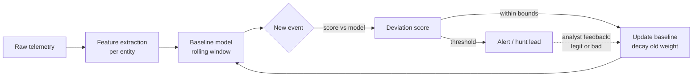

# Part XXV — Baselining

Everything before this part assumed a fixed reference: a known-bad string, a known-bad hash, a
known-bad process ancestry. Baselining flips the model — instead of asking "does this match
something bad," it asks "does this match what *this entity* normally does," and treats deviation
itself as the signal. That reframe is powerful because it catches novel behavior that no signature
covers. It is also where detection engineering gets genuinely hard, because "normal" is not a
constant — it drifts by user, by host, by hour, by season, and by business event, and the baseline
has to drift with it without becoming so loose it stops meaning anything.

This chapter is deliberately skeptical of baselining as a silver bullet. Every baseline type below
comes with the failure modes that make it noisy in production, because a baselining program that
ships without those failure modes designed in from day one will be disabled by week three.

## 1. What a baseline actually is

[CONCEPT] A baseline is a statistical or rule-based model of "expected" values for some entity
(user, host, service account, peer group, network segment) over some set of features (login times,
process names, data volumes, destination countries, parent-child pairs), built from historical
observation, against which new observations are scored for deviation.

[ENGINEERING] A baseline is not one number. It is at minimum: an entity identifier, a feature set,
a time window used to build it, an update/decay policy, and a scoring function that turns "how far
is this new observation from the model" into something an analyst or downstream rule can act on
(a z-score, a percentile rank, a distance metric, a simple "seen before / never seen before"
boolean). Teams that skip the decay policy end up with baselines that either never update (stale,
false-positive-heavy after any legitimate change) or update on every event (the baseline chases the
attacker's behavior and absorbs it as normal — see Section 8).



[MANAGEMENT] Baselining is not a product you buy and turn on. It is a program: someone owns the
feature definitions, someone reviews false-positive feedback and feeds it back into the model,
someone owns the exception list for known seasonal/role-based outliers. If nobody owns that loop,
baseline-driven alerts decay into noise within a quarter and get tuned to near-silence, which
defeats the purpose of having built them.

## 2. Per-user baselines

[CONCEPT] Models built per individual account: typical login hours, typical source IPs/ASNs,
typical applications touched, typical data volumes, typical process lineage if the user also has
interactive workstation access.

[ANALYST] Per-user baselines are the highest-fidelity baseline type because the population size is
one — there's no averaging-away of individual habits. That also makes them the most fragile: a
single role change, a single new project, a single vacation followed by catch-up work, and the
"normal" shifts entirely.

[DETECTION ENGINEER] Practical per-user features that hold up reasonably well: (1) login
hour-of-day/day-of-week distribution, (2) set of applications/resources accessed in a rolling
30-day window, (3) source ASN/geolocation set, (4) typical session duration, (5) typical outbound
data volume for file-access-heavy roles. Score new events against the *set* the user has built up,
not a single average — a threshold like "never logged in from this country before, in combination
with off-hours timing" is far more durable than "logged in 2 standard deviations later than usual,"
which fires constantly for anyone with irregular hours.

**Detection Autopsy: the naive per-user off-hours rule**

*Original logic:* "Alert if a user authenticates more than 3 standard deviations outside their
mean login hour, computed over the trailing 90 days."

*Why it looked reasonable:* Off-hours access is a real indicator of compromised-credential misuse,
and a rolling mean/stddev is trivial to compute in most SIEMs with a lookup table or summary index.

*What breaks in production:* Login-hour distributions for real humans are not Gaussian. They're
often bimodal (early birds who also work late to cover an overseas team) or have hard floors and
ceilings with a long uniform-ish tail (on-call rotation, month-end close, incident response).
Standard deviation on a non-Gaussian, low-sample-count-per-user distribution produces a threshold
that's either absurdly tight (fires on legitimate variation weekly) or so loose (inflated by a few
outlier days) that it misses the actual 3 a.m. login from a new ASN that mattered.

*False positives:* On-call engineers, finance during close week, anyone who traveled and is still
on source-timezone habits, anyone whose job includes intentional off-hours maintenance windows.

*False negatives:* An attacker who logs in during the victim's normal working hours (very common
once they've done any reconnaissance, or with a compromised account in a follow-the-sun team) sails
through untouched — the rule only looks at time, not source, resource, or behavior after login.

*Missing context:* No join against calendar/on-call schedule, no join against travel/VPN state, no
correlation with *what* was accessed after the login, no peer-group cross-check ("is this unusual
for this person, or is the whole team doing month-end close right now").

*Revised analytic:* Score deviation on multiple weakly-correlated features and require
co-occurrence rather than any single feature crossing a threshold: unusual hour AND unusual
source-ASN (never seen in the user's 90-day history) AND access to a resource outside the user's
established access pattern. Suppress if the login hour falls within a documented maintenance
window or the account is flagged on-call for that period.

*How it was tested:* Replayed 90 days of authentication logs for a sample of ~200 accounts across
roles (engineering, finance, sales, on-call rotation) against both the naive rule and the revised
multi-feature rule; compared alert volume and manually reviewed a sample of alerts from each for
true/false-positive rate.

*Result (illustrative, from that kind of exercise — treat as a pattern, not a citation):* naive
rule produced roughly an order of magnitude more alerts, dominated by on-call and finance-close
false positives; revised rule's alert volume was low enough for daily analyst review and still
caught the seeded "new ASN + off-hours + first-time resource access" test case.

[THREAT HUNTER] Hunt the inverse of the rule: accounts with *zero* variance in login time/location
over a long window are worth checking too — either a very disciplined human, or a scheduled task
running under a human account (a service-account-in-disguise, see Section 6), or a compromised
account being used on a fixed automated schedule by the attacker's own tooling.

## 3. Per-host baselines

[CONCEPT] What does *this machine* normally run: process inventory, listening ports, scheduled
tasks, installed services, typical network destinations, typical logon sessions (which accounts
log on to it, interactively vs. via service).

[ENGINEERING] Per-host baselines are cheaper to build for servers than for user workstations,
because servers have a much narrower legitimate behavior envelope — a database server's process
list and outbound connections should be nearly static. Workstations are messy: users install
software, browsers spawn helper processes constantly, and "new process never seen on this host
before" fires on every software update unless you dedupe by publisher/signature rather than exact
binary hash/path.

[DETECTION ENGINEER] Useful per-host features: first-seen-on-this-host process names (grouped by
signed publisher, not raw hash, to survive patching), first-seen listening port, first-seen
outbound destination ASN, new scheduled task/service creation, and change in the set of accounts
that log on interactively to a host that's supposed to be headless (servers, in particular — an
interactive logon to a server that normally only receives service-account/RDP-from-jump-box
traffic is a strong signal regardless of *when* it happens).

```
CONCEPTUAL SAMPLE — new-process-on-server hunt output (illustrative, not captured):
host=DB-PROD-07  process=powershell.exe  publisher=Microsoft (already common fleet-wide)
  first_seen_on_host=true   first_seen_fleet_wide=false   parent=sqlservr.exe
```
That combination — common elsewhere, never seen on *this* host, with an unusual parent — is exactly
the kind of signal a fleet-wide "is this binary known-good" check would miss but a per-host
baseline catches.

[HUNTER'S NOTE] "First time this binary ran on this host" is a much better hunting pivot than
"first time this binary ran anywhere in the environment." The second one is dominated by legitimate
software rollout noise; the first one, scoped to servers with a narrow role, is a short list you
can actually review.

## 4. Peer-group baselines

[CONCEPT] Instead of comparing a user or host against its own history, compare it against others
that share a role: same department, same job title, same OU, same server function tag, same team
in the HR system.

[ANALYST] Peer-group baselines solve the cold-start problem (Section 8) and the role-change problem
for individual entities, because a new hire or a newly-provisioned host has no history of its own
but does have peers with history. They introduce a different failure mode: peer-group definition
quality. If "peer group" is defined by an org chart field that's stale, wrong, or too coarse (all
of "Engineering" treated as one peer group when it contains SREs with production access and
frontend developers who've never touched a server), the baseline will flag normal role-specific
behavior as anomalous for everyone who doesn't match the group's dominant pattern, and miss actual
anomalies that fall inside the group's overly-broad envelope.

[DETECTION ENGINEER] Peer-group scoring is usually: build the feature distribution across the
group, then score the individual against the group distribution (percentile rank or distance from
group centroid) rather than against their own history. A common combined approach: score against
self-history AND peer-group, and treat "anomalous for both self and peer group" as higher
confidence than either alone, while "anomalous for self, normal for peer group" often means a
legitimate role change rather than compromise (worth routing to an HR/IT-change lookup instead of
an incident queue).

[MANAGEMENT] Peer-group quality is an identity-governance problem before it's a detection problem.
If HR/IdP role and group data is unreliable, invest there first — no amount of baseline tuning
compensates for comparing an account against the wrong reference population.

## 5. Time-of-day, day-of-week, and seasonal baselines

[CONCEPT] Business activity has rhythm: daily (business hours vs. overnight batch), weekly
(weekday vs. weekend), and seasonal (month-end/quarter-end close, holiday retail spikes, tax
season, academic-year boundaries for education-sector environments, patch-Tuesday-driven admin
activity spikes).

[ENGINEERING] A baseline that only models "hour of day" without also modeling "day of week" and
"time of month/quarter" will flag every month-end close, every Black Friday, every open-enrollment
period as anomalous, every single cycle, forever, because it never learns that the cycle itself is
normal. The fix is to model at the right granularity — day-of-week-and-hour combined at minimum,
and where the business has known recurring events (close, open enrollment, seasonal retail), an
explicit calendar overlay that widens or relaxes thresholds during those windows rather than
relying on the statistical model to eventually absorb them.

[SOC Management View — cost/coverage] Building a calendar overlay requires talking to Finance, HR,
and the business, not just the SIEM. That coordination cost is real and recurring (fiscal calendars
change), but it is far cheaper than the analyst-hours burned re-investigating the same seasonal
false positive every quarter. Budget an owner for the calendar, not just the query.

[THREAT HUNTER] Seasonal cover is also an attacker opportunity, not just a detection-engineering
headache — intrusions timed to land during month-end close or a known maintenance window rely on
defenders (and baselines) being tuned to expect noise. When hunting during a known high-activity
window, don't just suppress alerts — spot-check that the *content* of the activity still matches
the expected pattern (same job functions doing the volume, not new accounts or new destinations
riding along on the cover of the spike).

## 6. Service-account and application baselines

[CONCEPT] Non-human accounts — service accounts, scheduled-task identities, application service
principals, API keys, CI/CD pipeline credentials — have behavior that should be *more* predictable
than human behavior, not less: fixed source hosts, fixed destination resources, fixed schedule,
fixed action set.

[ENGINEERING REALITY] In most environments, service-account behavior is not actually clean. Shared
service accounts get reused across multiple applications over the years because provisioning a new
one requires a change ticket nobody wants to file. Interactive logons happen on service accounts
because an admin used it to troubleshoot once and it became habit. Any per-user baseline logic that
assumes "service accounts are simple" will be wrong the first time you look at real production
account-usage logs. Build the baseline from what the account actually does, and flag the
*discovery* that a service account has interactive-logon capability or human-typical behavior
(browsing, mail access, varied source hosts) as a finding in itself, independent of any specific
malicious event.

[DETECTION ENGINEER] Service-account baselines are one of the highest-signal-to-noise baseline
types precisely because the legitimate envelope is narrow. Good features: fixed set of source
hosts (should be a short, stable list), fixed set of target resources, absence of interactive logon
type (Windows logon type 2/10 on an account that should only ever use type 3/service logons is a
strong flag), absence of any non-business-hours drift beyond the account's own fixed schedule
window, and no browser/mail-client process ever associated with the account's sessions.

```yaml
title: Service Account Interactive Logon Outside Established Host Set
id: part25-01
status: experimental
description: >
  Flags an interactive or RDP logon (Logon Type 2, 7, 10, or 11) for an account
  tagged as a service/non-interactive account in the identity inventory, and/or
  a logon from a source host not present in that account's established source-host
  baseline over the trailing 60 days.
logsource:
  product: windows
  service: security
detection:
  selection_logon:
    EventID: 4624
    LogonType:
      - 2
      - 7
      - 10
      - 11
  selection_account_tag:
    # Enriched at ingest from identity inventory / IdP export
    AccountType: 'service'
  filter_known_host:
    # Requires a lookup list maintained from the account's own rolling history
    WorkstationName: '%service_account_baseline_hosts%'
  condition: selection_logon and selection_account_tag and not filter_known_host
falsepositives:
  - Legitimate admin troubleshooting session on the account (should be governed by
    a break-glass/PAM process, not silent)
  - New host added to a legitimate rotation without updating the baseline list
level: high
```

[THREAT HUNTER] Hunt for service accounts with *any* successful authentication from a source that
is a general-purpose user workstation subnet rather than a server/application subnet — that
mismatch is a durable signal independent of time, because well-run service accounts simply don't
originate there. Also hunt for service accounts whose credential has ever been entered
interactively (a human typing the password rather than an application using a stored
secret/certificate) — inconsistent typing cadence or the presence of a logon prompt UI trace is a
tell where that telemetry exists.

## 7. Network and geographic baselines

[CONCEPT] Expected traffic volumes and directions per segment/host pair, expected destination
countries/ASNs per user or organizational unit, expected protocol mix, expected DNS query patterns.
This overlaps with Parts IX and X (network and DNS detection) but the baselining angle is specific:
instead of matching known-bad indicators, it's modeling the *shape* of normal traffic and flagging
departures.

[ANALYST] Impossible-travel and new-country logins are the most familiar geographic baseline
output, and also the most abused by false positives: corporate VPN egress points, cloud provider
NAT gateways, and mobile carrier IP reassignment all produce apparent "travel" that never happened
physically. Treat impossible-travel purely as a lead, never as standalone proof, and always check
whether the "travel" correlates with a known egress-IP change (VPN provider rotated exit node,
company added a new regional office egress) before escalating.

[DETECTION ENGINEER] For geographic/network baselining to be useful rather than noisy: (1) maintain
an allowlist of known corporate egress ranges (VPN concentrators, cloud NAT, office public IPs) and
score against "new country/ASN *excluding* known egress" rather than raw geo-IP on the observed
source, (2) build the baseline per user/account, not globally — "new to the org" and "new to this
specific account" are very different confidence levels, (3) decay old countries out of the baseline
if a user hasn't used them in a long time (a country visited once for a conference 18 months ago
shouldn't stay whitelisted forever).

[ENGINEERING] Geo-IP databases are wrong more often than most detection content assumes — VPN
providers, satellite ISPs, and mobile carriers regularly misattribute country, and databases lag
real-world IP reallocation. Log the geo-IP database version/vintage alongside any alert that relies
on it, because "the country was wrong" is a legitimate and common false-positive root cause you'll
need to explain during tuning review.

**Worked example — impossible travel with peer and network context**

Illustrative KQL-style query (Microsoft Sentinel/Log Analytics syntax; treat as illustrative, not
guaranteed to run unmodified):

```kql
SigninLogs
| where ResultType == 0
| extend Country = tostring(LocationDetails.countryOrRegion)
| summarize arg_max(TimeGenerated, Country, IPAddress) by UserPrincipalName, bin(TimeGenerated, 1h)
| serialize
| extend PrevCountry = prev(Country), PrevUser = prev(UserPrincipalName), PrevTime = prev(TimeGenerated)
| where UserPrincipalName == PrevUser and Country != PrevCountry
| extend HoursBetween = datetime_diff('hour', TimeGenerated, PrevTime)
| where HoursBetween < 4  // not enough time to physically travel between the two countries
| join kind=leftanti (
    KnownEgressRanges  // maintained allowlist: corporate VPN / NAT / office ranges
    | project IPAddress
) on IPAddress
| project UserPrincipalName, PrevCountry, Country, PrevTime, TimeGenerated, HoursBetween, IPAddress
```

This still needs the peer-group and per-user history join layered on top before it goes to an
analyst queue: has *this* user ever used a VPN provider that exits from surprising countries, is
*this* whole peer group showing the same pattern today (points to a VPN provider change, not
individual compromise), and does the account's subsequent activity (resource access) look like the
established pattern for that user or like something new.

## 8. The hard problems

[CONCEPT] Every baseline type above shares a set of structural weaknesses. These are the ones that
determine whether a baselining program survives contact with a real environment.

### Cold start

[ANALYST/ENGINEER] A new user, a new host, a new service account, a newly onboarded acquisition's
entire user population — none of them have history. Any "compare to own history" baseline is blind
for them, usually for the exact window (first days to weeks) when misconfiguration, initial
provisioning mistakes, or opportunistic attack against a freshly-created and not-yet-hardened
identity are most likely.

[DETECTION ENGINEER] Mitigate with peer-group baselines as the fallback for any entity below a
minimum history threshold (state explicitly in the model: "if history_days < 14, score against
peer group only, flag output as lower-confidence/cold-start"), and treat "brand new entity doing
something peer-group-anomalous" as its own alert category rather than silently suppressing it until
history accumulates.

### Seasonality

Covered in Section 5. The structural point: a baseline window that's too short (7-30 days) never
sees the seasonal cycle and treats every recurrence as new; a window long enough to see the cycle
(a full year, for annual events) is often too coarse to catch a genuine day-to-day drift. Practical
resolution is usually two models at different granularities feeding the same entity, not one model
tuned to split the difference.

### Role changes

[ANALYST] A promotion, a team transfer, a temporary assignment to an incident-response or audit
team with elevated access, a return from parental/medical leave into a changed role — all produce a
sudden, entirely legitimate shift in behavior that looks identical to account takeover from a
pure-behavior standpoint.

[DETECTION ENGINEER] The only reliable mitigation is a join against an authoritative HR/IdP change
feed (effective-dated role/group/manager changes), not statistics. If a role change is on record
effective within the baseline's lookback window, either reset that entity's baseline clock or flag
resulting anomalies as "role-change-adjacent, review for correctness of new access, lower priority
for compromise investigation." Without that feed, budget for permanent noise around every internal
mobility event.

### Traveling users and VPN effects

[ANALYST] Business travel produces the same features a real geographic-baseline detection is built
to catch: new country, new source ASN, possibly new time-of-day pattern (working the local
timezone or working origin-timezone hours late into local night). Split-tunnel VPN and full-tunnel
VPN produce *opposite* apparent-location effects for the same physical travel, and users switch
between them inconsistently depending on what they're doing.

[DETECTION ENGINEER] Where the business has a travel-notification process (expense system, travel
booking, calendar), join against it and suppress/downgrade rather than relying purely on statistics
to eventually normalize the new country — by the time the baseline "learns" a country from repeat
false-positive travel, the user may have already stopped traveling there. Where no travel feed
exists, this is a case for explicit user self-service (a "yes, this was me traveling" workflow) —
often cheaper than tuning statistical thresholds and it also produces useful negative-feedback
labels for the model.

### Maintenance windows

[ANALYST] Patch cycles, DR failover tests, infrastructure migrations, and planned outages all
produce host and account behavior that is, correctly, wildly outside normal — mass reboots, unusual
admin logons across many hosts at once, service accounts running ad hoc scripts. This is exactly the
combination ("many hosts, off-hours, admin-level, coordinated") that a well-tuned anomaly detector
is built to escalate hardest, and exactly the combination that fires hardest during legitimate
patch Tuesday follow-through.

[DETECTION ENGINEER] Maintain a maintenance-window calendar (ideally sourced from the change-
management system, not manually re-entered) and gate baseline-driven alerting against it, the same
way you'd gate a threshold rule. Don't suppress everything during a window — a genuine intrusion
timed to ride a maintenance window is a known adversary tactic — but do widen thresholds and route
matches to a lower-urgency review queue rather than paging on-call at 2 a.m. for the fortieth
scheduled reboot.

### Rare-but-legitimate behavior

[ANALYST] Some genuinely normal activity is inherently rare per entity and will always look like an
outlier to a naive model: the once-a-year tax-filing access by an account that otherwise never
touches that system, the one time a senior engineer logs into a production database directly during
a bad incident, the annual disaster-recovery test that exercises a code path nobody's touched since
last year's test. None of these are attacks; all of them will trip a pure statistical anomaly score.

**Hunter's Note:** the fix people reach for first — whitelisting the specific rare event once it's
confirmed benign — is a trap if applied too literally. If you whitelist "this exact account doing
this exact action" after one confirmed-benign occurrence, you've built a rule that would also
whitelist an attacker doing the identical thing next year. Whitelist the *justification* (a
change-ticket ID, an approved break-glass session, a documented annual test), tied to that specific
occurrence, not a standing exemption for the entity or the action pattern going forward.

## 9. Combining baselines: where confidence actually comes from

[DETECTION ENGINEER] No single baseline type above should page anyone on its own. The pattern that
holds up across all of them: treat each baseline type as one weak, individually noisy signal, and
require co-occurrence of two or more independent signal types before escalating to an analyst
queue, while feeding single-signal deviations into a lower-priority hunt backlog instead of
discarding them.

| Signal combination | Confidence | Typical action |
|---|---|---|
| New country only (peer group also shows it) | Low | Suppress / log — likely VPN provider or shared infra change |
| New country + new device + first-time resource access | Medium-high | Analyst queue |
| Off-hours + on-call schedule match | Low | Auto-suppress, log |
| Off-hours + no on-call match + new source ASN | High | Analyst queue, priority |
| Service account interactive logon, known host | Medium | Review, likely break-glass — verify PAM ticket |
| Service account interactive logon, new host, non-business-hours | High | Analyst queue, priority |
| Host: new process, common fleet-wide, no other anomaly | Low | Log only |
| Host: new process on server, unusual parent, first-seen fleet-wide | High | Analyst queue, priority |

[MANAGEMENT] This table is also a staffing argument: a baselining program that pages on any single
weak signal will burn analyst capacity on noise within weeks and get disabled. A program that
requires multi-signal co-occurrence produces a queue an analyst can actually work, at the cost of
slower detection for genuinely novel single-signal attacks — that tradeoff should be an explicit,
documented risk decision by whoever owns detection strategy, not an accident of default thresholds.

## 10. Testing baseline-driven detections

[DETECTION ENGINEER] Baselines can't be validated the same way a static Sigma rule is validated
(replay one known-bad log line against the logic). Validation needs: (1) a representative historical
window to build the baseline from, ideally covering at least one full seasonal cycle relevant to the
entity type, (2) a held-out period with both labeled benign anomalies (known role changes, known
travel, known maintenance windows — pulled from the very sources described in Section 8) and, where
possible, a seeded red-team/purple-team event injected into realistic surrounding traffic, (3) a
scoring pass measuring alert volume and true/false-positive rate against both populations, not just
"did it fire on the injected attack."

> **[SCREENSHOT PLACEHOLDER — CONTROLLED LAB]** — Sysmon process-creation log and Windows Security
> 4624 logon events from a home-lab domain-joined host, captured over a multi-week window covering a
> deliberate role-change simulation (account moved between AD groups) and a scheduled maintenance
> reboot, to illustrate the "role-change-adjacent" and "maintenance-window-adjacent" tagging
> described in Section 8. Fields illustrated: EventID, LogonType, WorkstationName/IpAddress,
> SubjectUserName, TargetUserName, and TimeCreated, joined against a simulated HR-change and
> change-management record.

[THREAT HUNTER] When a baseline-driven alert fires, don't just confirm or deny that single event —
pull the entity's full feature history around it and ask whether the deviation is a step-change
(consistent with a role change or a persistent compromise) or a single-event spike (consistent with
a one-off legitimate exception or a smash-and-grab). That shape distinction usually matters more to
the investigation than the raw deviation score.

## Summary

Baselining earns its place in a detection program by catching behavior no signature was written
for, but it fails the same way every time it fails: someone assumed "normal" was a fixed thing to
measure once, instead of a moving target that needs an explicit decay policy, an explicit calendar
of legitimate disruption, and an explicit feed of ground-truth changes (HR, change management,
travel) to stay honest. Build the feedback loop before you build the model — the model is the easy
part.
