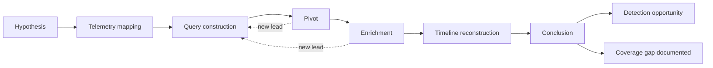
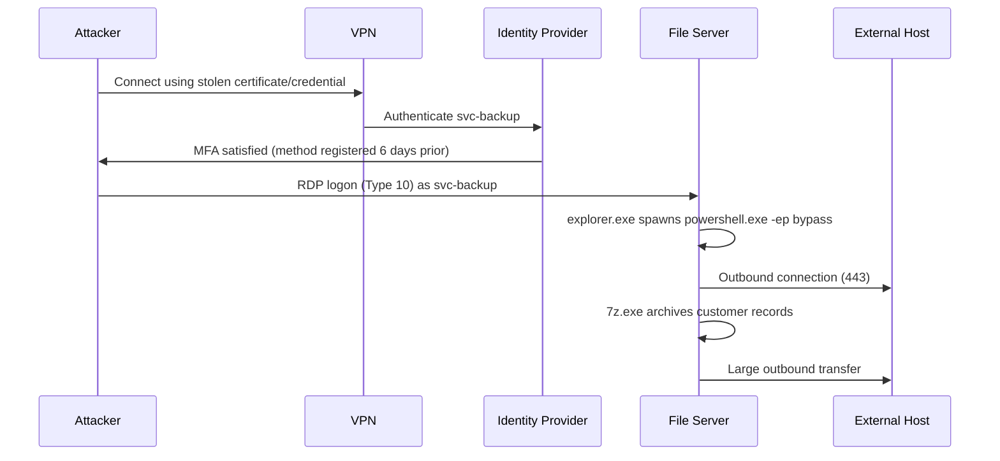

# Part XXVI — Threat Hunting

Threat hunting is often described as "proactive detection," which is true but useless as a working
definition. A more honest one: threat hunting is the disciplined process of testing a specific,
falsifiable idea about attacker behaviour against real telemetry, when no alert has fired to tell
you to look. It only produces value if it ends in one of two concrete outputs — a documented
conclusion that the hypothesis was not supported in this environment (with the coverage gaps that
finding exposed), or a new detection analytic that turns the manual query into an automated one.
A hunt that ends in "nothing found, moving on" with no artefact left behind was not a hunt. It was
an afternoon of log browsing.

This part works through the methodology end to end using one hypothesis that maps onto a real,
common adversary pattern: valid-credential access followed by unusual remote administration.

## 26.1 The methodology



[CONCEPT] Each stage has a specific job. Skipping one is the most common reason hunts produce
noise instead of findings.

| Stage | Purpose | Common failure mode when skipped |
|---|---|---|
| Hypothesis | State a specific, testable claim about attacker behaviour, not a data source | "Let's look at logon events" is not a hypothesis; it has no pass/fail condition |
| Telemetry mapping | Identify which log sources would actually contain evidence, and their known gaps | Querying a source that structurally cannot answer the question, then trusting a negative result |
| Query construction | Build a search broad enough to catch variants, narrow enough to be reviewable | Either zero results (over-narrow) or thousands (under-narrow, no baseline) |
| Pivot | Follow one result's related identifiers (host, user, process, IP, hash) outward | Treating each hit as isolated instead of part of a session |
| Enrichment | Add context the raw event doesn't carry: asset criticality, user role, geolocation, threat intel | Alerting on technically-anomalous-but-organizationally-normal behaviour |
| Timeline reconstruction | Order events across sources by a common clock to see sequence, not just presence | Missing the causal chain — e.g. logon *then* tool install *then* lateral connection |
| Conclusion | State what was and wasn't confirmed, with confidence level | "Inconclusive" with no documented reasoning — the next hunter repeats your work from zero |
| Detection opportunity | Convert the manual query into a scheduled analytic, or explain why it can't be | The hunt's value dies with the hunt; nothing catches the next occurrence automatically |

**Hunter's Note:** if you cannot write the hypothesis as a single sentence with a subject, a
behaviour, and an implied negation ("X should not normally do Y"), you don't have a hypothesis yet
— you have a topic. Keep refining before you touch a query bar.

## 26.2 Hypothesis: unusual remote administration by a valid-credential attacker

**Stated hypothesis:** *An attacker who has obtained valid domain credentials (via phishing,
credential stuffing, token theft, or purchase from an infostealer log) is using a remote
administration channel that is technically permitted in this environment but is not the channel,
account, host, or time pattern that legitimate administrators normally use.*

This is deliberately narrower than "hunt for lateral movement." It excludes exploitation-based
lateral movement (that's a different hypothesis, tested against different telemetry — vulnerability
exploitation leaves crash/exception artefacts, not logon anomalies) and focuses on the
identity-and-tooling angle, which is both extremely common in real intrusions (valid accounts are
the single most reported initial-access-adjacent technique in incident response reporting year over
year) and chronically under-detected because the traffic looks like admin work.

[MANAGEMENT] This hypothesis is worth resourcing because it sits directly on top of a control gap
most organizations have: remote administration tooling is provisioned for operational need, rarely
inventoried completely, and almost never baselined for *normal usage pattern* the way it is
baselined for *presence*. Security teams know RDP, WinRM, and PsExec are allowed. Few can say, with
data, which accounts use which tool, from where, at what hours, on a normal Tuesday.

### What counts as "remote administration" here

| Method | Typical legitimate use | Attacker appeal |
|---|---|---|
| RDP (3389) | Helpdesk, admins, jump hosts, some end-user remote work | Full interactive GUI session, familiar, works over existing allowed ports |
| WinRM / PowerShell Remoting (5985/5986) | Configuration management (DSC, Ansible-via-WinRM), scripted admin tasks | Native to Windows, no extra binary needed, works with `Invoke-Command`, blends with automation traffic |
| PsExec / PsExec-like SMB service creation | Legacy admin scripting, some software deployment tools | Long precedent in intrusion tooling; creates a Windows service remotely over SMB (445) |
| WMI (`wmic`, `Win32_Process.Create`, DCOM) | Inventory tools, some deployment/monitoring agents | Executes without dropping a remote-access binary; can run entirely in-memory from the caller's perspective |
| SSH (Linux/network gear, and increasingly Windows via OpenSSH) | Standard admin channel for *nix and network devices; now shipped in Windows | Ubiquitous, encrypted by default, often less scrutinized on Windows because it's newer there |
| RMM/remote-support tools (AnyDesk, TeamViewer, ScreenConnect/ConnectWise, Atera, Splashtop, etc.) | IT helpdesk, MSP remote support, vendor support sessions | Frequently allow-listed by name for helpdesk use, giving attackers a signed, "trusted" binary that rarely triggers AV/EDR and often traverses egress filtering because it looks like normal support traffic |
| RDP over non-default port, or tunneled (e.g. via SSH, ngrok, Chisel, Cloudflare Tunnel) | Rare legitimately; some vendors tunnel support sessions | Evades port-based detection and network allow-lists entirely |

[ANALYST] "Remote administration" is not one technique in ATT&CK terms — it spans several,
depending on the mechanism: T1021 (Remote Services) covers RDP/SMB/WinRM/SSH/VNC as sub-techniques
(T1021.001 RDP, T1021.002 SMB/Windows Admin Shares, T1021.003 DCOM, T1021.004 SSH, T1021.006
WinRM), T1047 covers WMI, and legitimate RMM tool abuse is generally tracked under T1219 (Remote
Access Software). The hypothesis as stated deliberately spans this whole set because from the
identity-and-baseline angle, the analytic question is the same regardless of which specific channel
gets used — which is exactly why this is a good hunting hypothesis rather than a single-technique
detection.

## 26.3 Telemetry mapping

[ENGINEERING] Before writing a single query, map what each candidate telemetry source can and
cannot tell you. This step alone kills a lot of bad hunts, because a source that "should" have the
answer often doesn't, for boring pipeline reasons.

| Telemetry source | What it confirms | Known gaps |
|---|---|---|
| Windows Security Event Log 4624 (successful logon) | Logon Type (2=interactive, 3=network, 10=RemoteInteractive/RDP), account, source IP/workstation, logon process | Source IP is often the *nearest hop*, not the true origin, when NAT or a jump host is in the path; workstation name is client-supplied and spoofable |
| 4625 (failed logon) | Failed attempts preceding a success — password spraying, credential testing | Volume noise; many legitimate expired-password retries |
| 4648 (explicit credential logon) | "RunAs"-style logons, explicit credential use — often present in lateral movement | Also fires for legitimate scheduled tasks and service accounts using stored credentials |
| Windows RDP-specific: Security 4778/4779 (session reconnect/disconnect), TerminalServices-RemoteConnectionManager Event ID 1149 (client IP for RDP) | Confirms RDP specifically, gives client IP even before authentication completes | 1149 fires on the *TS listener*, not the authenticated logon — pair with 4624 Type 10 to correlate |
| WinRM/PowerShell Remoting: Security 4688 for `wsmprovhost.exe`, WinRM operational log, PowerShell 4103/4104 on the *target* | Confirms WinRM session establishment and what was run inside it | If module/script-block logging isn't enabled on target hosts (common — it's often only enabled on servers people remember to configure), the *content* of the remote session is invisible; only the fact of the connection remains |
| SMB: Security 5140/5145 (share/file access), Sysmon Event ID 3 (network connection) to 445, Security 7045 (new service installed — classic PsExec artefact on the target) | Confirms SMB-based remote execution and service creation | 7045 requires the service to actually install; some PsExec variants clean up quickly; 5145 is extremely high volume and often not centrally collected due to cost |
| WMI: Sysmon Event ID 19/20/21 (WMI event filter/consumer/binding — mostly for persistence, less for one-shot exec), Security 4688 for `WmiPrvSE.exe` spawning a child | Confirms WMI-based remote process creation on the target | One-shot `Win32_Process.Create` calls leave a thin footprint — `WmiPrvSE.exe` as parent of the launched process is often the *only* strong signal |
| EDR process-creation + network correlation | Parent/child chain, command line, and often the network 4-tuple in one record | Vendor field-name and coverage differences; agent gaps on unmanaged or recently-imaged hosts |
| Firewall/proxy/NetFlow | Confirms an outbound or lateral connection to a known RMM vendor's cloud relay IP ranges/domains, or an unusual internal 3389/5985/445 flow | TLS means payload is invisible; you're relying on destination IP/domain/JA3-style fingerprinting, which vendors change over time |
| DNS query logs | Resolution of RMM vendor domains (`*.anydesk.com`, `*.teamviewer.com`, etc.) or dynamic-DNS/tunnel domains before a connection | Only useful if the tool resolves a domain rather than connecting directly to a hardcoded IP; DoH bypasses this entirely if not intercepted |
| Identity provider logs (Entra ID / Okta sign-in logs) | Confirms the credential's use pattern independent of the endpoint — device, location, risk score, MFA method used | Only covers cloud-integrated auth; a purely on-prem NTLM/Kerberos logon to a workstation may never touch the IdP |

**Engineering Reality:** on most environments the *content* of a WinRM or SSH remote session is
not logged anywhere centrally unless someone specifically turned on script-block logging or
`auditd`/shell-history forwarding on the target. What you will actually have, most of the time, is
proof a connection happened and who authenticated — not what was typed. Design the hunt around
that constraint instead of assuming session content will be there when you need it.

## 26.4 Establishing normal: users, hosts, and time patterns

[THREAT HUNTER] The entire hypothesis rests on a comparison to baseline. Before judging anything
"unusual," build the baseline deliberately rather than trusting instinct.

**Users.** Query 30-90 days of authenticated remote-admin sessions (4624 Type 10, WinRM
connections, RMM tool launches) grouped by account. In most mid-size environments this distribution
is sharply skewed: a small set of named admin accounts and a handful of service accounts account
for the overwhelming majority of sessions. Flag two populations for closer baseline work:

- Accounts that use remote admin channels *rarely* (a handful of times over the window) — when they
  do appear, it's worth knowing why, since infrequent use is both normal for occasional escalations
  and exactly the pattern a compromised regular-user account would show if abused for lateral
  movement.
- Accounts that *never* use certain channels — e.g., no service account on record has ever
  initiated an RDP session, because service accounts don't have interactive logon rights configured
  for that purpose. A first-ever RDP or interactive WinRM session from a service account is a strong
  anomaly almost regardless of other context.

**Hosts.** Build a source→destination pair baseline: which admin workstations or jump hosts
normally connect to which servers. A connection from a source that has never appeared in that role
(e.g., a finance department workstation opening a WinRM session to a domain controller) is a
stronger signal than "user X logged in at an odd time," because host role is more stable than
individual behaviour and harder for an attacker to fake convincingly.

**Time.** Build an hour-of-day/day-of-week histogram per admin account, not a single global
"business hours" cutoff — a database team running scheduled maintenance windows on Sunday night is
normal for *them* and would be a false positive if judged against a flat 9-5 Monday-Friday rule.
Real environments consistently show maintenance-window and on-call exceptions that a naive time
rule will constantly re-flag; capture those exceptions explicitly (as a lookup table of known
maintenance windows) rather than tuning the detection into uselessness by widening the time window
until it stops catching anything.

**SOC Management View:** building these three baselines is a data engineering task, not a SIEM
rule-writing task, and it has a real cost — someone has to pull 90 days of logon data, build the
pivot tables, and get sign-off from IT on which pairings are "known good." Budget it as its own
small project (typically a few analyst-days) rather than assuming it falls out of writing one
detection query. Re-baseline at least twice a year; org charts, admin team membership, and approved
RMM tooling all drift.

## 26.5 Query construction

[DETECTION ENGINEER] Start broad across the whole technique family, then narrow using the
baselines from 26.4. The example below is illustrative KQL against a Microsoft
Sentinel/Defender-style schema (`SecurityEvent`, `DeviceProcessEvents`, `DeviceNetworkEvents`) —
adjust table and field names for your actual schema before running.

```kql
// Illustrative — Microsoft Sentinel / Defender XDR style schema.
// Step 1: broad pull of interactive/remote-interactive/network logons over a lookback window,
// joined to a known-admin-account lookup to separate expected population from everyone else.
let KnownAdmins = AdminAccountList_CL | project Account = tolower(AccountName);
SecurityEvent
| where TimeGenerated > ago(30d)
| where EventID == 4624
| where LogonType in (10, 3, 2) // RemoteInteractive (RDP), Network, Interactive
| extend AccountLower = tolower(Account)
| extend IsKnownAdmin = AccountLower in (KnownAdmins)
| summarize
    SessionCount = count(),
    DistinctSourceHosts = dcount(IpAddress),
    FirstSeen = min(TimeGenerated),
    LastSeen = max(TimeGenerated)
    by AccountLower, LogonType, Computer, IsKnownAdmin
| where IsKnownAdmin == false or DistinctSourceHosts > 3
| order by SessionCount desc
```

```kql
// Step 2: cross-reference with RMM/remote-support tool process launches on endpoints,
// looking for first-ever occurrence of a given tool binary per host in the lookback window.
DeviceProcessEvents
| where Timestamp > ago(30d)
| where FileName has_any ("AnyDesk.exe", "TeamViewer.exe", "ScreenConnect.ClientService.exe",
                            "AteraAgent.exe", "Splashtop.exe")
| summarize FirstLaunch = min(Timestamp), LaunchCount = count(), Accounts = make_set(AccountName)
    by DeviceName, FileName
| join kind=leftanti (
    KnownRMMBaseline_CL | project DeviceName, FileName
  ) on DeviceName, FileName
// result: RMM tool binaries never seen on that device before, in this window
```

```kql
// Step 3: WMI-based remote execution signal — WmiPrvSE.exe spawning an unexpected child process,
// correlated with a preceding network logon from an unusual source.
DeviceProcessEvents
| where Timestamp > ago(30d)
| where InitiatingProcessFileName =~ "WmiPrvSE.exe"
| where FileName !in ("wmiadap.exe", "wmiapsrv.exe") // known-benign WMI-spawned housekeeping
| project Timestamp, DeviceName, AccountName, FileName, ProcessCommandLine,
          InitiatingProcessAccountName
```

The staged approach matters: Step 1 finds *who is connecting from where*, Step 2 finds *first
occurrence of a specific tool*, Step 3 finds *execution evidence on the target regardless of which
channel carried it in*. A real finding usually needs corroboration across at least two of these
three before it's worth escalating — any single one alone has a plausible benign explanation.

## 26.6 Pivot and enrichment

[THREAT HUNTER] Say Step 1 surfaces an account — call it `svc-backup`, a service account — with a
Type 10 (RemoteInteractive/RDP) logon to a file server it has never touched interactively before,
at 02:14 local time, from a source IP that doesn't match any known admin workstation subnet.

Pivot outward from every field in that single event:

- **Account** → does `svc-backup` have any other unusual activity in the same 24-hour window
  (other logons, password changes, group membership changes, new scheduled tasks created under
  this identity)?
- **Source IP** → is it internal (another compromised host, meaning this is lateral movement in
  progress) or external (meaning either a VPN egress point — check VPN logs for the concurrent
  session — or, worse, direct external RDP exposure)?
- **Destination host** → what else talked to this file server around the same time? Check for a
  new service creation (7045), a new scheduled task (4698), or an unusual outbound connection
  originating from the file server itself in the minutes after the logon — that's the "what did
  they do once they got in" evidence.
- **Process chain on destination** → did the RDP session spawn anything beyond
  `explorer.exe`/normal shell — a PowerShell process, a downloaded binary, an archive utility
  packaging files for exfiltration?

[ANALYST] Enrichment adds the context a raw log line can't carry on its own:

- **Asset criticality** — is this file server tier-1 (holds regulated data, backup target) or a
  low-value test box? Same anomaly, very different urgency.
- **Identity context** — pull the account's normal logon-right assignment from AD/Entra. A service
  account with "log on locally"/RDP rights explicitly denied by GPO that nonetheless produced a
  successful Type 10 logon is either a misconfiguration or evidence the attacker used a
  credential-relay/ticket technique that bypasses the interactive check — either way, worth
  escalating regardless of what else you find.
- **Threat intel** — check the source IP against known infrastructure (VPS providers commonly
  abused for RDP brute-forcing, known C2 ranges, Tor exit nodes). A hit raises confidence sharply; a
  miss doesn't clear the account, it just means the intel didn't cover this infrastructure.
- **Geolocation/impossible travel** — if the IdP shows this same account's token used from a
  geographically implausible second location within an implausible timeframe, that alone often
  outweighs every other signal.

## 26.7 Timeline reconstruction

[CONCEPT] A timeline turns a pile of correlated-but-separate events into a story with cause and
effect. Build it on a single normalized clock (UTC, always — cross-timezone log sources are a
constant source of hunt errors) and include every source touched during pivoting, not just the
ones that looked interesting individually.

**CONCEPTUAL SAMPLE — illustrative timeline, not captured evidence:**

| Time (UTC) | Source | Event |
|---|---|---|
| 01:58:03 | VPN concentrator log | `svc-backup`-associated user certificate used to establish VPN session from unfamiliar residential ISP range |
| 02:11:47 | Identity provider sign-in log | Interactive sign-in for `svc-backup`, MFA satisfied via a method not previously registered to this account 6 days earlier |
| 02:14:02 | Security 4624 (file server) | Logon Type 10 (RemoteInteractive), Account `svc-backup`, source IP matches VPN-assigned address |
| 02:15:30 | Sysmon Event ID 1 (file server) | `explorer.exe` spawns `powershell.exe` with `-ep bypass` |
| 02:16:12 | Sysmon Event ID 3 (file server) | Outbound connection to an IP with no prior history on this host, port 443 |
| 02:19:44 | DeviceProcessEvents | `7z.exe` invoked against a directory containing customer records |
| 02:24:09 | Sysmon Event ID 3 (file server) | Large outbound transfer to same external IP as 02:16:12 |

This sequence — credential use, MFA method registered days earlier (a strong indicator of prior
account takeover, since attackers frequently register a new MFA method once they have enough
access to do so), off-hours interactive logon, immediate shell spawn, staging, exfiltration — is
what turns "an anomalous logon" into "confirmed account compromise with data staging in progress."
No single row in this table would justify that conclusion alone.



## 26.8 Conclusion and detection opportunity

[DETECTION ENGINEER] A hunt that finds a real incident obviously escalates immediately through IR
process — that part isn't a detection-engineering deliverable, it's an operational one. The
detection-engineering deliverable is what gets built afterward so the *next* occurrence of this
pattern, even a less dramatic one, fires automatically.

### Detection Autopsy — from hunt to analytic

**Original ad hoc query (the hunt query, Step 1 above):** broad pull of Type 10/3/2 logons,
filtered against a known-admin lookup. This was correct *as a hunt query* — broad, exploratory,
meant for a human to review with context. It is wrong as a standing detection, for reasons worth
naming explicitly:

- **Why it looked reasonable:** it directly encodes the hypothesis — "logon by an account not in
  the expected admin population, or from more source hosts than expected."
- **What breaks in production if deployed as-is:** the `KnownAdmins` lookup and
  `DistinctSourceHosts > 3` threshold were tuned once, against one snapshot of AD. Admin team
  membership changes; the lookup goes stale within weeks and starts either missing real admins
  (false negatives, quietly) or flooding the queue with recently-added legitimate admins (false
  positives, loudly, until someone just excludes the whole rule from paging).
- **False positives observed in tuning:** new IT hires added to admin groups before the lookup
  table refreshed; a helpdesk RMM push updating agents across many endpoints in one night,
  legitimately touching dozens of hosts from one console.
- **False negatives:** an attacker using an account that *is* in `KnownAdmins` (a genuinely
  compromised admin credential) sails through this analytic untouched, because the rule's only
  discriminator is group membership, not behaviour.
- **Missing context:** no time-of-day baseline, no host-role baseline, no correlation to
  process-creation evidence. The rule answers "is this account unusual" but never asks "is this
  *session* unusual for this account."

**Revised analytic**, incorporating the baselines from 26.4 and the multi-source corroboration
principle from 26.5:

```kql
// Illustrative revised analytic — requires the three baseline lookups built in 26.4/26.5:
// AdminAccountList_CL, HostPairBaseline_CL (source->dest pairs seen historically),
// AccountHourHistogram_CL (per-account normal hour-of-day range with maintenance-window exceptions).
let Logons =
    SecurityEvent
    | where TimeGenerated > ago(1d)
    | where EventID == 4624 and LogonType in (10, 3, 2)
    | extend AccountLower = tolower(Account), HourOfDay = datetime_part("hour", TimeGenerated);
Logons
| join kind=leftouter (AdminAccountList_CL | project AccountLower = tolower(AccountName), IsKnownAdmin = true)
    on AccountLower
| join kind=leftouter (HostPairBaseline_CL | project SourceHost = tolower(SourceComputer), Computer = tolower(DestComputer), PairSeen = true)
    on $left.IpAddress == $right.SourceHost, $left.Computer == $right.Computer
| join kind=leftouter (AccountHourHistogram_CL | project AccountLower, NormalHourStart, NormalHourEnd)
    on AccountLower
| extend OutsideNormalHours = HourOfDay < NormalHourStart or HourOfDay > NormalHourEnd
| where isnull(PairSeen) or OutsideNormalHours or isnull(IsKnownAdmin)
| extend AnomalyScore =
    (isnull(IsKnownAdmin) ? 2 : 0) +
    (isnull(PairSeen) ? 2 : 0) +
    (OutsideNormalHours ? 1 : 0)
| where AnomalyScore >= 3
| project TimeGenerated, AccountLower, Computer, IpAddress, LogonType, AnomalyScore
```

- **How it was tested:** replayed against the 90-day baseline window used to build the lookups
  (should produce near-zero hits, since the baseline was built from that same window — this
  confirms the rule doesn't just re-flag its own training data), then run forward for two weeks in
  audit-only mode to measure real-world false-positive rate before enabling alerting.
- **Result:** in this pattern, moving from a single binary condition (account not in admin list) to
  a weighted score across three independent baselines (identity, host-pair, time) is what separates
  a hunt query from something a SOC can run unattended. The score threshold is a tuning knob —
  document it, and revisit it every time the underlying baselines are refreshed.

### Detections and hunts to carry forward

| ID | Type | Summary |
|---|---|---|
| part26-01 | Hunt | Staged hypothesis-driven hunt for valid-credential + unusual remote-admin-channel usage across RDP/WinRM/SMB/WMI/RMM tooling, using identity, host-pair, and time-of-day baselines |
| part26-02 | Detection | Scheduled analytic: weighted anomaly score for interactive/network logons against known-admin, host-pair, and account-hour baselines (revised version from the Detection Autopsy) |
| part26-03 | Detection | First-ever-occurrence detection for RMM/remote-support tool binaries (AnyDesk, TeamViewer, ScreenConnect, Atera, Splashtop, etc.) per host, cross-referenced against an approved-RMM baseline |

**Coverage gaps to document regardless of outcome:** if PowerShell script-block logging (4104) or
WinRM operational logging is not enabled on the servers involved, say so explicitly in the hunt
write-up. "We could not confirm session content because the telemetry doesn't exist" is a valid and
valuable hunt conclusion — it identifies a blind spot leadership can choose to fund closing, which
is a materially different outcome from silently treating an absence of evidence as evidence of
absence.

> **[SCREENSHOT PLACEHOLDER — CONTROLLED LAB]** — Sysmon process-creation log (Event ID 1) from a
> Windows test host showing `WmiPrvSE.exe` as the parent process of an unexpected child process,
> illustrating the WMI remote-execution artefact described in 26.3/26.5. Would show the
> `ParentImage`, `Image`, `CommandLine`, and `User` fields specifically.

> **[SCREENSHOT PLACEHOLDER — CONTROLLED LAB]** — honeynet attacker session log showing an actual
> RDP or RMM-tool-based remote-access attempt against a monitored honeypot host, to illustrate what
> real (rather than conceptual-sample) source-IP and timing data looks like for this hypothesis
> class.

## 26.9 Running the hunt as a repeatable program

[SOC Management View] A single well-executed hunt is a data point. A hunting *program* needs a
cadence, a backlog of hypotheses (fed by threat intel, red-team findings, incident postmortems, and
gaps identified in previous hunts), and a place the outputs land that isn't a slide deck nobody
reopens. Track each hunt with: hypothesis, telemetry sources used, coverage gaps found, whether a
detection was produced, and — critically — a re-run schedule. Baselines age; a hunt that ran clean
six months ago against the account/host baseline of that time tells you nothing about today unless
someone re-baselines and re-runs it. Treat "detection opportunity" outputs the same way you'd treat
any other detection-engineering backlog item: triaged, owned, and tracked to deployment, not left as
a recommendation in a report.

## Summary

Threat hunting done properly is a methodology with checkpoints, not a search bar and intuition. The
worked example in this part — valid credentials plus unusual remote administration — is deliberately
representative of the hardest class of hunting problem: the technique is *allowed*, the tooling is
*legitimate*, and the only discriminator is deviation from an established, maintained baseline of
who does what, from where, and when. That baseline work is not optional overhead around the hunt;
it is the hunt. Every stage after it — query, pivot, enrichment, timeline, conclusion — is only as
good as the baseline it's measured against, and every hunt's real deliverable is either a confirmed
finding, a documented gap, or a new standing detection — ideally, over a mature program, all three
at different times.
