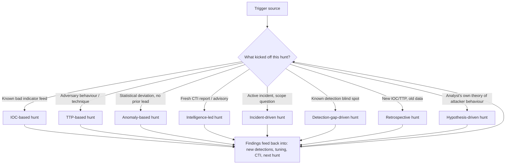

# Part XXVII — Hunt Types

Threat hunting gets treated in a lot of programs as a single activity: "we do hunting." In
practice it's several distinct disciplines that share a name and almost nothing else — different
starting points, different data requirements, different skill sets, different failure modes, and
critically, different things they systematically cannot find. A program that only ever runs one
type of hunt will develop a specific, predictable blind spot, and that blind spot is exactly where
a patient adversary will sit.

This chapter works through eight hunt types you'll actually run in a mature program: IOC-based,
TTP-based, anomaly-based, intelligence-led, incident-driven, detection-gap-driven, retrospective,
and hypothesis-driven. For each one: what it starts from, a concrete worked example, what it's
genuinely good at, and — the part most hunt-program writeups skip — what it structurally misses no
matter how well you execute it.

[MANAGEMENT] The reason this matters for planning: if your hunt calendar is 80% IOC-based sweeps
because that's what your TIP vendor makes easy to automate, you have a hunting *program* that
looks busy and produces a coverage gap in exactly the place hunting was supposed to compensate for
— unknown, novel, behavioural threats. Track hunt-type mix the same way you'd track detection
coverage by MITRE technique.



## 1. IOC-Based Hunting

[CONCEPT] Search historical and current telemetry for a specific known-bad artifact — a hash, an
IP, a domain, a file path, a registry key, a certificate thumbprint — usually sourced from a threat
intel feed, an incident report, or a vendor advisory.

**Example — part27-01 "IOC sweep for a leaked C2 IP":** A CTI vendor publishes a blog naming
`185.203.x.x` as C2 infrastructure for a ransomware precursor loader active in the last 60 days.
The hunt is: query proxy/firewall logs, DNS logs, and any EDR network-connection telemetry across
the retention window for that IP (and its /24 if the report suggests infra reuse), plus any domain
names resolving to it during the reporting window.

```
// Illustrative — Splunk SPL style
index=proxy OR index=firewall dest_ip IN ("185.203.10.0/24")
| stats count min(_time) as first_seen max(_time) as last_seen by src_ip, dest_ip, url
| where first_seen < now() - 86400*60
```

**Strengths:**
- Cheap, fast, and highly automatable — this is where "hunting" and "IOC matching" blur together,
  and it's the correct thing to run continuously, not just as a discrete "hunt."
- High-confidence findings when a match occurs. There's little ambiguity — if that hash executed
  on a host, it executed.
- Good retroactive value: catches infrastructure reuse and dwell time your real-time detections
  missed because the IOC wasn't known at the time of compromise.

**What it systematically misses:**
- Anything the adversary changes between report and hunt — and infrastructure/hash reuse across
  campaigns is increasingly rare for anyone above commodity-crimeware tier. A single new C2 domain
  or a recompiled binary with a new hash defeats the entire hunt.
- It only finds what someone else already found and published. You are permanently behind the
  intel cycle — by definition this can never surface a genuinely novel intrusion.
- Encourages a false sense of closure ("we swept for all known IOCs, we're clean") that ignores
  the fact that IOC coverage of any real campaign is always partial and stale.

> **Hunter's Note:** an IOC sweep that finds nothing is not evidence of absence. Say that
> explicitly in the hunt report. "No hits" means "no hits for these specific artifacts in this
> retention window," not "not compromised."

## 2. TTP-Based Hunting

[CONCEPT] Search for the *behaviour* an adversary technique produces, independent of any specific
indicator — grounded in a MITRE ATT&CK technique or sub-technique.

**Example — part27-02 "LSASS access via undocumented tooling":** Hunt for process access to
`lsass.exe` (T1003.001) that doesn't come from a known-good enumerated list (Task Manager,
antivirus/EDR agents, Windows Error Reporting, backup agents). Rather than matching a specific
tool name, build the hunt around the access pattern.

```
// Illustrative — KQL / Sysmon EventID 10 (ProcessAccess) style
DeviceEvents
| where ActionType == "ProcessAccessed" and TargetFileName endswith "lsass.exe"
| where GrantedAccess in ("0x1010", "0x1410", "0x1438") // PROCESS_VM_READ + others commonly used for dumping
| where InitiatingProcessFileName !in~ (KnownGoodBaseline)
| summarize count(), tostring(make_set(InitiatingProcessFileName)) by DeviceId, bin(Timestamp, 1h)
```

**Strengths:**
- Survives tool changes. Doesn't matter if the actor used Mimikatz, comsvcs.dll MiniDump,
  Task Manager dump, procdump, or a custom LSASS-parser — the behaviour (a process opening a
  handle to lsass.exe with memory-read rights, followed by no legitimate reason to do so) is
  largely the same across tools.
- Maps directly to ATT&CK, which makes coverage tracking, gap analysis, and reporting to
  leadership straightforward.
- Generalizes across campaigns and actors — one good TTP hunt query outlives dozens of IOC feeds.

**What it systematically misses:**
- Techniques that don't produce a distinctive telemetry signature at your current visibility tier
  (e.g., an attacker using a fully in-memory technique on a host without EDR memory-access
  telemetry, or living-off-the-land binaries whose "malicious" use looks byte-for-byte identical to
  legitimate use).
- New/unclassified techniques that haven't been mapped to ATT&CK yet, or technique variants that
  exploit a specific tool's blind spot (an EDR vendor's LSASS-protection feature that only watches
  certain access masks, for instance).
- Volume and baseline dependency — TTP hunts on noisy behaviours (PowerShell execution, WMI use)
  drown in false positives without a solid "known good" baseline, which most orgs don't maintain
  well and which drifts constantly as software updates.

## 3. Anomaly-Based Hunting

[CONCEPT] Start from a statistical deviation with no prior lead — an outlier in volume, timing,
rarity, or relationship, discovered by looking at the data itself rather than a known indicator or
technique.

**Example — part27-03 "Rare parent-child process pair":** Baseline every parent→child process
relationship across the fleet over 30 days, rank by rarity (count of distinct hosts and total
occurrences), and manually review the bottom percentile for anything that looks like a living-off-
the-land chain (`winword.exe → cmd.exe → powershell.exe -enc`), rather than starting from a known
bad pattern.

```
// Illustrative — SPL style
index=edr sourcetype=process_creation
| stats count dc(host) as host_count by parent_process_name, process_name
| where host_count <= 3 AND count <= 5
| sort host_count
```

**Strengths:**
- The only hunt type on this list capable of surfacing something genuinely novel — a technique,
  tool, or actor nobody has published about yet, purely because it's statistically unusual in
  *your* environment.
- Environment-specific by construction. It finds what's weird for *you*, which is exactly the
  signal an off-the-shelf detection or shared intel feed can't provide.
- Doesn't require ATT&CK mapping or intel to start — useful when you have good telemetry but a
  thin CTI program.

**What it systematically misses:**
- Low-and-slow techniques that blend into an already-noisy baseline — anomaly hunting is bad at
  finding an attacker who deliberately mimics normal admin behaviour (using RDP, PsExec, and
  scheduled tasks the same way IT already does, at similar volumes).
- Extremely high false-positive rate without a skilled analyst to triage — rarity is not the same
  as maliciousness; most rare things are rare-but-benign (one-off admin scripts, a vendor tool run
  once a quarter).
- Requires baseline data most orgs don't retain long enough (30–90 days of full process-tree
  telemetry at fleet scale is expensive) and requires re-baselining after any environment change
  (new software rollout, M&A, org restructure) or the "anomaly" is just "new normal we haven't
  learned yet."
- Heavily dependent on analyst pattern-recognition skill — this is the least automatable hunt type
  and the hardest to scale across a team with mixed experience levels.

> **Engineering Reality:** anomaly hunting is only as good as your retention and your ability to
> compute rarity cheaply. If "rare parent-child pairs over 30 days" requires a full table scan of
> raw events every time someone wants to run it, nobody will run it more than once. Precompute the
> aggregate (a daily rollup table of distinct parent→child pairs per host) so the hunt is a query
> against a small summary index, not a full-fidelity scan.

## 4. Intelligence-Led Hunting

[CONCEPT] Triggered by fresh CTI — an advisory, a threat actor profile update, a new campaign
report — used to derive both IOCs *and* TTPs specific to that actor/campaign, then hunted as a
combined package rather than a single indicator lookup.

**Example — part27-04 "Advisory-driven hunt for a named actor":** A government/vendor advisory
describes a specific actor's initial-access method (exploiting a specific edge-device CVE),
persistence mechanism (a specific scheduled task name pattern), and C2 protocol characteristics
(specific JA3/JA3S hash or TLS certificate pattern). The hunt operationalizes all three layers at
once: vulnerable-device exposure check, scheduled-task name/path search, and network telemetry
match on the TLS fingerprint — not just an IP block list.

**Strengths:**
- Highest signal-to-noise of any hunt type when the intel is good, because it combines multiple
  independent layers (infrastructure + behaviour + tooling) rather than one weak indicator.
- Directly answers the leadership question "are we affected by [named campaign in the news]" —
  which has organizational value regardless of technical outcome.
- Forces cross-referencing your own exposure (are we running the vulnerable device/version at
  all?) before spending analyst time hunting, which filters out a lot of wasted effort.

**What it systematically misses:**
- Entirely dependent on intel quality, timeliness, and relevance to your sector/geography — a
  report about an actor that has never targeted your vertical is a low-yield hunt, and a report
  that's three months old may describe TTPs the actor has already rotated away from.
- Attribution bias: chasing a named, branded actor can crowd out hunting for the unbranded,
  un-reported activity that's statistically far more likely to actually be in your environment
  (most intrusions are not APT-branded).
- Requires a CTI function capable of translating a narrative report into concrete, testable
  queries — a lot of programs consume intel as reading material and never operationalize it into
  a hunt at all.

## 5. Incident-Driven Hunting

[CONCEPT] Triggered by an active or recently closed incident, used to answer scoping questions:
did this actor touch other hosts, is there a second foothold, was this the first compromise or a
follow-on to something older.

**Example — part27-05 "Lateral movement scoping during active IR":** During a confirmed
compromise on host A, hunt for every host that received an authentication from the compromised
account in the prior 14 days, cross-referenced against any process execution matching the same
tool fingerprints (unique command-line patterns, file hashes, named pipes) seen on host A.

```
// Illustrative — KQL style
let compromised_account = "corp\\svc_backup01";
let compromise_window = ago(14d);
SigninLogs
| where AccountName == compromised_account and TimeGenerated > compromise_window
| join kind=inner (DeviceProcessEvents | where InitiatingProcessAccountName == compromised_account) on DeviceId
| distinct DeviceId, DeviceName, TimeGenerated
```

**Strengths:**
- Highest urgency and highest organizational support — nobody has to be convinced this hunt
  matters, resources get allocated fast.
- Ground truth available. You have a confirmed bad actor/artifact/behaviour to pivot from, so the
  hunt has an anchor point that pure anomaly or hypothesis hunts lack.
- Directly reduces containment/eradication risk — missing a second foothold during incident-driven
  hunting is how "resolved" incidents reopen weeks later.

**What it systematically misses:**
- Scope is naturally bounded by the incident's own timeline and observed TTPs — if the actor used
  a completely different technique on a different host that isn't yet linked to the known
  compromise, the hunt won't find it unless it broadens deliberately (and under incident time
  pressure, broadening rarely happens).
- Runs under time and stress pressure that degrades hunt quality — rushed queries, incomplete
  pivots, and analyst fatigue during a live incident produce lower-quality hunting than the same
  work done calmly.
- Almost always reactive by nature — it answers "how bad is this" rather than "what else is out
  there that we haven't detected yet," which is a different and equally important question that
  incident pressure crowds out.

## 6. Detection-Gap-Driven Hunting

[CONCEPT] Triggered by a known blind spot in the detection stack — a technique you know you don't
have a rule for, a data source you know you don't collect, an environment you know isn't
instrumented — used as manual compensating coverage until the gap is closed.

**Example — part27-06 "Manual hunt for unmanaged Linux servers"**: The detection engineering team
knows EDR coverage on a fleet of legacy Linux build servers is inconsistent (rolled out to 60% of
hosts, remainder pending). Until coverage reaches 100%, run a recurring manual hunt against
whatever telemetry *does* exist for the uncovered 40% — auth logs, cron diffs, package-manager
history, network flow records — specifically for the TTPs the missing EDR would otherwise catch
(new SSH keys added, unexpected outbound connections, cron persistence).

```
// Illustrative — auth.log grep-equivalent pattern, run across uncovered hosts via
// centralized syslog forwarding (not direct host access)
# Look for authorized_keys modification outside change windows
grep -E "authorized_keys" /var/log/auth.log* | grep -v "known_maintenance_window_pattern"
```

> **[SCREENSHOT PLACEHOLDER — CONTROLLED LAB]** — Linux `auth.log` via SSH on an unmanaged/legacy
> build host, illustrating an `authorized_keys` modification event outside a documented
> maintenance window, and the corresponding fields (`sshd` PID, source IP, key fingerprint) a
> hunter would extract when EDR coverage isn't available on that host class.

**Strengths:**
- Directly targets your organization's actual known weakest points rather than generic best-
  practice coverage — this is the hunt type most tightly coupled to your real risk profile.
- Produces a clean business case for closing the gap: "we ran N manual hunts this quarter to
  compensate for missing EDR on 40% of build servers, at X analyst-hours" is a concrete cost
  argument for the coverage investment.
- Forces detection engineers and hunters to have an honest, current gap inventory, which is
  valuable organizational hygiene independent of what any individual hunt finds.

**What it systematically misses:**
- Bounded by the same missing telemetry that created the gap in the first place — if the gap is
  "no process-creation logging at all" on those hosts, a manual hunt using auth logs and cron
  diffs can approximate coverage for some techniques but cannot recover process-level fidelity that
  was never captured.
- Doesn't scale — this hunt type is inherently manual and host-count-limited; it's a stopgap, and
  treating it as a permanent substitute for actual instrumentation is a common program failure.
- Only covers *known* gaps. Unknown gaps (a data source you believe is complete but has silent
  collection failures) don't get hunted at all under this model — see Part on telemetry pipeline
  health for why "silently missing data" is its own distinct failure mode.

## 7. Retrospective Hunting

[CONCEPT] A new IOC or TTP becomes known, and the hunt runs it against *historical* data —
distinct from IOC-based hunting in that the emphasis is specifically on how far back you can look
and what your retention actually allows, often as a structured exercise after a major disclosure.

**Example — part27-07 "Retrospective hunt after a supply-chain compromise disclosure":** A widely
used software package is disclosed to have shipped a backdoored update for a 3-week window six
months ago. The hunt pulls every historical software-inventory and process-execution record for
that package's version range across the full retention window available, not just "from today
forward."

**Strengths:**
- Closes the single most damaging gap in security programs: the assumption that "we're now
  patched/protected" means "we were never exposed." Retrospective hunting is often the only thing
  that catches dwell time from a disclosure that predates detection coverage for that technique.
- Forces a hard, honest conversation about retention — this hunt type is the one that most
  reliably exposes "we don't actually have logs going back that far" as an organizational risk,
  which is a genuinely useful finding even when the hunt itself comes up empty.
- High leadership relevance after any major public disclosure — this is the hunt stakeholders
  explicitly ask for ("were we affected by [name]").

**What it systematically misses:**
- Hard-capped by retention. If the compromise window predates your log retention (extremely
  common — many orgs keep 30-90 days of raw logs and 1 year of summarized/alert data at best),
  the hunt cannot answer the question no matter how well it's designed.
- Data quality degrades over time even within retention — schema changes, field renames, parser
  updates, and index rotations mean a query written today may not run cleanly against data from
  eight months ago without translation work.
- Retrospective-only framing can create false reassurance: "we checked and found nothing" in
  degraded historical data isn't the same confidence level as a real-time detection, but gets
  reported with the same language in a lot of after-action reports.

> **SOC Management View:** retention length is a hunting-capability decision, not just a
> compliance/storage-cost decision. Every time leadership sets log retention at 30 or 90 days to
> save storage cost, they are implicitly deciding that retrospective hunting for anything older
> than that window is permanently impossible. Frame the retention conversation that way when
> asking for budget — "we cannot retrospectively hunt for anything before this date" is a concrete
> risk statement, not an abstract one.

## 8. Hypothesis-Driven Hunting

[CONCEPT] The analyst forms a specific, falsifiable theory about how an adversary *could* operate
in this environment — grounded in the environment's own architecture, business context, and known
weaknesses — then designs a hunt to prove or disprove it. This is the closest hunt type to
scientific method, and the one most dependent on analyst experience.

**Example — part27-08 "Hypothesis: an attacker with initial access on a jump host would pivot via
existing RDP trust relationships rather than deploying new tooling"**: The hypothesis is grounded
in the specific environment's known architecture (jump hosts have broad RDP trust to production
segments, and the org has no privileged access workstation model). The hunt: build a graph of all
RDP session sources/destinations over 30 days from the jump-host tier, and look for any session
pattern that deviates from the small, stable set of known admin accounts and known destination
hosts — specifically testing whether an attacker could move laterally using nothing but legitimate
RDP and existing trust, leaving no malware artifact at all.

```
// Illustrative — KQL style
DeviceLogonEvents
| where LogonType == "RemoteInteractive" and InitiatingProcessAccountName in (JumpHostAdmins)
| summarize DestinationHosts = make_set(DeviceName), SessionCount = count() by AccountName
| where SessionCount > baseline_session_count_for(AccountName) // compare to historical per-account baseline
```

**Strengths:**
- The only hunt type explicitly designed to test *your specific environment's* weaknesses rather
  than generic industry technique lists — it directly incorporates architecture, trust
  relationships, and business process knowledge that no external feed or ATT&CK mapping has.
- Can surface findings with zero malware, zero unusual tooling, and zero IOC — pure abuse of
  legitimate trust and access, which is exactly the category every other hunt type on this list is
  weakest at.
- Produces durable organizational knowledge even on a "negative" result — disproving a hypothesis
  ("no, RDP trust abuse would actually get flagged because X control exists") is a genuinely useful
  validation of a control, not a wasted hunt.

**What it systematically misses:**
- Entirely bounded by analyst imagination and environment knowledge — a hunter who doesn't know
  the jump-host RDP trust model exists will never form this hypothesis in the first place. This
  hunt type has no mechanism for surfacing threats the analyst hasn't already conceived of.
- Hardest to standardize, hardest to hand off between analysts, and hardest to measure for
  management reporting ("how many hypotheses did we test" is a much weaker metric than "how many
  IOCs matched").
- Slow. A well-built hypothesis hunt requires understanding architecture, building a custom query
  or even a small ad hoc data model, and iterating — this is not a hunt type you run a dozen of in
  a day, and it doesn't compress well under time pressure the way incident-driven hunting has to.

## Comparing the Eight

| Hunt type | Starting point | Best at finding | Structurally misses |
|---|---|---|---|
| IOC-based | Known indicator | Reuse of known-bad infra/tools | Anything changed since publication; novel activity |
| TTP-based | Known technique (ATT&CK) | Tool-agnostic behaviour matches | Techniques with no telemetry signature; unmapped techniques |
| Anomaly-based | Statistical deviation | Genuinely novel/unpublished activity | Low-and-slow mimicry of normal admin behaviour; needs deep baseline |
| Intelligence-led | Fresh CTI report | High-confidence, multi-layer campaign matches | Irrelevant/stale/attribution-biased intel |
| Incident-driven | Active/recent incident | Scoping a confirmed compromise | Bounded to known incident TTPs/timeline; time-pressured |
| Detection-gap-driven | Known coverage gap | Compensating for a specific known weak spot | Only known gaps; doesn't scale; stopgap not fix |
| Retrospective | New IOC/TTP vs. old data | Historical dwell time from a disclosure | Hard-capped by retention; degraded old data quality |
| Hypothesis-driven | Analyst's theory | Pure trust/access abuse with no artifacts | Bounded by analyst imagination; hard to scale/measure |

[THREAT HUNTER] None of these replace each other. A mature program runs all eight on a rotation
proportional to actual risk, not convenience — and explicitly tracks which type produced which
finding, because a program that only ever gets findings from IOC-based sweeps is a program that
has quietly stopped hunting for anything it doesn't already know about.

> **Detection Autopsy — "We Have a Hunting Program" (single-type coverage)**
>
> **Original setup:** a security team stands up a "threat hunting program" that consists entirely
> of a monthly scheduled job matching the current commercial threat intel feed's IOC list against
> 90 days of proxy and EDR telemetry, with a dashboard showing "hunts completed: 12/year."
>
> **Why it looked reasonable:** it's automatable, it produces a clean metric, it satisfies an audit
> checkbox for "threat hunting capability exists," and it occasionally finds something real
> (old infrastructure reuse, a missed detection for a known hash).
>
> **What broke:** an intrusion using a purpose-built, never-before-published toolset and living-
> off-the-land lateral movement ran for several weeks with zero IOC matches, because there were no
> IOCs to match — nothing about the activity existed in any feed. The only hunt type that could
> have caught it (anomaly-based or hypothesis-driven) was never run because the program had no
> capacity budgeted for anything beyond the automated IOC sweep.
>
> **False positives:** low, because IOC matching is precise — but this masked the real problem.
> **False negatives:** the entire category of novel/behavioural intrusions, indefinitely.
> **Missing context:** no anomaly baseline existed to compare against; no analyst had ever formed
> or tested a hypothesis about the organization's specific architecture; no rotation existed
> across hunt types at all.
> **Revised approach:** kept the automated IOC sweep (it's cheap and still useful) but added a
> quarterly rotation requiring at least one hypothesis-driven and one anomaly-based hunt per
> quarter, resourced with dedicated analyst time rather than squeezed between alert queue work, and
> started tracking "hunt type mix" as a program metric alongside "hunts completed."
> **Result:** the hypothesis-driven hunt in the second quarter after the change surfaced a real
> RDP-trust-abuse pattern (structurally identical to part27-08 above) during a controlled
> red-team exercise, validating the approach before it had to prove itself against a real
> adversary.

## MITRE ATT&CK Coverage Named in This Chapter

- T1003.001 — OS Credential Dumping: LSASS Memory
- T1021.001 — Remote Services: Remote Desktop Protocol

## Sources

- MITRE ATT&CK (mitre-attack.github.io / attack.mitre.org) — technique reference for T1003.001 and
  T1021.001.
- SANS "A Practical Model for Conducting Cyber Threat Hunting" — commonly cited framing for
  intelligence-led vs. hypothesis-driven hunting distinctions (cited by title; not linking, exact
  URL not confirmed).
