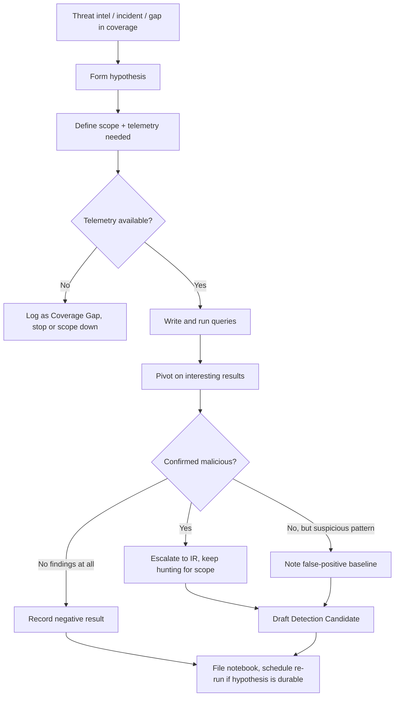

# Part XXVIII — Threat Hunt Notebook

A hunt that isn't written down didn't happen, as far as the rest of the team is concerned. Six
months from now someone else will re-ask the exact question you already answered, burn two days
on the same queries, and reach the same dead end — because your work lived in a scratch terminal
and a Slack thread that scrolled off. The notebook format in this chapter exists to stop that.

This is not a report template for management. It's a working document a hunter fills in *during*
the hunt, in order, and leaves behind as an artifact that:

- another analyst can pick up and re-run six months later against fresh telemetry,
- a detection engineer can lift straight into a Sigma/KQL/SPL draft without re-deriving logic,
- an auditor or manager can read to understand what was actually checked, not just what alert
  fired,
- feeds the coverage map (see Part XXVI-style ATT&CK coverage tracking) with an honest "tested,
  found nothing exploitable, or found a gap" entry — negative results are still results.

**Hunter's Note:** A hunt that produces zero findings and gets written down is worth more than a
hunt that produces one finding and gets forgotten. The first gives you durable coverage evidence.
The second gives you a war story and nothing you can defend in an audit.

## Why a fixed template matters

Ad hoc hunt notes drift. Every analyst records different fields, in different order, with
different assumptions about what "confirmed" means. That's fine for a single person's memory, but
it fails the moment:

- a second analyst needs to reproduce the query against a different log source retention window,
- the hunt needs to be re-run quarterly as a scheduled hypothesis check,
- the findings need to be handed to IR because something turned out to be real,
- leadership asks "what did we check for ransomware precursor behaviour this quarter" and the
  answer needs to come from documents, not memory.

[MANAGEMENT] A fixed notebook schema is also what lets you aggregate hunts. If every hunt records
`ATT&CK mapping`, `Coverage Gap`, and `Detection Candidate` in the same fields, you can pull those
fields into a spreadsheet or a small internal tool and get a running tally of technique coverage
by hunt (not just by deployed rule), which is a different and often more honest number.



## The Notebook Template

Copy this block per hunt. Every field is mandatory — if a field genuinely doesn't apply, write
"N/A" and say why, don't leave it blank. A blank field is indistinguishable from "forgot to fill
this in" when someone reads it later.

```markdown
### Hunt ID
### Hypothesis
### Threat
### ATT&CK Mapping
### Scope
### Telemetry
### Assumptions
### Queries
### Pivots
### Findings
### False Positives
### Confirmed Activity
### Coverage Gap
### Detection Candidate
### Next Steps
### References
```

### Field-by-field guidance

| Field | What goes here | Common mistake |
|---|---|---|
| Hunt ID | Short stable identifier (`HUNT-2026-014`) so it can be referenced from tickets, detections, and the coverage tracker | Reusing IDs across re-runs instead of versioning (`HUNT-2026-014-v2`) |
| Hypothesis | One sentence, falsifiable: "If X technique is being used in our environment, we would see Y trace in Z telemetry." | Writing a goal instead of a hypothesis ("hunt for lateral movement") — too broad to falsify |
| Threat | The actor, campaign, or behaviour class motivating the hunt, and why now (intel report, incident, red-team finding, gap analysis) | Citing intel without saying which specific TTP it maps to |
| ATT&CK Mapping | Technique and sub-technique ID(s), stated at the level you're actually testing | Mapping to a tactic (e.g. "Lateral Movement") instead of a technique |
| Scope | Time window, host/user population, log sources included and excluded, and why | Silently excluding a segment (e.g. Linux hosts, cloud workloads) without saying so |
| Telemetry | Exact log source, table/index name, retention window actually available, and any known gaps in collection | Assuming full-fidelity logging without checking retention or sampling |
| Assumptions | What you're taking as true without verifying — clock sync, EDR coverage percentage, that a control is actually enabled | Skipping this and later finding an assumption was wrong, invalidating the whole hunt silently |
| Queries | The actual query, query language stated, illustrative or verified, with a one-line explanation of the logic | Pasting a query with no explanation of *why* those fields/thresholds |
| Pivots | Follow-up queries triggered by an interesting result — parent/child process, account activity timeline, network egress from the same host | Treating the hunt as a single query instead of an investigative chain |
| Findings | What the data actually showed, neutrally, before judgment | Jumping straight to "nothing found" without listing what was actually reviewed |
| False Positives | Legitimate activity that produces the same signal, and how common it is in this environment | Not testing against a known-benign population before calling something suspicious |
| Confirmed Activity | Anything verified as malicious/policy-violating, with evidence references (ticket, case, artifact) | Marking something confirmed based on suspicion alone |
| Coverage Gap | What this hunt reveals about detection coverage — telemetry missing, no existing rule, rule exists but doesn't cover the variant found | Skipping this field when there's no confirmed activity — gaps matter even without a hit |
| Detection Candidate | Draft rule logic derived from what worked in the hunt, ready to hand to detection engineering | Leaving detection logic implicit in the queries rather than stating it as a candidate rule |
| Next Steps | Re-run schedule, escalations filed, telemetry to request, related hunts to spin off | No next step at all — hunt ends in a void |
| References | Intel reports, ATT&CK pages, prior hunts, vendor docs — title and link only if you're certain of the URL | Citing a source from memory with a fabricated URL |

**Engineering Reality:** the `Telemetry` field is where most hunts quietly fail. An analyst writes
a query assuming 90 days of process-creation history is available, gets zero results, and reports
"no activity detected" — when the actual retention on that index is 14 days. Always state the
retention window you *verified*, not the retention window you assumed. If you didn't check, say
"not verified" rather than a number.

## Worked Example: Kerberoasting Hunt

This is the template filled out end to end, as a hunter would actually leave it after finishing
the work — including the parts that didn't pan out.

---

### Hunt ID
`HUNT-2026-014`

### Hypothesis
If an attacker or a compromised low-privilege account is performing Kerberoasting against service
accounts in our domain, we will see a spike in TGS (service ticket) requests for accounts with
weak or RC4-only encryption, concentrated from a small number of source hosts, outside of normal
service-restart patterns — visible in Windows Security Event ID 4769 on domain controllers.

### Threat
Kerberoasting (T1558.003) is a low-noise, credential-access technique that requires no elevated
privilege to *initiate* — any authenticated domain account can request a TGS for any account with
a registered SPN. It's attractive to an attacker post-initial-access because it converts a
foothold into offline-crackable service-account credentials, and service accounts are
disproportionately likely to have weak, old, or never-rotated passwords. This hunt was triggered
by a coverage review: we had a detection rule for 4769 with RC4 encryption type, but no hunt had
ever validated it against real DC telemetry, and we suspected the rule's threshold was too high
to catch a slow/low-volume roast.

### ATT&CK Mapping
- T1558.003 — Steal or Forge Kerberos Tickets: Kerberoasting

### Scope
- Time window: last 30 days, plus a targeted re-check of the prior 6 months for the specific
  accounts flagged as suspicious once found
- Population: all domain controllers in the primary forest (secondary/child domain DCs excluded
  from this pass — noted as a gap below)
- Included log source: Windows Security Event ID 4769 (Kerberos Service Ticket Operations),
  forwarded from DCs to the SIEM
- Excluded: Azure AD / Entra ID Kerberos-equivalent telemetry (hybrid identity ticket requests
  against on-prem SPNs from cloud-joined devices) — noted as a gap

### Telemetry
- Source: Windows Security Event Log, Event ID 4769, collected via Windows Event Forwarding into
  the SIEM
- Verified retention: 45 days hot, 13 months in cold storage (checked against SIEM index
  configuration before starting — do not assume without checking)
- Key fields used: `TargetUserName` (the service account being ticketed), `TicketEncryptionType`,
  `ServiceName`, `IpAddress` (source of the request), `AccountName`/`SubjectUserName` (requesting
  principal), `TicketOptions`, timestamp
- Known gap: `IpAddress` in 4769 is the address the DC saw the request from — if the requester is
  behind a load balancer, jump host, or the request traverses an RODC, this can be misleading;
  cross-checked against 4768 (TGT request) `IpAddress` where available for corroboration

### Assumptions
- Assumed DC clock sync is within tolerance (Kerberos requires tight time sync; not independently
  re-verified for this hunt — carried over from existing monitoring)
- Assumed Advanced Audit Policy on DCs is actually configured to log 4769 for all ticket requests,
  not just failures — verified this on 3 of 6 DCs by checking `auditpol /get` output pulled from a
  prior config audit; not re-verified live for this hunt (stated as assumption, not fact)
- Assumed `TicketEncryptionType` of `0x17` (RC4-HMAC) is a meaningful weak-crypto signal in this
  environment — true only if AES is the expected/enforced type for service accounts; we did not
  verify domain functional level enforces AES by default, so an RC4 ticket could simply mean the
  account has no AES support configured, independent of attacker behaviour

### Queries

All queries below are **illustrative KQL** written against a generic `SecurityEvent`-style schema
(Microsoft Sentinel / Log Analytics field names). Field names will differ under Splunk CIM or a
raw Windows Event Forwarding schema — adjust before running.

**Query 1 — baseline volume of RC4 TGS requests per requesting account, per day:**

```kql
SecurityEvent
| where EventID == 4769
| where TicketEncryptionType == "0x17"  // RC4-HMAC
| where ServiceName !endswith "$"        // exclude machine account TGS noise
| summarize RequestCount = count(), DistinctServices = dcount(ServiceName)
    by SubjectUserName, bin(TimeGenerated, 1d)
| where RequestCount > 5
| order by RequestCount desc
```

Logic: a single account requesting service tickets for many *distinct* SPNs in a short window is
the core roasting signature — legitimate use of one service by one client usually re-uses the same
ticket until it expires (default 10-hour lifetime), so a burst of new requests across many
different `ServiceName` values from one account is the anomaly, not raw request volume.

**Query 2 — narrow to accounts that never normally request TGS tickets at all (rare-actor pivot):**

```kql
let Baseline = SecurityEvent
| where EventID == 4769
| where TimeGenerated between (ago(30d) .. ago(1d))
| summarize BaselineDays = dcount(bin(TimeGenerated, 1d)) by SubjectUserName;
SecurityEvent
| where EventID == 4769
| where TimeGenerated > ago(1d)
| where TicketEncryptionType == "0x17"
| summarize TodayCount = count(), DistinctServices = dcount(ServiceName) by SubjectUserName
| join kind=leftouter Baseline on SubjectUserName
| where isnull(BaselineDays) or BaselineDays < 2
| where DistinctServices >= 3
```

Logic: accounts with little or no history of requesting TGS tickets that suddenly request several
in a day are a stronger signal than volume alone, because a legitimate service account or
automation account making the same calls daily gets self-excluded by the baseline join.

**Query 3 — pivot on the requesting host once an account is flagged:**

```kql
SecurityEvent
| where EventID in (4768, 4769)
| where SubjectUserName == "svc-flagged-account"  // substitute finding from Query 2
| project TimeGenerated, EventID, IpAddress, ServiceName, TicketEncryptionType, TicketOptions
| order by TimeGenerated asc
```

### Pivots

1. Took the top account from Query 2 (`j.harmon`, a helpdesk-tier account) and pulled its 4768/4769
   timeline for the full day — showed 14 distinct `ServiceName` values requested within an 11-minute
   window, all RC4, all from a single `IpAddress`.
2. Pivoted from that `IpAddress` to process-creation telemetry (Sysmon Event ID 1) on the
   corresponding workstation for the same time window, looking for a known roasting tool signature
   — command-line fragments consistent with Rubeus (`Rubeus.exe kerberoast`) or PowerShell invoking
   `.NET` `System.IdentityModel.Tokens` ticket-request APIs. No matching process-creation event was
   found on the endpoint itself for that time window.
3. Given no local tool execution, pivoted to check whether the requests could have originated
   remotely using the account's cached credentials from a different host (e.g. a jump box or a
   compromised second machine using `j.harmon`'s NTLM/Kerberos material) — checked 4624 logons for
   `j.harmon` around the same window; found a concurrent RDP-type logon (LogonType 10) from an
   unfamiliar internal host not in the normal helpdesk subnet.
4. Pulled that second host's Sysmon process-creation log for the same window and found a
   PowerShell process invoking `Get-ADUser` with SPN-filtering syntax immediately before the
   ticket-request burst — consistent with SPN enumeration preceding a roast attempt (e.g.
   `Get-ADUser -Filter {ServicePrincipalName -ne "$null"}` or an equivalent AD module / PowerView
   call).

### Findings

- One account (`j.harmon`) generated an 11-minute burst of 14 RC4 TGS requests across distinct
  SPNs, on a day with no prior 30-day history of requesting more than one TGS ticket.
- No local malicious process execution was found on `j.harmon`'s assigned workstation for the
  window in question.
- A concurrent interactive logon (LogonType 10) for the same account was found on a second,
  unexpected internal host.
- That second host showed a PowerShell command consistent with SPN enumeration immediately
  preceding the ticket-request burst.
- No offline cracking artifact (hashcat/John output, `.kirbi` export) was recovered from either
  host in the timeframe reviewed — endpoint retention on that host only covered the last 9 days,
  so anything older could not be checked.

### False Positives

- Backup and monitoring software accounts (e.g. a backup agent enumerating services across the
  fleet) can legitimately request TGS tickets for many distinct SPNs in a short window. Two such
  accounts were manually reviewed and excluded from the Query 2 results — they had 30 days of
  consistent daily baseline activity, so the rare-actor join in Query 2 correctly suppressed them.
- Certificate Services and print-server-related SPN requests can spike around patch/reboot cycles
  when many clients re-establish tickets simultaneously — this shows as many *different accounts*
  requesting the *same* SPN, which is the inverse pattern of roasting (one account, many SPNs), so
  it's distinguishable but worth calling out explicitly for whoever tunes the eventual rule.
- Legitimate penetration testing or red-team activity with prior authorization produces an
  identical signature — the notebook process should always include a check against the
  authorized-testing calendar before escalating (checked here: no scheduled test was on the
  calendar for this date).

### Confirmed Activity
Escalated to IR as a confirmed credential-access event (case `IR-2026-0231`). IR investigation
determined the interactive logon on the second host originated from a compromised local admin
credential reused across two workstations (unrelated to this hunt's scope, found during IR
follow-up), and that `j.harmon`'s Kerberos material had been accessed via LSASS memory dumping on
the first workstation earlier in the same day (separate 4769/Sysmon correlation done by IR, not
detailed further here — see IR case for full timeline). The SPN enumeration and roasting attempt
against 14 service accounts is confirmed. No evidence that any of the 14 targeted service account
passwords were successfully cracked before password rotation was forced (rotation completed by IR
within 6 hours of confirmation).

### Coverage Gap
- The existing 4769/RC4 detection rule (`DET-0142`) only fired on raw volume thresholds
  (>20 RC4 tickets/hour from one account) and did not fire on this incident — 14 tickets in 11
  minutes stayed under that threshold. The rule needs the "distinct SPN count + no baseline
  history" logic from Query 2, not a flat volume threshold.
- No detection existed at all for SPN-enumeration PowerShell/AD-module activity preceding a roast
  — that pivot only happened because a human went looking, not because anything alerted.
- Secondary/child domain DCs were out of scope for this hunt entirely (Scope section) — this is an
  acknowledged blind spot, not a tested-and-clean result, and should not be reported as "hunted"
  for those domains.
- Cloud/hybrid identity Kerberos-equivalent activity was excluded from scope and is unverified.
- Endpoint log retention of 9 days on the second host meant we could not confirm how the attacker
  obtained the local admin credential used for that logon — this is an IR-side gap, flagged back
  to the endpoint logging owner.

### Detection Candidate
Draft logic to replace `DET-0142`, handed to detection engineering as `part28-01`:

```markdown
Name: Kerberoasting via Rare-Actor Distinct-SPN TGS Burst
Logic (conceptual, illustrative KQL):
  - EventID == 4769, TicketEncryptionType == 0x17 (RC4)
  - exclude ServiceName ending in "$" (machine accounts)
  - group by SubjectUserName over a rolling 30-day baseline
  - flag when: DistinctServices in current 1-hour window >= 3
    AND SubjectUserName has < 2 days of TGS-request history in the prior 30 days
  - enrich with concurrent 4624 LogonType 10/3 events for the same account in the
    preceding 60 minutes, and Sysmon Event ID 1 on the source host for
    AD-enumeration-style command lines (Get-ADUser, Get-DomainUser, PowerView-style
    SPN filters) as a confidence booster, not a hard requirement
Suggested severity: Medium on its own, High if the enrichment finds a logon-host
  mismatch or enumeration command line
ATT&CK: T1558.003 (primary), T1087.002 (SPN enumeration, contributing signal)
```

### Next Steps
1. Detection engineering to implement `part28-01` logic in the SIEM, replacing `DET-0142`'s flat
   threshold — target: next sprint.
2. Re-run this hunt against secondary/child domain DCs (explicitly out of scope this round) —
   file as `HUNT-2026-015`.
3. Request extended endpoint log retention (currently 9 days) be raised to at least 30 days on a
   representative sample of workstations, flagged to the logging/EDR owner as a standing gap, not
   just for this incident.
4. Schedule `HUNT-2026-014` for quarterly re-run as a standing hypothesis check, independent of the
   one-off confirmed finding — a single confirmed hit doesn't mean the underlying gap is closed
   until the detection candidate ships and is itself validated.
5. Add authorized-pentest-calendar cross-check as a standing step in the hunt runbook, not just a
   one-off note in this write-up.

### References
- MITRE ATT&CK, Technique T1558.003 — Steal or Forge Kerberos Tickets: Kerberoasting
- MITRE ATT&CK, Technique T1087.002 — Account Discovery: Domain Account
- Microsoft Learn — Windows Security Event 4769 (A Kerberos service ticket was requested)
- Microsoft Learn — Windows Security Event 4768 (A Kerberos authentication ticket (TGT) was
  requested)
- Internal: `DET-0142` (superseded rule), `IR-2026-0231` (confirmed case)

---

> **[SCREENSHOT PLACEHOLDER — CONTROLLED LAB]** — a captured view of Sysmon process-creation
> events (Event ID 1) on a domain-joined lab workstation, showing a PowerShell process launched
> with an SPN-enumeration-style command line immediately followed, in a correlated SIEM view, by a
> burst of 4769 events from the same account against multiple distinct `ServiceName` values. Would
> illustrate the `Pivot 4` correlation described above using real (lab-generated, authorized)
> Kerberoasting tooling against a disposable AD lab domain, not production data.

**CONCEPTUAL SAMPLE** — illustrative raw 4769 fragment shape (field names only, not a captured
log):

```text
EventID=4769  TargetUserName=svc-sql-reporting  TicketEncryptionType=0x17
SubjectUserName=j.harmon  IpAddress=10.20.4.117  ServiceName=MSSQLSvc/reporting01.corp.local:1433
```

---

## Detection Autopsy: the rule this hunt replaced

**Original logic (`DET-0142`):** alert when any single account requests more than 20 RC4-encrypted
service tickets (Event ID 4769) within a rolling 1-hour window.

**Why it looked reasonable:** it's the textbook Kerberoasting rule seen in most public detection
content — high ticket volume in a short window is the obvious signature of a scripted tool like
Rubeus or `GetUserSPNs.py` sweeping every SPN in the domain. It's cheap to compute, has one clear
threshold, and matched what public write-ups describe as "typical" roasting behaviour.

**What breaks in production:** a competent attacker (or one using a modern roasting tool with a
`--delay` or account-targeting option) doesn't need to touch 20 accounts. In this environment there
were only 14 SPN-registered service accounts worth targeting at all — the attacker's own
reconnaissance (the `Get-ADUser` SPN filter seen in Pivot 4) told them exactly how many there were,
so they requested exactly that many and stayed under the threshold. The rule was tuned to a
generic "spray the whole domain" assumption that doesn't hold once the attacker does even minimal
recon first.

**False positives it did generate:** backup/monitoring service accounts sweeping the environment
during scheduled jobs occasionally cross 20 tickets/hour, requiring a static suppression list —
which itself became a blind spot, since an attacker who compromised one of the suppressed accounts
would have inherited the exemption.

**Missing context:** the rule had no baseline concept at all — it couldn't distinguish "an account
that does this every day as its job" from "an account that has never done this before." It also
had no visibility into what preceded the ticket requests (enumeration) or what followed
(concurrent logons from unexpected hosts), so even when it did fire, an analyst had to do the exact
pivot chain from this hunt manually, every time, from scratch.

**Revised analytic:** the `part28-01` candidate above — rare-actor baseline plus distinct-SPN count
in a short window, with logon-mismatch and enumeration-command enrichment as confidence boosters
rather than hard requirements, so it still fires without the enrichment data but scores higher
confidence with it.

**How it was tested:** replayed the confirmed `j.harmon` event sequence from this hunt against the
draft logic in the SIEM's query tool (not yet deployed as a live rule) — the 14-ticket, 11-minute
burst cleared the new distinct-SPN/rare-actor threshold, whereas it had not cleared the old
20-ticket/hour threshold. Also replayed 30 days of the two known-legitimate backup-account
baselines to confirm they still self-exclude via the baseline join without needing a static
suppression list.

**Result:** candidate approved for detection engineering to formalize; static suppression list for
backup accounts slated for removal once the new logic is confirmed stable in production for one
full patch cycle (to catch any backup-job schedule change that might temporarily look "rare").

## SOC Management View

A single Kerberoasting hunt like this one costs roughly one analyst-day when telemetry is already
centralized and DC/endpoint retention is adequate — most of the time goes into the pivot chain
(Query 3 onward), not the initial query. The return here wasn't just the confirmed incident; it was
finding that a deployed, "working" detection rule had a threshold gap that a moderately careful
attacker could walk through without any tooling more sophisticated than one recon command. That is
the kind of finding a compliance checklist ("do you have a Kerberoasting detection? yes/no") will
never surface, because the rule existed and technically fired for its own test cases — it just
didn't fire for the realistic case.

The recurring cost here is retention: this hunt was only fully resolvable because DC-side 4769
retention was adequate; the *IR* follow-on was hampered by 9-day endpoint retention, which is a
budget and infrastructure decision above the SOC's pay grade. Every hunt notebook that surfaces a
retention gap should be aggregated and brought to whoever owns log infrastructure budget as
evidence, not re-discovered and re-argued each time.
