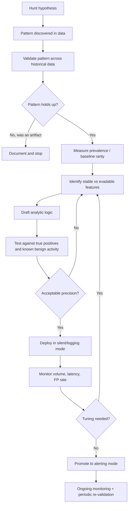
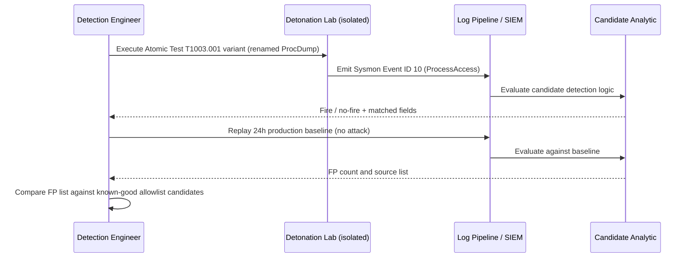

# Part XXIX — From Hunt to Detection

A threat hunt that never turns into a detection is a research paper. It might be an interesting
research paper — it might even get a good response in the Friday team sync — but it protects
nobody after the hunter closes their laptop. The entire point of hunting is to find the patterns
your detection stack is currently blind to, and then *kill your own job* by automating the finding
so you don't have to go looking for it again next quarter.

This part is about that conversion process: the pipeline from "I noticed something weird in the
data" to "there is a tuned, monitored analytic running in production that catches this reliably
and doesn't page anyone at 3 a.m. for nothing." Skipping steps in this pipeline is the single
biggest reason detection programs accumulate a graveyard of noisy, disabled, or quietly-ignored
rules.

## The pipeline, end to end



[MANAGEMENT] Every arrow going backwards in that diagram is a normal, expected outcome — not a
failure of the hunter. A detection program that never sends a candidate rule back to step F is
either extremely lucky or isn't testing hard enough before deployment.

## Step 1–2: Hunt hypothesis and pattern discovery

A hunt starts from a hypothesis grounded in adversary behaviour, not a vague feeling. "Attackers
dump credentials from LSASS memory to get NTLM hashes or Kerberos tickets for lateral movement" is
a hypothesis tied to a known technique — MITRE ATT&CK **T1003.001 (OS Credential Dumping: LSASS
Memory)**. The hunter's job is to translate that behaviour into an observable and then go look for
it in real telemetry, not in a vacuum.

[THREAT HUNTER] The translation from "attacker dumps LSASS" to "what does that look like in my
data" matters more than the hypothesis itself. Dumping LSASS requires a process to open a handle to
`lsass.exe` with memory-read rights and then either copy the memory out (`MiniDumpWriteDump`,
comsvcs.dll `MiniDump` export abuse, a driver-based approach, or a full ProcDump-style dump) or
read it in place (Mimikatz's classic approach). On a Sysmon-instrumented Windows host, a process
opening a handle to another process with specific access rights generates **Event ID 10
(ProcessAccess)**, which carries the `SourceImage`, `TargetImage`, `GrantedAccess` bitmask, and
(if Sysmon's call-trace feature is enabled) a `CallTrace` showing which DLLs were involved in the
call stack at the point of access.

**Worked hunt — `part29-01`.** The hunter runs a retrospective query across available Sysmon Event
ID 10 telemetry, filtering for `TargetImage` ending in `\lsass.exe`, and starts eyeballing which
`SourceImage` values and `GrantedAccess` values show up. Legitimate processes (other AV/EDR
sensors, WMI providers, `svchost.exe` for certain services) access LSASS constantly with narrow,
predictable access masks. What stands out during the hunt is a handful of events where
`GrantedAccess` includes `PROCESS_VM_READ` combined with `PROCESS_QUERY_INFORMATION`, from
processes that are not on the known-EDR/known-service allowlist, and where the `CallTrace` shows
`dbghelp.dll` or `dbgcore.dll` in the stack — the DLLs that implement `MiniDumpWriteDump`, which is
the API most credential-dumping tools (including renamed/repackaged builds of Mimikatz and
ProcDump used off-label) actually call under the hood.

> **CONCEPTUAL SAMPLE — Sysmon Event ID 10 (illustrative, not captured):**
> ```
> UtcTime: 2026-08-11 14:22:07.441
> SourceImage: C:\Users\jsmith\Downloads\svchost_update.exe
> TargetImage: C:\Windows\System32\lsass.exe
> GrantedAccess: 0x1410
> CallTrace: C:\Windows\System32\ntdll.dll+9d824|C:\Windows\System32\KERNELBASE.dll+3cba1|C:\Windows\System32\dbghelp.dll+ab21|...
> ```

That's the pattern discovered: an unsigned, oddly-named binary running from a Downloads folder,
accessing LSASS with a read-capable mask, with `dbghelp.dll` in the call trace. It is not yet a
detection — it's one interesting session found by eye during a hunt.

## Step 3: Validate the pattern across historical data

Before writing a single detection rule, the pattern has to be checked against a wider historical
window. A hunter who builds a rule off one session is building a rule off an anecdote.

[DETECTION ENGINEER] Validation means re-running the discovery logic — not the polished detection
logic yet, the loose discovery logic — across 30, 60, ideally 90+ days of retained telemetry, and
manually reviewing every hit. The questions being answered here:

- Does this pattern recur, or was the single session an isolated artifact (a crash dump, a
  debugger attach, an unusual but benign admin tool)?
- When it does recur, is it always the same tool/actor, or does it show up across genuinely
  different contexts (different hosts, different binaries, different times)?
- Are there sessions that *look* like the pattern but turn out benign on inspection — and what
  specifically makes them benign, so that distinguishing feature can be captured later?

```kql
// Illustrative KQL — validate LSASS access pattern over 90 days (Microsoft Sentinel / Defender schema)
// Not guaranteed to run unmodified; field names vary by connector/version.
DeviceEvents
| where ActionType == "ProcessAccessed" or ActionType == "OpenProcess"
| where TargetProcessFileName =~ "lsass.exe"
| where GrantedAccess has_any ("0x1010", "0x1410", "0x1438", "0x143a")
| extend HasDbgHelp = CallStack has_any ("dbghelp.dll", "dbgcore.dll")
| where HasDbgHelp == true
| summarize Hits = count(), Hosts = dcount(DeviceName), FirstSeen = min(Timestamp), LastSeen = max(Timestamp)
    by InitiatingProcessFileName, InitiatingProcessFolderPath
| order by Hits desc
```

Running that (or the equivalent SPL/Sigma-backed search) across historical data in this worked
example turns up 14 hits over 90 days across 6 hosts. Nine of them trace to the organization's
own EDR agent doing scheduled memory scans (recognizable by a stable, signed path under
`C:\Program Files\<vendor>\`). Three trace to a helpdesk technician's use of a legitimate ProcDump
download during a documented troubleshooting ticket. Two — including the original session that
triggered the hunt — trace to unsigned binaries in user-writable paths with no supporting change
ticket.

That's the validation result: the *raw* pattern (LSASS access with a read mask and dbghelp in the
call trace) is not rare enough to alert on directly — it's 9/14 legitimate EDR behaviour by
volume — but there is a genuinely suspicious subset once you add path and signature context.

## Step 4: Measure prevalence

[MANAGEMENT] "Rare" is a number, not an impression. Before this becomes an analytic, the team
needs an actual prevalence figure, because that number drives both the confidence tier of the
resulting alert and the tuning strategy.

In this example: across 6 hosts triggering the raw pattern in 90 days, only 2 hits (roughly 14% of
raw hits, on 2 of several thousand monitored endpoints) come from unsigned, non-allowlisted
binaries. That's a genuinely low base rate — good, because it means a well-scoped analytic on this
narrower slice can run at real-time alerting priority without drowning the SOC. If the number had
come back at, say, 40% of hosts hitting the raw pattern from unrecognized binaries, that would
signal either a much noisier environment (heavy use of third-party diagnostic tools) or that the
"suspicious" feature set wasnt actually narrow enough yet, and would push the team back to feature
selection before building anything.

**Hunter's Note:** Prevalence numbers rot. A "rare" pattern in a 2,000-endpoint estate with mostly
locked-down software policy can become a routine false-positive generator six months later after
a new EDR vendor's own scanner starts tripping the same access mask. Re-measure prevalence at
least every time the environment's tooling changes materially, not just once at design time.

## Step 5: Identify stable vs evadable features

This is the step that decides whether the resulting detection survives contact with a slightly
different attacker or tool, or dies the first time someone renames a file.

| Feature | Stability | Notes |
|---|---|---|
| `TargetImage` = lsass.exe | Stable | The technique's whole point is reading LSASS memory; attacker can't avoid targeting it and still get credential material this way |
| `GrantedAccess` mask including PROCESS_VM_READ | Stable-ish | A handful of specific mask values recur across tooling because they map to what the Windows API actually requests; attacker could in theory request a narrower or different combination, but most public/off-the-shelf tooling doesn't bother |
| `CallTrace` containing dbghelp.dll/dbgcore.dll | Moderately stable | Present when the dump uses the standard Windows debug-help API path; **evadable** — a custom dumper using direct syscalls or a kernel driver bypasses this entirely |
| `SourceImage` filename ("mimikatz.exe", "procdump.exe") | Not stable | Trivially renamed; useless as a standalone feature, still fine as weak supporting signal |
| `SourceImage` unsigned / no valid Authenticode signature | Moderately stable | Cheap for an attacker to fix (buy or steal a cert), but raises cost; strong supporting signal, weak standalone signal |
| `SourceImage` path under a user-writable directory (Downloads, Temp, AppData) | Moderately stable | Attacker can stage from anywhere they have write access; still correlates well with "not an installed, IT-managed tool" |
| Absence from an EDR/AV process allowlist | Environment-dependent | Requires the allowlist to be maintained; decays if not kept current |

[DETECTION ENGINEER] The rule that comes out of this step should lean on the *stable* rows as
required conditions and the *moderately stable* rows as scoring/confidence boosters, never the
other way around. A rule keyed primarily on filename or a single call-trace string is a rule that
a red team exercise (or a real intrusion using a slightly different toolkit) defeats on day one.

**Engineering Reality:** `CallTrace` in Sysmon Event ID 10 requires the `<CheckRevocation>` and
call-stack options to be enabled in the Sysmon config, and it is one of the more expensive fields
to collect — it adds real CPU overhead on high-process-churn hosts (build servers, terminal
servers) because Sysmon has to walk the stack on every qualifying access event. Plenty of
environments run Sysmon with Event ID 10 enabled but call-trace collection turned off "for
performance," which silently removes one of your best stable features. Check the actual deployed
config before designing a detection around a field you assume is populated everywhere.

## Step 6: Create the analytic

Putting the stable required conditions and supporting scoring together as a Sigma rule:

```yaml
title: Suspicious LSASS Memory Access by Unsigned Non-Allowlisted Process
id: 4f2a9c7e-88f1-4e3a-9d2b-part29-01
status: test
description: >
  Detects a process opening a handle to lsass.exe with memory-read capable access rights,
  where the accessing process is not on the known EDR/AV/IT-tooling allowlist and either
  runs unsigned or from a user-writable path. Intended as a mid-to-high confidence lead for
  credential dumping (T1003.001), not a standalone auto-response trigger.
logsource:
  category: process_access
  product: windows
detection:
  selection_target:
    TargetImage|endswith: '\lsass.exe'
  selection_access:
    GrantedAccess:
      - '0x1010'
      - '0x1410'
      - '0x1438'
      - '0x143a'
  filter_allowlisted_source:
    SourceImage|startswith:
      - 'C:\Program Files\<edr_vendor>\'
      - 'C:\Windows\System32\'
      - 'C:\Windows\SysWOW64\'
  condition: selection_target and selection_access and not filter_allowlisted_source
fields:
  - SourceImage
  - CallTrace
  - GrantedAccess
  - User
falsepositives:
  - Legitimate memory-scanning security tools not yet added to the allowlist
  - Approved credential-recovery or forensic tooling used under change control (e.g. ProcDump
    during authorized troubleshooting)
  - Debugger attach to lsass.exe during OS-level troubleshooting (rare, usually Microsoft support)
level: high
tags:
  - attack.credential-access
  - attack.t1003.001
```

Note what this rule does *not* do: it does not require the `CallTrace` dbghelp.dll condition as a
hard filter, because that field is evadable and, per the Engineering Reality note above, not
reliably populated in every environment. Instead the call-trace content is pulled into `fields`
for the analyst to see, and used as a confidence booster in the triage runbook and in any
downstream scoring/correlation layer, not baked into the trigger condition itself.

[ANALYST] When this fires, the triage checklist is: (1) is `SourceImage` a legitimate, ticketed
tool — check the change/incident ticket system directly, don't take the process name's word for
it; (2) is the binary signed, and if so by whom; (3) does `CallTrace` show dbghelp/dbgcore — if
yes, confidence goes up sharply; (4) what did that process do in the minutes before and after —
check for prior download/execution (Sysmon Event ID 1/11) and subsequent network connections
(Event ID 3) that would indicate exfil of dumped material or immediate use of stolen credentials
(new logon types, lateral SMB/WinRM/RDP sessions).

## Detection Autopsy: the naive version of this rule

Before landing on the version above, the first draft the team actually wrote looked like this:

```yaml
# naive first draft — do not deploy
detection:
  selection:
    TargetImage|endswith: '\lsass.exe'
  condition: selection
```

**Why it looked reasonable:** LSASS is the canonical credential-dumping target; "alert whenever
anything touches lsass.exe" feels like it should catch the technique regardless of tooling.

**What broke in production:** on the very first day in a lab replay against 24 hours of real
endpoint traffic, this fired over 400 times per host per day. Windows itself, the OS's own service
control manager, every installed EDR/AV agent's normal memory-protection features, WMI providers,
and print spooler interactions with LSA all generate Event ID 10 hits against lsass.exe as routine
background activity, most with `GrantedAccess` values like `0x1000` (`PROCESS_QUERY_LIMITED_INFORMATION`)
that carry no read capability at all.

**Missing context:** the naive rule had no access-mask filter (so it couldn't distinguish "asked
what the process name is" from "read its memory"), no source allowlist (so every legitimate
security tool fired constantly), and no signal about the source binary's origin or trust level.

**Revised analytic:** the version in Step 6, which requires a memory-read-capable access mask,
excludes known-good source paths, and surfaces (without hard-requiring) the call-trace and
signature context for the analyst.

**How it was tested and the result:** replayed against the same 24-hour lab dataset plus an
Atomic Red Team execution of T1003.001 (an LSASS-dump atomic test using a signed copy of ProcDump
run from a temp directory, deliberately chosen to also validate the "signed but unusual path"
edge case). Volume dropped from 400+/host/day to zero on the clean baseline day and fired exactly
once, correctly, on the atomic-test host — flagging ProcDump run from `C:\Windows\Temp\` with the
expected access mask. The rule still fired (correctly) even though ProcDump was signed, because the
path condition alone (not requiring "unsigned") was sufficient — confirming the layered
required/supporting design held up under a realistic red-team-style variant, not just the exact
sample that started the hunt.

## Step 7: Test

Testing an analytic before deployment means at minimum three things, in order of importance:

1. **True-positive coverage** — run it against a controlled execution of the actual technique
   (Atomic Red Team's T1003.001 tests, a purpose-built lab replay of the original hunt session, or
   a red team engagement artifact) and confirm it fires.
2. **Known-benign replay** — run it against a representative slice of normal production telemetry
   (not a curated "clean" sample — actual noisy production data including patch Tuesday, backup
   windows, and EDR agent updates) and count false positives.
3. **Variant resistance** — deliberately vary the attacker-controllable features (rename the
   binary, move it to a different writable path, sign it with a throwaway cert) and confirm the
   rule still fires on the stable features. If a one-line rename defeats the rule, it isn't done.



> **[SCREENSHOT PLACEHOLDER — CONTROLLED LAB]** — Sysmon process-access log (Event ID 10) captured
> from an isolated Windows lab VM during an Atomic Red Team T1003.001 execution, showing the
> `GrantedAccess`, `SourceImage`, and `CallTrace` fields that the analytic keys on, alongside the
> matching analytic hit in the SIEM search interface.

## Step 8–9: Deploy and monitor

[ENGINEERING] Deployment is staged, not a switch flip. The rule goes live first in
logging/silent mode — it writes to the detection index and generates a metric, but does not open a
ticket or page anyone. That silent window (commonly 1–4 weeks depending on environment change
velocity) is where the prevalence and false-positive estimates from steps 3–4 get checked against
live reality rather than historical replay, which can miss seasonal or event-driven noise (patch
cycles, new software rollouts, M&A onboarding of a new business unit's endpoints with different
tooling).

Metrics tracked during that window, and continuously afterward:

- **Fire rate** (hits/day, hits/host) — compares against the prevalence estimate from step 4; a
  sudden jump usually means a new legitimate tool needs allowlisting, not that the environment
  suddenly got more hostile.
- **Precision proxy** — of hits reviewed, what fraction get closed as benign vs escalated.
- **Time to first hit after deployment** — a rule with a real, current threat basis will hit
  benign allowlist gaps almost immediately; a rule that goes silent for months either means the
  behaviour is genuinely rare (good) or the logic has a scoping bug that makes it never match
  (check with a synthetic canary event periodically).
- **Coverage gaps surfaced during triage** — analysts closing hits as benign should be feeding
  specific allowlist additions back, not just clicking "close."

## Step 10: Tune

Tuning is not "reduce the noise until it's quiet." It's "reduce the noise while keeping (or
improving) the ability to catch what step 5 said was stable." Every tuning change in this example
went through the allowlist (`filter_allowlisted_source`), never through loosening the access-mask
or target-image conditions, because those are the stable core of the detection. Concretely, after
three weeks in silent mode, two additional legitimate tools surfaced (a backup agent's LSASS
health check, and a second EDR vendor's console used only on a subset of servers during a vendor
bake-off) and were added to the allowlist with a documented owner and review date — allowlist
entries without an owner and an expiry are how detections quietly rot into uselessness two years
later.

**SOC Management View:** this single analytic, from initial hunt session to tuned production
alerting, took roughly three analyst-weeks of effort spread over a five-week calendar window
(hunt + validation: 1 week; feature analysis + rule draft + testing: 1 week; silent deployment +
monitoring + tuning: 3 weeks elapsed, low effort). That cost is the actual price of a detection
that survives contact with reality, versus the near-zero cost of copy-pasting a public Sigma rule
and turning on alerting mode immediately — which is also why most environments run far fewer,
better-tuned high-confidence rules than the size of public rule repositories would suggest is
possible.

## Step 11: Hunt for variants, continuously

The pipeline doesn't end at "deployed and tuned." The same hunter (or another one) should
periodically re-run a looser version of the original discovery query — the one from step 2, before
any filtering — specifically looking for *near-misses*: sessions that almost matched the deployed
analytic's logic but didn't, because they used a slightly different access mask, a kernel-mode
technique that bypasses user-mode API hooking entirely, or a completely different LSASS-access
avenue (e.g., abusing a registered security support provider, or dumping via a volume shadow copy
of the SAM/SYSTEM hives rather than live memory — a different technique, T1003.002, that this
analytic does not and should not be expected to cover).

[THREAT HUNTER] Treat every deployed detection as covering one *slice* of a technique's behaviour
space, not the whole technique. T1003.001 alone has multiple sub-behaviours (API-based dumping,
direct syscalls, kernel driver-based dumping, LSASS process cloning via `MiniDumpWriteDump`
alternatives like `NtCreateProcessEx`-based process forking). The analytic built in this chapter
covers the API-based, dbghelp-adjacent slice well. A hunter's ongoing job is figuring out what
slice is still uncovered and starting the pipeline over for that slice specifically — which is
exactly why this is a pipeline and not a one-time project.

## Summary checklist

| Stage | Key question | Common failure mode if skipped |
|---|---|---|
| Hunt hypothesis | Is this grounded in real adversary behaviour? | Chasing noise with no ATT&CK anchor |
| Pattern discovery | What's the actual observable, in real telemetry? | Detection designed against a description, not data |
| Historical validation | Does it recur, and what does benign look like? | One-session rule, breaks on the next legitimate variant |
| Prevalence | How rare is this, really, right now? | Wrong alerting tier, SOC drowns or misses signal |
| Feature stability | Which features can the attacker change for free? | Rule defeated by a rename or a repack |
| Analytic build | Are stable features required, weak features scoring-only? | Brittle or overbroad rule |
| Testing | True positive, benign replay, variant resistance all checked? | Surprises found in production instead of the lab |
| Silent deployment | Are live metrics matching the lab estimate? | Alert fatigue from day one |
| Monitoring | Fire rate, precision proxy, time-to-first-hit tracked? | Silent rot, nobody notices it stopped working |
| Tuning | Allowlist changes owned and dated, core logic untouched? | Either permanent noise or a detection quietly gutted to zero value |
| Variant hunting | What slice of the technique is still uncovered? | False sense of complete coverage for one technique |

## References

- MITRE ATT&CK, technique T1003.001 "OS Credential Dumping: LSASS Memory" (MITRE ATT&CK)
- Sysmon documentation, Event ID 10 (ProcessAccess) field reference (Microsoft Sysinternals /
  Sysmon docs)
- Sigma project documentation, detection rule specification (SigmaHQ)
- Red Canary Atomic Red Team, test library for T1003.001 (Red Canary, Atomic Red Team project)
