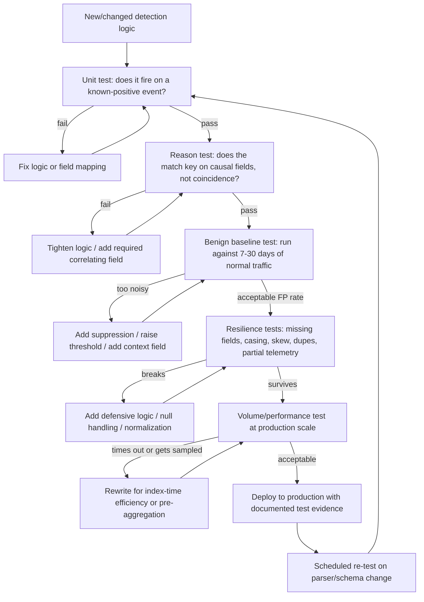

# Part XXX — Detection Testing

## Why "it fired in the demo" is not evidence of anything

A detection rule that has never been adversarially tested is a hypothesis, not a control. It looks
finished — it has a title, a MITRE mapping, a severity, maybe a nice description field — but none
of that tells you whether it will do its job at 3 a.m. on a Tuesday when the log source is running
twenty minutes behind, half the expected fields are null because of a parser update that shipped
last Thursday, and the "attacker" behaviour is actually a backup agent that happens to touch the
same registry key.

Detection testing is the discipline of finding out, before an adversary or an auditor does, exactly
where a rule's logic, its assumptions about the data, and the data itself, disagree with reality.
It is not the same activity as detection *validation against ATT&CK coverage* (Part XX covers
that) — testing is narrower and more mechanical. You are not asking "do we have a detection for
T1558.003?" You are asking "does *this specific analytic*, running against *this specific
pipeline*, do what its author believes it does?"

[MANAGEMENT] If your detection engineering program has no formal testing gate before a rule goes
into production, your effective false-positive rate and your effective false-negative rate are
both unknown numbers. You are running a control whose error rate you cannot state. That is a
finding an auditor will eventually write down for you, so it is better to write it down yourself
first.

## The questions a detection must survive

Every rule, before it is trusted, needs to answer all of the following. Skipping any one of them
is how "should have caught it" incidents happen.

1. **Does it fire at all?** — mechanical, but the most commonly skipped test. Syntax that parses
   does not mean logic that evaluates true against a real event.
2. **Does it fire for the right reason?** — a rule can produce a true positive by coincidence,
   matching on a field that happens to correlate with the attack technique in your test data but
   is not actually causally linked to the behaviour.
3. **Does known-good, expected benign activity also trigger it?** — the baseline-noise test.
4. **Can the fields the logic depends on go missing?** — optional fields, conditional logging,
   feature flags, licensing tiers.
5. **Does a parser or schema change silently break it?** — upstream field renames, type changes,
   CIM/ECS mapping drift.
6. **Does field casing matter to the query engine?** — case-sensitive backends versus
   case-insensitive analyst assumptions.
7. **Does clock skew between sources break time-window logic?** — correlation rules that join
   across hosts, proxies, and identity providers with unsynchronized or differently-timezoned
   clocks.
8. **What happens with duplicate events?** — forwarders that retry, agents that double-log, HA
   pairs that both emit.
9. **What happens with partial telemetry?** — some but not all of the expected event sequence
   arrives (e.g., process start logged, network connection lost).
10. **Can volume overwhelm the detection?** — performance limits, search head timeouts, sampling,
    summary indexing that silently drops raw events.
11. **Does aggregation hide the underlying suspicious behaviour?** — `count() > N` rules that
    average away the one anomalous burst inside a noisy bucket.

The rest of this chapter works through each of these with concrete failure patterns, then runs a
full worked test cycle against one real detection.



## 1. Does it fire at all

[DETECTION ENGINEER] This sounds trivial and is skipped constantly, especially for rules copied
from a blog post or a vendor's detection repo without modification. The failure modes are almost
always mechanical:

- The rule references a field name from a different log source schema (Sysmon field name used
  against a Windows Security Event Log alias, or a Sigma field name that your backend's mapping
  file does not translate).
- A boolean logic error — an `AND` that should be an `OR`, a negation on the wrong clause.
- The rule's time range or lookback window in the SIEM scheduling config doesn't match the event
  frequency it's meant to catch (a rule scheduled to run every 24 hours cannot alert inside an
  attacker's 20-minute dwell window even if the logic is perfect).
- A Sigma-to-native-query translation (sigmac, pySigma, or the SIEM vendor's own Sigma importer)
  produces syntactically valid but semantically wrong output for that specific backend — this is
  common with `contains` vs `startswith` translation for wildcard-heavy fields.

**Minimum bar:** run the rule against at least one event you know, by hand-inspection, should
match. Generate that event yourself (atomic test, manual command, red-team tool) rather than
trusting a sample line pulled from documentation — documentation samples are frequently
schema-stale.

## 2. Does it fire for the right reason

This is the test everyone forgets because a passing test #1 feels like success. A rule can produce
a correct-looking alert on a test event while actually matching on a field that has nothing to do
with the attack technique.

**Example failure:** a "suspicious PowerShell download" rule keys on `CommandLine contains
"DownloadString"`. In a lab test, the red team's payload happens to also spawn from a parent
process named `powershell.exe` with no window, and the analyst who wrote the rule adds
`ParentImage endswith "cmd.exe"` because that's what the test happened to produce — not because
that's a property of the technique. Six months later a legitimate scheduled task that runs
PowerShell from `cmd.exe` for unrelated reasons floods the queue, and a red-team payload launched
directly from Explorer never fires at all. The rule "worked" in testing because the test data and
the intended logic accidentally lined up on an irrelevant field.

[THREAT HUNTER] The way to catch this is to deliberately vary the test: run the same technique
through two or three different execution chains (different parent process, different user context,
different LOLBin) and confirm the rule still fires on the field that is actually diagnostic of the
behaviour, not on an incidental artifact of your first test run.

## 3. Benign activity that looks the same

Every detection needs a negative-control run against real, boring, production traffic — not
synthetic clean data. Synthetic "known good" test sets are almost always cleaner than reality and
under-represent the messy legitimate tools (RMM software, backup agents, vulnerability scanners,
EDR's own remediation actions) that share behavioural fingerprints with attacker tooling.

Common overlap classes worth explicitly testing against:

| Attacker technique | Benign activity that looks similar |
|---|---|
| LSASS memory access (T1003.001) | AV/EDR self-scanning, crash-dump utilities, some backup software |
| Kerberoasting (T1558.003) | Legitimate service account TGS renewal at logon, SPN health-check scripts |
| PsExec-style lateral movement (T1021.002) | Patch management tools, RMM software, admin's own remote scripts |
| Scheduled task creation (T1053.005) | Software installers, Windows Update maintenance tasks |
| DNS tunneling heuristics | Legitimate long-TXT-record lookups, CDN health checks, some VPN clients |

[SOC MANAGEMENT VIEW] The cost of skipping this step is not abstract. A rule that fires
correctly on the malicious behaviour but also fires ten times a day on the backup agent gets
tuned down, snoozed, or outright disabled by a tired analyst within a month — and it usually gets
disabled quietly, without a ticket, which means the coverage gap is invisible in your metrics
until an incident review asks "didn't we have a detection for this?"

## 4. Fields that can disappear

Optional telemetry is the single most common cause of "the rule worked in dev, not in prod."
Fields go missing for reasons that have nothing to do with the attacker:

- Sysmon config drift — an updated `sysmonconfig.xml` that no longer captures `Hashes` or
  `OriginalFileName` for a given rule group.
- Licensing-tier feature gating — some EDR/XDR fields (e.g., full command-line reconstruction,
  parent-of-parent lineage) are only populated at a higher license tier or when a specific sensor
  module is enabled.
- Windows auditing policy differences between OS builds or GPO drift — Event ID 4688 process
  creation with command-line auditing enabled (subcategory "Audit Process Creation," with
  `ProcessCreationIncludeCmdLine_Enabled` set) versus a host where that GPO never applied.
- Cloud API rate limiting or partial enrichment — a CloudTrail or Azure Activity Log event
  arriving without the `userIdentity` enrichment block during a provider-side outage.

**Test method:** take a copy of the known-positive event and strip each optional/enrichable field
one at a time, re-run the rule, and record whether it still fires, fires with reduced confidence,
or silently fails. Any field whose absence causes a *silent* false negative (no fired alert, no
error, no "insufficient data" signal) needs either a `NOT NULL` existence check that raises a
lower-confidence alternate detection, or a monitoring rule on the telemetry pipeline itself
(Part XX — Telemetry Health Monitoring) that alerts when that field's population rate drops.

## 5. Parser and schema drift

[ENGINEERING REALITY] Parsers break more detections than adversaries do. A field rename in a
Windows KB update, a log format version bump from a firewall vendor, a change to a Common
Information Model (CIM) or Elastic Common Schema (ECS) mapping pushed by your SIEM vendor's
content update — any of these can silently change a field name, type, or nesting without breaking
ingestion. The pipeline keeps accepting events; your rule just stops matching anything, and
because there's no error, nobody notices until someone asks why an obvious attack wasn't caught.

Known drift patterns worth building regression tests around:
- A string field that becomes an array (single `DestinationIp` becomes `DestinationIps: []`).
- A flat field that becomes nested (`user` becomes `user.name` after an ECS migration).
- A numeric field that changes representation (Windows LogonType arriving as an integer in one
  pipeline and as a mapped string like `"RemoteInteractive"` in another after a lookup-table
  enrichment step).
- Timestamp field precision or timezone representation changing after a forwarder upgrade.

**Test method:** treat your production detection content the same way you'd treat application
code — version it, and run a scheduled regression suite against a fixed corpus of known-positive
sample events every time a parser, TA (technology add-on), CIM mapping, or ingest pipeline
component is updated. This is the single highest-leverage automated test you can build, because it
catches an entire class of silent failure with one script instead of relying on someone noticing.

## 6. Field casing

Case sensitivity behaviour differs by backend and it is a frequent source of "works in Splunk,
silently fails in Elastic" (or vice versa) when detection content is shared across a
multi-SIEM estate or translated via Sigma.

- Elasticsearch/OpenSearch `keyword` fields are case-sensitive by exact match unless a normalizer
  or lowercase analyzer is applied.
- Splunk SPL string comparisons are generally case-insensitive for `=` on indexed fields but
  case-sensitive for regex unless `(?i)` is specified.
- KQL (Microsoft Sentinel / Defender) string operators have explicit case-sensitive and
  case-insensitive variants — `contains` is case-insensitive, `contains_cs` is not; this is a
  frequent copy-paste error when analysts move queries between environments.

A rule written and tested against `CommandLine contains "mimikatz"` will miss
`MimiKatz.exe`, `MIMIKATZ`, or a renamed binary with mixed-case flags on a backend where the
`contains` operator (or the field's underlying analyzer) is case-sensitive. Test explicitly with
mixed-case and adversary-realistic case variants (attackers routinely rename binaries and this
includes casing changes specifically to break case-sensitive string matches), not just the
canonical-case version from the vendor writeup.

## 7. Time skew between sources

Correlation rules — anything joining events across two or more log sources within a time window —
inherit the clock discipline (or lack of it) of every source involved. Common real-world skew
sources:

- A branch-office domain controller with NTP drift.
- A cloud service that timestamps in UTC while an on-prem forwarder timestamps in local time and
  the SIEM's timezone normalization config is wrong for that specific source.
- Ingest lag — the event's `_time`/index-time versus its actual `EventTime` can differ by minutes
  during backlog processing, which matters if your correlation window logic uses index time
  instead of event time.
- Network devices and IoT/OT equipment that simply don't run NTP and drift by hours or days.

**Test method:** deliberately inject a known-positive multi-event sequence with one event's
timestamp shifted by increasing amounts (30 seconds, 5 minutes, 1 hour) and find the point where
the correlation rule stops joining them. Compare that threshold against your actual measured clock
skew across the relevant log sources (pull this from NTP monitoring or from comparing ingest lag
metrics) — if your worst-case measured skew exceeds the rule's window, you have a documented gap,
not a hypothetical one.

## 8. Duplicate events

Duplicate delivery is normal in most logging pipelines, not an edge case: agent retry logic after a
transient network failure, dual-homed forwarders, HA log-source pairs where both nodes emit the
same event, or a syslog relay that fans the same message to two collectors during a failover.

Rules that count occurrences (`count() >= 3` as a "brute force" threshold) are directly vulnerable
— duplicate delivery can trip a threshold rule with a single real event, generating a false
positive that looks like a burst. Conversely, deduplication logic that's too aggressive (dedup key
too broad) can collapse three genuinely distinct rapid-fire attack attempts into one, silently
lowering an aggregate count below a real threshold.

**Test method:** replay the same known-positive event 2x, 5x, and 50x with identical content but
distinct event IDs/offsets, and confirm the rule's count-based logic still reflects real attacker
attempts. If your pipeline has a dedup stage, test with and without it enabled and document which
one production actually runs.

## 9. Partial telemetry

Real attack chains generate multiple linked events; production telemetry loss means you often get
some but not all of them. A network detection expecting both a DNS query event and the
corresponding connection event may only ever see one, because of asymmetric routing, an EDR sensor
crash mid-chain, or log source failover.

**Test method:** for any multi-stage detection, test each individual stage's absence separately:
- Only the initial event arrives, the confirming event never does — does the rule produce nothing,
  a low-confidence partial alert, or (worst case) does it error and silently drop?
- Events arrive out of order — does the correlation logic assume sequence order that isn't
  guaranteed by the pipeline?

Design intent should usually be: a partial match either produces a lower-severity/lower-confidence
alert with a note about which corroborating event was missing, or feeds a hunting query, rather
than either alerting at full severity on partial evidence or silently discarding it.

## 10. Volume, performance, and sampling

A logically correct rule can still fail in production purely on cost and performance grounds:

- Search-time joins across high-volume raw indexes that time out before completing, especially
  scheduled searches with tight run windows.
- Ingest-time sampling or summary indexing (common in high-EPS network telemetry pipelines) that
  drops a percentage of raw events before your rule ever sees them — a rule tested against 100% of
  a small pcap-derived test set behaves completely differently against 5%-sampled NetFlow.
- SIEM licensing/EPS caps that cause silent event dropping or query throttling during a genuine
  attack-driven volume spike — exactly when you need the rule most.

[ENGINEERING REALITY] The nastiest version of this failure is a rule that works fine every day in
testing and staging, and then fails specifically during the conditions that matter — a real
incident, which is usually also a volume spike, is exactly when scheduled searches are most likely
to hit a timeout or a sampling threshold that never triggered during quiet baseline testing.

**Test method:** load-test the query against production-scale data volume (not a curated sample),
ideally including an artificially injected volume spike, and record actual run time against the
scheduling interval. If run time approaches the interval, the detection has an availability
problem, not just a correctness one.

## 11. Aggregation hiding the behaviour

Aggregation is how you turn noisy raw events into a manageable signal, and it is also how you
average away exactly the anomaly you were trying to catch. Two common patterns:

- **Bucket smoothing:** a rule alerting on `avg(failed_logons) per hour > threshold` can hide a
  30-second brute-force burst if the hourly average stays under threshold even with the burst
  included — the bucket is too coarse for the behaviour's actual time constant.
- **Over-broad grouping keys:** aggregating "failed logons by source IP" misses a distributed
  password-spray where each source IP only attempts one or two logons against many accounts; the
  suspicious signal is in the *account* dimension (many accounts, few attempts each) not the
  source-IP dimension the rule grouped by.

**Test method:** for any aggregation-based rule, explicitly test the "low-and-slow, distributed"
variant of the attack pattern (few attempts per grouping key, spread across many keys) against
the "concentrated" variant the rule was originally designed around, and confirm both are visible —
or explicitly document that the rule only covers the concentrated case and file a companion
detection or hunt for the distributed one.

---

## Detection Autopsy: the naive Kerberoasting rule

**Original logic** (as first written, Sigma-style pseudocode):

```yaml
title: Possible Kerberoasting - RC4 TGS Request
id: part30-01-v1
status: experimental
logsource:
  product: windows
  service: security
detection:
  selection:
    EventID: 4769
    TicketEncryptionType: '0x17'
  condition: selection
falsepositives:
  - Unknown
level: medium
```

**Why it looked reasonable:** RC4 (`0x17`) ticket encryption for a Kerberos service ticket request
is the textbook Kerberoasting signature — tools like Rubeus and Impacket's `GetUserSPNs.py`
request RC4 tickets specifically because RC4 hashes crack faster than AES, and this is exactly what
every public writeup on Kerberoasting detection (T1558.003) leads with.

**What breaks in production:**

- **Massive false positive volume.** Any environment with legacy applications, older printers,
  or service accounts whose `msDS-SupportedEncryptionTypes` attribute hasn't been set defaults to
  offering RC4, and normal service ticket requests for those accounts fire this rule constantly —
  every single legitimate logon to that legacy app looks identical to a Kerberoasting attempt at
  the field level this rule inspects.
- **No volume/rate signal.** One RC4 TGS request is completely normal for the legacy-app case.
  Twenty RC4 TGS requests for twenty different service accounts from one workstation in ninety
  seconds is not normal for *anyone*. The original rule treats both identically because it has no
  aggregation at all — it fires per-event.
- **Missing account-type context.** The rule doesn't distinguish a request for a real, sensitive
  service account SPN from a request for a low-value legacy account, so severity can't be
  risk-weighted.
- **Field availability gap.** `TicketEncryptionType` on Event ID 4769 is populated correctly on
  modern domain controllers, but the field's exact string/hex representation has differed across
  Windows Server versions in some environments' parsed output, and log forwarders that don't parse
  the full 4769 field set correctly can drop or mis-render it — worth confirming against your
  actual DC OS build and forwarder rather than assuming.

**False positives observed in test:** in a lab domain with three legacy service accounts still
using RC4 by default, the v1 rule generated roughly 40-60 alerts per day from entirely normal
application logons, with zero of them being actual Kerberoasting activity.

**False negatives:** a slow, low-and-slow Kerberoasting run (one SPN requested every few minutes
across several hours specifically to stay under any future rate-based rule) would still fire this
v1 rule at full volume per event — so paradoxically v1 has terrible precision but wouldn't have a
false-negative problem for volume-based evasion, because it never had a volume threshold to evade
in the first place. Its actual failure is that the false-positive rate is so high the alert gets
ignored or disabled long before that matters.

**Revised analytic** (conceptually — illustrative, not guaranteed to run unmodified):

```
// KQL-style illustrative query against a Security-event table
SecurityEvent
| where EventID == 4769
| where TicketEncryptionType == "0x17"
| where ServiceName !endswith "$"                 // exclude machine-account noise
| summarize RequestCount = dcount(ServiceName), Services = make_set(ServiceName)
    by Account = TargetUserName, SourceComputer = IpAddress, bin(TimeGenerated, 10m)
| where RequestCount >= 5                          // distinct SPNs requested per source per window
| extend Severity = iff(RequestCount >= 15, "high", "medium")
```

This version keys on the behaviour that's actually diagnostic — one requester asking for many
distinct service ticket encryption-downgraded SPNs in a short window — rather than on the mere
presence of RC4, which on its own just reflects legacy AD hygiene. It also emits a severity signal
so a single legacy-app logon and a 20-SPN sweep don't land in the same triage queue.

**How it was tested:** replayed against the lab's normal 30-day legacy-account baseline (zero
alerts after the fix, versus 40-60/day before); replayed against a `GetUserSPNs.py -request`
run targeting all domain SPNs (fired correctly, high severity); replayed against a scripted
"slow" variant requesting one SPN every 3 minutes for 90 minutes to check the aggregation window
didn't create a false negative by under-counting a legitimately slow attacker (fired at medium
severity once the 10-minute bins accumulated enough distinct SPNs cumulatively — flagged as a
known residual gap requiring a longer secondary aggregation window, documented rather than silently
left uncovered).

**Result:** false-positive rate dropped from tens per day to zero against the recorded baseline,
true-positive detection preserved for both fast and moderately slow Kerberoasting patterns, and a
documented residual gap (very slow, long-dwell SPN enumeration spread across many hours) was
handed to the threat-hunting backlog rather than left as an unstated blind spot.

> **[SCREENSHOT PLACEHOLDER — CONTROLLED LAB]** — Windows Security Event Log (Event ID 4769)
> captured on a lab domain controller via the Event Viewer or `wevtutil`, showing the
> `TicketEncryptionType`, `ServiceName`, and `TargetUserName` fields for both a legitimate legacy
> service-account logon and a `GetUserSPNs.py` sweep, side by side, to illustrate why the raw
> field alone doesn't distinguish them.

> **[SCREENSHOT PLACEHOLDER — CONTROLLED LAB]** — SIEM search-job performance panel (e.g. Splunk
> Job Inspector or Sentinel analytics rule run-history) showing query run time against the
> revised aggregation query at production event volume, to illustrate the volume/performance test
> described in section 10.

## Hunter's Note

If a threshold-based rule has never generated a false positive in its lifetime, don't take that as
a compliment — go check whether it's actually running, whether its log source is still populated,
and whether the threshold is simply set high enough that nothing short of an obvious smash-and-grab
would ever cross it. A rule with zero FPs and zero TPs over months is usually a rule that's dead,
not a rule that's precise.

## Worked testing walkthrough summary

| Test | Method used | Result for part30-01 (revised) |
|---|---|---|
| Fires at all | Ran `GetUserSPNs.py -request` in lab | Fired |
| Fires for right reason | Varied source host, account, SPN count | Confirmed keys on RC4 + multi-SPN burst, not incidental field |
| Benign baseline | 30-day legacy-account replay | Zero false positives |
| Missing fields | Stripped `IpAddress`, `ServiceName` individually | Rule degrades gracefully to lower-confidence grouping on `TargetUserName` alone; documented |
| Parser/schema drift | Simulated `TicketEncryptionType` as decimal `23` instead of hex `0x17` | Rule failed silently — added normalization step, retested pass |
| Field casing | Backend-dependent; confirmed operator behaviour for target SIEM | Case-insensitive match confirmed for this backend, documented as backend-specific assumption |
| Time skew | N/A (single-source rule) | Not applicable — noted for future correlation extension |
| Duplicate events | Replayed identical 4769 event 10x | `dcount()` on distinct SPN correctly ignored duplicate SPN requests |
| Partial telemetry | N/A (single event type) | Not applicable |
| Volume/performance | Ran against production-scale 4769 volume | Completed within scheduled interval; documented headroom |
| Aggregation hiding behaviour | Slow-drip 90-minute test | Detected with delay; residual long-dwell gap logged to hunt backlog |

## MITRE ATT&CK techniques referenced

- T1558.003 — Steal or Forge Kerberos Tickets: Kerberoasting
- T1003.001 — OS Credential Dumping: LSASS Memory (referenced in benign-overlap table)
- T1021.002 — Remote Services: SMB/Windows Admin Shares (referenced in benign-overlap table)
- T1053.005 — Scheduled Task/Job: Scheduled Task (referenced in benign-overlap table)

## Sources referenced

- MITRE ATT&CK (mitre.org) — technique pages for T1558.003, T1003.001, T1021.002, T1053.005
- Microsoft Learn — Windows Security Event 4769 (A Kerberos service ticket was requested)
- Sigma project documentation — rule structure and backend-specific field/operator translation
  behaviour
