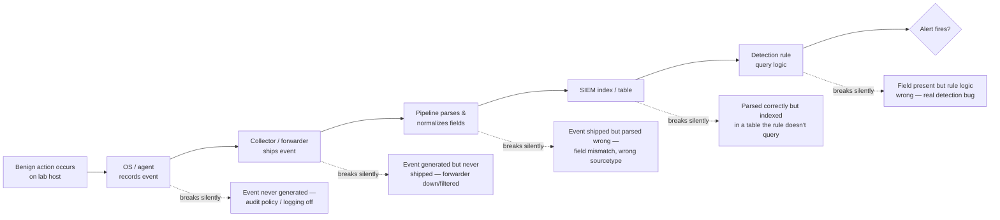

# Part XXXI — Safe Lab Validation

Before a detection ships, someone has to answer a boring question nobody wants to own: does the
pipeline actually see this event, parse it correctly, and get it in front of the rule logic with
the fields the rule expects? Not "would this catch an attacker" — that's the next part's problem.
Just: does the plumbing work. This part is about generating small, deliberately benign events on
purpose, in a controlled lab, to validate that plumbing end to end.

Every piece of evidence referenced or described in this part is a **CONTROLLED LAB EXAMPLE**. That
label matters and gets repeated throughout this chapter on purpose. Nothing here simulates an
attacker, uses a real payload, or should ever run against production identity, endpoint, or
network infrastructure. If a technique in this chapter looks like something from an adversary
emulation plan, that's because validation and emulation use overlapping mechanics — the difference
is intent, blast radius, and what you do with the result. Part XXXII covers deliberate adversary
behaviour simulation. This part stops well short of that line.

[MANAGEMENT] If you skip this step and go straight to attack simulation, you will not be able to
tell the difference between "the detection logic is wrong" and "the log never arrived." Those are
different bugs with different owners (detection engineer vs. telemetry pipeline vs. SIEM ingestion
team), and conflating them wastes the most expensive resource in the program: a senior engineer's
attention pointed at the wrong layer.

## Why Pipeline Validation Is Its Own Discipline

A detection rule sits at the end of a chain: something happens on a host or in a service → an
agent or OS subsystem records it → a collector forwards it → a pipeline parses/normalizes it → it
lands in an index/table with the field names the rule was written against → the rule's query logic
runs against that field. Any link in that chain can break silently.



Each of those failure points produces the same symptom to the person watching the alert queue: no
alert. Without a controlled test that isolates each stage, "no alert" is undiagnosable. Generating
a known-benign event and tracing it stage by stage is the only reliable way to localize the fault.

**Hunter's Note:** the single most common finding when a rule "just never fires" isn't bad logic —
it's that the source log was never enabled in the first place (audit policy off, Sysmon config
missing that event class, an agent module disabled). A five-minute benign validation test finds
that in five minutes. A week of waiting for a real trigger event finds it never.

## Ground Rules for This Kind of Testing

1. **Lab-only.** Everything in this chapter runs on isolated lab hosts (a home-lab VM/container, a
   disposable test VM, a segmented range) that has no path to production identity, production
   data, or the internet-facing attack surface. Never run these actions against a live user
   account, a live domain controller, or a live production endpoint.
2. **No destructive or malicious payloads, ever, for this purpose.** The goal is a clean, known,
   reproducible benign event — not code that does harm, not an actual exploit, not something that
   could be mistaken for a real intrusion if it leaked outside the lab. If a validation step
   requires anything resembling a payload, credential harvesting, lateral movement, or persistence
   that survives the test, it belongs in Part XXXII's adversary simulation process (with its own
   safety controls), not here.
3. **Label everything.** Every log line, screenshot, ticket, or writeup referencing one of these
   tests carries the tag `CONTROLLED LAB EXAMPLE` (or an equivalent unambiguous marker in your own
   documentation standard) so nobody downstream — a new analyst, an auditor, a future incident
   responder scrolling through history — mistakes it for a real security event.
4. **Reversible and disposable.** Use a throwaway local account, a scheduled task that does
   nothing but exit, a service that binds to nothing sensitive. Tear it down after the test if it
   isn't already ephemeral.
5. **Time-box and timestamp precisely.** Note the exact wall-clock time (with timezone) the action
   was performed. When you go hunting for the resulting event, a tight time window is what lets
   you find "your" test event among the surrounding noise, and it's what lets a second person
   verify your result independently.

**Engineering Reality:** lab telemetry and production telemetry are rarely identical pipelines,
even when they're supposed to be the same product. Different Sysmon config version, different
Splunk sourcetype mapping, different auditd rule set, different log rotation settings — any of
these can make a lab validation pass while the same rule silently fails in production, or vice
versa. Treat a lab pass as "the rule logic itself is not obviously broken," not as "this will work
in production." Re-validate after any change to the production pipeline configuration, not just
after rule changes.

## The Nine Validation Events

For each event type below: what action to take, what you're confirming, which field(s) actually
matter to check, and what typically goes wrong.

### 1. Test Failed Login

**Action:** on a lab Windows host, attempt an interactive logon with a deliberately wrong password
for a disposable local test account. On a lab Linux host, attempt SSH with a wrong password
against a disposable account (see item 9 for the SSH-specific angle).

**What it confirms:** authentication failure telemetry reaches the pipeline and is parsed with the
correct outcome code, target account, and source.

**Fields that matter:**

| Field | Windows (Security 4625) | Notes |
|---|---|---|
| Account Name / Target User Name | test account you used | Confirms parser is pulling the right subject field, not the logon session owner |
| Logon Type | 2 (interactive), 3 (network), 10 (RDP) | Confirms logon-type parsing — a common source of missed detections is a rule scoped to the wrong logon type |
| Failure Reason / Status / Sub Status | e.g. `0xC000006A` (bad password) | Confirms failure-reason parsing, not just "a 4625 happened" |
| Source Workstation / IP | lab host address | Confirms source-network-address field is populated, not blank |

**CONCEPTUAL SAMPLE** (illustrative Windows Security log fields, not a live capture):

```
EventID: 4625
Account Name: testuser01
Logon Type: 2
Status: 0xC000006D
Sub Status: 0xC000006A
Source Network Address: 10.10.10.15
```

**What typically breaks:** Logon Type field dropped by a custom parser that only extracts
username and timestamp; Sub Status not surfaced (rule written against Sub Status alone will look
"broken" when it's actually a field-mapping gap).

### 2. Test Successful Login

**Action:** log on successfully with the same disposable test account immediately after the failed
attempt above.

**What it confirms:** the pipeline distinguishes 4624 (success) from 4625 (failure) correctly, and
that any correlation rule pairing "N failures then a success" against the same account/source can
actually see both halves of the pair.

**Fields that matter:** Logon Type, Account Name, Logon ID (for correlating the successful session
to subsequent process creation events under that logon), Source Network Address.

[DETECTION ENGINEER] this pair (1 + 2) is the minimum viable test for any "successful login after
failed attempts" or "impossible travel" style correlation rule. If your correlation logic joins on
Logon ID or session identifier, this test tells you immediately whether that join key is even
populated consistently between the two event types in your environment.

### 3. Test Scheduled Task Creation

**Action:** create a harmless scheduled task on a lab Windows host that does nothing dangerous —
for example a task whose action is `cmd.exe /c exit` or writing a single line to a disposable log
file in a lab-only temp directory, scheduled once, then delete it.

**What it confirms:** Security Event ID 4698 (scheduled task created) and/or Task Scheduler
operational log Event ID 106/140/141 reach the pipeline, and that the task name, action, and
creating account are parsed.

MITRE ATT&CK reference: T1053.005 (Scheduled Task/Job: Scheduled Task) — noting this because
scheduled-task creation is a common persistence mechanism; a benign test task validates the
detection pipeline for a technique category real adversaries abuse, without doing anything
persistence-like yourself (delete the task immediately after the test).

**Fields that matter:** Task Name, Task Content/Command (does the parser retain the actual command
line or truncate it — truncation is a very common gap since task XML can be long), Creator
Subject/Account.

**What typically breaks:** 4698 requires the "Audit Other Object Access Events" subcategory to be
enabled — a very commonly disabled audit subcategory. A failed test here (no event at all) usually
means audit policy, not pipeline.

### 4. Test Service Installation

**Action:** install a trivial Windows service pointed at a no-op binary path (e.g. a copy of
`cmd.exe` registered as a service that never actually needs to start, or use `sc.exe create` with a
harmless binary path and never start it), then remove it. Do not use this to install anything that
persists or executes.

**What it confirms:** System Event ID 7045 (a new service was installed) reaches the pipeline with
service name, binary path, and start type parsed correctly.

MITRE ATT&CK reference: T1543.003 (Create or Modify System Process: Windows Service) — same logic
as above, benign validation of the pipeline path a real technique would use.

**Fields that matter:** Service Name, Image Path (this is the field most detections key on —
confirm it isn't truncated or missing the full command line/arguments), Start Type, Account.

**What typically breaks:** the 7045 Image Path field frequently includes quoting and argument
strings that get mangled by naive regex-based parsers — this is one of the highest-value fields to
sanity-check with a benign test before trusting any rule built on "suspicious binary path"
patterns.

### 5. Test Process Creation

**Action:** run an ordinary, harmless command from a lab host — something like `whoami` or
`ipconfig`/`ifconfig` — under a known account.

**What it confirms:** Sysmon Event ID 1 (process creation) or Linux `execve` auditd telemetry
(`type=EXECVE` / `type=SYSCALL`) reaches the pipeline with full command line, parent process,
hashes, and user context intact.

**Fields that matter:**

| Field | Why it matters |
|---|---|
| CommandLine | The field almost every command-line detection rule keys on; confirm it isn't truncated (Sysmon has historically had length limits worth knowing for your version) |
| ParentImage / ParentCommandLine | Process-tree detections (Part VI) depend entirely on this being populated correctly |
| Hashes | If your rule design depends on hash-based matching, confirm the configured hash algorithms are actually present, not just an empty field |
| User / IntegrityLevel | Needed for privilege-context detections |

**What typically breaks:** parent process chain gets broken when Sysmon's process-tracking loses
state (agent restart, event ID 5 process-terminate flood) — a benign test run right after an agent
restart is a good habit specifically to catch this class of gap.

### 6. Test DNS Request

**Action:** from a lab host, resolve a benign, well-known domain (not anything sensitive, not a
domain that resembles a real C2 pattern) — e.g. a query for a public documentation domain.

**What it confirms:** DNS query telemetry (Sysmon Event ID 22 on the endpoint, or resolver/Pi-hole
query log, or firewall/proxy DNS logging) reaches the pipeline with the queried name, response
code, and requesting process intact.

**Fields that matter:** QueryName (confirm case and trailing-dot normalization — a common source of
join failures between DNS logs and other telemetry), QueryResults, Image (the process that issued
the query, critical for any "unexpected process doing DNS resolution" style rule from Part X).

> **[SCREENSHOT PLACEHOLDER — CONTROLLED LAB]** — Pi-hole DNS query log entry showing a single
> resolved benign test query from a known lab host, illustrating the QueryName/client/timestamp
> fields a DNS detection rule would parse. Source: home-lab Pi-hole instance, DNS query log view.

### 7. Test PowerShell Script Execution

**Action:** run a trivial, non-destructive PowerShell one-liner in the lab — something like
`Write-Host "controlled lab example"` or a benign `Get-Date` call — with PowerShell Script Block
Logging and Module Logging enabled.

**What it confirms:** Event ID 4104 (Script Block Logging) and/or Sysmon Event ID 1 for
`powershell.exe`/`pwsh.exe` reach the pipeline with the actual script block content preserved, not
just the fact that PowerShell ran.

MITRE ATT&CK reference: T1059.001 (Command and Scripting Interpreter: PowerShell) — again, benign
validation of the telemetry path, not an emulation of malicious PowerShell use.

**Fields that matter:** ScriptBlockText (confirm it contains your literal benign test string, not a
placeholder or empty value — some environments have Script Block Logging enabled but the
"suspicious script" heuristic that triggers full logging misses trivial scripts, giving false
confidence), Path, User.

**Detection Autopsy — "PowerShell logging is on, so we're covered":**

- *Original logic:* a rule assumed that because Event ID 4104 was enabled at the GPO level, any
  PowerShell activity would show up with full script content, so a detection was written purely
  against `ScriptBlockText contains <suspicious pattern>`.
- *Why it looked reasonable:* 4104 was confirmed "enabled" in a GPO report, and a handful of past
  incidents did show script content in Event ID 4104.
- *What breaks in production:* Script Block Logging in default configuration only logs the full
  block for script blocks Windows flags as containing suspicious content, or when full logging is
  explicitly forced (`EnableScriptBlockLogging` alone is not the same as forcing full logging of
  everything). Plenty of legitimately short or "boring-looking" script blocks — including
  malicious ones written to look boring — never get the full-text treatment. A benign one-liner
  test in this section is exactly what would have surfaced the gap.
- *False negatives this produced:* any PowerShell execution that didn't trip the "suspicious"
  heuristic bypassed the rule entirely, silently.
- *Missing context:* the team never checked whether Module Logging (Event ID 4103) was enabled as
  a fallback, which captures pipeline execution details even when 4104 doesn't produce full text.
- *Revised analytic:* combine 4104 where available with 4103 module logging and Sysmon process
  creation for `powershell.exe`/`pwsh.exe` with encoded/obfuscated command-line heuristics as a
  parallel, independent detection path — not solely dependent on the 4104 full-text condition.
- *How it was tested:* ran the benign one-liner from this section and confirmed whether
  `ScriptBlockText` was actually populated end-to-end in the SIEM, then repeated with a slightly
  longer, more "typical" but still harmless script to see where the full-text threshold sat.
- *Result:* confirmed the gap existed in the lab's default GPO configuration; the fix was forcing
  full Script Block Logging via policy rather than relying on the heuristic, plus adding the 4103 /
  process-creation parallel path.

### 8. Test File Creation

**Action:** create a small, empty, clearly-named test file in a lab-only directory (e.g.
`C:\Lab\controlled_test_file.txt` or `/tmp/controlled_test_file.txt`), then delete it.

**What it confirms:** file-creation telemetry (Sysmon Event ID 11 on Windows, auditd `type=CREATE`
watch rules or Linux EDR file-monitoring telemetry) reaches the pipeline with path, process, and
hash fields intact — this is the backbone of ransomware-adjacent and staging-directory detections
covered in Part XIV.

**Fields that matter:** TargetFilename (full path, not truncated), Image (process that created the
file), Hashes if configured.

**What typically breaks:** Sysmon Event ID 11 volume can be very high in noisy environments,
leading teams to scope filters aggressively by directory — a benign test in exactly the directory
you expect your detection to cover is the cheapest way to confirm your filter didn't accidentally
exclude the path you actually care about.

### 9. Test SSH Authentication

**Action:** on a lab Linux host, perform one successful SSH login and one failed SSH login (wrong
password) using a disposable test account.

**What it confirms:** `auth.log`/`journalctl` (or your syslog pipeline's equivalent) captures both
`sshd` outcomes with distinguishable success/failure markers, source IP, and username, and that
this reaches the SIEM with those fields parsed out rather than sitting as an unparsed raw string.

**CONCEPTUAL SAMPLE** (illustrative Linux auth.log lines, not a live capture):

```
Sep 15 09:41:02 labhost sshd[10234]: Failed password for testuser01 from 10.10.10.20 port 51223 ssh2
Sep 15 09:41:07 labhost sshd[10241]: Accepted password for testuser01 from 10.10.10.20 port 51230 ssh2
```

> **[SCREENSHOT PLACEHOLDER — CONTROLLED LAB]** — Linux `auth.log` via SSH on a lab host, captured
> immediately after a deliberate failed-then-successful SSH login with a disposable test account,
> illustrating the `Failed password` / `Accepted password` line format and the source-IP/username
> fields a brute-force or "success after failures" detection would parse.

**Fields that matter:** username, source IP, port, auth method (`password` vs `publickey` — many
environments disable password auth entirely, so a password-based test may not even be possible;
substitute a deliberately-revoked test key if so), the specific "Failed"/"Accepted" token the
parser keys on.

**What typically breaks:** syslog facility/severity filtering at the forwarder level dropping
`authpriv` facility messages before they ever reach the pipeline — this is a case where the event
exists on the host (visible with local `journalctl`) but never leaves the box, which a lab-side
test alone won't catch; you have to check the SIEM side too.

## Worked Example: End-to-End Validation of a Scheduled-Task Detection

Say you've written a detection intended to catch T1053.005-style scheduled task persistence:

```yaml
# Illustrative Sigma rule — not guaranteed to run unmodified on a live system
title: Scheduled Task Created With Suspicious Action
id: 4b1f2e10-0000-0000-0000-000000000000
status: test
logsource:
    product: windows
    service: security
    definition: 'Requires "Audit Other Object Access Events" enabled'
detection:
    selection:
        EventID: 4698
    filter_known_admin_tools:
        SubjectUserName|endswith: '$'
    condition: selection and not filter_known_admin_tools
fields:
    - TaskName
    - Command
    - SubjectUserName
falsepositives:
    - Legitimate software installers registering update tasks
    - Backup/patching tools
level: medium
```

Before ever pointing this at anything resembling attacker behaviour, the validation pass is item 3
from this chapter: create the benign no-op scheduled task described above under a **non-machine**
account (so the `filter_known_admin_tools` exclusion doesn't itself suppress the test event), wait
for ingestion, then check three things in order:

1. Did Event ID 4698 land in the SIEM at all, from that host, in that time window? (Tests audit
   policy + collection.)
2. Are `TaskName`, `Command`, and `SubjectUserName` populated with your actual test values, not
   blank or truncated? (Tests parsing.)
3. Does the rule as written actually fire on this benign event? (It should — the exclusion only
   matches machine accounts ending in `$`.) If it doesn't fire, the bug is in the rule logic, now
   isolated from steps 1 and 2.

**Illustrative KQL** for step 1/2, assuming Microsoft Sentinel-style `SecurityEvent` table:

```kql
// Illustrative KQL — confirm table/schema names against your actual workspace before running
SecurityEvent
| where EventID == 4698
| where TimeGenerated between (datetime(2026-09-15T09:00:00Z) .. datetime(2026-09-15T10:00:00Z))
| where Computer == "LAB-HOST-01"
| project TimeGenerated, Computer, SubjectUserName, TaskName = tostring(parse_xml(TaskContent).Task.RegistrationInfo.URI), TaskContent
```

If this query returns nothing in the exact window you ran the test, the fault is upstream of the
SIEM (audit policy, forwarder, or ingestion pipeline) and the rule itself hasn't been meaningfully
tested yet — re-check collection before touching the Sigma logic at all.

**SOC Management View:** this nine-event validation pass costs roughly an hour of one engineer's
time per rule family and should be a mandatory gate before any new detection moves from `test` to
`stable` status (see the Sigma `status` field discussed in Part XVII). The cost of skipping it
shows up later as an incident retro finding "the detection existed but never fired because the
audit subcategory was never enabled" — which is a far more expensive conversation to have after a
real intrusion than during a scheduled hour of lab validation.

## Building a Repeatable Validation Checklist

Treat these nine events as a standing regression suite, not a one-time exercise. Re-run the
relevant subset whenever:

- The endpoint agent (Sysmon, EDR sensor, auditd config) is upgraded or reconfigured.
- The SIEM ingestion pipeline, parser, or CIM/OCSF mapping changes.
- A rule that depends on one of these event types moves from `test` to `stable`.
- A prior incident retro identified a telemetry gap — re-validate the fix, don't just trust the
  config change.

| Validation event | Primary telemetry source | Typical audit prerequisite |
|---|---|---|
| Failed login | Windows Security 4625 / Linux auth.log | Logon audit success+failure enabled |
| Successful login | Windows Security 4624 / Linux auth.log | Logon audit enabled |
| Scheduled task creation | Windows Security 4698 / Task Scheduler operational log | "Audit Other Object Access Events" |
| Service installation | Windows System 7045 | Enabled by default, but verify forwarding |
| Process creation | Sysmon Event ID 1 / Linux auditd EXECVE | Sysmon installed + configured; auditd execve rule |
| DNS request | Sysmon Event ID 22 / resolver or Pi-hole query log | Sysmon DNS config; resolver logging enabled |
| PowerShell execution | Event ID 4104 (Script Block Logging) / 4103 (Module Logging) | GPO: enable + force full script block logging |
| File creation | Sysmon Event ID 11 / auditd file watch | Sysmon config scope; auditd watch rule on path |
| SSH authentication | Linux auth.log / journalctl (sshd) | authpriv facility forwarded, not filtered |

Every row in that table is a place a benign, clearly-labeled `CONTROLLED LAB EXAMPLE` test can
answer, in minutes, a question that otherwise only gets answered — expensively — during a real
incident or a failed detection.

## Handoff to Part XXXII

Once every relevant event type in this checklist is confirmed to reach the pipeline, parse
correctly, and reach the rule logic with expected field values, the pipeline itself is no longer
the suspect variable. That's the precondition for the next part's work: deliberately simulating
adversary behaviour (still lab-only, still controlled, but now intentionally mimicking attacker
technique rather than staying strictly benign) to validate that the *detection logic*, not just the
*telemetry path*, correctly distinguishes malicious from benign activity. Do not skip ahead to that
work with an unvalidated pipeline — every finding from an attack simulation run against a pipeline
with unknown gaps is ambiguous by construction.
