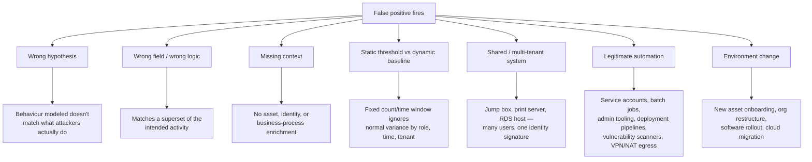
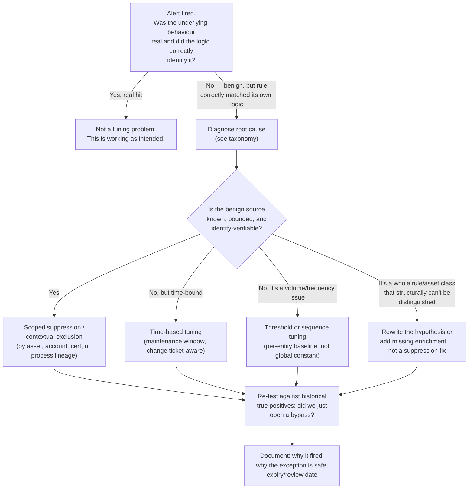

# Part XXXIII — False Positive Engineering

## Why This Gets Its Own Part

Most detection content treats false positive handling as an afterthought: write the rule, ship it,
"tune as needed." That ordering is backwards, and it's the single biggest reason detection programs
lose credibility with the SOC. An analyst who has been burned by the same noisy rule for three
straight shifts stops trusting the queue, and once that trust is gone they triage everything faster
and shallower — including the one alert that was real.

[CONCEPT] A false positive is not "an alert that turned out to be benign." That definition is too
loose to act on. A false positive is an alert your detection logic produced because the logic
matched something structurally different from the behaviour it was designed to catch. The activity
was real; the *match* was wrong. That distinction matters because it points you at the fix: you
don't need less alerting, you need logic that discriminates the behaviour you care about from the
thing that looks like it.

**Hunter's Note** — If you can't articulate, in one sentence, *why* a specific benign process
triggered your rule, you don't understand your rule yet, and tuning it right now is a guess, not
an engineering decision.

## Taxonomy: Where False Positives Actually Come From

Treating "false positive" as a single category is the first mistake. In practice they cluster into
a small number of root causes, and each one has a different fix. Conflating them is why so much
tuning is just alert suppression wearing a lab coat.



### 1. Poor Threat Hypothesis

The rule was built on a hypothesis that doesn't actually describe attacker behaviour, or describes
it too broadly. A classic example: "alert on PowerShell with `-EncodedCommand`." The hypothesis is
"attackers obfuscate PowerShell to evade string matching," which is true, but the analytic treats
*the flag* as the signal instead of *the obfuscation pattern combined with context* — and
`-EncodedCommand` is also how a large fraction of legitimate configuration management tooling
(DSC, some Intune remediation scripts, various vendor agents) invokes PowerShell, because it's the
supported way to pass complex arguments without escaping hell. The flag alone is not evidence of
anything. The hypothesis needed one more clause: encoded command *and* decodes to something that
downloads/executes/injects, *or* runs from a non-standard parent, *or* runs on a host with no
change record.

### 2. Wrong Field, Wrong Logic

The analytic technically works but matches a superset of the intended activity because the field
chosen doesn't carry the semantic weight the author assumed. Matching on `Image` (the executable
path) instead of validating the *code signature and publisher* lets an attacker who renames or
drops a binary evade, while simultaneously firing on every environment that happens to have a
similarly-named legitimate tool in a different path. Matching on a destination port instead of an
actual protocol fingerprint catches every internal tool that happens to reuse that port.

### 3. Missing Context

The event is genuinely somewhat unusual, but the rule has no way to know it's expected *for this
asset, this identity, or this time*. A local admin logon at 3 AM is suspicious on a workstation and
routine on a Tuesday-night patch window against a server fleet. Without asset criticality, role,
change-management, and business-hours context joined into the decision, every rule is guessing at
population-level normal instead of environment-specific normal.

### 4. Static Thresholds Fighting Dynamic Reality

"Alert if a user fails to authenticate more than 10 times in 5 minutes" is a static threshold. It
has no idea that a service account driving a batch job legitimately retries 40 times in 5 minutes
every night at 02:00, or that a help-desk-facing account gets locked out routinely because it's the
first thing users try their new password against. A threshold with no notion of *baseline per
entity* will always be tuned wrong for someone.

### 5. Shared Systems and Identity Ambiguity

Jump boxes, Citrix/RDS farms, print servers, build agents, and shared service accounts break the
implicit assumption behind most identity-based detections: that one authenticated session maps to
one human doing one coherent thing. A jump box has dozens of unrelated admin sessions overlapping
in the same host-level telemetry. A shared service account used by three different scheduled tasks
looks, from the SIEM's point of view, like one identity with wildly inconsistent behaviour — which
is exactly the shape a compromised-account detection is looking for.

### 6. Legitimate Automation That Looks Like an Attacker

This is the largest practical bucket and deserves its own table, because almost every
mass-execution, mass-authentication, or mass-modification detection collides with it.

| Legitimate source | What it looks like to a naive rule | Why it resembles attacker behaviour |
|---|---|---|
| Vulnerability scanner (Nessus, Qualys, OpenVAS) | Fan-out network connections, auth attempts, port sweeps across the whole subnet from one host | Network reconnaissance / password-spray pattern |
| Software deployment tool (SCCM, Intune, Ansible, Puppet, Chef) | One host pushing new binaries, running remote commands, restarting services across many endpoints | Lateral movement / remote execution at scale |
| Backup agent | Reads and opens handles to huge numbers of files across the file server in a short window | Mass file access consistent with ransomware staging or data collection |
| EDR/AV engine itself | Opens handles to LSASS, injects into processes, hooks APIs | Credential-access technique the rule is trying to catch |
| RMM tooling (ConnectWise, AnyDesk used by IT, TeamViewer) | Remote access, screen control, file transfer from an external-looking process | Exactly what attacker-deployed RMM abuse looks like — this one genuinely needs allow-listing by *instance*, not just tool name |
| CI/CD pipeline / build agent | Pulls credentials from a vault, authenticates to cloud APIs, spins up and tears down infrastructure at machine speed | Automated cloud account abuse / infrastructure-as-a-weapon pattern |
| Batch/ETL job under a service account | Logs on at fixed times, touches large data volumes, runs with elevated DB permissions | Off-hours privileged access anomaly |
| VPN concentrator / NAT gateway | Many distinct users appear to originate from one source IP; one user appears to roam between geographically implausible IPs as they reconnect | Impossible-travel or shared-credential false positive |
| Cloud auto-scaling / ephemeral compute | New host identities appear and vanish, IAM roles assumed and dropped rapidly | New/unfamiliar asset, short-lived credential use consistent with compromised-instance behaviour |
| Maintenance window patch cycle | Mass reboot, mass service restart, mass privileged logon across the fleet in a short window | Coordinated compromise / worm-like propagation pattern |

**Engineering Reality** — Every one of these tools eventually gets *actually abused* by an
attacker, because they're already positioned exactly where an attacker wants to be: broad reach,
elevated rights, and a standing exception in your detection logic. Allow-listing "the RMM tool" is
not the same as allow-listing "this specific known-good RMM deployment authenticating from this
known management console with this cert." Get the granularity of the exception wrong and you've
built a blind spot with the tool's name stamped on it.

### 7. Asset and Environment Change

New hardware onboarding, org restructuring, an untracked software rollout, or a cloud migration all
shift what "normal" looks like faster than most tuning cycles can keep up. A rule tuned against
last quarter's asset inventory doesn't know that 200 new laptops just got imaged with a slightly
different baseline agent set, or that a business unit moved its file shares to a new server whose
naming convention doesn't match your asset-criticality lookup table.

## Detection Autopsy: The Naive Impossible-Travel Rule

**Original logic** (conceptual, vendor-agnostic):

> Alert if the same user authenticates successfully from two geolocations more than 500 miles
> apart within a 1-hour window.

**Why it looked reasonable**: this is a well-known, widely deployed analytic. It requires no
process telemetry, works off identity provider logs alone, and directly encodes a real physical
constraint — a human can't be in Chicago and London in the same hour.

**What breaks in production**:

- **VPN/NAT effects**: A user connects to the corporate VPN (egress IP in one country), then their
  mobile device authenticates to a cloud app over carrier data from a different country's cell
  tower geolocation database entry. Same human, two "locations," zero travel.
- **Cloud provider IP geolocation is frequently wrong or stale.** IP-to-geo databases lag behind
  reassigned address blocks, especially for cloud provider ranges and mobile carrier NAT pools that
  serve huge numbers of users behind one advertised location.
- **Shared identity via automation**: a service account or an OAuth app with a refresh token
  running in two regions (a DR site and a primary site, or two different SaaS integrations) trips
  this every day, forever, on a schedule.
- **False negatives it created by design**: an attacker using a residential proxy or VPN exit node
  physically close to the victim's real location sails through completely untouched. The rule's
  distance threshold is trivially evadable by anyone who does five minutes of OPSEC homework, while
  it constantly punishes ordinary mobile roaming.

**Missing context**: no join against known VPN egress ranges, no join against the identity
provider's own device-trust/session-token continuity signal, no distinction between interactive
and non-interactive (OAuth refresh) sign-ins, and no baseline of *this specific user's* normal
travel/roaming pattern.

**Revised analytic** (conceptual): flag only **interactive** sign-ins, exclude known corporate VPN
egress and known SaaS/service-account app IDs, require the *second* location to not correlate with
any registered device or prior session token for that identity, and weight confidence up if it
co-occurs with a new/unrecognized device, a legacy (non-MFA-capable) auth protocol, or a subsequent
sensitive action (mailbox rule creation, OAuth grant, mass download).

**How it was tested**: replayed 30 days of production sign-in logs against both versions offline;
counted alert volume and manually reviewed a sample for ground truth.

**Result**: naive version produced roughly 40-60 alerts/day in a mid-size tenant, almost all
mobile roaming or service-account noise, with the SOC treating the queue as background noise within
two weeks. Revised version produced low single digits per day, and the ones it did produce
correlated far more often with an actual follow-on sensitive action worth reviewing. This is an
illustrative before/after pattern, not a claim about any specific real deployment — validate ratios
against your own tenant before quoting them to management.

## Tuning Approaches

Tuning is not a single action. It's a decision tree, and picking the wrong branch is how you end up
with either a permanently blind rule or a rule that's technically "tuned" but still fires every
shift.



### Contextual Tuning

Join the alert against context the rule didn't have: asset criticality, business ownership, change
management tickets, HR status (contractor vs employee, recently terminated), known software
inventory. This is almost always the highest-leverage fix because it doesn't reduce detection
surface — it makes the existing surface smarter. Example: instead of suppressing all
`New-LocalUser` alerts on servers, suppress them only when the executing identity matches an open,
approved change ticket for that asset within a defined window.

### Temporary Exclusions

Used for known, time-boxed events: a specific migration, an incident response engagement doing
authorized memory dumps, a pen test window. The defining property of a *good* temporary exclusion
is that it has a hard expiry date enforced by tooling, not by someone remembering to remove it. An
exclusion with no expiry is a permanent blind spot with an optimistic name.

**SOC Management View** — Every temporary exclusion should be logged with: who requested it, why,
what specifically it suppresses (rule ID + scope, not "turn off alerting for host X"), and an
expiry date that either auto-removes it or forces a renewal conversation. Audit this list monthly.
A backlog of "temporary" exclusions older than 90 days is a governance failure, and it's the kind
of thing that looks very bad in an incident post-mortem when it turns out the attacker used exactly
that suppressed window.

### Scoped Suppression

Narrower than a blanket exclusion: suppress the match only for the specific combination of
conditions that make it benign — a specific parent process hash, a specific signed binary from a
specific publisher, a specific service account *and* the specific host it's authorized to run on
*and* the specific action it performs. The narrower the scope, the smaller the bypass window you've
opened for an attacker who learns the exclusion exists (and eventually, someone will — insiders,
leaked runbooks, or just trial and error).

### Time-Based Tuning

Encode known-good time windows (patch Tuesdays, backup windows, month-end batch runs) as data, not
as hardcoded suppression. The distinction matters: a maintenance-window-aware rule should check
against a change calendar or a maintenance-mode flag set by the automation itself, so that
maintenance *outside* the expected window (an attacker timing their activity to coincide with when
analysts assume it's "just patching") doesn't get a free pass.

### Asset-Aware Tuning

Different thresholds and different rule sets for different asset classes: domain controllers,
jump boxes, print servers, IoT/OT devices, and end-user laptops do not have the same normal
behaviour and should not share one threshold. This requires an accurate, current asset inventory
and classification — which is frequently the actual blocker, not the detection logic itself.

### Role-Aware Tuning

Tie thresholds to the identity's role rather than a global default: a domain admin account
performing `net use` against every file share in the domain is a five-alarm fire; a help-desk
technician doing the same on three machines during a support ticket is unremarkable; a
finance-department standard user doing it at all is worth a look. Role context should come from
an authoritative source (IAM group membership, HR system, PAM vault checkout record), not from a
static list someone maintains in a spreadsheet that drifts out of date within a quarter.

### Threshold Tuning

Move from static global thresholds to statistical baselines *per entity* — per user, per host, per
service account — using rolling windows (7-day, 30-day) and accounting for known cyclical patterns
(day of week, month-end, patch cycles). A threshold of "3 standard deviations above this specific
account's own 30-day baseline" survives population diversity in a way that "more than 50 events"
never will.

### Sequence Tuning

Many false positives disappear once you require an *ordered sequence* rather than a single event
or an unordered co-occurrence. "Process injection into LSASS" alone is noisy; "process injection
into LSASS, by a process with no valid signature, followed within 60 seconds by that process
writing to disk or making an outbound network connection" is a materially different, higher-
confidence claim, because it encodes the actual attacker *goal* (exfiltrate or stage the credential
material) rather than just one step along the way.

## The Central Warning: Don't Tune the Symptom

This is the point of the chapter, and it's worth stating bluntly: **suppressing an alert is not the
same as understanding why it fired.** The single most common tuning failure mode in mature SOCs
is a queue full of exclusions that were added under time pressure — end of shift, angry stakeholder,
audit deadline — without anyone tracing the alert back to its root cause.

[DETECTION ENGINEER] Before you write any exclusion, answer, with evidence, not assumption:

1. What specific field(s) and value(s) caused the match?
2. Why does that value appear in this benign case — is it a shared tool, a naming coincidence, a
   missing enrichment field, or a genuinely correct match on activity that's just authorized here?
3. Would the same exclusion also hide a real attacker doing the same thing under the same cover?
   (If a scanner IP range is excluded from a scan-detection rule, would an attacker who compromises
   a host inside that range and pivots from it now be invisible to that rule?)
4. Is this a one-off or does it represent a whole class of activity the rule was never designed to
   distinguish? If it's a class, the fix is a hypothesis rewrite, not an exclusion list.
5. Who owns the review of this exclusion, and when does it expire or get re-validated?

**Detection Autopsy** callouts above and the tuning decision tree both exist to make this concrete,
but the discipline is procedural, not technical: build a required "root cause" field into your
tuning workflow (a ticket field, a PR description template, whatever your team actually uses) that
cannot be skipped. If the answer to "why did this fire" is "I don't know, but it's annoying,"
that's a signal to investigate further, not a justification to suppress.

**Hunter's Note** — The exclusions list is itself attacker-relevant terrain. If you were red-teaming
your own SOC, the fastest way to operate freely is to find out what's already excluded and do your
attack from inside that shape — from the scanner's IP range, using the RMM tool that's allow-listed
by name, during the maintenance window nobody double-checks. Review your exclusion list the way you
review your detection coverage: as attack surface, not as administrative housekeeping.

## Worked Example: Tuning a Noisy Service-Account Authentication Rule

**Starting rule** (illustrative Sigma-style logic, conceptual — validate syntax against your own
backend before deploying):

```yaml
title: Multiple Failed Authentications Followed By Success
status: experimental
logsource:
    category: authentication
detection:
    fail_events:
        EventID: 4625
    success_event:
        EventID: 4624
    timeframe: 10m
    condition: fail_events | count() by TargetUserName > 5 followed by success_event
falsepositives:
    - Service accounts with scheduled retry logic
    - Password rotation events across dependent systems
level: medium
```

**Why it's noisy in production**: a batch ETL service account retries against a database
connection string with a stale cached credential every night after a routine password rotation,
generating 8-12 failures before the dependent system picks up the new credential — every single
rotation cycle, for every service account with a downstream caching layer. This is completely
predictable and completely benign, and a naive analyst response is "exclude this account."

**Why "just exclude the account" is the wrong first move**: that account performing the exact same
failure/success pattern from an unexpected source host, at an unexpected time, or immediately
followed by a privilege escalation action, is exactly the pattern you'd expect if that account's
credential had actually been compromised and someone was brute-forcing a stale password guess
before landing on the current one. A blanket account exclusion deletes your ability to see that.

**Root-cause investigation** [ANALYST]:
- Confirm the failure timestamps cluster tightly around known password rotation schedules (check
  the PAM/secrets-vault rotation log, not just intuition).
- Confirm the source host for both failures and the eventual success is the account's known,
  documented host — not a new or unexpected source.
- Confirm no privileged action follows the success beyond what that account normally does.

**Tuned rule** (illustrative):

```yaml
title: Multiple Failed Authentications Followed By Success - Tuned
status: stable
logsource:
    category: authentication
detection:
    fail_events:
        EventID: 4625
    success_event:
        EventID: 4624
    timeframe: 10m
    condition: >
        fail_events | count() by TargetUserName, SourceHost > 5
        followed by success_event
        and SourceHost in known_source_hosts_for_user(TargetUserName)
        and not within_scheduled_rotation_window(TargetUserName)
falsepositives:
    - Rare cases where rotation scheduling data is stale
level: medium
```

The tuned version keeps the account in scope for detection, adds a source-host consistency check
(so a new source doing the same pattern still fires), and suppresses only the specific,
schedule-correlated case — with the suppression condition tied to *verifiable rotation data*, not
a static account exclusion with no expiry.

[THREAT HUNTER] Once you've tuned this, the hunt variant is: pull every account with this
fail-then-succeed pattern over the last 90 days, and look for any occurrence that does *not*
correlate with a logged rotation event. That's your candidate list for either genuinely compromised
credentials or misconfigured retry logic worth fixing regardless.

**[SCREENSHOT PLACEHOLDER — CONTROLLED LAB]** — Linux `auth.log` via SSH showing a scripted service
account's repeated `Failed password` entries immediately followed by a successful key-based login,
to illustrate the same fail-then-succeed shape on a non-Windows host and confirm the timestamp
field and source-host field needed for the equivalent tuned analytic on Linux infrastructure.

## Coverage and Governance Framing

| Tuning type | Reduces alert volume | Preserves detection of real attack in same pattern | Requires ongoing maintenance | Typical owner |
|---|---|---|---|---|
| Contextual tuning | Medium-high | High (adds signal, doesn't remove) | Medium (context source must stay current) | Detection engineer + IT asset owner |
| Temporary exclusion | High (short-term) | Depends entirely on expiry discipline | Low, if expiry enforced | Detection engineer, SOC lead sign-off |
| Scoped suppression | Medium | High, if scope is narrow | Medium | Detection engineer |
| Time-based tuning | High during window | Medium (blind during the window unless layered) | Low-medium | Detection engineer + change management |
| Asset-aware tuning | Medium | High | Medium (inventory must stay accurate) | Detection engineer + CMDB owner |
| Role-aware tuning | Medium | High | Medium (IAM/HR feed must stay accurate) | Detection engineer + IAM team |
| Threshold tuning | Medium-high | High, if baseline is per-entity | Low (self-adjusting if done statistically) | Detection engineer |
| Sequence tuning | High | Very high (raises specificity, not just volume) | Medium (sequence logic more fragile to log gaps) | Detection engineer |

**SOC Management View** — Track a tuning-debt metric alongside your detection coverage metric:
number of active exclusions, average age, number past a review deadline, and number with no
recorded root cause. A detection program that reports "95% MITRE coverage" while carrying 400
undocumented exclusions is not covering 95% of anything — it's reporting on rule existence, not on
what those rules can actually still see. Budget time for tuning-debt review the same way you budget
for patch-debt review; it decays on the same kind of schedule and the failure mode (a quietly
disabled control) is just as severe as an unpatched vulnerability.

## Summary

False positives are diagnostic information, not just an operational cost to minimize. Every one
tells you something specific about where your hypothesis, your fields, your context, or your
thresholds diverge from the reality of your environment. The tuning menu — contextual, temporary,
scoped, time-based, asset-aware, role-aware, threshold, sequence — gives you the *mechanism*, but
the discipline that actually keeps a detection program healthy is refusing to reach for suppression
before you can state, specifically and in writing, why the alert fired. Treat your exclusion list
with the same rigor you'd want applied to the detections themselves, because functionally, it's the
same list — it's just the half that says where you've chosen not to look.
