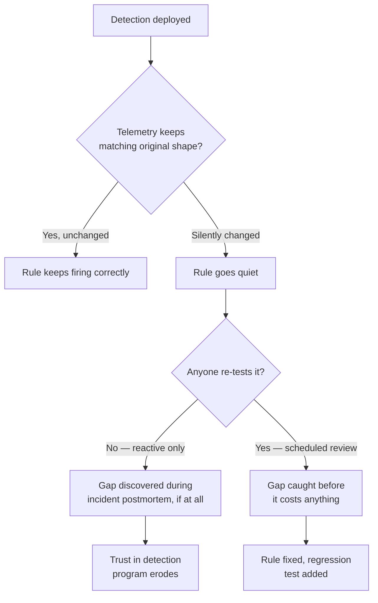
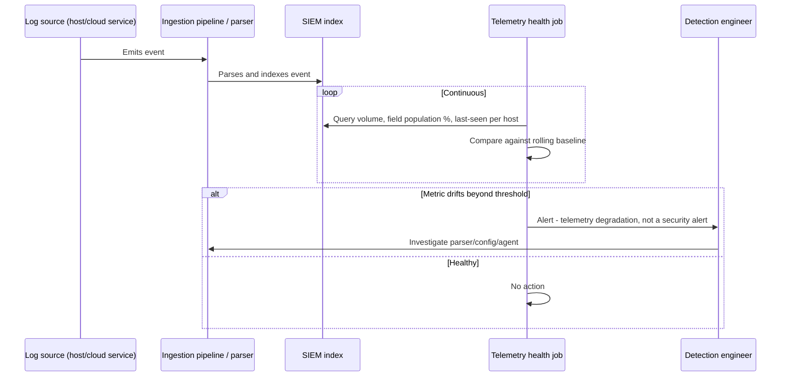

# Part XXXIV — False Negatives

False positives get dashboards, tuning sprints, and analyst complaints. False negatives get
silence — until an incident responder finds the attacker was inside for eleven days and asks "why
didn't the rule fire?" That question usually has an unsatisfying answer: the rule was fine, the
data wasn't there, or the data was there but not in the shape the rule expected. This chapter is
about building the discipline to find that gap *before* the incident responder does.

[CONCEPT] A false negative is not "the detection failed." It's "the detection succeeded against a
condition that never occurred in production the way the author imagined it." The rule logic can be
perfectly correct and still never fire — because the field it depends on stopped being populated
eight months ago, or the attacker used lowercase where the rule expected mixed case, or the event
never made it out of the source host's local buffer. Distinguishing "bad logic" from "logic that
never got tested against reality" changes where you spend remediation effort.

**Hunter's Note:** If you can't remember the last time a detection rule *didn't* fire during a
purple-team exercise, that's not a compliment to your coverage — it means you haven't tested it
against anything that would actually reveal a gap.

## Why False Negatives Are Structurally Under-Reported

A false positive announces itself: an analyst gets paged, triages, closes it, and — if the SOC has
any tuning process at all — someone eventually complains loudly enough that the rule gets adjusted.
A false negative announces nothing. There is no alert to complain about. The only ways a false
negative surfaces are:

1. An incident happens and someone reconstructs the timeline, finding the attacker did the exact
   thing the rule was supposed to catch, and the rule stayed silent.
2. A red team or purple team exercise deliberately triggers the behavior and checks whether
   anything fired.
3. A scheduled, deliberate false-negative review process goes looking for the gap before either of
   the above happens.

Only option 3 is proactive. Options 1 and 2 are reactive-by-design (incident response) or
periodic-and-expensive (red team engagements, usually a handful of times a year at best). If your
detection program's only false-negative discovery mechanism is "wait for an incident," you are
running a coverage program that cannot see its own blind spots until they've already cost you
something.

[MANAGEMENT] This is the argument for budgeting false-negative review as a recurring line item, not
a one-time audit. A control that silently degrades and is never re-tested is functionally
equivalent to no control, except it still shows up as "covered" on the ATT&CK heatmap the CISO
presents to the board. That gap between reported coverage and actual coverage is a real risk
exposure, and it compounds — every quarter a rule goes untested is another quarter of unknown drift
in the underlying telemetry.



## Cause Taxonomy

The rest of this chapter walks through the recurring causes in roughly the order a working session
should check them, from "the data plane is broken" toward "the rule logic itself is too narrow."

### 1. Missing telemetry

The most fundamental cause: the event category the detection needs was never collected in the
first place, or collection stopped without anyone noticing.

- Sysmon not deployed to a host, or deployed with a config that excludes the event ID needed
  (e.g., Event ID 7, image load, disabled for performance reasons on a server that later runs a
  DLL side-loading attack).
- A cloud service's control-plane logging was never enabled for a specific resource type or region
  — AWS CloudTrail data events (S3 object-level, Lambda invocations) are opt-in and cost money, and
  it's common to enable management events only, then wonder why an S3 exfiltration detection never
  fires.
- An EDR agent silently uninstalled, disabled, or stuck in a degraded/tamper-protected-but-not-
  reporting state. Agent health is itself a detection surface that most programs don't monitor.
- Log forwarding agent (Winlogbeat, syslog-ng, a Fluentd sidecar) crashed or was OOM-killed and
  didn't restart — the source is generating events, they're just not leaving the host.

[ENGINEERING] "We have Sysmon deployed" is not a fact you can trust without a per-host, per-event-ID
volume check. Fleet-wide Sysmon coverage percentages hide the hosts where the config silently
reverted to defaults after an image refresh, or where a GPO conflict left the older, narrower
config in place. Coverage claims need to be verified at the event-ID level, not the agent-installed
level.

### 2. Parser failure

The event arrived at the SIEM. The field the detection logic depends on is null, malformed, or
mapped somewhere else, because the parser choked on it or was never updated for a log format
change.

- A vendor changes a log format in a product update (new field, renamed field, changed delimiter)
  and the custom parser/CIM mapping wasn't updated. The event still ingests — it just lands with
  half its fields empty or mis-split.
- Multi-line log entries (stack traces, some firewall logs) get parsed as multiple separate events,
  breaking any correlation logic that expected them as one record.
- A regex-based parser silently fails to match a slightly different message format (a new locale,
  a firmware update that changed field order) and falls back to a raw/unparsed event type that the
  detection rule's field-based logic never queries.
- JSON parsing breaks on an unexpected nested structure or an array where a scalar was expected,
  and the ingestion pipeline drops or truncates the event rather than erroring loudly.

**Engineering Reality:** Parsers do not fail loudly. They fail by producing a *plausible-looking*
event with the wrong fields populated, and nothing downstream complains because nothing downstream
knows what "correct" was supposed to look like. The only way to catch this is to check field
population rates over time, not just event *counts* over time — event count can look perfectly
healthy while the field your rule depends on silently drops from 98% populated to 4% populated
after a source-side update.

### 3. Detection scoped too narrowly

The rule logic correctly describes one specific way to perform the behavior, and the attacker (or
just a different legitimate tool) does it a different way.

- A PowerShell download-and-execute detection that matches `IEX (New-Object Net.WebClient)` misses
  `Invoke-RestMethod`, `.DownloadFile()`, `curl.exe`, `bitsadmin`, or `certutil -urlcache -f`
  performing the same functional behavior with entirely different syntax.
- A rule for a specific LOLBin invocation pattern (e.g., `rundll32.exe` with a specific export name)
  misses the same technique via `regsvr32.exe`, `mshta.exe`, or a renamed/copied binary that no
  longer matches an `Image` path or name check.
- A registry-run-key persistence detection that only checks `HKLM\...\Run` misses the
  per-user `HKCU` hive, the `RunOnce` key, or one of the dozen other autostart locations
  (Winlogon Shell/Userinit, services, scheduled tasks, WMI event subscriptions).

[THREAT HUNTER] Treat any "specific command" detection as a floor, not a ceiling. When you write
one, immediately ask: what are the other three ways to get the same *effect*? Write those down in
the rule's documentation even if you don't build detections for all of them yet — that list is
your backlog and your hunt-query seed list.

### 4. Detection assumes one specific tool/vendor is in use

A close cousin of #3: the logic isn't just narrow on syntax, it's implicitly built around a single
product's telemetry shape and breaks the moment the environment has (or switches to) a different
one.

- A detection tuned entirely against CrowdStrike Falcon's process-tree field names and event
  semantics will not "just work" if translated naively to Microsoft Defender for Endpoint or
  SentinelOne data — field names, parent-chain depth, and even what counts as a loggable event
  differ.
- A cloud detection written against AWS GuardDuty finding types has no equivalent logic path for
  the same account also running Azure or GCP workloads.
- An email detection built entirely around Microsoft 365 message trace fields silently has zero
  coverage the day the org adds a secondary mail gateway or a subsidiary still running Google
  Workspace.

[SOC Management View] Multi-vendor environments (through M&A, multi-cloud, or phased EDR rollout)
are extremely common and rarely fully inventoried in the detection team's head. A "we cover X" claim
needs a companion question: covers X *on which platforms, specifically* — and does anything remind
you when a new platform enters the environment that your detection catalog doesn't know about it
yet?

### 5. Case sensitivity mismatches

Deceptively simple, and one of the most common silent gaps in string-matching rules.

- Windows file paths, registry paths, and most Windows fields are case-insensitive at the OS level,
  but many SIEM query languages perform case-*sensitive* string matching by default (Splunk's raw
  `=` on certain fields, some Elasticsearch keyword-field term queries). A rule matching
  `CommandLine="*Invoke-Mimikatz*"` misses `invoke-mimikatz`, `INVOKE-MIMIKATZ`, or
  `InVoKe-MiMiKaTz` — and attackers vary case specifically to break naive string matches.
- Linux and most cloud APIs *are* genuinely case-sensitive, so a rule ported from a Windows-first
  mental model in the other direction can also misfire in the opposite way — expecting
  case-insensitivity that the underlying system doesn't provide.

[DETECTION ENGINEER] Know your backend's default case behavior per field type before writing a
string match, and use an explicit case-insensitive function/modifier (`lower()`, `TOLOWER()`,
Sigma's default case-insensitive `contains`, KQL's `=~`) rather than relying on an assumption about
default behavior that varies by platform, by field type, and sometimes by index configuration
within the same platform.

### 6. Wrong time window

- A correlation rule requiring event A and event B "within 5 minutes" misses the same attack
  chain executed by an operator working manually and taking 20 minutes between steps, or misses a
  slow, low-and-slow automated tool deliberately spacing actions out to defeat exactly this kind of
  window.
- Scheduled/batch detections that run every 15 minutes but query only "events in the last 5
  minutes" create silent gaps at the boundaries if the job runs late, is skipped once, or the
  underlying data has any ingestion lag — events that land in the gap are never queried by any
  run.
- Time zone handling bugs: a detection built and tested against UTC timestamps quietly breaks (or
  double-counts, or misses a boundary case) when a source starts sending local time, or when
  daylight saving shifts happen, or when a lookback window is computed against the SIEM server's
  local clock instead of the data's event time.

**Detection Autopsy — the 5-minute correlation window**

*Original logic:* "Alert if the same user account has a failed authentication from a foreign IP
followed by a successful authentication from a different IP, within 5 minutes" — intended to catch
a credential-stuffing hit followed quickly by a successful pivot using the harvested credential.

*Why it looked reasonable:* Most automated credential-stuffing-to-login-success chains in the
public writeups the author read happened within seconds to low minutes, so 5 minutes felt like a
generous margin.

*What breaks in production:* Real password-spray campaigns often succeed on attempt N and the
attacker (or their tooling queue) doesn't get around to using the credential for 20 minutes to
several hours — there's a market/handoff step between "credential validated" and "credential
used" in a lot of criminal tooling supply chains. The rule's window is too short for that gap and
too generous for a much more common benign case: a user who fat-fingers a password, gets a normal
push-notification MFA delay, and succeeds 90 seconds later from the same general network — which
still gets flagged because "different IP" was satisfied by ISP-side load-balanced egress IP
rotation on a mobile carrier.

*False positives:* Mobile users on carrier NAT frequently show different source IPs between two
requests seconds apart — this is normal, not suspicious, and the naive rule fires on it constantly,
which is exactly the kind of noise that gets a whole rule category quietly disabled by a tired
on-call analyst.

*False negatives:* The actual attack pattern this was built for — spray now, use later — sails
through untouched because the real gap between validate and use is almost always longer than 5
minutes.

*Missing context:* No distinction between "different IP, same ASN/geography" (likely same user,
different network hop) and "different IP, different country" (much more suspicious). No use of
impossible-travel logic. No check on whether the account has MFA and whether the successful login
satisfied it.

*Revised analytic (illustrative KQL, Azure AD / Entra sign-in logs):*

```kql
let window = 4h;
SigninLogs
| where ResultType == "50126" or ResultType == "50053" // failure codes: invalid password / locked
| project FailTime = TimeGenerated, UserPrincipalName, FailIP = IPAddress, FailCountry = tostring(LocationDetails.countryOrRegion)
| join kind=inner (
    SigninLogs
    | where ResultType == "0" // success
    | project SuccessTime = TimeGenerated, UserPrincipalName, SuccessIP = IPAddress,
              SuccessCountry = tostring(LocationDetails.countryOrRegion), AuthMethod = AuthenticationRequirement
) on UserPrincipalName
| where SuccessTime between (FailTime .. (FailTime + window))
| where FailCountry != SuccessCountry  // geography change, not just IP change
| where AuthMethod != "multiFactorAuthentication" // success without MFA is higher signal
| project UserPrincipalName, FailTime, FailIP, FailCountry, SuccessTime, SuccessIP, SuccessCountry, AuthMethod
```

*How it was tested:* Replayed against a 90-day historical window to check the new false-positive
rate against known-benign mobile/roaming users, and against a simulated password-spray-then-delayed-
reuse scenario in a test tenant with a deliberate 45-minute gap between validation and reuse.

*Result:* Widened window from 5 minutes to 4 hours, added a geography-change requirement instead of
raw IP-change, and added an MFA-satisfaction check to separate "successful login" from "successful
login that actually required proving identity." False-positive volume on the mobile-roaming case
dropped to near zero, and the 45-minute-delay test case fired for the first time.

### 7. Field truncation

- Command-line logging (Sysmon Event ID 1, Windows Event ID 4688 with command-line auditing
  enabled) has practical length limits depending on the log source and forwarder; a long, heavily
  obfuscated PowerShell one-liner or a base64 blob can get truncated before the string your rule is
  looking for ever appears in the stored event.
  a length-dependent way, and none of the truncation is visible in a dashboard that only reports
  event volume.
- Splunk's default `TRUNCATE` setting (historically 10000 bytes per event, configurable) can cut
  off the tail end of large multi-field log lines, silently dropping later fields entirely.
- Syslog transport over UDP has practical size limits and mid-stream truncation risk with no
  retransmission; a long JSON payload crammed into a syslog message can arrive cut off mid-object.

[ANALYST] If a detection depends on a substring that plausibly lands past the first few thousand
characters of a very long field (a full encoded payload, a long argument list), check actual
truncation behavior for that specific pipeline before trusting the rule. "The regex should match"
is not the same claim as "the regex has bytes to match against."

### 8. Event sampling

Some telemetry sources sample rather than report every event under load — NetFlow/sFlow are
sampled by design (commonly 1:1000 or worse on high-throughput links), some cloud provider logs
apply sampling under high request volume, and some EDR products throttle or deduplicate
high-frequency event types (e.g., repeated DNS queries or file reads) to control agent overhead and
ingestion cost.

A detection built and tested against full-fidelity data in a lab will have a materially different
detection probability in production against sampled data — not zero, but probabilistic, and that
probability needs to be understood and stated rather than assumed away.

[MANAGEMENT] If a network-based detection's expected reliability depends on catching a specific
single flow among sampled NetFlow data, state the actual expected detection probability given the
sampling rate, not just "we have network visibility." A 1:1000 sample rate on a single-packet
beacon means the honest answer is closer to "we would need repeated, sustained behavior to have a
reasonable chance of catching this," not "we would catch this."

### 9. Log delivery delay

A rule scoped to a fixed lookback window (last 15 minutes, last hour) assumes the event actually
lands in the index within that window. Delivery delay breaks that assumption in several common
ways:

- Batch-oriented log sources (some SaaS audit logs, some cloud provider log exports) can have
  delivery lag from minutes to multiple hours, and that lag is not always constant — it can spike
  under the provider's own load.
  the search runs, and by the time the search re-runs later, the window has moved on and never
  looks at that timestamp range again.
- Disconnected/roaming endpoints (laptops) buffer locally and forward once connectivity resumes,
  which can be hours or days later — a scheduled search with a short, non-overlapping window will
  never see that batch.

[DETECTION ENGINEER] Scheduled detection searches should overlap their lookback window with the
previous run's window (e.g., a 15-minute cadence searching the last 20 minutes) and should be keyed
on ingestion time awareness where the platform supports it, specifically to survive delivery jitter
without creating gaps at the boundaries or, on the other side, without silently double-alerting on
the overlap (which is a tuning problem, not a coverage problem — solvable with dedup on event ID).

### 10. Cloud schema changes

Cloud provider log schemas are not stable contracts the way an on-prem Windows event schema has
been for two decades. Providers add fields, deprecate fields, rename event types, and change
nesting structure — sometimes with advance notice in a changelog nobody on the detection team
subscribes to, sometimes without.

- AWS CloudTrail event field additions/renames across service API version bumps.
- Azure Activity Log / Entra sign-in log schema revisions tied to portal/API changes.
- GCP Cloud Audit Log `protoPayload` structure differences between service types, and changes when
  a service migrates between logging backends.
- Kubernetes audit log schema changes across cluster version upgrades — a detection tied to a
  specific `apiVersion` or resource shape can go dark after a routine cluster upgrade nobody
  correlated with detection coverage.

**Engineering Reality:** Cloud detection content has a shelf life that on-prem Windows content
mostly doesn't. Subscribing to provider changelogs is a detection-engineering task, not just a
platform-engineering task, and nobody does it consistently enough.

### 11. Attacker technique variation

Even with perfect telemetry and a well-scoped rule, techniques evolve specifically to defeat known
detection patterns:

- Tooling authors watch public Sigma/detection rule repos and adjust default behavior (argument
  names, process names, default file paths) specifically to avoid matching published rules.
- Living-off-the-land technique substitution: when a specific LOLBin gets a detection rule and
  enough attention, capable operators simply pick a different one with equivalent capability.
- Timing/behavioral changes: slower execution, randomized jitter, breaking a single suspicious
  action into several individually-benign-looking steps across a longer time window specifically to
  defeat correlation windows (see #6).

[THREAT HUNTER] This is the strongest argument for hunting as a distinct discipline from alerting:
a hunt hypothesis framed around *behavior and intent* ("something is trying to dump credential
material from LSASS") survives technique rotation in a way that a hunt framed around *one tool's
exact syntax* does not.

### 12. Encoding/obfuscation the rule didn't anticipate

- Base64, hex, or custom XOR encoding of a payload or command defeats a plaintext string match
  outright unless the rule specifically decodes and re-checks, or matches on the *encoding
  operation itself* (e.g., flagging `-EncodedCommand` usage regardless of payload content, or
  flagging high-entropy strings).
- Character substitution/homoglyph tricks (`p⁠owershell` with an inserted zero-width character,
  full-width Unicode lookalikes) defeat naive substring matches while rendering identically to a
  human reader or even to a naive automated string comparison that doesn't normalize Unicode forms.
- String concatenation and variable reassembly at runtime (`$a='mim';$b='ikatz';iex($a+$b)`) mean
  the literal string the rule is looking for never appears anywhere in the logged command line at
  all — it's assembled only in memory at execution time.
- Case randomization and whitespace/tab insertion inside otherwise-recognizable commands, purpose-
  built to survive exact-match and even many `contains`-style rules that aren't tokenization-aware.

[DETECTION ENGINEER] For this whole category, the durable answer is behavioral pivoting rather than
matching literal syntax: flag the *use of* the encoding/obfuscation mechanism (encoded command flags,
abnormal entropy, unusual concatenation patterns, dynamic invoke patterns like `IEX`/`Invoke-Expression`
regardless of what's inside them) rather than trying to enumerate every possible obfuscated form of a
known-bad string. Sigma's `|base64offset|contains` and similar modifiers exist because this is a known,
common problem — but they only cover the encodings the rule author anticipated.

## Worked Example: Finding a Live False Negative

**part34-01 — LSASS credential access coverage gap, discovered via technique-variant testing**

Assume a detection exists (illustrative Sigma) targeting `procdump.exe`-style LSASS dumping:

```yaml
title: Suspicious LSASS Process Dump via ProcDump
id: 8f2a1c3e-0000-4a00-9000-000000000001
status: test
logsource:
  category: process_creation
  product: windows
detection:
  selection:
    Image|endswith: '\procdump.exe'
    CommandLine|contains: 'lsass'
  condition: selection
level: high
falsepositives:
  - Legitimate sysadmin troubleshooting with Sysinternals ProcDump
```

This rule is correctly written for exactly what it says: `procdump.exe` invoked against `lsass`.
It is a textbook case of cause #3 (too narrow) layered with #12 (no obfuscation handling) — it has
zero coverage for:

- `comsvcs.dll`'s `MiniDump` export invoked via `rundll32.exe` (a well-known LOLBin equivalent —
  MITRE ATT&CK T1003.001, OS Credential Dumping: LSASS Memory).
- Task Manager's built-in "Create dump file" against `lsass.exe`.
- Direct handle-duplication techniques (Mimikatz `sekurlsa`, and tooling that opens a handle to
  `lsass.exe` via `OpenProcess`/`MiniDumpWriteDump` API calls without spawning any dump utility
  process at all — which also means *no command-line-based rule of any kind will ever catch it*,
  because there is no distinguishing command line to inspect.
- A renamed copy of `procdump.exe` (`Image|endswith` on the literal filename is trivially defeated
  by `copy procdump.exe svchost_helper.exe`).

[THREAT HUNTER] The correct pivot for LSASS credential access coverage is process-access telemetry
(Sysmon Event ID 10, `ProcessAccess`, when configured to log access to `lsass.exe`), which detects
the *act of one process opening a handle into lsass.exe with dump-capable access rights*,
independent of which tool did it or what it was named. That's the durable version of this
detection; the ProcDump-string rule above is a good early-warning tripwire for the laziest version
of the technique, not a control anyone should rely on for actual coverage.

Illustrative revised approach (Sigma, process-access based):

```yaml
title: Process Access to LSASS with Dump-Capable Rights
id: 8f2a1c3e-0000-4a00-9000-000000000002
status: test
logsource:
  category: process_access
  product: windows
  service: sysmon
detection:
  selection:
    TargetImage|endswith: '\lsass.exe'
    GrantedAccess:
      - '0x1010'
      - '0x1410'
      - '0x1438'
      - '0x143a'
      - '0x1fffff'
  filter_known_edr:
    SourceImage|endswith:
      - '\MsMpEng.exe'
      - '\SenseIR.exe'
  condition: selection and not filter_known_edr
level: high
falsepositives:
  - EDR/AV self-protection processes reading LSASS memory for legitimate scanning
  - Backup/crash-dump tooling with a legitimate need to access LSASS
```

> **[SCREENSHOT PLACEHOLDER — CONTROLLED LAB]** — Sysmon process-creation and process-access log
  pair captured from a Windows host during a controlled LSASS-access technique-variant test (e.g.
  Task Manager dump vs. `comsvcs.dll` MiniDump vs. renamed ProcDump), showing Event ID 1 (process
  creation, illustrating which variants produce zero distinguishing command-line signal) alongside
  Event ID 10 (process access) for the same test window, to illustrate why the `GrantedAccess` field
  on the access event is the reliable pivot and the command-line field on the creation event is not.

This is exactly the kind of gap a scheduled review catches and a "did the rule fire in the last
incident" review does not, because nobody has run an LSASS-dumping incident recently — the gap is
silent until it isn't.

## A Formal False-Negative Review Process

A false-negative review program has three distinct legs. None of them substitute for the others.

### Leg 1 — Periodic re-testing against known technique variants

For each detection (or each ATT&CK (sub-)technique with a detection claim against it), maintain a
short list of known execution variants and re-run them against the live environment on a fixed
cadence, not just once at rule creation time.

| Element | Detail |
|---|---|
| Trigger | Calendar-based (e.g., quarterly per technique family) and event-based (new public tooling/technique variant published) |
| Scope | Every technique with a "covered" claim on the coverage matrix, prioritized by ATT&CK techniques most relevant to the org's threat model |
| Method | Atomic-test-style execution (e.g., an Atomic Red Team-style test, or an internal equivalent) run in a lab or a controlled production-adjacent segment |
| Pass/fail criterion | Did the expected alert fire, with the expected fields populated, within the expected time window — not just "did *something* fire" |
| Output | Update to the coverage matrix (covered / partially covered / gap), a ticket per gap, and a dated record of last-tested date per technique |

[MANAGEMENT] "Last tested: 14 months ago" next to a "covered" tag on a coverage matrix should be
treated as a stale, low-confidence claim, not equivalent to "covered." Track test recency as a
first-class field on the matrix, not a footnote.

### Leg 2 — Telemetry health checks

Independent of rule logic, verify the data plane is actually healthy, continuously:

- **Volume anomaly detection on the meta-level**: track event-count-per-source-per-day and alert
  when a source's volume drops sharply (a host stopped logging) or spikes sharply (a config change
  that might indicate a parser will now behave differently).
- **Field population rate tracking**: for fields specific detections depend on, track the
  percentage of events in a category that actually populate that field, over time. A drop from 95%
  to 20% populated is a parser regression or an upstream schema change, and it will not show up in
  an event-count graph.
- **Last-seen-per-host tracking**: for endpoint/host-based telemetry, track last-event-received
  timestamp per host and alert on hosts that have gone silent relative to their historical
  baseline — this catches agent death, network segmentation changes, and decommissioned-but-still-
  in-scope assets.
- **Latency tracking**: measure event-time-to-ingestion-time delta per source and alert when it
  grows beyond the assumptions baked into scheduled search windows (cause #9 above).



### Leg 3 — Parser regression tests

Treat parsers like code, because they are code, and they need the same discipline:

- Maintain a corpus of sample raw log lines per source type, including edge cases (maximum-length
  command lines, unusual character sets, known historical format variants from different product
  versions), version-controlled alongside the parser/pipeline config.
- Run the corpus through the parser on every pipeline/config change and diff the parsed output
  against an expected-output fixture — a classic regression test, just applied to log parsing
  instead of application code.
- When a vendor announces a log format change, add a sample of the *new* format to the corpus
  before the change reaches production, not after something breaks.
- Specifically test truncation boundaries (cause #7) and encoding edge cases (cause #12) as part of
  the corpus, not as an afterthought.

**SOC Management View:** Leg 3 is the one most likely to get skipped under resourcing pressure,
because it looks like a data-engineering task rather than a security task, and most detection teams
don't have anyone with a data/pipeline-engineering background sitting on them. Budget it explicitly
— either headcount with that skill set embedded in the detection team, or a hard dependency
relationship with whichever team owns the ingestion pipeline, with false-negative risk from parser
drift as an explicit shared KPI between the two teams. Splitting ownership without a shared metric
is how this leg quietly stops happening within a year of the program launching.

## Coverage Matrix Reference

A minimal version of the tracking artifact this whole chapter argues for:

| ATT&CK technique | Detection(s) | Telemetry dependency | Last variant-tested | Result | Known gaps |
|---|---|---|---|---|---|
| T1003.001 — OS Credential Dumping: LSASS Memory | part34-01 (process-access variant) | Sysmon Event ID 10 | 2026-Q3 | Pass (procdump, comsvcs.dll variants) | Direct API-based dumping without child process; no coverage if Sysmon config lacks lsass.exe in ProcessAccess targets |
| T1059.001 — PowerShell | (org-specific ID) | PowerShell Script Block Logging (Event ID 4104), Sysmon 1 | 2026-Q2 | Partial | Case-randomized/concatenated payloads bypass string-based rules; entropy-based rule in backlog |
| T1071.001 — Web Protocols (C2) | (org-specific ID) | Proxy/firewall netflow, sampled | 2026-Q1 | Partial | NetFlow sampling rate 1:1000 gives low detection probability for single-beacon, sustained-beacon detection recommended instead |

Keep this matrix as a living artifact, not a one-time deliverable — it is the single most useful
output of a false-negative review program, because it's the thing that turns "we think we're
covered" into "here is exactly what we tested, when, and what we know we're not catching."

## Summary

False negatives are undercounted because they're invisible by default — nothing pages anyone when
a rule *doesn't* fire. The causes cluster into three layers: the data never arrived (missing
telemetry, sampling, delivery delay), the data arrived but got mangled or misunderstood (parser
failure, truncation, case sensitivity, schema drift), or the data arrived intact but the rule's
logic was too narrow for the actual range of behavior it claimed to cover (tool/vendor assumptions,
technique variation, encoding). Closing the gap requires treating false-negative discovery as a
scheduled, resourced process with three legs — technique-variant retesting, telemetry health
monitoring, and parser regression testing — rather than waiting for a red team or an incident to
find it for you.
