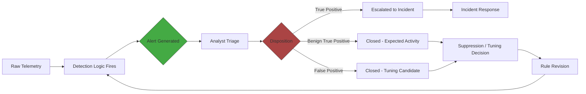

# Part XXXV — Detection Quality Metrics

## Alert count is not a metric, it's a symptom

Ask a detection engineering team how many alerts fired last week and you'll get a number instantly. Ask them what fraction of those alerts represented real adversary activity, and the room goes quiet. This is the core failure mode this chapter addresses: alert count is easy to produce, easy to graph, and tells you almost nothing about whether the detection program is working.

[MANAGEMENT] Alert count trending down looks like progress on a slide. It is equally consistent with three very different realities: the environment genuinely got quieter, tuning suppressed noise without losing true positives, or a rule silently broke and stopped firing. Alert count trending up is equally ambiguous: it could mean better coverage catching more real activity, a noisy new data source, or a misconfigured analytic screaming about something benign. Without a second axis — what happened to those alerts after they fired — the count is directionless. A program that reports "alerts down 30% this quarter" as a win, without also reporting what happened to the true-positive rate over the same period, is reporting nothing.

**Hunter's Note:** The single fastest way to make alert count go down is to break the pipeline. I have seen a parser update silently drop a field a rule depended on, the rule went quiet, and the dashboard showing "alert volume trending down, tuning is working" ran for six weeks before anyone checked why. Alert count without a companion metric is a number that looks best exactly when something has gone wrong.

This chapter works through the metrics that should replace — or at minimum sit alongside and contextualize — raw alert count. None of them is safe to use alone. Each has a specific way it lies to you if you stare at it in isolation, and that failure mode is the point of covering it.



## Ground truth: the problem underneath every metric in this chapter

Before the individual metrics, one caveat that applies to all of them. Precision and recall both require knowing, with certainty, which events were actually malicious and which weren't. In production security environments, you never have that. You have analyst dispositions (which are opinions, made under time pressure, sometimes wrong), you have confirmed incidents (a small, biased subset — usually the ones that were loud or got caught some other way), and you have an unknown, unmeasured population of intrusions that were never detected at all and therefore never entered any metric.

[CONCEPT] This means every "recall" number a SOC reports is really "recall against the intrusions we know about" — which is not recall in the statistical sense, it's a lower bound conditioned on your own detection and hunting capability. If your hunting program is weak, you find fewer of the intrusions that slipped past your rules, your denominator for recall shrinks, and your reported recall looks artificially good. This is survivorship bias built into the metric's foundation, and it does not go away with a better dashboard — it only improves with things outside the metric itself: red team exercises, purple team validation, breach-and-attack-simulation tooling, and incident response findings that surface detections which should have fired and didn't.

## Precision

[CONCEPT] Precision is the fraction of alerts that were correct: true positives divided by (true positives plus false positives). It answers "when this detection fires, how often is it right."

[DETECTION ENGINEER] Precision is measured per-rule, per-analytic, ideally per-version-of-the-rule (because a tuning change should reset or at least segment the measurement window — you don't want last month's noisy version dragging down this month's tuned one in the same rolling average). It requires clean disposition data from triage: every closed alert tagged true positive, benign true positive (real activity, correctly detected, not actually a problem — e.g., an authorized pentest trips a credential-dumping rule), or false positive (the logic matched something it shouldn't have).

**Real limitation:** Precision alone tells you nothing about what you're missing. A rule with 100% precision that only fires once a year because its logic is so narrow it barely triggers on anything is not a good detection — it's a detection so specific it has abandoned coverage in exchange for never being wrong. Optimizing for precision alone, without a coverage counterweight, produces a detection suite that is extremely confident and extremely blind. It also masks disposition disagreement: two analysts triaging the same alert type can disagree on true-positive-vs-benign-true-positive, and precision computed from inconsistent labeling is precision computed from noise.

## Recall (true positive rate against known ground truth)

[CONCEPT] Recall is the fraction of actual malicious events that were caught: true positives divided by (true positives plus false negatives). As covered above, this can only be measured against *known* ground truth — confirmed incidents, red team activity with a known plan, or benchmark datasets — never against the true population of all intrusions, known and unknown.

[THREAT HUNTER] The only honest way to approximate recall is through adversary emulation with a known answer key: run an ATT&CK-mapped scenario (via a red team, purple team exercise, or breach-and-attack-simulation platform), record exactly which techniques were executed and when, then check which ones produced an alert. This gives you recall against *that scenario*, not recall in general — and it will vary by technique, by EDR/logging coverage on the target host, and by whether the emulation matched your production configuration (agent version, log verbosity, exclusions) closely enough to be representative.

**Real limitation:** Recall measured from a single red team exercise generalizes poorly. A purple team run against one Windows Server 2022 domain controller with Sysmon fully instrumented tells you almost nothing about your recall on the Linux fleet, the cloud control plane, or the SaaS estate — different telemetry, different detection coverage, different attacker techniques entirely. Reporting one recall number as if it applies environment-wide is a management-level misrepresentation even when every individual measurement was done correctly.

## True positive rate and false positive rate

[CONCEPT] These are frequently confused with precision but answer different questions. True positive rate (sensitivity) is the same as recall — of all the malicious events, what fraction did we catch. False positive rate is, properly, false positives divided by (false positives plus true negatives) — of all the *benign* events the rule had a chance to fire on, what fraction did it incorrectly flag.

[ENGINEERING] In practice, most SOCs don't actually compute a real false positive rate, because the denominator (true negatives — all the benign events that *could* have matched but didn't) is enormous and usually not counted at all. What gets called "false positive rate" in most SOC dashboards is really a false discovery proxy — false positives divided by total alerts — which is a precision-adjacent number wearing FPR's name. This matters because the two numbers respond completely differently to volume changes: real FPR is stable if the rule's discriminating power hasn't changed, even if underlying event volume triples; the alert-based proxy will look like it's degrading purely because more raw traffic passed through the same imperfect filter.

**Real limitation:** Because the true denominator is rarely tracked, teams end up comparing numbers that aren't the metric they think they're comparing. A rule reported as having "1% false positive rate" that's actually 1% of alerts being wrong (not 1% of eligible benign events) can still be firing on a meaningful fraction of legitimate traffic if alert volume is high — the label undersells how noisy the rule actually is relative to the population it watches.

## Alert-to-incident rate

[CONCEPT] The fraction of alerts that end up as a declared incident (escalated beyond triage into formal incident response), rather than closed at triage. This is a coarse funnel metric — it tells you how much of what enters the SOC actually matters enough to leave the SOC's first tier.

[SOC Management View] This number drives staffing math directly. If alert-to-incident rate is 0.1%, tier-1 analysts are spending nearly all their time closing things that were never going to become incidents — which is either a tuning failure, a rule-design failure (thresholds too loose), or evidence that low-fidelity behavioural signals are being alerted on directly instead of being fed into a risk-based scoring layer (see Part XXIV) that would have suppressed them before they ever reached a human.

**Real limitation:** A high alert-to-incident rate is not automatically good news. It can mean the detection suite is well-tuned and only fires on things that matter — or it can mean the escalation bar has been quietly lowered (analysts are escalating things to incident status that shouldn't be, to look responsive, or because the team is short-staffed and pushing volume upstream rather than triaging it) or that coverage has been narrowed so aggressively that only the loudest, most obvious activity ever generates an alert at all, and everything ambiguous — including real intrusions that don't announce themselves — gets closed at triage as "inconclusive" before it has a chance to become an incident.

## Escalation rate

[CONCEPT] Related but distinct from alert-to-incident rate: escalation rate measures how often tier-1 analysts hand an alert up to tier-2/IR/threat hunting for deeper investigation, regardless of whether it later becomes a confirmed incident. It's a workload and skill-distribution metric more than a detection-quality one.

**Real limitation:** Escalation rate is heavily influenced by tier-1 confidence and training, not just alert quality. A newly staffed or high-turnover tier-1 team will escalate more, not because detections got worse, but because analysts are less sure of their own dispositions. Reading a rising escalation rate as "detections are producing more ambiguous results" when the real cause is "we just lost two senior analysts" leads to tuning changes that fix the wrong problem.

## Analyst handling time

[CONCEPT] Median (not mean — outliers from complex incidents distort the mean badly) time from alert generation to disposition. Used as a proxy for alert clarity: if analysts routinely take 45 minutes to close an alert, either the alert lacks context (raw event with no enrichment, requiring manual pivot to five other tools) or the underlying behaviour is genuinely ambiguous.

[DETECTION ENGINEER] This metric is one of the more actionable in the chapter because it points directly at fixable engineering work — enrichment gaps, missing entity context (asset criticality, user role, prior alert history for the same entity), or a query that doesn't return enough surrounding process/network context to answer the obvious first question a triage analyst will ask.

**Real limitation:** Falling handling time can mean the alert got easier to understand — or it can mean analysts started rubber-stamping dispositions without real investigation, especially under volume pressure or approaching shift end. Handling time trending down should always be checked against disposition quality (spot-audit a sample of "fast" closures) before being reported as an efficiency win, because the two most common causes of a fast median — better tooling and analyst fatigue-driven shortcutting — produce identical numbers and opposite outcomes for actual security.

## Detection coverage

[CONCEPT] What fraction of the techniques you care about (typically framed against MITRE ATT&CK, scoped to the techniques relevant to your threat model — not all ~200+ techniques, most of which won't apply to your environment or industry) have at least one analytic mapped to them. Usually visualized as a heat map over the ATT&CK matrix.

[MANAGEMENT] Coverage maps are the most commonly abused artifact in detection engineering reporting, because "covered" is almost always defined as "a rule exists that references this technique," not "this technique would actually be detected if executed against our current environment with our current logging configuration." A cell colored green because a Sigma rule exists in the rule repository, when the underlying log source was never actually onboarded, or the rule was disabled six months ago after a false-positive storm, is a false green — and false greens are worse than gaps, because gaps at least prompt investment while false greens actively suppress it.

**Real limitation:** Coverage measures the existence of intent, not validated capability. A coverage map should never be presented to leadership without a companion validation status per cell — tested-and-confirmed-firing, deployed-but-unvalidated, or logic-exists-but-untested — or it functions as reassurance theater rather than a risk picture.

## Telemetry coverage

[CONCEPT] The fraction of in-scope assets (endpoints, cloud accounts, identity providers, network segments) actually producing the log sources a given detection depends on, at the fidelity the detection needs (e.g., Sysmon process creation with command-line logging enabled, not just Windows Security auditing defaults).

[ENGINEERING] This is upstream of detection coverage and frequently the actual root cause when detection coverage claims don't hold up. A rule can be perfectly written and still never fire in practice because 40% of the endpoint fleet has an outdated agent, a misconfigured collector, or an exclusion rule someone added for "performance" and never revisited.

**Engineering Reality:** Telemetry coverage measured as a single aggregate percentage ("92% of endpoints reporting") hides the distribution that actually matters. If the missing 8% happens to be concentrated on your DMZ jump boxes, your break-glass admin workstations, or a business unit that just came in through M&A and hasn't been onboarded to the EDR yet, the aggregate number is nearly meaningless — you have full telemetry on the parts of the estate least likely to be the entry point and a blind spot exactly where an intrusion would first land.

## Detection age and last-test date

[CONCEPT] Detection age is how long since a rule's logic was last reviewed or revised (not how long it's existed unchanged, which is often reported the same way but means something different — a rule reviewed quarterly and re-confirmed as still correct is not "stale" even if the query text hasn't changed). Last-test date is when the rule was last validated against a known-good trigger — an atomic test (e.g., via Atomic Red Team), a purple team run, or a synthetic log replay.

[DETECTION ENGINEER] These two, tracked together, are the closest thing this chapter has to a leading indicator rather than a lagging one. Most quality metrics (precision, alert-to-incident rate) tell you about performance after the fact. Detection age and last-test date tell you about the *risk of undetected drift* before it manifests as a missed intrusion.

**Real limitation:** A recent "last-test date" only validates the specific test case run, not the rule's behavior against variants. A rule tested against Atomic Red Team's exact command-line for a technique, and passing, tells you nothing about whether a one-argument-order change or a different LOLBin achieving the same effect would still trigger it. Treat a passing test as "this exact path works," not "this technique is covered."

## Rule failure rate

[CONCEPT] The fraction of deployed rules that are, at any given time, silently broken — syntax errors after a platform upgrade, a field reference that no longer matches the current schema after a parser change, a scheduled search that's been failing silently for weeks because nobody set up failure alerting on the search job itself.

[ENGINEERING] This is a pipeline health metric disguised as a detection metric, and it deserves its own monitoring, separate from alert volume. A rule producing zero alerts because the underlying activity genuinely doesn't happen is indistinguishable, from the alert dashboard alone, from a rule producing zero alerts because it's been broken since a schema migration in March.

**Detection Autopsy: the search that "worked" for eight months while quietly failing**

*Original logic.* A scheduled correlation search in a SIEM watched for a specific sequence: a Sysmon Event ID 1 (process creation) for `rundll32.exe` with suspicious parent-child relationship, joined against a DNS query event within sixty seconds, keyed on host. It ran every fifteen minutes, and for the first month it fired appropriately during a red team exercise, so the team trusted it.

*Why it looked reasonable.* It passed initial validation. The join key, the time window, the field names — all correct at the time of testing, against the schema in place at the time of testing.

*What broke in production.* Three months later, the EDR vendor pushed an agent update that changed how parent process information was represented in the exported event — the field that used to be `ParentImage` started arriving as `parent_process_path` under a new normalization scheme, alongside the old field name for a deprecation window, then the old field was dropped entirely. The correlation search referenced the old field name directly, with no fallback. It didn't error loudly — the query still executed, the join simply never matched anything on the parent-child condition, so the search returned zero results every single run. No alert, no error, no failed-job notification, because from the SIEM's perspective the search executed successfully; it just found nothing.

*False negatives.* Eight months of zero coverage for that specific technique. It was caught only when a threat hunter, running an unrelated retrospective hunt after an incident, manually replicated the query logic and noticed the field name mismatch against the current schema.

*Missing context.* No automated schema-drift detection, no synthetic "canary" event injected on a schedule to confirm the rule still fires on known-good input, no dashboard tracking result-count-per-rule-per-run that would have flagged "this rule has returned exactly zero results for 200 consecutive runs" as anomalous on its own.

*Revised analytic.* The field reference was fixed, but more importantly the team added two things: a canary test that injects a synthetic matching event on a schedule and confirms the rule fires on it (catching future schema drift immediately rather than after months), and a zero-result-streak alert — any detection rule producing zero results for longer than its own historical baseline suggests, gets flagged for manual review regardless of whether that's "normal" (some rules genuinely fire rarely) or not.

*How it was tested.* Re-ran the canary injection after the fix, confirmed the join matched. Backfilled a manual query against the retained raw logs for the eight-month gap to check whether the missed technique had actually occurred in production during that window (it hadn't, as far as they could tell from available retention — which itself is a limitation worth naming, since retention windows are finite).

*Result.* Canary-based validation was rolled out to the fifteen highest-priority correlation searches as a standing practice, not just this one.

**Real limitation of rule failure rate itself:** it can only detect failures your monitoring is built to see. A rule that still executes and still returns *some* results, but has quietly lost sensitivity (matching 30% of what it used to match, due to a partial field mapping issue) rather than dropping to zero, will not trip a "zero results" alert and looks, from the outside, like normal variation.

## Detection drift

[CONCEPT] The gradual divergence between what a detection rule was designed to catch and what it actually catches now, caused by changes on either side of the detection — the adversary's technique implementation changing (a new tool, a parameter change, a different LOLBin), or the environment changing (OS updates, EDR agent updates, new legitimate software adopted company-wide that happens to resemble the original suspicious pattern).

[THREAT HUNTER] Drift is the reason a static rule set decays even without anyone touching it. This is the strongest argument for pairing every production rule with a recurring hunt that asks "if I were trying to achieve the same underlying goal today, would this exact rule catch me" — not by re-running the original test case, but by actively varying the technique (different tool, different argument order, different intermediate LOLBin) and checking whether detection still holds.

**Real limitation:** Drift has no single clean number. Proxies exist — declining alert volume for a rule with no corresponding environmental explanation, rising false-negative discoveries traced back to a rule that should have caught something and didn't — but there's no direct "drift score." Treating any single proxy as if it fully captures drift risks missing the exact failure mode drift produces: quiet, gradual, and invisible until something slips through and gets found some other way.

## Suppression rate

[CONCEPT] The fraction of otherwise-matching alert conditions that never reach an analyst because they were filtered — by an allowlist, a maintenance-window exception, a known-benign-source exclusion, or a risk-score threshold that keeps the raw signal below the alerting bar.

[MANAGEMENT] Suppression rate is invisible in most alert-volume reporting by design — that's the point of suppression — which makes it one of the easiest places for coverage to erode without anyone noticing. Every suppression rule is a bet that the excluded population is actually benign, made at the time the exception was written, and rarely revisited.

**Real limitation:** A high suppression rate can be entirely correct (a genuinely noisy, low-value signal properly filtered) or a slow-motion blind spot (an exclusion written for a specific vendor scanner's IP range, that IP range gets reassigned eighteen months later, and now anything from that address range is invisible to the rule regardless of what it actually is). Suppression rules need the same last-reviewed-date discipline as detection rules themselves — an exclusion with no expiration and no review date is a permanent, silently growing gap.

## Tuning frequency

[CONCEPT] How often a given rule's logic, thresholds, or exclusions are modified. Useful as a rough indicator of whether a rule is actively maintained or has been abandoned.

**Real limitation:** More tuning is not inherently better. A rule tuned every week might mean the team is responsive and iterating carefully — or it might mean the underlying logic is fundamentally wrong and every tuning pass is a reactive patch on a design that needs to be rebuilt, not incrementally adjusted. Conversely, a rule untouched for two years might be genuinely stable and well-designed, or might be quietly broken and nobody's looking at it (see rule failure rate and detection drift above). Tuning frequency only becomes informative when read alongside *why* each tuning change happened — logged as a reason, not just a diff.

## Signal-to-noise ratio

[CONCEPT] Loosely, the ratio of alerts that represented meaningful security-relevant activity (true positives plus benign true positives worth knowing about) to alerts that were pure noise (false positives, or true positives so low-value that no reasonable analyst action follows from them). Often used informally as shorthand for "is this rule worth keeping."

**Real limitation:** SNR is frequently computed as a simple ratio without weighting for severity or cost. A rule with a "good" 80% SNR that generates 500 alerts a day, 100 of which are noise, can be a bigger operational drag than a rule with a "bad" 40% SNR that only fires twice a month. The ratio alone, without the volume it's a ratio *of*, obscures which noisy rules are actually worth the engineering effort to fix versus which ones are low-volume enough to tolerate as-is while higher-impact work happens elsewhere.

## Reading the metrics together: a worked example

None of the metrics above should be read alone. Here's how they compose in practice, using a single rule as the running example.

**[DETECTION ENGINEER] Illustrative Sigma rule** — detecting LSASS memory access consistent with credential dumping, the kind of rule whose metrics profile is worth tracking over time:

```yaml
title: Suspicious Process Access to LSASS Memory
id: part35-01
status: experimental
description: Detects a process opening a handle to lsass.exe with access rights consistent with credential dumping (e.g., Mimikatz-style PROCESS_VM_READ)
logsource:
    category: process_access
    product: windows
detection:
    selection:
        TargetImage|endswith: '\lsass.exe'
        GrantedAccess:
            - '0x1010'
            - '0x1410'
            - '0x1438'
    filter_known_tools:
        SourceImage|endswith:
            - '\MsMpEng.exe'
            - '\ProcessHacker.exe'
            - '\Taskmgr.exe'
    condition: selection and not filter_known_tools
falsepositives:
    - EDR/AV agents performing legitimate memory scanning
    - Some backup/monitoring agents with LSASS-adjacent handles
    - Legitimate admin use of Process Explorer/Task Manager for troubleshooting
level: high
```

*(Illustrative Sigma — GrantedAccess mask values and exact field names should be validated against your specific Sysmon Event ID 10 field mapping before deployment; access mask values here reflect commonly cited Mimikatz-style patterns, not a guarantee for every environment.)*

Tracked over a quarter, this single rule ID (`part35-01`) generates a metrics story, not a single number:

| Metric | Month 1 | Month 2 | Month 3 | Reading |
|---|---|---|---|---|
| Alert count | 40 | 12 | 11 | Dropped after tuning in month 2 — ambiguous alone |
| Precision | 15% | 55% | 58% | Filter for `ProcessHacker.exe`/`Taskmgr.exe` added in month 2 — real improvement |
| Alert-to-incident rate | 2.5% | 8.3% | 9.1% | Rising alongside precision — consistent story, not contradictory |
| Handling time (median) | 22 min | 9 min | 8 min | Faster, and precision also rose — genuine clarity gain, not shortcutting |
| Last-test date | Day 3 | Day 3 | Day 3 | Stale — no re-validation since initial deploy, flag for review |
| Rule failure rate | 0% | 0% | 0% (unverified) | No canary test exists — this 0% is "no failures observed," not "confirmed working" |

The composite reading: tuning in month 2 was a real win (precision, alert-to-incident rate, and handling time moved together in the same direction, which is the pattern that indicates a genuine improvement rather than a measurement artifact). But the unaddressed last-test-date and the absence of a canary mean nobody would necessarily notice if a future EDR agent update broke the `GrantedAccess` field encoding the same way the earlier autopsy's rule broke. The metrics that look good don't cover the risk that isn't being measured at all.

> **[SCREENSHOT PLACEHOLDER — CONTROLLED LAB]** — a SIEM detection-health dashboard panel showing per-rule result-count-over-time for a Sysmon-based LSASS-access correlation search, captured from a real Sysmon process-access (Event ID 10) log pipeline, illustrating a visible drop-to-zero pattern consistent with the rule-failure-rate scenario described above (field-mapping break after an agent update).

## SOC Management View: building a metrics program without gaming it

Any metric an analyst's performance review depends on will eventually be gamed, consciously or not — this is not cynicism, it's how incentives work. If tier-1 analysts are measured on handling time, handling time will drop, and some of that drop will be genuine efficiency and some will be under-investigated closures. If detection engineers are measured on coverage percentage, coverage percentage will climb, and some of that climb will be genuine new analytics and some will be thin rules written to paint a cell green.

The mitigation isn't to abandon metrics — it's to always pair a volume/speed metric with a quality/validation metric, and audit a sample regardless of what the dashboard says. Spot-check closed alerts for disposition accuracy monthly. Spot-check "covered" ATT&CK cells for whether the underlying telemetry is actually flowing and the rule actually fires on a test case. Report metrics in pairs, not singles, in every leadership readout: alert count *with* precision, coverage *with* validation status, handling time *with* a disposition-quality audit result. A single number invites a single, usually optimistic, story. A pair invites the harder, truer one.
