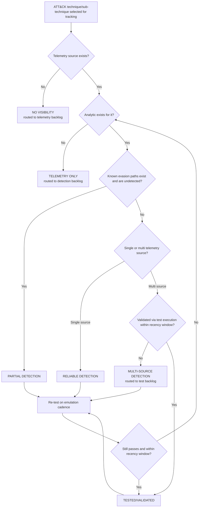

# Part XXXVI — Detection Coverage Matrix

## Why a coverage matrix exists

[CONCEPT] A detection coverage matrix is a structured inventory that maps adversary techniques to what your environment can actually see, what you've built to catch it, whether that build has been tested, and who owns it if it breaks. It answers a question that "we have Sigma rules for most of ATT&CK" cannot: for *this specific* technique, on *this specific* platform, right now, is there a human who would notice if an attacker did this tomorrow — and how do you know, rather than believe?

Most teams that claim broad ATT&CK coverage are measuring the wrong thing. They count rules, or they count techniques with at least one rule mapped in the SIEM's content library, and report a percentage to leadership. That number is almost always higher than the real coverage, for three compounding reasons:

1. A rule existing is not the same as a rule firing correctly. Half the rules in most inherited content libraries are disabled, permanently muted by an old suppression, or silently broken by a schema change six months ago.
2. A rule firing correctly on a narrow sub-technique is not the same as covering the technique. ATT&CK techniques are broad; most detections cover one implementation path (one tool, one command-line pattern, one registry key) out of a dozen viable ones.
3. Coverage that depends on telemetry you don't actually collect from the hosts that matter is not coverage. A detection that requires Sysmon Event ID 1 with command-line logging is worthless on the fleet segment where Sysmon isn't deployed, even if the rule logic is perfect.

A coverage matrix forces all three of these into the open, one row at a time, instead of letting them hide inside an aggregate percentage.

**Hunter's Note:** The matrix is more valuable for what it forces you to write in the "Known Gap" column than for what it puts in the "Coverage Level" column. A team that can articulate its gaps precisely is in a fundamentally different risk position than a team with the same actual coverage that can't — because the first team can prioritize, compensate with hunting, or accept the risk explicitly, and the second team finds out during an incident.

## What the matrix is not

It is not a replacement for a detection engineering backlog, a rule QA process, or a threat model. It's a cross-cutting index that references those things. Treat each row as a pointer into your actual detection content (the analytic lives in your SIEM/Sigma repo/detection-as-code pipeline — see Part XVI), your test harness (Part XXVII-adjacent material on hunt/test cadence), and your telemetry inventory (Part III). The matrix's job is to make gaps and staleness visible across the whole technique landscape at a glance, not to duplicate the analytic logic itself.

**Engineering Reality:** If you try to maintain analytic logic *inside* the matrix (embedding the full query text in a spreadsheet cell), the matrix and the deployed rule diverge within a quarter. Someone tunes the live rule to kill a false-positive source and forgets to update the copy in the tracking sheet. The matrix should link to the rule by ID/path and pull status (enabled/disabled, last-modified date) from the detection-as-code repo automatically if at all possible — a matrix that requires manual sync with production content is a matrix that lies within two review cycles.

## Matrix structure

### Column definitions

| Column | Purpose | Notes |
|---|---|---|
| **Technique** | ATT&CK technique ID and name | Top-level technique, e.g. T1055 Process Injection |
| **Sub-technique** | Specific sub-technique ID and name, or the implementation variant you're tracking | Sub-techniques matter more than parents — coverage of T1055.012 tells you nothing about T1055.001 |
| **Telemetry** | The specific log source(s)/event IDs/fields the detection depends on | Be exact: "EDR" is not an answer, "Sysmon EID 1 (ProcessCreate) + EID 8 (CreateRemoteThread)" is |
| **Detection** | Rule ID/name and a one-line description of the logic | Link to the actual analytic in the detection repo, not a copy of the logic |
| **Test** | Reference to the atomic test / adversary emulation case used to validate the rule fires | E.g. an Atomic Red Team test ID, a Caldera ability ID, or an internal test-case ID; "none" is a valid, honest answer |
| **Last Validation** | Date the detection was last confirmed to fire against a real test execution in the actual production pipeline | Not the date the rule was written — the date someone last proved it still works |
| **Coverage Level** | One of the six tiers defined below | The core judgment column |
| **Known Gap** | Plain-language description of what this detection *doesn't* catch within the technique/sub-technique | The most important column in the matrix — see above |
| **Owner** | Named person or team responsible for the rule's health | Individual name, not "the SOC" — a row with no accountable owner is a row nobody will fix when it breaks |

[DETECTION ENGINEER] The Telemetry column deserves more rigor than teams usually give it. Write it as a dependency, not a description — if the detection requires command-line logging enabled on process-creation events, and command-line logging is disabled by default on a chunk of your fleet (older Sysmon configs, EDR policies that strip command lines for performance, PowerShell logs where Module Logging is on but Script Block Logging isn't), the Telemetry column should say so, and the Coverage Level should reflect the segment where it's actually true — which sometimes means you need two rows for the same technique: one for the fleet segment with full telemetry, one for the segment without.

## Coverage levels defined

[CONCEPT] Coverage level is not a single binary "detected/not detected." It's a six-point scale that separates "we could theoretically see this" from "we would actually catch it" from "we have proven we would actually catch it." Collapsing these into fewer tiers is exactly what produces the inflated coverage percentages leadership gets shown.

| Level | Definition | What it implies operationally |
|---|---|---|
| **NO VISIBILITY** | No telemetry source exists that would record this behaviour at all | An attacker performing this technique leaves no trace in any log you collect. Not a detection gap — a data collection gap. |
| **TELEMETRY ONLY** | The relevant events are logged and retained, but no analytic/rule exists to alert on them | Findable only via manual hunting or after-the-fact forensic reconstruction. No alert will fire. |
| **PARTIAL DETECTION** | A rule exists and covers some implementation paths or tool variants of the (sub-)technique, but known variants exist that would evade it | Real attacker adaptation (a different LOLBin, a renamed binary, an obfuscation variant) has a good chance of slipping past |
| **RELIABLE DETECTION** | A rule exists, has reasonable coverage of common implementation paths, and has an acceptable false-positive rate in production, but relies on a single telemetry source | If that one log source is disabled, misconfigured, or the attacker specifically blinds it, detection fails completely |
| **MULTI-SOURCE DETECTION** | Two or more independent telemetry sources/analytics would catch this technique via different observable traces | Attacker has to evade multiple, unrelated detection surfaces simultaneously — meaningfully harder |
| **TESTED/VALIDATED** | Multi-source (or deliberately accepted single-source) detection that has been proven via an actual adversary emulation execution within a defined recency window (this org uses 90 days) | The only level with empirical proof behind it rather than engineering confidence |

**SOC Management View:** Report coverage as a distribution across these six tiers, never as a single "% covered" number. "68% of in-scope techniques are at PARTIAL DETECTION or better, 22% at RELIABLE or better, 9% TESTED/VALIDATED in the last quarter" tells a budget conversation something a single 91%-covered headline number actively hides. If someone above you insists on one number for a slide, report the percentage at RELIABLE DETECTION or higher, and say explicitly what that excludes.

A few things worth being blunt about with this scale:

- **NO VISIBILITY and TELEMETRY ONLY are both zero-alert states.** The difference matters for prioritization (TELEMETRY ONLY is a detection-engineering backlog item; NO VISIBILITY is a telemetry/instrumentation project, often with budget and agent-deployment implications), but from an "would we notice" standpoint they're the same: nobody gets paged.
- **PARTIAL DETECTION is the most dangerous level to over-trust**, because it produces alerts often enough that people believe the technique is covered, while the coverage gap is invisible until an attacker happens to use the specific variant that evades it.
- **TESTED/VALIDATED decays.** A rule tested six months ago against a specific Atomic Red Team test is not still validated today if the underlying tool changed its default behavior, the EDR vendor changed default telemetry, or someone tuned the rule for a false-positive source since then. This is why "Last Validation" is a date column, not a checkbox — a stale validation date should visually flag the row for re-test, not silently keep it marked TESTED/VALIDATED forever.

## Worked sample matrix

The matrix below is illustrative — it models a mid-size enterprise environment with Windows endpoints (Sysmon deployed but not universally with full command-line/DLL-load logging), a cloud identity provider, and partial EDR coverage. It deliberately does not claim uniform excellent coverage; a matrix where every row is TESTED/VALIDATED is either a very mature program or, more often, a matrix nobody has been honest filling out.

| Technique | Sub-technique | Telemetry | Detection | Test | Last Validation | Coverage Level | Known Gap | Owner |
|---|---|---|---|---|---|---|---|---|
| T1055 Process Injection | T1055.012 Process Hollowing | Sysmon EID 1 (ProcessCreate), EID 8 (CreateRemoteThread), EDR memory-scan alerts | `part36-01` — flags suspended-process-create followed by remote thread into a mismatched image | Atomic T1055.012 test (MITRE ART) | 2026-04-02 | PARTIAL DETECTION | Rule keys on image-path mismatch between PEB and on-disk mapping; a hollowing technique that patches the PEB to match evades it. No coverage on Linux. | D. Okafor (Endpoint Detection) |
| T1003 OS Credential Dumping | T1003.001 LSASS Memory | Sysmon EID 10 (ProcessAccess) targeting lsass.exe, EDR credential-access alerts, Windows Defender Credential Guard block events | `part36-02` — process access to lsass.exe from non-allowlisted signer with suspicious access mask | Atomic T1003.001, Mimikatz `sekurlsa::logonpasswords` in isolated lab VM | 2026-07-18 | MULTI-SOURCE DETECTION | Comsvcs.dll MiniDump variant via rundll32 partially evades the access-mask filter; separate lower-confidence rule exists for that path but is PARTIAL on its own | D. Okafor (Endpoint Detection) |
| T1078 Valid Accounts | T1078.004 Cloud Accounts | IdP sign-in logs (risky sign-in, impossible travel, new-device flags), cloud audit logs for privilege changes | `part36-03` — impossible-travel sign-in correlated with sensitive-role activity within 30 minutes | Manual credential-replay test from two geographies via VPN exit nodes | 2025-11-30 | RELIABLE DETECTION | Single source (IdP risk engine); if the IdP's own risk scoring misses the sign-in as "risky" (common with residential-proxy-based travel spoofing), no correlation ever triggers | M. Reyes (Identity & Access) |
| T1566 Phishing | T1566.001 Spearphishing Attachment | Email gateway attachment sandbox verdicts, EDR process-creation from Office child processes, Sysmon EID 1 | `part36-04` — Office application spawning a script host or LOLBin child process | Internal phishing simulation platform, quarterly campaign | 2026-06-05 | MULTI-SOURCE DETECTION | Coverage strong for macro-based and script-dropper payloads; weak for pure social-engineering attachments with no executable payload (e.g. credential-harvesting PDF links), which route through T1566's link-based path instead | J. Park (Email Security) |
| T1566 Phishing | T1566.002 Spearphishing Link | Email gateway URL rewrite/click logs, DNS query logs, proxy logs | none deployed for click-time detonation | none | never validated | TELEMETRY ONLY | Click logs exist and are retained but no analytic correlates a click with subsequent suspicious DNS/proxy activity; entirely hunt-driven today | J. Park (Email Security) |
| T1021 Remote Services | T1021.001 RDP | Windows Security EID 4624 (Logon Type 10), EID 4778/4779 (session reconnect/disconnect), firewall/NetFlow for 3389 | `part36-05` — RDP logon from source not in the jump-host allowlist, or lateral RDP between two non-admin-tier workstations | Atomic T1021.001 lateral movement test between two lab VMs | 2026-01-14 | RELIABLE DETECTION | Depends entirely on Windows Security event forwarding; hosts where the forwarding agent is delayed or down produce a silent blind spot with no compensating source | R. Whitfield (Network Detection) |
| T1021 Remote Services | T1021.006 Windows Remote Management (WinRM) | PowerShell Script Block Logging (EID 4104), WinRM operational log, Sysmon EID 1 for wsmprovhost.exe | none — WinRM usage is logged but nothing alerts on anomalous WinRM sessions | none | never validated | TELEMETRY ONLY | Legitimate admin tooling (Ansible, DSC, remote PS sessions) makes this noisy to baseline; deprioritized twice in backlog planning in favor of RDP coverage | R. Whitfield (Network Detection) |
| T1547 Boot or Logon Autostart Execution | T1547.001 Registry Run Keys | Sysmon EID 13 (RegistryEvent - value set) on Run/RunOnce keys, EDR persistence-mechanism alerts | `part36-06` — new value written to Run/RunOnce key by a process outside the software-deployment allowlist | Atomic T1547.001 test, plus a red-team persistence exercise (Q1 purple team) | 2026-03-22 | TESTED/VALIDATED | Startup-folder and scheduled-task persistence variants (T1547.001's siblings) are tracked as separate rows, not covered by this rule; WMI event subscription persistence has no equivalent row at all yet | D. Okafor (Endpoint Detection) |
| T1071 Application Layer Protocol | T1071.004 DNS (C2 over DNS) | DNS query logs (recursive resolver), NetFlow, TLS SNI logs | `part36-07` — high-entropy subdomain query volume per source host, threshold-based | Simulated DNS tunneling tool (dnscat2) in isolated lab segment | 2025-09-10 | PARTIAL DETECTION | Entropy/volume threshold tuned against dnscat2's default packet cadence; a slow-drip tunnel below the volume threshold, or a tunnel using dictionary-word subdomains instead of high-entropy strings, evades it. Never re-tested since initial tuning. | R. Whitfield (Network Detection) |
| T1490 Inhibit System Recovery | — (single technique, no sub-technique tracked) | Windows Security EID 524 (VSS deleted), Sysmon EID 1 for `vssadmin`/`wbadmin`/`bcdedit` command lines | `part36-08` — command-line match on shadow-copy-deletion or boot-recovery-disable utilities | Atomic T1490 test | never re-run since 2024 | PARTIAL DETECTION | Command-line-based detection is evaded entirely by PowerShell's `Win32_ShadowCopy` WMI class or direct WMI/COM calls that never touch the flagged binaries or command-line strings; validation predates a major internal command-line-logging config change and has not been re-run against current config | D. Okafor (Endpoint Detection) |

**Detection Autopsy: the T1490 row above, examined honestly.** The original detection (`part36-08`) was built by pattern-matching known ransomware playbooks that shell out to `vssadmin delete shadows /all /quiet` or `wbadmin delete catalog`. It looked reasonable because every major public ransomware incident write-up from 2019–2022 cited exactly these command lines. What breaks in production: modern ransomware tooling and even legitimate backup-cleanup scripts increasingly perform the same action through the `Win32_ShadowCopy` WMI class or via direct COM automation, which never generates the flagged process/command-line pair — Sysmon EID 1 shows `powershell.exe` or `wmic.exe` with an unremarkable command line, and the actual deletion call happens inside the WMI provider host, several process hops removed from anything the rule inspects. False negatives: any WMI-based or COM-based shadow-copy deletion, including some legitimate infrastructure-management tooling that happens to use the same API, which occasionally means the rule's false-negative space overlaps with a benign automation path that has nothing to do with ransomware. Missing context: no correlation with mass file-modification or encryption-pattern telemetry that would flag the same incident through an independent path. Revised analytic direction (not yet built, tracked as backlog item against this row): add Sysmon EID 19/20/21 (WMI event filter/consumer) coverage for `Win32_ShadowCopy` delete calls, and pair the command-line rule with a mass-file-rename/entropy-change detection so the technique has a second, independent detection surface — which would move this row from PARTIAL DETECTION toward MULTI-SOURCE DETECTION once both exist and are tested. Until that work lands, the honest status is what the table says: PARTIAL, last tested against a config that no longer matches production, owned, and gapped in writing rather than assumed fixed.

## Building and maintaining the matrix

[ENGINEERING] The matrix should be generated, not hand-typed, once you have more than a few dozen rows. A practical pipeline: detection-as-code repo metadata (technique/sub-technique tags, telemetry dependencies declared per rule, enabled/disabled state, last-modified date) feeds one half of each row automatically; a test-execution tracker (whatever runs your Atomic Red Team / Caldera / purple-team calendar) feeds the Test and Last Validation columns; Coverage Level is then a derived field computed from the flowchart logic above, not a manually chosen tier — which removes the single biggest source of matrix rot, which is a human forgetting to downgrade a row after a rule got disabled or a telemetry source dropped.

**Engineering Reality:** The moment Coverage Level becomes a manually-set dropdown instead of a computed value, it becomes aspirational within two quarters. Someone sets a row to MULTI-SOURCE DETECTION because it was true when they filled in the sheet, the second telemetry source's collector gets decommissioned during an infrastructure migration eight weeks later, and nobody updates the sheet because updating the sheet isn't anyone's job. Wire the derivation to the actual telemetry health-check and rule-enablement state if you want the matrix to still be true in six months.

## Testing methodology, briefly

[DETECTION ENGINEER] "Test" and "Last Validation" only mean something if the test execution happened against the actual production detection pipeline, not against the rule logic read off a page. A defensible validation:

1. Execute the technique in a lab segment that forwards telemetry through the same collection path as production (same Sysmon config, same forwarder, same SIEM ingestion pipeline) — not a hand-crafted synthetic event injected directly into the SIEM, which proves the query syntax works but proves nothing about whether the telemetry would actually arrive that way.
2. Confirm the alert fired, in the alert queue, attributed to the correct rule ID, within an expected latency window.
3. Record the exact test case reference (Atomic Red Team test GUID, Caldera ability ID, or internal case ID) so the next person can re-run precisely the same thing, not "something similar."
4. Record the date. Set a re-test reminder tied to your organization's recency window — 90 days is a reasonable default for anything TESTED/VALIDATED, shorter for techniques under active adversary evolution (ransomware defense-evasion techniques age out faster than, say, a stable persistence mechanism).

[THREAT HUNTER] Every PARTIAL DETECTION and TELEMETRY ONLY row is a hunting lead, not just an engineering backlog item. If a rule is known to miss the WMI-based variant of shadow-copy deletion, that's a standing hunt hypothesis: periodically query for `Win32_ShadowCopy` COM/WMI activity outside of known backup-software process trees, independent of whether the detection engineering work to formalize it as a rule has been scheduled yet. The matrix's Known Gap column should be treated as a live hunt backlog, reviewed on the same cadence as the hunt program's hypothesis list (see Part XXVII), not filed away as a future engineering task and forgotten until the next audit.

> **[SCREENSHOT PLACEHOLDER — CONTROLLED LAB]** — a SIEM alert-queue view showing the `part36-05` RDP lateral-movement rule firing against an Atomic Red Team T1021.001 test execution in an isolated lab segment, illustrating the EID 4624 Logon Type 10 field and the source/destination host pair that the rule keys on. Would be captured from a Windows Security event log via the lab's domain-joined test VMs, not from any production or home-lab host.

## Common failure modes when adopting this matrix

- **Scope creep to "all of ATT&CK."** Not every technique is relevant to every environment. A matrix that tracks mobile-platform techniques for a shop with no managed mobile fleet, or ICS techniques with no OT footprint, wastes maintenance effort on rows that will always read NO VISIBILITY for reasons that have nothing to do with detection maturity. Scope the tracked technique list to your actual attack surface first (Part II's discussion of translating attacks into data sources is the right starting point for that scoping exercise), and revisit scope when the environment changes.
- **Treating the matrix as a one-time project.** A matrix built once during an audit and not touched again is worse than no matrix, because it gives false confidence that persists past its accuracy. It needs an owner, a review cadence, and ideally the automated derivation described above.
- **Optimizing for row count over row honesty.** A team under pressure to show progress will be tempted to mark ambiguous rows optimistically. The organizational incentive should reward accurately-documented gaps at least as much as high coverage tiers — a security leadership team that only ever hears good news about coverage is being set up to be surprised by an incident.

## Summary

The coverage matrix's value is almost entirely in its discipline, not its content — the six-tier scale forces a distinction between "we could see it," "we'd alert on it," "we'd alert on it reliably," and "we've proven we'd alert on it," which a simpler covered/not-covered view collapses and hides. Build it to be generated from real system state wherever you can, keep the Known Gap column honest and hunt-actionable, and report distributions across tiers rather than a single aggregate percentage to anyone making resourcing decisions based on it.
