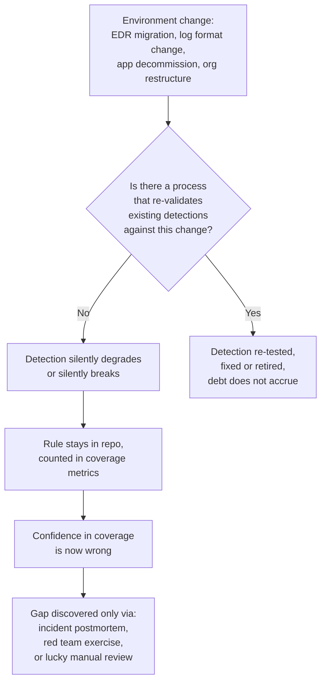
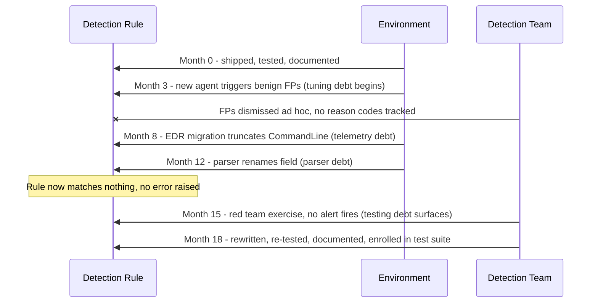

# Part XXXVII — Detection Debt

Every other part of this book assumes the detections you build stay roughly as good as the day you
shipped them. They don't. Environments change, EDR agents get replaced, log formats get "improved"
by a vendor without a changelog anyone reads, analysts who understood why a rule was written leave
the team, and the rule keeps firing (or silently stops firing) long after the assumptions it was
built on have rotted away. This part names that rot, breaks it into the specific flavors that
actually show up in a detection program, and gives you a way to talk about it with management in
terms other than "we should really clean this up sometime."

## 1. What detection debt is, and why it's not just "technical debt with a new name"

[CONCEPT] Detection debt is the accumulated gap between what your detection stack *appears* to
cover (what's in the rule repo, the SIEM, the coverage spreadsheet) and what it *actually* covers
correctly, reliably, and at acceptable noise, given the current state of your telemetry, your
tooling, and your adversary's current behavior. It's debt in the classic sense — a shortcut or an
unaddressed change today becomes a larger cost later, with interest — but it has a property that
most software technical debt doesn't: **it is invisible until something forces you to look, and by
default nothing forces you to look.**

A stale API integration or an untested code path in normal software debt tends to announce itself:
the build fails, the endpoint 500s, a customer files a ticket. A detection that quietly stopped
working announces nothing. It sits in the rule count on a dashboard, contributes to a "MITRE
coverage: 82%" slide, and produces zero alerts — which looks identical, from the outside, to "the
attack technique isn't happening in our environment." The absence of an alert is not evidence of
absence of the behavior. That asymmetry is the core reason detection debt compounds differently
from most other technical debt: **broken code usually fails loud; broken detection fails silent.**

[MANAGEMENT] This is the framing that matters for leadership conversations. A backlog of 40 rules
that "need review" is not a maintenance nuisance, it's an unknown fraction of your claimed coverage
that may currently be fiction. Nobody can tell you which fraction without doing the review. That's
the pitch for budgeting detection-debt paydown as its own recurring line item, not something that
happens "when there's time" — there is never time, because nothing forces the work to surface.



**Hunter's Note:** if you want a fast, humbling gut-check on how much detection debt a program has,
pick five "critical" rules at random from the repo and ask when each one last fired on real
(non-test) data, and whether anyone has manually confirmed the field names it depends on still
exist in current telemetry. Most programs that haven't done this before find at least one rule
that has been silently dead for months.

## 2. Telemetry debt

[CONCEPT] Telemetry debt is the gap between the log sources and fields your detections *assume*
exist, at the volume and fidelity assumed, and what's actually flowing into your pipeline today.

[ENGINEERING] This accrues in a handful of predictable ways:

- **Agent/EDR migrations.** A rule written against Sysmon Event ID 1 (`ProcessCreate`) with a
  specific field name gets ported to a new EDR platform's process-creation schema during a vendor
  migration. The field exists under a different name, or with different casing, or with a
  different hash algorithm default (SHA1 vs SHA256), or the new agent doesn't populate the
  `OriginalFileName` equivalent at all in its default policy tier. Nobody re-tests every rule
  against the new schema because there are 400 rules and one migration project deadline.
- **Log source decommissioning that nobody told the detection team about.** An on-prem proxy gets
  replaced by a cloud secure-web-gateway with a different log export format and a different (often
  smaller) default retention. Rules built on the old proxy logs go quiet. The team that
  decommissioned the proxy had no reason to know detection engineering depended on it.
- **Sampling and rate-limiting introduced upstream.** A collector gets overloaded, someone enables
  sampling or drops a noisy source at the forwarder to save licensing cost, and detections that
  depended on seeing *every* event (not a sample) now have blind spots that are proportional to
  load — meaning they're most likely to miss events during exactly the high-volume periods (mass
  logon, mass process spawn during an incident) when you need them most.
- **Cloud API/log format versioning.** Cloud provider audit logs change field names or nesting
  between API versions on their own schedule; a query written against the old shape returns zero
  rows against the new shape, with no error, because "zero matching events" is a valid, silent
  result for most query languages.

[ANALYST] The practical symptom you'll see first is usually a *dashboard* discrepancy, not a rule
failure: total event volume from a source drops, but because nobody has a volume-anomaly detector
watching the pipeline itself (see Section 3's overlap with tuning debt), it's attributed to "quiet
week" until an unrelated investigation needs that log source and it isn't there.

**Engineering Reality:** the single highest-leverage fix for telemetry debt is not better rules —
it's a small set of meta-detections that watch the pipeline's own health: per-source event-count
baselines with alerting on sustained drops, schema-drift checks that diff field names/types against
a stored reference on a schedule, and a source-to-rule dependency map so that when a source owner
says "we're migrating X," someone can answer "here are the 23 rules that break if you change that
field" instead of finding out from a missed detection six months later.

## 3. Parser debt

[CONCEPT] Parser debt is telemetry debt's quieter sibling: the raw log data is arriving fine, but
the parsing/normalization layer that turns it into structured fields your detection logic queries
against has drifted from the source format, so fields are null, mis-typed, or mapped to the wrong
value — while the pipeline reports healthy ingest volume the whole time.

[ENGINEERING] The canonical example, and it happens constantly: a vendor ships an agent or product
update that reorders fields in a CSV-style log line, renames a JSON key (`src_ip` becomes
`source.ip` to align with a new schema convention like ECS), or changes a timestamp format from
epoch seconds to epoch milliseconds. If the parser is regex-based and positional, it silently
extracts the wrong field into the right slot — worse than a null, because a null at least *might*
get noticed by a "field completeness" check, while a wrong-but-populated value doesn't. A detection
matching on `dest_port = 445` keeps compiling and running; it just stops matching anything because
the port field is now silently populated with what used to be the protocol field.

**CONCEPTUAL SAMPLE** (not a captured log) — illustration of the failure mode with a before/after
vendor log line:

```
# Before vendor update — parser regex assumes this field order
2026-01-10T02:14:33Z src=10.1.2.4 dst=192.168.5.10 dport=445 proto=tcp action=allow

# After vendor update — vendor reordered fields, parser was never updated
2026-08-02T02:14:33Z src=10.1.2.4 proto=tcp dst=192.168.5.10 dport=445 action=allow
```

A positional parser built for the first format will map `proto` into where `dst` used to be and
`dst` into where `proto` used to be, for every event, silently, from the moment the vendor pushed
the update. This is the "parser silently changed field names 8 months ago" scenario by name: the
break happened on a Tuesday in a maintenance window nobody flagged to detection engineering, and it
was found eight months later during an incident when an analyst went to pivot on `dst` and got
garbage.

[DETECTION ENGINEER] Defenses that actually work here: prefer field-name-based parsing (JSON/KV) to
positional/regex parsing wherever the source supports it; add parser unit tests that run against a
small fixed corpus of sample lines and fail the build if extraction breaks, so a schema change is
caught at CI time rather than in production; and instrument extraction-rate metrics per field (what
percentage of events in the last hour populated `dest_port` with a plausible value) so a drop to
zero, or a shift in the value distribution, raises its own alert.

**SOC Management View:** parser debt is disproportionately expensive to discover because it's
invisible in every "is the pipeline healthy" metric teams normally track (uptime, ingest volume,
license usage) and only visible in "is the *content* still correct," which almost nobody
instruments. Budget for field-level extraction monitoring, not just source-level ingest monitoring,
or accept that you will find parser breaks via failed investigations rather than via monitoring.

## 4. Documentation debt

[CONCEPT] Documentation debt is the gap between what a detection's author knew when they wrote it —
the assumption, the exact threat behavior it targets, the known false-positive sources, the
telemetry dependency, the tuning history — and what's actually recorded anywhere a second person can
find it.

[ANALYST] This debt is invisible until the rule fires and the on-call analyst has no idea whether
the alert matters. Without documentation, every alert investigation starts from zero: what is this
even trying to catch, is this a known-noisy rule that's been meaning to get tuned for months, is the
threshold arbitrary or calibrated against something. The cost isn't abstract — it's minutes-to-hours
per alert, multiplied by alert volume, multiplied by analyst headcount, forever, until someone
documents it once.

[MANAGEMENT] Documentation debt compounds specifically through **staff turnover**. A rule with
undocumented rationale is fine as long as its author is still on the team and reachable. The day
that person leaves, the rule's institutional knowledge leaves with them, and the rule becomes a
black box that the team is afraid to touch (because nobody knows what breaks if it's removed) and
unable to improve (because nobody knows what it's currently missing). Programs with high analyst
turnover and low documentation discipline accumulate a growing set of "don't touch it, nobody
remembers why it's there" rules — pure liability with no way to retire it safely.

[DETECTION ENGINEER] Minimum viable documentation per detection, without which it should not ship:
the specific behavior/technique it targets (MITRE ATT&CK technique ID as a pointer, not a
substitute for a written description), the exact telemetry field dependencies, at least one known
benign-activity pattern that looks similar, the logic for the current threshold/condition (why this
value and not another), and a changelog of tuning decisions with dates and reasons. Sigma's metadata
fields (`description`, `falsepositives`, `level`, `references`) exist for exactly this reason —
treat them as required fields, not optional flavor text, and reject rules in review that leave them
templated/blank.

## 5. Testing debt

[CONCEPT] Testing debt is the absence of a repeatable way to prove a detection still does what it
claims, so the only evidence anyone has that it works is that it worked once, on the day it was
written, against a fixed test case that may or may not still resemble either the current adversary
technique or the current telemetry.

[DETECTION ENGINEER] Detections rot even if nothing about them changes, because two things around
them keep moving: the telemetry schema (Section 2/3) and the adversary's tradecraft (an EDR bypass
or LOLBin substitution that produces subtly different telemetry for "the same" technique). A rule
tested once at ship time and never again has no defense against either kind of drift. The specific
failure named in this part's brief — a detection never re-tested after an EDR migration — is testing
debt intersecting with telemetry debt: the rule's *logic* never changed, but the *ground truth of
whether it still fires on the intended behavior* was never re-verified against the new agent's
output, so the team is trusting a test result that's stale by however long it's been since the
migration.

[THREAT HUNTER] The honest fix is continuous detection testing: atomic, repeatable adversary
emulation (purple-team style — a specific technique executed the same way on a schedule, e.g.
monthly, or triggered by any change to the relevant EDR/log pipeline) with automated verification
that the expected alert fired, on the expected fields, within an expected time window. Tools like
Atomic Red Team map directly to this: each atomic test is a small, scoped, MITRE-technique-mapped
action you can re-run after any environment change and check against detection output.

**Detection Autopsy: the LOLBin download-and-execute rule that survived the EDR migration on paper**

*Original logic:* Sigma-style rule alerting on `rundll32.exe` spawning with a command line
containing `url.dll,OpenURL` or similar known LOLBAS download-and-execute patterns, matched against
Sysmon Event ID 1 `CommandLine` and `ParentImage`.

*Why it looked reasonable:* This is a well-documented, MITRE ATT&CK T1218.011 (Signed Binary Proxy
Execution: Rundll32)-adjacent technique with a narrow, specific command-line signature; low expected
false-positive rate; validated once against a real Sysmon feed at ship time and it worked.

*What broke in production:* Eighteen months later the endpoint fleet migrated from Sysmon-fed SIEM
ingestion to a commercial EDR's native telemetry. The EDR's process-creation event populates a field
called `CommandLine` too, but with different quoting/escaping behavior for embedded arguments, and
the rule's string match was written tightly enough (an exact substring match assuming Sysmon's
quoting) that it no longer matched the EDR's representation of the same real command line. Nobody
re-ran a test execution after the migration because the rule "already worked" and testing debt meant
there was no scheduled re-verification trigger tied to platform changes.

*False positives / false negatives:* Zero false positives — the rule simply never fired again,
which read as "clean" rather than "broken." That's the dangerous failure mode: a false negative that
looks identical to a rule doing its job well.

*Missing context:* No per-rule "last verified against current telemetry" timestamp existed anywhere,
and the EDR migration project plan had no line item for "notify detection engineering, they have
rules dependent on process-creation field formatting."

*Revised analytic:* rebuilt the match logic against a normalized/parsed command-line token set
instead of a raw substring, re-tested with an Atomic Red Team execution of the specific technique
against the new EDR telemetry, and added the rule to an EDR-migration test suite so any future agent
change re-runs this and every other command-line-dependent rule automatically.

*How it was tested:* scheduled atomic execution (`rundll32.exe` invoking the documented proxy
technique) run in a lab endpoint enrolled in the same EDR policy as production, verified the alert
fired with correct field population, then repeated against a second lab endpoint on the *previous*
agent version to confirm the fix didn't only work on the new format by accident.

*Result:* rule restored to functioning state; the process gap (no migration-triggered
re-verification) was the real fix, not just the one rule.

## 6. Tuning debt

[CONCEPT] Tuning debt is the backlog of known false-positive sources, known noise patterns, and
known threshold miscalibrations that have been identified — an analyst flagged them, a triage note
exists — but never actually fed back into the detection logic.

[ANALYST] This is the debt analysts feel most directly and most often, because it shows up as
repeat, low-value alert triage: the same benign admin tool, the same backup job, the same
vulnerability scanner, generating the same alert every night, every week, that everyone on the team
already knows to dismiss but nobody has time to formally exclude. Every dismissal without a
corresponding rule update is tuning debt accruing interest — the same triage minutes get spent
again next week, and the next, indefinitely.

[MANAGEMENT] Tuning debt is the most direct driver of alert fatigue and, downstream of that, missed
true positives — an analyst desensitized to a noisy rule triages it faster and with less scrutiny
over time, which is exactly the condition under which a genuine malicious use of that same pattern
gets waved through. Tuning debt should be tracked with the same seriousness as an open
vulnerability: age since first flagged, number of repeat false positives it has generated, and
estimated analyst-hours burned, so it can be prioritized against other engineering work instead of
losing every time to "ship the next new detection" pressure.

[DETECTION ENGINEER] The mechanical fix is a closed-loop tuning process: every dismissed alert
carries a reason code (known-benign source, known scheduled task, genuinely low-confidence logic,
etc.), reason codes are reviewed on a cadence (weekly/biweekly), and any reason code that recurs past
an agreed threshold (e.g., 3 occurrences from the same benign source) generates a tracked engineering
ticket to update the rule — an exclusion, a compound condition, a threshold change — rather than
staying as tribal "yeah just ignore that one" knowledge.

## 7. A worked example: mapping all five debts onto one rule's lifecycle

To make the interaction concrete, walk one detection through eighteen months and watch each debt
type attach to it.

**The rule (illustrative Sigma, T1059.001 — PowerShell, encoded-command execution):**

```yaml
title: Suspicious Base64-Encoded PowerShell Command
id: part37-01
status: experimental
description: >
  Detects PowerShell invoked with -EncodedCommand or -enc, a common technique
  for obfuscating malicious script content, staged loaders, and download-and-execute chains.
references:
  - MITRE ATT&CK T1059.001
  - MITRE ATT&CK T1027 (Obfuscated Files or Information)
author: Detection Engineering Team
date: 2025-02-10
modified: 2025-02-10
tags:
  - attack.execution
  - attack.t1059.001
  - attack.defense-evasion
  - attack.t1027
logsource:
  category: process_creation
  product: windows
detection:
  selection:
    Image|endswith: '\powershell.exe'
    CommandLine|contains:
      - '-EncodedCommand'
      - '-enc '
      - '-e '
  condition: selection
falsepositives:
  - Legitimate admin scripts and configuration management tools (e.g., DSC, some
    endpoint agents) that pass encoded commands as part of normal operation.
level: medium
```

**Month 0:** ships with reasonable documentation (falsepositives field filled in, technique
mapped), tested once against a lab execution.

**Month 3:** telemetry debt begins — a management-agent vendor update starts using `-EncodedCommand`
as part of its own legitimate remote-config push, at moderate volume. Nobody adjusts the rule; it
starts generating a steady trickle of false positives, each one dismissed individually. This is
tuning debt starting to accrue, invisibly, because dismissals aren't tracked with a reason code yet.

**Month 8:** the fleet migrates from Sysmon to an EDR agent. The EDR's process-creation telemetry
truncates long command lines at a smaller default character limit than Sysmon did. Base64-encoded
PowerShell payloads are long; a meaningful fraction of real malicious invocations now get truncated
before the `-EncodedCommand` flag or the payload appears in the field the rule inspects, depending on
argument order. This is telemetry debt: an assumption ("the flag and enough of the command line will
be present") silently invalidated by a platform change nobody re-tested against.

**Month 12:** the SIEM's parser for the EDR source is updated by the platform team to align field
names with a new internal schema standard; `CommandLine` becomes `process.command_line` in the
normalized index, but the rule (hand-maintained outside the detection-as-code pipeline for this one
legacy source) still queries the old field name. This is parser debt layered on top — the rule now
silently matches nothing, not because the behavior changed, but because the field it reads from no
longer exists under that name.

**Month 15:** an internal red team exercise executes an encoded-PowerShell-based initial-access
chain as part of an assumed-breach test. No alert fires. The postmortem is the first time in ten
months anyone has looked at this rule's actual behavior end to end. This is testing debt cashing
out — the gap between "last verified" (month 0) and "actually needed to work" (month 15) was long
enough for two independent breaking changes to accumulate silently, and only an external forcing
function (the red team exercise) surfaced it.

**Month 18 (remediation):** rule rewritten with the current field name, a length-tolerant match that
doesn't depend on the full payload surviving truncation, a documented false-positive exclusion for
the known management-agent vendor pattern (closing the tuning-debt loop from month 3), a changelog
entry explaining each change and why (closing documentation debt), and enrollment in the
Atomic-Red-Team-based test suite so any future EDR/parser change re-runs an actual encoded-PowerShell
execution and checks the alert fires (closing testing debt going forward).



## 8. Why detection debt compounds faster than most technical debt

Three properties combine to make this worse than a typical stale codebase:

1. **Silent failure is the default, not the exception.** A broken API returns an error; a broken
   detection returns nothing, and nothing looks exactly like "no attacks happened."
2. **The debts interact and mask each other.** Telemetry debt (field missing) and parser debt (field
   renamed) both present identically from the rule's point of view — zero matches — and both look
   identical to "the rule is simply well-tuned and the technique isn't occurring." Documentation
   debt then prevents anyone from quickly diagnosing which of the three it actually is.
3. **The forcing functions are expensive.** Software bugs usually get caught by users, tests, or
   monitoring relatively cheaply. Detection gaps usually get caught by an incident, a red team
   exercise, or an auditor — all of which are far more expensive discovery mechanisms than a unit
   test, and all of which happen on a schedule you don't control.

**SOC Management View — a coverage metric that accounts for debt:** a "number of rules" or
"MITRE technique coverage percentage" metric with no debt adjustment is close to meaningless for
risk conversations. A more honest metric tracks, per rule: days since last successful test-fire
against current telemetry, days since documentation was last reviewed, and count of unresolved
tuning items. Roll those into a "coverage confidence" score distinct from raw coverage count, and
report both. It's a harder number to make look good in a slide, which is exactly why it's more
useful.

## 9. Paying it down: a minimum program

- **Telemetry:** per-source volume and schema-drift monitoring; a source-to-rule dependency
  inventory; a standing requirement that any EDR/log-source/collector change triggers a review of
  dependent rules before, not after, cutover.
- **Parser:** prefer structured (JSON/KV/ECS-aligned) parsing over positional/regex where possible;
  parser unit tests against a fixed sample corpus in CI; per-field extraction-rate monitoring.
- **Documentation:** required metadata fields enforced at rule-review time (technique mapping,
  false-positive notes, telemetry dependencies, tuning changelog); no rule merges without them.
- **Testing:** scheduled atomic/purple-team re-verification per rule (risk-weighted — critical rules
  more often), and mandatory re-verification triggered by any EDR, SIEM parser, or major log-source
  change.
- **Tuning:** reason-coded dismissals, a review cadence, and an automatic ticket threshold so
  recurring false positives become tracked engineering work instead of tribal knowledge.

None of these are novel individually — every one of them is standard software-engineering practice
(monitoring, CI tests, code review requirements, scheduled regression tests, triage-to-ticket
pipelines) applied to detections instead of application code. The reason detection programs
under-invest in them is that a detection rule doesn't look like code to most of the organization
funding the work — it looks like a config setting, something you write once and it just runs. Debt
accrues fastest exactly where the work is treated as configuration rather than as a living system
that needs the same maintenance discipline as anything else in production.

> **[SCREENSHOT PLACEHOLDER — CONTROLLED LAB]** — a rule-repo dependency/health dashboard showing,
  per detection, last-test-fire date, documentation completeness, and open tuning items; would be
  captured from a real detection-as-code CI pipeline (e.g., a Sigma rule repo with a test-runner
  stage) rather than fabricated, illustrating the "coverage confidence" fields described in Section
  8.

> **[SCREENSHOT PLACEHOLDER — CONTROLLED LAB]** — Sysmon process-creation log (Event ID 1) captured
  before and after a controlled EDR-agent swap on the same lab host, executing the identical Atomic
  Red Team PowerShell-encoded-command test, showing the `CommandLine` field truncation/format
  difference described in Section 7's worked example.

## 10. Summary table

| Debt type | Accrues when... | First visible symptom | Primary owner |
|---|---|---|---|
| Telemetry debt | Log source, agent, or collector changes without re-validation | Volume drop or field-count drop on a source dashboard | Detection engineering + platform/infra |
| Parser debt | Vendor/log format changes without parser update | Fields null/mis-populated while ingest volume looks normal | Detection engineering + SIEM/pipeline team |
| Documentation debt | Rule ships without rationale/FP notes/dependency notes | New analyst can't triage an alert without asking the original author | Rule author, enforced at review |
| Testing debt | No scheduled re-verification tied to environment changes | Red team/incident finds a rule that should have fired and didn't | Detection engineering |
| Tuning debt | Known FP sources get dismissed but not fed back into logic | Same alert dismissed repeatedly by different analysts, no ticket exists | SOC + detection engineering, closed-loop |

Detection debt is the sum of all five, and it is worse than the sum of its parts because they mask
each other and none of them alarm on their own. The only durable fix is treating detections as
software with a maintenance lifecycle — tested, monitored, documented, and revisited on a schedule —
rather than as artifacts that are "done" once they ship.
