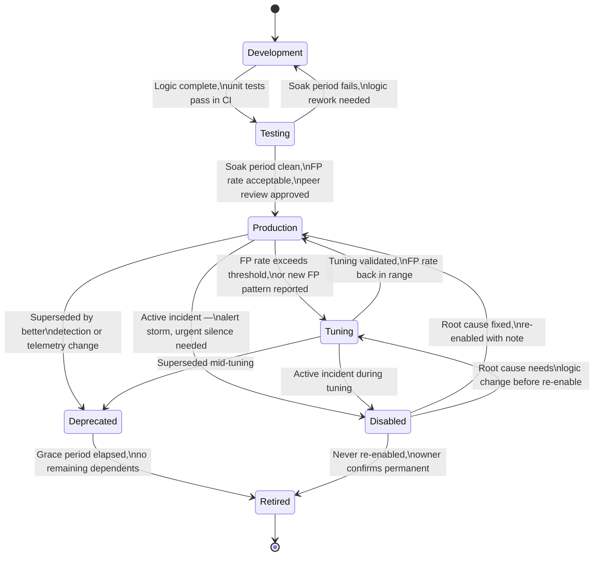
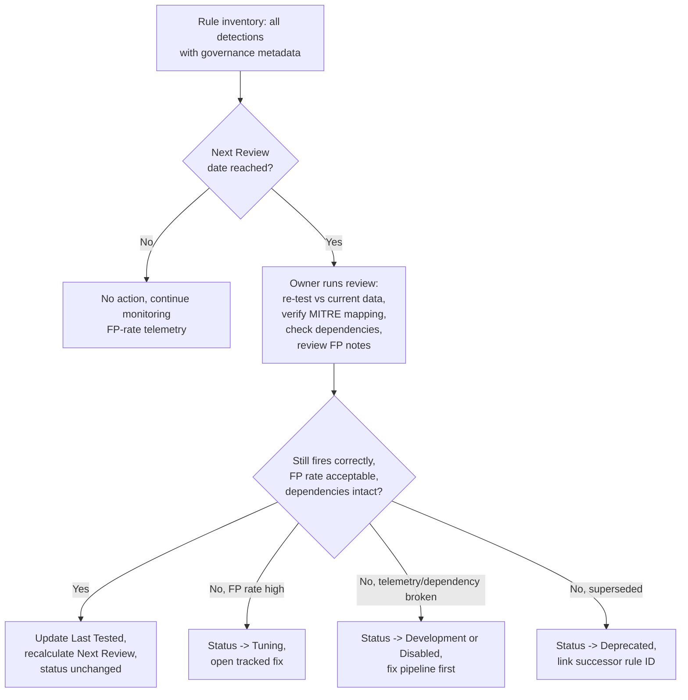

# Part XXXVIII — Detection Governance

## Why "the rule works" is not the same question as "the rule is governed"

[CONCEPT] A detection can be logically correct, well-tested, and still be a liability if nobody can answer basic questions about it six months after it was written: who owns this, when was it last checked against live data, what does it depend on, and is it even still turned on. Detection governance is the discipline of attaching enough structured metadata and lifecycle state to every rule that those questions have a definite, queryable answer at any point in time — not "ask around and hope someone remembers."

This is not paperwork for its own sake. A detection repository with a few hundred rules and no governance metadata degrades in a specific, predictable way: rules silently break when a source schema changes and nobody notices because there's no "last tested" field to flag staleness; rules get disabled during an incident to kill a false-positive storm and never get re-enabled because there's no owner to chase; two people build near-duplicate detections for the same technique because there's no MITRE-mapped inventory to check first; and when a regulator, auditor, or new CISO asks "what detects credential dumping in this environment and when did you last confirm it fires," the honest answer is a scramble through Slack history instead of a five-second query against structured fields.

**Engineering Reality:** almost every detection program that reaches this state didn't skip governance on purpose. It skipped it because metadata fields feel like overhead when you have twelve rules, and by the time you have four hundred rules the technical debt is load-bearing — ripping it out to retrofit means auditing every rule by hand, which is exactly the work governance was supposed to prevent.

[MANAGEMENT] Governance metadata is also the only honest basis for a coverage claim. "We have 340 detections" means nothing if forty of them are silently disabled, sixty haven't been tested since a SIEM migration eighteen months ago, and nobody can map a third of them to a MITRE technique. "We have 340 detections, of which 210 are in Production status with a Last Tested date inside the last quarter, mapped across N ATT&CK techniques" is a claim that survives an audit.

## The metadata schema: what every rule must carry

[DETECTION ENGINEER] The fields below are the minimum viable governance record. Some SIEM platforms (Sentinel analytics rules, Elastic detection rules) have native fields that cover part of this; where they don't, the fields live in the detection-as-code YAML/JSON front-matter (see Part XVI) and get pulled into whatever inventory/dashboard tooling the team uses.

| Field | Purpose | Example value | Who sets/updates it |
|---|---|---|---|
| **ID** | Stable unique identifier, never reused even after retirement | `part38-01` / `DE-WIN-1042` | Set once at creation |
| **Owner** | Single named individual (or on rotating teams, a named role) accountable for the rule's health | `j.alvarez` or `detection-eng-oncall` | Assigned at creation, transferred explicitly |
| **Reviewer** | Person who approved the current version via peer review (Part XVI PR workflow) | `m.chen` | Set on each merged PR |
| **Version** | Monotonic version number or semantic version tied to the repo's tag/commit history | `1.4.0` | Bumped on every logic change |
| **Created** | Date the rule was first merged to production-tracking branch | `2025-03-11` | Set once |
| **Last Changed** | Date of the most recent logic or threshold change (not metadata-only edits) | `2026-06-02` | Every substantive change |
| **Last Tested** | Date the detection logic was last validated against sample/live data and confirmed to still fire correctly | `2026-08-19` | Every test cycle, scheduled or ad hoc |
| **Next Review** | Date by which a review is due regardless of whether anything broke | `2026-11-19` | Recalculated on every review |
| **Status** | Lifecycle state — see below | `Production` | Changes trigger workflow, see transitions |
| **Dependencies** | Upstream data sources, lookup tables, shared library macros, or other detections this rule relies on | `sysmon-eid1-processcreate`, `lib/known-admin-tools.csv` | Updated when dependency graph changes |
| **Telemetry** | Exact log source(s)/table(s)/index(es) and required fields | `WinEventLog:Security (4688)`, `DeviceProcessEvents` | Set at creation, revisited on schema change |
| **Severity** | Realistic blast-radius-based severity, not technique scariness | `High` | Reviewed each cycle |
| **MITRE mapping** | Technique and sub-technique ID(s) that match what the query *actually* detects | `T1003.001` (LSASS Memory) | Verified at each review, not just copied at creation |
| **False-positive notes** | Known benign patterns that trigger it, and any tuning applied to suppress them | "Fires on CrowdStrike Falcon's own memory-scan process; excluded by hash" | Updated whenever a new FP source is found |
| **Test evidence** | Pointer to the fixture(s)/run log proving the rule currently fires on true positives and stays silent on the documented benign patterns | `tests/unit/part38-01_test.py::test_lsass_dump_fires` + last CI run link | Updated on every test run |

[ANALYST] From the console side, an analyst triaging an alert should be able to pull this record in one click or one query and immediately know: is this rule mature and trusted (Production, tested last month, few FP notes) or is it something still being shaken out (Tuning, tested two weeks ago, three known FP patterns listed) — because that changes how much benefit of the doubt the alert gets during triage.

**Hunter's Note:** the field that gets skipped most often in practice is "false-positive notes," because writing it down feels like admitting the rule isn't perfect. That's backwards — an FP note is a record of hard-won knowledge. Every time that note is missing, the next analyst on shift rediscovers the same false positive from zero, and the rule looks less trustworthy than it actually is.

### Illustrative metadata block (Sigma-style, front-matter)

```yaml
# CONCEPTUAL SAMPLE — illustrative front-matter, not a runnable rule body
id: part38-01
title: LSASS Memory Access by Non-EDR Process
status: production            # governance status, see lifecycle section
owner: j.alvarez
reviewer: m.chen
version: 1.4.0
date: 2025-03-11               # created
modified: 2026-06-02           # last changed
last_tested: 2026-08-19
next_review: 2026-11-19
dependencies:
  - sysmon-eid10-processaccess
  - lib/known-edr-processes.csv
telemetry:
  - source: Sysmon Event ID 10 (ProcessAccess)
    required_fields: [TargetImage, SourceImage, GrantedAccess, SourceProcessGUID]
severity: high
mitre:
  - technique: T1003.001
    tactic: credential-access
false_positive_notes: >
  Excludes GrantedAccess values below 0x1000 (read-only queries by monitoring
  agents). Known FP: CrowdStrike Falcon sensor self-scan (excluded by SourceImage
  hash, see lib/known-edr-processes.csv). Known FP: Windows Error Reporting
  (WerFault.exe) accessing crashed lsass.exe — excluded by SourceImage path.
test_evidence: tests/unit/part38-01_test.py
```

## Lifecycle statuses and what triggers a transition

[CONCEPT] A rule's status is not decoration — it should gate what the rule is allowed to do (alert an analyst vs. log silently) and who is accountable for acting on its metadata being stale. Seven statuses cover the lifecycle most mature programs need. Fewer than this and "in progress" and "actively causing pain" get conflated; more than this and the state machine becomes too fiddly for anyone to keep updated honestly.



| Status | Meaning | What triggers entry | What triggers exit |
|---|---|---|---|
| **Development** | Logic being written, not yet passing automated tests, not deployed anywhere live | New detection idea approved (from hunt, threat intel, incident lesson) | Unit tests pass in CI and PR opened for Testing promotion |
| **Testing** | Deployed to a staging index/workspace or running in production in log-only/no-alert mode; under active observation for false-positive volume and correctness | Merged PR with passing CI | Soak period (commonly 1–4 weeks depending on data volume) completes with FP rate inside agreed threshold, and a named reviewer signs off |
| **Production** | Live, alerting, expected to be trusted by on-call analysts | Successful Testing soak + review approval | FP rate exceeds threshold (→ Tuning), active incident requires immediate silence (→ Disabled), or a better detection/telemetry source supersedes it (→ Deprecated) |
| **Tuning** | Still alerting (or alerting with reduced confidence/severity) while a known, specific problem is being fixed — not a dumping ground for "we'll get to it" | FP rate crosses the alert-fatigue threshold defined for that rule's severity tier (see below), or a specific new FP pattern is confirmed and needs a logic change | Fix validated against the FP pattern that caused entry, confirmed over a defined re-soak window → back to Production; or fix requires deeper rework → Deprecated/Development |
| **Disabled** | Not alerting, not logging meaningfully — an emergency brake, always time-boxed with an owner and a reason | Active incident where the rule itself is the source of alert-storm noise burying real signal, or a legal/compliance hold requires it | Root cause identified and fixed (→ Production or Tuning), or owner confirms it should never come back (→ Retired) |
| **Deprecated** | Still present in the repo and possibly still running, but formally marked as being replaced; carries an explicit successor-rule ID and a sunset date | A newer detection covers the same behaviour better (broader telemetry, fewer FPs, better mapping), or the underlying telemetry source itself is being decommissioned | Sunset date reached and no analyst/dependency still relies on it → Retired |
| **Retired** | Removed from active deployment; kept in version control history and inventory as a record, not running anywhere | Deprecation grace period elapses cleanly, or a rule is confirmed obsolete without ever needing a formal Deprecated period (e.g., the detected product was decommissioned entirely) | Terminal state — a "new" version of a retired idea should get a new ID, not reactivate the old one, so the historical record of why it was retired stays intact |

[DETECTION ENGINEER] Two transitions deserve extra scrutiny because they're where governance most often gets bypassed under pressure:

- **Production → Disabled during an incident.** This is the transition most likely to happen verbally in an incident channel at 3 a.m. and never get formally recorded. The fix is procedural: disabling a Production rule outside the normal PR workflow must still create a tracked record — even a same-day retroactive PR — with a mandatory re-review date. A rule with no re-review date attached to its Disabled state is a rule that's disabled forever by default, which is a silent coverage gap masquerading as a temporary fix.
- **Testing → Production without a real soak period.** Pressure to "just turn it on" after a high-profile incident or intel report is constant. The soak period exists specifically to catch the false-positive patterns that only show up under real production data volume and diversity — sample fixtures in CI cannot fully substitute for it. A rule promoted early without a soak period should carry a note explaining why the exception was made and by whom.

**Detection Autopsy — the rule that never left Tuning:**

*Original logic:* a detection for anomalous PowerShell execution (encoded command line + network connection within N seconds) was built, tested against a handful of malware samples, and promoted to Production within a week of a threat-intel report about a specific campaign.

*Why it looked reasonable:* the pattern matched the reported campaign's behaviour closely, and the initial sample set all fired correctly.

*What broke in production:* within three days the FP rate crossed the tuning threshold — several legitimate admin scripts and a popular software-deployment tool both base64-encode command lines and phone home to a management server immediately after. The rule was moved to Tuning with an exclusion list added for the deployment tool's known process hash.

*What kept it stuck:* the exclusion list approach meant every time a new legitimate tool with the same shape showed up, someone added another hash to the list rather than revisiting the underlying logic. Eighteen months later the rule had a 40-line exclusion list, was still formally in Tuning status, had never been re-reviewed against its Next Review date (which had quietly lapsed twice), and analysts had started ignoring its alerts by reflex because the FP rate, while "tuned," was still high enough to be background noise.

*Missing context:* nobody had asked whether encoded-command-line + immediate-network-connection was actually the right pair of signals versus, say, encoded command line + *parent process* being a script host spawned by something other than a software-deployment agent — a structural fix rather than an ever-growing exclusion list.

*Revised analytic:* the condition was reworked to require the encoded PowerShell process's parent to not be one of a small, centrally-maintained list of *known deployment/RMM tools* (a shared `lib/` allow-list reused across multiple rules, not a rule-local hash list), combined with the network connection going to a destination outside a maintained list of internal management endpoints. This flips the exclusion logic from "list every benign tool we've discovered so far" (unbounded, always behind) to "match a bounded internal-infrastructure allow-list" (bounded, maintainable).

*How it was tested:* re-run against six months of retained log samples covering the original malware behaviour plus every previously-identified FP source; confirmed zero loss of true-positive detection and FP rate dropped by roughly 90%.

*Result:* promoted back to Production with a Next Review date six months out and an explicit note in false-positive notes explaining the shared allow-list dependency, so the next person who touches it understands why the logic looks the way it does instead of reflexively adding another hash.

## Review cadence and what "Next Review" should actually check

[SOC Management View] Review cadence should scale with severity and blast radius, not be a flat calendar rule applied uniformly to all four hundred detections regardless of importance:

| Severity tier | Suggested review cadence | Rationale |
|---|---|---|
| Critical (e.g., domain admin credential theft, ransomware precursor) | Quarterly, plus after any related incident | High cost of silent failure; telemetry/adversary technique drift happens fast in this space |
| High | Quarterly to semi-annual | Meaningful risk if broken, but usually more stable technique surface |
| Medium | Semi-annual | Balance review cost against risk |
| Low / informational | Annual, or on dependency change only | Review cost should not exceed the value of catching a small drift early |

A review is not "re-read the query and confirm it still looks fine." A real review checks, at minimum: does the rule still fire against a current sample of the true-positive behaviour (telemetry schemas drift — a field rename upstream can silently neuter a rule that still "runs" without erroring); is the MITRE mapping still accurate given any technique sub-classification changes; are the listed dependencies still valid (has a lookup table been deleted, has an EDR agent been swapped for a different vendor with different field names); and has the false-positive picture changed (new software rollouts, new admin tooling, org restructuring that changes who legitimately does what this rule watches for).

[THREAT HUNTER] Governance metadata is also a hunting resource in its own right. A hunter building a coverage map for a specific actor's TTP set should query the inventory by MITRE technique first — "what do we already have mapped to T1055 process injection, what status is it in, when was it last tested" — before spending a week building something that turns out to duplicate a Tuning-status rule nobody remembered existed. Treat the governance inventory itself as huntable data, not just an administrative side table.



## A worked inventory query

[DETECTION ENGINEER] Once metadata lives in structured files (or in a SIEM's native rule-metadata fields), the inventory itself becomes queryable. Illustrative KQL against a hypothetical custom table that mirrors the detection-as-code metadata into the SIEM workspace for reporting purposes — treat as illustrative, not confirmed to run unmodified on any specific tenant:

```kql
// Illustrative — DetectionInventory is a hypothetical custom/reporting table,
// populated by a CI job that mirrors detection-as-code metadata on merge.
DetectionInventory
| where Status in ("Production", "Tuning")
| where NextReviewDate < now()                      // overdue reviews
| extend DaysOverdue = datetime_diff('day', now(), NextReviewDate)
| project Id, Title, Owner, Status, Severity, MitreTechnique, LastTested, DaysOverdue
| order by DaysOverdue desc
```

This single query answers a question that, without governance metadata, requires manually opening every rule: which detections are currently trusted enough to alert (Production/Tuning) but are past their own stated review date — the exact set of rules where confidence in "this still works" is unverified rather than confirmed.

## Common failure modes

[ENGINEERING] A few patterns show up repeatedly in programs that adopt metadata fields but not the discipline behind them:

- **Metadata that's filled in once and never touched again.** A "Last Tested" date from the rule's creation, eighteen months stale, is worse than no field at all, because it creates false confidence. Enforce this by making review cadence a scheduled, tracked task (a ticket, a recurring calendar entry tied to the owner, or a CI job that flags overdue reviews) rather than trusting memory.
- **Owner field pointing at someone who left the team.** Ownership needs an explicit handoff step in offboarding/team-change checklists — "reassign all rules where Owner = departing person" — or the field silently becomes meaningless within a year of any team turnover.
- **Status used as a synonym for "on/off" with no accompanying reason.** Disabled and Deprecated both need a mandatory free-text reason and (for Disabled) a re-review date at the moment the transition happens, not filled in later from memory.
- **MITRE mapping copied at creation and never re-checked.** ATT&CK sub-techniques get refined over time, and a rule's actual behaviour sometimes drifts further from its original mapping as false-positive exclusions get bolted on. A mapping that was accurate on day one can quietly become wrong by year two without the query itself changing at all.

**SOC Management View:** governance overhead is a real cost — someone has to run reviews, someone has to chase overdue owners, CI has to check metadata completeness on every PR. The return on that cost is a defensible, current answer to "what actually protects us right now" instead of a rule count that includes an unknown number of broken, disabled, or duplicate detections. For a board-level or audit conversation, "we can produce, on demand, the current status, last test date, and owner for every detection mapped to a given MITRE technique" is a materially stronger position than a static slide of a coverage matrix built once and never revisited.

> **[SCREENSHOT PLACEHOLDER — CONTROLLED LAB]** — a detection-inventory dashboard view (e.g., built from Sysmon process-creation and Windows Security 4688/4624 telemetry ingested into a lab SIEM) showing the governance metadata table described above, filtered to overdue-review rules, to illustrate what the KQL query in this section would render in practice.

## Summary checklist

- Every rule carries the full metadata set: Owner, Reviewer, Version, Created, Last Changed, Last Tested, Next Review, Status, Dependencies, Telemetry, Severity, MITRE mapping, false-positive notes, test evidence.
- Status transitions are events, not vibes — each one has a defined trigger and, for Disabled/Deprecated, a mandatory reason and follow-up date.
- Review cadence scales with severity; a review re-tests against current data, it does not just re-read the query.
- The inventory itself is queryable and huntable — treat it as a data source, not paperwork.
- Retired rules keep their ID retired permanently; a revived idea gets a new ID so the historical record stays honest.
