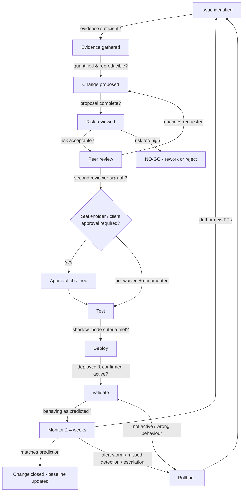

# Part XXXIX — Change Management

## Why a detection change is not a normal software change

[CONCEPT] Every other engineering discipline treats a change as done once it's deployed and the smoke test passes. Detection engineering doesn't get that luxury, because the two failure modes of a bad detection change are asymmetric and mostly invisible. Ship a change that's too loose and you find out fast — the queue fills up and someone complains within a day. Ship a change that's too tight, and you find out never, until an incident review months later shows the technique walked straight past a rule that used to catch it, and nobody noticed because absence of alerts looks identical to absence of attacks.

[MANAGEMENT] That asymmetry is the entire reason detection changes need a heavier-weight process than "open a PR, get one approval, merge." A missed SQL injection in a web app is a bug. A missed Kerberoasting detection because someone narrowed a filter at 2 a.m. during an incident and nobody reviewed it is a silent, multi-month coverage gap that only surfaces during the next real intrusion — at which point it becomes a very expensive finding in an incident report, or a very awkward line in a client post-mortem if you run a managed detection service.

This part lays out the full lifecycle: **issue identified → evidence gathered → change proposed → risk reviewed → peer review → stakeholder/client approval → test → deploy → validate → monitor → rollback if necessary.** Part XVI (Detection as Code) covers the *mechanics* of version control, branching, and CI for detection logic. This part covers the *decision process* that wraps around those mechanics — specifically, what evidence has to exist at each gate before you're allowed to say GO.



Every arrow into a NO-GO or a rollback loops back to gate one as a *new* issue with its own evidence trail — a failed change is not an anomaly to quietly patch, it's an input to the next cycle.

## The gates, in order

### Gate 1 — Issue identified

[ANALYST] Issues arrive from several directions, and where they come from changes how much weight the evidence needs to carry:

- An analyst files a false-positive report against a live rule.
- A hunt (Part XXVI–XXIX) surfaces a technique that a hypothesis-driven search found but no standing rule would have caught.
- An incident post-mortem produces an action item: "detection X should have fired at step 3 of the kill chain and didn't."
- Threat intelligence flags a new tool, LOLBin, or technique variant relevant to the environment.
- A coverage audit against an ATT&CK matrix shows an unmapped technique for an asset class that matters.
- A vendor advisory changes the meaning of a field, deprecates a log source, or changes default logging behaviour (this one is easy to miss and causes some of the worst silent gaps).
- A red team or purple team exercise (Part XXXI area) demonstrates a bypass.

**GO/NO-GO at gate 1:** is there a reproducible example — a specific alert ID, incident ticket, hunt ID, or log sample — and a stated hypothesis of what's wrong? A single anecdote from one analyst with no reproducibility and no pattern is a NO-GO for opening a formal change record; it goes in a backlog for pattern-watching instead. Opening full change records for every one-off complaint burns review capacity that should go to real signal.

### Gate 2 — Evidence gathered

[DETECTION ENGINEER] This is where the issue gets quantified, not just described. At minimum:

- Historical query run against the rule's own alert history: fire count over the last 30/90 days, and a disposition breakdown (true positive / false positive / benign-true-positive / undetermined) pulled from case management, not guessed.
- A representative sample of both true and false positives — not just the one that prompted the complaint.
- Current rule metadata: owner, last modified date, current MITRE mapping, current suppression/exclusion list, dependent dashboards or SOAR playbooks that reference this rule's output.
- For a coverage gap: confirmation the relevant telemetry actually exists and is complete (don't propose a detection against a field that's null 40% of the time because of a parser bug — check first).

**GO/NO-GO at gate 2:** is the problem now characterized in numbers, not adjectives? "It's noisy" is not evidence. "47 fires in 30 days, 44 disposed as FP, all 44 sharing the same parent process path" is evidence. NO-GO if the sample size is too small to generalize from, or if the underlying telemetry itself is suspect — in that case the issue becomes a telemetry/pipeline ticket, not a rule-tuning change.

### Gate 3 — Change proposed

[DETECTION ENGINEER] A written proposal, not a verbal agreement in a channel, containing: current logic, proposed logic (as a diff), the rationale tying back to gate-2 evidence, expected effect stated as a number (estimated FP reduction, confirmed TP fixtures that must still fire), any MITRE mapping change, the blast radius (which environments, tenants, or business units this touches), and a drafted rollback plan — written now, before anyone is under time pressure to invent one during an incident.

Classify the change, because classification determines how heavy the rest of the process needs to be:

| Change class | Example | Typical weight |
|---|---|---|
| Tuning (narrow/exclude) | Add exclusion for a known-benign parent process | Light — peer review, shadow test |
| New detection | Net-new rule for an uncovered technique | Medium — full pipeline |
| Deprecation | Retire a rule superseded by a better one | Medium — coverage-loss check required |
| Response-action change | Rule triggers auto-isolation or account disable | Heavy — risk board + stakeholder approval mandatory |
| Multi-tenant/client-visible | Change alters what a client sees in their portal | Heavy — client approval mandatory |

**GO/NO-GO at gate 3:** is the proposal internally consistent — does the stated rationale actually match the diff, and does the diff actually address the gate-2 evidence rather than something adjacent to it? A surprising number of proposals fix a symptom that isn't the one in the evidence.

### Gate 4 — Risk reviewed

[MANAGEMENT] For anything above "light" weight, a risk review happens before peer review touches syntax, because there's no point line-editing a query for a change that shouldn't happen at all. The review asks:

- What's the worst case if this change is wrong in each direction (a real attack slips through vs. an alert storm vs. breaking a downstream SOAR automation)?
- Does this rule carry contractual or compliance weight — is it named in an SLA, a regulatory control mapping, or a client's specific ask?
- Is the rollback plan actually executable inside the required time window, or does "rollback" secretly mean "manually rebuild from memory"?
- For response-action changes: what happens to a legitimate user or business process caught in the blast radius of an auto-response that fires incorrectly?

A simple likelihood-times-impact framing keeps this from being a vibe check:

| Impact / Likelihood | Low likelihood | Medium likelihood | High likelihood |
|---|---|---|---|
| Low impact (tuning-scale) | Peer review only | Peer review only | Peer review + shadow test |
| Medium impact (coverage-scale) | Peer review + shadow test | Risk board notified | Risk board sign-off |
| High impact (response-action / contractual) | Risk board sign-off | Risk board + stakeholder approval | Risk board + stakeholder approval + staged rollout |

**GO/NO-GO at gate 4:** risk acceptable given the evidence and the rollback plan, or the change needs to escalate to a named risk owner (senior engineer, SOC manager, or — for response-action and contractual changes — a change advisory function with authority to say no).

### Gate 5 — Peer review

[DETECTION ENGINEER] The technical review, using the checklist from Part XVI: does the logic match the stated behaviour, is the MITRE mapping accurate to what the query *actually* matches rather than what it was inspired by, is there at least one true-positive fixture and one known-FP fixture, are field names valid against the current schema. The distinct thing this gate adds at the change-management level is that the reviewer is explicitly verifying the gate-2 evidence and gate-3 proposal line up with the code — not just that the code is well-written in isolation.

**GO/NO-GO at gate 5:** approve, request changes, or reject. A second reviewer with query-language depth different from the author's usual pairing catches more than an echo-chamber review.

### Gate 6 — Stakeholder / client approval where required

[MANAGEMENT] In an MSSP/MDR model, or in any organization with internal detection consumers who didn't write the rule (compliance, a business unit SOC, a partner team), some changes need sign-off from someone outside the detection team:

- Anything client-visible (new alert category appearing in their portal, closing a detection they specifically requested, any response action touching their infrastructure).
- Anything tied to an SLA or contractual detection commitment.
- Anything a previous incident review specifically mandated stay in place.

Evidence for this gate is a recorded approval, not a verbal "yeah go ahead" in a call — a ticketing system approval field, a signed change record, or a documented email. If the gate is genuinely not applicable (pure internal tuning with no external visibility), that has to be stated and recorded as a waiver with a reason, not silently skipped.

**GO/NO-GO at gate 6:** approval recorded, or waiver documented. No verbal-only approvals count as evidence for audit purposes.

### Gate 7 — Test

[DETECTION ENGINEER] Unit tests against the fixtures from gate 5 are necessary but not sufficient — they prove the logic does what the author thinks it does against synthetic data, not what it will do against the messy reality of production. The gate that actually catches the surprises is **shadow mode**: run the proposed rule in parallel with the existing one against live data for a defined window (commonly 7–14 days) without it generating analyst-facing alerts, and diff the two result sets.

**Illustrative Sigma diff** for a Kerberoasting detection (T1558.003) being tuned after gate-2 evidence showed 44 of 47 fires were a legitimate service account running scheduled Kerberos ticket requests from a patch-management host:

```yaml
# BEFORE — fires on any 4769 with RC4 encryption and no machine account suffix
title: Kerberoasting - Suspicious Service Ticket Request
logsource:
  product: windows
  service: security
detection:
  selection:
    EventID: 4769
    TicketEncryptionType: '0x17'          # RC4
  filter_machine:
    ServiceName|endswith: '$'
  condition: selection and not filter_machine

# AFTER — adds evidence-based exclusion for the known scheduled-task account
# and requires ticket-request volume above baseline for the same account
detection:
  selection:
    EventID: 4769
    TicketEncryptionType: '0x17'
  filter_machine:
    ServiceName|endswith: '$'
  filter_known_scanner:
    SubjectUserName: 'svc-patchmgmt'
    SourceIP: '10.20.4.11'                 # the known WSUS/patch host, evidence-linked to change record CR-2026-0417
  condition: selection and not filter_machine and not filter_known_scanner
```

The **filter_known_scanner** exclusion is evidence-linked — it names the specific account and host from gate-2 data, not a broad "exclude anything from IT" filter, which is exactly the kind of over-broad fix that quietly guts coverage (see Detection Autopsy below).

**GO/NO-GO at gate 7:** did shadow mode show the target FP volume drop without losing any known true positive in the fixture set, and did shadow mode surface any *new* FP pattern the evidence didn't predict? If a new pattern shows up, that's a NO-GO — back to gate 2 with the new data, not a live deploy with a mental note to "watch it."

### Gate 8 — Deploy

[ENGINEERING] Deploy through the same pipeline as any other detection-as-code change: tagged version, staged rollout (single tenant or segment first if the environment supports it), scheduled for a window when on-call analysts are briefed and available to react, never during a live incident unless the change *is* the incident response.

**GO/NO-GO at gate 8:** deployment window appropriate, on-call briefed that this rule is changing today, and the rollback mechanism (previous tagged version, ready to reapply) confirmed available *before* the new version goes live — not confirmed after something goes wrong.

### Gate 9 — Validate

[ENGINEERING] Immediately after deploy, confirm the change is actually live and functioning — this catches the surprisingly common failure where a rule deploys "successfully" but is disabled, a scheduled query silently fails to run, or a syntax quirk in the target platform swallows the query into a no-op. Where a canary/synthetic trigger exists (a controlled test event that should fire the rule), fire it and confirm the alert appears with expected fields populated.

> **[SCREENSHOT PLACEHOLDER — CONTROLLED LAB]** — a SIEM detection-rule dashboard showing the shadow-mode comparison view (old rule alert volume vs. new rule alert volume over the 14-day test window) plus the post-deploy canary-alert confirmation, captured from a lab SIEM instance running against replayed Windows Security event logs. This would illustrate the specific evidence artifact that backs the gate-7 and gate-9 GO decisions — not a real production screenshot.

**GO/NO-GO at gate 9:** validated live and behaving as expected, or immediate rollback — this gate has the shortest acceptable time-to-decision in the whole pipeline, because a rule that's silently dead is worse than the rule it replaced.

### Gate 10 — Monitor

[ANALYST] A sustained monitoring window, typically 2–4 weeks, comparing real production behaviour against the shadow-mode prediction: FP rate trend, analyst disposition feedback, alert volume trend, and query cost/performance if the platform bills or throttles by query complexity. This gate is where slow drift shows up — a rule that looked fine in a 14-day shadow test can start misbehaving once a monthly batch job, quarterly patch cycle, or seasonal business process runs and generates a pattern the test window never saw.

**GO/NO-GO at gate 10 (the "sustain" decision):** does real-world performance match the prediction closely enough to close the change record and fold the new baseline into normal operations? Drift triggers a new cycle back to gate 1 with the drift itself as the new evidence; severe drift (alert storm, confirmed miss) triggers immediate rollback rather than waiting out the monitoring window.

### Gate 11 — Rollback if necessary

[ENGINEERING] Rollback triggers: alert storm overwhelming the queue, a confirmed missed detection traced to the change, a performance or cost blowup, a client escalation, or — for response-action changes — an unintended block of a legitimate business process. Rollback means reverting to the previous tagged, version-controlled state, not manually reconstructing what the rule used to say from memory or from a stale copy someone happened to have open. Every rollback produces its own record (what triggered it, what evidence proved it, what the impact window was) and feeds directly back into gate 1 as a new issue — the root cause of *why* the change failed is itself something to fix, not just the symptom.

## GO/NO-GO evidence summary

| Gate | Core question | Minimum evidence | Typical decider |
|---|---|---|---|
| 1. Issue identified | Is this real and reproducible? | Alert/incident/hunt ID, stated hypothesis | Analyst / hunt lead |
| 2. Evidence gathered | Is the problem quantified? | Fire-count history, disposition breakdown, samples | Detection engineer |
| 3. Change proposed | Is the fix internally consistent? | Written diff, rationale, blast radius, rollback draft | Detection engineer |
| 4. Risk reviewed | Is the risk acceptable? | Impact/likelihood assessment, contractual check | Risk owner / SOC manager |
| 5. Peer review | Is the logic correct and tested? | Second reviewer sign-off, fixtures | Peer detection engineer |
| 6. Stakeholder/client approval | Is external sign-off required and obtained? | Recorded approval or documented waiver | Client / SOC manager / compliance |
| 7. Test | Does shadow-mode data meet criteria? | 7–14 day parallel-run diff | Detection engineer |
| 8. Deploy | Is deployment safe to execute now? | Version tag, on-call briefing, rollback confirmed ready | Release owner |
| 9. Validate | Is it actually live and correct? | Post-deploy health check, canary confirmation | Detection engineer / on-call |
| 10. Monitor | Does real behaviour match prediction? | 2–4 week metrics trend, analyst feedback | SOC manager |
| 11. Rollback | Was rollback executed cleanly and root-caused? | Rollback record, new gate-1 issue | Release owner + risk owner |

## Detection Autopsy: the 2 a.m. exclusion

**Original logic:** a lateral-movement detection alerting on remote service creation consistent with PsExec-style execution (T1569.002) — `EventID 7045` service installs with an image path in a temp directory, combined with a preceding `4624` Type 3 logon from a non-standard admin workstation.

**Why it looked reasonable in the moment:** during a live incident, the on-call analyst got paged repeatedly for the same host — a legitimate SCCM software-deployment server that happened to install services from a temp staging path as part of normal patch pushes. Under incident pressure, the analyst added a broad exclusion directly in the SIEM console: any service install where the source host's hostname contained `SCCM`.

**What broke in production:** the exclusion matched every hostname containing that substring across the estate, including two hosts named `SCCM-BACKUP-DR01` and `LEGACY-SCCM-PROXY` that had nothing to do with the actual deployment server and had, in fact, been flagged in an earlier hunt as candidates for decommissioning because of unclear ownership. Three months later, one of those hosts was used as a pivot point in a real intrusion — the PsExec-style service install fired zero alerts, exactly as designed by the exclusion nobody reviewed.

**Missing context:** no gate-2 evidence was gathered (how many hosts actually match "contains SCCM," what's the false-positive base rate without the exclusion), no gate-5 peer review happened (the change went straight into the console, not into the detection-as-code repository), and no rollback plan existed because nobody framed it as a change at all — it was "just a quick fix to stop the paging."

**Revised analytic:** the exclusion was rebuilt evidence-first — restricted to the exact hostname of the legitimate SCCM primary site server plus its documented service-account identity, sourced from the CMDB, with the exclusion logic itself checked into the detection repository and code-reviewed like any other change.

**How it was tested:** shadow mode for 14 days confirmed the narrow exclusion suppressed 100% of the known-benign SCCM pushes while leaving service installs from every other host — including the two ambiguous `SCCM`-named hosts — fully visible.

**Result:** FP volume from the legitimate deployment server dropped to zero, and the two ambiguous hosts went back into scope for the detection, feeding directly into a separate CMDB-hygiene finding about undocumented systems with lookalike names.

## Engineering Reality

A CI pipeline going green proves the query is syntactically valid and passes the fixtures you thought to write — it does not prove the rule behaves identically in staging and production. Field availability, log volume, and even encoding can differ between a staging index seeded from a sample export and the live production stream, especially after a SIEM upgrade or a parser change nobody flagged as relevant to this specific rule. Treat a green pipeline as clearance to enter shadow mode, never as clearance to skip it.

## SOC Management View

Track change management as a set of metrics, not a policy document nobody rereads: **change lead time** (issue-identified to closed, by change class), **rollback rate** (rollbacks per 100 changes — a rate near zero across a long period is itself a warning sign that shadow-mode gates are too lax or too short to catch anything), **percentage of changes requiring stakeholder/client approval** (tracks how much of the program touches externally visible commitments), and **audit-trail completeness** (percentage of change records with every gate's evidence artifact actually attached, not just a checkbox). This last one is what a SOC 2 or ISO 27001 change-management control assessment will actually sample against — a policy that describes eleven gates is worthless to an auditor if change record CR-2026-0417 only has evidence for three of them.

## Hunter's Note

Keep a standing list of "detections changed in the last 30 days" and hunt against exactly that list first, before anything else. A change is the single highest-probability place for a fresh gap to exist — not because the process is bad, but because even a well-run shadow-mode test only samples the traffic pattern that happened to occur during that window, and an adversary who's been inside long enough to notice tuning changes (or who gets lucky with timing) will find the gap the test window didn't cover.

## The change record

Whatever system holds it — a ticketing platform, a lightweight database, or entries in the detection repository's `docs/decisions/` folder from Part XVI — every change record should carry the same minimum schema so gate evidence is queryable later, not scattered across chat history:

| Field | Purpose |
|---|---|
| Change ID | Unique reference, used in commit messages and rule metadata |
| Requester / issue source | Ties back to gate 1 |
| Evidence links | Query results, sample fires, hunt/incident IDs from gate 2 |
| Change class | Tuning / new / deprecation / response-action / client-visible |
| Risk score & owner | From gate 4 |
| Reviewer(s) | From gate 5, with explicit approve/reject |
| Stakeholder approval record or waiver | From gate 6 |
| Shadow-mode test window & results | From gate 7 |
| Deployed version / tag / timestamp | From gate 8 |
| Post-deploy validation result | From gate 9 |
| Monitoring window outcome | From gate 10 |
| Rollback record (if any) | From gate 11, with root cause |

A program that can produce this table for any given rule, on demand, has a change management process. A program that can only produce "someone probably changed it, check the git log" has a policy document and a hope.
