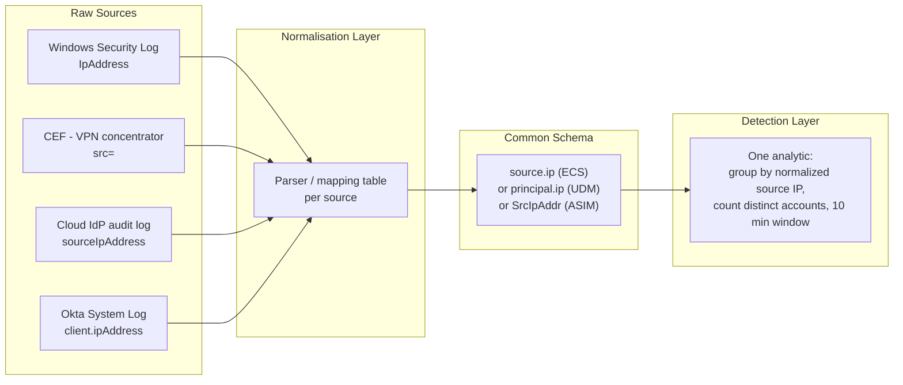

# Part XLI — Normalisation

A detection rule is a bet on field names. Every analytic you write — Sigma, KQL, SPL, YARA-L,
whatever — is really a claim of the form "this event has a field called X that means Y." The
moment two data sources disagree on what to call the same concept, that bet starts failing
silently: not with an error, but with a query that runs cleanly and returns nothing, or worse,
returns the wrong thing. Normalisation is the practice of collapsing "this field is called
`src_ip` here, `SourceIP` there, and `source.ip` somewhere else" into one agreed name, one agreed
type, and (ideally) one agreed meaning. It sounds like plumbing. It is plumbing. It is also the
single biggest determinant of whether a detection you write once will actually work across your
whole environment, or whether you're quietly maintaining five copies of every rule.

[CONCEPT] Think of normalisation like currency conversion for a multinational ledger. A sale in
Tokyo, London, and New York all represent "revenue," but one is recorded in yen, one in pounds,
one in dollars. If your finance system doesn't convert everything to a common currency before
totalling, the sum is meaningless — not wrong exactly, just incomparable. Log normalisation does
the same thing for security telemetry: it converts "the source of this network connection" from
whatever local currency (`src`, `src_ip`, `SourceAddress`, `principal.ip`) the producing tool used,
into one common currency your detections, dashboards, and hunts can all read.

## Why this matters more than it looks like it should

A SOC running one SIEM with one log source doesn't have a normalisation problem — it has a field
name, and that's that. The problem shows up the moment you have more than one of anything: two
firewalls from different vendors, an EDR agent alongside Sysmon, cloud audit logs alongside
on-prem AD logs, or (the common case) a SIEM migration where six years of saved searches assume
field names from the old platform. Every one of those seams is a place where a detection written
against one schema silently stops working against the other, or — more dangerous — appears to work
because the field exists in both schemas but means something subtly different.

[SOC Management View] **SOC Management View** — Normalisation is a force multiplier or a tax,
depending on whether you invest in it deliberately or let it accumulate by accident. A detection
engineering team that writes 40 analytics against a normalized schema can generally point those
same 40 analytics at a new log source in days, provided someone maps the new source's fields into
the schema. A team that wrote those same 40 analytics against raw vendor field names has to
rewrite a meaningful fraction of them by hand every time a new source is onboarded, a vendor changes
a field name in a product update, or the org migrates SIEM platforms. The cost doesn't show up on
a single sprint's burndown — it shows up two years later as "why do we have 300 rules and no one
knows which ones still work."

## The schemas: what they are and who owns them

None of these schemas were designed in a vacuum with detection engineers as the sole customer —
each reflects the priorities of the vendor or foundation that built it, and that shapes what they
model well and what they leave underspecified.

### ECS — Elastic Common Schema

ECS is Elastic's schema, originally built to give Beats, Logstash, and Elasticsearch a consistent
field vocabulary across the ingest pipeline. It uses dotted, nested field names — `source.ip`,
`destination.port`, `process.executable`, `user.name`, `event.action` — and is documented publicly
independent of the Elastic Stack itself, which is part of why other tools (some Sigma backends,
some open-source parsers) have adopted ECS-shaped output even outside Elastic products. ECS is
strong on host/network/process/file entities and reasonably strong on cloud, but its
category/type taxonomy (`event.category`, `event.type`) requires discipline to apply consistently
— two different parser authors mapping the same Windows event to ECS can reasonably disagree on
whether `event.type` should be `start` or `creation` for a process-creation event.

### UDM — Google Unified Data Model

UDM is the schema underneath Chronicle/Google Security Operations. It's more explicitly
entity-relationship shaped than ECS: events are modeled with a `principal` (the entity that
initiated an action), a `target` (the entity acted upon), and sometimes `src`/`about`/`observer`
roles, plus a strongly typed `metadata.event_type` enum. So "source IP" in UDM is usually
`principal.ip`, and "destination IP" is `target.ip` — the naming encodes the *role* of the entity
in the event, not just its network position. This is a genuinely different modeling choice from
ECS's `source`/`destination`, and it matters: a lateral movement event where the same host is
sometimes the initiator and sometimes the target maps cleanly to UDM's role-based fields in a way
that's more awkward to express in a purely source/destination model.

### ASIM — Microsoft Sentinel Advanced SIEM Information Model

ASIM is Sentinel's normalization layer, implemented as a set of KQL parsers (functions like
`_Im_NetworkSession`, `_Im_ProcessCreate`, `_Im_Dns`) that sit on top of raw tables (`CommonSecurityLog`,
`SecurityEvent`, `Syslog`, custom tables) and expose a normalized column set —
`SrcIpAddr`, `DvcHostname`, `TargetUserName`, and so on — regardless of the underlying raw table
schema. The key architectural difference from ECS/UDM/OCSF: ASIM normalization typically happens
**at query time**, via parsing functions, rather than at ingest time by rewriting the stored event.
The raw data keeps its original field names in the table; the ASIM parser is a KQL function that
translates on the fly when you query through it. This has real performance and maintenance
tradeoffs — you're not paying ingest-time normalization cost or storage duplication, but every
query through an ASIM parser pays a parsing cost, and a built-in or custom parser that's wrong or
incomplete for your log source silently degrades results exactly like a bad Sigma `logsource`
mapping.

### OCSF — Open Cybersecurity Schema Framework

OCSF is the newest of the major schemas (AWS, Splunk, and others contributed to its creation as an
open, vendor-neutral standard) and is explicitly trying to be the common target that other schemas
and log sources map *into*, rather than a proprietary schema tied to one product. It defines
**event classes** (Process Activity, Network Activity, Authentication, DNS Activity, and more)
under broader **categories**, each with a defined attribute set, and — notably — profiles that
extend base classes with optional attributes without breaking base-class compatibility. Field names
in OCSF read close to ECS in places (`src_endpoint.ip`, `dst_endpoint.ip`) but the class/category
taxonomy is more rigorously versioned, with an explicit schema version number you pin against.
OCSF adoption is growing fastest in cloud-native security tooling (AWS Security Lake is a major
adopter) and is the schema most likely to matter if you're building a lakehouse-style detection
architecture rather than a single-vendor SIEM.

### Vendor-proprietary schemas and the raw layer underneath everything

Below all of the above sits the schema you didn't choose: whatever field names the actual log
source emits. Windows Security Event Log XML has its own field names (`SubjectUserName`,
`TargetUserName`, `IpAddress`), Sysmon has its own per-EventID field sets, Splunk's CIM (Common
Information Model) predates most of the schemas above and is still what a lot of SPL-based
detection is written against, and CEF (Common Event Format, from ArcSight) is still what a large
share of network and security appliances emit natively (`src=`, `dst=`, `suser=`, `spt=`). None of
these are going away. Normalisation isn't a one-time migration away from them — it's a permanent
translation layer you maintain on top of them.

[ENGINEERING] **Engineering Reality** — No schema mapping is ever 100% complete, and the gaps are
rarely random. They cluster around whichever log sources are least standardized to begin with:
custom application logs, homegrown API gateways, legacy network appliances with idiosyncratic CEF
extensions, and anything where the vendor changed a field name between firmware versions without
telling anyone. The unmapped 5-10% is usually not evenly distributed risk — it's disproportionately
concentrated in exactly the sources that are hardest to re-parse quickly during an incident,
because nobody's touched that parser since it was written.

## The concrete field-mapping problem

Here's the same concept — "the IP address that originated a network connection" — across five
schemas and one raw source:

| Schema | Field | Notes |
|---|---|---|
| Splunk CIM | `src_ip` (sometimes just `src`) | CIM also has `src` as a generic "source" field that isn't always an IP; don't assume type from name alone. |
| ECS | `source.ip` | Nested/dotted notation; `source.address` is the pre-DNS/pre-NAT form Elastic recommends checking too. |
| UDM (Chronicle) | `principal.ip` | Role-based — this is the *initiator*, which is usually but not always the "source" in a topological sense. |
| ASIM (Sentinel) | `SrcIpAddr` | Exposed via `_Im_NetworkSession` and similar parsers; the underlying raw table may call it something else entirely. |
| OCSF | `src_endpoint.ip` | Endpoint object also carries `src_endpoint.hostname`, `src_endpoint.port` as siblings. |
| Raw CEF | `src=` | Untyped string in the wire format; validation happens downstream or not at all. |
| Raw Windows Security Log (4624) | `IpAddress` | This is the *source* IP of an inbound logon — but for 4624 with LogonType 3, it can be blank or `-` for local/service accounts, which trips up naive mappings that assume it's always populated. |

The table looks trivial until you try to write one detection that has to run against three of
these sources. Consider: "alert when a single source IP authenticates successfully against more
than 15 distinct accounts within 10 minutes" — a reasonable password-spray / credential-stuffing
detection (MITRE ATT&CK T1110, and specifically T1110.003/T1110.004 depending on the vector). The
underlying behaviour is identical whether the auth events come from Windows Security Log 4624/4625,
Okta, a CEF-emitting VPN concentrator, or a cloud identity provider's audit log. But:

- Against raw Windows Security Log, you group on `IpAddress` and filter `LogonType`.
- Against CIM-normalized data, you group on `src_ip` in the `Authentication` datamodel.
- Against ECS, you group on `source.ip` and filter `event.category: authentication`.
- Against UDM, you group on `principal.ip` and filter `metadata.event_type: USER_LOGIN`.
- Against ASIM, you query through `_Im_Authentication` and group on `SrcIpAddr`.

Write the analytic five times against five raw field sets, and you have five rules to maintain,
five places a vendor field-name change breaks silently, and five copies to keep in sync when the
detection logic itself needs a tuning change (say, raising the threshold from 15 to 25 because a
shared NAT gateway is generating noise). Write it once against a normalized field — pick your
schema, most shops standardize on whichever their primary SIEM/lake natively speaks — and mapping
new sources into that schema becomes the only recurring cost, isolated to the ingest/parsing layer
instead of smeared across every analytic.



**Detection Autopsy**

*Original logic:* an analyst writes a password-spray detection directly against raw Okta System
Log JSON, filtering `eventType = "user.session.start"` and grouping on `client.ipAddress`,
threshold 15 distinct `actor.alternateId` values in 10 minutes. It works, ships, gets a
`high` severity tag.

*Why it looked reasonable:* it matched real attacker behaviour observed in a past incident, the
threshold was tuned against 30 days of baseline, and it fired cleanly in testing against a
simulated spray.

*What broke in production:* six months later the org onboards a second identity provider for a
newly acquired subsidiary, plus a VPN concentrator whose CEF logs also represent user
authentication. The Okta-specific rule doesn't fire against either — not because the logic is
wrong, but because `client.ipAddress` and `actor.alternateId` don't exist in those event streams.
Nobody notices for weeks because the rule doesn't error, it just never matches on that traffic. A
real spray against the VPN concentrator goes undetected.

*False positives that did show up on the Okta side:* corporate NAT egress IPs used by SSO
proxies and by a travelling sales team behind a hotel NAT occasionally clustered enough distinct
users behind one IP to brush the threshold — a normalisation-adjacent problem too, since "source
IP" behind carrier-grade NAT or corporate egress doesn't mean "one person" the way it does on a
flat home network.

*False negatives:* the VPN and second-IdP gap above, plus any authentication event type Okta emits
that wasn't the exact `user.session.start` string the rule filtered on (Okta has multiple
session/auth-related event types across API versions).

*Missing context:* no distinction between interactive login attempts and API/service-account auth,
which have very different normal cluster sizes.

*Revised analytic:* rebuilt against a normalized `source.ip` / `event.category: authentication` /
`event.outcome: success` shape fed by parsers for Okta, the second IdP, and the VPN concentrator,
with a NAT/known-egress allowlist field (`source.nat` boolean or a lookup table) applied as a
tuning filter rather than baked into the base logic, so it can be adjusted per environment without
touching the detection itself.

*How it was tested:* replayed captured Okta events, synthetic CEF spray events, and synthetic
second-IdP events through the same normalized query, confirmed all three trigger, confirmed the
allowlisted NAT range suppresses only the known travelling-user pattern and not a genuine spray
riding the same egress IP.

*Result:* one analytic covering three sources instead of a rule per source, and the NAT
false-positive became a tunable exception instead of a silent blind spot.

## Illustrative example: the same hunt, three ways

[THREAT HUNTER] A hunter suspecting low-and-slow credential stuffing wants to look for accounts
with a high ratio of failed-to-successful authentications from a single source, below the
threshold any spray detection would catch. Here's the same hunt logic expressed three ways —
labeled illustrative since exact syntax should be validated against your live schema version.

**Illustrative KQL against ASIM `_Im_Authentication`:**

```kql
_Im_Authentication
| where TimeGenerated > ago(24h)
| summarize Failures = countif(EventResult == "Failure"),
            Successes = countif(EventResult == "Success"),
            Accounts = dcount(TargetUsername)
          by SrcIpAddr
| where Failures > 20 and Successes > 0 and Accounts > 3
| order by Failures desc
```

**Illustrative SPL against Splunk CIM `Authentication` datamodel:**

```spl
| tstats count(Authentication.action) as attempts
    from datamodel=Authentication
    where earliest=-24h
    by Authentication.src, Authentication.action, Authentication.user
| stats sum(eval(if(action="failure", attempts, 0))) as failures,
        sum(eval(if(action="success", attempts, 0))) as successes,
        dc(user) as accounts
    by src
| where failures > 20 AND successes > 0 AND accounts > 3
```

**Illustrative UDM search (YARA-L style) against Chronicle:**

```yara-l
rule high_failure_ratio_auth {
  meta:
    author = "detection-engineering-handbook"
  events:
    $auth.metadata.event_type = "USER_LOGIN"
    $auth.principal.ip = $ip
  match:
    $ip over 24h
  condition:
    #auth > 20
}
```

The behaviour, the window, and the intent are identical. Only the field names and aggregation
syntax differ — which is exactly the point: a hunter moving between environments, or a detection
engineer maintaining logic across a multi-SIEM estate, is translating syntax, not re-deriving the
idea each time, provided the underlying data has actually been normalized into the schema the
query assumes.

**Hunter's Note** — When a normalized query returns suspiciously zero results across an entire
data source, don't read that as "no matches." Read it as "check whether the parser mapped this
source into the schema at all" first. A silent empty result and a genuinely clean environment are
indistinguishable at the query layer, and normalisation gaps are far more common than truly clean
environments.

## Where normalisation breaks down in practice

**Type mismatches.** A field mapped as a string in one schema and typed as an IP address object in
another will behave differently under CIDR matching, sorting, and equality comparison. `source.ip`
in ECS is expected to be a valid IP type; a raw log source that sometimes emits a hostname in the
same field (common in poorly-behaved appliance logs) will silently fail type-strict queries or,
worse, pass through as a string and never match a CIDR-based allowlist/denylist check.

**Role ambiguity.** Source/destination models (ECS, CIM) assume a stable notion of "who initiated
this." That breaks down for reflected traffic, for east-west lateral movement where the "server"
role flips per connection, and for cloud API calls where there's a caller identity, a resource
identity, and sometimes an on-behalf-of identity all in the same event. UDM's principal/target
model handles this better structurally, but only if the mapping author actually assigns roles
correctly at parse time — a mis-assigned principal/target is a worse failure mode than a missing
field, because the query still returns results, just attributing the action to the wrong entity.

**Cardinality and enrichment order.** Some normalized schemas expect enrichment (GeoIP, asset
criticality tags, user department) to happen before normalisation; others expect it after. If your
pipeline enriches `src_ip` with asset context before a later normalisation step renames the field to
`source.ip`, the enrichment join breaks silently unless the pipeline is aware of both names — a
very common bug in home-grown pipelines that adopted ECS or OCSF incrementally, one log source
at a time, without a hard cutover.

**Version drift.** OCSF and ECS both version their schemas, and field semantics do occasionally
shift between major versions (a category gets split, an enum value gets renamed). A detection
pinned to an unversioned "latest" mapping can start silently misfiring after a schema upgrade that
nobody on the detection team was involved in approving.

[DETECTION ENGINEER] Practical mitigation for all of the above: treat your normalisation mapping
layer itself as a testable, version-controlled artifact — not just the detections sitting on top of
it. A unit test that feeds a known raw sample (Windows 4624, a CEF VPN line, an Okta JSON event)
through the parser and asserts the normalized output has the expected field, expected type, and
expected role assignment catches schema drift before it silently degrades a production detection.
This is the same discipline detection-as-code pipelines apply to rules; it needs to extend one
layer down, to the parsers that feed those rules.

[ANALYST] What this means for you day to day: when a rule fires or fails to fire and the raw event
clearly should have matched, the first two questions are "did this event actually get normalized"
and "does the field the rule reads on this schema mean what the rule author assumed it means."
Don't just re-read the rule logic — pull the raw event and trace it through the parser/mapping by
hand at least once per investigation where normalisation is a plausible suspect.

## Custom normalisation layers

Most mature detection programs eventually build a thin internal layer on top of whichever
industry schema they adopt — a small set of fields specific to their environment that don't map
cleanly to ECS/UDM/OCSF/ASIM out of the box: internal business-unit tags, asset criticality tiers,
a "is this identity a service account" boolean derived from a separate identity governance feed.
The discipline that keeps this from turning into schema sprawl is treating the custom layer as a
strict *extension*, additive on top of the base schema, never a field that shadows or renames a
base-schema field with different semantics. OCSF's profile mechanism formalizes this pattern; ECS
allows custom field sets under an explicit non-`ecs.*` namespace for the same reason. The failure
mode to avoid is a well-meaning engineer adding a field called `source_ip` (no dot, underscore
style) alongside an existing `source.ip`, populated from a different logic path, that some
dashboards read and some detections don't — now you have two sources of truth for the same
concept, silently diverging.

## Coverage and mapping matrix — approaching a new log source

| Question | Why it matters |
|---|---|
| Does a parser/CIM/ASIM/OCSF mapping already exist for this exact product and version? | Community mappings (Sigma pipelines, Splunk TA field extractions, Sentinel built-in ASIM parsers) save time but must be validated against your actual log output, not assumed correct. |
| Which fields does the source emit that have no equivalent in the target schema? | These become custom-namespace fields or get dropped — decide deliberately, don't let them silently vanish. |
| Are IP/timestamp/user-identifier fields typed correctly after mapping? | Type errors are the most common silent-failure category. |
| Does the source ever populate the "source" role field with something that isn't topologically the source (NAT, proxy, load balancer)? | Determines whether you need a pre-normalisation enrichment step for true client IP. |
| Is there a version pin on the schema itself (OCSF schema version, ECS version)? | Prevents silent semantic drift on schema upgrade. |
| Has a unit test been written asserting a known raw sample maps to the expected normalized output? | The only reliable way to catch mapping regressions before they hit production detections. |

> **[SCREENSHOT PLACEHOLDER — CONTROLLED LAB]** — a side-by-side capture of the same authentication
> event as it appears in raw form (e.g. Linux `auth.log` via SSH from a home-lab host, or a Sysmon
> process-creation log from a lab Windows VM) next to its normalized representation after passing
> through an ECS or OCSF mapping pipeline, illustrating exactly which raw fields (`sshd` PID, `Accepted
> publickey for`, source IP in the log line) land in which normalized field names. Would be captured
> from a real lab Linux auth.log or Sysmon Event ID 1 source once normalisation tooling is stood up
> in the controlled lab phase, not fabricated here.

CONCEPTUAL SAMPLE — illustrative raw-to-normalized pairing, not captured evidence:

```
# Raw sshd auth.log line
Sep 15 09:12:44 host sshd[10234]: Accepted publickey for jsmith from 203.0.113.44 port 51522 ssh2

# Normalized (ECS-shaped) representation, conceptual
event.category: authentication
event.outcome: success
event.action: ssh_login
source.ip: 203.0.113.44
source.port: 51522
user.name: jsmith
process.name: sshd
process.pid: 10234
```

## Summary

Normalisation schemas — ECS, UDM, ASIM, OCSF, Splunk CIM, and whatever proprietary or custom layer
your org runs — all solve the same underlying problem: letting a detection be written once about a
*behaviour*, instead of once per log source about a specific field name. None of them solve it
perfectly, none of them cover every field your environment actually needs, and every mapping layer
between raw log and normalized schema is a place where drift, type mismatches, and silent gaps
accumulate. The practical takeaway for a detection engineering program isn't "pick the right
schema" — it's "pick a schema, commit to it, and treat the mapping layer underneath it as
production code with its own tests, versioning, and ownership," because that layer is what
determines whether the 40 analytics you already wrote still work the next time someone plugs in a
new log source.
