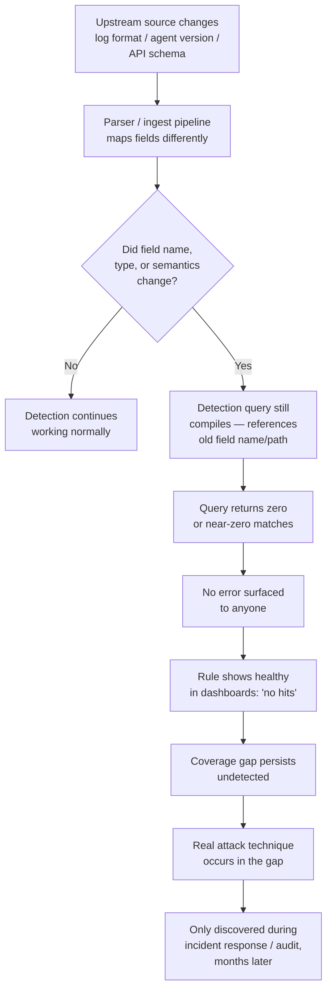
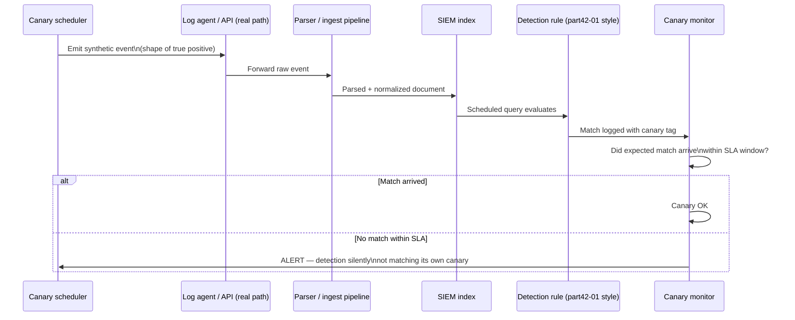

# Part XLII — Parser Failure

## Why This Gets Its Own Part

Every detection engineering program eventually gets burned by the same failure mode, and almost
none of them build defenses against it until after the burn. A rule fires in testing, ships to
production, passes review, sits in the queue for months looking healthy — zero matches, which
everyone reads as "the bad thing isn't happening" — and then during an incident retro someone
discovers the rule hasn't actually evaluated a true positive in six months because a field it
depends on no longer exists under that name. The rule didn't break. It didn't error. It didn't even
know anything was wrong. It just quietly stopped being able to see.

This is the most dangerous failure class in the entire detection lifecycle, and it's more dangerous
than a false positive storm or a bad threshold, for one specific reason: **noisy detections get
noticed, and silent detections don't.** A rule that fires too much gets tuned within a week because
analysts complain. A rule that fires zero times looks exactly like a rule that's working perfectly.
Nothing in a typical SOC workflow distinguishes "no matches because there's no threat" from "no
matches because the field got renamed."

[CONCEPT] Parser failure, in the sense this chapter uses it, is not a crash. It's semantic drift:
the pipeline that turns a raw log line into a structured field either stops populating a field, 
starts populating it under a different name, changes its data type, changes its value format, or
starts populating it with something that looks plausible but means something different than before.
The detection rule keeps compiling. The query keeps running. The dashboard keeps rendering a green
tile. Nothing in the observable state of the SIEM tells you the rule is now structurally blind.

**Hunter's Note** — If you cannot remember the last time a specific detection *matched something*,
you don't know if it's protecting you or just decorating the rule count in your quarterly report.
"Zero alerts" is not a status. It's a question you haven't asked yet.

## The Core Failure Chain



This chain has a specific, exploitable property: every node from B through H is *silent*. There is
no exception thrown, no failed job, no red indicator anywhere in a standard SIEM UI. The only way
to catch it before node J is to actively instrument for it, which is the subject of the second half
of this chapter.

## Worked Example: `user.name` Becomes `user.id`

This is the canonical case, and it's worth working through slowly because the same shape recurs
across almost every parser-drift incident regardless of vendor or platform.

### The setup

A detection engineering team ships a rule to catch anomalous interactive logons by a break-glass
domain admin account outside of change windows. The environment uses an ECS-aligned (Elastic Common
Schema) normalization layer sitting between raw Windows Security event logs and the SIEM's search
index. At the time the rule is written, the parser populates `user.name` with the account name
extracted from Windows Event ID 4624 (`TargetUserName`).

**CONCEPTUAL SAMPLE — normalized event, before the change:**

```json
{
  "@timestamp": "2026-03-04T02:14:07Z",
  "event": { "code": "4624", "category": ["authentication"] },
  "winlog": { "logon": { "type": "10" } },
  "user": {
    "name": "svc-breakglass-da",
    "domain": "CORP"
  },
  "source": { "ip": "10.14.2.201" }
}
```

The Sigma-style detection (illustrative, ECS field convention):

```yaml
title: Break-Glass Domain Admin Interactive Logon Outside Change Window
id: part42-01
status: stable
logsource:
  category: authentication
  product: windows
detection:
  selection:
    event.code: '4624'
    winlog.logon.type: '10'
    user.name: 'svc-breakglass-da'
  timeframe_filter:
    # illustrative — actual change-window exclusion implemented
    # as a lookup/enrichment join in the pipeline, not inline here
  condition: selection and not timeframe_filter
level: high
```

This works. It's tested against replayed 4624 events in a lab, it fires correctly when the account
logs on outside the approved window, and it ships.

### The change nobody flagged

Five months later, the logging team upgrades the log-shipping agent and swaps to a newer version of
the Windows integration that ships with the platform's own field mappings. The new integration
follows a slightly different convention: it maps the SID-resolved identity into `user.id` (a stable
identifier) and only populates `user.name` when a separate enrichment lookup succeeds — which, for
this particular service account, it doesn't, because the account was created directly in AD without
syncing through the identity provider the enrichment lookup depends on.

**CONCEPTUAL SAMPLE — same logical event, after the agent upgrade:**

```json
{
  "@timestamp": "2026-08-19T02:16:41Z",
  "event": { "code": "4624", "category": ["authentication"] },
  "winlog": { "logon": { "type": "10" } },
  "user": {
    "id": "S-1-5-21-...-1147",
    "domain": "CORP"
  },
  "source": { "ip": "10.14.2.201" }
}
```

`user.name` is simply absent from the document. `user.id` now carries the identity. The rule's
`selection` clause requires `user.name: 'svc-breakglass-da'` to be present and equal to that
literal string. It never will be again, for this account, under this pipeline version — but the
rule keeps running its scheduled search every 15 minutes, keeps returning zero results, and keeps
showing "OK — no matches" in the detection health dashboard, which is indistinguishable from "the
break-glass account has not been misused."

### Why this is worse than an obvious break

If the parser change had instead produced malformed JSON or a missing mandatory field that the
query engine choked on, the search would throw a parse error and someone would see a red status.
Renaming a field doesn't do that. The query is syntactically and semantically valid SPL/KQL/Sigma —
it's just asking a question about a field that no longer carries the data it used to. This is
the same class of problem as a `NULL` foreign key in a database: no error, just silently absent
join results.

[DETECTION ENGINEER] The specific reason this recurs so often with identity fields is that identity
normalization is one of the most actively "improved" parts of any SIEM's ingest layer, because
vendors keep trying to unify SID, UPN, SAM account name, and email identity into one canonical
field. Every unification pass is a rename risk for anyone matching on a literal field path.

## Where This Bites: Field Rename Is Only One Flavor

Field renaming is the easiest version to explain, but schema drift shows up in at least five
distinct shapes, and each defeats a different kind of detection logic.

| Drift type | Example | What silently breaks |
|---|---|---|
| Field renamed | `user.name` → `user.id` | Exact field-match selection clauses |
| Field relocated (nesting change) | `process.command_line` → `process.args` (array) | Any query expecting a flat string, substring match on a now-array field |
| Data type changed | Port field changes `int` → `string` (`"443"` vs `443`) | Numeric comparisons (`> 1024`), some SIEM backends silently coerce, others don't |
| Value vocabulary changed | Logon type `10` → mapped label `"RemoteInteractive"` | Literal value matches (`winlog.logon.type: '10'`) |
| Field still exists but semantics shift | `source.ip` starts reflecting a load balancer/proxy hop instead of true client IP after a network topology change | Geo/reputation enrichment, allow-listing internal ranges, lateral movement detections that assume client IP |
| Field silently stops populating for a subset of sources | New log source type added to the pipeline, existing parser doesn't recognize its subtly different event structure, falls back to a generic parser that drops half the fields | Detections scoped to "all Windows hosts" now blind for the new host population only |

The last row deserves emphasis because it's the one that produces *partial* blindness, which is
strictly harder to notice than total blindness — the rule keeps matching *something*, just not the
full population it's supposed to cover, so there's no "zero matches" signal to notice at all.

**Detection Autopsy — The Rule That Looked Fine For Six Months**

*Original logic*: A rule detects Kerberoasting by matching Windows Event ID 4769 (Kerberos service
ticket request) where the encryption type is RC4 (`0x17`) and the requested service is not a
built-in AD service account, using field `ticket_options` and `ticket_encryption_type` as mapped by
the parser at the time.

*Why it looked reasonable*: RC4 tickets for non-krbtgt services are a well-known Kerberoasting
signal (MITRE ATT&CK T1558.003), the field names matched the vendor's documented ECS mapping at
build time, and it validated cleanly against an Impacket `GetUserSPNs.py` test run in the lab.

*What broke in production*: The SIEM vendor pushed a content-pack update six weeks after
deployment that changed the Kerberos field mapping to align with a newer ECS minor version,
splitting the single `ticket_encryption_type` field into `kerberos.ticket.encryption_type` (nested)
and deprecating the flat field — but only for events ingested through the newer forwarder version,
which was being rolled out gradually across the domain controller fleet. For roughly ten weeks, DCs
running the old forwarder still populated the flat field and the rule worked; DCs upgraded to the
new forwarder populated only the nested field and the rule went silent for those hosts.

*False positives*: None — that's the trap. A rule going silent produces no false positives to
complain about, which is exactly the kind of failure nobody escalates.

*False negatives*: Total, for any Kerberoasting attempt against a service account whose ticket
request landed on an upgraded DC, for the full ten-week rollout window plus the time after full
rollout until someone happened to check.

*Missing context*: No coverage/staleness monitoring existed. No one tracked forwarder version per
host against which field schema each version emits. No "detection last matched" telemetry existed
independent of the SIEM's own "rule executed successfully" status, which stayed green throughout
because the *query* never failed — it just increasingly matched nothing.

*Revised analytic* (illustrative KQL, hedging both field shapes during the transition and going
forward wherever a vendor might dual-ship fields):

```kql
SecurityEvent
| where EventID == 4769
| extend EncType = coalesce(
    tostring(column_ifexists("kerberos.ticket.encryption_type", "")),
    tostring(column_ifexists("ticket_encryption_type", "")),
    TicketEncryptionType  // legacy flat field, kept as final fallback
  )
| where EncType in ("0x17", "RC4")
| where ServiceName !endswith "$"  // exclude machine accounts
| where ServiceName != "krbtgt"
```

*How it was tested*: Replayed the original Impacket-generated 4769 sample against both the old and
new parser mappings side by side in a non-production index, confirmed the coalesced field resolved
correctly under both, then added a synthetic canary event (see below) emitted daily under each
known field shape so any *future* mapping change gets caught within 24 hours instead of ten weeks.

*Result*: Detection restored for both forwarder generations; canary alerting added so the next
schema change surfaces as a missed-canary alert instead of a silent gap.

## Schema Drift Monitoring: Catching This Before It Costs You an Incident

The fix is not "write better queries" — you cannot query-hedge your way out of every possible
future rename, and trying to (stacking `coalesce()` calls indefinitely) makes rules unreadable and
still misses drift types that aren't simple renames. The fix is treating schema stability itself
as something you monitor, the same way you'd monitor pipeline latency or ingest volume.

[ENGINEERING] There are four complementary controls here, roughly in order of effort-to-value:

### 1. Field presence and cardinality monitoring per source

For every field a detection depends on, track (a) the percentage of events from that log source
that populate the field non-null, and (b) the cardinality/distribution of its values, over a
rolling window. Alert on a step change — not a gradual drift, a *step* — in either metric. A field
that was 98% populated for a source suddenly dropping to 40% populated on a specific day is exactly
the signature of a partial rollout breaking a subset of hosts.

```sql
-- Illustrative SPL: daily field-population check for a critical field
| tstats count WHERE index=wineventlog earliest=-1d
    BY host, _time span=1d
| appendcols [
    | tstats count(user.name) as populated WHERE index=wineventlog earliest=-1d
      BY host, _time span=1d
  ]
| eval pct_populated = round((populated/count)*100, 1)
| where pct_populated < 90
```

### 2. Detection canaries

For each high-value detection, seed a synthetic event through the actual ingest pipeline
(not injected directly into the index — through the real path, agent and all) on a schedule, shaped
exactly like what the rule should match, and alert if the corresponding rule doesn't fire within a
defined SLA. This is the single highest-value control in this list because it tests the entire
chain end to end, including the exact thing that broke in the autopsy above: parser mapping,
field naming, and rule logic together, not in isolation.



**Hunter's Note** — Canaries only prove the rule fires on the *exact shape* you seeded. They don't
catch drift in variants the canary doesn't cover. Treat a green canary as "the pipe isn't fully
severed," not as "this detection still catches the technique broadly."

### 3. Detection health as a first-class metric, separate from rule execution status

Most SIEMs report "rule ran successfully" as a binary tied only to query execution, not to whether
the query's assumptions about the schema still hold. Build a separate dashboard tracking, per
detection: last true/test match timestamp, rolling 30/90-day match count, and a flag for "zero
matches longer than N days" where N is calibrated to how often the behaviour is expected to occur.
A high-fidelity detection for a rare technique might legitimately go quiet for months — the
control here isn't "alert on zero," it's "surface zero as a thing a human reviews on a cadence,"
distinct from silence being invisible by default.

### 4. Schema change notification from the pipeline/parsing team to detection engineering

This is a process control, not a technical one, and it's usually the actual root cause underneath
every incident like the one in the autopsy: the team that owns log ingestion and normalization
made a change without any mechanism to notify the team whose rules depend on field contracts. A
lightweight version of a schema registry — even just a changelog with a review step where detection
engineering signs off on field-mapping changes before rollout — closes most of this gap for a
fraction of the cost of the monitoring above. The monitoring is the safety net for when this
process step gets skipped, which it eventually will.

**SOC Management View** — This failure class is a governance problem wearing a technical costume.
The fix that actually prevents recurrence is organizational: detection engineering needs a formal
consumer relationship with whoever owns parsers/ingest, with change notification and a review gate,
not just a monitoring dashboard reacting after the fact. Budget for canary infrastructure (a
scheduler, a lightweight event injector, an SLA monitor) is cheap relative to a single missed
incident during a coverage gap, and it's the kind of investment that's very hard to justify
proactively and trivially easy to justify retroactively — which is exactly why it should be built
before the retro forces it.

## Threat Hunter's Angle: Hunting for Your Own Blind Spots

[THREAT HUNTER] Treat your own detection surface as a hunt target, not just an output. Periodically
pull the field-level schema that every active detection's query actually references, and diff it
against the *current* live schema of the underlying index for the relevant sources. This is a hunt
for coverage gaps, structurally identical to hunting for attacker footprints — you're looking for
the absence of an expected signal, just in your own tooling instead of in attacker telemetry.

A practical version of this hunt:

1. Extract every field path referenced in your detection rule set (most detection-as-code
   repositories can be grepped for this if rules are stored as YAML/Sigma).
2. For each field, query the last 7 days of the relevant index and compute non-null population
   rate.
3. Flag any field below a population threshold (start conservative, e.g. under 50%, and tighten
   over time) that isn't explicitly known to be optional.
4. For flagged fields, check whether a *sibling* field with a similar name exists and is well
   populated — that's your rename candidate.
5. File it as a detection engineering ticket, not a one-off fix — the same drift often affects
   multiple rules sharing the same field dependency.

**Engineering Reality** — Parsers are not stable contracts. They are maintained by teams optimizing
for ingest coverage and vendor-schema alignment, not for the stability of your detection logic.
Every SIEM migration, every agent upgrade, every "we aligned to the latest ECS/OCSF version"
changelog entry is a potential silent rename event for every rule you have. If you don't own the
parser, you don't own schema stability — you only own the monitoring that tells you when it moved.

## Coverage Checklist

| Control | Catches | Effort | Notes |
|---|---|---|---|
| Field population monitoring | Renames, drop-outs, partial rollouts | Medium | Needs per-source baseline, step-change alerting not static threshold |
| Synthetic detection canaries | End-to-end silent failure (parser + rule together) | Medium-High | Highest signal; must traverse the real ingest path |
| Detection health / staleness dashboard | Long-tail silent drift human review would otherwise never trigger on | Low | Cheap to build, easy to ignore if not owned by someone |
| Schema change review gate with ingest team | Root cause, before it ships | Low (process) | Highest leverage, hardest to sustain organizationally |
| Periodic field-schema hunt (manual) | Drift that automated monitoring hasn't been built for yet | Medium | Treat as a recurring hunt, not a one-time audit |

## MITRE ATT&CK Note

Parser failure isn't an adversary technique — it's a defensive-capability failure — but it directly
determines your realized detection coverage against whatever techniques the affected rules target.
In the worked examples above, the exposed gap mapped to **T1558.003** (Kerberoasting) and, in the
break-glass example, to detection of anomalous use of a privileged account consistent with
**T1078** (Valid Accounts). The broader point for a coverage matrix: every cell in your ATT&CK
heat map that shows "covered" because a rule exists should carry an asterisk for "covered, and
confirmed to still be matching," and those are not the same claim without the monitoring in this
chapter behind them.

> **[SCREENSHOT PLACEHOLDER — CONTROLLED LAB]** — A Sysmon process-creation log (Event ID 1) captured
> before and after a deliberate parser/field-mapping change in a lab SIEM pipeline, illustrating a
> `CommandLine` field being renamed or renested by an ingest configuration update, with the
> corresponding detection rule's match count dropping to zero across the change boundary. Would be
> captured from a Windows lab host's Sysmon operational log, forwarded through a test ingest
> pipeline with a modified field-mapping config, showing the `event.code`, `process.command_line`
> (or renamed equivalent), and the rule's per-day match-count panel.

## Summary

A rule that stops matching because someone renamed a field is not a bug in the rule — the rule is
doing exactly what it was written to do, correctly, against a schema that no longer exists. That's
what makes this failure class dangerous: nothing about the rule's own behavior signals that
anything is wrong. The only durable fix is refusing to treat "the query runs without error" as
evidence that "the query still sees what it was built to see," and building monitoring — field
population tracking, canaries, staleness dashboards, and a change-review relationship with whoever
owns your parsers — that makes silence visible instead of reassuring.
