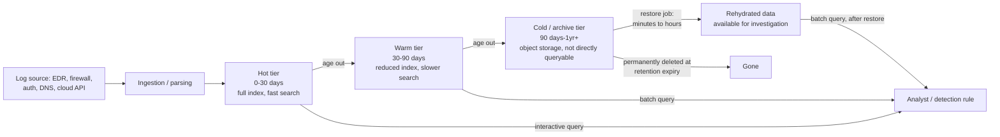

# Part XLIV — Data Retention

## The question retention actually answers

Every retention policy is really answering one question in advance, before anyone knows what
the incident will be: *"When we find out something bad happened N days after it started, will the
evidence still exist?"*

[CONCEPT] Retention windows are usually set by a mix of license cost, storage cost, and whatever
number sounded reasonable in a compliance meeting. They are almost never set by asking "what is
the longest realistic gap between initial compromise and detection for the threats we actually
face?" That gap — dwell time — is the number that should drive the decision, and it is
consistently longer than people assume, especially for patient adversaries (ransomware
pre-encryption staging, business email compromise, insider access abuse, nation-state espionage
with living-off-the-land tradecraft that never trips a signature).

[MANAGEMENT] The uncomfortable truth: retention is a bet made under uncertainty, and the
premium is paid every day whether or not you ever need it, while the payout only arrives on the
one day you do. That asymmetry is why retention decisions deserve the same rigor as any other
control decision — not "let's do 90 days, that sounds thorough."

## The four windows, and what each one actually buys

| Window | What it reliably covers | What it silently loses | Typical driver |
|---|---|---|---|
| 7 days | Fast-moving incidents caught by real-time alerting: commodity malware, obvious brute force, noisy ransomware detonation | Any investigation that starts more than a week after root cause; almost all initial-access reconstruction for slow intrusions | Free/low tiers of SaaS logging, default cloud provider console retention, cost-constrained SIEM ingestion |
| 30 days | Most alert-driven investigations where detection happens within days to a few weeks of the triggering event; a full calendar month of business cycle | Investigations triggered by a third-party notification, a delayed EDR alert on a dormant implant, or a breach discovered during an audit | Common regulatory floor (e.g., many frameworks treat 30 days as a baseline for "immediately available" logs), common default in cloud-native log services |
| 90 days | Quarter-length billing/business cycles; catches the median-to-upper range of dwell time for many opportunistic and commodity-ransomware intrusions; usually enough to reconstruct a full attack chain if detection happens within the quarter | Long-dwell espionage-style intrusions, intrusions discovered via a partner/vendor breach notification months later, "we just noticed weird billing" discoveries | PCI DSS-style requirements (commonly cited as 1 year total with a subset immediately available — verify current requirement text for your assessment, do not treat this chapter as compliance guidance) |
| 1 year | Reconstructing the full lifecycle of low-and-slow intrusions, insider cases that unfold over months, supply-chain compromises where the vulnerable window and the exploitation window are far apart | Anything predating the window; also the tier most likely to be *technically* retained but *practically* unusable if nobody tested restoring it | Regulatory mandates, cyber insurance conditions, high-value/high-target environments, post-incident policy tightening after "we wish we'd had that" |

[HUNTER'S NOTE] Retention windows are usually discussed in whole numbers of days as if evidence
decays gracefully. It doesn't. It falls off a cliff at the rotation boundary. The investigation
that needed day 91 is not "10% harder" than the one that needed day 89 — it's often impossible.

## Hot vs. cold/archive: the tradeoff nobody wants to say out loud

[ENGINEERING] "Retention" and "availability" are not the same axis, and conflating them is where
most policies go wrong.

- **Hot storage** — indexed, queryable in seconds to low minutes, expensive per GB per day,
  usually what people mean when they say "our SIEM." This is where correlation rules run and
  where analysts pivot interactively.
- **Warm storage** — still searchable but slower (query against object storage with delayed
  indexing, or a secondary tier with reduced replication/indexing), cheaper than hot.
- **Cold/archive storage** — object storage (S3-class, blob storage, tape in some regulated
  shops), cheap per GB, but not directly queryable. Getting data out means a restore/rehydration
  job that can take minutes to (for real tape or deep archive tiers) many hours, plus re-ingestion
  or a separate query tool that understands the archive format.

**Engineering Reality**: an archive tier that has never had a real restore drill run against it
is a retention policy that exists on paper only. Schema drift is the silent killer — if your
parser, field extractions, or index structure changed eighteen months ago, the data you "retained"
from before that change may not map cleanly onto today's detection content or dashboards without
manual rework. Retention without periodic restore testing is a compliance checkbox, not a
forensic capability.



[SOC MANAGEMENT VIEW] The realistic cost curve is not linear. Doubling hot retention from 30 to
60 days can meaningfully move the SIEM license/ingest bill because most commercial pricing is
tied to indexed volume × retention. Moving the same data from hot to cold after 30 days, and
keeping it there for a year, is often 5-20x cheaper per GB depending on platform. The decision
that actually matters is rarely "30 days vs. 90 days hot" — it's "what's hot, what's cold, and how
fast can cold become useful when we need it." A policy of "90 days hot, 1 year cold, with a tested
90-minute restore SLA" is usually both cheaper and more forensically capable than "90 days hot,
nothing else."

## The cost-vs-forensic-value decision, stated plainly

Nobody can afford infinite hot retention of everything. The actual decision an organization makes
— whether they admit it or not — is a triage across three variables:

1. **Which log sources are cheap to retain long and expensive to lose?** Authentication logs,
   DNS query logs, process-creation telemetry, and cloud API audit logs (control-plane activity)
   are typically small per event and disproportionately valuable months later. Full packet
   capture and verbose proxy/web logs are typically huge and much less likely to still matter
   at 90+ days.
2. **What's the realistic dwell time for the threats that actually target this environment?**
   A mass-market ransomware affiliate chasing opportunistic access behaves differently from a
   targeted intrusion set doing reconnaissance for months. Vendor threat intelligence reports on
   dwell time (Mandiant's annual M-Trends report is the most commonly cited source in the
   industry) are useful for calibration — but treat the exact published number as a moving
   target that changes year to year and varies hugely by industry vertical; don't hard-code last
   year's figure into this year's retention justification.
3. **What can legal, regulatory, or contractual obligations force regardless of forensic
   preference?** Litigation holds, breach notification laws, cyber insurance policy conditions,
   and sector-specific mandates can require retention well past what a pure cost/benefit analysis
   would choose. This is a compliance/legal decision, not a detection engineering one — but
   detection engineers are usually the ones who get asked "can we actually produce this," so know
   the answer before someone asks under pressure.

A practical tiering that reflects this triage, rather than a single blanket number:

| Data class | Suggested hot | Suggested cold | Rationale |
|---|---|---|---|
| Authentication / identity provider logs | 30-90 days | 1+ year | Small volume, disproportionately useful for reconstructing initial access and lateral movement months later |
| EDR process-creation / command-line telemetry | 30-90 days | 6-12 months | Core of most intrusion reconstruction; volume is manageable relative to value |
| DNS query logs | 14-30 days | 6-12 months | Cheap, high value for C2 and exfil hunting, often overlooked in retention planning |
| Cloud control-plane / API audit logs | 90 days | 1+ year | Frequently the *only* record of privilege changes and resource creation in cloud incidents |
| Firewall/network flow (NetFlow-style summaries) | 30 days | 6-12 months | Summarized flow is cheap to keep long; full packet capture is not — keep PCAP hot-only and short |
| Full packet capture | Hours to a few days | Rarely retained past that, if at all | Enormous volume for marginal added value beyond what flow + endpoint telemetry already gives you |
| Web proxy / verbose HTTP logs | 30 days | Optional, cost-dependent | High volume, value drops off faster than auth or process telemetry |

## Worked example: the investigation that lives or dies on the retention boundary

**Scenario (illustrative, not a real case).** An organization's EDR flags a suspicious scheduled
task creation on a domain controller on day 0 of the investigation. Triage shows it's a
persistence mechanism (`schtasks`-style task registration, MITRE ATT&CK **T1053.005** Scheduled
Task/Job: Scheduled Task) tied to a service account. The account's Kerberos ticket usage pattern
looks like credential replay from a workstation that isn't its normal source (**T1078** Valid
Accounts, and consistent with **T1550.003** Use Alternate Authentication Material: Pass the
Ticket if a ticket-forging technique is later confirmed).

The IR team's first question: *when did this account start being used from that workstation?*
That single question determines the whole scope of the investigation — is this a two-day
incident or a four-month one?

**With 30-day retention:** authentication logs go back 30 days. The team finds the account was
already being used from the anomalous workstation 25 days ago — right at the edge of the window.
They cannot rule out that it started earlier. Scope is reported as "at least 25 days, unable to
determine true start," which is operationally almost as bad as "unknown," because containment and
notification decisions (what has to be rotated, what has to be disclosed, whose data was
potentially reachable during the window) all hinge on the true start date. The organization ends
up making conservative, expensive assumptions (rotate everything, notify broadly) purely because
the data to narrow the scope doesn't exist.

**With 1-year retention (even cold-tier only):** the same query, rerun after a restore job, shows
the anomalous usage pattern actually starts 97 days earlier, immediately following a phishing
click recorded in email gateway logs that are still in the cold tier. That phishing log entry
links to a specific delivered payload, which links to an EDR process-creation event for the
initial foothold (also still available, because process-creation telemetry was in the 6-month
cold tier). The investigation goes from "unscoped identity compromise, notify broadly" to "single
initial-access vector, contained lateral movement path, specific and defensible notification
list." The cost difference to the business between those two outcomes — legal exposure, customer
notification scope, regulatory scrutiny — is almost always larger than years of the incremental
storage cost that made the second outcome possible.

**Illustrative hunt query** (Splunk SPL style) for the pivot that only works if the data exists
far enough back — searching cold/archived indexes for early activity of the anomalous
account/workstation pair before assuming a start date:

```spl
| tstats summariesonly=false count
    FROM datamodel=Authentication
    WHERE Authentication.user="svc-backup-01"
    BY _time span=1d Authentication.src
| eval days_ago = round((now() - _time) / 86400)
| sort - days_ago
```

Run against a SIEM where indexes older than 30 days have already rolled to frozen/archive, this
returns nothing past day 30 unless someone has thawed the archived buckets first — which is
exactly the operational gap that turns "we don't have the data" into "we have the data but nobody
budgeted the two hours to restore it during an active incident." That restore step should be a
documented, drilled runbook item, not something improvised at 2 a.m.

**Illustrative hunt query** (KQL, Microsoft Sentinel style) for the same early-activity pivot
against a source with a longer native window, useful for showing the contrast:

```kql
SigninLogs
| where UserPrincipalName == "svc-backup-01@contoso.com"
| where TimeGenerated > ago(180d)
| summarize FirstSeen=min(TimeGenerated), LastSeen=max(TimeGenerated) by DeviceDetail.deviceId
| order by FirstSeen asc
```

## Detection Autopsy: "keep everything hot for 30 days, then delete"

**Original logic:** a mid-size org set every log source to 30 days hot retention, nothing
archived, because that was the default license tier and "30 days felt like enough — most of our
alerts fire same-day anyway."

**Why it looked reasonable:** almost all of their historical alerts *were* resolved within a
week. The 30-day number was validated against their own alert-response history, which felt like
due diligence.

**What breaks in production:** the policy was validated against *known, alerted* incidents, not
against the undetected dwell time of intrusions that hadn't been caught yet — survivorship bias
in the data used to justify the retention window. When a business email compromise was reported
by a customer's bank three months after the mailbox rule was planted, the org had no
authentication history left to determine how the attacker first got in, whether other mailboxes
were touched, or whether the access was still ongoing through a different account.

**False positives / false negatives introduced:** not a detection rule in the traditional sense,
but the retention policy produced a scoping false negative — the investigation concluded "no
evidence of lateral movement beyond the reported mailbox" purely because evidence of lateral
movement, if it existed, had already been deleted. Absence of evidence was reported (initially,
before someone caught the caveat) as evidence of absence.

**Missing context:** nobody had modeled dwell time against their actual threat profile (BEC
against finance-adjacent staff, external reports as the most likely detection trigger) before
setting the number.

**Revised analytic (policy, not a query):** authentication and mailbox audit logs moved to
90 days hot / 18 months cold; a quarterly restore drill added to confirm the cold tier is
actually queryable within a defined SLA; a lightweight standing hunt added to check for
mailbox forwarding rule creation (a common BEC persistence indicator, **T1114.003** Email
Collection: Email Forwarding Rule) across the full retained window, not just the alert window.

**How it was tested:** a tabletop exercise reran the actual BEC case against the new policy,
simulating "discovery" at day 95 instead of day 3, and confirmed the account's mailbox rule
creation and anomalous sign-in were both still recoverable from cold storage within the drilled
restore time.

**Result:** the same class of incident, replayed against the new policy, produced a scoped,
defensible timeline instead of an unresolved gap — at a cold-storage cost increase that was a
small fraction of the hot-tier cost it would have taken to get the same coverage entirely in the
expensive tier.

## Hunting for retention gaps themselves

The meta-detection here is worth building: alert when a log source that should be continuously
present goes quiet, because that gap is either a broken pipeline or an attacker clearing evidence
(**T1070** Indicator Removal, **T1070.001** Clear Windows Event Logs). This is a retention-adjacent
detection because a silent pipeline failure *is* a retention failure — the data you thought you
were keeping was never landing in the first place.

**part44-01 — Log Source Heartbeat Gap** *(illustrative KQL, Sentinel-style)*:

```kql
Heartbeat
| where TimeGenerated > ago(2d)
| summarize LastHeartbeat = max(TimeGenerated) by Computer
| where LastHeartbeat < ago(6h)
| project Computer, LastHeartbeat, HoursSinceLastSeen = datetime_diff('hour', now(), LastHeartbeat)
```

[DETECTION ENGINEER] Tune the gap threshold per source type — a workstation going quiet
overnight is normal; a domain controller's Security event channel going quiet for six hours is
not. Baseline expected event volume per host role before setting the threshold, and pair this
with change-management data (planned maintenance windows) to suppress expected gaps rather than
hard-coding a blanket exception, which attackers can learn and time around.

[THREAT HUNTER] When you find a genuine unexplained gap, don't just restart the forwarder and
move on — check whether **any** events exist immediately before the gap that would explain it
(service stop events, log-clearing events like Windows Event ID 1102 for Security log clear or
104 for other logs, EDR agent tamper alerts). A gap with a clean shutdown event before it is
probably infrastructure. A gap with nothing at all, or a log-clear event, deserves an incident.

**part44-02 — Retention-Boundary Straddle Hunt**: whenever an investigation's estimated start
date is within a defined margin (for example, 10%) of any storage tier's rotation boundary, treat
the true start date as unresolved rather than confirmed, and immediately trigger the cold-storage
restore procedure instead of waiting to see if it's needed. This is a process hunt rather than a
query — the "detection" is a documented trigger condition in the IR runbook.

> **[SCREENSHOT PLACEHOLDER — CONTROLLED LAB]** — a SIEM index/storage-tier configuration screen
> (e.g., a Splunk index's frozen/thawed path settings, or an Elastic ILM policy showing hot/warm/
> cold/delete phase transitions) captured from a real lab SIEM instance, illustrating where the
> rotation-age thresholds are actually configured and how they map to the "days" numbers discussed
> in this chapter.

> **[SCREENSHOT PLACEHOLDER — CONTROLLED LAB]** — Sysmon or Windows Security Event Log properties
> dialog captured via a lab Windows host, showing the configured maximum log size and the
> resulting effective retention (log rotates on size, not time, so a busy host can silently retain
> far fewer days than a quiet one at the same "size" setting) — a concrete illustration of why
> retention is not purely a policy setting.

**CONCEPTUAL SAMPLE** (not captured evidence) of the kind of log-clear event that should always
be treated as high priority regardless of retention tier, since it directly threatens future
investigative capability:

```
EventID=1102  Channel=Security  Computer=DC01.contoso.local
Message: The audit log was cleared.
Subject: Security ID: CONTOSO\svc-backup-01  Account Name: svc-backup-01
```

## Tuning and testing a retention policy like a detection

Treat retention as something you validate, not something you configure once:

- **Replay past incidents against proposed windows.** For every real investigation in the last
  two years, note how far back the team actually needed to query. That distribution — not a
  vendor default — should set your hot/cold boundary.
- **Drill the restore path on a schedule**, and time it. A restore SLA that isn't measured
  quarterly is a number someone made up.
- **Watch for schema/parser drift** across the retention window. If field extractions changed,
  confirm old data still resolves correctly in current dashboards and detection content before you
  need it under pressure.
- **Separate "retained" from "searchable."** Many teams discover during a real incident that data
  technically exists in an S3 bucket but nothing in their stack knows how to query it without
  custom tooling built on the spot. Build and test that tooling in peacetime.
- **Reassess after every incident** where retention was a limiting factor, and after every
  incident where it wasn't but came close (the "day 25 out of 30" cases) — those near-misses are
  free information about where your real threshold should be.

## Summary

Retention is a forensic-capability decision wearing a cost-management costume. The right question
is never "how many days can we afford," it's "what is the longest realistic detection delay for
the threats we actually face, and can we still answer 'when did this start' when that delay
happens." Hot storage buys speed; cold storage buys reach; neither is worth anything if nobody has
tested pulling data back out of it under time pressure.
