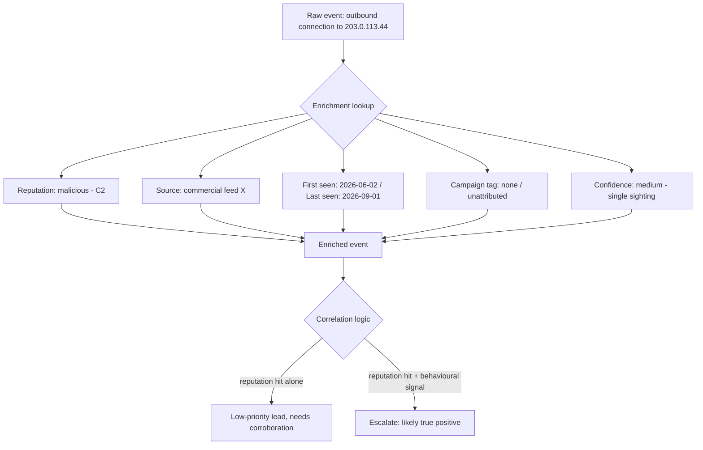

# Part XLV — Threat Intelligence in Detection

Threat intelligence gets bolted onto detection pipelines in a specific, predictable way: someone
buys or subscribes to a feed, a script pulls hashes/IPs/domains into the SIEM as a lookup table,
and a correlation rule fires "match found in threat intel list." This is not threat intelligence
in detection. It is a blocklist with better marketing. Actual threat-intel-driven detection means
using indicators as one weighted input alongside behavioural evidence, tracking how much you trust
each source and each indicator, and being explicit about what an indicator match does and does not
prove.

This part covers the mechanics — enrichment, reputation, confidence, indicator lifecycle, source
quality — and spends real time on the single most common analyst error in this space: treating a
reputation hit as equivalent to a confirmed incident.

## 45.1 What an indicator actually tells you

[CONCEPT] An indicator of compromise (IOC) — a hash, IP, domain, URL, mutex name, registry key,
certificate fingerprint — is a *fact about a past observation*, not a property of the object
itself. "This hash was seen in an Emotet campaign in March" is a historical claim about
context, not a chemical property of the file. The file itself does not know it is malicious.

This distinction matters because it determines what a match can and cannot tell you:

| Indicator type | What a match tells you | What it does NOT tell you | Attacker evasion cost |
|---|---|---|---|
| File hash (MD5/SHA1/SHA256) | This exact byte sequence was seen before, tied to a report | Whether *this* file on *this* host is currently doing anything | Trivial — recompile, repack, or append a byte |
| IP address | This address was associated with malicious infrastructure at some point | Whether it still is (IPs get reallocated, shared hosting, CDN churn) | Cheap — rotate infrastructure, use residential proxies |
| Domain | This domain was registered/used for malicious purposes | Whether it's still live, whether DNS now points elsewhere | Cheap — domain generation algorithms, fast-flux, expired-domain reuse |
| YARA/behavioural rule match | The sample exhibits a described code pattern or behaviour | Intent or current activity on the host | Moderate — pattern is more resistant than a hash but still evadable with repacking/obfuscation |
| TTP-level indicator (e.g. specific LOLBin chain) | The *technique* was used, independent of specific artifacts | Which actor, unless corroborated by other TTPs | Highest cost to evade — this is why Pyramid of Pain ranks TTPs above atomic indicators |

**Hunter's Note:** if your enrichment pipeline treats a hash match and a TTP match with the same
confidence weight, you have already lost the fidelity that threat intel was supposed to add. Rank
your indicator types by durability before you rank them by source.

This maps directly onto David Bianco's Pyramid of Pain (hash → IP → domain → network/host
artifact → tool → TTP), which is worth internalizing as a mental model even though this part
doesn't reproduce it in full: the higher up the pyramid an indicator sits, the more it costs the
attacker to change, and the more durable your detection built on it will be.

## 45.2 Enrichment: what it is actually for

[DETECTION ENGINEER] IOC enrichment means attaching context to an observable that already
appeared in your telemetry — it is a *lookup*, not a *detection trigger* by itself in a
well-designed pipeline (more on why in 45.5). The context you want attached:

- **Reputation score** — a vendor's or feed's assessment, usually a number or category (malicious/
  suspicious/clean/unknown)
- **Confidence** — how sure the source is that the classification is correct, separate from how
  bad the classification is
- **First seen / last seen** — when the indicator was first associated with malicious activity and
  when it was most recently observed as active
- **Associated campaign/actor** — if a source ties the indicator to a named cluster, group, or
  campaign (with the caveat in 45.4 about how loose that attribution usually is)
- **Indicator type and specificity** — is this a single file hash or an entire /16 CIDR block
  someone tagged "malicious" because one host in it beaconed once
- **TLP / handling marking** — Traffic Light Protocol marking governing who the intel can be
  shared with, relevant for sharing outward, not usually for detection logic itself



[ENGINEERING] The practical failure mode here is treating enrichment as a side-channel annotation
that analysts read *after* an alert fires, rather than a field available *at query time* for
correlation logic to weight. If your SIEM only shows "VT: malicious" in a drilldown panel three
clicks deep, the enrichment isn't doing detection work — it's doing documentation work. To make
enrichment actually change detection outcomes, the reputation/confidence/first-seen fields need to
be joinable at index time or query time, not just displayed.

**Engineering Reality:** most "threat intel integration" projects stall at the ingestion step —
someone gets the feed into a lookup table — and never get to the correlation-logic step where the
enriched fields actually change a rule's severity or suppress/promote an alert. Budget for the
second half of the project; it's the half that produces value.

## 45.3 Reputation scoring and confidence — two different axes

[CONCEPT] These get conflated constantly. They are orthogonal:

- **Reputation / severity** answers: *if this classification is correct, how bad is it?*
- **Confidence** answers: *how sure is the source that the classification is correct?*

A vendor aggregator that reports "58/91 engines flag this as malicious" is giving you an engine
*consensus count*, which people read as confidence, but it's really neither reputation nor
confidence in a rigorous sense — it's a popularity vote among heuristic and signature engines that
frequently share underlying detection logic (so the 58 are not 58 independent opinions). A single
sandbox detonation showing C2 beaconing behaviour, from a source with no consensus count, can be
higher actual confidence than a 58/91 hit driven by generic packer heuristics.

[DETECTION ENGINEER] A workable model separates the two explicitly, e.g. on a coarse scale:

| Confidence | Meaning | Example |
|---|---|---|
| High | Multiple independent, high-fidelity sources agree; behavioural evidence corroborates | Sandbox detonation + static YARA match + prior incident linkage |
| Medium | Single reputable source, no independent corroboration | One commercial feed with no supporting detonation report |
| Low | Automated/heuristic-only, no manual review, or aged out | Generic AV engine heuristic flag with no named family |
| Unknown/Unverified | Crowd-sourced or unvetted submission | Community feed entry with no source attribution |

Store confidence and reputation as separate fields on the enrichment record. Don't collapse them
into one "threat score" unless you also keep the components, because a high threat score built
from low confidence plus high severity behaves very differently in a correlation rule than one
built from high confidence plus medium severity — and analysts triaging the alert need to know
which.

## 45.4 First seen, last seen, and indicator expiration

[CONCEPT] Indicators decay. Infrastructure gets reallocated (an IP that hosted a C2 panel in June
might be a legitimate cloud tenant's address by September), domains expire and get re-registered
by unrelated parties, and file hashes for actively-developed malware families get superseded by
new builds within days.

- **First seen** tells you how long the indicator has been circulating in intel sources — useful
  for judging whether defenses have plausibly already adapted.
- **Last seen** tells you how recently the indicator was still observed as active. This is the
  field most feeds handle worst; many never update it once ingested, so "last seen" quietly
  becomes "last seen by the vendor's crawler," not "last seen as malicious in the wild."
- **Indicator expiration / TTL** — how long you keep trusting a match. IP and domain indicators
  should have short TTLs (days to a few weeks) unless there's a reason to believe the
  infrastructure is durable (dedicated bulletproof hosting, long-lived actor infra). File hashes
  can be kept longer since a specific binary doesn't get reallocated to an innocent party the way
  an IP does — but the *absence* of a hash match tells you nothing about a recompiled variant.

**Detection Autopsy — the stale-IP blocklist rule**

*Original logic:* a correlation rule alerts (severity: high) whenever any outbound connection
matches an IP on a commercial threat feed's "malicious" list, ingested nightly, with matches never
expired — the lookup table only grows.

*Why it looked reasonable:* threat feed, high-severity classification, seems like an obvious
automatic win. Vendor markets it as "block/alert on known bad infrastructure."

*What breaks in production:* eight months in, the table has tens of thousands of IPs, a meaningful
fraction of which have since been reassigned by cloud providers (AWS/Azure/GCP churn ranges) to
unrelated tenants. The SOC starts seeing alerts on connections to what is now, factually, a SaaS
vendor's load balancer. Analysts learn to dismiss "threat intel match" alerts on sight because the
false-positive rate has crept past 90%. Meanwhile a real, fresh C2 IP with a two-day-old first-seen
timestamp gets buried in the same queue as three-year-old stale garbage, at the same severity.

*False positives:* IP reallocation, shared hosting/CDN ranges, indicators originally tagged from a
single low-confidence sighting.

*False negatives:* the rule creates a false sense of coverage — leadership sees "threat intel
integrated" on a slide and assumes IOC-based detection is handled, while the actual signal is
drowned by noise and increasingly ignored.

*Missing context:* no confidence field, no last-seen enforcement, no decay/expiration, no
distinction between infrastructure type (dedicated actor VPS vs. shared cloud range).

*Revised analytic:* split into two paths. (1) Fresh indicators (first-seen within a rolling
30-day window, from sources with documented medium+ confidence) feed a higher-severity alert,
still requiring at least one corroborating behavioural signal (see 45.5) before paging anyone.
(2) Older/lower-confidence matches feed a hunting queue, reviewed in batch, not an interrupt-driven
alert. Indicators auto-expire from the "fresh" bucket at 30–45 days unless re-confirmed by the
source, and IP-type indicators specifically get a shorter TTL than hash-type indicators.

*How it was tested:* replayed six months of the feed's historical IP list against six months of
real (labeled, from prior incident review) DNS/proxy logs; measured alert volume and true-positive
rate before/after adding the freshness split and corroboration requirement.

*Result:* alert volume from this source dropped by roughly an order of magnitude in the replay;
the handful of surviving fresh+corroborated alerts included the two prior confirmed true positives
in the test window, with no stale-IP noise reaching the interrupt queue.

## 45.5 The corroboration problem: "VirusTotal says malicious" is not an incident

This is the section to actually internalize.

[CONCEPT] A reputation-engine hit is a claim about an *object*, made by tools that themselves
produce false positives, operate on stale data, and — critically — often share underlying
detection logic across "independent" engines (many AV engines license or derive signatures from
the same handful of upstream research teams, so a high hit-count is not N independent
confirmations). A reputation hit tells you *this specific artifact has a reputation*. It does not
tell you:

- That the artifact executed on the host in question
- That it executed successfully, rather than being blocked, quarantined, or failing to run
- That it did anything observable on this specific host
- That the "malicious" verdict wasn't a generic packer/obfuscation heuristic that also fires on
  legitimate software (packed/UPX-compressed freeware, some game anti-cheat drivers, and
  homegrown internal tools trigger this routinely)
- That the file wasn't a false positive from a signature that's simply too broad
- That the *IP/domain* is still associated with the same infrastructure it was when the report
  was written

**The fallacy in one sentence:** "reputation says bad" plus "reputation-worthy things are bad"
does not equal "an incident occurred here," because the missing premise — *this artifact was
actually present and active in this environment, in a way that matters* — has not been checked.

[ANALYST] The corroboration an analyst should look for before escalating a reputation-only hit to
an incident:

| Corroborating evidence | Why it matters |
|---|---|
| Process execution evidence (Sysmon Event ID 1 / EDR process-creation telemetry) showing the flagged binary actually ran | Confirms presence isn't just "file exists on disk, never executed" (e.g. sitting in a download folder, an email attachment quarantine, an install cache) |
| Network behaviour consistent with the reported family (specific beacon interval, User-Agent, JA3/JA3S fingerprint, destination port pattern) | A hash match with *no* matching network behaviour suggests either a false positive or a variant that no longer behaves as reported |
| Persistence artifacts (registry Run keys, scheduled tasks, services, WMI subscriptions) appearing around the same timestamp | Confirms the actor is trying to survive reboot, consistent with actual compromise rather than a one-off download |
| Parent/child process lineage matching known delivery chains for that family | Distinguishes "the flagged file was launched by a browser download" from "it was launched by a macro-enabled document that also spawned PowerShell" |
| Multiple independent indicator types converging (hash + C2 IP + known mutex/registry artifact all present) | Independent-type convergence is much stronger evidence than one type at high confidence |
| Timeline plausibility (does the first-seen date of the intel predate or postdate the observed activity in a sensible way) | A "match" against an indicator first reported three years after the observed activity in your environment is likely a coincidental hash collision in a shared library or a benign file, not the reported campaign |

[DETECTION ENGINEER] Build this into the correlation logic itself, not just analyst SOP. A
reputation match alone should raise a *lead*, not an *incident-severity alert*, unless it's paired
with at least one behavioural signal from your own telemetry.

**Illustrative Sigma-style detection (conceptual — adapt field names to your schema):**

```yaml
title: Reputation Match Corroborated by Process Execution and Network Beacon
id: part45-01
status: experimental
description: >
  Escalates a threat-intel reputation match to high severity only when
  paired with local process-execution evidence and outbound network
  activity consistent with C2 behaviour, rather than alerting on the
  reputation match alone.
logsource:
  category: process_creation
  product: windows
detection:
  ti_match:
    ThreatIntelMatch: true
    ThreatIntelConfidence|gte: 'medium'
    ThreatIntelFirstSeenDaysAgo|lte: 45
  process_evidence:
    EventID: 1
    Image|contains:
      - '\Temp\'
      - '\Downloads\'
  network_corroboration:
    DestinationPortRepeats|gte: 5
    BeaconIntervalVariance|lte: 0.15
  condition: ti_match and process_evidence and network_corroboration
falsepositives:
  - Software update checkers with regular polling intervals
  - Legitimate telemetry/beacon-style SaaS agents
level: high
tags:
  - attack.command-and-control
```

The point of this analytic isn't the exact field names (your EDR/SIEM schema will differ) — it's
the *shape*: reputation match is a necessary condition, not a sufficient one, and it's ANDed with
independently-sourced behavioural evidence before the severity goes up.

**Illustrative KQL sketch (Microsoft Sentinel-style, conceptual):**

```kql
DeviceProcessEvents
| where InitiatingProcessCommandLine has_any ("Temp", "Downloads")
| join kind=inner (ThreatIntelIndicators
    | where ConfidenceScore >= 50
    | where datetime_diff('day', now(), FirstSeenTimestamp) <= 45
  ) on $left.SHA256 == $right.FileHashValue
| join kind=inner (DeviceNetworkEvents
    | summarize ConnCount = count(), IntervalStdDev = stdev(1.0 * datetime_diff('second', prev(Timestamp), Timestamp))
      by DeviceId, RemoteIP
    | where ConnCount >= 5 and IntervalStdDev < 5.0
  ) on DeviceId
| project Timestamp, DeviceName, FileName, SHA256, ConfidenceScore, RemoteIP, ConnCount
```

[THREAT HUNTER] Flip this around for hunting: don't wait for a reputation hit at all. Take TTP-level
indicators — a described beacon interval, a specific registry artifact, a named persistence
mechanism from a threat report — and hunt for *those*, independent of whether any hash in that
report matches anything in your environment. The report's hashes will be stale in a month; the
described technique often isn't. This is also how you catch a variant of a known family that
nobody's submitted to a reputation engine yet.

**SOC Management View:** if leadership asks "are we protected against \[named campaign\]" because
a vendor report listed IOCs, the honest answer distinguishes two very different things: "we've
loaded the IOCs into our feed" (low assurance, decays within weeks) versus "we've built a
detection for the described technique and validated it against a simulation" (durable assurance).
Budget and staffing conversations should track the second, because it's the one that still works
after the actor rotates infrastructure — which is the median outcome within days of a report's
publication.

## 45.6 Source quality assessment

[CONCEPT] Not all feeds are equal, and "how many indicators does it contain" is close to an
inverse quality metric — feeds optimized for volume tend to ingest low-confidence, unvetted
submissions to keep the count impressive.

Dimensions worth scoring a source on:

- **Provenance** — does the source explain *how* an indicator was derived (sandbox detonation,
  honeypot capture, incident response finding) or is it an opaque aggregation of other feeds
  (aggregation-of-aggregations compounds staleness and false positives)
- **Timeliness** — lag between the observed activity and the indicator's publication
- **Specificity** — atomic indicators (single hash/IP) vs. overbroad ranges (entire ASN or /16
  tagged from one bad host)
- **False-positive history** — track this yourself. Log every reputation-only alert and its
  eventual disposition; a source that's wrong 80% of the time on your traffic should have its
  matches weighted down or routed to hunting-only, regardless of vendor marketing.
- **Update discipline** — does the source retract or expire indicators, or only ever add
- **Context richness** — does it provide campaign/actor tagging with a documented confidence and
  methodology, or a bare label with no explanation

**SOC Management View:** track false-positive rate *per source* over time and revisit the feed
budget annually against that data, not against the vendor's indicator count. A feed with 2 million
indicators and a 95% false-positive rate on your environment is worse than a feed with 20,000
indicators and a 20% false-positive rate — it costs the same license fee and consumes far more
analyst time for less true-positive yield.

## 45.7 Campaign and actor context — handle attribution loosely

[CONCEPT] When a source ties an indicator to a named campaign or actor (e.g., a cluster tracked
under a vendor-specific designation), treat that tag as a *hypothesis about shared infrastructure
or tooling*, not a courtroom-grade identity claim. Attribution in threat intel is built from
overlapping technical indicators, infrastructure reuse, and sometimes language/timezone/targeting
patterns — it is probabilistic, vendor-naming schemes for the same underlying activity cluster
often disagree with each other, and infrastructure gets reused or sold between operators.

[ANALYST] The operational value of a campaign tag isn't "now we know who did this" — it's "now we
know what else to look for," because a campaign tag usually comes with a described toolset and
TTP chain. Use it to expand your hunt (pull the rest of that campaign's described TTPs and check
for them), not to write "attributed to \[actor\]" in an incident report unless your own evidence
independently supports it.

## 45.8 A worked example: from feed ingestion to a tuned detection

Walking one indicator through the full lifecycle:

1. **Ingestion**: a commercial feed publishes an IP (203.0.113.44) tagged malicious, C2,
   confidence medium, first-seen 2026-08-30, associated with an unattributed cluster tracked
   internally as "Cluster-14."
2. **Enrichment record created**: reputation=malicious, confidence=medium, first_seen=2026-08-30,
   last_seen=2026-09-10, ttl=30 days, source=Feed-X, campaign=Cluster-14 (unverified).
3. **Passive matching begins**: proxy/firewall logs are checked against the enriched lookup table
   continuously; a match on 2026-09-12 generates a *lead*, not an alert, because it's reputation-only.
4. **Corroboration check** (automated, per section 45.5): does the connecting host also show
   process-creation telemetry for a process spawned from an unusual parent within the last 24
   hours? In this case, yes — a signed but unusual binary spawned from a scheduled task created
   the same day.
5. **Escalation**: lead is promoted to a high-severity alert with both pieces of evidence attached.
6. **Analyst triage**: confirms scheduled task persistence, pulls process tree, confirms outbound
   beacon interval (approximately every 300 seconds, consistent with a generic C2 framework's
   default jitter, not exclusive to Cluster-14 specifically — worth noting in the case record as a
   caveat, not a confirmation of attribution).
7. **Hunt expansion**: hunter takes the described TTP (scheduled-task persistence + this beacon
   pattern) and searches across the fleet for the *pattern*, independent of the specific IP, since
   the IP will rotate. Finds one additional host with the same scheduled-task creation pattern but
   a different destination IP not on any feed yet — a genuine variant catch that pure IOC matching
   would have missed.
8. **Indicator lifecycle close-out**: the confirmed-malicious IP is kept in the high-confidence
   bucket past its normal TTL (re-confirmed by internal incident evidence, not just the vendor),
   while the general feed entry still expires on schedule unless the vendor republishes it.

This is what "threat intelligence in detection" is supposed to look like end to end: enrichment
feeding a lead, corroboration promoting the lead, the case expanding via TTP-level hunting rather
than stopping at the original atomic indicator, and the indicator's confidence/lifecycle being
updated based on what was actually confirmed in the environment — not left as a static blocklist
entry.

## 45.9 Telemetry and engineering notes

[ENGINEERING] Practical requirements for making any of the above work:

- Enrichment fields (reputation, confidence, first/last seen, source, TTL, campaign tag) need to be
  structured and queryable, not free text buried in a comment field.
- Track provenance *of the enrichment itself* — when your pipeline enriched the event, from which
  feed version, so a later feed correction can be reconciled against historical alerts.
- Expire cached indicator matches on a schedule; don't let a lookup table grow forever with no TTL
  enforcement (this was the root cause in the Detection Autopsy above).
- Log the disposition of every reputation-only lead (true positive / false positive / inconclusive)
  to build your own per-source quality metric — this is the single most useful dataset for the
  SOC Management source-review conversation in 45.6.

> **[SCREENSHOT PLACEHOLDER — CONTROLLED LAB]** — a honeynet attacker session (real host class:
> honeynet capture on CT103-style enrichment pipeline) showing a raw connection log line before
> enrichment, and the same event after enrichment fields (reputation, confidence, first/last seen,
> source) are joined on, to illustrate the specific fields discussed in 45.2 rather than describing
> them abstractly.

**CONCEPTUAL SAMPLE — raw vs. enriched log line (illustrative, not captured):**

```
# raw
2026-09-12T14:02:31Z proxy ALLOW src=10.4.2.17 dst=203.0.113.44 port=443 bytes=4820

# enriched
2026-09-12T14:02:31Z proxy ALLOW src=10.4.2.17 dst=203.0.113.44 port=443 bytes=4820
  ti_match=true ti_source=Feed-X ti_confidence=medium ti_reputation=malicious
  ti_category=c2 ti_first_seen=2026-08-30 ti_last_seen=2026-09-10 ti_ttl_days=30
  ti_campaign=Cluster-14(unverified)
```

## 45.10 Summary checklist

- Separate reputation/severity from confidence — never collapse them into one score without
  keeping the components.
- Enforce indicator TTLs; IPs and domains decay faster than file hashes.
- Never let a reputation-only match reach incident severity without at least one independently
  sourced behavioural corroboration (process execution, network behaviour, persistence artifact).
- Treat campaign/actor tags as hypotheses that expand your hunt scope, not attribution to put in an
  incident report without independent evidence.
- Score your own sources on your own false-positive data, not vendor indicator counts.
- Hunt at the TTP level using intel reports as a starting point, not just the atomic indicators
  listed in them — those are usually stale before the report finishes review.

**MITRE ATT&CK note:** this part is technique-agnostic by design — threat intel enrichment applies
across the matrix — but the corroboration example in 45.5/45.8 touches Command and Control
(TA0011, particularly T1071 application-layer-protocol behaviour and T1105 ingress tool transfer)
and Persistence via scheduled task (T1053.005), used illustratively rather than as the chapter's
core subject.
