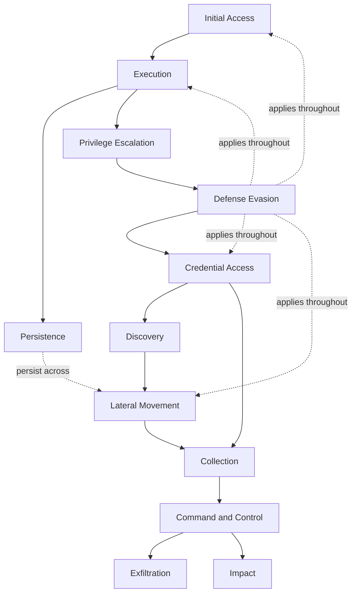
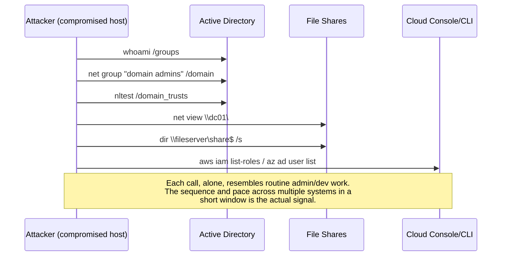

# Part XLVI — Adversary Tradecraft: A Defender View

Earlier parts of this handbook went deep on specific telemetry domains — Windows event logs,
Sysmon, network, DNS, identity, cloud — and specific detection techniques — process trees, command
lines, baselining, correlation. This part inverts the lens. Instead of "here is a data source, what
can it see," it asks "here is a stage of an intrusion, what does it look like across every data
source you might have." It is a survey, not a deep dive — every section below cross-references the
part of the book where the corresponding telemetry or technique is treated in full, and points at
the gap between what ATT&CK describes and what a real SOC can actually observe.

The organizing structure is MITRE ATT&CK's tactic categories, because that's the shared vocabulary
most teams already use for coverage mapping — not because tactics are how attackers think about
their own operations. An intruder doesn't experience "now I am doing Discovery"; they experience
"I don't know what's on this network yet, let me find out." Keep that distinction alive when you
use this chapter for coverage planning: a tactic-by-tactic checklist tells you what *kinds* of
behaviour you might be blind to, not what a specific campaign will actually do, in what order, or
which techniques it will chain together to get the same outcome a different way.

**Engineering Reality:** ATT&CK tactic categories are not mutually exclusive and not sequential in
practice. A single `rundll32` invocation can simultaneously serve execution, defense evasion (LOLBin
masquerading as a legitimate process), and persistence (if it's launched from a scheduled task).
Building your coverage matrix as one technique-per-cell will systematically overcount coverage,
because a detection that fires on "T1055 process injection" often only fires for the one injection
API the analytic author tested, not the technique category as a whole.



That diagram is a simplification for orientation, not a claim that intrusions are linear. Ransomware
affiliates routinely do Discovery and Collection *after* initial Impact staging is already
half-built; some access-broker-to-ransomware handoffs skip straight from Initial Access to Impact
with almost no dwell time; APT-style operators can sit in Discovery/Collection for months before any
C2 traffic pattern changes enough to look interesting.

## 46.1 Initial Access (TA0001)

[CONCEPT] How the adversary gets a first foothold — a process running under their influence, on a
system they didn't control ten minutes ago.

| Technique (illustrative IDs) | What actually happens | Primary telemetry | Common evasion |
|---|---|---|---|
| T1566 Phishing (link, attachment, or in the last few years, delivered via a fake CAPTCHA/"paste this into Run" ClickFix-style page) | User is socially engineered into executing content or copying attacker-supplied commands themselves | Email gateway logs, EDR process creation, browser download events, clipboard-to-Run correlation (hard to get natively) | Legitimate cloud file-hosting for payload staging, HTML smuggling to defeat attachment scanning, living-off-clipboard so no file ever touches disk |
| T1190 Exploit public-facing application | Attacker sends crafted input to an internet-reachable service (VPN appliance, web app, edge device) | WAF/reverse-proxy logs, application logs, the appliance's own (often thin) logging, crash/restart telemetry | Edge appliances frequently have no forwarded logging at all — see the visibility gap note below |
| T1078 Valid accounts | Attacker authenticates with credentials obtained by phishing, stuffing, infostealer-log purchase, or MFA fatigue/push-bombing | Identity provider sign-in logs, VPN auth logs, impossible-travel/ASN anomalies | Looks identical to a real logon if the attacker got a real password; this is the hardest initial-access vector to catch on identity telemetry alone |
| T1195 Supply chain compromise | Trusted software, update channel, or open-source dependency is itself malicious | Code-signing anomalies, unexpected outbound connections from a trusted binary, SBOM/dependency-diff | Signed by a legitimately compromised certificate; behaves normally except for one added capability |
| T1133 External remote services | Attacker uses an exposed RDP/VPN/VDI/SSH endpoint with weak or reused credentials | Perimeter auth logs, VPN concentrator logs, geolocation on source IP | Credential stuffing at low velocity to stay under lockout thresholds |

Full identity-side detail is in Part VIII (Identity Detection Engineering); web-facing exploitation
detail is in Part XI (Web Detection Engineering); email-specific detection is in Part XII.

**Visibility gap:** the single most common Initial Access blind spot in mature Windows/EDR shops is
not on the endpoint — it's the edge. VPN concentrators, load balancers, and many SOAP/SSL-VPN
appliances (the kind repeatedly exploited in real-world campaigns over the last several years) ship
with logging that is disabled by default, rotates locally with no forwarding, or logs only
connection metadata with no request content. If you cannot answer "what HTTP requests hit our VPN
portal in the last 30 days," you have an Initial Access coverage gap regardless of how good your
endpoint detection is, because by the time a process executes on an internal host, Initial Access is
already over.

## 46.2 Execution (TA0002)

[CONCEPT] Getting code to actually run — a distinct step from getting access, and from persisting
that access.

Process-tree and command-line detection for this tactic is covered in depth in Parts VI and VII;
this section stays at the survey level.

- **T1059 Command and scripting interpreter** (PowerShell, cmd, bash, Python, JScript/VBScript via
  `wscript`/`cscript`, `mshta`) — the workhorse of modern intrusions because interpreters are
  present by default and their activity blends with legitimate admin scripting.
- **T1204 User execution** — the human clicks/runs something. Overlaps heavily with Initial Access;
  the distinction ATT&CK draws is that Execution is about the *mechanism* (what actually ran),
  Initial Access is about *how the opportunity arose*.
- **T1053 Scheduled task/job** and **T1569 System services** used for execution timing, not just
  persistence — a task can be created and fire once, minutes later, purely to get code running under
  a different session/context than the dropper.
- **T1047 WMI** and **T1218 System binary proxy execution (LOLBins)** — `rundll32`, `regsvr32`,
  `mshta`, `msbuild`, `installutil`, signed Microsoft binaries repurposed to execute attacker code so
  the parent-process/signature story looks clean.

**Detection Autopsy — "flag any PowerShell with `-enc`"**

*Original logic:* alert whenever a PowerShell command line contains `-enc` or `-encodedcommand`,
on the theory that only attackers base64-encode their PowerShell.

*Why it looked reasonable:* early commodity malware and many public offensive tool frameworks did
default to `-EncodedCommand` for obfuscation, so in a 2016-era test environment this rule had a
genuinely low false-positive rate and caught real tools.

*What breaks in production:* several legitimate management tools and a large fraction of
enterprise-authored deployment/config scripts also encode commands — some GPO-pushed logon scripts,
some RMM agents, some SCCM/Intune script deployments, and a fair amount of internally-written
automation that engineers wrote once, working, and never touched again. In any environment with more
than a handful of endpoints, this becomes a top-10-by-volume alert within a week, and gets silenced
or the analyst starts reflexively closing it without reading the decoded payload — which is worse
than not alerting at all, because it trains the human to ignore a real signal.

*Missing context:* the rule looks at the command line and stops. It never decodes the base64
payload, never checks the parent process, never checks whether `-EncodedCommand` on this host from
this parent is normal for this environment (baseline), and never distinguishes an encoded
one-liner running a signed installer from an encoded one-liner that downloads a stager from a raw
IP address over HTTPS.

*Revised analytic (illustrative Sigma-style logic):*

```yaml
title: Suspicious Encoded PowerShell With Network-Capable Decoded Content
id: part46-01
status: experimental
logsource:
  category: process_creation
  product: windows
detection:
  encoded_flag:
    Image|endswith: '\powershell.exe'
    CommandLine|contains:
      - '-enc'
      - '-EncodedCommand'
      - '-e '
  suspicious_parent:
    ParentImage|endswith:
      - '\winword.exe'
      - '\excel.exe'
      - '\outlook.exe'
      - '\mshta.exe'
      - '\wscript.exe'
      - '\wmiprvse.exe'
  condition: encoded_flag and suspicious_parent
fields:
  - CommandLine
  - ParentImage
  - User
  - Computer
falsepositives:
  - RMM/config-management tooling launching PowerShell from a script host — must be baselined
    and excluded by ParentImage + known deployment account, not suppressed globally
level: medium
```

*How it was tested:* run in a lab against (a) a genuine phishing-macro-to-PowerShell chain, (b) a
sample of the environment's known RMM/GPO-driven encoded PowerShell invocations captured over a
week, confirming the parent-process condition excludes the RMM case without an explicit allowlist,
and (c) a manual decode-and-execute of several benign encoded one-liners to confirm they don't share
a suspicious parent.

*Result:* alert volume dropped by roughly an order of magnitude against the naive version in this
worked example, and every remaining hit warranted a look at the decoded payload — which the analyst
now has to do explicitly, closing the "alert fired, nobody actually decoded it" gap. The tradeoff,
made visible on purpose: this version will miss an encoded PowerShell launched with a parent not on
the suspicious list (e.g. `explorer.exe` via a double-clicked `.lnk`), so it needs a companion
baseline-deviation analytic (Part XXV) rather than standing alone.

## 46.3 Persistence (TA0003)

[CONCEPT] Surviving reboot, logoff, or the closing of the initial access channel.

| Mechanism | Telemetry | Note |
|---|---|---|
| T1053.005 Scheduled Task | Event ID 4698 (task created), Sysmon Event ID 1 for the task's actual execution, `schtasks.exe` command line | Legit software installers create tasks constantly — baseline by task name pattern and creator account, not presence alone |
| T1547 Boot/logon autostart (Run keys, startup folder) | Registry-modification telemetry (Sysmon Event ID 13), file-creation in startup folder (Event ID 11) | High signal-to-noise when the writing process is a browser, script host, or Office app rather than an installer |
| T1543 Create/modify system service | Event ID 7045 (new service installed), 4697 | PsExec-style lateral movement and persistence share this exact artefact — correlate with source (remote SMB session) to tell them apart |
| T1136 Create account | Event ID 4720 (account created), 4728/4732 (added to privileged group) | Off-hours creation, or creation immediately followed by group-membership change, is the higher-value pattern, not creation alone |
| T1098 Account manipulation (added device, added application password, OAuth consent grants in cloud identity) | IdP audit logs, `Add service principal credentials`, `Consent to application` events | Cloud-native persistence that has no Windows-endpoint equivalent — teams that only instrument endpoints miss this entirely |
| WMI event subscriptions (T1546.003) | WMI-Activity operational log, Sysmon WmiEvent (Event IDs 19/20/21) | Frequently unmonitored — many EDR agents don't surface WMI subscription creation by default |

Windows-specific persistence detail (registry, services, scheduled tasks) is covered fully in Part
IV; cloud-identity persistence (app consent grants, service principal credentials, conditional
access exclusions) is covered in Part XIII.

**Hunter's Note:** persistence mechanisms are, structurally, the artefacts an attacker is *least*
motivated to clean up carefully, because by the time they're installing persistence they've usually
already achieved their immediate objective and are optimizing for "come back later," not stealth.
This makes persistence one of the highest-yield places to hunt retroactively after any confirmed
compromise elsewhere in the environment — check every host the compromised account touched for new
scheduled tasks, services, and Run-key entries in the relevant time window, even if nothing alerted.

## 46.4 Privilege Escalation (TA0004)

[CONCEPT] Turning a foothold with limited rights into one with more — local admin, SYSTEM, domain
admin, or a cloud role with broader permissions.

- **T1068 Exploitation for privilege escalation** — a local kernel or service vulnerability. Telemetry
  is often just a crash/exception plus the process tree immediately after (new SYSTEM-level child
  process from a previously unprivileged parent is the tell, not the exploit itself).
- **T1548 Abuse elevation control mechanism** (UAC bypass) — specific technique clusters
  (`fodhelper.exe`, `eventvwr.exe`, COM-handler hijacks) that spawn an elevated child without a
  visible consent prompt. Detect the *pattern* — unprivileged parent, known bypass-associated child,
  no corresponding Consent UI event — rather than any single binary name, because the list of
  abusable binaries keeps growing.
- **T1134 Access token manipulation** (token impersonation/theft, `SeDebugPrivilege` abuse) —
  requires kernel-level or EDR-vendor telemetry most SIEMs never see natively; this is a common gap
  teams don't know they have until an incident response engagement finds it.
- **Kerberoasting / AS-REP roasting** for domain privilege escalation is covered in identity depth
  in Part VIII — flagged here because it's frequently miscategorized as Credential Access only; the
  actual escalation happens when the cracked service-account hash turns out to hold excess privilege.
- **Cloud-native escalation** — IAM policy chaining, assumed-role privilege gain, misconfigured
  service-linked roles — covered in Part XIII; conceptually identical to Windows token abuse
  (turning read access into write access into admin access) but with almost no endpoint-side
  telemetry at all.

**SOC Management View:** privilege escalation detection maturity correlates directly with how well
an organization has separated "detect the exploit" from "detect the consequence." Exploit-specific
signatures age out fast — new local-priv-esc CVEs land regularly, and building one analytic per CVE
doesn't scale. Consequence-based detection (unprivileged parent → SYSTEM child; standard user
session suddenly holding a high-privilege token; a service account authenticating interactively) has
a much longer shelf life and should get the majority of engineering investment, with CVE-specific
rules reserved for actively-exploited, high-severity cases during the patch window.

## 46.5 Defense Evasion (TA0005)

[CONCEPT] Anything the adversary does specifically to avoid, blind, disable, or outlast your
detection and prevention controls. This is the tactic category with the most techniques in ATT&CK
by a wide margin, because it's the catch-all for "make the other tactics harder to see."

| Cluster | Example techniques | What defenders should watch |
|---|---|---|
| Tampering with security tooling | T1562.001 (disable/modify EDR or AV), T1070 (indicator removal — clearing event logs, deleting Sysmon config) | Event ID 1102 (security log cleared), EDR agent heartbeat gaps, service-stop events targeting known security-product service names |
| Masquerading | T1036 (renaming malicious binaries to look like system processes, mismatched path/signature) | Process name vs. on-disk path vs. digital signature mismatch; `svchost.exe` running from anywhere other than `System32` |
| Obfuscation | T1027 (packed/encrypted payloads, script obfuscation, steganography) | Entropy-based file scoring, script-block logging showing deobfuscated content post-execution (PowerShell Script Block Logging, Event ID 4104) |
| Living-off-the-land | T1218 (signed binary proxy execution) | Behavioural baselining of *how* a LOLBin is normally invoked in this environment vs. this invocation |
| Trusted-process abuse / BYOVD | Bring-your-own-vulnerable-driver to disable EDR at the kernel level | Driver-load telemetry (Sysmon Event ID 6), unsigned or unusually-signed driver loads, correlated with an EDR tamper event moments later |
| Cloud-specific evasion | Disabling CloudTrail/Azure Activity Log, deleting log-forwarding config, modifying alert rules | Log-pipeline health monitoring — you need a *meta-monitor* watching whether logging itself is still flowing |

**Engineering Reality:** most defense-evasion detection is really telemetry-integrity monitoring in
disguise, and it fails silently. If an attacker disables your EDR agent's log forwarding, and you
have no independent heartbeat check on agent health, you don't get an alert — you get an absence of
alerts, which looks identical to "nothing bad is happening." Every pipeline discussed in Part III
needs a dead-man's-switch: a check that fires when expected log volume from a host or source drops
below baseline, because "no logs" is itself a detection-relevant event, not a data quality footnote.

## 46.6 Credential Access (TA0006)

[CONCEPT] Obtaining account secrets — passwords, hashes, tokens, keys — to authenticate as someone
else rather than exploit code execution again.

Full identity-focused treatment (Kerberoasting, AS-REP roasting, password spray, MFA fatigue) is in
Part VIII. Survey-level summary:

- **T1003 OS credential dumping** — LSASS memory access (Sysmon Event ID 10 with LSASS as target,
  or EDR-specific LSASS-access telemetry), SAM/registry hive access, NTDS.dit extraction from a
  domain controller.
- **T1110 Brute force / password spraying** — low-and-slow authentication failures spread across
  many accounts from one or few sources; the detection challenge is volume and identity-provider
  log retention/format consistency across on-prem AD, Entra ID/Okta, and any VPN/VDI layer with its
  own auth log.
- **T1552 Unsecured credentials** — credentials in scripts, config files, CI/CD variables, shared
  drives, browser credential stores. Almost never caught by real-time detection; usually found by
  proactive hunting/scanning (DLP-style content inspection, secret-scanning of repos) rather than an
  event-based analytic.
- **T1558 Kerberos ticket attacks** (Kerberoasting, Golden/Silver Ticket, Pass-the-Ticket) — ticket
  requests for service accounts with unusually broad encryption-downgrade patterns (RC4 requested
  where AES is supported), anomalous ticket lifetimes, TGS requests with no matching prior TGT.

**[SCREENSHOT PLACEHOLDER — CONTROLLED LAB]** — a Sysmon Event ID 10 (ProcessAccess) log entry
showing a non-security-tool process opening a handle to `lsass.exe` with a `GrantedAccess` value
associated with memory-read rights, captured from a Windows endpoint in the lab, illustrating the
`SourceImage`, `TargetImage`, `GrantedAccess`, and `CallTrace` fields an analyst would triage first.

## 46.7 Discovery (TA0007)

[CONCEPT] The attacker mapping the environment — hosts, users, groups, shares, trust
relationships, security products, cloud resources — before deciding where to go next.

Discovery is the tactic most consistently under-detected because almost every individual command is
also a legitimate admin action: `whoami`, `net group "domain admins" /domain`, `nltest
/domain_trusts`, `Get-ADUser`, cloud CLI `describe`/`list` calls. Detection here is almost entirely
about *volume, sequence, and account context*, not any single command.



[THREAT HUNTER] The hunting question that works better than "did anyone run `whoami`" is: *which
accounts ran an unusually high number of distinct discovery-flavoured commands, against an unusually
high number of distinct target hosts/shares, in a short time window, compared to that account's own
90-day baseline* — a rate-and-diversity anomaly, not a keyword match. This is a direct application
of the baselining methodology in Part XXV.

**Common visibility gap:** cloud discovery (`ListBuckets`, `DescribeInstances`, `Get-MgUser`,
enumerate role assignments) generates enormous read-only API call volume from legitimate automation,
CI/CD, and monitoring tooling. Most teams have no read-vs-write API call baseline per identity, so
an attacker who's obtained a valid cloud credential and is quietly enumerating IAM policy structure
for an hour is statistically invisible against normal SaaS-integration noise.

## 46.8 Lateral Movement (TA0008)

[CONCEPT] Extending access to additional systems using the access already obtained — this is the
tactic Part XXVI's worked hunt hypothesis (valid-credential-driven remote administration) targets
directly; see that chapter for the full methodology, telemetry table, and query walkthrough.

Survey additions not covered there:

- **T1021.002 SMB/Windows admin shares** — remote service creation over SMB, the PsExec pattern
  (Event ID 7045 on the target, correlated with an inbound SMB session from the source host and a
  named-pipe artefact).
- **T1210 Exploitation of remote services** — lateral movement via a network-reachable
  vulnerability rather than stolen credentials; telemetry looks like a service crash on the target
  followed by an unexpected new process, not an authentication event at all — meaning identity-log
  hunts alone will miss it entirely.
- **T1080 Taint shared content** — placing a malicious file on a share other users are known to
  open, riding their own execution rather than authenticating as them. Detection depends on
  file-write-then-open-by-different-user correlation, which requires file-server auditing most
  organizations don't turn on because of the audit-log volume cost.

## 46.9 Collection (TA0009)

[CONCEPT] Gathering the data the operation is actually after, staged for later exfiltration or
direct use (e.g. ransomware operators collecting evidence of financial data before encrypting, to
support extortion).

- **T1005 Data from local system**, **T1039 Data from network shared drive** — bulk file-read
  patterns, especially against file-share paths a given account has never touched before.
- **T1114 Email collection** — mailbox export, forwarding-rule creation (a persistent collection
  mechanism as much as a one-time read — see Part XII), `New-InboxRule`/`Set-Mailbox` audit events
  in cloud mail platforms.
- **T1113/T1125 Screen/video/audio capture** — endpoint-level API hooking; visibility depends
  entirely on EDR behavioural telemetry, essentially absent from standard OS logs.
- **T1560 Archive collected data** — creation of large archive files (`.zip`, `.rar`, `.7z`,
  password-protected archives specifically, since that's both a staging step and itself a mild
  evasion move against content inspection) in staging directories shortly before a spike in
  outbound transfer volume.

[DETECTION ENGINEER] The reliable pivot for Collection is rarely "detect the read," because
read-access telemetry at file-share scale is expensive to log and expensive to query. It's usually
"detect the *staging artefact*" — an unusually large archive created in a temp or user-profile
directory, especially one immediately followed by a network connection from the same process or a
process with a shared parent.

## 46.10 Command and Control (TA0011)

[CONCEPT] The channel the implant uses to receive instructions and send results back, once
installed. Full network/DNS-layer detection technique is in Parts IX and X; summarized here by
category.

| C2 style | Network signature | Detection angle |
|---|---|---|
| Classic beaconing (fixed or jittered interval callbacks) | Regular time-delta between connections to the same destination | Beacon-interval statistical analysis (Part IX), works even over encrypted channels since it's timing-based, not content-based |
| Domain fronting / CDN-hosted C2 | TLS SNI/cert shows a legitimate CDN or cloud provider; actual C2 domain hidden inside HTTP Host header or encrypted payload | Detection requires visibility below TLS termination or JA3/JA4-style TLS fingerprinting, not just SNI allow-listing |
| DNS tunneling | High-entropy or unusually long subdomains, high query volume to a single apex domain, TXT/NULL record abuse | Covered fully in Part X; entropy scoring plus query-rate-per-domain baselining |
| Living-off-trusted-services C2 (Slack, Discord, Telegram, cloud storage APIs used as C2 transport) | Traffic to a legitimate, often allow-listed SaaS domain, with an unusual calling process (e.g. a non-browser process hitting a chat-API endpoint) | Process-to-destination correlation — the domain reputation is clean, the *process making the call* is the anomaly |
| Protocol tunneling over allowed ports (C2-over-443 without real TLS, ICMP tunneling) | Traffic on 443 that doesn't complete a normal TLS handshake, or ICMP payload sizes/timing inconsistent with normal ping | Protocol-conformance checking rather than port-based filtering |

**Detection Autopsy note carried over from earlier parts:** any C2 detection built purely on a
threat-intel domain/IP feed match has the shelf life of that specific infrastructure — commodity C2
frameworks rotate infrastructure constantly. Behavioural detection (beacon timing, protocol
conformance, process-to-destination anomaly) survives infrastructure rotation; IOC-matching does
not. Use IOC feeds for retroactive hunting and enrichment, not as the primary real-time control.

## 46.11 Exfiltration (TA0010)

[CONCEPT] Getting collected data out of the environment.

- **T1041 Exfiltration over C2 channel** — the highest-volume real-world pattern; data leaves over
  the same channel used for control, meaning C2 detection and exfiltration detection are often the
  same analytic looked at from a different angle (outbound byte volume rather than connection
  presence).
- **T1567 Exfiltration over web service** — cloud storage APIs (a personal Dropbox/Mega/Google
  Drive account, or increasingly abuse of the *organization's own* sanctioned cloud storage tenant
  to blend in), or paste/file-sharing sites.
- **T1048 Exfiltration over alternative protocol** — DNS or ICMP tunneling used specifically for
  the exfil leg even when C2 runs over HTTPS, because outbound data-volume monitoring often only
  watches the primary web/proxy egress path.
- **Physical exfiltration (T1052)** — removable media; on air-gapped or highly sensitive
  segments this is the dominant realistic path, and USB device-insertion + mass-file-copy telemetry
  is the relevant control, not anything network-based.

[MANAGEMENT] Exfiltration detection maturity is usually overstated because DLP programs often cover
email and endpoint-clipboard/USB channels well but have much weaker visibility into
API-based/cloud-to-cloud exfiltration and encrypted-outbound-to-approved-SaaS exfiltration — the
paths that look most like normal business use of the same tools employees use daily.

**[SCREENSHOT PLACEHOLDER — CONTROLLED LAB]** — a proxy/firewall egress log entry from a lab host
showing an outbound HTTPS connection with an unusually large upload byte count relative to that
host's 30-day baseline, illustrating the fields (bytes-out, destination category/reputation,
process-if-available) an exfiltration-volume analytic would key on.

## 46.12 Impact (TA0040)

[CONCEPT] The final, often deliberately loud stage — the attacker is no longer trying to stay
hidden because the objective (disruption, extortion, destruction, or manipulation) requires the
victim to notice.

- **T1486 Data encrypted for impact (ransomware)** — mass file-rename/rewrite activity, often
  preceded by shadow-copy/backup deletion (`vssadmin delete shadows`, `wbadmin delete catalog`) and
  security-tool tampering (Defense Evasion, section 46.5) minutes to hours prior. The pre-encryption
  window is the highest-value place to catch this tactic, because once mass encryption starts,
  detection is a race against file-count-per-second, not a preventive control.
- **T1490 Inhibit system recovery** — the backup/shadow-copy deletion pattern above, worth its own
  standalone high-confidence analytic since legitimate reasons to bulk-delete shadow copies or
  disable Windows Recovery in a short window are rare.
- **T1485 Data destruction** and **T1561 Disk wipe** — distinguishable from ransomware by the
  *absence* of a ransom note/extension pattern and by wipe utilities' distinct disk-write patterns.
- **T1498/T1499 Denial of service (network/endpoint)** — traffic-volume and resource-exhaustion
  telemetry, usually infrastructure/APM monitoring territory more than security-log territory,
  though the two should correlate during an active DoS.
- **Defacement / manipulation (T1491, T1565)** — content-integrity monitoring on public-facing
  assets; often first detected externally (customer report, monitoring service) rather than
  internally, which is itself a coverage gap worth naming to leadership.

**Worked example — pre-encryption ransomware hunt (illustrative KQL, Microsoft Sentinel/Defender
schema):**

```kql
// Hunt: shadow-copy/backup deletion followed by mass file-write activity
// on the same host within a short window — a common ransomware pre-impact
// sequence. Illustrative syntax; validate field names against your schema
// before relying on this in production.
let lookback = 24h;
let deletionCmds = DeviceProcessEvents
| where Timestamp > ago(lookback)
| where FileName in~ ("vssadmin.exe", "wbadmin.exe", "wmic.exe", "bcdedit.exe")
| where ProcessCommandLine has_any (
    "delete shadows", "delete catalog", "resize shadowstorage",
    "recoveryenabled no", "bootstatuspolicy ignoreallfailures")
| project Timestamp, DeviceId, DeviceName, AccountName, ProcessCommandLine;
let massFileWrites = DeviceFileEvents
| where Timestamp > ago(lookback)
| where ActionType == "FileModified"
| summarize FileWriteCount = count() by DeviceId, bin(Timestamp, 15m)
| where FileWriteCount > 500; // baseline this threshold per host class, don't hardcode blind
deletionCmds
| join kind=inner (massFileWrites) on DeviceId
| where (Timestamp1 - Timestamp) between (0min .. 6h)
| project DeviceName, AccountName, ProcessCommandLine, DeletionTime = Timestamp,
          MassWriteWindow = Timestamp1, FileWriteCount
```

This is deliberately a *hunt* query, not a production detection as written — the 500-file/15-minute
threshold needs baselining per host class (a file server will trip this on normal activity; a
single-user workstation almost never should), and it should feed into the production analytics
discussed in Parts XXIV and XXX rather than run as-is against a noisy environment. The reason to
build it as a hunt first: it lets you find out, in your own environment's data, what the real
baseline mass-write rate looks like on different host classes before you set a threshold that will
either flood the queue or miss the case that matters.

## 46.13 Coverage summary and how to use this chapter

| Tactic | Most reliable telemetry | Most attacker-evadable telemetry | Where the deep dive lives |
|---|---|---|---|
| Initial Access | IdP sign-in logs (valid accounts) | Edge appliance logs (often absent) | Parts VIII, XI, XII |
| Execution | Process creation + command line | Fileless/in-memory execution | Parts VI, VII |
| Persistence | Service/task creation events | WMI subscriptions, cloud OAuth grants | Parts IV, XIII |
| Privilege Escalation | Process-tree privilege jump | Token manipulation without EDR-vendor telemetry | Part VIII |
| Defense Evasion | Log-pipeline health/heartbeat | Anything that disables the sensor itself | Part III |
| Credential Access | LSASS access telemetry | Credential-in-file discovery (needs proactive scan) | Part VIII |
| Discovery | Rate/diversity anomaly on admin commands | Cloud read-only API enumeration | Part XXV |
| Lateral Movement | SMB service-creation correlation | Exploitation of remote services (no auth event) | Part XXVI |
| Collection | Staging-archive creation | In-memory screen/audio capture | Part V |
| Command and Control | Beacon-timing analysis | Living-off-trusted-SaaS C2 | Parts IX, X |
| Exfiltration | Egress byte-volume baseline | Cloud-to-cloud API exfiltration | Part IX |
| Impact | Shadow-copy deletion pre-cursor | Fast wiper with no ransom-note pattern | Part XXIV |

[MANAGEMENT] Use this table as a starting point for a coverage conversation, not as a finished
coverage score. "We have a detection tagged with this technique ID" and "we would actually catch a
competent adversary doing this" are different claims, and the gap between them is usually wider for
Defense Evasion, Discovery, and cloud-native Persistence than anywhere else — precisely because
those are the categories where legitimate activity and attacker activity share the deepest overlap,
and where under-instrumented telemetry (edge appliances, cloud control-plane read APIs, WMI) hides
the shortfall until an actual incident or a red-team exercise exposes it.

**Hunter's Note:** if you can only run one cross-tactic hunt per quarter, run the pre-impact
sequence in 46.12 — Defense Evasion tampering, followed by Discovery of backup infrastructure,
followed by Inhibit System Recovery, followed by mass file-write — because it's the sequence most
likely to be caught *before* the loud, unmissable final stage, and its individual steps are exactly
the ones this chapter flags as commonly under-detected on their own.
