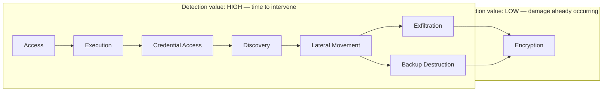
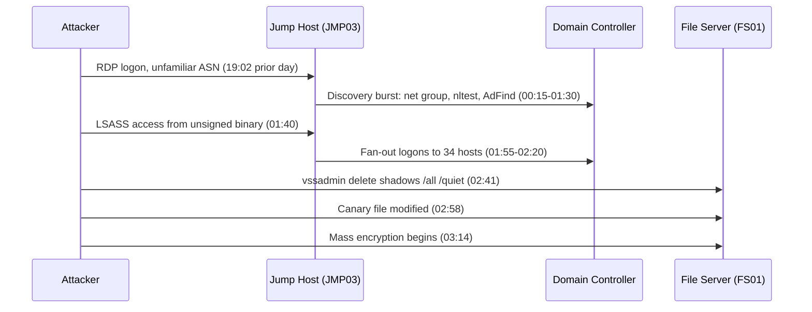

# Part XLVII — Ransomware Detection Engineering

Ransomware is not one event. It is the last five minutes of an operation that typically ran for
hours to weeks. By the time `vssadmin delete shadows` or the mass-rename/encrypt pattern hits your
SIEM, the operators have already done initial access, established a foothold, dumped credentials,
mapped the domain, moved laterally to file servers and backup infrastructure, and in most modern
intrusions, staged an exfiltration of data for double-extortion leverage. The encryption event is
the *signature*, not the *attack*.

This chapter treats ransomware as a chain with eight stages: Access, Execution, Credential Access,
Discovery, Lateral Movement, Exfiltration, Backup Destruction, Encryption. For each stage we build
concrete detections, and we are explicit about a bias that should shape how you spend engineering
time: **detections in the first six stages can stop the operation before damage; detections at the
Backup Destruction stage can still save you; detections that only fire at Encryption are a forensic
timeline entry, not a save.** If your ransomware detection program is 80% encryption-stage rules and
20% everything else, you have built a very good incident-response aid and a poor prevention control.



**Hunter's Note**: If you only ever hunt for the encryption pattern (mass file writes, extension
changes, entropy spikes), you are hunting for the outcome, not the actor. Every serious ransomware
crew reuses tooling and TTPs across the earlier stages far more consistently than they reuse
encryptor binaries, which get repacked and rebuilt constantly. The earlier stages are also where
your detection has a *shelf life* — encryptor hashes and ransom-note strings are burned within
days; a credential-dumping pattern or a shadow-copy-deletion command survives for years across
affiliate rebrands.

## 1. Access

[CONCEPT] Ransomware affiliates get in through a short, well-known list of doors: exposed RDP with
weak or reused credentials, VPN appliances with known CVEs or stolen credentials, phishing that
drops a loader, exploitation of internet-facing services (Exchange, Citrix, file-transfer
appliances), and purchased access from initial-access brokers who've already done the hard part.

[ANALYST] The access stage rarely looks alarming in isolation. A successful RDP logon from a new
geography, a VPN session with a credential that hasn't been used in eight months, a phishing
attachment that got through because it was a password-protected archive (defeating attachment
scanning) — none of these trip a severity-critical alert by themselves. That's the point: access is
usually judged suspicious only in combination with what happens next, which is exactly why stages
2-4 matter so much for early detection.

[DETECTION ENGINEER] Concrete opportunities:

- External-facing RDP/VPN authentication from anomalous ASN/geo combined with no prior history for
  that account (identity analytics, not just geoblocking).
- Successful authentication immediately following a burst of failures from the same source
  (password-spray-then-hit pattern) — Windows Event ID 4625 followed by 4624 from the same source IP
  within a short window, same account.
- Impossible-travel and new-device sign-in signals from IdP logs (Entra ID, Okta) for VPN/SSO-fronted
  access.
- Known-vulnerable appliance exploitation: this is patch-management and vulnerability-intel driven
  more than log-driven — track CISA KEV entries for VPN/edge appliances and correlate any exploitation
  attempt indicators against your own exposed inventory.

[MANAGEMENT] Access-stage detection is cheap to build and expensive to tune — geo/ASN anomaly rules
generate volume. Don't try to alert on every anomalous login; feed access-stage signals into a risk
score that later stages add to, rather than firing a standalone ticket for every odd RDP session. This
is the classic risk-based-alerting pattern from Part XXIV — use it here specifically.

## 2. Execution

[CONCEPT] After access, the operator (or their loader/beacon) needs to run something: a
commodity loader, a cobalt-strike-style beacon, a legitimate RMM tool repurposed for control, or
LOLBins to stage the next phase.

[ANALYST] Look for process creation events where the parent-child relationship is wrong for the
environment: RDP session (`explorer.exe`/`mstsc` lineage) spawning `powershell.exe` with an encoded
command, Office macro lineage spawning anything, or a legitimate RMM binary (AnyDesk, ScreenConnect,
Atera) appearing on a host that never had it installed, launched by a service or scheduled task
rather than interactively.

[DETECTION ENGINEER] This stage overlaps heavily with Part XIV (Endpoint Detection Engineering) and
Part VI (process-tree detection) — reuse those detections rather than rebuilding them. The
ransomware-specific addition is *tool inventory awareness*: maintain a list of RMM tools approved for
your environment and alert on any RMM binary execution that isn't on that list, regardless of whether
the binary itself is "malicious" (it's signed, legitimate software — the anomaly is presence, not
maliciousness).

```yaml
title: Unapproved Remote Management Tool Execution
id: part47-01
status: experimental
description: >
  Detects execution of known RMM/remote-access tool binaries that are not on
  the organization's approved-tools allowlist. Ransomware affiliates favor
  legitimate RMM software over custom malware to blend into normal admin
  traffic and survive EDR signature detection.
logsource:
  category: process_creation
  product: windows
detection:
  selection_tools:
    Image|endswith:
      - '\AnyDesk.exe'
      - '\ScreenConnect.ClientService.exe'
      - '\AteraAgent.exe'
      - '\TeamViewer.exe'
      - '\splashtop.exe'
      - '\Fleetdeck_agent.exe'
      - '\rutserv.exe'
  filter_approved:
    Image|contains:
      - 'C:\Program Files\ApprovedRMM\'   # replace with your actual sanctioned install path(s)
  condition: selection_tools and not filter_approved
falsepositives:
  - IT staff self-installing an alternate approved tool outside the standard path
  - MSP-managed endpoints where multiple RMM tools are legitimately in rotation
level: high
```

[THREAT HUNTER] Hunt for RMM binaries by hash/publisher across the fleet on a recurring basis
(weekly), not just at alert time — build a baseline of "which RMM tools exist where" and diff it
week over week. New appearance of any remote-access tool on a server that has never had one is a
strong hunt lead even with zero other signal.

## 3. Credential Access

[CONCEPT] This is where ransomware operations become detectable at scale, because credential
access is rarely surgical. Operators want domain admin or enough lateral credentials to reach every
host they need to encrypt, so they dump broadly: LSASS memory, NTDS.dit, cached credentials,
browser-stored passwords, and increasingly, Kerberoasting or DCSync-style replication abuse.

[ANALYST] LSASS access from an unusual process (not a security tool) is close to the highest-signal
single event available on an endpoint. Sysmon Event ID 10 (ProcessAccess) targeting `lsass.exe` with
a `GrantedAccess` mask indicating read (commonly `0x1010` or `0x1410` in public tooling, though the
mask varies by tool and OS build — don't hardcode a single value without validating against your own
Sysmon version) from a process outside your EDR/AV vendor list deserves immediate triage.

[DETECTION ENGINEER]

```yaml
title: Suspicious LSASS Memory Access (Potential Credential Dumping)
id: part47-02
status: experimental
description: >
  Detects processes other than known security/monitoring tools opening a
  handle to lsass.exe with read-memory-capable access rights. Common
  precursor to domain-wide ransomware deployment via harvested credentials.
logsource:
  category: process_access
  product: windows
  service: sysmon
detection:
  selection:
    TargetImage|endswith: '\lsass.exe'
    GrantedAccess|contains:
      - '0x1010'
      - '0x1410'
      - '0x1438'
      - '0x143a'
      - '0x1fffff'
  filter_known_good:
    SourceImage|endswith:
      - '\MsMpEng.exe'
      - '\SenseIR.exe'
      - '\CrowdStrike\CSFalconService.exe'
      - '\wdavdaemon.exe'
      - '\werfault.exe'    # legitimate crash-dump handler, tune per environment
  condition: selection and not filter_known_good
falsepositives:
  - Backup or crash-dump utilities not in the exclusion list
  - Some legitimate diagnostic/EDR tools not yet allowlisted after a new agent deployment
level: critical
```

**Detection Autopsy**: An earlier version of this rule at a previous engagement I reviewed matched
only `TargetImage|endswith: '\lsass.exe'` with **no** GrantedAccess filter and **no** source-process
exclusion at all — "alert whenever any process touches lsass.exe." It looked reasonable on paper:
LSASS access is inherently interesting. In production it fired hundreds of times a day because
*every* AV/EDR agent, Windows Defender, and even normal system components (services.exe enumerating
handles, some print-spooler interactions) legitimately open low-privilege handles to lsass.exe for
reasons that have nothing to do with credential theft. Analysts muted the rule within a week. The
fix was twofold: filter on `GrantedAccess` masks that actually correspond to memory-read rights
(not just "handle opened"), and maintain an exclusion list of known security-tool source processes
by full path, not just filename (attackers can rename a dumping tool to `MsMpEng.exe` — full-path
matching plus code-signing validation closes that gap partially, though a sufficiently capable
attacker with SYSTEM can still drop a file at a security-tool path). After the fix, the rule went
from ~300 alerts/day to 2-4/week, and every one of those in testing (via Mimikatz/procdump in a lab)
still fired. The false-negative risk that remains: attackers who dump via a *legitimate* signed
process that's already in the exclusion list (DLL side-loading into an AV process, or using a
built-in Windows diagnostic tool not yet on either list) — that's why this rule should never be your
only credential-access detection; pair it with NTDS.dit access and LSASS-dump-file-on-disk
detections below.

[ANALYST] Also watch for: `ntdsutil.exe` or `esentutl.exe` invoked against `ntds.dit`, volume shadow
copy access to `C:\Windows\NTDS\`, and DCSync-pattern replication requests (Directory Service
Access Event ID 4662 with replication GUIDs `1131f6aa-9c07-11d1-f79f-00c04fc2dcd2` or
`1131f6ad-9c07-11d1-f79f-00c04fc2dcd2`) from a source that is not a domain controller.

[THREAT HUNTER] Hunt for LSASS-dump artifacts independent of the access event: look for files with
minidump magic bytes (`MDMP` header) written outside expected crash-dump directories, unusually
large temp files followed by rapid deletion, and 7z/rar archive creation immediately after an LSASS
access event on the same host within a short window (dump-then-exfil pattern).

[ENGINEERING] **Engineering Reality**: Sysmon Event ID 10 volume on a busy DC or file server can be
enormous if you don't scope `ProcessAccess` rules narrowly in your Sysmon config — logging every
process-access event fleet-wide will drown your pipeline. Scope the Sysmon config's own
`ProcessAccess` rule to `TargetImage` containing `lsass.exe` (and a small number of other
high-value targets) at the collector level, not just at query time, or you will pay for ingest
volume you never intended.

## 4. Discovery

[CONCEPT] Before lateral movement, operators map the environment: domain trust structure, host
inventory, shares, backup infrastructure, EDR presence, and privileged group membership. Discovery
tools are usually built-in (`net.exe`, `nltest.exe`, `whoami.exe`, PowerShell AD cmdlets) or
commodity (AdFind, BloodHound/SharpHound, netscan tools).

[ANALYST] Individually, `net group "domain admins" /domain` is something a help-desk tech might
legitimately run once a quarter. The signal is *volume and sequencing*: a burst of discovery
commands (5-10+ distinct enumeration commands) within minutes, from a single host, especially from
an account that doesn't normally run admin tooling, or from a host that isn't a jump box/admin
workstation.

[DETECTION ENGINEER]

```sql
-- Illustrative KQL (Microsoft Sentinel / Defender). Field names assume DeviceProcessEvents
-- schema; validate against your actual table/schema version before deploying.
DeviceProcessEvents
| where Timestamp > ago(1h)
| where FileName in~ ("net.exe","net1.exe","nltest.exe","whoami.exe","systeminfo.exe",
                       "quser.exe","dsquery.exe","adfind.exe","nslookup.exe")
| summarize DistinctTools = dcount(FileName), Commands = make_set(ProcessCommandLine),
            FirstSeen = min(Timestamp), LastSeen = max(Timestamp)
      by DeviceName, AccountName
| where DistinctTools >= 5 and (LastSeen - FirstSeen) < 10m
| order by DistinctTools desc
```

[DETECTION ENGINEER] This "burst of distinct discovery tools in a short window" pattern is far more
resilient than any single tool signature — it survives tool substitution (AdFind swapped for
SharpHound swapped for raw LDAP queries via PowerShell) because it's counting behavior shape, not
matching a binary name. The threshold (5 tools in 10 minutes here) needs local tuning: sysadmin
scripts that legitimately chain several of these commands for onboarding/health-check tasks will
false-positive against too aggressive a threshold. Baseline your own admin tooling first.

[THREAT HUNTER] Hunt LDAP query volume against the DC directly — a SharpHound run generates a
distinctive spike in LDAP search requests (Directory Service query events, or DC-side ETW LDAP
tracing if enabled) covering an unusually broad set of attributes (group membership, ACLs, trust
info) in a short period, independent of which process on which endpoint issued it. This catches
discovery even when it's run from a compromised low-privilege workstation using a renamed or
custom-compiled tool that endpoint signatures miss.

[MANAGEMENT] **SOC Management View**: Discovery-stage detection is one of the best ROI investments
in a ransomware detection program because the tools and command patterns are highly reused across
unrelated ransomware affiliates (they share initial-access-broker ecosystems and playbooks), the
false-positive rate is manageable with volume/sequencing logic instead of single-command matching,
and — critically — it fires *days* before encryption in most real intrusions, giving IR a window to
contain before impact. If you have limited engineering headcount and must choose where to invest,
discovery and credential-access detections generally outperform encryption-stage detections on
cost-per-prevented-incident.

## 5. Lateral Movement

[CONCEPT] With credentials and a target list in hand, operators move to file servers, hypervisors,
backup servers, and domain controllers — anywhere that maximizes blast radius for the eventual
encryption run. Common mechanisms: PsExec/PsExec-alikes, WMI, RDP with harvested creds, and
increasingly, direct abuse of RMM tools already deployed in stage 2.

[ANALYST] The single strongest lateral-movement signal for ransomware specifically is *breadth and
speed*: the same account authenticating to many distinct hosts in a short window is a pattern almost
no legitimate admin workflow produces at ransomware-typical scale (dozens to hundreds of hosts within
an hour or two, immediately before an encryption run).

[DETECTION ENGINEER]

```
`sourcetype=WinEventLog:Security EventCode=4624 Logon_Type=3 OR Logon_Type=10
| bin _time span=15m
| stats dc(dest) as distinct_hosts, values(dest) as hosts by user, _time
| where distinct_hosts >= 15
| sort - distinct_hosts`
```
*(Illustrative SPL — field/index names will vary by your Splunk data model; treat as a starting
point, not a drop-in query.)*

[DETECTION ENGINEER] Pair the fan-out logon detection with PsExec-style service creation (Event ID
7045 for a new service with a name pattern matching PsExec defaults, or the classic
`PSEXESVC` service name — though this is trivially renamed, so don't rely on the default name alone)
and with SMB/named-pipe artifacts associated with lateral tool execution.

[THREAT HUNTER] Hunt the *reverse* direction too: identify hosts that received inbound
authentication from an unusually large number of distinct source hosts/accounts in a short window —
this catches the "staging host" pattern where the operator pivots through one compromised machine to
reach many targets, which fan-out-by-account queries alone can miss if the operator rotates through
several harvested accounts.

[ENGINEERING] **Engineering Reality**: Fan-out logon detection lives or dies on having a consistent,
deduplicated `user` field across your whole estate. If some log sources report `DOMAIN\user` and
others report bare `user`, or service accounts get merged into the same bucket as human accounts
without normalization, your distinct-host counts will be wrong in both directions — undercounting
because the same human account looks like two different strings, and overcounting because a
legitimate shared service account naturally touches many hosts. Normalize identity before you build
volume-based lateral-movement analytics, not after you start getting confusing results.

## 6. Exfiltration

[CONCEPT] Double-extortion ransomware exfiltrates data before encrypting it, both for leverage
(leak-site threats) and because some victims will pay to prevent disclosure even if they can restore
from backup. This stage typically happens in parallel with, or shortly before, backup destruction and
encryption — it is often the *last* clean opportunity to detect before impact.

[ANALYST] Look for large outbound transfers to cloud storage/file-sharing services that aren't
normal business tools for that user/host (Mega, temp file-sharing sites, unfamiliar S3-compatible
endpoints), especially via command-line tools (`rclone`, `curl`, `WinSCP` scripted, `7z` archive
creation immediately preceding the transfer) rather than a browser.

[DETECTION ENGINEER] `rclone` is heavily reused across ransomware affiliates specifically because it
supports so many cloud backends with a single static binary. Detect its presence and config:

```yaml
title: Rclone Execution or Config Indicative of Mass Exfiltration
id: part47-03
status: experimental
description: >
  Detects execution of rclone (a legitimate sync tool heavily abused by
  ransomware affiliates for staged exfiltration to cloud storage) or creation
  of an rclone config file outside expected admin/backup automation paths.
logsource:
  category: process_creation
  product: windows
detection:
  selection_proc:
    Image|endswith: '\rclone.exe'
  selection_cmd:
    CommandLine|contains:
      - 'copy'
      - 'sync'
      - 'mega'
      - '--config'
  filter_approved_path:
    Image|startswith: 'C:\Program Files\ApprovedBackupTooling\'
  condition: selection_proc and selection_cmd and not filter_approved_path
falsepositives:
  - Legitimate backup/sync automation using rclone outside the expected install path
  - IT staff personally using rclone for approved cloud migrations
level: high
```

[THREAT HUNTER] Hunt network telemetry for sustained large outbound flows to cloud-storage IP
ranges/ASNs (Mega, Backblaze, and generic S3-compatible endpoints) originating from servers that
have no legitimate reason to talk to consumer cloud storage — file servers, domain controllers, and
backup servers should have a very small, well-known set of legitimate outbound destinations, so
*any* large outbound flow to an unrecognized destination from one of those roles is worth a look
regardless of process-level evidence (useful when the exfil tool is something you haven't
signatured yet).

[ENGINEERING] Volume-based exfil detection needs a NetFlow/firewall-log baseline per host role, not
a single global threshold — a jump box may legitimately move large volumes of data as part of normal
admin work, while a domain controller moving even a few hundred MB outbound to an unfamiliar
destination is anomalous. Building this baseline is genuinely tedious and often the reason exfil
detection lags behind other stages in maturity — budget the time for it rather than skipping straight
to a flat-threshold rule.

## 7. Backup Destruction

[CONCEPT] This is the highest-value detection point in the entire chain that still gives you a
chance to prevent unrecoverable damage. Ransomware operators know backups are the primary reason
victims don't pay, so before or during encryption they systematically delete or corrupt local backups,
shadow copies, and increasingly, cloud/immutable backup targets they can reach with stolen
credentials.

[ANALYST] Classic commands: `vssadmin delete shadows /all /quiet`, `wmic shadowcopy delete`,
PowerShell `Get-WmiObject Win32_ShadowCopy | Remove-WmiObject`, `wbadmin delete catalog -quiet`,
and disabling Windows Recovery via `bcdedit /set {default} recoveryenabled No` and
`bcdedit /set {default} bootstatuspolicy ignoreallfailures`. These commands have almost no
legitimate reason to run outside a very small set of IT/backup-admin workflows, which makes this
one of the lowest-false-positive, highest-precision detection opportunities in the whole chain.

[DETECTION ENGINEER]

```yaml
title: Volume Shadow Copy or Windows Backup Deletion (Pre-Encryption Indicator)
id: part47-04
status: experimental
description: >
  Detects command-line invocation of shadow copy deletion, backup catalog
  deletion, or boot recovery configuration changes commonly used by
  ransomware immediately before or during encryption to prevent recovery.
  Extremely high precision — legitimate use of these exact commands is rare
  and should be a known, documented exception if it occurs.
logsource:
  category: process_creation
  product: windows
detection:
  selection_vssadmin:
    Image|endswith: '\vssadmin.exe'
    CommandLine|contains|all:
      - 'delete'
      - 'shadow'
  selection_wmic:
    Image|endswith: '\wmic.exe'
    CommandLine|contains|all:
      - 'shadowcopy'
      - 'delete'
  selection_wbadmin:
    Image|endswith: '\wbadmin.exe'
    CommandLine|contains:
      - 'delete catalog'
      - 'delete backup'
  selection_bcdedit:
    Image|endswith: '\bcdedit.exe'
    CommandLine|contains|all:
      - 'recoveryenabled'
      - 'no'
  selection_powershell_wmi:
    Image|endswith:
      - '\powershell.exe'
      - '\pwsh.exe'
    CommandLine|contains|all:
      - 'shadowcopy'
      - 'remove'
  condition: 1 of selection_*
falsepositives:
  - Legitimate backup software reconfiguration or planned decommission of shadow-copy retention
  - Rare, documented sysadmin cleanup of orphaned shadow copies (should be a change-ticket-linked exception)
level: critical
```

[DETECTION ENGINEER] Treat every hit on this rule as critical severity with an SLA measured in
minutes, not hours. Route it to trigger automated response if your platform supports it — network
isolation of the host and a forced credential reset for the executing account — because by the time
this fires, you may have single-digit minutes before encryption starts on that host and adjacent
systems.

[THREAT HUNTER] Hunt beyond the command-line strings: look for shadow-copy count drops detected via
periodic inventory (query `vssadmin list shadows` on a schedule and diff against history) to catch
deletion performed through an API/COM call that never generates a matching command line (e.g.
`IVssBackupComponents` used directly from a compiled payload). Also hunt for backup-agent service
stoppage (Veeam, Commvault, Backup Exec services being stopped or their service binaries being
argument-tampered) immediately preceding encryption timestamps in past incidents — this is commonly
missed because analysts focus on OS-native shadow-copy commands and skip third-party backup agent
telemetry entirely.

**Engineering Reality**: A lot of environments log `vssadmin`/`wmic` command lines just fine but have
*no* telemetry at all on the third-party backup platform itself (Veeam, Commvault) beyond the backup
software's own success/failure alerting — which an attacker who's disabled or corrupted the backup
job will never trigger, because from the backup software's point of view no job ran to fail. If your
backup platform can forward its own audit/admin-action logs (repository deletion, retention policy
changes, admin console logins) to your SIEM, get that pipeline built — it closes a real coverage gap
that OS-level shadow-copy detection cannot see.

## 8. Encryption

[CONCEPT] Mass file modification: rename with a new extension, header/content encryption, ransom
note drops in directories, often preceded by disabling of security tooling (kill AV/EDR processes or
services) and deletion of Volume Shadow Copies if that wasn't already done in stage 7.

[ANALYST] By this point you are doing incident response, not prevention, in the vast majority of
real cases — file-level encryption on a large file server can complete in minutes once it starts,
often faster than a human analyst can triage an alert, acknowledge it, and take containment action.
Detection here is valuable for scoping ("which hosts got hit, when did it start, what's the blast
radius") and for stopping *spread* to hosts not yet reached, not for saving the hosts already
mid-encryption.

[DETECTION ENGINEER] File-system-level detections: high-rate file rename/write events per second
per host (honeypot/canary files are the classic lightweight version — plant files in common share
locations and alert immediately on any modification, since nothing legitimate should ever touch
them), mass extension-change patterns, and process termination bursts targeting security-tool
process names immediately before the encryption burst (the "kill switch" step many ransomware
families run first).

```yaml
title: Canary File Modification (High-Confidence Active Encryption Indicator)
id: part47-05
status: experimental
description: >
  Detects modification of designated canary/honeyfiles placed in file shares
  and common target directories. These files have no legitimate business
  purpose and should never be touched; any write/rename/delete event against
  them is treated as a near-certain active encryption or destructive-wiper
  event in progress, not a "review when convenient" alert.
logsource:
  category: file_event
  product: windows
detection:
  selection:
    TargetFilename|contains:
      - '\_CANARY_DO_NOT_DELETE_'
      - '\zzz_canary_'
  condition: selection
falsepositives:
  - Backup software or AV performing full-share scans that touch every file including canaries (expected, allowlist the scanning process by path)
level: critical
```

[DETECTION ENGINEER] Canary files are cheap, low-noise, and one of the few encryption-stage
detections that can plausibly trigger fast enough to matter — pair the alert with an automated
response (network isolation of the writing host, or share-level write-block) rather than a
human-in-the-loop workflow if your tooling supports it, because the value of this detection is
entirely a function of response latency.

[THREAT HUNTER] Post-incident, hunt the timeline backward from the first encrypted-file timestamp:
pull process creation, LSASS access, and shadow-copy-deletion events for the 72 hours prior on the
patient-zero host and every host it authenticated to — this reconstructs the full chain and usually
reveals which of stages 1-7 had a detection gap, which is the input for your next round of
engineering work, not just an IR artifact to file away.

## Worked example: chaining the stages into one investigation

A mid-size healthcare org's file server (`FS01`) starts showing encrypted files at 03:14. Pulling
backward:

1. **02:58** — canary file on `\\FS01\shares\finance` modified (part47-05 fires, but is buried in an
   overnight queue with a 40-minute triage SLA — the actual root-cause gap).
2. **02:41** — `vssadmin.exe delete shadows /all /quiet` on `FS01` (part47-04 — this should have
   been the critical, minutes-SLA page).
3. **01:55–02:20** — the same domain account authenticates interactively (Logon_Type 10, RDP) to 34
   distinct hosts across two subnets within 25 minutes (fan-out lateral movement pattern).
4. **01:40** — LSASS access on the jump host `JMP03` from an unsigned binary in `C:\Users\Public\`
   (part47-02 — this fired at the time but was closed as "EDR quarantined it, no further action" without
   checking what credentials might already have been harvested before quarantine).
5. **00:15–01:30** — burst of `net group`, `nltest /domain_trusts`, and an AdFind execution from
   `JMP03`, all under an account that normally only opens Outlook and a ticketing system.
6. **Prior day, 19:02** — initial RDP logon to `JMP03` from an unfamiliar residential ASN, account
   had no prior RDP history.

Every one of steps 2 through 6 had a detection that fired or could have fired with the rules in this
chapter. The actual failure was triage priority and response latency, not detection coverage — which
is a governance and SOC-workflow problem, not a content-engineering problem. This is why the
Backup Destruction rule above is explicitly marked for a minutes-scale SLA: a technically correct
detection that sits in a queue for 40 minutes provides the same real-world outcome as no detection
at all.



## Coverage matrix

| Stage | Primary telemetry | Detection precision | Time-to-impact if missed |
|---|---|---|---|
| Access | IdP/VPN/RDP auth logs | Low (needs correlation) | Days to weeks |
| Execution | Process creation, EDR | Medium | Days |
| Credential Access | Sysmon 10, DC audit logs | High | Hours to days |
| Discovery | Process creation, LDAP query telemetry | Medium-High | Hours to days |
| Lateral Movement | Auth logs (4624/4625), service creation | Medium-High | Hours |
| Exfiltration | NetFlow/proxy, process creation | Medium (needs baseline) | Hours (leverage risk even if encryption is stopped) |
| Backup Destruction | Process creation, backup platform audit logs | Very high | Minutes |
| Encryption | File-system events, canary files | Very high, but too late for prevention | Seconds to minutes |

> **[SCREENSHOT PLACEHOLDER — CONTROLLED LAB]** — Sysmon process-creation log (Event ID 1) captured
> from a Windows Server host during a controlled ransomware-simulation exercise, showing the
> `vssadmin.exe delete shadows /all /quiet` command line with parent-process lineage back to the
> initial foothold process. Would illustrate the exact field layout (`Image`, `ParentImage`,
> `CommandLine`, `User`) that the part47-04 detection logic matches against.

> **[SCREENSHOT PLACEHOLDER — CONTROLLED LAB]** — Windows Security event log (Event ID 4624/4625)
> exported from a domain controller during a simulated fan-out lateral-movement exercise, showing
> the same account authenticating to multiple distinct `Workstation Name`/`Source Network Address`
> values within a short window, to illustrate the raw fields the part47 lateral-movement KQL/SPL
> queries would aggregate over.

## Testing and tuning notes

[DETECTION ENGINEER] Every rule in this chapter should be validated against at least one
attack-simulation run before being trusted in production:

- Backup-destruction and canary-file rules: trivial to test safely — run the exact commands
  (`vssadmin`, `wbadmin`, `bcdedit`) in an isolated lab VM and touch a canary file; confirm alert
  latency, not just alert firing.
- LSASS-access rule: test with a known credential-dumping tool in an isolated, snapshotted VM
  (never against production identity infrastructure); confirm the `GrantedAccess` mask values your
  Sysmon version actually emits, since these are not perfectly consistent across tool/OS
  combinations.
- Discovery burst and lateral-movement fan-out rules: these need a *negative* test as much as a
  positive one — run your normal Patch Tuesday or onboarding automation through the same
  detection logic and confirm it doesn't fire, before you trust the positive-test result.

[MANAGEMENT] Budget re-tuning time after every real incident and after every red-team/purple-team
exercise that touches this chain — thresholds (fan-out host counts, discovery-tool-burst counts)
drift as your environment's normal admin behavior changes, and a rule tuned two years ago against a
smaller estate will be noisy or blind against today's estate.

## MITRE ATT&CK mapping

| Stage | Representative techniques |
|---|---|
| Access | T1133 (External Remote Services), T1190 (Exploit Public-Facing Application), T1566 (Phishing) |
| Execution | T1059 (Command and Scripting Interpreter), T1219 (Remote Access Software) |
| Credential Access | T1003.001 (LSASS Memory), T1003.003 (NTDS), T1558 (Steal or Forge Kerberos Tickets) |
| Discovery | T1087 (Account Discovery), T1069 (Permission Groups Discovery), T1018 (Remote System Discovery), T1482 (Domain Trust Discovery) |
| Lateral Movement | T1021 (Remote Services), T1570 (Lateral Tool Transfer) |
| Exfiltration | T1567 (Exfiltration Over Web Service), T1048 (Exfiltration Over Alternative Protocol) |
| Backup Destruction | T1490 (Inhibit System Recovery) |
| Encryption | T1486 (Data Encrypted for Impact), T1489 (Service Stop) |

## References

- MITRE ATT&CK, techniques listed in the mapping table above (Enterprise matrix).
- CISA, joint ransomware advisories and #StopRansomware guidance series (title only — specific
  advisory URLs change per campaign; check current CISA.gov advisories for the affiliate/variant
  relevant to your threat model).
- Microsoft Learn, Sysmon event reference documentation (for ProcessAccess/GrantedAccess field
  semantics — validate exact mask values against your deployed Sysmon schema version).
- Sigma project documentation (rule syntax reference for the detections in this chapter).
