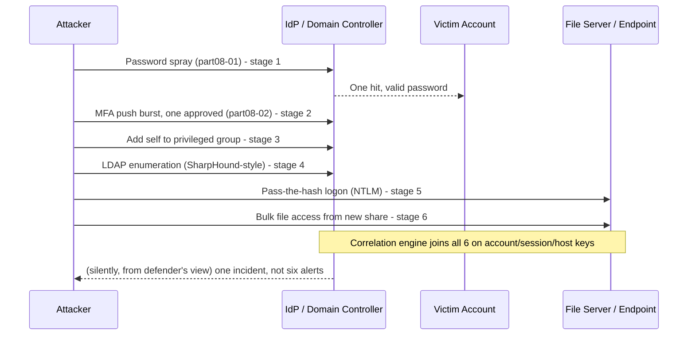

# Part XLVIII — Identity Compromise Detection Model

## Purpose of this part

Part VIII gave you fifteen individually-tuned identity detections and hunts — password spraying,
MFA fatigue, impossible travel, Kerberoasting, DCSync, and the rest. Part VI gave you the reasoning
model for judging a process ancestry chain rather than a single event. Neither part, on its own,
tells you what an actual identity-compromise *incident* looks like end to end, or how the fifteen
pieces stack into one story on one account.

This part does not re-derive any single-stage detection. Every stage below points back at a named
detection ID from Part VIII or Part VI and asks the question that matters for a model: what does
this stage look like when it's the *second* thing that happened to this account this week, not the
first thing anyone noticed? Identity compromise is rarely caught by one brilliant rule. It's caught
by a SOC that notices five separately-plausible events sharing an account, a session, or a host, and
recognizes the shape.

## The six-stage model


This looks like a kill chain, and it is one, but the point of drawing it isn't to admire the
shape — it's the entity-continuity annotations on the arrows. A correlation engine (Part XXIII
covers the general mechanics) can only chain these stages together if it can prove the *same*
account, session, token, or host connects consecutive stages. Lose that thread — because a log
source doesn't carry a session ID, or a parser drops the field, or two systems resolve the same
person to different identifiers — and you have six isolated alerts instead of one incident. This
is the single most common reason identity-compromise investigations stall: not lack of detections,
lack of a joinable key between them.

**Hunter's Note:** before building a single correlation rule for this model, go find out whether
your environment can actually join a DC logon session to a cloud sign-in session to an EDR process
GUID for the same real-world event. Most cannot, out of the box. That gap is worth fixing before
the rule, because the rule will silently underperform against it and nobody will notice until an
incident review asks "why didn't this fire."

## Stage 1 — Credential Theft

[CONCEPT] The attacker obtains something that lets them authenticate as the victim: a password
(phished, purchased, brute-forced/sprayed), a hash (dumped or captured), a ticket (extracted from
memory), or a session token/cookie (stolen from a browser or an OAuth flow). Credential theft
itself frequently generates *no* identity telemetry at all — the theft usually happens on the
endpoint (LSASS access, browser credential store read, phishing page harvest) or off-platform
entirely (a breach dump, an infostealer log for sale). By the time identity telemetry lights up,
you're already at Stage 2.

**Tie-back to Part VIII:**

- Password Spraying (Part VIII §1, detection **part08-01**) — the theft mechanism itself,
  observable at the authentication layer.
- Account Enumeration (Part VIII §15) and LDAP Enumeration (Part VIII §16) — frequently the
  *precursor* to Stage 1 rather than part of it: the attacker builds a username list before
  spraying.
- Successful Login After Failures (Part VIII §2) — the earliest on-platform evidence that a theft
  attempt succeeded against a specific account, whether via spraying, credential stuffing, or a
  guessed password.
- Kerberoasting (**part08-04**) and AS-REP Roasting (Part VIII §10) — theft mechanisms specific to
  AD service accounts, where the "theft" is an offline crack following a legitimately-issued
  ticket rather than a network-visible brute force.
- Pass-the-Hash (Part VIII §12) and Pass-the-Ticket (Part VIII §13) — theft-adjacent: these detect
  the *reuse* of already-stolen material, which is really the boundary between Stage 1 and Stage 2.

**Tie-back to Part VI:** credential theft frequently has an *endpoint* precursor that Stage-1
identity telemetry can't see at all — LSASS memory access (Mimikatz `sekurlsa::logonpasswords`,
comsvcs.dll MiniDump abuse), browser credential-store file reads, or a phishing page harvesting a
password via a fake login form rendered inside a browser process. None of that shows up in a DC or
IdP log. It shows up as a process-ancestry anomaly: an unusual process reading `lsass.exe` memory,
or a browser process's child spawning something unexpected right after a credential-harvesting
page loads. This is why Stage 1 in a mature program is covered by *both* an identity detection
program and an EDR/process-tree program running in parallel — treat "did an endpoint touch LSASS
or a credential store around the time this account's credentials were later used from somewhere
new" as a standing cross-telemetry question, not a one-off investigation step.

**What's missing at this stage:** almost always, direct evidence of the theft mechanism itself.
You rarely get to see the phishing page, the infostealer log, or the breach dump that supplied the
credential. What you get is the first *use* of stolen material, which is Stage 2. Plan the model
around detecting use, not theft — theft detection is a bonus when EDR happens to catch it.

## Stage 2 — New Login Context

[CONCEPT] The stolen credential gets used from somewhere, something, or sometime that doesn't
match the account's established pattern. This is the first stage where identity telemetry reliably
produces a signal, and it's also the stage with the highest structural false-positive rate in the
whole model — see the Detection Autopsy in Part VIII §4 for exactly how bad a naive version of this
gets.

**Tie-back to Part VIII:**

- Impossible Travel (**part08-03**) — geography/speed-implausible sign-in following a stolen
  credential's use from a location the legitimate user isn't in.
- New Device / New Country (Part VIII §5) — first-seen device fingerprint or country for the
  account, the lower-confidence cousin of impossible travel that works better as a composite-score
  input than a standalone alert.
- MFA Fatigue (**part08-02**) — the specific case where the attacker holds valid first-factor
  credentials but has to defeat or social-engineer past MFA to actually establish the new login
  context. An *approved* push in this burst is the moment Stage 2 completes.
- Successful Login After Failures (Part VIII §2) — again relevant here if the "new context" login
  followed a visible failure burst, rather than landing clean on the first try (which would suggest
  a correctly-guessed/validated credential rather than a spray hit).

**Tie-back to Part VI:** a new login context on its own is an identity-layer event, but the
process-tree program should immediately care about what happens on the endpoint in the minutes
after it, if the login was interactive (RDP, console, or a remote-access tool) rather than a cloud
sign-in with no endpoint component. A first-ever interactive logon from a new context, followed by
a process ancestry chain that doesn't match the account's normal software footprint, is a much
stronger signal than either half alone — this is exactly the kind of pairing the process-tree
reasoning spectrum from Part VI (Expected / Rare / Suspicious / Highly Suspicious) is built to
score.

**Correlation logic for this stage:** the entity key that survives from Stage 1 to Stage 2 is the
account identifier (`UserPrincipalName`/`sAMAccountName`), and — where the login is interactive on
an endpoint — the resulting logon session ID becomes the new key carried forward into Stage 3. If
your pipeline can't carry a stable account identifier across your IdP, your DC, and your EDR (a
common gap when cloud UPN and on-prem `sAMAccountName` diverge, or when a service-account alias
differs from its human-readable name in different systems), fix that mapping before trying to
build this stage's correlation rule — it is the single most common reason a Stage 2 → Stage 3
handoff silently fails.

## Stage 3 — Privileged Activity

[CONCEPT] The attacker uses the now-established access to do something with elevated privilege:
add themselves or another account to a privileged group, use an already-privileged token, grant
OAuth consent to a malicious app, or exercise directory-replication rights. This is the stage where
volume-based thresholding stops being the primary tool — Part VIII's treatment of this category
(§7, §6, §11) is deliberately allowlist-based rather than rate-based, because the legitimate
population that should ever do these things is small and enumerable.

**Tie-back to Part VIII:**

- Privilege Change / Admin Group Changes (Part VIII §7) — additions to Tier-0 groups
  (Domain Admins, Enterprise Admins, Global Administrators), the classic Stage 3 action.
- Suspicious OAuth / Illicit Consent Grant (Part VIII §6) — a lower-friction Stage 3 path that
  doesn't require any AD privilege at all, just a user (or already-compromised session) willing to
  click "Accept."
- DCSync (**part08-05**) — the highest-severity Stage 3 action in this model: an account exercising
  Directory Replication Service rights it shouldn't hold, harvesting domain-wide credential
  material including KRBTGT. Everything downstream of a confirmed DCSync should be treated as
  "assume domain-wide credential compromise," not scoped to one account.
- Service Account Abuse (Part VIII §8) — relevant when the privileged activity is being carried out
  *as* a compromised service account rather than a human account; the tell is usually an
  interactive logon type where the account has never logged on interactively before.

**Tie-back to Part VI:** if privileged activity happens via an interactive session on a domain
controller or a Tier-0 management host, the process ancestry on that host in the same window is
extremely high-value — see Part VI's worked example on `services.exe` spawning an unexpected
binary, and the general point that a rare-but-catastrophic AD right being exercised is exactly the
kind of low-volume, high-precision surface where an ancestry anomaly on the source host
corroborates the identity-layer signal almost for free.

**SOC Management View:** Stage 3 is where identity detection earns its budget. The volume here
should be low enough — if your Tier-0 group membership and replication-rights population are
correctly scoped — that near-100% of Stage 3 events can get human review. If Stage 3 alerts are
high-volume in your environment, that's not a tuning problem to suppress, it's a governance problem
(too many accounts hold Tier-0 rights) to fix upstream, and the fix is a reconciliation project, not
a detection change.

## Stage 4 — Enumeration

[CONCEPT] With elevated access (or sometimes with none at all — regular domain users can enumerate
plenty) the attacker maps the environment: who else has privilege, which service accounts have
SPNs, what trust relationships exist, what shares and hosts are reachable. This stage frequently
*precedes* Stage 3 in real intrusions rather than following it (attackers often recon before they
escalate) — the model presents it after Stage 3 because that's where it sits in *this specific*
credential-theft-to-data-access narrative, but a mature detection program should watch for it at
any point in the chain, including before Stage 1 completes (pre-spray username harvesting).

**Tie-back to Part VIII:**

- LDAP Enumeration (Part VIII §16) — BloodHound/SharpHound-style directory mapping, the primary
  Stage 4 signature in AD environments.
- Account Enumeration (Part VIII §15) — if the attacker is still validating which accounts exist
  even after gaining a foothold (common when the initial compromised account has limited visibility
  and the attacker wants a fuller target list before moving further).
- The SPN inventory walk that precedes Kerberoasting (Part VIII §9) is itself a Stage 4 activity
  even though the exploitation (offline cracking) happens outside any telemetry you'll capture —
  the enumeration step is where you have a chance to catch it before the crack succeeds.

**Tie-back to Part VI:** enumeration tooling (SharpHound, ADRecon, PowerView cmdlets, `net group`
/`net user` /`nltest` chains) has a distinctive process-ancestry and command-line signature
independent of the LDAP query volume itself — this is explicitly called out in Part VIII §16's hunt
angle, and it's worth restating here because it's the clearest example in this whole model of the
two programs covering the same behavior from two different telemetry angles simultaneously.
A careful attacker who throttles LDAP query volume below your Part VIII threshold is much harder to
hide at the process-execution level, because running `SharpHound.exe` or a PowerView cmdlet chain
still has to happen *somewhere*, on *some* host, under *some* process ancestry — apply the Part VI
reasoning spectrum (a `powershell.exe` process with an ancestry chain that's never touched AD
enumeration cmdlets before, suddenly doing so, is at minimum "Rare," and "Suspicious" if it follows
a Stage 3 privileged action on the same account).

## Stage 5 — Lateral Movement

[CONCEPT] The attacker moves from the initially compromised context to another host or account,
usually reusing stolen credential material (hash, ticket, or a newly harvested credential from the
current foothold) rather than repeating the Stage 1 theft mechanism from scratch.

**Tie-back to Part VIII:**

- Pass-the-Hash (Part VIII §12) — NTLM-based lateral movement, especially privileged accounts
  authenticating via NTLM from a source host with no prior interactive history there.
- Pass-the-Ticket (Part VIII §13) — Kerberos-ticket-based lateral movement; the core anomaly is a
  ticket used from a host other than the one it was issued to, which requires joining DC ticket
  telemetry against endpoint session data.
- Golden Ticket (Part VIII §14) — the most severe lateral-movement enabler in this model: once
  KRBTGT is compromised (frequently via a Stage 3 DCSync earlier in the same incident), the attacker
  can forge tickets for lateral movement to essentially anything, and the 4768/4769 correlation
  described there is the primary detection surface.

**Tie-back to Part VI:** lateral movement is where process ancestry does its most distinctive
work in this entire model, because remote execution mechanisms have well-known, ancestry-visible
signatures — `services.exe` spawning a newly-created, randomly-named service binary is the classic
PsExec-style pattern (Part VI, Worked Example 3), and it is frequently the *first* observable trace
of lateral movement on the target host, arriving before or alongside any identity-layer signal from
that host's own local logs. A Stage 5 investigation that only queries identity telemetry and skips
the target host's process ancestry is working with half the available evidence.

**Detection Autopsy — treating lateral movement as a single-host problem.**
*Original logic:* alert on NTLM logons by privileged accounts from unfamiliar source hosts,
scoped per host, reviewed per host. *Why it looked reasonable:* it matches how the underlying Part
VIII rule (Pass-the-Hash) is written, and per-host review is how most SOCs are staffed to triage.
*What broke in production:* an attacker moving hash-based creds through four hosts in twenty
minutes generated four separate, individually-sub-critical tickets, each reviewed by a different
analyst (or the same analyst without the context of the other three), each closed as "isolated
anomaly, no corroborating evidence found" because no single ticket showed the pattern. *False
negatives:* the actual lateral-movement chain — one source host authenticating as multiple
privileged accounts across multiple destinations in a tight time window — was present in the data
the whole time; it just never appeared inside any single ticket's scope. *Missing context:* no
entity model tying "same source host, multiple destination accounts, tight window" together across
tickets; each ticket treated the destination host as the unit of investigation instead of the
account-and-session chain. *Revised analytic:* re-scope the correlation entity from "destination
host" to "source host + time window," explicitly designed to surface a single source authenticating
as several different privileged accounts across several destinations, and route all such tickets to
one incident record instead of N independent ones. *How it was tested:* replayed a lab PsExec-based
lateral-movement chain across four VMs against both the old per-host ticketing logic and the revised
source-host-centric logic; old logic produced four disconnected low-priority tickets, revised logic
produced one high-priority incident with the full path visible. *Result:* the revised model is now
the standing entity-resolution rule for any lateral-movement-shaped correlation in this program, not
just this specific detection.

## Stage 6 — Data Access

[CONCEPT] The stage that actually matters to the business: the attacker reads, exfiltrates, or
manipulates data using the access built up through Stages 1–5 — mailbox access via a stolen
session or an OAuth grant, file share access via lateral movement, database queries via a
compromised service account. This part doesn't re-derive data-access detection in depth (that
belongs with cloud/endpoint/DLP-specific chapters), but it closes the loop: everything upstream in
this model exists to get an attacker here, so Stage 6 telemetry should always be checked against
the account/session/host chain built in Stages 1–5, not evaluated in isolation.

**Tie-back to Part VIII:** the OAuth consent grant from Stage 3 (Part VIII §6) is frequently the
*direct enabler* of Stage 6 rather than a separate step — a malicious app with mail-read and
`offline_access` scopes doesn't need any further lateral movement to reach data, it just uses the
token it was granted. This is worth flagging explicitly in triage: if Stage 3 was an OAuth grant
rather than a group-membership change, Stage 6 can follow immediately with no Stage 4/5 in between
at all, and a rigid six-stage expectation in a correlation rule will miss a shortened chain like
this if it's written to require every stage in sequence.

**Tie-back to Part VI:** data access performed through a process (a file-copy tool, an archiving
utility staged ahead of exfiltration, a database client run from an unusual ancestry) is visible at
the process-tree layer even when the identity layer shows nothing more than "a valid, already-
authenticated session accessed a resource" — which by itself is not a distinguishing signal at all.
Anomalous *volume* or *pattern* of access (bulk file reads, mailbox export, unusual query shape)
combined with an unusual process ancestry initiating it is a stronger Stage 6 signal than either
alone, following the same logic that made the Stage 5 PsExec pattern detectable.

## Chaining the model: a worked correlation

**Detection part48-01 — Identity Compromise Chain (composite correlation).**

The scenario: an attacker sprays a list of usernames against the tenant, lands one hit, bombs the
account's MFA into an approval, uses the new session to add themselves to a privileged group,
enumerates the domain with a SharpHound-style collector, moves laterally via a pass-the-hash to a
file server, and pulls a large batch of files from a share the account has never accessed before.
Six stages, six previously-covered detections, one account.

| Stage | Detection fired | ID | Entity carried forward |
|---|---|---|---|
| 1 | Password Spraying | part08-01 | Target account, source IP |
| 2 | MFA Fatigue (approved) | part08-02 | Account, new device/session ID |
| 3 | Privilege Change | Part VIII §7 | Account, group, actor session |
| 4 | LDAP Enumeration | Part VIII §16 | Source host, requesting account |
| 5 | Pass-the-Hash | Part VIII §12 | Source host, destination account/host |
| 6 | Anomalous bulk file access | (data-access layer, out of scope here) | Destination host, session |

**Illustrative correlation query (KQL, conceptual — schema names vary by environment, not
guaranteed to run unmodified):**

```kql
let Account = "victim@contoso.com";
let WindowStart = ago(24h);
SigninLogs
| where TimeGenerated > WindowStart and UserPrincipalName == Account
| where ResultType == "50126" // password spray hits, stage 1 proxy
| extend Stage = "1_CredentialTheft"
| union (
    SigninLogs
    | where TimeGenerated > WindowStart and UserPrincipalName == Account
    | where AuthenticationDetails has "success" and AuthenticationDetails has "Mobile app notification"
    | extend Stage = "2_NewLoginContext"
)
| union (
    AuditLogs
    | where TimeGenerated > WindowStart
    | where TargetResources has Account and OperationName == "Add member to role"
    | extend Stage = "3_PrivilegedActivity"
)
| union (
    DeviceProcessEvents
    | where Timestamp > WindowStart and AccountName == Account
    | where ProcessCommandLine has_any ("SharpHound", "Get-DomainUser", "Get-DomainTrust")
    | extend Stage = "4_Enumeration"
)
| union (
    DeviceLogonEvents
    | where Timestamp > WindowStart and AccountName == Account
    | where LogonType == "Network" and AuthenticationPackageName == "NTLM"
    | extend Stage = "5_LateralMovement"
)
| sort by TimeGenerated asc
| project TimeGenerated, Stage, UserPrincipalName = Account
```

The query is intentionally a `union` across log-family-specific filters rather than a single
schema, because that's the actual shape of this problem in production: no one table has all six
stages, and the correlation logic's real job is stitching disparate schemas onto one timeline keyed
on the account identifier (with a session/host handoff at Stages 2→3 and 4→5, as noted above).
Treat this as a template for building the equivalent query against your own SIEM's actual table
names, not as a drop-in.



### Threat hunt variant

**Hunt part48-h1 — Reverse-chain hunt from Stage 6.** Most of this model reasons forward
(theft → ... → data access), but the highest-value hunt often runs backward: start from any account
that performed an unusually large or unusual-pattern data access event in the last N days
(mailbox export, bulk file pull, database dump), regardless of whether any upstream alert fired, and
walk backward through its authentication and process history looking for any of Stages 1–5. This
catches incidents where an early-stage detection existed but never fired — sub-threshold spray,
abandoned MFA burst (Part VIII's Hunt part08-h2 is directly relevant here), or a privilege change
that was technically ticketed but never actually reviewed. Reverse-chaining from the outcome you
actually care about (data access) is a more efficient use of hunt time than forward-chaining from
every possible Stage 1 event, because Stage 6 events are comparatively rare and high-signal on
their own, while Stage 1 events are comparatively common and low-signal in isolation.

> **[SCREENSHOT PLACEHOLDER — CONTROLLED LAB]** — a SIEM/XDR incident timeline view in a lab
> tenant, built by replaying a scripted password-spray → MFA-approval → privilege-add →
> SharpHound-style enumeration → pass-the-hash chain end to end, showing all six stages plotted on
> one account-centric timeline with the entity-key handoffs (account → session → source host)
> visually linking each stage to the next. Would illustrate exactly the join failure mode described
> above if any single handoff field were missing from the underlying telemetry.

## Failure modes specific to this model

**Engineering Reality:** the single most common reason this model fails in production isn't a
missing detection — every stage detection listed above already exists in Part VIII or Part VI. It's
a missing or inconsistent entity key at exactly one handoff point: cloud UPN doesn't match on-prem
`sAMAccountName`, a DC logon session ID isn't captured on the endpoint side, or a service account's
alias in the ticketing/CMDB system doesn't match any of its authentication identifiers. Test this
model's correlation logic against your actual identity-mapping quality before trusting it — run a
synthetic six-stage chain through the pipeline (as in the hunt screenshot placeholder above) and
confirm every handoff actually joins, not just that each individual stage's detection fires.

**SOC Management View:** this model is not a new detection to buy or build from scratch — it's a
correlation and entity-resolution investment layered on top of detections you're told elsewhere in
this book to already have. Budget for it as an entity-resolution and correlation-pipeline project
(identity mapping across IdP/AD/EDR/ticketing, session-ID propagation, a shared account/host/session
key schema), not as "one more Sigma rule." The payoff is qualitative, not just volume-based: analyst
time per real incident drops sharply when six related alerts arrive pre-joined into one timeline
instead of six independent tickets that six different people have to notice are related — see the
Detection Autopsy above for exactly what happens when that joining doesn't occur.

## Coverage summary

| Stage | Primary Part VIII detections | Primary Part VI concept | MITRE techniques |
|---|---|---|---|
| 1. Credential Theft | part08-01 (Spray), §2 (Success-after-failures), part08-04 (Kerberoasting), §10 (AS-REP) | LSASS access / credential-store read ancestry | T1110.003, T1558.003, T1558.004, T1003 |
| 2. New Login Context | part08-03 (Impossible Travel), §5 (New Device), part08-02 (MFA Fatigue) | Interactive logon → unfamiliar process footprint | T1078, T1621 |
| 3. Privileged Activity | §7 (Privilege Change), §6 (OAuth Consent), part08-05 (DCSync) | `services.exe` unexpected-binary pattern | T1098, T1528, T1003.006 |
| 4. Enumeration | §16 (LDAP Enumeration), §15 (Account Enumeration) | SharpHound/PowerView ancestry + command line | T1087, T1087.002, T1482 |
| 5. Lateral Movement | §12 (Pass-the-Hash), §13 (Pass-the-Ticket), §14 (Golden Ticket) | PsExec-style service-spawn pattern | T1550.002, T1550.003, T1558.001, T1569.002 |
| 6. Data Access | (cloud/DLP layer — out of scope) | Anomalous process-initiated bulk access | T1114, T1005, T1567 |

## Closing note

Nothing in this part is a new rule. It's a map showing where the rules you already have (or should
already have, from Parts VI and VIII) sit on one account's timeline during a real compromise, and
which entity key you need at each junction to actually see the map instead of six unrelated dots.
The next two parts in this trilogy — Web Compromise Detection Model and AI System Compromise
Detection Model — apply the same discipline to different starting points, but the lesson carries
across all three: a detection program's maturity shows up less in how many rules it has than in
whether those rules can be stitched into one story when it matters.
