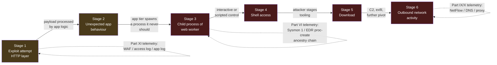
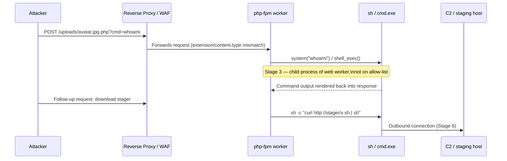

# Part XLIX — Web Compromise Detection Model

## Why this part exists as its own model

Part XI (Web Detection Engineering) covers how to detect exploit attempts against a web
application at the HTTP layer. Part VI (Process Tree Detection) covers how to reason about
process ancestry once something executes on a host. Neither part, read alone, tells you whether a
given SQL injection attempt, deserialization probe, or file-upload abuse actually *worked*. A web
application receives thousands of exploit attempts a day in most internet-facing environments —
scanners, bots, security researchers, curious script kiddies, actual attackers, and automated
tooling that doesn't discriminate between any of them. The overwhelming majority hit a patched,
unaffected, or misconfigured-away target and go nowhere.

The single most expensive mistake a detection program makes with web attacks is treating "exploit
attempt observed" and "compromise occurred" as the same event. They are not, and conflating them
produces two failure modes at once: alert fatigue from paging on every scanner hit (which trains
analysts to ignore web alerts entirely), and — the more dangerous failure — missing the one exploit
attempt in ten thousand that actually landed, because it looked identical at the HTTP layer to the
nine thousand nine hundred ninety-nine that didn't.

This part builds the correlation chain that answers the only question that actually matters:
**did the exploit attempt cause the application to do something an application should never do?**
That "something" is almost always a process spawn, a file write outside the expected web root, or
an outbound connection the application tier has no legitimate reason to make. The chain:

**Exploit attempt (Part XI) → unexpected application behaviour → child process spawned by the web
application (Part VI ancestry) → shell access → download → outbound network activity.**

Every stage after the first is optional from the attacker's perspective in the sense that a failed
exploit stops the chain immediately — which is exactly why chaining, not single-event scoring, is
the right architecture here. A web tier that only ever alerts on stage 1 (the HTTP-layer payload)
is alerting on noise. A web tier that only ever alerts on stage 3+ (the process spawn) has thrown
away the earliest, cheapest-to-collect signal and the forensic context that explains *why* that
process exists at all.



[MANAGEMENT] This model is the argument for why web-tier detection budget should go toward host
telemetry on the application servers (Sysmon/EDR/auditd on the actual web worker processes) at
least as much as toward WAF tuning. A WAF stops what it recognizes. Host-level process ancestry
catches what got past the WAF, regardless of which CVE or 0-day it was, because the *behaviour*
after a successful exploit is far more consistent than the exploit itself.

## Stage 1: Exploit attempt (Part XI recap and what carries forward)

[CONCEPT] This is everything Part XI already covers in depth: SQLi, XSS, path traversal/LFI/RFI,
command injection, SSTI, deserialization, and framework-specific CVE exploit strings. What this
part adds is which of those attack classes are actually capable of reaching stage 3 (a process
spawn) versus which structurally cannot.

| Attack class | Can it reach "child process of web app" on its own? | Typical path to stage 2/3 |
|---|---|---|
| Reflected/stored XSS | No — executes in a victim's browser, not on the server | Not part of this chain; a different compromise model (client-side) |
| SQL injection | Rarely directly, but yes via `xp_cmdshell`, `INTO OUTFILE` + web-accessible path, or stacked queries against a DB with OS-command extensions enabled | DB engine or web app executes a command as a side effect of the injected query |
| Path traversal / LFI | Yes, when combined with a way to get attacker content into a file the app then includes (log poisoning, session file, upload directory) | LFI executes attacker-controlled PHP/code that itself spawns a process |
| Unrestricted file upload | Yes, directly, if the uploaded file lands in a web-executable path and gets requested | Uploaded webshell gets invoked by the web server, which then spawns a process |
| Deserialization (Java/PHP/.NET) | Yes, often directly — many deserialization gadget chains end in process execution | Gadget chain invokes `Runtime.exec()`/`ProcessBuilder`/equivalent |
| SSTI (template injection) | Yes, directly on template engines that expose enough sandbox-escape surface | Template renders to a code-execution primitive |
| Command injection | Yes, directly and immediately — this is the shortest path in the whole model | The injected shell metacharacters are the process spawn |
| Known-CVE RCE (Log4Shell, Spring4Shell, Struts OGNL, etc.) | Yes, that's the point of the CVE class | JNDI lookup / class loader manipulation / OGNL evaluation executes attacker code |

**Hunter's Note:** if your detection coverage matrix (Part XXXVI) shows "SQL injection: covered"
and "web shell / RCE: covered" as two unrelated line items with no chain between them, you have a
coverage matrix that looks complete and isn't. The question a hunter should always be able to
answer is: for each web attack class we detect at stage 1, what does successful exploitation of
that class look like at stage 2 and 3, and do we actually have telemetry there?

## Stage 2: Unexpected application behaviour

[CONCEPT] This is the stage most detection programs skip entirely because it requires
application-specific baselining, not a generic signature. "Unexpected behaviour" means: the
application did something that is technically within its code paths but never happens during
normal operation for that route, that user, or that time of day.

[ANALYST] Concretely, this looks like: a request to a read-only reporting endpoint that triggers a
file write; a request that produces a response several orders of magnitude larger or smaller than
that route's baseline; an endpoint that has never returned a 500 in its history suddenly returning
one repeatedly from the same source; a static-content route suddenly generating dynamic
server-side processing (a `.jpg` request that hits PHP-FPM instead of being served directly by
nginx — a classic sign of an uploaded webshell disguised with an image extension and a
double-extension trick, e.g. `avatar.jpg.php`); or a login/search/upload endpoint whose latency
profile shifts sharply and stays shifted (not a single slow request — a new steady-state).

[DETECTION ENGINEER] The practical way to operationalize this without hand-building a baseline for
every route is to instrument three cheap, high-value signals at the reverse proxy or app-server
layer and alert on their combination with stage-1 signal, not on either alone:

1. **Extension/content-type mismatch** — a request path ending in a static extension
   (`.jpg`, `.png`, `.css`, `.pdf`) that gets routed to an interpreter (PHP-FPM, a servlet
   container) instead of served as a static file. This single check catches a large fraction of
   webshell-via-upload cases with almost no tuning.
2. **New file served from an upload/media directory that matches an executable extension for
   that stack** — `.php`, `.jsp`, `.asp/.aspx`, `.phtml`, `.php5` appearing under `/uploads/`,
   `/media/`, `/wp-content/uploads/`, or any directory the application's own configuration says
   should never execute code.
3. **Process-list drift on the web tier** — the web server worker process (`w3wp.exe`,
   `httpd`, `nginx`, `php-fpm`, `java` running Tomcat/JBoss/WebLogic) spawning *any* child process
   at all, in environments where the application is known never to need to (most CRUD web apps,
   CMS platforms, and API backends have zero legitimate reason to spawn a shell, ever).

```
CONCEPTUAL SAMPLE — nginx access log line showing extension/content-type mismatch
(illustrative, field order matches nginx combined log format)

10.60.14.203 - - [15/Sep/2026:03:14:07 +0000] "POST /wp-content/uploads/2026/09/avatar.jpg.php HTTP/1.1" 200 187 "-" "python-requests/2.31.0"
```

That single line — a POST to a file with a double extension under an uploads directory, served
successfully (200), with a non-browser User-Agent, at 3am — is the highest-value single log line
in this entire chapter. It is stage 1 (upload abuse got the file there) and the trigger for stage 2
(the request that invokes it) compressed into one event, and it should be enough on its own to
open an investigation even before any process telemetry arrives.

**Engineering Reality:** most WAFs and reverse proxies do not log the *outcome* of a request
against the file it served — they log method, path, status code, and maybe response size. Whether
`avatar.jpg.php` got interpreted as PHP or served as a static blob is a server-configuration fact
(does `.php` under that directory hit the PHP handler?), not something visible in the access log
line itself unless you already know your own server config. Confirm your reverse proxy/app-server
config before assuming this detection is even structurally possible on your stack — on a
misconfigured Apache with `AllowOverride` letting a `.htaccess` re-enable PHP execution in an
uploads directory, this can happen even when your documented config says uploads are non-executable.

## Stage 3: Child process spawned by the web application (Part VI ancestry, applied to web workers)

[CONCEPT] This is where Part VI's ancestry model becomes the load-bearing detection. The specific
ancestry judgment for the web tier is narrower and higher-confidence than the general enterprise
case covered in Part VI, because web application worker processes have an unusually small and
well-known set of legitimate children — in most environments, approximately zero.

| Web worker process | Legitimate children (should be rare/none) | Highly suspicious children |
|---|---|---|
| `w3wp.exe` (IIS app pool worker) | None for most .NET/ASP apps; occasionally a narrowly-scoped helper for specific COM/Office-interop workloads | `cmd.exe`, `powershell.exe`, `certutil.exe`, `net.exe`, `whoami.exe`, any LOLBin |
| `httpd`/`apache2` | None for static/PHP-FPM-proxied setups | `sh`, `bash`, `perl`, `python`, `nc`/`ncat`, `curl`/`wget` invoked outside deployment tooling |
| `php-fpm` (`php-fpm.sock` worker) | None during normal request handling | `sh -c`, `bash`, any shell invoked via PHP `system()`/`exec()`/`shell_exec()`/`passthru()` backing a webshell |
| `nginx` (as reverse proxy only) | None — nginx itself proxies, it does not execute app code | Any child process at all is anomalous for a pure reverse-proxy role |
| `java` (Tomcat/JBoss/WebLogic/WebSphere) | JVM-internal threads only; no OS process children for normal servlet operation | `sh -c`, `cmd.exe /c`, deserialization-gadget-driven `ProcessBuilder` children |
| `w3wp.exe`/`httpd` spawning a scripting engine | — | `wscript.exe`, `cscript.exe`, `mshta.exe`, `rundll32.exe`, `regsvr32.exe` — none of these have a legitimate reason to be a web-worker child |

**Detection Autopsy — the naive "child process of the web server" rule**

Original logic: alert whenever `ParentImage` is one of the known web-worker binaries
(`w3wp.exe`, `httpd`, `php-fpm`, `nginx`, `java` under a known app-server path) and `Image` is any
process at all — "web server processes should never spawn children, full stop."

Why it looked reasonable: it's true for the overwhelming majority of pure CRUD web applications,
and it's the single highest-signal ancestry rule available for this tier — genuinely close to a
tautology for most stacks.

What broke in production:
- False positives: patch-management and monitoring agents that periodically shell out from
  within the app-server process tree for health checks; deployment tooling (blue/green deploy
  scripts, container entrypoint wrappers) that briefly parents a shell during a rolling restart;
  a small number of legitimate applications (report generators calling out to `wkhtmltopdf`,
  image-processing pipelines calling `imagemagick`/`ghostscript` binaries, PDF/Office
  conversion services) whose entire design is "web request triggers a helper binary" — and these
  are exactly the apps most likely to also be the ones vulnerable to command injection, so the
  legitimate and malicious cases visually overlap.
- False negatives: none directly from over-broad matching, but the rule alone gave zero severity
  differentiation — a legitimate `wkhtmltopdf` spawn and a `cmd.exe /c whoami` spawn generated
  identical-looking alerts, so analysts (correctly) started deprioritizing the whole rule class
  after the third week of triaging PDF-generation noise, which is the real failure mode: signal
  buried under its own false positives until it gets ignored.
- Missing context: no distinction between a known, allow-listed helper binary invoked with its
  normal argument shape, versus a shell interpreter invoked with attacker-shaped arguments
  (piped input, base64, network-fetch one-liners); no correlation back to the stage-1 HTTP request
  that immediately preceded the spawn.

Revised analytic: split the rule into two tiers. Tier one — an explicit allow-list of expected
helper binaries per application, matched by full path and expected argument pattern, logged but
not alerted. Tier two — everything else, which is any web-worker child *not* on the allow-list,
promoted to high severity automatically, with zero tolerance, because the base rate of legitimate
"other" children is close to zero once the known-good helpers are carved out. Additionally,
correlate the spawn event backward against the access/app log for a matching request within a
short window (same source IP or session) — when present, it converts "high severity" into
"near-certain compromise" and gives the analyst the exact request that caused it.

How it was tested: ran the application's own normal PDF-generation and image-processing
workflows in a staging environment to confirm the allow-list tier suppressed them; replayed a
captured webshell interaction (isolated lab) to confirm the non-allow-listed tier fired
immediately and included the correlated HTTP request in the alert body.

Result: alert volume on the rule dropped by most of its previous noise from the allow-list split,
and the remaining alerts came with the causal HTTP request attached, cutting mean investigation
time because analysts no longer had to manually pivot from a bare process-creation event back into
proxy logs to find out what caused it.



## Stage 4: Shell access

[CONCEPT] Once a child process exists under the web worker, the attacker typically wants
persistent or at least repeatable command execution rather than one command per HTTP request. This
shows up as one of a small number of well-known patterns:

- **Webshell interaction pattern** — repeated POST requests to the same uploaded file, each
  carrying a different command in a parameter, each producing a distinct short-lived child
  process under the same web worker. The tell here is *repetition to the same URI with varying
  parameter content and a process-spawn following nearly every hit* — a legitimate file (even a
  broken one returning errors) doesn't generate a new shell child on every request.
- **Reverse shell** — the child process (or a further child of it) opens an outbound connection
  and binds stdin/stdout to it (`bash -i >& /dev/tcp/...`, PowerShell `-nop -c` with a
  `TcpClient` payload, `nc -e`). This is the cleanest pivot point into stage 6, because the shell
  and the network connection are frequently the same event.
- **Bind shell / listener** — less common from a web-tier foothold because it requires an
  inbound port the attacker can reach, but seen when the web tier sits in a network segment with
  looser inbound rules than expected (a classic segmentation-gap finding worth escalating to
  Part XIV/network architecture review regardless of whether it gets exploited).

[ANALYST] The single most reliable host-side indicator at this stage is a process with a
**web-worker ancestor** that also has an **open network socket to an external or unexpected
internal address**, especially when that process is a shell interpreter rather than the
application's own binary. Sysmon Event ID 3 (network connection) correlated by `ProcessGuid` back
to the Event ID 1 (process creation) that has `php-fpm`/`w3wp.exe`/`httpd` in its ancestry is the
exact join that confirms this stage.

[THREAT HUNTER] Hunt for webshell interaction patterns even without a stage-3 alert firing, by
looking at access logs for URIs that: live under an uploads/media path, have an executable
extension for that stack, and have been requested more than a handful of times from the same
source with varying query strings/parameter values over a short window. This catches webshells
that were uploaded through a vector your stage-1 detection didn't recognize (a zero-day upload
bypass, or an upload that happened before your detection existed).

## Stage 5: Download

[CONCEPT] Attackers operating through a freshly gained web-tier shell almost always need to bring
in tooling the initial payload didn't include — a more capable webshell, a privilege-escalation
exploit for the host OS, a proxy/tunnel tool, or a second-stage implant. This means an outbound
fetch initiated *by the shell process*, not by the application's normal update/dependency
mechanisms.

[DETECTION ENGINEER] Look for the shell-adjacent download primitives specifically, not generic
outbound traffic: `curl`/`wget` invoked with a URL argument by a process in the web-worker
ancestry chain, PowerShell's `Invoke-WebRequest`/`DownloadFile`/`DownloadString`, `certutil -urlcache
-split -f` (a well-known LOLBin download technique on Windows), Python's `urllib`/`requests`
invoked from a one-liner rather than as part of the application's own code, or a raw TCP connection
followed almost immediately by a file write to a web-writable directory (download-via-shell rather
than via a recognized HTTP client binary).

```
Illustrative KQL — download activity in the ancestry of a web worker process
(illustrative: field names assume Sysmon-via-EDR schema, e.g. Microsoft Defender for Endpoint
DeviceProcessEvents; adjust to your actual telemetry schema)

DeviceProcessEvents
| where InitiatingProcessParentFileName in~ ("w3wp.exe", "httpd", "php-fpm", "nginx", "java")
   or InitiatingProcessFileName in~ ("w3wp.exe", "httpd", "php-fpm", "nginx", "java")
| where FileName in~ ("curl.exe", "wget.exe", "certutil.exe", "powershell.exe", "python.exe", "python3")
| where ProcessCommandLine has_any ("http://", "https://", "DownloadFile", "DownloadString", "-urlcache", "Invoke-WebRequest")
| project Timestamp, DeviceName, InitiatingProcessFileName, FileName, ProcessCommandLine, AccountName
```

**Engineering Reality:** `certutil -urlcache -split -f` is a genuinely useful diagnostic for
Windows admins troubleshooting certificate revocation checking, which is exactly why it's a
LOLBin — it has a real legitimate use, so this pattern needs the web-worker ancestry qualifier to
be worth alerting on. The same command line from an admin's interactive session and from a
`w3wp.exe` descendant carry completely different priors; don't build one rule that fires on both
without carrying the ancestry context into the alert.

## Stage 6: Outbound network activity

[CONCEPT] This is the stage that turns "we found a webshell" into "we have a confirmed
compromise with an active or historical command-and-control channel," and it's the stage most
likely to be missing entirely if the web tier doesn't have host-level network visibility (NetFlow/
VPC flow logs alone tell you an internal host talked outbound, but not which *process* did it).

[ANALYST] Look for outbound connections from web-worker-ancestor processes to: newly registered or
low-reputation domains, raw IP-literal HTTPS/HTTP destinations (no DNS lookup preceding the
connection — a common C2 pattern to avoid DNS-based detection), non-standard ports carrying
HTTP-like traffic (C2 frameworks running HTTP(S) profiles on 8443, 4444, 53 instead of 443),
and beaconing intervals (regular, low-jitter connection timing rather than the bursty pattern of
human-driven browsing or legitimate API calls).

[THREAT HUNTER] Cross-reference outbound connections in the web-worker ancestry against DNS logs
(Part X) for the same host/timeframe. A webshell-driven C2 channel that skips DNS and connects
directly to an IP literal is itself a signal — most legitimate application dependencies (package
registries, cloud APIs, license servers) resolve a hostname first. Absence of a matching DNS query
immediately before an outbound connection from a web-tier host is a distinct, cheap hunting lead.

**SOC Management View:** stage 6 is usually where a web compromise stops being "a detection
engineering problem" and becomes "an incident with data-exposure and regulatory-notification
implications," because a web tier with outbound C2 access from a process spawned by a public-facing
application is, by definition, no longer just a vulnerable app — it's an active foothold. Budget
and staffing decisions should reflect that stage 3 through stage 6 detections on the web tier are
worth disproportionate investment relative to their volume: they fire rarely, but every true
positive is a page-now, all-hands event, not a queue item.

## The full worked correlation: end-to-end chain

This is the analytic that ties all six stages together into one correlation rule, in the spirit of
Part XXIII's correlation model, scoped to the web-compromise chain specifically.

**part49-01 — Web Exploit-to-Compromise Correlation Chain**

Entities carried across stages: source IP / session (stage 1→2), host + web-worker process
(stage 2→3), process ancestry chain / `ProcessGuid` (stage 3→4→5), and destination IP/domain
(stage 5→6). Time window: 15 minutes end-to-end is a reasonable starting bound for interactive
webshell abuse; widen for slower, more careful operators.

```
Illustrative SPL (Splunk) — multi-stage correlation, illustrative field names,
assumes access logs, Sysmon-via-EDR, and NetFlow are indexed with a common host field

index=web_access (uri_path="*/uploads/*" OR uri_path="*/wp-content/*")
  (uri_path="*.php" OR uri_path="*.jsp" OR uri_path="*.asp*")
  status=200
| eval stage1_time=_time
| join type=inner host [
    search index=edr_process_creation
      ParentImage IN ("*php-fpm*","*httpd*","*w3wp.exe","*nginx*","*java*")
      NOT ParentImage IN ("*allowlisted_helper*")
    | eval stage3_time=_time
  ]
| where stage3_time > stage1_time AND stage3_time < stage1_time + 900
| join type=left host [
    search index=edr_network_connection
      InitiatingProcessParentImage IN ("*php-fpm*","*httpd*","*w3wp.exe","*nginx*","*java*")
    | eval stage6_time=_time
  ]
| where isnull(stage6_time) OR (stage6_time > stage3_time AND stage6_time < stage3_time + 900)
| table host, src_ip, uri_path, stage1_time, Image, CommandLine, stage3_time,
        DestinationIp, DestinationPort, stage6_time
| eval chain_confidence=case(
    isnotnull(stage6_time), "confirmed - full chain with outbound activity",
    isnull(stage6_time), "high - process spawn confirmed, no outbound seen yet"
  )
```

This is illustrative — field names, index names, and join syntax will need to match your actual
SPL environment and data model (CIM-compliant `Web`, `Endpoint.Processes`, and `Network_Traffic`
data models are the more production-realistic approach than raw `index=` joins shown here for
brevity). The logic is the load-bearing part: require stage-1 evidence, require stage-3 confirmed
process spawn outside the allow-list within a bounded window of stage 1, and treat stage 6 as a
confidence multiplier rather than a hard requirement — a chain that stops at stage 3/4 is still a
confirmed compromise even if the attacker hasn't (yet) moved data or called out.

## Where the chain breaks in practice, and what that means for coverage

| Break point | Why it happens | What it costs you |
|---|---|---|
| No stage-1 signal at all | WAF logs only blocked requests; the successful exploit was, by definition, allowed | Chain starts at stage 3 with no causal HTTP request attached — still detectable, just harder to explain in the ticket |
| Stage 2 invisible | Reverse proxy doesn't distinguish "served as static" vs "routed to interpreter"; only method/path/status logged | Extension-mismatch detection can't run; rely entirely on stage 3 |
| Stage 3 missing | No host telemetry agent on the web tier (common on autoscaled/ephemeral instances, containers without a sidecar) | This is the single most damaging gap in this whole model — everything downstream becomes much harder to attribute to the original request |
| Stage 4/5 short-lived | Attacker runs one command per request (no persistent shell), each child process lives milliseconds | Requires process-creation logging with no sampling/rate-limiting at the EDR/Sysmon layer, or these get missed entirely |
| Stage 6 blind | Web tier egress isn't monitored at the process level, only at the perimeter/NetFlow level | You can see *that* the host talked outbound but not *which process*, weakening attribution back to the webshell specifically |

**Engineering Reality:** the container/serverless trend has made stage 3 the most commonly missing
link in this entire chain. A web application running in a container that gets recycled every
deployment, with no EDR sidecar and no `auditd`/Sysmon-equivalent inside the container, gives you
stage 1 (access logs, probably centralized) and maybe stage 6 (VPC flow logs) with a complete gap
in between. If your web tier is containerized, this model is the argument for either a runtime
security agent inside the container image (Falco, or an EDR agent with container support) or
accepting, explicitly and in writing to management, that stage 2–5 detection on that tier does not
exist yet.

## Screenshot and log-capture placeholders for lab validation

> **[SCREENSHOT PLACEHOLDER — CONTROLLED LAB]** — Sysmon process-creation log (Event ID 1) on a
> lab web server showing `w3wp.exe` (or `php-fpm`) as `ParentImage` with a shell interpreter as
> `Image`, captured after replaying a known webshell payload against a deliberately vulnerable
> lab application (e.g. a DVWA/Juice Shop style target) — would illustrate the exact
> `ParentImage`/`Image`/`CommandLine` field values referenced in the stage 3 table above.

> **[SCREENSHOT PLACEHOLDER — CONTROLLED LAB]** — reverse proxy / access log capture showing the
> extension-mismatch request pattern (`POST /uploads/....jpg.php`) alongside the corresponding
> Sysmon Event ID 3 (network connection) for the resulting child process, joined by timestamp and
> host — would illustrate the stage 2 → stage 3 → stage 6 correlation described in part49-01.

> **[SCREENSHOT PLACEHOLDER — CONTROLLED LAB]** — honeynet attacker session log (if available from
> the existing honeynet/IOC-enrichment environment) showing a real unsolicited webshell upload
> attempt against an intentionally exposed service, to illustrate what stage 1/2 traffic looks
> like from an actual opportunistic scanner rather than a synthetic lab replay.

## Tying it back to Part XI and Part VI explicitly

- Every field in the "multi-signal field model" from Part XI (method, URI, headers, status,
  response size, latency, source, session, WAF signal) is exactly the evidence this part uses to
  populate stage 1 and stage 2 of the chain — this part does not introduce new web-layer fields, it
  routes Part XI's output into a process-ancestry judgment.
- Every ancestry question from Part VI's "reasoning across a chain, not a pair" section (is this
  pairing expected, is the command line consistent, what's the user/session context, what happens
  next, how rare is this) applies unchanged at stage 3 — the only addition here is that the
  *expected* baseline for a web-worker process is far narrower and stricter than for a general
  enterprise endpoint, which is what makes stage 3 detections on this tier unusually
  high-confidence relative to their false-positive rate elsewhere in Part VI's spectrum model.
- The correlation mechanics (entity keys, bounded time windows, confidence scoring across stages)
  follow Part XXIII's general correlation model, applied to a specific, named, high-value chain
  rather than the generic logon-to-callout example used there.

## MITRE ATT&CK mapping for this chain

| Stage | Technique(s) |
|---|---|
| Stage 1 — Exploit attempt | T1190 (Exploit Public-Facing Application) |
| Stage 2 — Unexpected app behaviour / webshell placement | T1505.003 (Server Software Component: Web Shell) |
| Stage 3 — Child process of web worker | T1059 (Command and Scripting Interpreter), T1106 (Native API, where applicable) |
| Stage 4 — Shell access | T1059 (Command and Scripting Interpreter), T1219 (Remote Access Software, if a reverse-shell-to-RAT pivot occurs) |
| Stage 5 — Download | T1105 (Ingress Tool Transfer) |
| Stage 6 — Outbound network activity | T1071 (Application Layer Protocol), T1573 (Encrypted Channel, if TLS-wrapped C2), T1568 (Dynamic Resolution, if domain-generation/fast-flux C2 infrastructure is used) |

## Summary for the detection engineer building this

Build stage 1 and stage 2 detections from Part XI's model, but score them low-confidence on their
own — they're triage leads, not pages. Build stage 3 as the highest-confidence checkpoint in the
whole chain by allow-listing known-legitimate web-worker children per application and alerting on
everything else, unconditionally. Carry the entity keys (source IP/session from stage 1,
process ancestry GUID from stage 3) forward through stages 4–6 so that when an outbound
connection or download does appear, the alert already contains the original HTTP request that
started it. And treat any environment where stage 3 telemetry doesn't exist — most commonly
ephemeral containers and serverless web tiers — as a named, tracked coverage gap, not a silent one.
