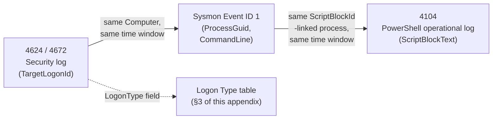

# Appendix A1 — Windows & Endpoint Telemetry Field Reference

## Why this appendix exists

Parts 8 through 11 teach what each Windows and endpoint telemetry source captures, why it captures it, and how to build detection and hunting logic on top of it. None of those parts reprints every field on every event ID it discusses — Part 8 says so explicitly, and the same design choice holds across Parts 9, 10, and Part 3's Linux/SSH material: the narrative parts cover the fields that actually drive a detection or triage decision, in the order a reader needs them to build understanding. This appendix is the companion field-level dump those parts point back to — a lookup table, not a teaching text. If you already know what Event ID 4624 (An account was successfully logged on) does and just need to remember whether `WorkstationName` is client-supplied or server-verified, this is the page. If you're building your first Windows logon detection, read Part 8 first and treat this appendix as the reference you return to while writing the query.

Nothing in this appendix introduces new analytic logic, new detection thresholds, or new MITRE mappings beyond what Parts 3, 8, 9, 10, and 11 already establish. Where a field's behavior depends on Windows build, agent version, or configuration that this book cannot verify against every possible environment, that uncertainty is stated directly rather than papered over with a confident-sounding default.

---

## 1. How to use this appendix

- **§2** covers native Windows Security, System, and Application log event IDs — the telemetry Part 8 owns.
- **§3** is the Logon Type reference table, reproduced in full here because it's referenced from Parts 8, 11, 12, and 13 and is easiest to find as a standalone lookup.
- **§4** covers Sysmon event types — the telemetry Part 9 owns.
- **§5** covers PowerShell logging (4103/4104) and AMSI-related fields — the telemetry Part 10 owns.
- **§6** covers Linux `syslog`/`journald`/auditd and SSH telemetry fields — the telemetry Part 3 §6–§7 owns.
- **§7** is a single worked, cross-source example tracing one logical session across four of the tables above, with a Mermaid diagram of the join keys involved.

Field names in this appendix use the label a SIEM query would actually reference (`TargetLogonId`, `ScriptBlockText`, `auid`) rather than the friendlier prose description a narrative chapter might use for the same field on first mention — this is a lookup table, so it's optimized for matching what you'd type into a query, not for readability on a first pass.

> **Engineering Reality**
> Every table in this appendix reflects field behavior as documented and as observed in this book's own lab evidence at the time of writing (2026-09-15). Windows builds, Sysmon schema versions, and PowerShell versions all change field availability and naming over time, and a vendor EDR agent upgrade can silently restructure fields with zero ingest error (Part 3 §5.4). Treat every row here as "verify against your current build" rather than as a permanent guarantee — that verification step is cheap, and skipping it is exactly how Schema Drift (TERMINOLOGY.md) enters a detection stack unnoticed.

---

## 2. Windows Security, System, and Application log event ID reference

**[DETECTION ENGINEER]** All event IDs below are Windows Security or System log entries unless noted otherwise. Cross-referenced narrative treatment: Part 8 (all IDs in §2.1–§2.5), Part 11 (4688, 4698, 7045, 4697, 1102, in an analytic/cross-OS context), Part 13 (Kerberos analytic layer built on 4768/4769/4771).

### 2.1 Logon and credential-validation events

The table below lists the fields that drive detection and triage logic for each logon-related event ID; see §3 for the full Logon Type value table these events reference via `LogonType`.

| ID | Name | Key fields | Notes |
|---|---|---|---|
| `4624` | An account was successfully logged on | `TargetUserName`, `TargetDomainName`, `TargetLogonId`, `LogonType`, `IpAddress`, `IpPort`, `WorkstationName`, `LogonProcessName`, `AuthenticationPackageName`, `ElevatedToken` | Highest-volume single event ID on most domains. `TargetLogonId` is the cheapest cross-event correlation key for the whole session (joins to 4672, 4688). `WorkstationName` is client-supplied — informative, not authoritative. |
| `4625` | An account failed to log on | Same shape as 4624, plus `Status`, `SubStatus` | See the `Status`/`SubStatus` code table below — the failure reason, not just the failure count, drives the correct response. |
| `4648` | A logon was attempted using explicit credentials | `SubjectUserName`, `TargetUserName`, `TargetServerName`, `ProcessName` | Fires on `runas`, alternate-credential drive mapping, and credential-reuse tooling. Legitimate use is rare and concentrated — a strong hunting pivot (Part 8 §3, HUNT-08-01). |
| `4672` | Special privileges assigned to new logon | `PrivilegeList`, `SubjectLogonId` | Fires immediately after a 4624 that grants a sensitive privilege (`SeDebugPrivilege`, `SeBackupPrivilege`, `SeTakeOwnershipPrivilege`, and similar). `SubjectLogonId` ties back to the originating 4624's `TargetLogonId`. Alerting on the raw event alone is a documented Detection Autopsy failure (Part 8 §4.1) — pair with a baseline. |
| `4776` | The domain controller attempted to validate the credentials for an account | `TargetUserName`, `Workstation`, `Status` | NTLM-specific; does not fire for Kerberos authentication. `Status` shares its code space with 4625's `Status`/`SubStatus`. A high 4776-to-4768/4769 ratio signals legacy NTLM dependency or forced NTLM fallback (a pass-the-hash/relay pattern) — 4776 alone can't distinguish the two. |

**4625 `Status`/`SubStatus` code reference:**

| Code | Meaning | Detection implication |
|---|---|---|
| `0xC000006A` | Bad password, valid username | Core signal for password-guessing/spray detection |
| `0xC0000064` | Username doesn't exist | Enumeration signal, distinct from a guessing attempt against a real account |
| `0xC0000234` | Account locked out | Consequence event — correlate backward to the 4625 burst that caused it |
| `0xC0000072` | Account disabled | Someone attempting a deliberately disabled account, worth checking regardless of volume |
| `0xC0000071` | Password expired | Routine; not an attack signal alone |

### 2.2 Kerberos ticket events

On a Kerberos-authenticating domain, the ticket lifecycle is covered by three domain-controller event IDs. Part 8 §5 covers these as pure telemetry; Part 13 owns the Kerberoasting/AS-REP-roasting analytic layer built on top of them.

| ID | Name | Key fields | Notes |
|---|---|---|---|
| `4768` | A Kerberos authentication ticket (TGT) was requested | `TargetUserName`, `ServiceName` (typically `krbtgt`), `TicketEncryptionType`, `PreAuthType`, `ResultCode`, `IpAddress` | `PreAuthType` of `0` or absent is the AS-REP roasting precondition. |
| `4769` | A Kerberos service ticket was requested | `TargetUserName`, `ServiceName`/`ServiceSid`, `TicketEncryptionType`, `TicketOptions`, `ResultCode`, `IpAddress` | Typically the highest-volume single event ID on a domain controller — every SMB share access and SPN-mapped service connection generates it. See STYLE-GUIDE.md's own worked Kerberoasting Detection Autopsy for why a naive `TicketEncryptionType` filter alone floods a domain with false positives. |
| `4771` | Kerberos pre-authentication failed | `TargetUserName`, `IpAddress`, `Status` | `0x18` bad password; `0x25` clock skew beyond Kerberos tolerance (a Part 7 pipeline problem, not a security one); `0x12` disabled/expired/locked account. |

**`TicketEncryptionType` value reference** (shared code space across 4768/4769):

| Value | Algorithm | Notes |
|---|---|---|
| `0x17` | RC4 | The textbook Kerberoasting signal — also the default fallback for any legacy, non-AES-capable service account, which is exactly why a bare filter on this value alone is a documented false-positive driver (STYLE-GUIDE.md's canonical Kerberoasting Detection Autopsy). |
| `0x11` | AES128 | — |
| `0x12` | AES256 | — |

### 2.3 Process, service, and scheduled-task creation

These events fire when something new is created to run code — a process, a service, or a scheduled task — the audit trail an attacker touches for both initial execution and persistence.

| ID | Name | Log channel | Key fields | MITRE | Notes |
|---|---|---|---|---|---|
| `4688` | A new process has been created | Security | `NewProcessId`, `NewProcessName`, `ProcessId` (parent, by ID), `SubjectUserName`, `TokenElevationType`, `CommandLine` (conditional) | — | `CommandLine` only populates if the "Include command line in process creation events" GPO is separately enabled — off by default on every supported Windows version as of this writing. Without it, 4688 tells you *that* a process launched, not *what argument string* it launched with. Sysmon Event ID 1 captures the command line unconditionally (§4.1 below). Process creation on its own maps to too many techniques to tag a single ID here — see the Sysmon Event ID 1 row in §4 for the mapping used when command-line content is actually evaluated. |
| `4697` | A service was installed in the system | Security | `SubjectUserName`, `ServiceName`, `ServiceFileName`, `ServiceAccount` | T1543.003 (Create or Modify System Process: Windows Service) | Requires "Audit Security System Extension" advanced audit subcategory — not enabled by default. |
| `7045` | A service was installed in the system | System | `ServiceName`, `ImagePath`, `AccountName` | T1543.003 (Create or Modify System Process: Windows Service) | Comes from the Service Control Manager directly, not security auditing — enabled by default on a standard build. Build service-installation detection against this event first; treat 4697 as a corroborating Security-log source once its subcategory is confirmed enabled, not the primary source. |
| `4698` | A scheduled task was created | Security | `SubjectUserName`, `TaskName`, `TaskContent` | T1053.005 (Scheduled Task/Job: Scheduled Task) | Requires "Audit Other Object Access Events" advanced subcategory. `TaskContent` is an embedded XML blob containing the task's action definition — parse it directly; the payload command doesn't appear in a top-level field. |
| `4702` | A scheduled task was updated | Security | Same shape as 4698 | T1053.005 (Scheduled Task/Job: Scheduled Task) | Same subcategory dependency as 4698. |

> **Blind Spot**
> `4697` and `7045` both fire only on new service creation (the `CreateService` API call). An attacker who instead reconfigures an existing, already-installed service's binary path — `sc config <existing-service> binpath= ...`, or the equivalent `ChangeServiceConfig` call — achieves the same Windows-service persistence (T1543.003) without ever calling `CreateService`, and neither event fires. There is no dedicated Security or System event for a service *reconfiguration*; catching this requires registry-value auditing on the service's key under `HKLM\SYSTEM\CurrentControlSet\Services\<name>` (Sysmon Event ID 13, §4) or a periodic diff against a known-good service inventory.

### 2.4 Account, group, and audit-policy change events

Part 13 owns the identity-abuse analytic layer for these events (baselining routine joiner/mover/leaver activity against privilege-escalation abuse); this table is the field-level reference only.

| ID | Name | Key fields | Typical MITRE mapping when abused |
|---|---|---|---|
| `4720` | A user account was created | `SubjectUserName`, `TargetUserName`/`SamAccountName`, `UserAccountControl` | T1136.002 (Create Account: Domain Account) on a DC, T1136.001 (Create Account: Local Account) on a standalone host |
| `4724` | An attempt was made to reset an account's password | `SubjectUserName`, `TargetUserName` | T1098 (Account Manipulation) |
| `4728` | A member was added to a security-enabled global group | `SubjectUserName`, `MemberName`/`MemberSid`, `TargetUserName` (the group) | T1098 (Account Manipulation) |
| `4732` | A member was added to a security-enabled local group | Same shape as 4728, scoped to a local group | T1098 (Account Manipulation) |
| `4740` | A user account was locked out | `TargetUserName`, `TargetDomainName`, caller computer name | — (consequence event; correlate to the causing 4625 burst) |
| `4719` | System audit policy was changed | `SubjectUserName`, `SubcategoryId`, `AuditPolicyChanges` | T1562.002 (Impair Defenses: Disable Windows Event Logging) when the change reduces auditing |

`4728`/`4732`'s `MemberSid` occasionally fails to resolve to a name (rendered as a raw SID, or historically a literal `-`) — verify against Active Directory directly before treating an unresolved identity as itself suspicious.

### 2.5 Discovery and log-tampering events

Two of the event IDs below cover group-membership enumeration relevant to discovery; the third is the one event ID this book treats as an unconditional escalation regardless of context.

| ID | Name | Key fields | MITRE |
|---|---|---|---|
| `4798` | A user's local group membership was enumerated | `TargetUserName`/`TargetSid`, `CallerProcessName`, `SubjectUserName` | T1069.001 (Permission Groups Discovery: Local Groups) |
| `4799` | A security-enabled local group membership was enumerated | Same shape as 4798 | T1069.001 (Permission Groups Discovery: Local Groups) |
| `1102` | The audit log was cleared | `SubjectUserName`, `SubjectDomainName`, `SubjectLogonId` | T1070.001 (Indicator Removal: Clear Windows Event Logs) |

`1102` carries almost no legitimate high-frequency use case — see Part 8 §9's SOC Management View callout on zero-tuning policy for this event specifically.

> **Blind Spot**
> `1102` only fires when a log is cleared through the API Windows itself uses to record the clear action (Event Viewer's "Clear Log," `wevtutil cl`, or equivalent). It does not fire if the Windows Event Log service is stopped before the destructive action and the on-disk `.evtx` file is deleted or overwritten directly, and it says nothing about evidence lost to routine size-driven overwrite — the oldest events silently rolling off before anyone reviews them — rather than an explicit clear. The zero-tolerance policy on 1102 catches the API-level clear; it does not catch either of these adjacent anti-forensic paths.

### 2.6 Windows Application log

**[ENGINEERING]** The Application log has no single owning subsystem the way Security (LSASS/Security Reference Monitor) and System (kernel/service control) do — it's a shared channel any installed application or component can write to, with no enforced schema across sources. Parts 8–11 do not build detection logic against specific Application-log event IDs, and this appendix does not invent any: common sources written to this channel include the Windows Installer service (`MsiInstaller` — software install/removal records), `ESENT` (the database engine underlying AD and WSUS, among others), and individual application/security-product self-logging. Exact event ID numbers and field names for these sources vary by product and version in ways this book cannot verify generically — if a detection needs Application-log data from a specific product, confirm the schema against that product's own current documentation and a live capture rather than trusting a generic ID list, including any list published elsewhere that looks authoritative but is unversioned.

> **Blind Spot**
> Because nothing in this book verifies Application-log event IDs against a live Windows host or vendor documentation, treat the Application channel as a source to investigate per-deployment rather than a source with a stable reference table the way Security and System have above. This is a deliberate gap, not an oversight — see the handbook-wide rule against inventing specifics you can't confirm.

---

## 3. Logon Type reference

**[DETECTION ENGINEER]** Reproduced in full from Part 8 §3 because it's the single most cross-referenced table in the Windows telemetry material (Parts 8, 11, 12, 13). The same account, source IP, and time of day describe a completely different risk profile depending on this one field.

| `LogonType` | Name | Typical Legitimate Trigger | Common Attacker-Abuse Pattern |
|---|---|---|---|
| `2` | Interactive | Physical console logon | Attacker with physical/KVM access using stolen credentials directly at the box |
| `3` | Network | SMB share access, mapped drives, service-to-service auth | Lateral movement over SMB/admin shares, remote service installation, password spray |
| `4` | Batch | Scheduled Task execution under a stored account context | Persistence via a malicious scheduled task run under a captured account (4698/4702) |
| `5` | Service | A Windows service starting under its configured account | Malicious service installed under a stolen or over-privileged service account (4697/7045) |
| `7` | Unlock | Workstation unlock after screen-lock idle timeout | Rarely a primary signal alone; relevant for shared-workstation misuse timing |
| `8` | NetworkCleartext | Legacy web auth (IIS Basic authentication) or similar recoverable-password mechanisms | Attractive brute-force/spray target — the exposed auth path is usually the weakest on the estate |
| `9` | NewCredentials | `RunAs /netonly` — keeps the session token, uses alternate creds for outbound network auth | Offensive tooling using cached/stolen credentials for network auth while avoiding an interactive-logon trail |
| `10` | RemoteInteractive | RDP / Terminal Services session | RDP-based lateral movement and hands-on-keyboard remote access |
| `11` | CachedInteractive | Domain logon using cached credentials, DC unreachable | Not a primary attack vector alone; don't flag a legitimately offline laptop as anomalous |

Logon type 10 maps to T1021.001 (Remote Desktop Protocol) and logon type 3 maps to T1021.002 (SMB/Windows Admin Shares) *only* when the surrounding context is abusive — the logon type alone is a session classifier, never a verdict (Part 8 §3).

---

## 4. Sysmon event-type reference

**[DETECTION ENGINEER]** Full narrative treatment, false-positive drivers, and worked detections for every ID below live in Part 9. `ProcessGuid` is the durable cross-event join key throughout this table — prefer it over raw PID, which recycles within hours on a busy host. `LogonId` on Event ID 1 is a separate, cross-*source* join key: it carries the same logon-session value as `TargetLogonId` in 4624 and `SubjectLogonId` in 4672 (§2.1), so a process can be tied back to its originating Windows logon session directly, without falling back to a `Computer`-plus-time-window heuristic — confirm your own pipeline actually preserves and normalizes the field before assuming that direct join is available (§7's worked example uses the heuristic join deliberately, to show what the correlation looks like when it isn't).

| ID | Captures | Key fields | Primary detection use | MITRE (when applicable) |
|---|---|---|---|---|
| `1` | Process creation | `Image`, `CommandLine`, `ParentImage`, `ParentCommandLine`, `User`, `LogonId`, `IntegrityLevel`, `Hashes`, `ProcessGuid` | Execution, LOLBin abuse, obfuscated command lines | T1059 (Command and Scripting Interpreter) |
| `3` | Network connection tied to the initiating process | `SourceIp`/`SourcePort`, `DestinationIp`/`DestinationPort`, `Protocol`, `Image` | C2 beaconing, unexpected outbound from a server role | T1071 (Application Layer Protocol) |
| `6` | Driver load | `ImageLoaded`, `Signed`, `SignatureStatus` | BYOVD, EDR/AV tampering, rootkit staging | T1562.001 (Impair Defenses: Disable or Modify Tools) |
| `7` | Image (DLL) load | `ImageLoaded`, `Signed`, `SignatureStatus`, `ProcessGuid` | DLL sideloading, unsigned module injection | T1574.002 (Hijack Execution Flow: DLL Side-Loading) |
| `8` | CreateRemoteThread into another process | `SourceImage`, `TargetImage`, `StartAddress`/`StartModule`/`StartFunction` | Process injection | T1055 (Process Injection) |
| `10` | One process opening a handle to another with specific access rights | `SourceImage`, `TargetImage`, `GrantedAccess`, `CallTrace` | Credential dumping via LSASS access, process-hollowing precursors | T1003.001 (OS Credential Dumping: LSASS Memory) |
| `11` | File creation | `TargetFilename`, `Image` | Dropped payloads, staging directories | T1105 (Ingress Tool Transfer) |
| `12` / `13` | Registry key/value create, delete, or set | `TargetObject`, `Details` (13 only) | Persistence via run keys, config tampering | T1547.001 (Registry Run Keys / Startup Folder) |
| `15` | Alternate data stream creation on a file | `TargetFilename` (the stream name is a suffix on this field, e.g. `file.txt:Zone.Identifier` — Sysmon does not expose it as a separate field), `Hash` | Mark-of-the-Web evasion, hidden payload staging | T1564.004 (Hide Artifacts: NTFS File Attributes) |
| `17` / `18` | Named pipe creation (17) and connection (18) | `PipeName`, `Image` | C2 frameworks using named pipes for local/SMB comms | — (no clean standalone ID; see Part 9 §3.10) |
| `22` | DNS query issued by a named process | `QueryName`, `QueryStatus`, `QueryResults`, `Image` | Endpoint-side C2 domain resolution, DGA lookups | T1071.004 (Application Layer Protocol: DNS) |
| `23` | File deletion (with content hash, if configured) | `TargetFilename`, `Hashes` | Anti-forensics, log/tool cleanup after use | T1070.004 (Indicator Removal: File Deletion) |

> **Blind Spot**
> `Signed`/`SignatureStatus` on Sysmon Event ID 6 (Driver load) tell you the driver carries a valid signature — not that the driver is safe. BYOVD (Bring Your Own Vulnerable Driver) attacks specifically load legitimately signed drivers with known kernel vulnerabilities to disable EDR/AV or gain kernel-level access; filtering this event to unsigned-only misses the entire technique category by design, since the whole point of BYOVD is a signature check that passes. Cross-reference `ImageLoaded`'s hash or name against a maintained vulnerable-driver list (e.g., the community LOLDrivers project) rather than trusting signature status alone.

> **Blind Spot**
> Sysmon Event ID 8 (CreateRemoteThread) fires when a *new* thread is created in a remote process. APC-based injection that queues work to an already-running thread (`QueueUserAPC`/`NtQueueApcThread`) and thread-hijacking (suspend an existing thread, `SetThreadContext`, resume) never create a new thread, so neither produces an Event ID 8 record — both are common, working techniques that fall under the same T1055 this event is mapped to. Event ID 8 covers one injection primitive, not the technique family; a clean Event ID 8 result set does not mean no injection occurred.

> **Blind Spot**
> `GrantedAccess` on Sysmon Event ID 10 (ProcessAccess) tells you what access rights a process requested against another process's memory — it does not tell you whether that process actually read, dumped, or exfiltrated anything. It also does not exist without Sysmon deployed and this rule group enabled; a host with zero Event ID 10 hits has been shown to have no *monitored* LSASS access attempts, not no credential-theft activity (Part 9 §3.6).

> **Hunter's Note**
> `ProcessGuid` is the field to pull first when reconstructing a process's full activity across every Sysmon event type it generated — process creation (1), any network connections (3), memory access it made or received (10), and files it wrote (11) or deleted (23). Pulling by PID instead will silently merge two unrelated processes that happened to reuse the same recycled PID within your query window.

Whether any of these IDs actually fires depends entirely on the deployed Sysmon config's `onmatch="include"`/`onmatch="exclude"` rule groups (Part 9 §4) — an ID missing from the config produces the same silent zero-events result as an ID that's present but never matched, with no error distinguishing the two cases.

---

## 5. PowerShell logging and AMSI field reference

**[DETECTION ENGINEER]** Part 10 covers the narrative treatment — encoding/obfuscation detection, download-cradle patterns, and AMSI bypass framing. Neither event ID below is enabled by default on any supported Windows version as of this writing; both require the "Turn on Module Logging" and "Turn on PowerShell Script Block Logging" Group Policy settings applied fleet-wide.

| ID | Name | Key fields | Notes |
|---|---|---|---|
| `4103` | Executing Pipeline (module logging) | Cmdlet name, parameter names, and (module-dependent) some parameter values | Verbose — a single scripted task can generate dozens of entries. Parameter-value capture is inconsistent across modules since each module has to opt in. Treat as a secondary, pipeline-shaped view, not the primary content source. |
| `4104` | Creating Scriptblock text (script block logging) | `ScriptBlockText`, `ScriptBlockId`, `Path`, `MessageNumber`/`MessageTotal` | Primary telemetry source for PowerShell detection. Logs the literal text the parser evaluates — including one automatic `Warning`-level entry, independent of the general enable/disable setting, when the parser's own undocumented heuristics flag content as suspicious. |

**4104 field detail:**

| Field | What it holds |
|---|---|
| `ScriptBlockText` | The literal script content the engine parsed — the field every Part 10 detection filters on |
| `ScriptBlockId` | A GUID grouping all log entries belonging to the same script block, including split entries for content over the per-event size limit |
| `Path` | The originating `.ps1` file path, or empty for content that never touched disk (piped, `-Command`, in-memory `IEX`) |
| `MessageNumber` / `MessageTotal` | Sequence markers when one script block's text is split across multiple 4104 events |

**AMSI:** Antimalware Scan Interface verdicts do not produce a PowerShell-specific event ID — the verdict shows up in the registered scanning engine's own detection log (Windows Defender's operational log, or an equivalent EDR alert), correlated back to the PowerShell process by timestamp, PID, and script block. There is no universal `AmsiResult` field this book can point to across every registered provider; correlate by the fields above rather than assuming a fixed schema.

> **Blind Spot**
> `ScriptBlockText` only populates with content the PowerShell *parser* actually evaluates as script syntax. Content assembled and invoked entirely through .NET reflection, shellcode injected by an external loader, or anything run by a downgraded PowerShell version-2 engine (which predates both AMSI and script block logging) can leave 4104 with nothing useful, or nothing at all, for that specific execution path. A clean 4104 result set on a host where PowerShell definitely ran is a reason to check for a version-2 downgrade (Part 10 §3) or a non-scripted invocation path, not evidence that nothing happened.

**Suspicious-token quick reference** (starting keyword set for `ScriptBlockText` filtering — not exhaustive; every row has a legitimate use, see Part 10 §5.2 for the false-positive framing):

| Token / pattern | Typical indicated behavior |
|---|---|
| `IEX` / `Invoke-Expression` | Dynamic execution of a string as code |
| `Net.WebClient` / `DownloadString` / `DownloadFile` | In-memory or disk download feeding a cradle |
| `-EncodedCommand` / `FromBase64String` | Obfuscated payload delivery or decode |
| `[Reflection.Assembly]::Load` | Loading a .NET assembly from a byte array |
| `-WindowStyle Hidden` / `-NoProfile` | Suppressing visible UI, common in unattended execution |
| `System.IO.Compression` | Runtime decompression of a payload |

**MITRE:** T1027 (Obfuscated Files or Information), T1027.010 (Command Obfuscation); AMSI bypass intent maps to T1562.001 (Impair Defenses: Disable or Modify Tools).

---

## 6. Linux, auditd, and SSH telemetry field reference

**[ENGINEERING]** Part 3 §6–§7 covers the architecture, volume tuning, and blind spots behind this telemetry; this section is the field-level lookup, illustrated with real captures from this book's own home-lab evidence set (`lab/evidence/`) wherever the topic matches.

### 6.1 syslog / journald

`syslog` and `journald` are transport and storage mechanisms, not telemetry sources in their own right — they carry whatever a daemon chooses to emit. `journald` on a modern systemd-based distribution additionally captures structured fields plain-text syslog output discards:

| Field | Source | Notes |
|---|---|---|
| `_COMM` | journald | The command/process name that wrote the log line |
| `_PID` | journald | Process ID at write time |
| `_UID` | journald | Effective UID at write time |
| Boot ID | journald | Distinguishes log lines across reboots — useful when correlating a service restart to a specific boot |

### 6.2 auditd

`auditd` records specific syscalls and kernel-level events according to loaded rules (`auditctl` or `/etc/audit/rules.d/`) — nothing is captured unless a rule watches for it.

| Field | What it tells you | Notes |
|---|---|---|
| `auid` | The *login* UID — the identity of the session that originally authenticated | Survives a `su`/`sudo` privilege change; the correct pivot for "who is actually behind this session," the Linux analogue of Windows Logon ID |
| `uid` | The *current* effective identity of the process | Changes on every `sudo`/`su` — do not use this as the durable session identity |
| `exe` | The resolved binary path | — |
| `comm` | The process name as reported by the kernel | Can differ from `exe`; spoofable by the process itself |
| `success` | Whether the syscall itself succeeded | Independent of whether the security-relevant outcome the analyst cares about succeeded |

A watched `execve` typically produces a `SYSCALL` record paired with an `EXECVE` record (full argument list) and further `PATH`/`CWD` records depending on rule scope. For SSH-specific authentication, auditd's PAM-stack integration additionally produces `USER_LOGIN`, `USER_AUTH`, and `CRED_ACQ` record types when configured — see §6.4 below.

> **Hunter's Note**
> Pull `auid`, not `uid`, whenever the question is "who is actually behind this session" — exactly the property that survives a privilege escalation rather than being defeated by it.

### 6.3 sudo invocation fields (via syslog/journald)

**Figure A1.1 — Legitimate scheduled and interactive sudo invocations on CT100 "pihole."** *REAL LAB EXAMPLE.* Genuine `auth.log` entries captured 2026-09-15 (log lines span 2026-06-17 through 2026-08-17) from a real home-lab Pi-hole host, via `grep -i 'sudo' /var/log/auth.log`. Shows the field-level shape of a sudo invocation line — the same shape a detection or baseline query parses regardless of whether the invocation turns out to be benign or malicious.

```text
Jul 07 11:54:58 pihole sudo[33546]:     root : TTY=pts/1 ; PWD=/root ; USER=root ; COMMAND=/usr/bin/ss -tulpn
Jul 07 11:54:58 pihole sudo[33546]: pam_unix(sudo:session): session opened for user root(uid=0) by (uid=0)
Jul 07 11:54:58 pihole sudo[33546]: pam_unix(sudo:session): session closed for user root
```

| Field | Position in the line | Notes |
|---|---|---|
| Invoking user | Before the colon (`root :`) | The account that ran `sudo` |
| `TTY` | `TTY=pts/1` | Terminal the command ran from — absent or `notty` for non-interactive/scripted invocations |
| `PWD` | `PWD=/root` | Working directory at invocation time |
| `USER` | `USER=root` / `USER=pihole` | The target account the command actually runs as — not always the same as the invoking user |
| `COMMAND` | `COMMAND=/usr/bin/ss -tulpn` | The full command and arguments — the field a sudo-abuse detection filters on |

This same evidence set is the basis for Part 3 §6.3's volume-tuning argument: scripted/automated sudo invocations recur on a predictable schedule with a stable command, while a human administrator's invocations are irregular and varied — the exact distinction a baseline needs to separate automation noise from anomalous sudo use.

### 6.4 SSH authentication and session fields

SSH telemetry is assembled from three independent sources — no single one sees the whole picture (Part 3 §7.1):

| Source | What it captures | Fields |
|---|---|---|
| `sshd` log (via syslog/journald) | Authentication outcome and method, plus pre-authentication negotiation detail | `Accepted password for <user> from <ip>`, `Accepted publickey for <user> from <ip>`, `Failed password for <user> from <ip>`, negotiation-failure lines (`Unable to negotiate...`, `Protocol major versions differ...`) |
| `btmp` / `wtmp` (via `lastb`/`last`) | Login-accounting outcome only — no negotiation detail | Username, terminal (`ssh:notty`), source IP, timestamp, session duration |
| auditd PAM-stack records | The `auid` linkage for sessions authenticated through PAM | `USER_LOGIN`, `USER_AUTH`, `CRED_ACQ` record types |

**Figure A1.2 — SSH failed-login burst against CT104 "vulnscan," from `/var/log/btmp`.** *REAL LAB EXAMPLE.* Genuine `btmp` records captured 2026-09-15 via `lastb -n 100` on a real home-lab host; source `192.168.1.126` resolves to a real internal device (DHCP lease table), not an external attacker — a real example of the failed-SSH-auth burst pattern a brute-force detection should alert on, and of `btmp`'s field limits: no attempted password, no negotiation detail, outcome only.

```text
admin    ssh:notty    192.168.1.126    Mon Sep 14 01:17 - 01:17  (00:00)
root     ssh:notty    192.168.1.126    Mon Sep 14 01:06 - 01:06  (00:00)
root     ssh:notty    192.168.1.126    Mon Sep 14 01:05 - 01:05  (00:00)
```

**Figure A1.3 — Legacy SSH key-exchange/host-key algorithm negotiation failure on CT108 "honeynet-edge."** *REAL LAB EXAMPLE.* Genuine `journalctl -u ssh` output captured 2026-09-15; source `192.168.1.96` is the lab's own vulnerability-scanner host performing an authorized internal protocol audit — internal traffic, not an external attacker, but a realistic capture of the `sshd`-level signature this evidence type produces. Demonstrates fields `btmp`/`wtmp` never carry at all: these connections never reach the authentication stage a login-accounting record would log.

```text
Sep 10 16:21:03 honeynet-edge sshd[540]: error: Protocol major versions differ: 2 vs. 1
Sep 10 16:21:03 honeynet-edge sshd[539]: Unable to negotiate with 192.168.1.96 port 43036: no matching key exchange method found. Their offer: diffie-hellman-group1-sha1 [preauth]
Sep 10 16:21:03 honeynet-edge sshd[541]: Unable to negotiate with 192.168.1.96 port 43058: no matching host key type found. Their offer: ssh-rsa [preauth]
```

> **Blind Spot**
> `sshd` authentication logging, `btmp`/`wtmp`, and PAM/auditd records all stop at the authentication boundary. None of them tell you what a successfully authenticated session actually *did* once the shell started — that requires shell-history logging (attacker-clearable), auditd `execve` watching on the session's `auid`, or an EDR agent's own process-tree telemetry. An `Accepted publickey` line produced by a stolen, valid key is indistinguishable from the legitimate key owner's own login (Part 3 §7.6).

### 6.5 systemd unit state fields

**[ENGINEERING]** systemd unit state transitions are a frequently overlooked host telemetry source for "did a security-relevant service stop and restart outside a known maintenance window" (Part 3 §8).

**Figure A1.4 — Real systemd service restart cycle, CT104 "vulnscan-web.service."** *REAL LAB EXAMPLE.* Genuine `journalctl -u vulnscan-web` output captured 2026-09-15 (log lines span 2026-09-09 through 2026-09-10) from a real application unit on the lab's vulnerability-scanner host, showing the canonical `Stopping` → `Deactivated successfully` → `Stopped` → `Starting` → `Started` sequence for a legitimate development-cycle restart.

```text
Sep 09 19:43:09 vulnscan systemd[1]: Stopping vulnscan-web.service - Vulnerability Scanner Dashboard (web)...
Sep 09 19:43:09 vulnscan systemd[1]: vulnscan-web.service: Deactivated successfully.
Sep 09 19:43:09 vulnscan systemd[1]: Stopped vulnscan-web.service - Vulnerability Scanner Dashboard (web).
Sep 09 19:43:09 vulnscan systemd[1]: Starting vulnscan-web.service - Vulnerability Scanner Dashboard (web)...
Sep 09 19:43:09 vulnscan systemd[1]: Started vulnscan-web.service - Vulnerability Scanner Dashboard (web).
```

| State keyword | Meaning |
|---|---|
| `Starting` | Unit start requested, not yet active |
| `Started` | Unit successfully reached the active state |
| `Stopping` | Unit stop requested |
| `Deactivated successfully` | Unit's main process exited cleanly |
| `Stopped` | Unit fully stopped |

A restart cycle that recurs outside any known deployment/maintenance window on a security-relevant unit (SSH daemon, EDR agent's own service, an application's auth layer) is the signal worth building a rule around — this table alone doesn't distinguish that from the routine deploy-cycle restarts shown above, which is exactly why Part 3 §8 treats this as a baselining problem, not a bare-event-match one.

---

## 7. Worked example: tracing one session across four telemetry layers (A1-XREF-01)

**[DETECTION ENGINEER]** Part 8 §10 builds a fully worked detection around one scenario: a privileged account RDPs in from a new source (`LogonType` 10), immediately receives a sensitive-privilege token, and launches an encoded PowerShell command. That scenario touches four of this appendix's tables at once, and the fields that actually stitch it into one investigable session are scattered across §2, §3, §4, and §5 above. This walkthrough exists purely to show those join keys side by side — it does not introduce new detection logic beyond DET-08-02 (Part 8) and the encoding detections in Part 10 §5–§6.

The following Sentinel KQL query targets Microsoft Sentinel/Log Analytics against the `SecurityEvent`, `Sysmon` (via a custom table or `DeviceProcessEvents`-equivalent), and PowerShell-operational-log tables. Field and table names below are illustrative of the join shape, not a validated production query — see Part 23 for this book's general query-language framing and Part 8 §10 for the platform-specific version this scenario is drawn from.

CONCEPTUAL SAMPLE — illustrates the cross-source join keys only; assumes a normalized ingestion of native Security log, Sysmon, and PowerShell-operational log into one workspace, which is an onboarding prerequisite this query does not build.

```kql
// This join deliberately uses Computer + a time window rather than LogonId, to
// illustrate the fallback correlation Part 8 §10 falls back to when LogonId isn't
// preserved in the Sysmon pipeline — see §4 of this appendix for the direct-join option.
SecurityEvent
| where EventID in (4624, 4672)
| where LogonType == 10
| project TimeGenerated, Account, Computer, TargetLogonId
| join kind=inner (
    Sysmon
    | where EventID == 1
    | where CommandLine has "-EncodedCommand"
    | project SysmonTime = TimeGenerated, Computer, ProcessGuid, CommandLine, ParentImage
  ) on Computer
| where SysmonTime between (TimeGenerated .. TimeGenerated + 5m)
```

Each layer in the query above maps back to its source section in this appendix; the table below names the join key stitching it to the next layer.

| Layer | Table/source (§ reference) | Join key used | What it contributes |
|---|---|---|---|
| Native Windows logon | §2.1 (4624, 4672) | `TargetLogonId` / `SubjectLogonId` | Confirms the privileged RDP session itself and its logon type |
| Logon Type semantics | §3 | `LogonType` value `10` | Classifies the session as RemoteInteractive, the precondition for T1021.001 framing |
| Sysmon process creation | §4 (`1`) | `ProcessGuid`; joined to the logon here by `Computer` + time window rather than by `LogonId` (§4), to illustrate the fallback correlation used when a pipeline doesn't preserve/normalize that field | Captures the actual `powershell.exe` invocation and its full, untruncated command line |
| PowerShell script block | §5 (`4104`) | `ScriptBlockId`; joined to the Sysmon process event by `Computer` + time window | Reveals the decoded content behind the `-EncodedCommand` flag, closing the gap Sysmon's command line alone leaves (the raw command line shows the encoded blob, not what it decodes to) |

The following diagram makes the same join structure visual — four independently-failing telemetry layers, no single field of which spans all four at once (LogonId ties the Security log to Sysmon directly when preserved, but nothing carries that value into the PowerShell operational log), which is why this correlation has to be built at the query layer across per-hop keys rather than relied on as one native field.






**Figure A1.5 — Join-key path across four Windows/endpoint telemetry layers for one RDP-to-PowerShell session.** *CONCEPTUAL.* Rendered image: `assets/diagrams/fig-a1-01-cross-source-join-key-path.svg` (Mermaid source above is the editable version of record). Illustrates which field ties each layer to the next for the scenario Part 8 §10 builds as a full detection. The diagram shows the `Computer`-plus-time-window fallback for the Security-log-to-Sysmon hop specifically to illustrate what that join looks like without `LogonId` (§4) — no single field spans all four layers regardless, since nothing carries a Windows logon-session value into the PowerShell operational log. This is a sketch of the join structure, not a capture from a specific incident.

> **What Would Change My Mind**
> This walkthrough deliberately joins the Security log to Sysmon by `Computer` name plus a short time window instead of by `LogonId`, to show the fallback correlation Part 8 §10 needs when a pipeline doesn't normalize that field into the same query surface. If `LogonId` turned out to be reliably present and normalized in most production Sysmon deployments, that hop should default to a `LogonId` join and treat `Computer`-plus-time-window as the exception, not the rule. Separately, on an estate with frequent computer-name reuse (short-lived VDI/container-style endpoints recycling a hostname within the correlation window), any `Computer`-based join — including the Sysmon-to-PowerShell hop below, which has no session-identifier alternative at all — could merge two unrelated sessions on two different physical/virtual hosts that happened to share a name in sequence. If that pattern turned out to be common in a production environment, both hops would need a more durable machine identifier (a device GUID from the EDR/MDM layer) instead of `Computer` name alone.

---

## Summary

This appendix carries no analytic authority of its own — every event ID, field, and MITRE mapping above is sourced from Parts 3, 8, 9, 10, or 11, or from this book's own captured lab evidence, and any disagreement between this table and the narrative part it's drawn from should be resolved in the narrative part's favor and reported as a documentation-debt item against this file. Its only job is to be the page you land on when you remember the event ID but not the field name.

**Cross-references:** Part 3 (Telemetry Engineering I: Host & Identity Sources), Part 8 (Windows Detection Engineering), Part 9 (Sysmon Detection Engineering), Part 10 (PowerShell Detection Engineering), Part 11 (Endpoint Detection Engineering), Part 13 (Identity: Directory, Privilege & Kerberos Detection), Part 23 (Query Language Strategy), STYLE-GUIDE.md §4–§5 (Event ID and MITRE ID notation), TERMINOLOGY.md (Schema Drift, Telemetry Coverage).
